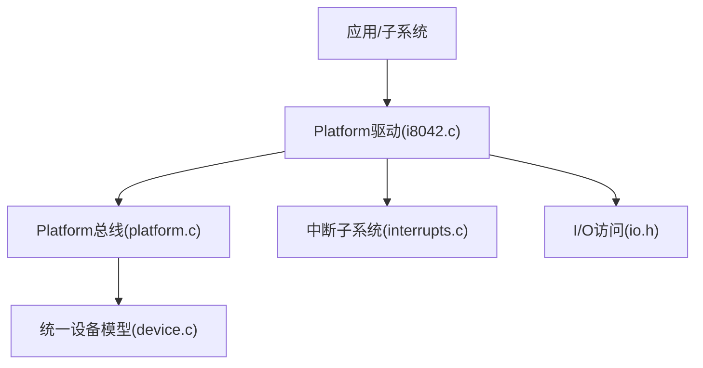
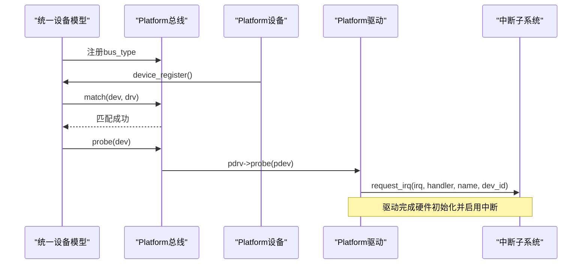
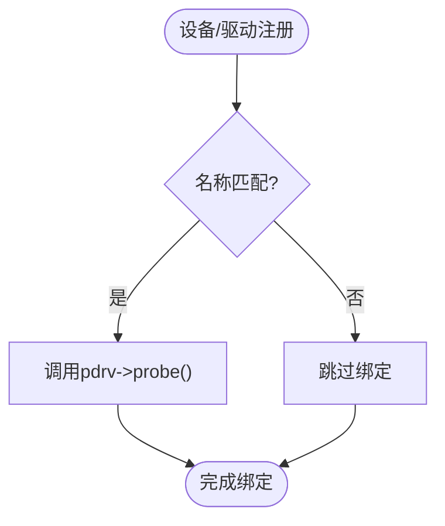
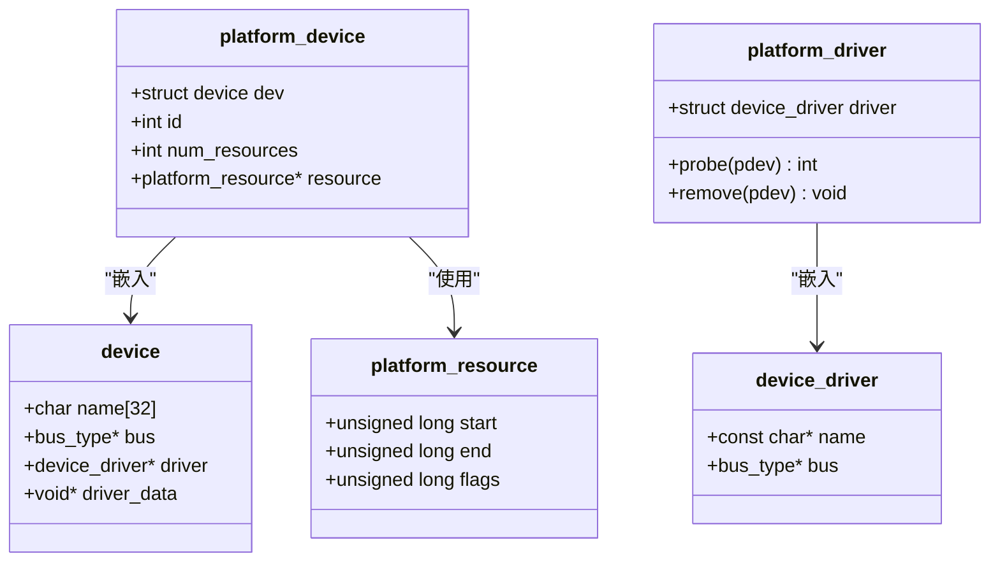
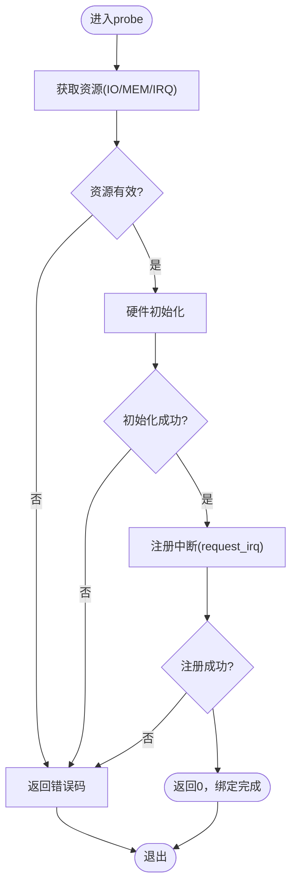
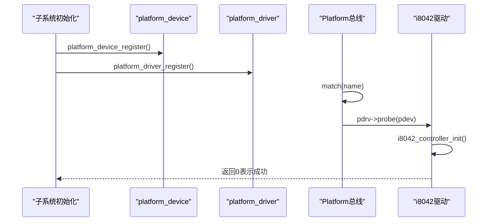
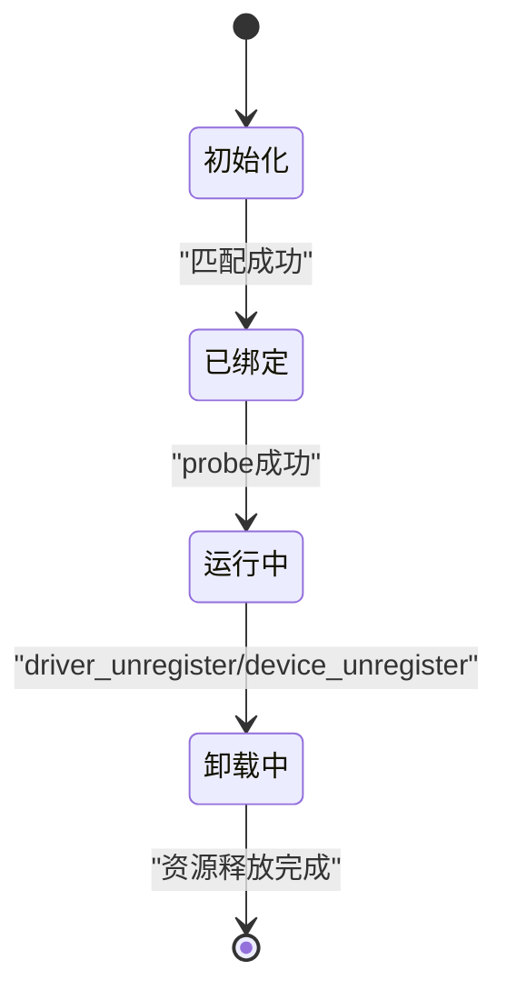
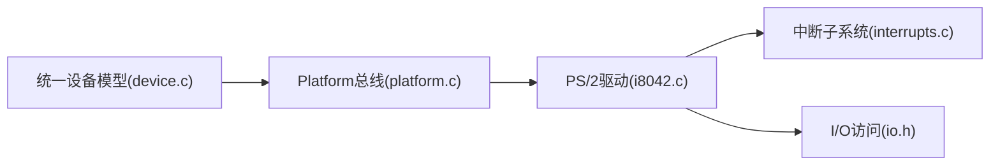

# Platform驱动实现指南

<cite>
**本文引用的文件**
- [includes/device/platform.h](file://includes/device/platform.h)
- [kernel/device/platform.c](file://kernel/device/platform.c)
- [includes/device/device.h](file://includes/device/device.h)
- [kernel/device/device.c](file://kernel/device/device.c)
- [includes/interrupts/interrupts.h](file://includes/interrupts/interrupts.h)
- [kernel/interrupts/interrupts.c](file://kernel/interrupts/interrupts.c)
- [kernel/i8042.c](file://kernel/i8042.c)
- [includes/arch/x86/io.h](file://includes/arch/x86/io.h)
</cite>

## 目录
1. [简介](#简介)
2. [项目结构](#项目结构)
3. [核心组件](#核心组件)
4. [架构总览](#架构总览)
5. [详细组件分析](#详细组件分析)
6. [依赖关系分析](#依赖关系分析)
7. [性能考虑](#性能考虑)
8. [故障排查指南](#故障排查指南)
9. [结论](#结论)
10. [附录](#附录)

## 简介
本指南面向在LulaOS上开发Platform设备驱动的工程师，系统讲解从平台总线初始化、设备与驱动注册、到probe函数实现的完整流程。重点包括：
- platform_driver与platform_device结构体定义及匹配机制
- probe中资源获取、硬件初始化、中断设置的最佳实践
- 典型Platform设备驱动的生命周期（加载、运行、卸载）与错误恢复
- 调试技巧与常见问题定位方法

## 项目结构
LulaOS采用统一设备模型抽象，Platform总线作为其中一种总线类型，用于描述非PCI发现机制的设备（如SoC内部外设、PS/2控制器等）。关键路径如下：
- 头文件：includes/device/platform.h、includes/device/device.h、includes/interrupts/interrupts.h、includes/arch/x86/io.h
- 实现：kernel/device/platform.c、kernel/device/device.c、kernel/interrupts/interrupts.c
- 示例：kernel/i8042.c（PS/2控制器的Platform驱动）

图表来源
- [kernel/device/platform.c:14-77](file://kernel/device/platform.c#L14-L77)
- [kernel/device/device.c:22-87](file://kernel/device/device.c#L22-L87)
- [kernel/i8042.c:267-302](file://kernel/i8042.c#L267-L302)
- [kernel/interrupts/interrupts.c:40-77](file://kernel/interrupts/interrupts.c#L40-L77)
- [includes/arch/x86/io.h:5-33](file://includes/arch/x86/io.h#L5-L33)

章节来源
- [includes/device/platform.h:1-83](file://includes/device/platform.h#L1-L83)
- [kernel/device/platform.c:1-160](file://kernel/device/platform.c#L1-L160)
- [includes/device/device.h:1-80](file://includes/device/device.h#L1-L80)
- [kernel/device/device.c:1-165](file://kernel/device/device.c#L1-L165)

## 核心组件
- 统一设备模型
  - bus_type：总线抽象，提供match/probe/remove回调
  - device/device_driver：设备与驱动基础结构，支持链表管理
- Platform总线
  - platform_bus_type：名称为"platform"的总线实例
  - platform_match：按名称匹配设备与驱动
  - platform_probe/remove：转发到具体驱动的probe/remove
- Platform设备与驱动
  - platform_device：包含设备名、资源列表、ID等
  - platform_driver：包含驱动名、probe/remove回调
- 中断子系统
  - request_irq/free_irq：注册/释放设备中断处理函数
  - do_IRQ：通用中断入口，分发到注册的handler
- I/O访问
  - inb/outb/inw/outw/inl/outl：x86端口I/O访问原语

章节来源
- [includes/device/device.h:26-77](file://includes/device/device.h#L26-L77)
- [kernel/device/device.c:22-165](file://kernel/device/device.c#L22-L165)
- [includes/device/platform.h:23-83](file://includes/device/platform.h#L23-L83)
- [kernel/device/platform.c:14-160](file://kernel/device/platform.c#L14-L160)
- [includes/interrupts/interrupts.h:45-77](file://includes/interrupts/interrupts.h#L45-L77)
- [kernel/interrupts/interrupts.c:9-77](file://kernel/interrupts/interrupts.c#L9-L77)
- [includes/arch/x86/io.h:5-33](file://includes/arch/x86/io.h#L5-L33)

## 架构总览
Platform驱动通过统一设备模型进行生命周期管理。设备与驱动分别注册到Platform总线，总线根据名称匹配后调用驱动的probe。驱动在probe中完成资源获取、硬件初始化、中断注册等。

图表来源
- [kernel/device/device.c:42-87](file://kernel/device/device.c#L42-L87)
- [kernel/device/platform.c:25-77](file://kernel/device/platform.c#L25-L77)
- [kernel/interrupts/interrupts.c:40-77](file://kernel/interrupts/interrupts.c#L40-L77)

## 详细组件分析

### Platform总线与匹配机制
- platform_bus_type：定义总线名称与回调
- platform_match：比较设备名与驱动名是否一致
- platform_probe/remove：将统一设备模型的probe/remove转发到具体驱动

图表来源
- [kernel/device/platform.c:25-77](file://kernel/device/platform.c#L25-L77)
- [kernel/device/device.c:42-87](file://kernel/device/device.c#L42-L87)

章节来源
- [kernel/device/platform.c:14-77](file://kernel/device/platform.c#L14-L77)
- [kernel/device/device.c:42-87](file://kernel/device/device.c#L42-L87)

### platform_driver与platform_device结构体
- platform_driver
  - driver.name：驱动名称，必须与设备名一致才能匹配
  - probe：设备匹配成功后被调用，负责资源获取与初始化
  - remove：设备注销时调用，负责清理资源
- platform_device
  - dev.name：设备名称，用于匹配
  - resource[]：资源数组，支持IO端口、内存映射、中断号
  - num_resources：资源数量
  - id：设备实例ID

图表来源
- [includes/device/device.h:43-66](file://includes/device/device.h#L43-L66)
- [includes/device/platform.h:33-60](file://includes/device/platform.h#L33-L60)

章节来源
- [includes/device/platform.h:33-60](file://includes/device/platform.h#L33-L60)
- [includes/device/device.h:43-66](file://includes/device/device.h#L43-L66)

### probe函数实现要点
- 资源获取
  - 使用platform_get_resource获取IO端口、内存范围或IRQ号
  - 检查返回指针有效性，避免空指针访问
- 硬件初始化
  - 对设备进行自检、配置寄存器、使能功能
  - 参考i8042控制器初始化流程，确保顺序正确且具备超时保护
- 中断设置
  - 使用request_irq注册中断处理函数，传入dev_id便于识别设备
  - 在probe失败或remove时调用free_irq释放中断

图表来源
- [kernel/device/platform.c:142-159](file://kernel/device/platform.c#L142-L159)
- [kernel/interrupts/interrupts.c:40-77](file://kernel/interrupts/interrupts.c#L40-L77)
- [kernel/i8042.c:283-288](file://kernel/i8042.c#L283-L288)

章节来源
- [kernel/device/platform.c:142-159](file://kernel/device/platform.c#L142-L159)
- [kernel/interrupts/interrupts.c:40-77](file://kernel/interrupts/interrupts.c#L40-L77)
- [kernel/i8042.c:283-288](file://kernel/i8042.c#L283-L288)

### 典型Platform设备驱动示例（PS/2控制器）
- 设备定义
  - 定义platform_resource数组，描述IO端口范围
  - 定义platform_device，设置名称、ID、资源指针和数量
- 驱动定义
  - 定义platform_driver，设置driver.name与probe回调
- 初始化流程
  - 调用platform_device_register注册设备
  - 调用platform_driver_register注册驱动
  - 匹配成功后执行probe，完成控制器自检、端口检测、AUX端口启用、配置字节更新、鼠标初始化等

图表来源
- [kernel/i8042.c:267-302](file://kernel/i8042.c#L267-L302)
- [kernel/device/platform.c:84-114](file://kernel/device/platform.c#L84-L114)

章节来源
- [kernel/i8042.c:267-302](file://kernel/i8042.c#L267-L302)
- [kernel/device/platform.c:84-114](file://kernel/device/platform.c#L84-L114)

### 中断处理与DMA说明
- 中断处理
  - 使用request_irq注册handler，free_irq释放
  - do_IRQ作为通用入口，调用已注册的handler
- DMA操作
  - 当前仓库未提供DMA相关API；如需DMA，应在后续扩展中增加DMA控制器驱动与接口

章节来源
- [includes/interrupts/interrupts.h:50-55](file://includes/interrupts/interrupts.h#L50-L55)
- [kernel/interrupts/interrupts.c:40-77](file://kernel/interrupts/interrupts.c#L40-L77)
- [kernel/interrupts/interrupts.c:84-108](file://kernel/interrupts/interrupts.c#L84-L108)

### 驱动生命周期管理
- 加载
  - 先注册Platform总线，再注册设备与驱动
  - 匹配成功后调用probe完成初始化
- 运行
  - 正常响应中断、处理I/O请求
- 卸载
  - 调用driver_unregister解除所有绑定设备
  - 设备注销时调用bus->remove，驱动应释放资源与中断

图表来源
- [kernel/device/device.c:130-165](file://kernel/device/device.c#L130-L165)
- [kernel/device/platform.c:55-62](file://kernel/device/platform.c#L55-L62)

章节来源
- [kernel/device/device.c:130-165](file://kernel/device/device.c#L130-L165)
- [kernel/device/platform.c:55-62](file://kernel/device/platform.c#L55-L62)

## 依赖关系分析
- Platform总线依赖统一设备模型进行设备/驱动管理与匹配
- 驱动依赖中断子系统注册中断处理函数
- 驱动依赖I/O访问原语进行寄存器读写
- i8042驱动展示了完整的Platform设备/驱动注册与probe流程

图表来源
- [kernel/device/device.c:22-87](file://kernel/device/device.c#L22-L87)
- [kernel/device/platform.c:14-77](file://kernel/device/platform.c#L14-L77)
- [kernel/i8042.c:267-302](file://kernel/i8042.c#L267-L302)
- [kernel/interrupts/interrupts.c:40-77](file://kernel/interrupts/interrupts.c#L40-L77)
- [includes/arch/x86/io.h:5-33](file://includes/arch/x86/io.h#L5-L33)

章节来源
- [kernel/device/device.c:22-87](file://kernel/device/device.c#L22-L87)
- [kernel/device/platform.c:14-77](file://kernel/device/platform.c#L14-L77)
- [kernel/i8042.c:267-302](file://kernel/i8042.c#L267-L302)
- [kernel/interrupts/interrupts.c:40-77](file://kernel/interrupts/interrupts.c#L40-L77)
- [includes/arch/x86/io.h:5-33](file://includes/arch/x86/io.h#L5-L33)

## 性能考虑
- 避免在probe中进行耗时操作，尽量快速完成资源获取与基本初始化
- 中断处理函数应尽量短小，复杂逻辑可延后至软中断或工作队列
- 合理设置超时与重试次数，防止死锁或长时间阻塞
- 资源访问前进行有效性检查，减少无效I/O操作

## 故障排查指南
- 设备无名称
  - 现象：注册设备时报错“设备无名称”
  - 原因：platform_device.dev.name为空
  - 解决：确保在注册前设置有效的设备名
- 驱动未匹配
  - 现象：probe未被调用
  - 原因：驱动名与设备名不一致
  - 解决：核对platform_driver.driver.name与platform_device.dev.name
- 中断未触发
  - 现象：注册中断后无回调
  - 原因：未正确配置IOAPIC/LAPIC或向量冲突
  - 解决：检查request_irq返回值，确认ioapic_enable_irq调用
- 资源获取失败
  - 现象：platform_get_resource返回NULL
  - 原因：资源类型或序号不匹配
  - 解决：核对resource数组定义与flags、index

章节来源
- [kernel/device/platform.c:92-97](file://kernel/device/platform.c#L92-L97)
- [kernel/device/platform.c:107-113](file://kernel/device/platform.c#L107-L113)
- [kernel/interrupts/interrupts.c:40-77](file://kernel/interrupts/interrupts.c#L40-L77)
- [kernel/device/platform.c:142-159](file://kernel/device/platform.c#L142-L159)

## 结论
LulaOS的Platform驱动基于统一设备模型，提供了清晰的设备/驱动匹配与生命周期管理机制。通过platform_device与platform_driver的结构化定义，结合中断子系统与I/O访问原语，开发者可以高效实现稳定的设备驱动。建议遵循本文的流程与最佳实践，确保驱动的正确性与可维护性。

## 附录
- 常用宏与常量
  - IORESOURCE_IO、IORESOURCE_MEM、IORESOURCE_IRQ：资源标志
  - FIRST_EXTERNAL_VECTOR、NR_IRQS：中断向量范围
- 参考实现
  - PS/2控制器驱动展示了完整的Platform设备/驱动注册与probe流程

章节来源
- [includes/device/platform.h:23-26](file://includes/device/platform.h#L23-L26)
- [includes/interrupts/interrupts.h:35-42](file://includes/interrupts/interrupts.h#L35-L42)
- [kernel/i8042.c:267-302](file://kernel/i8042.c#L267-L302)