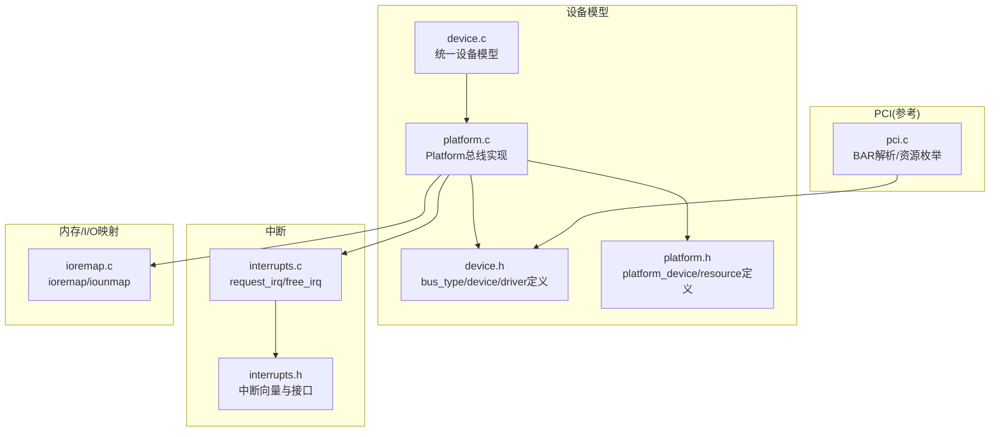
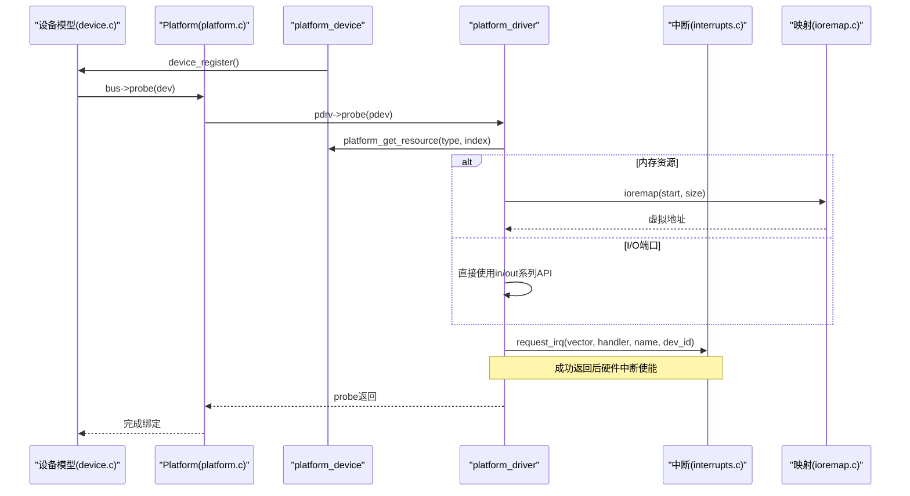
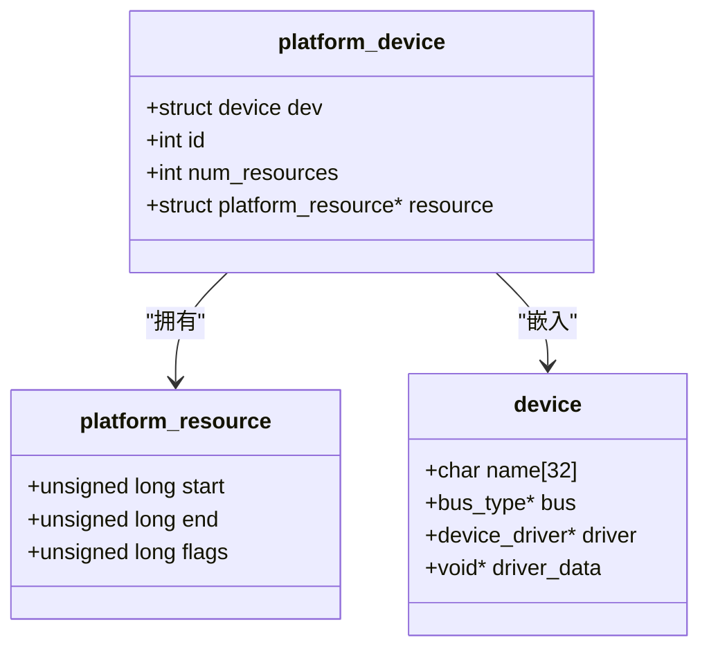
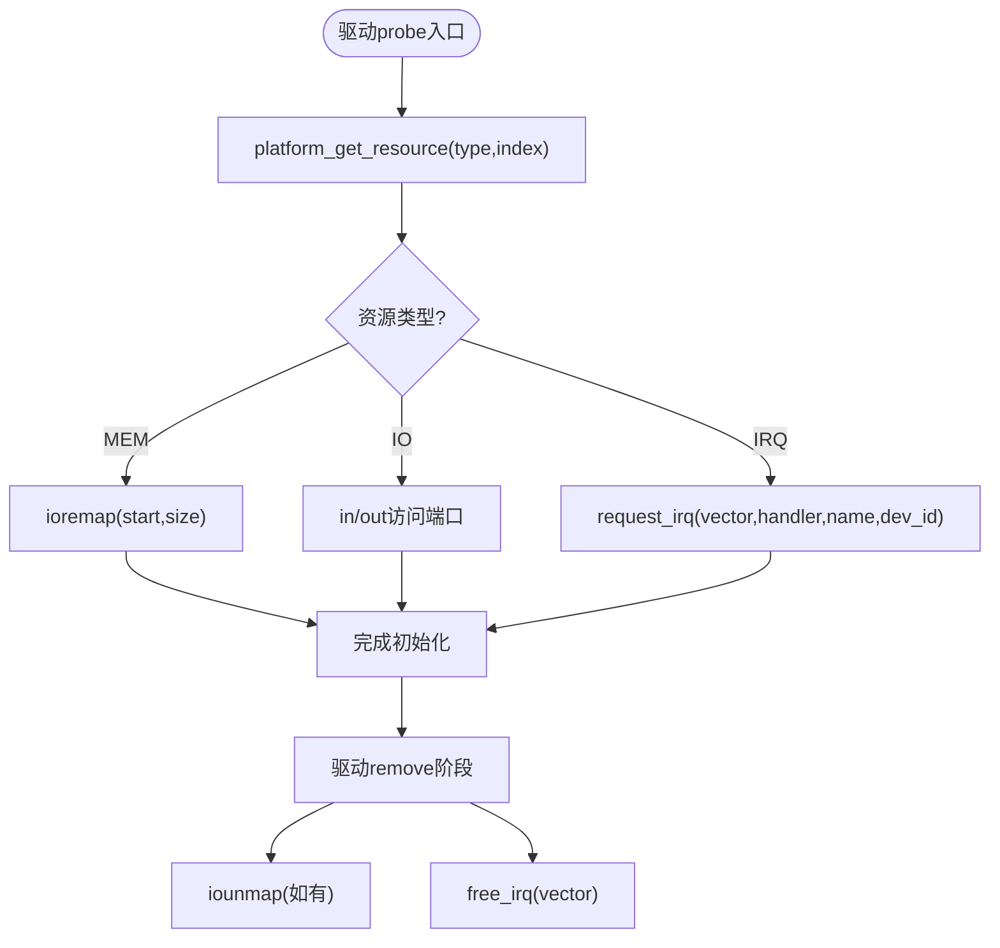
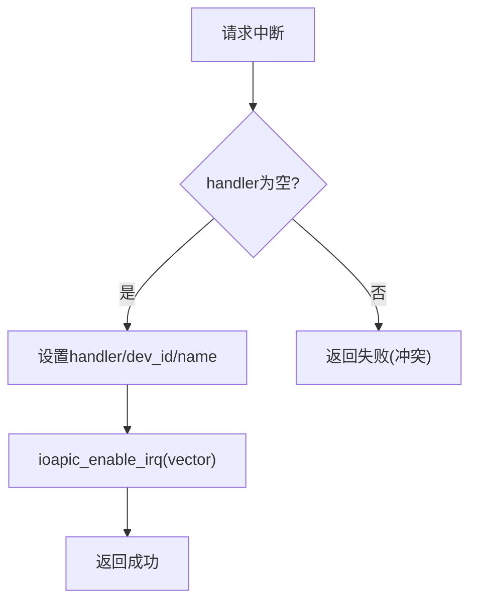
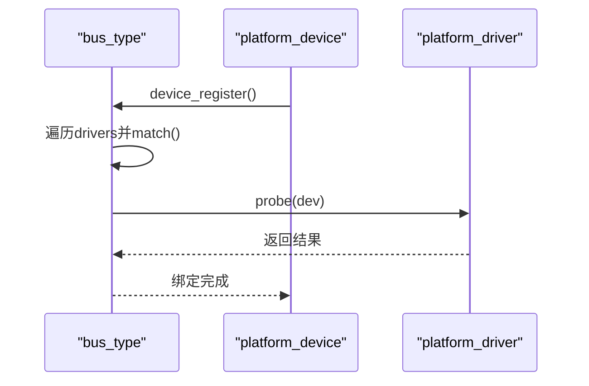
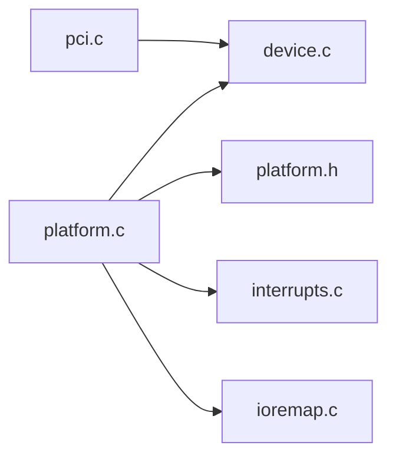

# 资源管理与最佳实践

<cite>
**本文引用的文件**
- [kernel/device/platform.c](file://kernel/device/platform.c)
- [includes/device/platform.h](file://includes/device/platform.h)
- [kernel/device/device.c](file://kernel/device/device.c)
- [includes/device/device.h](file://includes/device/device.h)
- [kernel/interrupts/interrupts.c](file://kernel/interrupts/interrupts.c)
- [includes/interrupts/interrupts.h](file://includes/interrupts/interrupts.h)
- [arch/x86/kernel/mm/ioremap.c](file://arch/x86/kernel/mm/ioremap.c)
- [kernel/pci/pci.c](file://kernel/pci/pci.c)
</cite>

## 目录
1. [简介](#简介)
2. [项目结构](#项目结构)
3. [核心组件](#核心组件)
4. [架构总览](#架构总览)
5. [详细组件分析](#详细组件分析)
6. [依赖关系分析](#依赖关系分析)
7. [性能考虑](#性能考虑)
8. [故障排查指南](#故障排查指南)
9. [结论](#结论)
10. [附录：代码示例与常见错误修复](#附录代码示例与常见错误修复)

## 简介
本文件面向LulaOS的Platform设备资源管理，聚焦以下目标：
- 明确Platform设备可用资源类型（内存区域、I/O端口、中断线；DMA通道在平台总线中未提供专用API）
- 说明资源的分配与管理机制，包括request_irq等API的使用
- 文档化资源冲突检测与解决策略，处理竞争与重复分配问题
- 提供资源泄漏检测与预防的最佳实践
- 解释多设备环境下的资源协调机制
- 给出完整的资源管理模式示例与常见错误的修复方法

## 项目结构
围绕Platform设备资源管理的核心代码分布在以下位置：
- Platform总线与设备模型：device.c、platform.c、device.h、platform.h
- 中断子系统：interrupts.c、interrupts.h
- I/O映射与内存访问：ioremap.c
- PCI子系统（作为对比参考）：pci.c

图表来源
- [kernel/device/device.c:22-165](file://kernel/device/device.c#L22-L165)
- [kernel/device/platform.c:14-160](file://kernel/device/platform.c#L14-L160)
- [includes/device/device.h:32-77](file://includes/device/device.h#L32-L77)
- [includes/device/platform.h:23-81](file://includes/device/platform.h#L23-L81)
- [kernel/interrupts/interrupts.c:18-77](file://kernel/interrupts/interrupts.c#L18-L77)
- [includes/interrupts/interrupts.h:35-55](file://includes/interrupts/interrupts.h#L35-L55)
- [arch/x86/kernel/mm/ioremap.c:215-281](file://arch/x86/kernel/mm/ioremap.c#L215-L281)
- [kernel/pci/pci.c:95-157](file://kernel/pci/pci.c#L95-L157)

章节来源
- [kernel/device/device.c:22-165](file://kernel/device/device.c#L22-L165)
- [kernel/device/platform.c:14-160](file://kernel/device/platform.c#L14-L160)
- [includes/device/device.h:32-77](file://includes/device/device.h#L32-L77)
- [includes/device/platform.h:23-81](file://includes/device/platform.h#L23-L81)
- [kernel/interrupts/interrupts.c:18-77](file://kernel/interrupts/interrupts.c#L18-L77)
- [includes/interrupts/interrupts.h:35-55](file://includes/interrupts/interrupts.h#L35-L55)
- [arch/x86/kernel/mm/ioremap.c:215-281](file://arch/x86/kernel/mm/ioremap.c#L215-L281)
- [kernel/pci/pci.c:95-157](file://kernel/pci/pci.c#L95-L157)

## 核心组件
- 统一设备模型：提供bus_type、device、device_driver以及注册/匹配/探测流程
- Platform总线：基于名称匹配的platform_device与platform_driver绑定，提供资源查询接口
- 中断子系统：提供request_irq/free_irq进行中断注册与释放，并维护中断描述符表
- I/O映射：提供ioremap将物理地址映射到内核虚拟地址，供MMIO访问
- PCI子系统（参考）：展示如何从硬件BAR解析出资源范围，便于理解资源语义

章节来源
- [kernel/device/device.c:22-165](file://kernel/device/device.c#L22-L165)
- [kernel/device/platform.c:14-160](file://kernel/device/platform.c#L14-L160)
- [kernel/interrupts/interrupts.c:18-77](file://kernel/interrupts/interrupts.c#L18-L77)
- [arch/x86/kernel/mm/ioremap.c:215-281](file://arch/x86/kernel/mm/ioremap.c#L215-L281)
- [kernel/pci/pci.c:95-157](file://kernel/pci/pci.c#L95-L157)

## 架构总览
下图展示了Platform设备从注册到驱动探测、资源获取与中断使用的整体流程。

图表来源
- [kernel/device/device.c:42-87](file://kernel/device/device.c#L42-L87)
- [kernel/device/platform.c:37-50](file://kernel/device/platform.c#L37-L50)
- [kernel/device/platform.c:142-159](file://kernel/device/platform.c#L142-L159)
- [kernel/interrupts/interrupts.c:40-58](file://kernel/interrupts/interrupts.c#L40-L58)
- [arch/x86/kernel/mm/ioremap.c:230-281](file://arch/x86/kernel/mm/ioremap.c#L230-L281)

## 详细组件分析

### Platform设备与资源类型
- 资源类型
  - 内存区域：IORESOURCE_MEM，start/end表示MMIO范围
  - I/O端口：IORESOURCE_IO，start/end表示端口范围
  - 中断线：IORESOURCE_IRQ，start=end=IRQ号
- 数据结构
  - platform_resource：包含start、end、flags
  - platform_device：嵌入device，持有resource数组及数量
- 资源查询
  - platform_get_resource：按type和index遍历资源数组，返回对应资源指针

图表来源
- [includes/device/platform.h:23-49](file://includes/device/platform.h#L23-L49)
- [includes/device/device.h:49-55](file://includes/device/device.h#L49-L55)

章节来源
- [includes/device/platform.h:23-81](file://includes/device/platform.h#L23-L81)
- [kernel/device/platform.c:142-159](file://kernel/device/platform.c#L142-L159)

### 资源分配与管理机制
- 内存区域
  - 通过platform_get_resource获取MMIO范围
  - 使用ioremap将物理地址映射为内核可访问的虚拟地址
  - 注意：当前实现未提供request_mem_region/release_mem_region API，需由驱动自行记录已映射范围并在remove中调用iounmap
- I/O端口
  - 通过platform_get_resource获取端口范围
  - 使用arch层提供的in/out系列函数直接访问
  - 同样缺少request_io_port/release_io_port API，需驱动自行管理
- 中断线
  - 通过platform_get_resource获取IRQ号
  - 使用request_irq注册中断处理函数，成功后自动解除屏蔽使能中断
  - 使用free_irq注销中断，先屏蔽再清理handler，避免悬空触发

图表来源
- [kernel/device/platform.c:142-159](file://kernel/device/platform.c#L142-L159)
- [arch/x86/kernel/mm/ioremap.c:230-281](file://arch/x86/kernel/mm/ioremap.c#L230-L281)
- [kernel/interrupts/interrupts.c:40-77](file://kernel/interrupts/interrupts.c#L40-L77)

章节来源
- [kernel/device/platform.c:142-159](file://kernel/device/platform.c#L142-L159)
- [arch/x86/kernel/mm/ioremap.c:230-281](file://arch/x86/kernel/mm/ioremap.c#L230-L281)
- [kernel/interrupts/interrupts.c:40-77](file://kernel/interrupts/interrupts.c#L40-L77)

### 资源冲突检测与解决策略
- 中断冲突
  - request_irq内部检查irq_desc[idx].handler是否非空，若已被占用则返回失败
  - free_irq会先屏蔽中断再清空handler，防止竞态
- 内存/I/O端口冲突
  - 当前无全局资源占用表，重复映射或访问不会自动报错
  - 建议：驱动在probe时记录已申请的资源范围，在remove中释放；必要时在系统级增加资源表以检测重叠
- DMA通道
  - Platform总线未提供DMA通道管理API；DMA通常由具体控制器驱动管理（如ATA子系统中PRD表分配）
  - 在多设备环境下，应确保各DMA控制器独立管理其通道，避免跨控制器共享

图表来源
- [kernel/interrupts/interrupts.c:40-58](file://kernel/interrupts/interrupts.c#L40-L58)

章节来源
- [kernel/interrupts/interrupts.c:40-77](file://kernel/interrupts/interrupts.c#L40-L77)

### 多设备环境下的资源协调机制
- 设备模型层面
  - bus_type维护devices/drivers链表，device_register/driver_register触发匹配与probe
  - platform_match基于名称匹配，确保同一名称的设备与驱动仅绑定一次
- 资源层面
  - 每个platform_device拥有独立的resource数组，互不干扰
  - 中断由全局irq_desc表管理，需保证vector唯一
  - 内存/I/O端口需驱动自行去重与协调，建议在板级初始化阶段集中声明资源，避免重复

图表来源
- [kernel/device/device.c:42-87](file://kernel/device/device.c#L42-L87)
- [kernel/device/platform.c:25-50](file://kernel/device/platform.c#L25-L50)

章节来源
- [kernel/device/device.c:42-87](file://kernel/device/device.c#L42-L87)
- [kernel/device/platform.c:25-50](file://kernel/device/platform.c#L25-L50)

## 依赖关系分析
- platform.c依赖device.c的统一设备模型接口
- interrupts.c提供中断API，被platform驱动在probe中使用
- ioremap.c提供MMIO映射能力，被platform驱动用于内存资源访问
- pci.c作为参考，展示资源枚举与BAR解析过程

图表来源
- [kernel/device/platform.c:9-13](file://kernel/device/platform.c#L9-L13)
- [kernel/device/device.c:9-11](file://kernel/device/device.c#L9-L11)
- [kernel/interrupts/interrupts.c:1-7](file://kernel/interrupts/interrupts.c#L1-L7)
- [arch/x86/kernel/mm/ioremap.c:29-37](file://arch/x86/kernel/mm/ioremap.c#L29-L37)
- [kernel/pci/pci.c:16-23](file://kernel/pci/pci.c#L16-L23)

章节来源
- [kernel/device/platform.c:9-13](file://kernel/device/platform.c#L9-L13)
- [kernel/device/device.c:9-11](file://kernel/device/device.c#L9-L11)
- [kernel/interrupts/interrupts.c:1-7](file://kernel/interrupts/interrupts.c#L1-L7)
- [arch/x86/kernel/mm/ioremap.c:29-37](file://arch/x86/kernel/mm/ioremap.c#L29-L37)
- [kernel/pci/pci.c:16-23](file://kernel/pci/pci.c#L16-L23)

## 性能考虑
- 中断注册/释放
  - request_irq/free_irq涉及IOAPIC寄存器操作，应避免频繁调用；批量初始化时集中注册
- 内存映射
  - ioremap建立页表映射并刷新TLB，适合低频初始化；运行时尽量复用映射
- 资源查询
  - platform_get_resource线性扫描资源数组，资源数量较少时开销可忽略

## 故障排查指南
- 中断未触发
  - 检查request_irq返回值，确认handler已设置且中断已使能
  - 确认free_irq未在probe前调用导致handler为空
- 内存访问异常
  - 检查ioremap返回值是否为NULL，确认映射成功
  - 确认未越界访问映射区域
- 资源冲突
  - 中断：多个驱动注册相同vector会导致失败
  - 内存/I/O端口：重复映射可能导致不可预期行为，需驱动自行去重

章节来源
- [kernel/interrupts/interrupts.c:40-77](file://kernel/interrupts/interrupts.c#L40-L77)
- [arch/x86/kernel/mm/ioremap.c:230-281](file://arch/x86/kernel/mm/ioremap.c#L230-L281)

## 结论
LulaOS的Platform设备资源管理基于统一设备模型，提供名称匹配的设备/驱动绑定机制。资源类型涵盖内存区域、I/O端口与中断线，其中中断资源具备冲突检测与释放保护。内存与I/O端口尚未提供全局占用表，需要驱动自行管理生命周期。DMA通道不在Platform总线范围内，由具体控制器驱动负责。遵循本文的最佳实践可有效避免资源竞争与泄漏，提升系统稳定性。

## 附录：代码示例与常见错误修复

### 正确的资源管理模式（示意）
- 在probe中：
  - 使用platform_get_resource获取资源
  - 对内存资源调用ioremap并保存虚拟地址
  - 对中断资源调用request_irq并保存dev_id
- 在remove中：
  - 调用free_irq释放中断
  - 调用iounmap释放映射
  - 清理其他动态分配资源

章节来源
- [kernel/device/platform.c:142-159](file://kernel/device/platform.c#L142-L159)
- [arch/x86/kernel/mm/ioremap.c:230-281](file://arch/x86/kernel/mm/ioremap.c#L230-L281)
- [kernel/interrupts/interrupts.c:40-77](file://kernel/interrupts/interrupts.c#L40-L77)

### 常见错误与修复
- 忘记释放中断
  - 现象：系统重启后再次加载驱动时报中断冲突
  - 修复：确保remove中调用free_irq
- 重复映射内存
  - 现象：多次ioremap导致虚拟地址空间浪费或覆盖
  - 修复：在probe中缓存映射地址，remove中调用iounmap
- 未检查request_irq返回值
  - 现象：中断未注册但驱动继续运行，导致中断丢失
  - 修复：检查返回值，失败时回滚并返回错误

章节来源
- [kernel/interrupts/interrupts.c:40-77](file://kernel/interrupts/interrupts.c#L40-L77)
- [arch/x86/kernel/mm/ioremap.c:230-281](file://arch/x86/kernel/mm/ioremap.c#L230-L281)