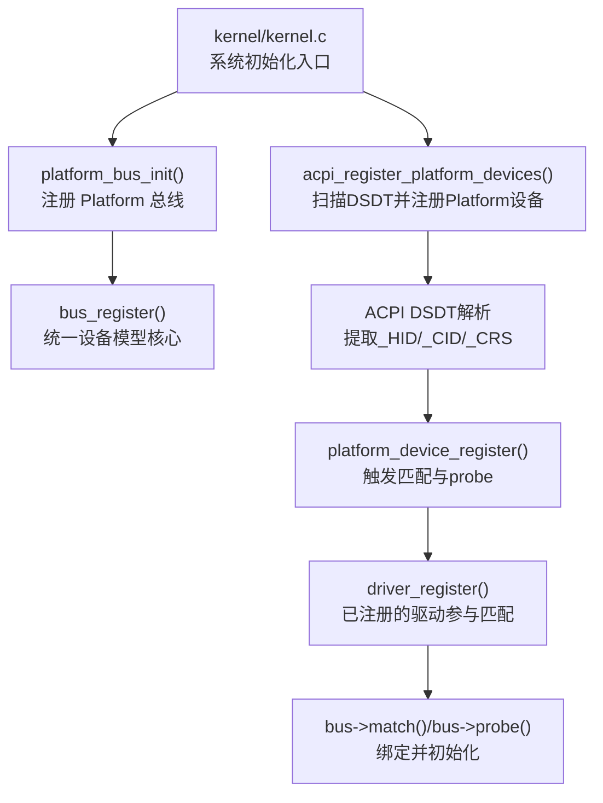
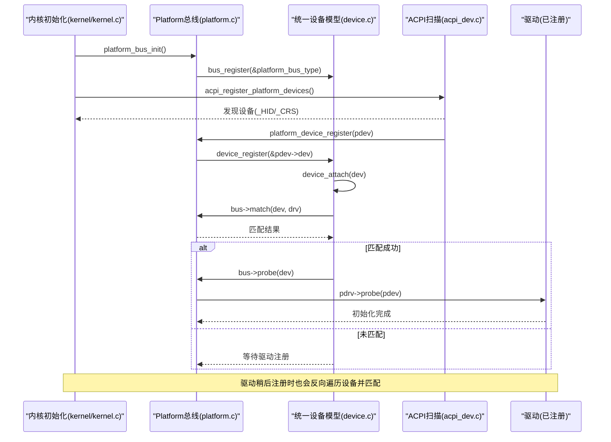
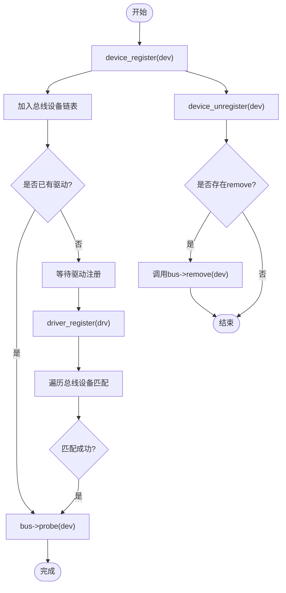
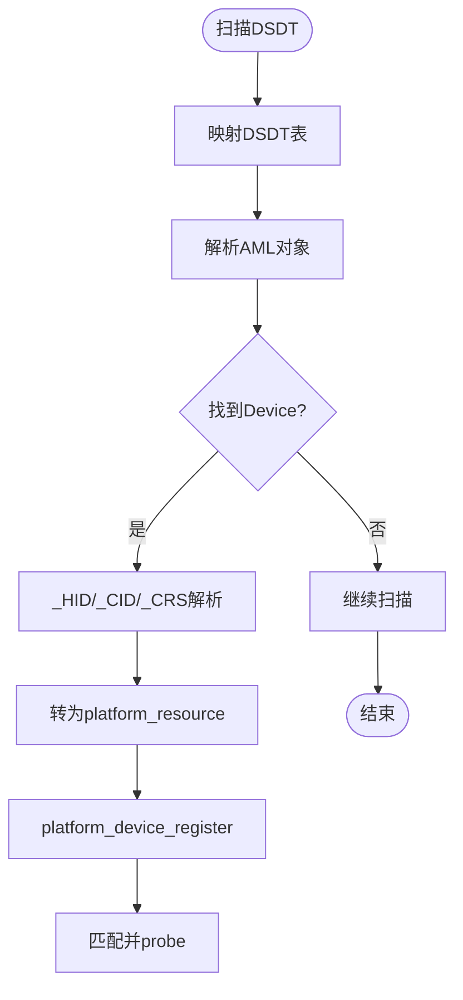
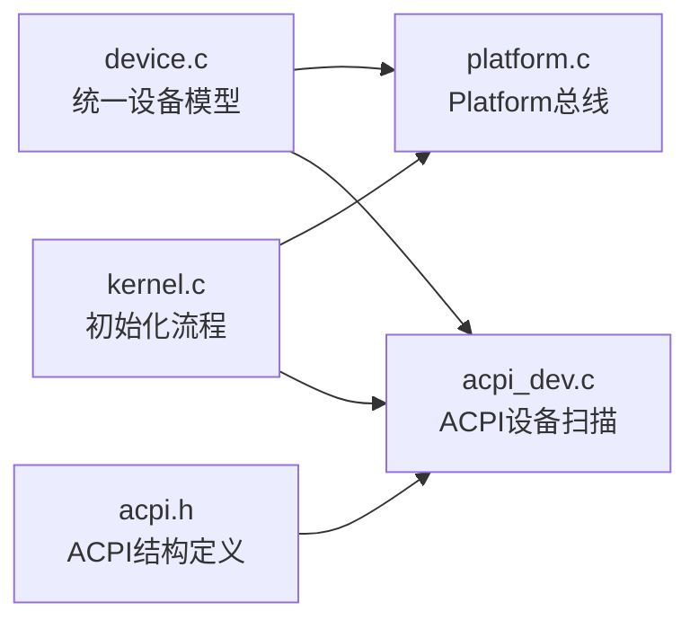

# 设备模型基础概念

<cite>
**本文引用的文件**
- [includes/device/device.h](file://includes/device/device.h)
- [kernel/device/device.c](file://kernel/device/device.c)
- [includes/device/platform.h](file://includes/device/platform.h)
- [kernel/device/platform.c](file://kernel/device/platform.c)
- [kernel/device/acpi_dev.c](file://kernel/device/acpi_dev.c)
- [includes/arch/x86/acpi.h](file://includes/arch/x86/acpi.h)
- [kernel/kernel.c](file://kernel/kernel.c)
</cite>

## 目录
1. [简介](#简介)
2. [项目结构](#项目结构)
3. [核心组件](#核心组件)
4. [架构总览](#架构总览)
5. [详细组件分析](#详细组件分析)
6. [依赖关系分析](#依赖关系分析)
7. [性能与可扩展性](#性能与可扩展性)
8. [故障排查指南](#故障排查指南)
9. [结论](#结论)
10. [附录：使用示例与最佳实践](#附录使用示例与最佳实践)

## 简介
本文件面向LulaOS设备驱动开发者，系统化阐述统一设备模型的基础概念与设计思想。重点包括：
- 总线类型 bus_type、设备 device、驱动 device_driver 的职责与协作关系
- 设备总线的作用与设备/驱动匹配机制
- 设备生命周期管理（注册、注销）
- 通过 ACPI DSDT 扫描设备树节点并自动注册为 Platform 设备
- 常见设计模式与最佳实践建议

## 项目结构
LulaOS 的统一设备模型位于 kernel/device 与 includes/device 中，Platform 总线实现与 ACPI 设备发现分别位于 platform.c 与 acpi_dev.c；内核初始化流程在 kernel/kernel.c 中串联各子系统。

图表来源
- [kernel/kernel.c:96-100](file://kernel/kernel.c#L96-L100)
- [kernel/device/platform.c:70-77](file://kernel/device/platform.c#L70-L77)
- [kernel/device/device.c:22-34](file://kernel/device/device.c#L22-L34)
- [kernel/device/acpi_dev.c:749-796](file://kernel/device/acpi_dev.c#L749-L796)

章节来源
- [kernel/kernel.c:96-100](file://kernel/kernel.c#L96-L100)
- [kernel/device/platform.c:70-77](file://kernel/device/platform.c#L70-L77)
- [kernel/device/device.c:22-34](file://kernel/device/device.c#L22-L34)
- [kernel/device/acpi_dev.c:749-796](file://kernel/device/acpi_dev.c#L749-L796)

## 核心组件
- bus_type：总线抽象，维护该总线上的设备链表与驱动链表，并提供 match/probe/remove 回调接口。
- device：设备基础结构，包含名称、所属总线、驱动指针等，作为所有总线设备的基类嵌入点。
- device_driver：驱动基础结构，包含名称、所属总线等，作为所有总线驱动的基类嵌入点。

这些结构体共同构成“总线-设备-驱动”三元模型，使不同总线（如 Platform、PCI、USB）可以复用统一的注册、匹配与生命周期管理机制。

章节来源
- [includes/device/device.h:26-66](file://includes/device/device.h#L26-L66)
- [kernel/device/device.c:42-87](file://kernel/device/device.c#L42-L87)

## 架构总览
统一设备模型的核心流程如下：
- 总线注册：平台总线在早期初始化时注册，提供 match/probe/remove。
- 设备注册：设备加入总线设备链表后尝试与已注册驱动匹配。
- 驱动注册：驱动加入总线驱动链表后尝试与已注册设备匹配。
- 匹配成功：调用总线 probe，完成设备初始化。
- 注销流程：从总线移除，必要时调用 remove 清理资源。

图表来源
- [kernel/kernel.c:96-100](file://kernel/kernel.c#L96-L100)
- [kernel/device/platform.c:70-77](file://kernel/device/platform.c#L70-L77)
- [kernel/device/device.c:42-87](file://kernel/device/device.c#L42-L87)
- [kernel/device/acpi_dev.c:749-796](file://kernel/device/acpi_dev.c#L749-L796)

## 详细组件分析

### 总线类型 bus_type
- 职责：定义总线名称、维护设备/驱动链表、提供匹配与探测回调。
- 关键点：
  - 每个总线一个实例（如 platform_bus_type）。
  - 注册时将设备/驱动链表初始化并加入全局总线列表。
  - match 由具体总线实现（Platform 按名称匹配）。
  - probe/remove 由总线转发到具体驱动回调。

章节来源
- [includes/device/device.h:26-41](file://includes/device/device.h#L26-L41)
- [kernel/device/device.c:22-34](file://kernel/device/device.c#L22-L34)
- [kernel/device/platform.c:14-30](file://kernel/device/platform.c#L14-L30)

### 设备 device 与驱动 device_driver
- device：
  - 包含 name、bus、driver、driver_data 等字段。
  - 各总线设备结构体需将 device 作为首成员嵌入，以便容器转换。
- device_driver：
  - 包含 name、bus 等字段。
  - 各总线驱动结构体需将 device_driver 作为首成员嵌入。

章节来源
- [includes/device/device.h:43-66](file://includes/device/device.h#L43-L66)

### Platform 总线与设备/驱动
- Platform 总线用于非 PCI 设备（SoC 内部外设、PS/2、中断控制器等）。
- 匹配规则：platform_device.dev.name 与 platform_driver.driver.name 字符串相等即匹配。
- 资源描述：platform_resource 表示 I/O、内存、IRQ 等资源范围。
- 辅助函数：
  - to_platform_device / to_platform_driver：容器转换宏。
  - platform_find_device：按名称查找设备。
  - platform_get_resource：按类型和序号获取资源。

章节来源
- [includes/device/platform.h:28-83](file://includes/device/platform.h#L28-L83)
- [kernel/device/platform.c:25-62](file://kernel/device/platform.c#L25-L62)
- [kernel/device/platform.c:116-159](file://kernel/device/platform.c#L116-L159)

### 设备生命周期管理
- 注册：
  - device_register：将设备加入总线设备链表，并尝试匹配已注册驱动。
  - driver_register：将驱动加入总线驱动链表，并尝试匹配已注册设备。
- 注销：
  - device_unregister：从总线移除设备，若已绑定驱动且存在 remove 回调则调用。
  - driver_unregister：从总线移除驱动，解除所有绑定该驱动的设备并调用 remove。

图表来源
- [kernel/device/device.c:94-123](file://kernel/device/device.c#L94-L123)
- [kernel/device/device.c:130-164](file://kernel/device/device.c#L130-L164)

章节来源
- [kernel/device/device.c:94-123](file://kernel/device/device.c#L94-L123)
- [kernel/device/device.c:130-164](file://kernel/device/device.c#L130-L164)

### 设备树与设备节点（ACPI DSDT）
- ACPI DSDT 中的 AML 描述了设备树结构，包含 Scope、Device、Name 对象。
- 扫描过程：
  - 解析 NameString 构建路径。
  - 提取 _HID（硬件ID）、_CID（兼容ID）、_CRS（当前资源状态）。
  - 将 _CRS 中的 I/O、Memory、IRQ 资源转换为 platform_resource。
  - 将发现的设备以 Platform 设备形式注册，进入统一设备模型。
- 关键数据结构：
  - acpi_dsdt_device：保存设备名、HID、CID、资源数组。
  - acpi_context：全局上下文，记录 DSDT 地址及枚举到的设备数量与详情。

图表来源
- [kernel/device/acpi_dev.c:632-740](file://kernel/device/acpi_dev.c#L632-L740)
- [kernel/device/acpi_dev.c:749-796](file://kernel/device/acpi_dev.c#L749-L796)
- [includes/arch/x86/acpi.h:202-240](file://includes/arch/x86/acpi.h#L202-L240)

章节来源
- [kernel/device/acpi_dev.c:632-740](file://kernel/device/acpi_dev.c#L632-L740)
- [kernel/device/acpi_dev.c:749-796](file://kernel/device/acpi_dev.c#L749-L796)
- [includes/arch/x86/acpi.h:202-240](file://includes/arch/x86/acpi.h#L202-L240)

## 依赖关系分析
- 初始化顺序：
  - 先注册 Platform 总线（platform_bus_init），再扫描 ACPI 设备（acpi_register_platform_devices），随后注册各类驱动（键盘、鼠标等）。
- 模块耦合：
  - 统一设备模型（device.c）被 Platform 总线（platform.c）与 ACPI 设备发现（acpi_dev.c）共同依赖。
  - ACPI 头文件（acpi.h）定义了设备描述与上下文结构，供 acpi_dev.c 使用。
- 外部集成点：
  - 其他总线（如 PCI、USB）可复用统一设备模型，只需实现各自的 bus_type 与匹配逻辑。

图表来源
- [kernel/device/device.c:22-34](file://kernel/device/device.c#L22-L34)
- [kernel/device/platform.c:70-77](file://kernel/device/platform.c#L70-L77)
- [kernel/device/acpi_dev.c:749-796](file://kernel/device/acpi_dev.c#L749-L796)
- [includes/arch/x86/acpi.h:202-240](file://includes/arch/x86/acpi.h#L202-L240)
- [kernel/kernel.c:96-100](file://kernel/kernel.c#L96-L100)

章节来源
- [kernel/device/device.c:22-34](file://kernel/device/device.c#L22-L34)
- [kernel/device/platform.c:70-77](file://kernel/device/platform.c#L70-L77)
- [kernel/device/acpi_dev.c:749-796](file://kernel/device/acpi_dev.c#L749-L796)
- [includes/arch/x86/acpi.h:202-240](file://includes/arch/x86/acpi.h#L202-L240)
- [kernel/kernel.c:96-100](file://kernel/kernel.c#L96-L100)

## 性能与可扩展性
- 匹配复杂度：
  - 设备注册时遍历总线驱动链表进行匹配；驱动注册时遍历总线设备链表进行匹配。总体为 O(N*M)，N 为设备数，M 为驱动数。对于小规模嵌入式系统可接受。
- 优化建议：
  - 对高频匹配场景可引入哈希索引（如按名称建立驱动索引）。
  - 避免在 probe 中进行耗时操作，尽量延迟到用户态或异步任务。
- 可扩展性：
  - 新增总线只需实现 bus_type 的 match/probe/remove，并复用统一设备模型的注册/注销流程。
  - 设备与驱动结构体遵循“基类首成员”约定，便于容器转换与统一管理。

[本节为通用指导，不直接分析具体文件]

## 故障排查指南
- 常见问题：
  - 设备无名称：platform_device_register 会检查 dev.name 是否为空，为空则返回错误。
  - 驱动未匹配：检查 platform_driver.driver.name 是否与 platform_device.dev.name 一致。
  - 资源缺失：确认 _CRS 是否正确解析为 platform_resource，并通过 platform_get_resource 获取。
- 调试手段：
  - 查看 printk 输出，确认总线注册、设备注册、匹配与 probe 日志。
  - 检查 ACPI DSDT 扫描日志，确认 HID/CID/资源信息是否正确提取。

章节来源
- [kernel/device/platform.c:84-98](file://kernel/device/platform.c#L84-L98)
- [kernel/device/platform.c:25-30](file://kernel/device/platform.c#L25-L30)
- [kernel/device/acpi_dev.c:749-796](file://kernel/device/acpi_dev.c#L749-L796)

## 结论
LulaOS 的统一设备模型以 bus_type、device、device_driver 为核心，实现了跨总线的设备/驱动管理与生命周期控制。Platform 总线通过名称匹配简化了 SoC 内部外设的管理，ACPI DSDT 扫描将固件描述的设备树转化为系统内可管理的设备节点，从而形成“固件描述—系统发现—驱动绑定”的完整闭环。遵循“基类首成员”、“回调分离”、“资源抽象”的设计原则，可高效扩展新总线与新设备类型。

[本节为总结性内容，不直接分析具体文件]

## 附录：使用示例与最佳实践

### 定义与使用核心结构体的步骤（以 Platform 为例）
- 定义设备：
  - 创建 platform_device 实例，设置 dev.name、id、resource 数组与数量。
  - 调用 platform_device_register 完成注册与匹配。
- 定义驱动：
  - 创建 platform_driver 实例，设置 driver.name、probe、remove。
  - 调用 platform_driver_register 完成注册与匹配。
- 资源访问：
  - 在 probe 中使用 platform_get_resource 获取 I/O、内存、IRQ 资源。
- 生命周期：
  - 设备/驱动注销时调用对应的 unregister 函数，确保资源释放。

章节来源
- [includes/device/platform.h:43-83](file://includes/device/platform.h#L43-L83)
- [kernel/device/platform.c:84-114](file://kernel/device/platform.c#L84-L114)
- [kernel/device/platform.c:116-159](file://kernel/device/platform.c#L116-L159)

### 设备树与设备节点的最佳实践
- 在 ACPI DSDT 中明确声明 _HID 与 _CRS，确保驱动可通过名称与资源正确匹配。
- 保持设备名称与驱动名称一致，避免命名冲突。
- 合理划分资源范围，避免重叠与冲突。
- 对复杂设备，优先使用 _CRS 描述资源，减少硬编码。

章节来源
- [kernel/device/acpi_dev.c:429-600](file://kernel/device/acpi_dev.c#L429-L600)
- [kernel/device/acpi_dev.c:749-796](file://kernel/device/acpi_dev.c#L749-L796)
- [includes/arch/x86/acpi.h:202-240](file://includes/arch/x86/acpi.h#L202-L240)

### 设计模式与规范
- 基类嵌入模式：设备/驱动结构体将基类作为首成员，便于容器转换与统一管理。
- 回调分离模式：总线负责匹配与生命周期，具体驱动实现 probe/remove。
- 资源抽象模式：通过 platform_resource 抽象 I/O、内存、IRQ，屏蔽底层差异。
- 初始化顺序规范：先注册总线，再注册设备/驱动，确保匹配流程顺畅。

章节来源
- [includes/device/device.h:43-66](file://includes/device/device.h#L43-L66)
- [kernel/device/platform.c:25-62](file://kernel/device/platform.c#L25-L62)
- [kernel/kernel.c:96-100](file://kernel/kernel.c#L96-L100)