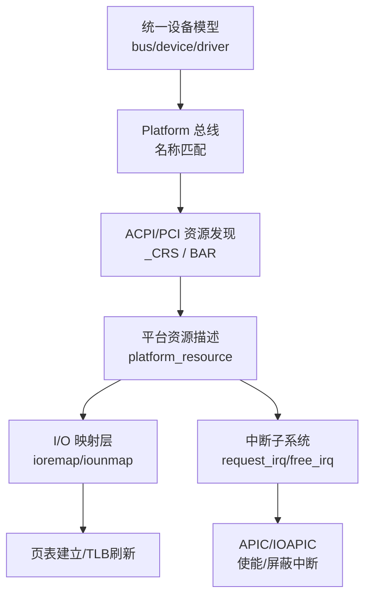
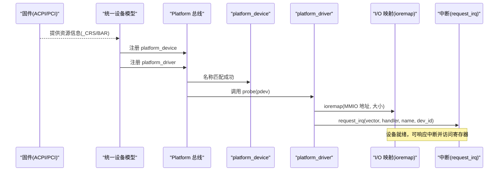
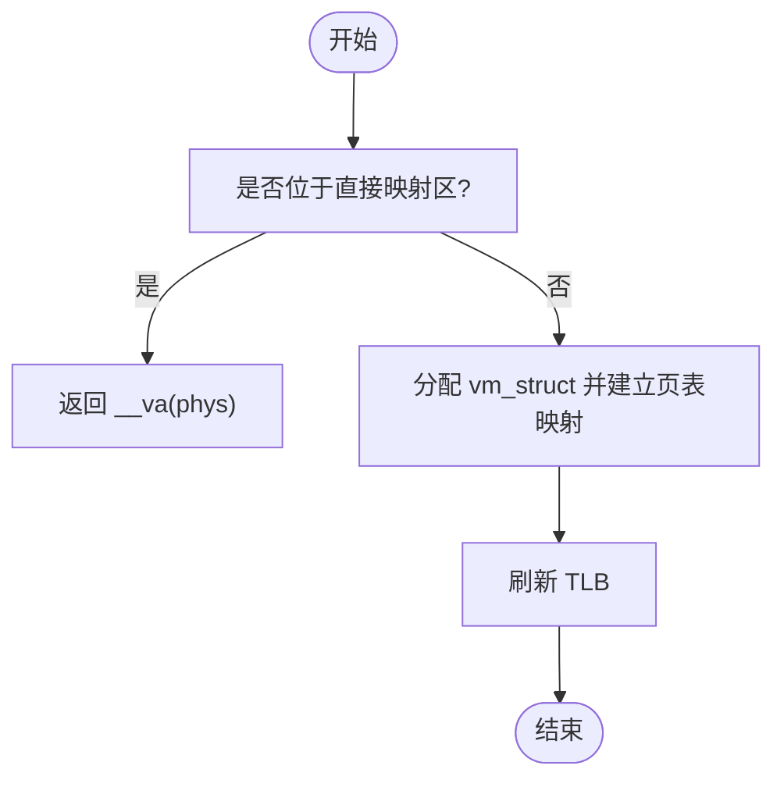
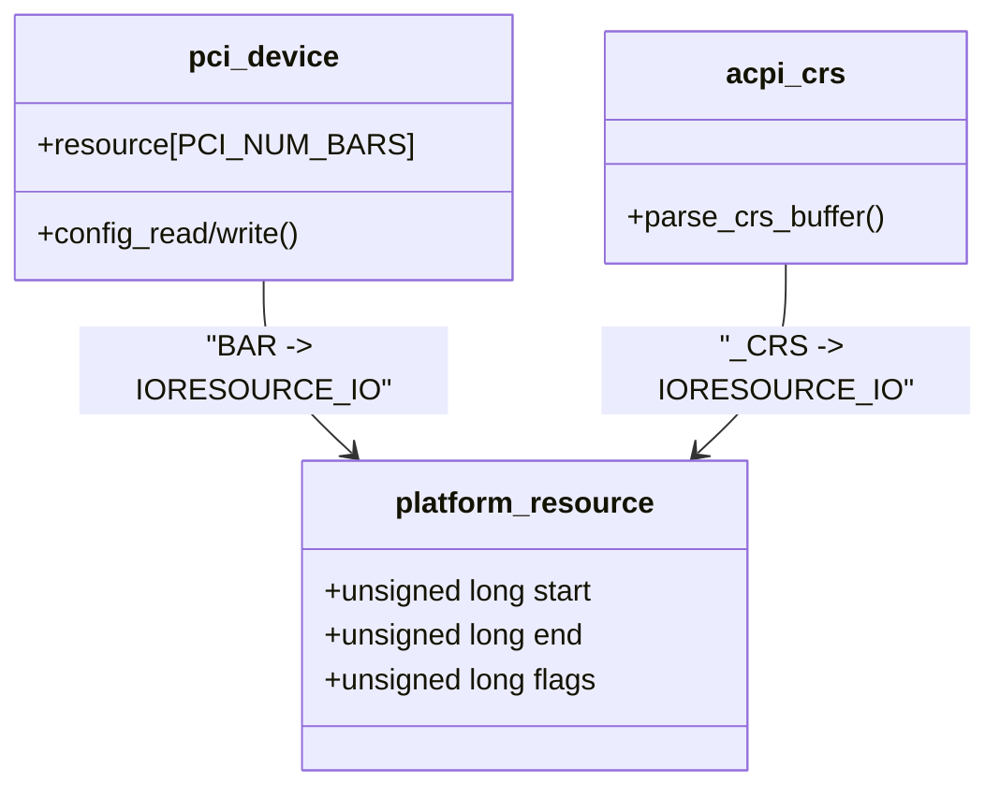
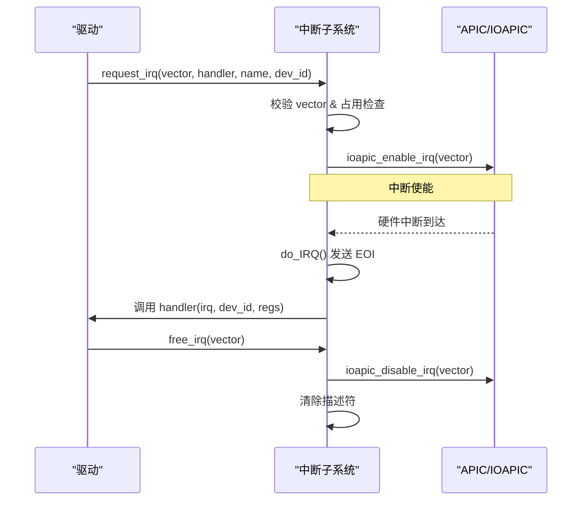
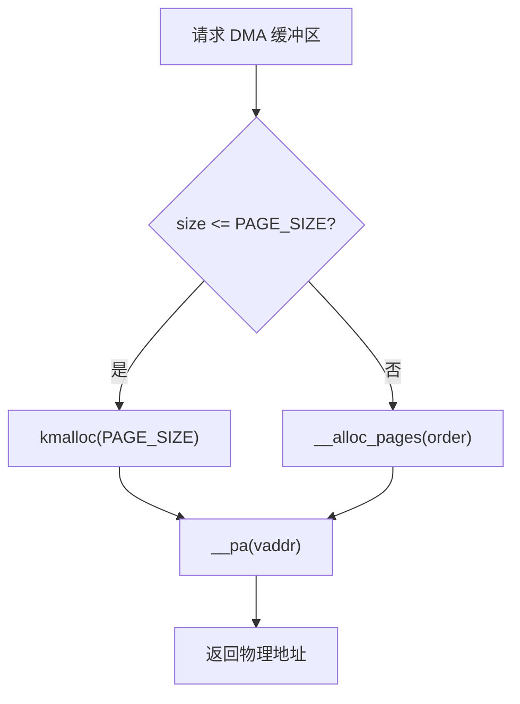
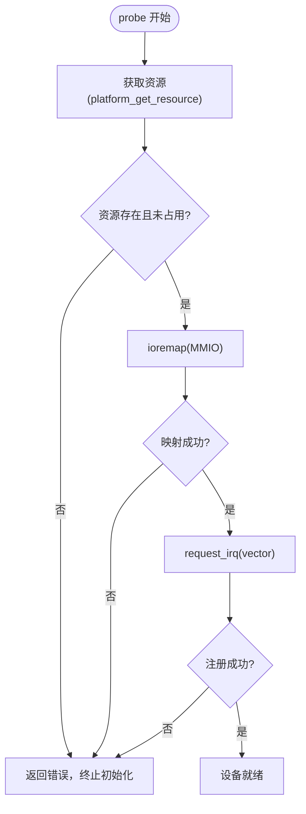
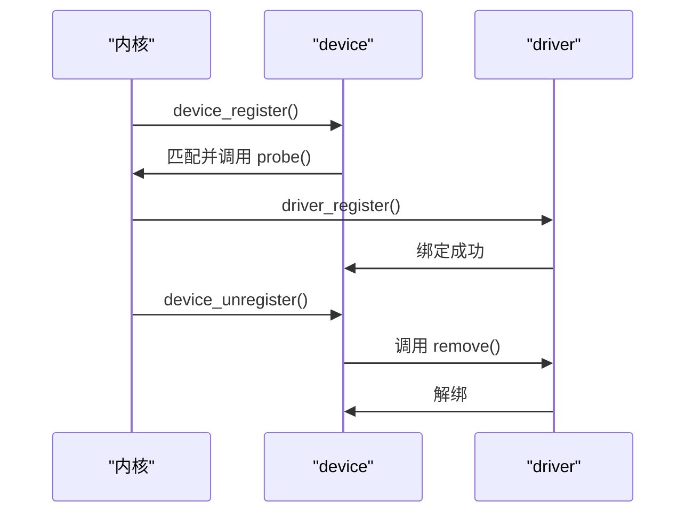
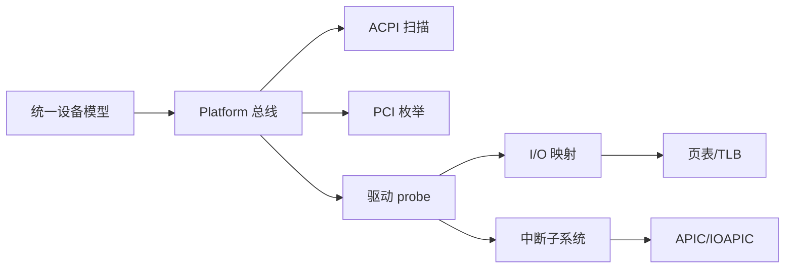

# 设备资源管理

<cite>
**本文引用的文件**
- [includes/device/device.h](file://includes/device/device.h)
- [includes/device/platform.h](file://includes/device/platform.h)
- [kernel/device/device.c](file://kernel/device/device.c)
- [kernel/device/platform.c](file://kernel/device/platform.c)
- [includes/interrupts/interrupts.h](file://includes/interrupts/interrupts.h)
- [kernel/interrupts/interrupts.c](file://kernel/interrupts/interrupts.c)
- [arch/x86/kernel/mm/ioremap.c](file://arch/x86/kernel/mm/ioremap.c)
- [includes/arch/x86/io.h](file://includes/arch/x86/io.h)
- [kernel/pci/pci.c](file://kernel/pci/pci.c)
- [kernel/device/acpi_dev.c](file://kernel/device/acpi_dev.c)
- [kernel/mm/mmzone.c](file://kernel/mm/mmzone.c)
- [includes/drm/drm_gem.h](file://includes/drm/drm_gem.h)
- [kernel/drm/drm_gem.c](file://kernel/drm/drm_gem.c)
</cite>

## 目录
1. [简介](#简介)
2. [项目结构](#项目结构)
3. [核心组件](#核心组件)
4. [架构总览](#架构总览)
5. [详细组件分析](#详细组件分析)
6. [依赖关系分析](#依赖关系分析)
7. [性能考虑](#性能考虑)
8. [故障排查指南](#故障排查指南)
9. [结论](#结论)
10. [附录：API与示例路径](#附录api与示例路径)

## 简介
本文件面向LulaOS的设备资源管理，系统性说明内存资源、I/O端口资源、中断资源与DMA相关资源的类型与分类；阐述资源获取与管理方法（如 request_irq、ioremap 等）；提供资源冲突检测与解决策略；给出分配与释放各类资源的代码路径示例；解释生命周期管理与错误处理机制；并包含资源泄漏检测建议与多设备共享资源的处理方法。

## 项目结构
LulaOS在设备资源管理方面采用“统一设备模型 + 总线抽象”的架构：
- 统一设备模型：bus_type / device / device_driver 注册与匹配流程
- Platform 总线：用于非PCI发现机制的设备（SoC外设、PS/2、中断控制器等），通过名称匹配驱动
- 中断子系统：基于向量号的 IRQ 描述符表，支持 request_irq/free_irq
- I/O 映射：ioremap/iounmap 将物理地址映射到内核虚拟地址空间，供MMIO访问
- PCI 子系统：枚举BAR，解析I/O与Memory资源范围
- ACPI 扫描：从DSDT/_CRS解析IRQ/I/O/Memory资源，构造platform_resource
- 内存管理：伙伴系统分配/释放页面，vmalloc/vfree 提供虚拟连续、物理不连续的内存

图表来源
- [kernel/device/device.c:22-105](file://kernel/device/device.c#L22-L105)
- [kernel/device/platform.c:15-114](file://kernel/device/platform.c#L15-L114)
- [kernel/device/acpi_dev.c:334-421](file://kernel/device/acpi_dev.c#L334-L421)
- [kernel/pci/pci.c:117-149](file://kernel/pci/pci.c#L117-L149)
- [arch/x86/kernel/mm/ioremap.c:230-283](file://arch/x86/kernel/mm/ioremap.c#L230-L283)
- [kernel/interrupts/interrupts.c:40-77](file://kernel/interrupts/interrupts.c#L40-L77)

章节来源
- [includes/device/device.h:26-77](file://includes/device/device.h#L26-L77)
- [includes/device/platform.h:23-81](file://includes/device/platform.h#L23-L81)
- [kernel/device/device.c:22-165](file://kernel/device/device.c#L22-L165)
- [kernel/device/platform.c:15-160](file://kernel/device/platform.c#L15-L160)

## 核心组件
- 统一设备模型：提供 bus_register、device_register、driver_register 及匹配/探测回调
- Platform 总线：实现 platform_bus_type，按名称匹配设备与驱动，转发 probe/remove
- 中断子系统：维护 irq_desc[NR_IRQS]，提供 request_irq/free_irq，并在 do_IRQ 中分发
- I/O 映射：ioremap/iounmap 建立/解除 MMIO 映射，vmalloc/vfree 分配/释放虚拟连续内存
- PCI/ACPI：从硬件或固件描述中提取 I/O、Memory、IRQ 资源，填充 platform_resource
- 内存管理：伙伴系统分配/释放页面，支持 DMA 所需的物理连续内存（GEM 使用）

章节来源
- [kernel/device/device.c:22-165](file://kernel/device/device.c#L22-L165)
- [kernel/device/platform.c:15-160](file://kernel/device/platform.c#L15-L160)
- [kernel/interrupts/interrupts.c:10-77](file://kernel/interrupts/interrupts.c#L10-L77)
- [arch/x86/kernel/mm/ioremap.c:230-536](file://arch/x86/kernel/mm/ioremap.c#L230-L536)
- [kernel/pci/pci.c:117-149](file://kernel/pci/pci.c#L117-L149)
- [kernel/device/acpi_dev.c:334-421](file://kernel/device/acpi_dev.c#L334-L421)
- [kernel/mm/mmzone.c:248-329](file://kernel/mm/mmzone.c#L248-L329)

## 架构总览
下图展示从设备发现到资源使用的整体流程：ACPI/PCI 提取资源 → 构造 platform_device → 匹配 platform_driver → 在 probe 中申请 I/O、Memory、IRQ → 使用 ioremap 访问寄存器 → 通过 request_irq 注册中断处理。

图表来源
- [kernel/device/platform.c:25-77](file://kernel/device/platform.c#L25-L77)
- [kernel/device/device.c:42-105](file://kernel/device/device.c#L42-L105)
- [kernel/device/acpi_dev.c:334-421](file://kernel/device/acpi_dev.c#L334-L421)
- [kernel/pci/pci.c:117-149](file://kernel/pci/pci.c#L117-L149)
- [arch/x86/kernel/mm/ioremap.c:230-283](file://arch/x86/kernel/mm/ioremap.c#L230-L283)
- [kernel/interrupts/interrupts.c:40-77](file://kernel/interrupts/interrupts.c#L40-L77)

## 详细组件分析

### 内存资源（MMIO 与系统内存）
- MMIO 访问：通过 ioremap 将物理地址映射为内核虚拟地址，默认禁用缓存，适合设备寄存器访问；iounmap 释放映射
- 系统内存：vmalloc 分配虚拟连续但物理不连续的内存，vfree 释放；DMA 场景需要物理连续内存，可通过伙伴系统分配（__alloc_pages）
- 显存/GEM：DRM GEM 封装物理连续内存对象，便于GPU/DMA直接访问

图表来源
- [arch/x86/kernel/mm/ioremap.c:230-283](file://arch/x86/kernel/mm/ioremap.c#L230-L283)
- [arch/x86/kernel/mm/ioremap.c:306-352](file://arch/x86/kernel/mm/ioremap.c#L306-L352)
- [kernel/mm/mmzone.c:248-329](file://kernel/mm/mmzone.c#L248-L329)
- [kernel/drm/drm_gem.c:135-201](file://kernel/drm/drm_gem.c#L135-L201)

章节来源
- [arch/x86/kernel/mm/ioremap.c:230-536](file://arch/x86/kernel/mm/ioremap.c#L230-L536)
- [kernel/mm/mmzone.c:248-329](file://kernel/mm/mmzone.c#L248-L329)
- [kernel/drm/drm_gem.c:135-201](file://kernel/drm/drm_gem.c#L135-L201)
- [includes/drm/drm_gem.h:24-82](file://includes/drm/drm_gem.h#L24-L82)

### I/O 端口资源
- 通过 outb/inb/outw/inw/outl/inl 进行端口读写
- PCI BAR 中的 I/O 空间通过写全1计算大小，记录 start/end 与标志 IORESOURCE_IO
- ACPI _CRS 中的 I/O Port 描述符解析为 platform_resource

图表来源
- [includes/device/platform.h:28-37](file://includes/device/platform.h#L28-L37)
- [kernel/pci/pci.c:117-149](file://kernel/pci/pci.c#L117-L149)
- [kernel/device/acpi_dev.c:370-401](file://kernel/device/acpi_dev.c#L370-L401)
- [includes/arch/x86/io.h:5-33](file://includes/arch/x86/io.h#L5-L33)

章节来源
- [includes/arch/x86/io.h:5-33](file://includes/arch/x86/io.h#L5-L33)
- [kernel/pci/pci.c:117-149](file://kernel/pci/pci.c#L117-L149)
- [kernel/device/acpi_dev.c:370-401](file://kernel/device/acpi_dev.c#L370-L401)

### 中断资源
- request_irq：注册中断处理函数，检查向量合法性与占用情况，成功后启用对应GSI
- free_irq：先屏蔽硬件中断，再清除描述符，避免悬空触发
- do_IRQ：通用入口，发送EOI后调用已注册的handler

图表来源
- [kernel/interrupts/interrupts.c:40-77](file://kernel/interrupts/interrupts.c#L40-L77)
- [kernel/interrupts/interrupts.c:84-108](file://kernel/interrupts/interrupts.c#L84-L108)
- [includes/interrupts/interrupts.h:50-55](file://includes/interrupts/interrupts.h#L50-L55)

章节来源
- [kernel/interrupts/interrupts.c:40-108](file://kernel/interrupts/interrupts.c#L40-L108)
- [includes/interrupts/interrupts.h:50-55](file://includes/interrupts/interrupts.h#L50-L55)

### DMA 资源
- DMA 要求物理连续内存，GEM 通过伙伴系统分配物理连续页，并提供 handle 给用户态
- 对于大块DMA，优先选择物理连续分配；小对象可使用kmalloc+__pa转换

图表来源
- [kernel/drm/drm_gem.c:38-82](file://kernel/drm/drm_gem.c#L38-L82)
- [kernel/mm/mmzone.c:248-329](file://kernel/mm/mmzone.c#L248-L329)

章节来源
- [kernel/drm/drm_gem.c:38-82](file://kernel/drm/drm_gem.c#L38-L82)
- [kernel/mm/mmzone.c:248-329](file://kernel/mm/mmzone.c#L248-L329)

### 资源冲突检测与解决策略
- 中断冲突：request_irq 对同一向量重复注册会失败（返回 -1），需更换向量或确保独占
- I/O/Memory 冲突：PCI BAR 与 ACPI _CRS 解析出范围，驱动应在 probe 中确认资源可用；若冲突，应拒绝初始化并上报
- 映射冲突：ioremap 在直接映射区外建立新映射，若失败则返回 NULL；需检查 size 与地址合法性

图表来源
- [kernel/device/platform.c:142-159](file://kernel/device/platform.c#L142-L159)
- [arch/x86/kernel/mm/ioremap.c:230-283](file://arch/x86/kernel/mm/ioremap.c#L230-L283)
- [kernel/interrupts/interrupts.c:40-77](file://kernel/interrupts/interrupts.c#L40-L77)

章节来源
- [kernel/device/platform.c:142-159](file://kernel/device/platform.c#L142-L159)
- [arch/x86/kernel/mm/ioremap.c:230-283](file://arch/x86/kernel/mm/ioremap.c#L230-L283)
- [kernel/interrupts/interrupts.c:40-77](file://kernel/interrupts/interrupts.c#L40-L77)

### 资源生命周期管理与错误处理
- 设备生命周期：device_register 触发匹配与 probe；device_unregister 调用 remove 并清理绑定
- 驱动生命周期：driver_register 触发匹配所有设备；driver_unregister 解除所有绑定并调用 remove
- 资源释放顺序：先 free_irq，再 iounmap；最后释放描述符与链表节点

图表来源
- [kernel/device/device.c:94-165](file://kernel/device/device.c#L94-L165)
- [kernel/device/platform.c:84-114](file://kernel/device/platform.c#L84-L114)

章节来源
- [kernel/device/device.c:94-165](file://kernel/device/device.c#L94-L165)
- [kernel/device/platform.c:84-114](file://kernel/device/platform.c#L84-L114)

### 多设备共享资源处理方法
- 中断共享：当前实现每个向量仅允许一个 handler；如需共享，需在 irq_desc 中改为链表并轮询处理
- I/O/Memory 共享：不同驱动不应同时访问同一范围；可通过总线仲裁或上层协调避免冲突
- 显存共享：GEM 对象通过 handle 引用，多个进程可共享同一对象，内核负责引用计数与映射管理

章节来源
- [kernel/interrupts/interrupts.c:10-17](file://kernel/interrupts/interrupts.c#L10-L17)
- [includes/drm/drm_gem.h:24-82](file://includes/drm/drm_gem.h#L24-L82)
- [kernel/drm/drm_gem.c:135-201](file://kernel/drm/drm_gem.c#L135-L201)

## 依赖关系分析
- 统一设备模型依赖 list 与 printk
- Platform 总线依赖字符串比较与 bus 注册
- 中断子系统依赖 APIC/IOAPIC 与调度器
- I/O 映射依赖页表操作与 TLB 刷新
- PCI/ACPI 依赖固件接口与页映射

图表来源
- [kernel/device/device.c:22-105](file://kernel/device/device.c#L22-L105)
- [kernel/device/platform.c:15-114](file://kernel/device/platform.c#L15-L114)
- [kernel/device/acpi_dev.c:334-421](file://kernel/device/acpi_dev.c#L334-L421)
- [kernel/pci/pci.c:117-149](file://kernel/pci/pci.c#L117-L149)
- [arch/x86/kernel/mm/ioremap.c:230-283](file://arch/x86/kernel/mm/ioremap.c#L230-L283)
- [kernel/interrupts/interrupts.c:40-108](file://kernel/interrupts/interrupts.c#L40-L108)

章节来源
- [kernel/device/device.c:22-105](file://kernel/device/device.c#L22-L105)
- [kernel/device/platform.c:15-114](file://kernel/device/platform.c#L15-L114)
- [kernel/device/acpi_dev.c:334-421](file://kernel/device/acpi_dev.c#L334-L421)
- [kernel/pci/pci.c:117-149](file://kernel/pci/pci.c#L117-L149)
- [arch/x86/kernel/mm/ioremap.c:230-283](file://arch/x86/kernel/mm/ioremap.c#L230-L283)
- [kernel/interrupts/interrupts.c:40-108](file://kernel/interrupts/interrupts.c#L40-L108)

## 性能考虑
- I/O 映射：尽量复用直接映射区（<896MB）以减少页表开销；避免频繁 ioremap/iounmap
- 中断处理：保持 ISR 短小，尽快发送 EOI，减少阻塞时间
- DMA：优先物理连续分配，减少 IOMMU 映射开销；合理设置缓存属性
- 内存分配：vmalloc 适合大对象但不保证物理连续；DMA 场景使用伙伴系统

## 故障排查指南
- 中断未触发：检查 request_irq 返回值与 ioapic_enable_irq 是否成功；确认向量未被占用
- MMIO 访问异常：检查 ioremap 返回值与地址合法性；确认 PTE 已建立且 TLB 已刷新
- 资源冲突：打印 platform_get_resource 结果与 PCI BAR/_CRS 解析信息；必要时调整设备树或BIOS配置
- 内存泄漏：跟踪 vm_struct 链表与 vmlist；确保 iounmap/vfree 成对调用

章节来源
- [kernel/interrupts/interrupts.c:40-77](file://kernel/interrupts/interrupts.c#L40-L77)
- [arch/x86/kernel/mm/ioremap.c:306-352](file://arch/x86/kernel/mm/ioremap.c#L306-L352)
- [kernel/device/acpi_dev.c:334-421](file://kernel/device/acpi_dev.c#L334-L421)
- [kernel/pci/pci.c:117-149](file://kernel/pci/pci.c#L117-L149)

## 结论
LulaOS 的设备资源管理以统一设备模型为核心，结合 Platform 总线、中断子系统与 I/O 映射层，形成从设备发现到资源使用的完整闭环。通过 ACPI/PCI 解析资源、platform_resource 描述、ioremap 访问寄存器、request_irq 注册中断，实现了清晰的职责划分与可扩展性。建议在驱动开发中严格遵循资源申请与释放顺序，做好冲突检测与错误处理，以避免资源泄漏与不稳定行为。

## 附录：API与示例路径
- 内存资源
  - 分配/释放 MMIO：[arch/x86/kernel/mm/ioremap.c:230-283](file://arch/x86/kernel/mm/ioremap.c#L230-L283)、[arch/x86/kernel/mm/ioremap.c:306-352](file://arch/x86/kernel/mm/ioremap.c#L306-L352)
  - 分配/释放系统内存：[arch/x86/kernel/mm/ioremap.c:442-536](file://arch/x86/kernel/mm/ioremap.c#L442-L536)
  - DMA 物理连续内存：[kernel/drm/drm_gem.c:38-82](file://kernel/drm/drm_gem.c#L38-L82)、[kernel/mm/mmzone.c:248-329](file://kernel/mm/mmzone.c#L248-L329)
- I/O 端口资源
  - 端口读写：[includes/arch/x86/io.h:5-33](file://includes/arch/x86/io.h#L5-L33)
  - PCI BAR 解析：[kernel/pci/pci.c:117-149](file://kernel/pci/pci.c#L117-L149)
  - ACPI _CRS 解析：[kernel/device/acpi_dev.c:370-401](file://kernel/device/acpi_dev.c#L370-L401)
- 中断资源
  - 注册/注销中断：[kernel/interrupts/interrupts.c:40-77](file://kernel/interrupts/interrupts.c#L40-L77)
  - 中断入口：[kernel/interrupts/interrupts.c:84-108](file://kernel/interrupts/interrupts.c#L84-L108)
- 设备模型与平台总线
  - 总线/设备/驱动注册：[kernel/device/device.c:22-165](file://kernel/device/device.c#L22-L165)
  - Platform 总线实现：[kernel/device/platform.c:15-160](file://kernel/device/platform.c#L15-L160)
  - 资源获取：[kernel/device/platform.c:142-159](file://kernel/device/platform.c#L142-L159)