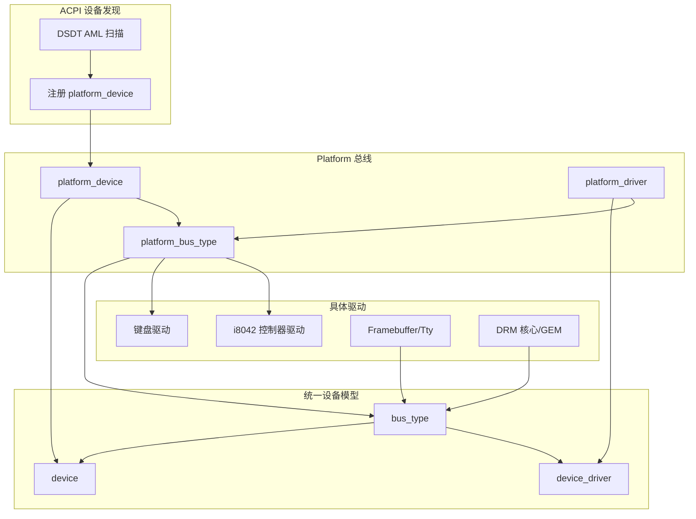
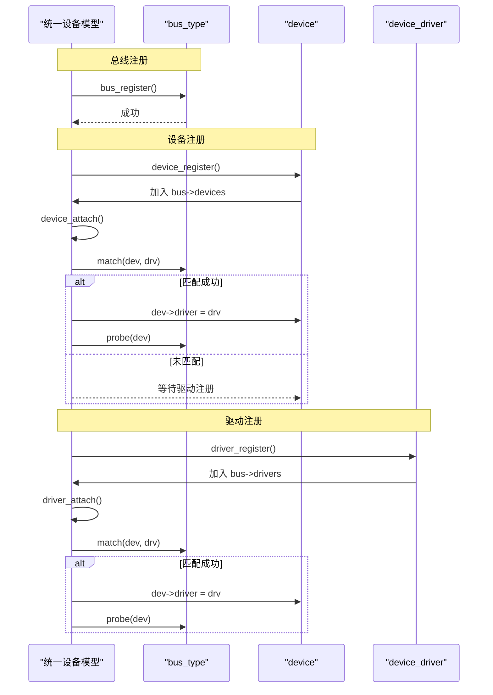
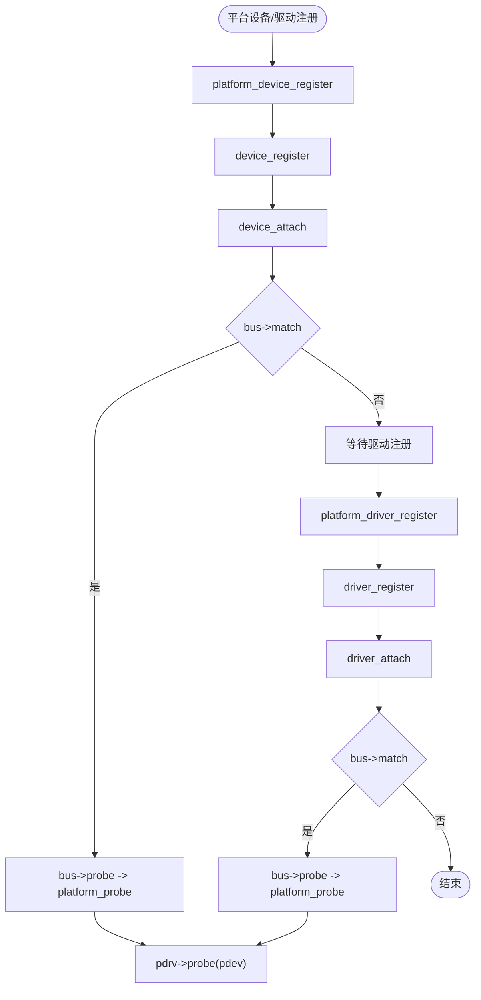
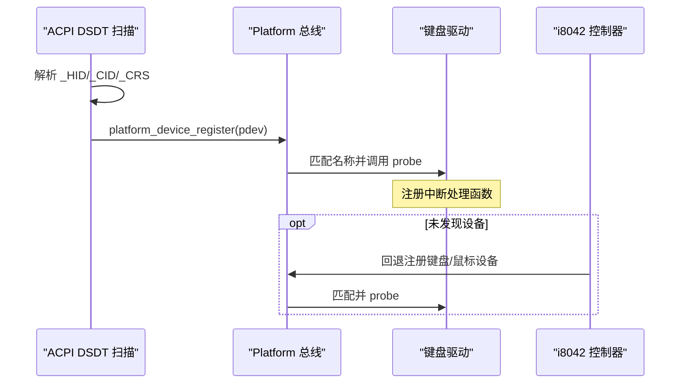
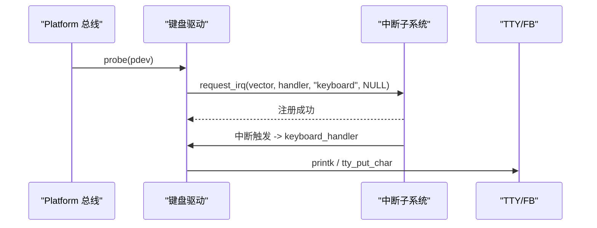
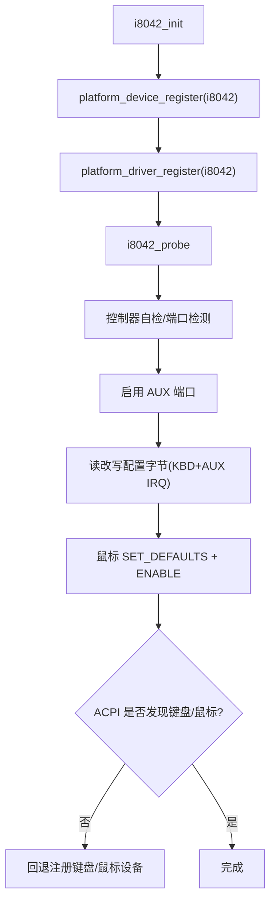
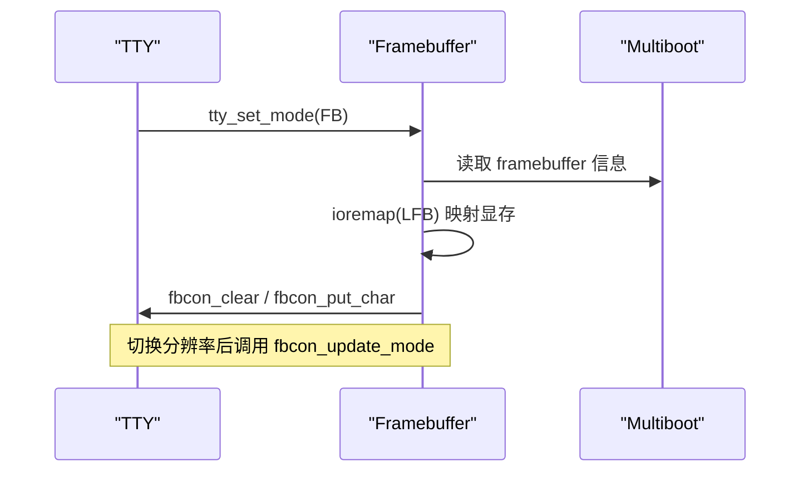
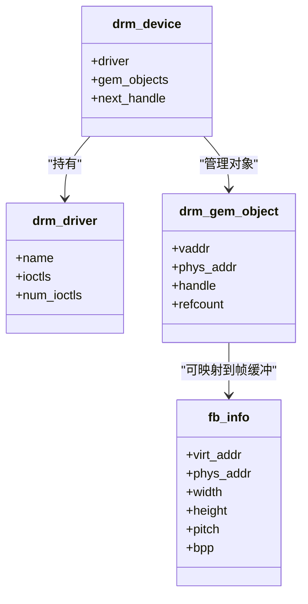
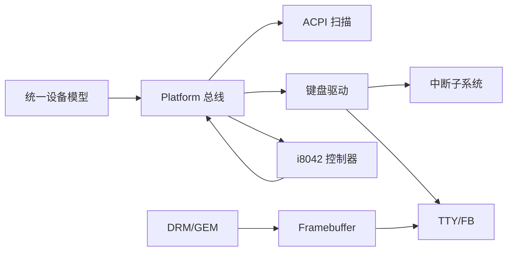

# 设备驱动开发

<cite>
**本文引用的文件**
- [includes/device/device.h](file://includes/device/device.h)
- [includes/device/platform.h](file://includes/device/platform.h)
- [kernel/device/device.c](file://kernel/device/device.c)
- [kernel/device/platform.c](file://kernel/device/platform.c)
- [kernel/device/acpi_dev.c](file://kernel/device/acpi_dev.c)
- [kernel/i8042.c](file://kernel/i8042.c)
- [kernel/keyboard.c](file://kernel/keyboard.c)
- [includes/keyboard.h](file://includes/keyboard.h)
- [includes/interrupts/interrupts.h](file://includes/interrupts/interrupts.h)
- [kernel/video/fb.c](file://kernel/video/fb.c)
- [includes/video/fb.h](file://includes/video/fb.h)
- [kernel/tty/tty.c](file://kernel/tty/tty.c)
- [includes/tty/tty.h](file://includes/tty/tty.h)
- [kernel/drm/drm_core.c](file://kernel/drm/drm_core.c)
- [kernel/drm/drm_gem.c](file://kernel/drm/drm_gem.c)
- [includes/drm/drm_gem.h](file://includes/drm/drm_gem.h)
</cite>

## 目录
1. [简介](#简介)
2. [项目结构](#项目结构)
3. [核心组件](#核心组件)
4. [架构总览](#架构总览)
5. [详细组件分析](#详细组件分析)
6. [依赖关系分析](#依赖关系分析)
7. [性能考虑](#性能考虑)
8. [故障排查指南](#故障排查指南)
9. [结论](#结论)
10. [附录](#附录)

## 简介
本指南面向在 LulaOS 上开发设备驱动的工程师，系统阐述统一设备模型的设计与实现，重点围绕 device 与 device_driver 结构体、Platform 总线从设备注册到驱动绑定的完整流程，给出 probe/remove 等关键回调的实现范式。文档同时覆盖资源管理、中断处理、DMA/GEM 显存操作，并总结字符设备（TTY/Framebuffer）、块设备（概念性说明）和网络设备（概念性说明）的常见驱动模式，最后提供调试技巧与常见问题解决方案。

## 项目结构
LulaOS 的设备子系统采用“统一设备模型 + 总线抽象”的分层设计：
- 统一设备模型：bus_type、device、device_driver 定义与匹配机制
- Platform 总线：用于 SoC 内部外设、PS/2、中断控制器等非 PCI 设备
- ACPI DSDT 扫描：自动发现设备并注册为 platform_device
- 具体驱动：键盘、i8042 控制器、Framebuffer/Tty、DRM/GEM 等

图表来源
- [includes/device/device.h:26-66](file://includes/device/device.h#L26-L66)
- [includes/device/platform.h:28-60](file://includes/device/platform.h#L28-L60)
- [kernel/device/platform.c:14-17](file://kernel/device/platform.c#L14-L17)
- [kernel/device/acpi_dev.c:749-796](file://kernel/device/acpi_dev.c#L749-L796)

章节来源
- [includes/device/device.h:26-66](file://includes/device/device.h#L26-L66)
- [includes/device/platform.h:28-60](file://includes/device/platform.h#L28-L60)
- [kernel/device/platform.c:14-17](file://kernel/device/platform.c#L14-L17)
- [kernel/device/acpi_dev.c:749-796](file://kernel/device/acpi_dev.c#L749-L796)

## 核心组件
- 总线类型 bus_type：定义 name、devices/drivers 链表以及 match/probe/remove 函数指针，是统一设备模型的根抽象。
- 设备 device：包含名称、所属总线、节点、已绑定驱动指针和私有数据；各总线设备结构体需将其作为首成员嵌入。
- 驱动 device_driver：包含名称、所属总线、节点；各总线驱动结构体需将其作为首成员嵌入。
- Platform 扩展：
  - platform_resource：描述 MMIO/I/O/IRQ 资源
  - platform_device：嵌入 device，增加 id、resource 数组
  - platform_driver：嵌入 device_driver，增加 probe/remove 回调
  - platform_bus_type：Platform 总线实例，match 基于名称字符串比较

章节来源
- [includes/device/device.h:26-66](file://includes/device/device.h#L26-L66)
- [includes/device/platform.h:28-60](file://includes/device/platform.h#L28-L60)

## 架构总览
统一设备模型的核心流程：
- 总线注册：bus_register 初始化并加入全局总线链表
- 设备注册：device_register 将设备挂入总线设备链表，尝试匹配已注册驱动
- 驱动注册：driver_register 将驱动挂入总线驱动链表，尝试匹配已注册设备
- 匹配与绑定：bus->match 成功则设置 dev->driver，并调用 bus->probe
- 注销：driver_unregister 解除所有绑定并调用 remove；device_unregister 同样触发 remove

图表来源
- [kernel/device/device.c:22-34](file://kernel/device/device.c#L22-L34)
- [kernel/device/device.c:42-87](file://kernel/device/device.c#L42-L87)
- [kernel/device/device.c:94-139](file://kernel/device/device.c#L94-L139)

章节来源
- [kernel/device/device.c:22-34](file://kernel/device/device.c#L22-L34)
- [kernel/device/device.c:42-87](file://kernel/device/device.c#L42-L87)
- [kernel/device/device.c:94-139](file://kernel/device/device.c#L94-L139)

## 详细组件分析

### Platform 总线与设备/驱动
- Platform 总线通过名称匹配：platform_match 比较 platform_device.dev.name 与 device_driver.name
- platform_probe 将统一 probe 转发到 platform_driver->probe
- platform_remove 将统一 remove 转发到 platform_driver->remove
- platform_device_register 设置 bus 并调用 device_register
- platform_driver_register 设置 bus 并调用 driver_register
- platform_get_resource 按类型和索引获取资源（MEM/IO/IRQ）

图表来源
- [kernel/device/platform.c:25-77](file://kernel/device/platform.c#L25-L77)
- [kernel/device/device.c:42-87](file://kernel/device/device.c#L42-L87)
- [kernel/device/device.c:94-139](file://kernel/device/device.c#L94-L139)

章节来源
- [kernel/device/platform.c:25-77](file://kernel/device/platform.c#L25-L77)
- [kernel/device/device.c:42-87](file://kernel/device/device.c#L42-L87)
- [kernel/device/device.c:94-139](file://kernel/device/device.c#L94-L139)

### ACPI DSDT 设备发现与注册
- 解析 DSDT AML，提取 Device 对象及其 _HID/_CID/_CRS
- 将 _CRS 中的 IO/MEM/IRQ 资源转换为 platform_resource
- 构造 platform_device 并调用 platform_device_register
- 若 ACPI 未发现键盘/鼠标，由 i8042 控制器回退注册

图表来源
- [kernel/device/acpi_dev.c:328-421](file://kernel/device/acpi_dev.c#L328-L421)
- [kernel/device/acpi_dev.c:749-796](file://kernel/device/acpi_dev.c#L749-L796)
- [kernel/i8042.c:253-263](file://kernel/i8042.c#L253-L263)

章节来源
- [kernel/device/acpi_dev.c:328-421](file://kernel/device/acpi_dev.c#L328-L421)
- [kernel/device/acpi_dev.c:749-796](file://kernel/device/acpi_dev.c#L749-L796)
- [kernel/i8042.c:253-263](file://kernel/i8042.c#L253-L263)

### 键盘驱动（字符设备模式）
- 设备来源：ACPI DSDT 或 i8042 回退注册
- 驱动注册：platform_driver_register，名称匹配 PNP0303
- probe：从资源获取 IRQ，计算向量并 request_irq
- 中断处理：读取 PS/2 数据端口，转换扫描码为 ASCII，输出到控制台

图表来源
- [kernel/keyboard.c:197-234](file://kernel/keyboard.c#L197-L234)
- [includes/interrupts/interrupts.h:50-55](file://includes/interrupts/interrupts.h#L50-L55)
- [kernel/tty/tty.c:33-67](file://kernel/tty/tty.c#L33-L67)

章节来源
- [kernel/keyboard.c:197-234](file://kernel/keyboard.c#L197-L234)
- [includes/interrupts/interrupts.h:50-55](file://includes/interrupts/interrupts.h#L50-L55)
- [kernel/tty/tty.c:33-67](file://kernel/tty/tty.c#L33-L67)

### i8042 控制器驱动（平台设备）
- 设备/驱动：platform_device 与 platform_driver，名称 i8042
- probe：执行控制器自检、端口检测、启用 AUX、配置字节读写、鼠标初始化
- 子设备回退：若 ACPI 未发现键盘/鼠标，补充注册 platform_device

图表来源
- [kernel/i8042.c:128-220](file://kernel/i8042.c#L128-L220)
- [kernel/i8042.c:253-263](file://kernel/i8042.c#L253-L263)
- [kernel/i8042.c:283-302](file://kernel/i8042.c#L283-L302)

章节来源
- [kernel/i8042.c:128-220](file://kernel/i8042.c#L128-L220)
- [kernel/i8042.c:253-263](file://kernel/i8042.c#L253-L263)
- [kernel/i8042.c:283-302](file://kernel/i8042.c#L283-L302)

### Framebuffer/Tty（字符设备模式）
- TTY 支持 VGA 文本与 FB 两种显示模式，早期输出缓存并在切换到 FB 时重放
- FB 驱动通过 Multiboot 信息初始化，使用自定义 ioremap 映射 LFB 到虚拟地址
- 分辨率变化时通过 fbcon_update_mode 同步参数并清屏

图表来源
- [kernel/tty/tty.c:105-123](file://kernel/tty/tty.c#L105-L123)
- [kernel/video/fb.c:255-319](file://kernel/video/fb.c#L255-L319)
- [kernel/video/fb.c:222-251](file://kernel/video/fb.c#L222-L251)

章节来源
- [kernel/tty/tty.c:105-123](file://kernel/tty/tty.c#L105-L123)
- [kernel/video/fb.c:255-319](file://kernel/video/fb.c#L255-L319)
- [kernel/video/fb.c:222-251](file://kernel/video/fb.c#L222-L251)

### DRM/GEM（图形 DMA 与显存管理）
- DRM 核心维护驱动链表，提供 ioctl 分发和设备生命周期管理
- GEM 负责分配物理连续内存（适合 GPU DMA），创建/销毁对象，并提供用户态 mmap
- 通过 fb_ioremap 将物理页映射到虚拟地址，供内核访问

图表来源
- [kernel/drm/drm_core.c:257-311](file://kernel/drm/drm_core.c#L257-L311)
- [kernel/drm/drm_core.c:320-364](file://kernel/drm/drm_core.c#L320-L364)
- [kernel/drm/drm_gem.c:38-43](file://kernel/drm/drm_gem.c#L38-L43)
- [includes/drm/drm_gem.h:38-82](file://includes/drm/drm_gem.h#L38-L82)
- [includes/video/fb.h:11-46](file://includes/video/fb.h#L11-L46)

章节来源
- [kernel/drm/drm_core.c:257-311](file://kernel/drm/drm_core.c#L257-L311)
- [kernel/drm/drm_core.c:320-364](file://kernel/drm/drm_core.c#L320-L364)
- [kernel/drm/drm_gem.c:38-43](file://kernel/drm/drm_gem.c#L38-L43)
- [includes/drm/drm_gem.h:38-82](file://includes/drm/drm_gem.h#L38-L82)
- [includes/video/fb.h:11-46](file://includes/video/fb.h#L11-L46)

## 依赖关系分析
- 统一设备模型依赖 list 链表与 printk
- Platform 总线依赖字符串比较与资源访问
- ACPI 扫描依赖 arch/x86 的页面映射与高内存访问
- 键盘驱动依赖中断子系统与 TTY/FB 输出
- i8042 驱动依赖 I/O 端口操作与平台设备/驱动框架
- DRM/GEM 依赖内存管理与帧缓冲映射

图表来源
- [kernel/device/device.c:9-11](file://kernel/device/device.c#L9-L11)
- [kernel/device/platform.c:9-12](file://kernel/device/platform.c#L9-L12)
- [kernel/device/acpi_dev.c:13-20](file://kernel/device/acpi_dev.c#L13-L20)
- [kernel/keyboard.c:16-22](file://kernel/keyboard.c#L16-L22)
- [kernel/i8042.c:18-22](file://kernel/i8042.c#L18-L22)
- [kernel/video/fb.c:7-15](file://kernel/video/fb.c#L7-L15)
- [kernel/drm/drm_core.c:15-21](file://kernel/drm/drm_core.c#L15-L21)

章节来源
- [kernel/device/device.c:9-11](file://kernel/device/device.c#L9-L11)
- [kernel/device/platform.c:9-12](file://kernel/device/platform.c#L9-L12)
- [kernel/device/acpi_dev.c:13-20](file://kernel/device/acpi_dev.c#L13-L20)
- [kernel/keyboard.c:16-22](file://kernel/keyboard.c#L16-L22)
- [kernel/i8042.c:18-22](file://kernel/i8042.c#L18-L22)
- [kernel/video/fb.c:7-15](file://kernel/video/fb.c#L7-L15)
- [kernel/drm/drm_core.c:15-21](file://kernel/drm/drm_core.c#L15-L21)

## 性能考虑
- 避免在 probe 中进行耗时操作，尽量延迟到后续阶段
- 资源访问（I/O/MMIO）应批量进行，减少频繁端口/内存访问
- 中断处理应尽量短小，必要时使用软中断或工作队列
- DMA/GEM 分配优先使用物理连续内存，减少 IOMMU 开销（当前实现直接分配连续页）
- 分辨率切换时及时更新 fb 参数并清屏，避免无效像素写入

[本节为通用指导，不直接分析具体文件]

## 故障排查指南
- 设备未匹配：检查 platform_device.dev.name 与 platform_driver.driver.name 是否一致
- 资源获取失败：确认 platform_get_resource 的类型与索引正确，且 ACPI/DSDT 中资源描述符有效
- 中断无法触发：验证 IRQ 号与向量映射是否正确，request_irq 返回值是否为 0
- 控制台花屏：分辨率变化后调用 fbcon_update_mode 同步 pitch/bpp/virt_addr，并清屏
- i8042 控制器不可用：自检失败或端口超时，检查硬件状态与配置字节

章节来源
- [kernel/device/platform.c:119-159](file://kernel/device/platform.c#L119-L159)
- [kernel/keyboard.c:197-217](file://kernel/keyboard.c#L197-L217)
- [kernel/video/fb.c:222-251](file://kernel/video/fb.c#L222-L251)
- [kernel/i8042.c:128-220](file://kernel/i8042.c#L128-L220)

## 结论
LulaOS 的统一设备模型以 bus_type/device/device_driver 为核心，Platform 总线通过名称匹配实现设备与驱动的解耦与自动化绑定。ACPI DSDT 扫描提供了设备发现的自动化能力，结合 i8042 回退机制确保基础输入设备可用。字符设备（TTY/FB）与图形子系统（DRM/GEM）展示了资源管理、中断处理和 DMA 操作的典型模式。遵循本文的流程与规范，可高效开发稳定可靠的设备驱动。

[本节为总结，不直接分析具体文件]

## 附录

### 统一设备模型接口速查
- 总线注册/注销：bus_register
- 设备注册/注销：device_register / device_unregister
- 驱动注册/注销：driver_register / driver_unregister
- Platform 扩展：
  - 设备/驱动注册：platform_device_register / platform_driver_register
  - 资源获取：platform_get_resource
  - 查找设备：platform_find_device

章节来源
- [includes/device/device.h:68-77](file://includes/device/device.h#L68-L77)
- [includes/device/platform.h:62-81](file://includes/device/platform.h#L62-L81)

### 关键回调实现要点
- probe：
  - 获取资源（IRQ/MMIO/I/O）
  - 初始化硬件
  - 注册中断/子系统
  - 返回 0 表示成功
- remove：
  - 释放中断
  - 释放资源
  - 清理子系统状态

章节来源
- [kernel/device/platform.c:37-62](file://kernel/device/platform.c#L37-L62)
- [kernel/keyboard.c:197-217](file://kernel/keyboard.c#L197-L217)
- [kernel/i8042.c:283-288](file://kernel/i8042.c#L283-L288)

### 常见设备类型驱动模式
- 字符设备（TTY/FB）：
  - 通过 TTY 抽象屏蔽底层差异，支持 VGA 文本与 FB 模式
  - FB 驱动负责显存映射、字符渲染、滚动与清屏
- 块设备（概念性说明）：
  - 通常通过统一设备模型注册 block_device，实现读写请求队列与磁盘几何
  - 在本仓库中未见具体实现，可按相同模式扩展
- 网络设备（概念性说明）：
  - 通过 net_device 结构与网络栈交互，实现收发队列与中断处理
  - 在本仓库中未见具体实现，可按相同模式扩展

[本节为概念性说明，不直接分析具体文件]