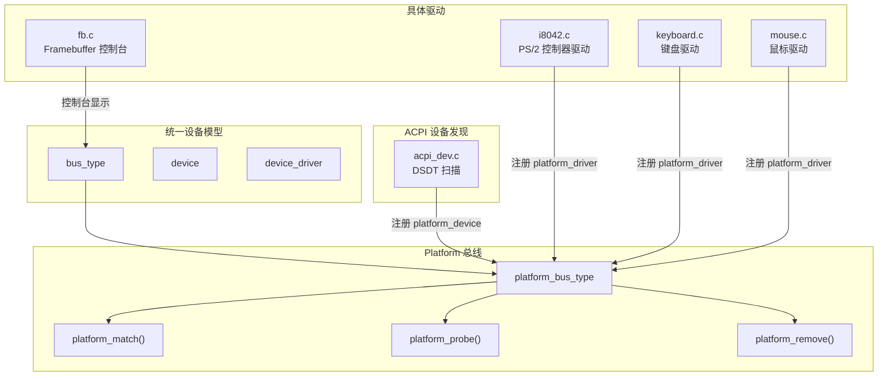
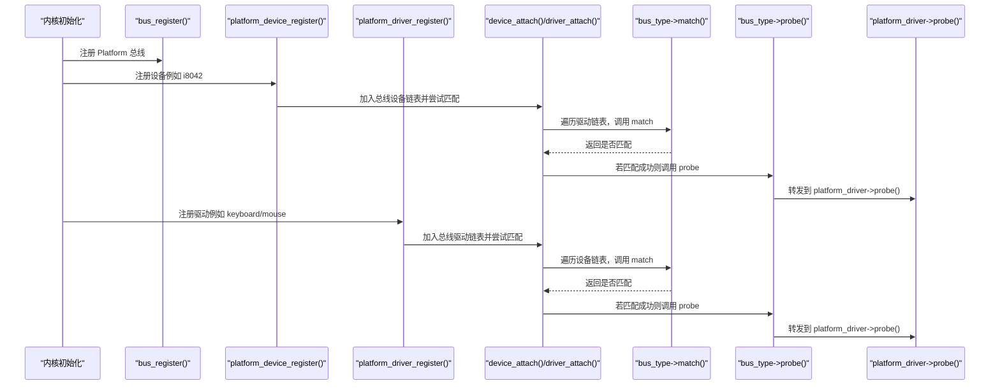
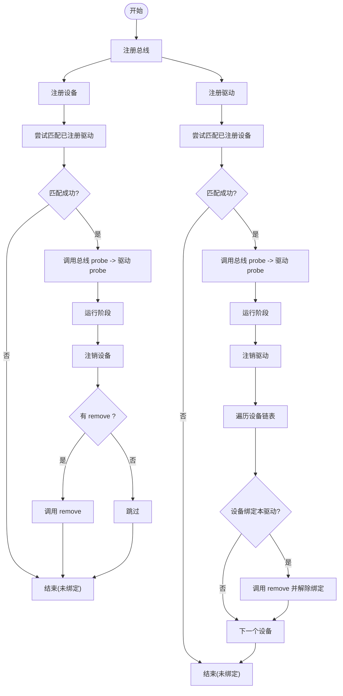
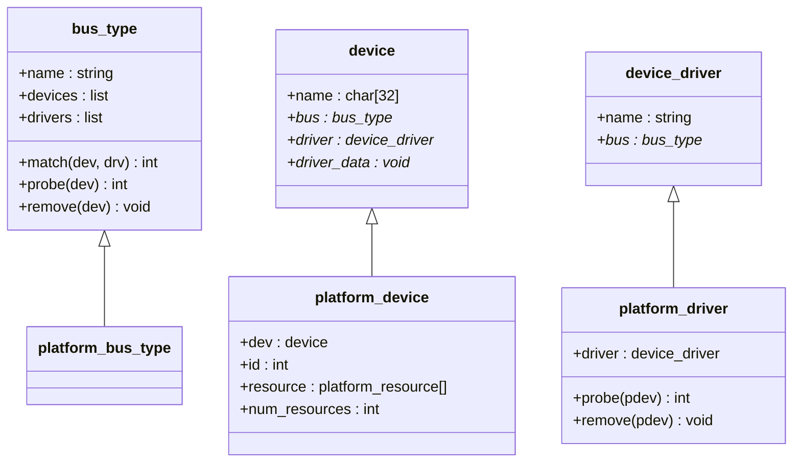
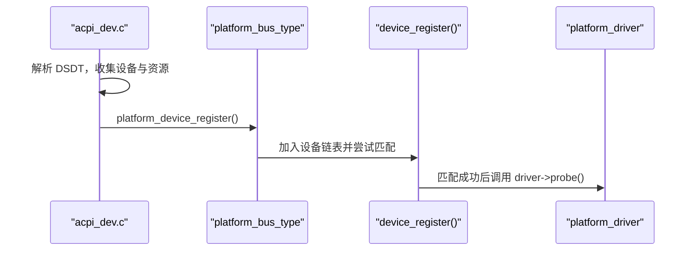
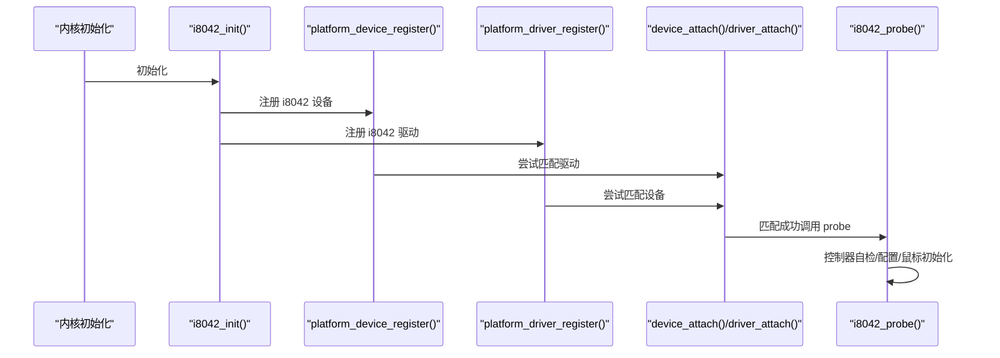
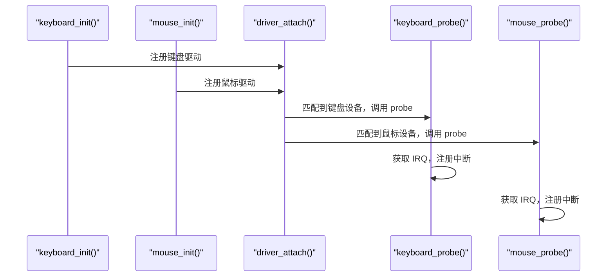
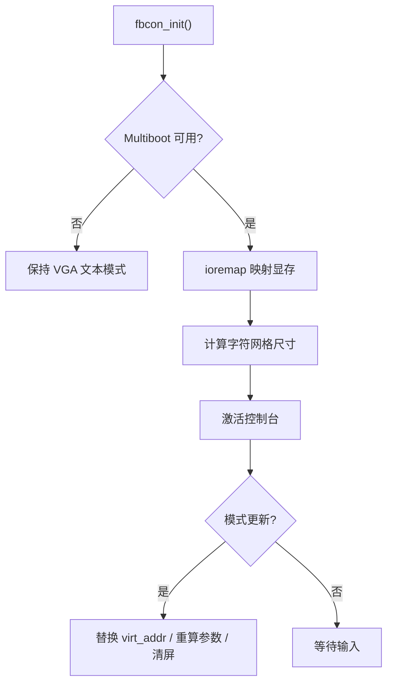
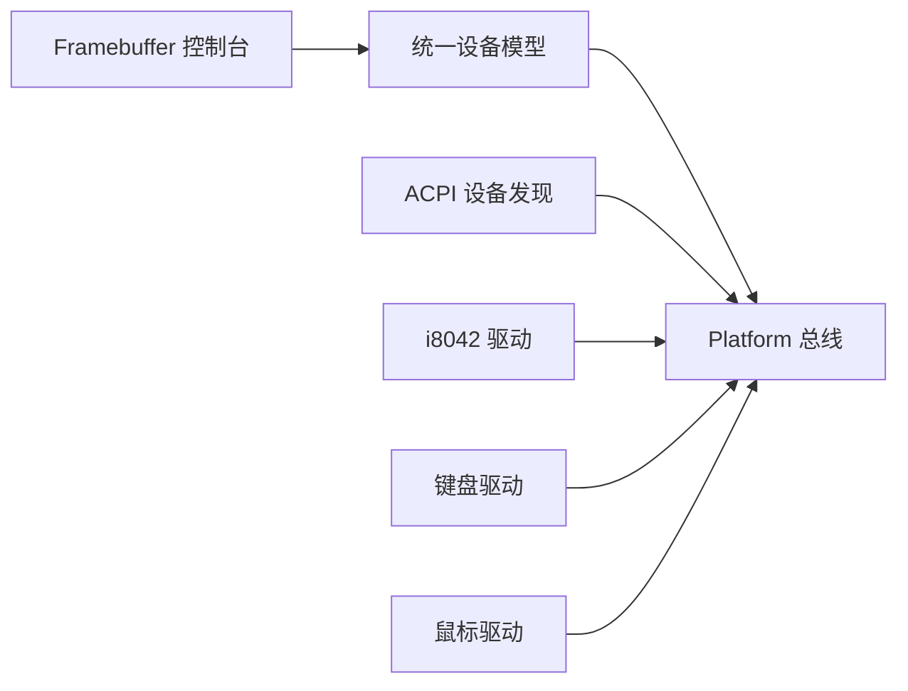

# 驱动生命周期管理

<cite>
**本文引用的文件**
- [includes/device/device.h](file://includes/device/device.h)
- [kernel/device/device.c](file://kernel/device/device.c)
- [includes/device/platform.h](file://includes/device/platform.h)
- [kernel/device/platform.c](file://kernel/device/platform.c)
- [kernel/i8042.c](file://kernel/i8042.c)
- [kernel/keyboard.c](file://kernel/keyboard.c)
- [kernel/mouse.c](file://kernel/mouse.c)
- [kernel/video/fb.c](file://kernel/video/fb.c)
- [kernel/device/acpi_dev.c](file://kernel/device/acpi_dev.c)
</cite>

## 目录
1. [简介](#简介)
2. [项目结构](#项目结构)
3. [核心组件](#核心组件)
4. [架构总览](#架构总览)
5. [详细组件分析](#详细组件分析)
6. [依赖关系分析](#依赖关系分析)
7. [性能与并发考虑](#性能与并发考虑)
8. [故障排查指南](#故障排查指南)
9. [结论](#结论)
10. [附录：API 速查](#附录api-速查)

## 简介
本文面向LulaOS的驱动开发者，系统化说明设备驱动的完整生命周期：初始化、注册、匹配、绑定、运行与卸载。重点覆盖以下主题：
- 驱动注册与注销 API（driver_register/driver_unregister）
- 设备与驱动的匹配机制（bus_type->match）
- probe/remove 回调的作用与执行时机
- 驱动加载失败处理与资源清理
- 并发访问控制与同步机制建议
- 常见生命周期问题与调试技巧

## 项目结构
LulaOS 采用“统一设备模型 + 总线”的分层设计：
- 统一设备模型提供 bus_type、device、device_driver 抽象及注册/匹配/绑定/解绑流程
- Platform 总线用于非 PCI 设备（如 PS/2 控制器、键盘、鼠标等），通过名称匹配
- ACPI 扫描将 DSDT 中的设备描述转换为 platform_device，并注册到平台总线
- 具体子系统（如 i8042、键盘、鼠标、Framebuffer）以 platform_driver 形式实现，完成硬件初始化与中断注册

图表来源
- [kernel/device/device.c:22-34](file://kernel/device/device.c#L22-L34)
- [kernel/device/platform.c:15-77](file://kernel/device/platform.c#L15-L77)
- [kernel/device/acpi_dev.c:749-776](file://kernel/device/acpi_dev.c#L749-L776)

章节来源
- [includes/device/device.h:26-77](file://includes/device/device.h#L26-L77)
- [kernel/device/device.c:22-165](file://kernel/device/device.c#L22-L165)
- [includes/device/platform.h:15-84](file://includes/device/platform.h#L15-L84)
- [kernel/device/platform.c:15-160](file://kernel/device/platform.c#L15-L160)

## 核心组件
- bus_type：定义总线名称、设备/驱动链表以及 match/probe/remove 回调
- device：设备基础结构，包含所属总线、已绑定驱动指针、私有数据
- device_driver：驱动基础结构，包含驱动名、所属总线
- Platform 总线：基于名称匹配的 platform_match；转发到 platform_driver->probe/remove
- ACPI 设备发现：解析 DSDT，生成 platform_device 并注册

关键职责与交互：
- 总线注册后，设备/驱动分别加入各自链表
- 设备注册时尝试匹配已注册驱动；驱动注册时尝试匹配已注册设备
- 匹配成功后调用总线 probe，再调用具体驱动 probe/remove

章节来源
- [includes/device/device.h:26-77](file://includes/device/device.h#L26-L77)
- [kernel/device/device.c:42-87](file://kernel/device/device.c#L42-L87)
- [kernel/device/platform.c:25-62](file://kernel/device/platform.c#L25-L62)

## 架构总览
下图展示从系统启动到驱动运行的关键序列：总线初始化、设备/驱动注册、匹配与 probe 调用。

图表来源
- [kernel/device/device.c:94-139](file://kernel/device/device.c#L94-L139)
- [kernel/device/platform.c:84-114](file://kernel/device/platform.c#L84-L114)
- [kernel/device/platform.c:37-50](file://kernel/device/platform.c#L37-L50)

## 详细组件分析

### 统一设备模型（bus/device/driver）
- 总线注册：初始化设备/驱动链表并加入全局总线列表
- 设备注册：加入总线设备链表，随后尝试匹配已注册驱动
- 驱动注册：加入总线驱动链表，随后尝试匹配已注册设备
- 设备注销：若已绑定驱动且总线提供 remove，则调用 remove，并从链表移除
- 驱动注销：遍历设备链表，解除绑定并调用 remove

图表来源
- [kernel/device/device.c:22-165](file://kernel/device/device.c#L22-L165)

章节来源
- [kernel/device/device.c:22-165](file://kernel/device/device.c#L22-L165)

### Platform 总线与匹配机制
- platform_match：比较 platform_device.dev.name 与 platform_driver.driver.name
- platform_probe：将统一模型的 probe 转发到 platform_driver->probe
- platform_remove：将统一模型的 remove 转发到 platform_driver->remove

图表来源
- [includes/device/device.h:26-77](file://includes/device/device.h#L26-L77)
- [includes/device/platform.h:28-84](file://includes/device/platform.h#L28-L84)
- [kernel/device/platform.c:15-77](file://kernel/device/platform.c#L15-L77)

章节来源
- [kernel/device/platform.c:25-62](file://kernel/device/platform.c#L25-L62)
- [includes/device/platform.h:28-84](file://includes/device/platform.h#L28-L84)

### ACPI 设备发现与注册
- 扫描 DSDT，提取 _HID/_CRS 等资源信息
- 构造 platform_device 并设置 name（优先 HID）、资源数组
- 调用 platform_device_register 注册，触发匹配流程

图表来源
- [kernel/device/acpi_dev.c:749-776](file://kernel/device/acpi_dev.c#L749-L776)
- [kernel/device/platform.c:84-98](file://kernel/device/platform.c#L84-L98)

章节来源
- [kernel/device/acpi_dev.c:749-776](file://kernel/device/acpi_dev.c#L749-L776)

### i8042 控制器驱动（PS/2 控制器）
- 作为 platform_device 与 platform_driver 注册
- probe 中完成控制器自检、端口启用、配置字节更新、鼠标初始化
- 若 ACPI 未发现键盘/鼠标设备，回退注册对应 platform_device

图表来源
- [kernel/i8042.c:267-303](file://kernel/i8042.c#L267-L303)
- [kernel/i8042.c:128-220](file://kernel/i8042.c#L128-L220)

章节来源
- [kernel/i8042.c:128-303](file://kernel/i8042.c#L128-L303)

### 键盘与鼠标驱动
- 设备由 ACPI 或 i8042 回退注册，驱动仅负责匹配与中断注册
- probe 中从资源获取 IRQ，计算向量并注册中断处理函数
- 中断处理函数区分数据来源（键盘/鼠标），读取数据并处理

图表来源
- [kernel/keyboard.c:197-234](file://kernel/keyboard.c#L197-L234)
- [kernel/mouse.c:129-166](file://kernel/mouse.c#L129-L166)

章节来源
- [kernel/keyboard.c:197-234](file://kernel/keyboard.c#L197-L234)
- [kernel/mouse.c:129-166](file://kernel/mouse.c#L129-L166)

### Framebuffer 控制台
- 通过 Multiboot 获取 framebuffer 参数，使用 ioremap 映射显存
- 提供字符渲染、滚动、清屏等接口
- 支持运行时模式更新（分辨率变化时重新映射与参数同步）

图表来源
- [kernel/video/fb.c:255-319](file://kernel/video/fb.c#L255-L319)
- [kernel/video/fb.c:222-251](file://kernel/video/fb.c#L222-L251)

章节来源
- [kernel/video/fb.c:255-319](file://kernel/video/fb.c#L255-L319)
- [kernel/video/fb.c:222-251](file://kernel/video/fb.c#L222-L251)

## 依赖关系分析
- 统一设备模型为所有总线提供通用生命周期管理
- Platform 总线依赖统一模型，并通过名称匹配驱动与设备
- ACPI 设备发现依赖 Platform 总线进行设备注册
- 具体驱动（i8042、键盘、鼠标）依赖 Platform 总线与中断子系统
- Framebuffer 控制台依赖内存管理与页表映射

图表来源
- [kernel/device/device.c:22-165](file://kernel/device/device.c#L22-L165)
- [kernel/device/platform.c:15-160](file://kernel/device/platform.c#L15-L160)
- [kernel/device/acpi_dev.c:749-776](file://kernel/device/acpi_dev.c#L749-L776)

章节来源
- [kernel/device/device.c:22-165](file://kernel/device/device.c#L22-L165)
- [kernel/device/platform.c:15-160](file://kernel/device/platform.c#L15-L160)
- [kernel/device/acpi_dev.c:749-776](file://kernel/device/acpi_dev.c#L749-L776)

## 性能与并发考虑
- 匹配与绑定过程在注册时串行遍历链表，时间复杂度 O(N)，N 为同总线设备/驱动数量
- 建议在大规模设备场景下优化匹配策略（如哈希索引）
- 当前实现未显式加锁保护总线链表；在高并发环境下需引入自旋锁/互斥锁保护注册/注销路径
- 中断上下文内避免阻塞操作，确保 probe/remove 不进入睡眠
- 资源分配失败时应尽早返回错误，并在上层进行清理（见下文故障排查）

[本节为通用指导，不直接分析具体文件]

## 故障排查指南
常见问题与定位方法：
- 驱动未匹配
  - 检查 platform_device.dev.name 与 platform_driver.driver.name 是否一致
  - 确认 platform_bus_init 已调用，总线已注册
  - 查看日志输出，确认 device_register/driver_register 是否成功
- probe 失败
  - 检查资源获取是否正确（IRQ/MMIO/I/O）
  - 确认硬件初始化顺序（如 i8042 控制器先于键盘/鼠标驱动）
  - 若请求中断失败，记录错误并返回负值，避免部分初始化残留
- 资源泄漏
  - 在 probe 失败分支释放已分配资源（如未完全初始化的寄存器、中断）
  - 在 remove 中释放中断、映射内存、关闭设备等
- 并发冲突
  - 对共享数据结构（总线链表、设备状态）增加锁保护
  - 中断处理函数中避免长时间阻塞，必要时使用软中断/工作队列

章节来源
- [kernel/device/device.c:94-165](file://kernel/device/device.c#L94-L165)
- [kernel/device/platform.c:84-114](file://kernel/device/platform.c#L84-L114)
- [kernel/i8042.c:128-220](file://kernel/i8042.c#L128-L220)
- [kernel/keyboard.c:197-234](file://kernel/keyboard.c#L197-L234)
- [kernel/mouse.c:129-166](file://kernel/mouse.c#L129-L166)

## 结论
LulaOS 的统一设备模型提供了清晰的驱动生命周期管理框架：总线抽象、设备/驱动注册、匹配与绑定、probe/remove 回调。Platform 总线通过名称匹配简化了非 PCI 设备的接入；ACPI 设备发现将固件描述转化为系统可识别的设备对象；具体驱动专注于硬件初始化与中断处理。为确保稳定性与可维护性，建议：
- 严格遵循注册/注销顺序与错误处理
- 在 probe/remove 中妥善管理资源
- 在高并发场景引入适当的同步原语
- 利用日志与最小化复现手段快速定位问题

[本节为总结，不直接分析具体文件]

## 附录：API 速查
- 总线注册/注销
  - bus_register：注册总线类型，初始化设备/驱动链表
- 设备注册/注销
  - device_register：注册设备，触发匹配
  - device_unregister：注销设备，调用 remove 并解除绑定
- 驱动注册/注销
  - driver_register：注册驱动，触发匹配
  - driver_unregister：注销驱动，解除所有绑定并调用 remove
- Platform 总线
  - platform_bus_init：注册 Platform 总线
  - platform_device_register：注册 platform_device
  - platform_driver_register：注册 platform_driver
  - platform_find_device：按名称查找设备
  - platform_get_resource：获取指定类型与序号的资源

章节来源
- [includes/device/device.h:68-77](file://includes/device/device.h#L68-L77)
- [kernel/device/device.c:22-165](file://kernel/device/device.c#L22-L165)
- [kernel/device/platform.c:70-160](file://kernel/device/platform.c#L70-L160)