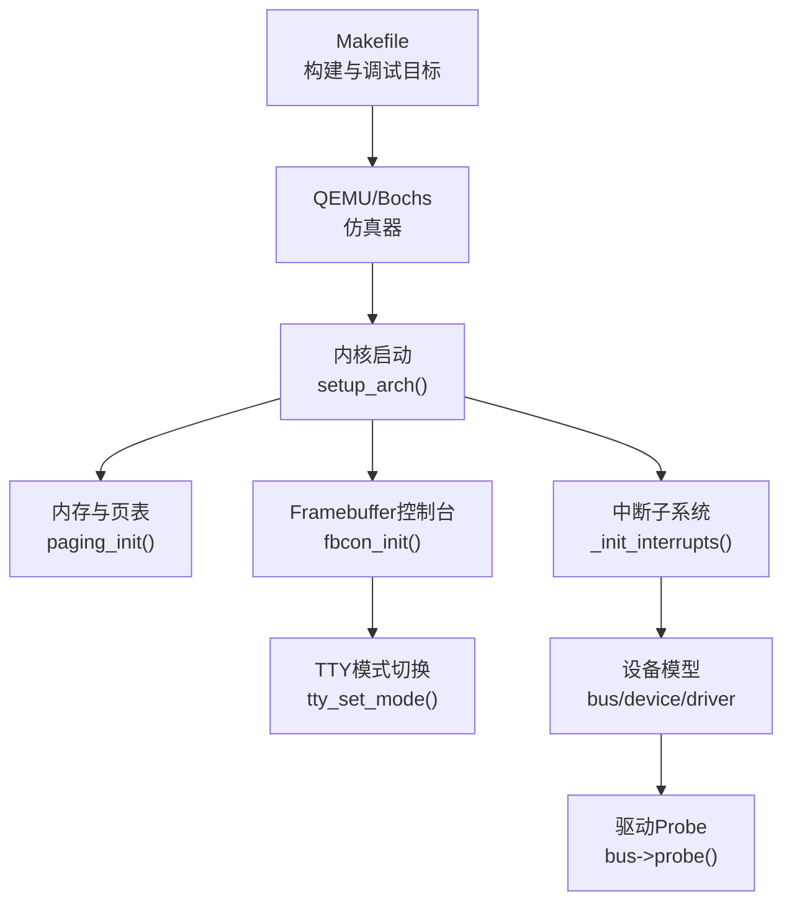
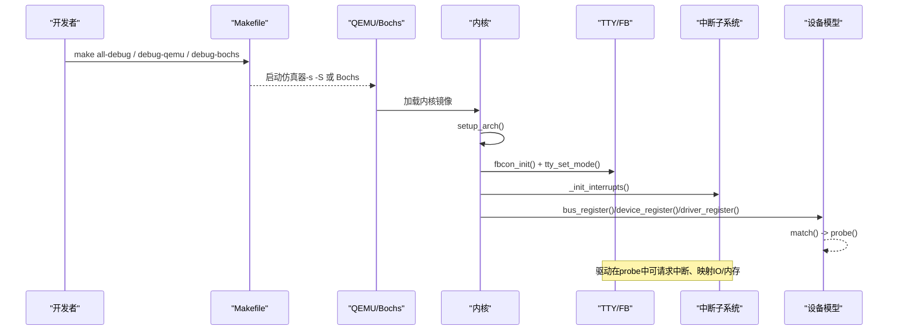
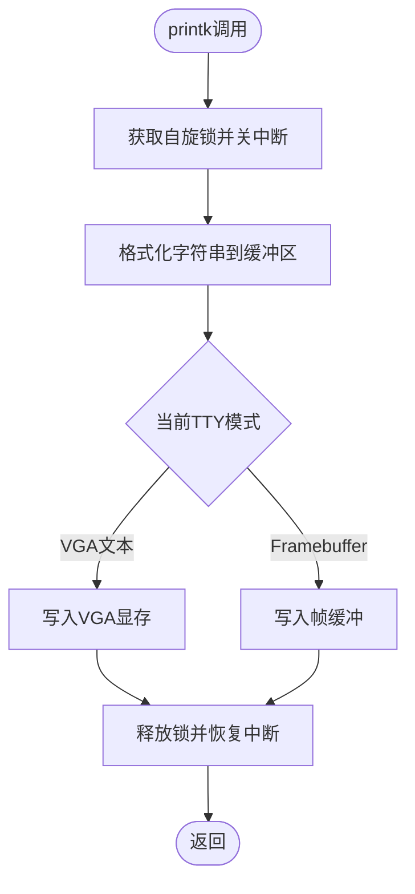
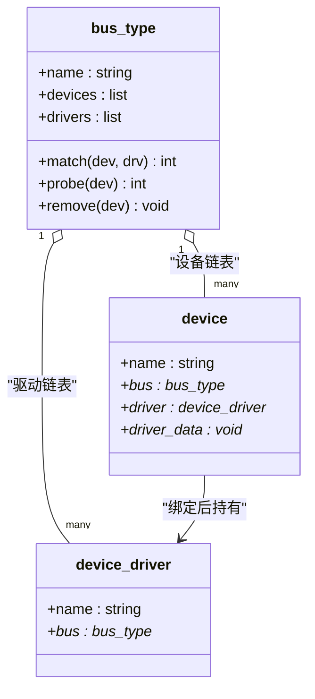
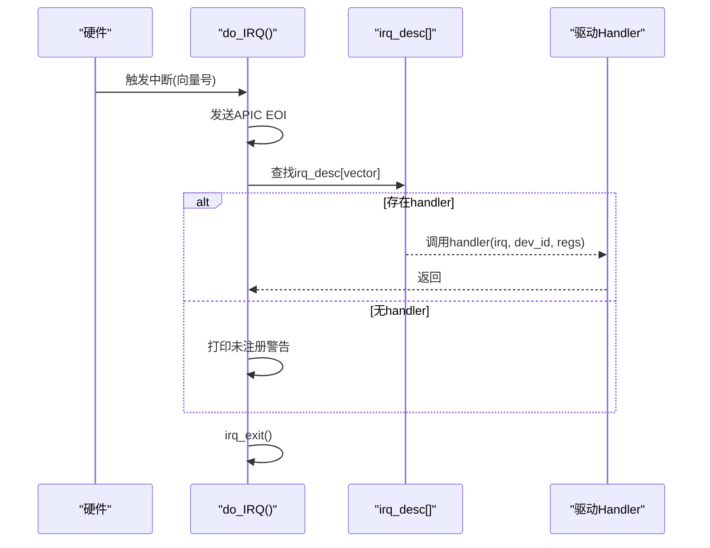
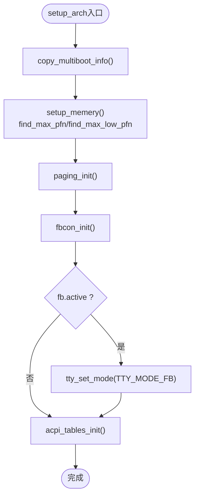
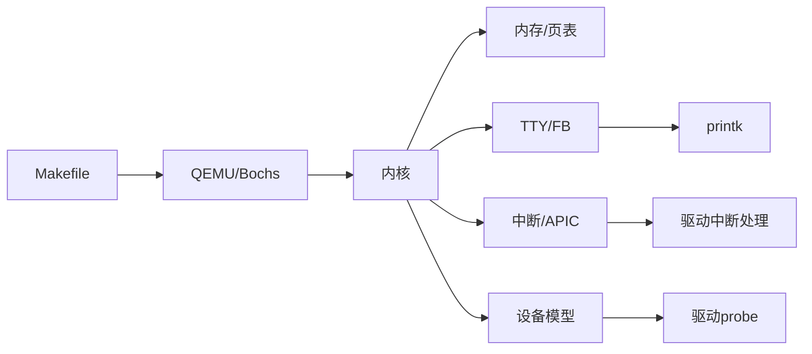

# 驱动调试与故障排除

<cite>
**本文引用的文件**
- [README.md](file://README.md)
- [Makefile](file://Makefile)
- [bochs.cfg](file://bochs.cfg)
- [bochsrc.bxrc](file://bochsrc.bxrc)
- [printk.h](file://includes/printk.h)
- [printk.c](file://kernel/printk.c)
- [tty.h](file://includes/tty/tty.h)
- [tty.c](file://kernel/tty/tty.c)
- [device.h](file://includes/device/device.h)
- [device.c](file://kernel/device/device.c)
- [interrupts.h](file://includes/interrupts/interrupts.h)
- [interrupts.c](file://kernel/interrupts/interrupts.c)
- [setup.c](file://arch/x86/kernel/setup.c)
- [mm.h](file://includes/mm/mm.h)
</cite>

## 目录
1. [简介](#简介)
2. [项目结构](#项目结构)
3. [核心组件](#核心组件)
4. [架构总览](#架构总览)
5. [详细组件分析](#详细组件分析)
6. [依赖关系分析](#依赖关系分析)
7. [性能考虑](#性能考虑)
8. [故障排除指南](#故障排除指南)
9. [结论](#结论)
10. [附录](#附录)

## 简介
本指南面向LulaOS设备驱动开发者，聚焦于驱动调试与故障排除。内容涵盖：
- 常用调试技术与工具：printk日志、内核日志分析、GDB远程调试、Bochs/QEMU环境配置
- 常见驱动问题诊断：设备无法识别、资源冲突、中断处理异常等
- 系统化排查流程与定位技巧
- 性能分析与优化：CPU使用率、内存泄漏检测思路
- 典型故障案例与解决方案
- 调试脚本与自动化测试方法

## 项目结构
LulaOS的调试能力由以下关键部分组成：
- 构建与运行：通过Makefile提供all-debug、debug-qemu、debug-bochs等目标，生成带调试符号的内核镜像并启动QEMU/Bochs
- 输出子系统：printk通过TTY层输出到VGA文本或Framebuffer；早期输出被缓存并在切换显示模式后重放
- 设备模型：统一的bus/device/driver注册与匹配机制，便于追踪设备绑定与probe过程
- 中断子系统：IRQ描述符表、request_irq/free_irq、do_IRQ入口、APIC定时器与错误中断
- 初始化流程：setup_arch中完成内存、页表、Framebuffer控制台、ACPI等初始化

图表来源
- [Makefile:88-112](file://Makefile#L88-L112)
- [setup.c:201-214](file://arch/x86/kernel/setup.c#L201-L214)
- [tty.c:105-123](file://kernel/tty/tty.c#L105-L123)
- [interrupts.c:18-27](file://kernel/interrupts/interrupts.c#L18-L27)
- [device.c:22-34](file://kernel/device/device.c#L22-L34)

章节来源
- [Makefile:88-112](file://Makefile#L88-L112)
- [setup.c:201-214](file://arch/x86/kernel/setup.c#L201-L214)

## 核心组件
- printk与TTY输出：SMP安全的printk实现，结合早期缓冲区与Framebuffer重放，确保早期日志不丢失
- 设备模型：总线、设备、驱动的注册与匹配，支持match/probe/remove回调
- 中断系统：IRQ描述符表、request_irq/free_irq、do_IRQ分发、APIC定时器与错误中断处理
- 初始化流程：setup_arch负责内存、页表、控制台、ACPI等初始化顺序

章节来源
- [printk.c:21-35](file://kernel/printk.c#L21-L35)
- [tty.c:8-123](file://kernel/tty/tty.c#L8-L123)
- [device.c:22-165](file://kernel/device/device.c#L22-L165)
- [interrupts.c:18-145](file://kernel/interrupts/interrupts.c#L18-L145)
- [setup.c:201-214](file://arch/x86/kernel/setup.c#L201-L214)

## 架构总览
下图展示从构建到驱动probe的关键路径，以及中断与输出的交互关系。

图表来源
- [Makefile:88-112](file://Makefile#L88-L112)
- [setup.c:201-214](file://arch/x86/kernel/setup.c#L201-L214)
- [device.c:22-165](file://kernel/device/device.c#L22-L165)
- [interrupts.c:18-27](file://kernel/interrupts/interrupts.c#L18-L27)

## 详细组件分析

### printk与TTY输出子系统
- SMP安全：printk使用自旋锁+关中断保护，避免多核并发破坏缓冲与TTY输出
- 早期输出：TTY维护早期缓冲区，在切换到Framebuffer后自动重放，保证早期日志可见
- 模式切换：支持VGA文本与Framebuffer两种模式，切换时重放历史输出

图表来源
- [printk.c:21-35](file://kernel/printk.c#L21-L35)
- [tty.c:33-77](file://kernel/tty/tty.c#L33-L77)
- [tty.c:105-123](file://kernel/tty/tty.c#L105-L123)

章节来源
- [printk.c:21-35](file://kernel/printk.c#L21-L35)
- [tty.c:8-123](file://kernel/tty/tty.c#L8-L123)
- [tty.h:1-32](file://includes/tty/tty.h#L1-L32)

### 统一设备模型（bus/device/driver）
- 总线注册：初始化设备/驱动链表并加入全局总线列表
- 设备注册：将设备加入总线设备链表，尝试匹配已注册驱动
- 驱动注册：将驱动加入总线驱动链表，尝试匹配所有未绑定设备
- 匹配与探测：调用bus_type->match()判断是否匹配，成功后调用probe()

图表来源
- [device.h:32-66](file://includes/device/device.h#L32-L66)
- [device.c:22-165](file://kernel/device/device.c#L22-L165)

章节来源
- [device.h:1-80](file://includes/device/device.h#L1-L80)
- [device.c:1-165](file://kernel/device/device.c#L1-L165)

### 中断子系统
- IRQ描述符：每个向量对应一个handler、dev_id与名称
- request_irq/free_irq：注册/注销中断，自动使能/屏蔽IOAPIC RTE
- do_IRQ：硬件中断总入口，发送EOI，分发到具体handler
- APIC定时器与错误中断：调度tick与错误上报

图表来源
- [interrupts.c:84-108](file://kernel/interrupts/interrupts.c#L84-L108)
- [interrupts.c:40-77](file://kernel/interrupts/interrupts.c#L40-L77)
- [interrupts.h:35-42](file://includes/interrupts/interrupts.h#L35-L42)

章节来源
- [interrupts.c:18-145](file://kernel/interrupts/interrupts.c#L18-L145)
- [interrupts.h:1-78](file://includes/interrupts/interrupts.h#L1-L78)

### 初始化流程与显示切换
- setup_arch：复制Multiboot信息、设置内存、建立页表、初始化Framebuffer控制台、切换TTY模式、初始化ACPI
- 显示切换：fbcon_init后若active则切换至FB模式并重放早期输出

图表来源
- [setup.c:201-214](file://arch/x86/kernel/setup.c#L201-L214)
- [setup.c:182-197](file://arch/x86/kernel/setup.c#L182-L197)
- [tty.c:105-123](file://kernel/tty/tty.c#L105-L123)

章节来源
- [setup.c:201-214](file://arch/x86/kernel/setup.c#L201-L214)
- [setup.c:182-197](file://arch/x86/kernel/setup.c#L182-L197)

## 依赖关系分析
- Makefile依赖：构建目标all-debug、debug-qemu、debug-bochs分别控制编译选项与调试参数
- 运行时依赖：printk依赖TTY；TTY依赖Framebuffer；设备模型依赖总线；中断依赖APIC/IOAPIC
- 初始化顺序：内存与页表先于Framebuffer；Framebuffer先于TTY模式切换；中断子系统在早期初始化

图表来源
- [Makefile:88-112](file://Makefile#L88-L112)
- [setup.c:201-214](file://arch/x86/kernel/setup.c#L201-L214)
- [printk.c:21-35](file://kernel/printk.c#L21-L35)
- [device.c:22-165](file://kernel/device/device.c#L22-L165)
- [interrupts.c:18-145](file://kernel/interrupts/interrupts.c#L18-L145)

章节来源
- [Makefile:88-112](file://Makefile#L88-L112)
- [setup.c:201-214](file://arch/x86/kernel/setup.c#L201-L214)

## 性能考虑
- CPU使用率分析
  - 利用APIC定时器中断进行调度tick，观察scheduler_tick调用频率与need_resched标志
  - 在驱动中断处理中尽量减少耗时操作，必要时延后至软中断或工作队列
- 内存使用与泄漏检测
  - 基于bootmem分配器的页面分配逻辑，关注连续块分配失败与对齐策略
  - 使用printk记录关键分配点与释放点，核对引用计数与释放路径
  - 借助GDB断点检查page结构与引用计数变化，定位潜在泄漏

章节来源
- [interrupts.c:116-128](file://kernel/interrupts/interrupts.c#L116-L128)
- [bootmem.c:84-139](file://kernel/mm/bootmem.c#L84-L139)
- [mm.h:11-98](file://includes/mm/mm.h#L11-L98)

## 故障排除指南

### 常见问题与定位方法
- 设备无法识别
  - 检查总线是否注册成功、设备与驱动是否注册
  - 确认match逻辑是否正确，probe是否被调用
  - 使用printk在注册与匹配关键点输出状态
- 资源冲突
  - 检查request_irq是否返回失败（已被占用）
  - 核对IO端口/Memory区域映射是否重复
  - 使用printk输出资源申请结果与地址范围
- 中断处理异常
  - 确认do_IRQ是否收到预期向量，是否存在未注册handler
  - 检查EOI发送时机与中断屏蔽/解除逻辑
  - 使用GDB在do_IRQ与驱动handler处断点，查看寄存器与栈回溯

章节来源
- [device.c:22-165](file://kernel/device/device.c#L22-L165)
- [interrupts.c:40-108](file://kernel/interrupts/interrupts.c#L40-L108)
- [printk.c:21-35](file://kernel/printk.c#L21-L35)

### 系统化排查流程
1. 启用最小化日志：在关键路径添加printk，确认初始化顺序与模块加载
2. 验证设备模型：打印总线、设备、驱动名称与匹配结果
3. 验证中断链路：在request_irq/free_irq与do_IRQ前后打印状态
4. 使用仿真器调试：QEMU -s -S或Bochs开启调试接口，配合GDB远程调试
5. 逐步缩小范围：禁用非必要功能，聚焦问题模块

章节来源
- [Makefile:88-112](file://Makefile#L88-L112)
- [device.c:22-165](file://kernel/device/device.c#L22-L165)
- [interrupts.c:40-108](file://kernel/interrupts/interrupts.c#L40-L108)

### 性能瓶颈定位
- 热点路径：在驱动probe与中断处理中添加时间戳或计数器，评估耗时
- 中断上下文：避免在中断中执行阻塞或长耗时操作，改用软中断或延迟任务
- 内存分配：关注连续块分配失败与对齐导致的碎片，合理调整分配策略

章节来源
- [interrupts.c:116-128](file://kernel/interrupts/interrupts.c#L116-L128)
- [bootmem.c:84-139](file://kernel/mm/bootmem.c#L84-L139)

## 结论
LulaOS提供了完善的驱动调试基础能力：SMP安全的printk输出、统一的设备模型、完整的中断子系统以及便捷的构建与仿真调试目标。通过系统化流程与工具链（QEMU/Bochs/GDB），可有效定位设备识别、资源冲突与中断异常等问题，并结合性能分析方法优化驱动行为。

## 附录

### 调试环境与命令
- 构建调试镜像：make all-debug
- QEMU调试：make debug-qemu（启用-gdbserver与调试符号）
- Bochs调试：make debug-bochs（使用bochs.cfg）
- 参考文档：README.md中的工具安装与运行说明

章节来源
- [Makefile:88-112](file://Makefile#L88-L112)
- [README.md:15-84](file://README.md#L15-L84)
- [bochs.cfg:1-9](file://bochs.cfg#L1-L9)
- [bochsrc.bxrc:1-59](file://bochsrc.bxrc#L1-L59)

### 典型故障案例
- 案例一：设备未匹配
  - 现象：设备注册后未出现驱动绑定
  - 排查：检查bus->match实现与设备/驱动名称一致性；在device_attach与driver_attach中添加printk
  - 解决：修正匹配条件或设备标识
- 案例二：中断未触发
  - 现象：设备产生中断但驱动未响应
  - 排查：确认request_irq成功、IOAPIC RTE使能；在do_IRQ中打印向量与handler状态
  - 解决：修复中断向量映射或屏蔽位设置
- 案例三：早期日志丢失
  - 现象：切换Framebuffer后看不到早期输出
  - 排查：确认early_buf容量与tty_replay_buffer调用时机
  - 解决：增大缓冲区或确保在切换前正确记录

章节来源
- [device.c:42-87](file://kernel/device/device.c#L42-L87)
- [interrupts.c:40-108](file://kernel/interrupts/interrupts.c#L40-L108)
- [tty.c:8-123](file://kernel/tty/tty.c#L8-L123)

### 调试脚本与自动化测试建议
- 自动化构建与运行：封装make all-debug与debug-qemu为脚本，自动捕获日志与崩溃信息
- 日志采集：在驱动关键路径添加结构化printk，便于后续分析
- 回归测试：针对设备枚举、中断处理、资源分配编写最小用例，反复验证稳定性

章节来源
- [Makefile:88-112](file://Makefile#L88-L112)
- [printk.c:21-35](file://kernel/printk.c#L21-L35)