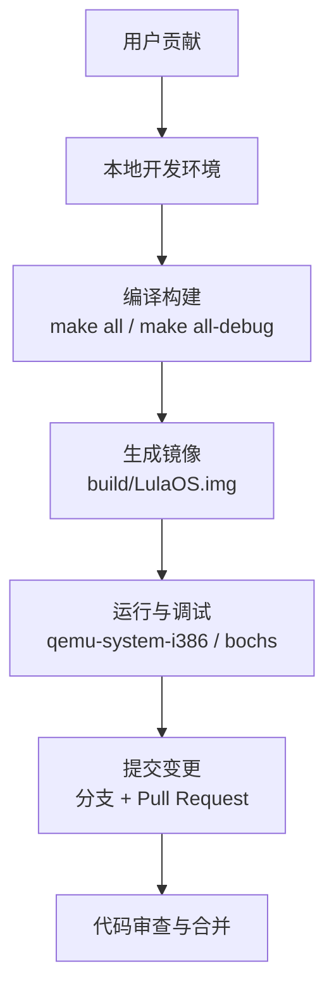
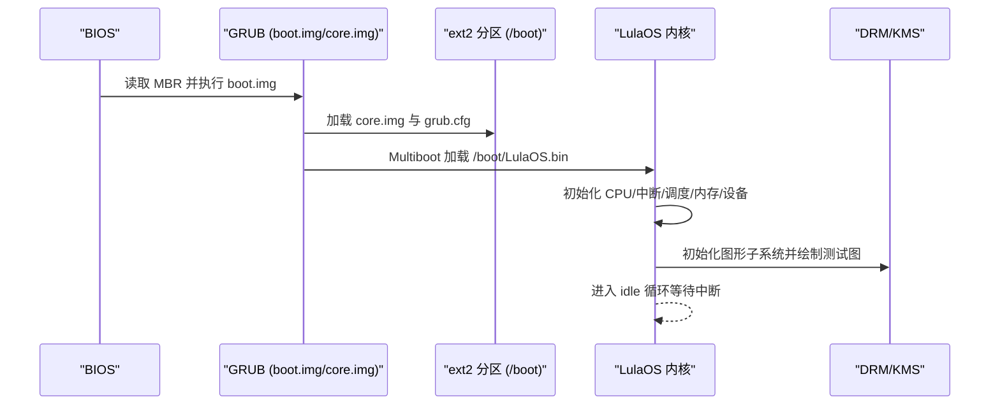
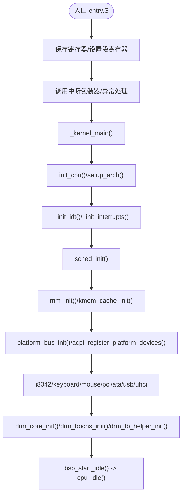
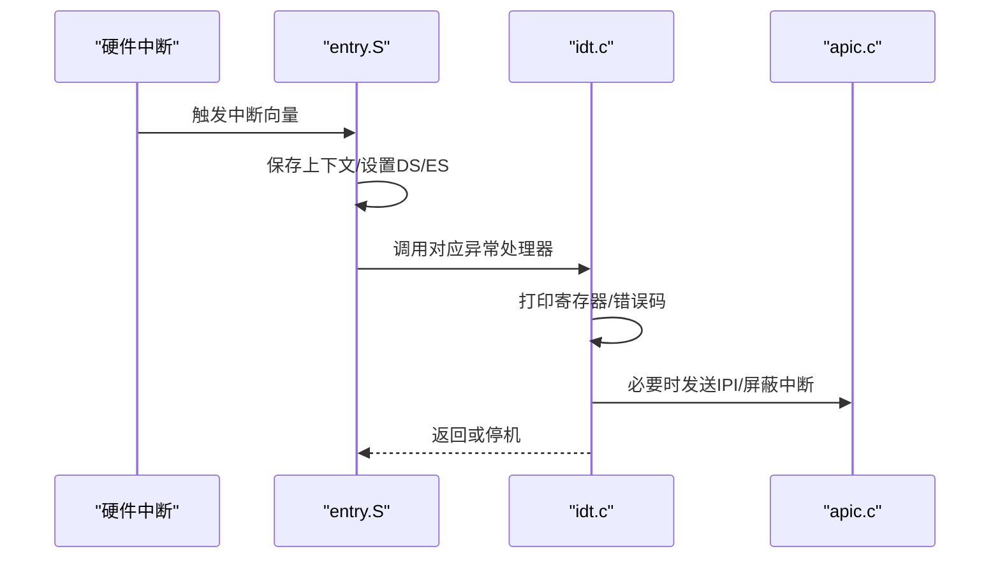
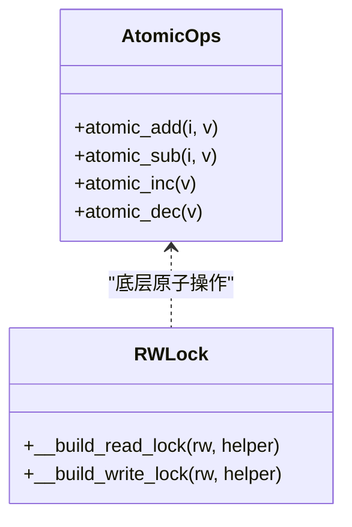
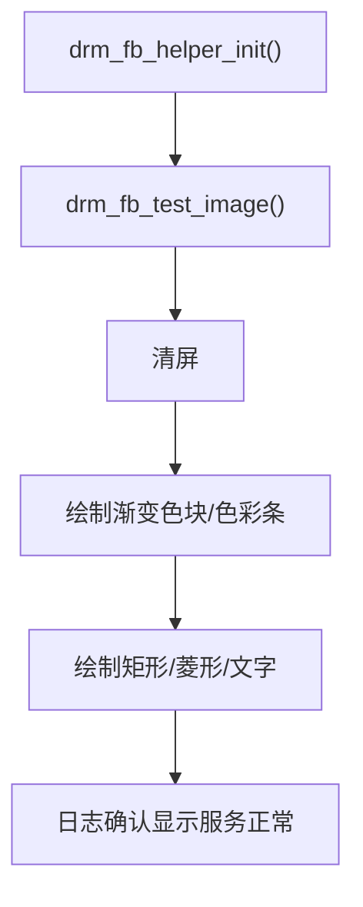
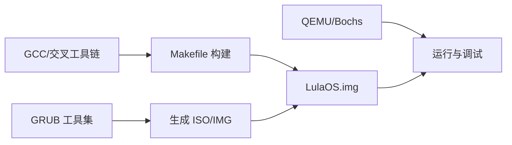

# 贡献者指南

<cite>
**本文引用的文件**
- [README.md](file://README.md)
- [Makefile](file://Makefile)
- [LICENSE](file://LICENSE)
- [bochs.cfg](file://bochs.cfg)
- [config-grub.sh](file://config-grub.sh)
- [disk-image-layout.md](file://docs/disk-image-layout.md)
- [kernel.c](file://kernel/kernel.c)
- [entry.S](file://arch/x86/entry.S)
- [idt.c](file://arch/x86/kernel/idt.c)
- [apic.c](file://arch/x86/kernel/apic.c)
- [rwlock.h](file://includes/arch/x86/rwlock.h)
- [atomic.h](file://includes/arch/x86/atomic.h)
- [drm_fb_helper.c](file://kernel/drm/drm_fb_helper.c)
</cite>

## 目录
1. [简介](#简介)
2. [项目结构](#项目结构)
3. [核心组件](#核心组件)
4. [架构总览](#架构总览)
5. [详细组件分析](#详细组件分析)
6. [依赖关系分析](#依赖关系分析)
7. [性能与构建优化](#性能与构建优化)
8. [故障排查指南](#故障排查指南)
9. [结论](#结论)
10. [附录](#附录)

## 简介
本指南面向希望为 LulaOS 做出贡献的开发者，涵盖开发环境搭建、构建与调试流程、代码提交流程与 Git 工作流规范、代码审查与合并标准、测试与质量保证、问题报告与功能请求流程、社区参与行为准则以及许可证与知识产权政策。文档基于仓库现有配置与实现进行说明，确保可操作性和一致性。

## 项目结构
LulaOS 采用分层组织：
- arch/x86：x86 架构相关引导、中断、SMP、内存管理等底层实现
- kernel：内核子系统（调度、设备模型、DRM/KMS、USB、TTY、PCI、ACPI 等）
- includes：公共头文件（架构抽象、设备接口、内存管理、库函数等）
- libs：基础库（如 vsprintf）
- docs：技术文档（磁盘镜像布局、DRM 子系统、Linux 设备模型等）
- 构建与运行：Makefile、GRUB 配置脚本、Bochs/QEMU 配置文件

**章节来源**
- [Makefile:1-138](file://Makefile#L1-L138)
- [README.md:1-84](file://README.md#L1-L84)
- [disk-image-layout.md:1-263](file://docs/disk-image-layout.md#L1-L263)

## 核心组件
- 启动与初始化：入口汇编将控制权交给内核主函数，完成 GDT/IDT、中断、调度、内存、设备总线、图形子系统等初始化后进入 idle 循环
- 中断与异常：统一的中断包装器与异常处理，支持 IPI、APIC、IOAPIC 路由
- 并发原语：原子操作与读写锁提供跨核同步能力
- 图形显示：DRM/KMS 框架与 Bochs/VBE 驱动，提供帧缓冲绘制与测试图像
- 构建系统：通过 Makefile 生成内核二进制、GRUB 镜像、ext2 分区并拼接最终磁盘镜像

**章节来源**
- [kernel.c:27-141](file://kernel/kernel.c#L27-L141)
- [entry.S:41-200](file://arch/x86/entry.S#L41-L200)
- [apic.c:361-398](file://arch/x86/kernel/apic.c#L361-L398)
- [rwlock.h:1-75](file://includes/arch/x86/rwlock.h#L1-L75)
- [atomic.h:1-74](file://includes/arch/x86/atomic.h#L1-L74)
- [drm_fb_helper.c:419-609](file://kernel/drm/drm_fb_helper.c#L419-L609)

## 架构总览
下图展示从 BIOS 到内核运行的关键阶段，以及与 GRUB、文件系统、内核初始化的交互。

**图表来源**
- [disk-image-layout.md:46-75](file://docs/disk-image-layout.md#L46-L75)
- [kernel.c:73-141](file://kernel/kernel.c#L73-L141)

**章节来源**
- [disk-image-layout.md:1-263](file://docs/disk-image-layout.md#L1-L263)
- [kernel.c:73-141](file://kernel/kernel.c#L73-L141)

## 详细组件分析

### 启动与初始化流程
- 入口汇编负责保存寄存器上下文、设置段寄存器、调用 C 层中断包装器，并在中断返回前检查是否需要调度
- 内核主函数依次初始化 CPU、架构、IDT、中断、调度、内存、平台总线、ACPI、PS/2、键盘鼠标、PCI、ATA、USB、UHCI、DRM 等子系统，最后切换到 init 栈并进入 idle

**图表来源**
- [entry.S:41-200](file://arch/x86/entry.S#L41-L200)
- [kernel.c:27-141](file://kernel/kernel.c#L27-L141)

**章节来源**
- [entry.S:41-200](file://arch/x86/entry.S#L41-L200)
- [kernel.c:27-141](file://kernel/kernel.c#L27-L141)

### 中断与异常处理
- 硬件中断向量在入口汇编中压入向量号并跳转至 do_IRQ 或具体处理器
- 异常处理打印寄存器状态与错误码，内核态异常会停机防止无限循环
- APIC/IOAPIC 用于 IPI 发送与中断路由，写入顺序需先高后低以避免竞态

**图表来源**
- [entry.S:93-200](file://arch/x86/entry.S#L93-L200)
- [idt.c:173-239](file://arch/x86/kernel/idt.c#L173-L239)
- [apic.c:361-398](file://arch/x86/kernel/apic.c#L361-L398)

**章节来源**
- [entry.S:93-200](file://arch/x86/entry.S#L93-L200)
- [idt.c:173-239](file://arch/x86/kernel/idt.c#L173-L239)
- [apic.c:361-398](file://arch/x86/kernel/apic.c#L361-L398)

### 并发与同步
- 原子操作使用 LOCK 前缀保证多核安全
- 读写锁通过宏展开内联汇编实现读/写临界区保护

**图表来源**
- [atomic.h:1-74](file://includes/arch/x86/atomic.h#L1-L74)
- [rwlock.h:1-75](file://includes/arch/x86/rwlock.h#L1-L75)

**章节来源**
- [atomic.h:1-74](file://includes/arch/x86/atomic.h#L1-L74)
- [rwlock.h:1-75](file://includes/arch/x86/rwlock.h#L1-L75)

### 图形显示与测试
- DRM/KMS 初始化后，通过帧缓冲 API 绘制测试图像以验证显示路径
- 测试包含清屏、色块、色彩条、几何图形与文字输出

**图表来源**
- [drm_fb_helper.c:419-609](file://kernel/drm/drm_fb_helper.c#L419-L609)

**章节来源**
- [drm_fb_helper.c:419-609](file://kernel/drm/drm_fb_helper.c#L419-L609)

## 依赖关系分析
- 构建依赖：GCC/G++、交叉工具链、QEMU、Bochs、GRUB 工具集
- 运行时依赖：MBR、GRUB core.img、ext2 分区、内核 ELF
- 子系统依赖：设备模型、ACPI、PCI、USB/UHCI、DRM/KMS

**图表来源**
- [Makefile:86-113](file://Makefile#L86-L113)
- [disk-image-layout.md:79-263](file://docs/disk-image-layout.md#L79-L263)

**章节来源**
- [Makefile:1-138](file://Makefile#L1-L138)
- [disk-image-layout.md:79-263](file://docs/disk-image-layout.md#L79-L263)

## 性能与构建优化
- 发布构建：使用优化级别 -O3，关闭多余调试信息
- 调试构建：all-debug 目标启用 -g、禁用优化、生成符号与反汇编转储
- 镜像构建：通过 staging 目录与 mke2fs -d 一次性写入 ext2 分区，避免中间状态
- 建议：
  - 修改内核或驱动后，始终运行 all-debug 并生成 kdump.txt 以便定位
  - 使用 QEMU 远程调试端口配合 GDB 进行断点与单步调试
  - 保持 GRUB 模板与脚本一致，避免配置漂移

**章节来源**
- [Makefile:86-113](file://Makefile#L86-L113)
- [disk-image-layout.md:79-263](file://docs/disk-image-layout.md#L79-L263)

## 故障排查指南
- 常见问题
  - 无法引导：检查 MBR 签名、core.img 写入偏移、grub.cfg 路径与内容
  - 无显示输出：确认 DRM 初始化顺序与测试图像是否绘制成功
  - 中断不生效：检查 IOAPIC 写入顺序与 mask 位设置
- 调试方法
  - 使用 debug-qemu 目标启动 QEMU 并自动连接 GDB
  - 使用 debug-bochs 目标启动 Bochs 并查看日志
  - 查看内核 printk 输出与异常堆栈信息

**章节来源**
- [Makefile:99-113](file://Makefile#L99-L113)
- [bochs.cfg:1-9](file://bochs.cfg#L1-L9)
- [idt.c:173-239](file://arch/x86/kernel/idt.c#L173-L239)

## 结论
本指南提供了从零开始为 LulaOS 贡献所需的完整流程：环境搭建、构建与调试、代码提交流程、审查与合并、测试与质量保障、问题报告、社区参与与合规要求。遵循这些规范可显著提升协作效率与代码质量。

## 附录

### 开发环境设置
- 编译器与构建工具：安装 build-essential 与交叉工具链
- 调试工具：安装 GDB、QEMU、Bochs
- GRUB 工具链：安装 grub2-common、grub-pc-bin、xorriso
- 运行命令：make all；make debug-bochs

**章节来源**
- [README.md:1-84](file://README.md#L1-L84)

### 构建与运行命令
- 构建镜像：make all
- 调试构建：make all-debug
- QEMU 运行：make run-qemu
- QEMU 调试：make debug-qemu
- Bochs 调试：make debug-bochs

**章节来源**
- [Makefile:86-113](file://Makefile#L86-L113)

### 代码提交流程与 Git 工作流规范
- 分支策略
  - 主分支：main/master（受保护）
  - 功能分支：feature/<描述>
  - 修复分支：fix/<问题编号>-<描述>
  - 发布分支：release/<版本>
- 提交规范
  - 标题：[模块] 简短描述（例如：[drm] 修复测试图像绘制错位）
  - 正文：动机、变更内容、影响范围、测试方法
  - 关联：引用 Issue/Pull Request 编号
- 工作流
  - 创建分支 → 提交变更 → 本地构建与测试 → 推送分支 → 发起 Pull Request
  - 保持 PR 小而精，聚焦单一变更
  - 更新 PR 时补充测试证据与日志

### 代码审查与合并标准
- 审查要点
  - 正确性：逻辑正确、边界条件覆盖、并发安全
  - 可读性：命名清晰、注释充分、结构合理
  - 可维护性：模块化、低耦合、易扩展
  - 安全性：输入校验、权限控制、资源释放
  - 兼容性：与现有接口一致、不影响其他子系统
- 合并标准
  - 至少一名维护者审查通过
  - CI/构建与测试全部通过
  - 无遗留警告与回归
  - 文档与变更日志更新

### 测试要求与质量保证
- 单元测试：对新增函数编写最小化测试用例
- 集成测试：在内核启动后验证子系统功能（如 DRM 测试图像）
- 回归测试：针对历史缺陷添加用例
- 性能测试：关注中断延迟、内存分配、图形绘制性能
- 质量门禁
  - 编译无警告（-Wall -Wextra）
  - 静态分析通过（可选）
  - 覆盖率达标（可选）

### 问题报告与功能请求流程
- 问题报告
  - 标题：清晰描述问题现象
  - 复现步骤：环境、版本、操作步骤
  - 期望与实际结果对比
  - 日志与截图：printk 输出、GDB 会话、屏幕截图
- 功能请求
  - 背景与动机
  - 需求规格与接口设计
  - 影响评估与替代方案
  - 验收标准与测试计划

### 社区参与指南与行为准则
- 尊重与包容：鼓励多元观点，避免人身攻击
- 有效沟通：清晰表达、积极反馈、及时响应
- 持续学习：分享经验、帮助他人、提升整体水平
- 合规：遵守许可证与法律要求

### 许可证与知识产权政策
- 本项目采用 Apache License 2.0
- 贡献即表示同意以该许可证授权分发
- 保留版权与归属声明，不得移除 NOTICE
- 商标与品牌使用需遵循许可条款

**章节来源**
- [LICENSE:1-202](file://LICENSE#L1-L202)