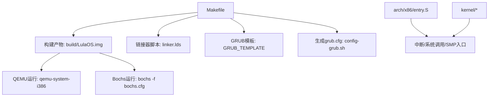
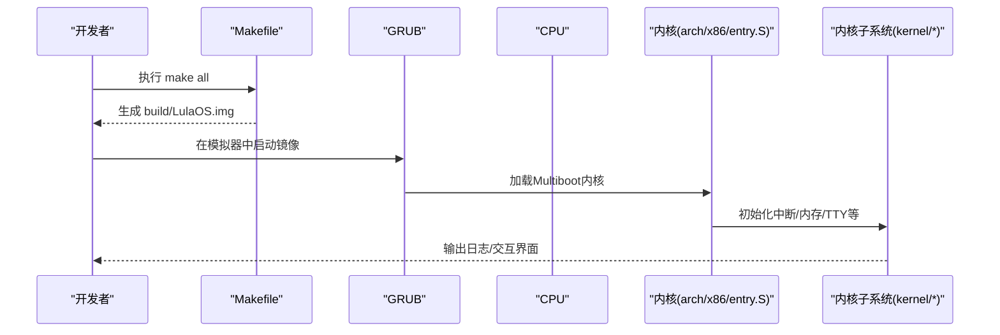
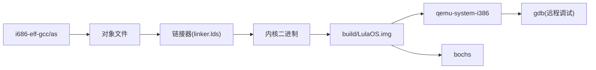

# 快速开始

<cite>
**本文引用的文件**
- [README.md](file://README.md)
- [Makefile](file://Makefile)
- [bochs.cfg](file://bochs.cfg)
- [bochsrc.bxrc](file://bochsrc.bxrc)
- [linker.lds](file://linker.lds)
- [GRUB_TEMPLATE](file://GRUB_TEMPLATE)
- [config-grub.sh](file://config-grub.sh)
- [arch/x86/entry.S](file://arch/x86/entry.S)
</cite>

## 目录
1. [简介](#简介)
2. [项目结构](#项目结构)
3. [核心组件](#核心组件)
4. [架构总览](#架构总览)
5. [详细组件分析](#详细组件分析)
6. [依赖关系分析](#依赖关系分析)
7. [性能与构建建议](#性能与构建建议)
8. [故障排查指南](#故障排查指南)
9. [结论](#结论)
10. [附录：从零到运行第一个内核](#附录从零到运行第一个内核)

## 简介
本指南面向首次接触 LulaOS 的开发者，提供从零开始的完整环境搭建、构建与运行流程。你将学会如何安装 GCC 交叉编译工具链、GDB、QEMU 与 Bochs，并掌握 make all 与 make debug-bochs 的作用与使用方式。通过本指南，你可以在最短时间内编译并运行你的第一个内核镜像。

## 项目结构
LulaOS 采用分层组织：
- arch/x86：架构相关代码（启动入口、中断向量、SMP trampoline 等）
- kernel：内核子系统（设备、内存、中断、TTY、USB、视频等）
- includes：头文件（架构、设备、内存、中断、TTY、USB、视频等）
- libs：通用库实现
- 顶层构建脚本与配置：Makefile、linker.lds、GRUB_TEMPLATE、config-grub.sh、bochs.cfg、bochsrc.bxrc

图表来源
- [Makefile:53-83](file://Makefile#L53-L83)
- [linker.lds:1-103](file://linker.lds#L1-L103)
- [GRUB_TEMPLATE:1-5](file://GRUB_TEMPLATE#L1-L5)
- [config-grub.sh:1-5](file://config-grub.sh#L1-L5)
- [arch/x86/entry.S:445-486](file://arch/x86/entry.S#L445-L486)

章节来源
- [Makefile:1-138](file://Makefile#L1-L138)
- [README.md:1-84](file://README.md#L1-L84)

## 核心组件
- 构建系统与目标
  - all：清理并构建可引导磁盘镜像 build/LulaOS.img
  - all-debug：以调试优化级别构建，并生成反汇编转储
  - debug-qemu/debug-bochs：分别启动 QEMU 或 Bochs 进行调试运行
- 链接器脚本
  - 定义内核加载虚拟地址基址、节布局、符号边界，确保多阶段引导正确执行
- 引导与启动
  - GRUB 模板与脚本生成 grub.cfg，将内核二进制作为 Multiboot 模块加载
  - 入口点由链接器指定，后续进入内核初始化流程
- 中断与系统调用
  - 统一的异常/中断包装器，系统调用入口 int 0x80，SMP AP 启动 trampoline

章节来源
- [Makefile:86-112](file://Makefile#L86-L112)
- [linker.lds:1-103](file://linker.lds#L1-L103)
- [GRUB_TEMPLATE:1-5](file://GRUB_TEMPLATE#L1-L5)
- [config-grub.sh:1-5](file://config-grub.sh#L1-L5)
- [arch/x86/entry.S:445-486](file://arch/x86/entry.S#L445-L486)

## 架构总览
下图展示了从宿主到内核运行的关键路径：构建系统生成 ISO/IMG，GRUB 加载内核，CPU 进入保护模式并跳转到内核入口，随后初始化中断、内存、设备等子系统。

图表来源
- [Makefile:53-83](file://Makefile#L53-L83)
- [GRUB_TEMPLATE:1-5](file://GRUB_TEMPLATE#L1-L5)
- [arch/x86/entry.S:445-486](file://arch/x86/entry.S#L445-L486)

## 详细组件分析

### 构建与运行命令
- make all
  - 作用：清理并构建可引导磁盘镜像 build/LulaOS.img，包含内核与 GRUB 配置
  - 关键点：生成 grub.cfg、拷贝内核二进制、创建 ext2 分区并写入 GRUB core，最终拼接为完整镜像
- make debug-bochs
  - 作用：以调试模式构建（关闭优化、保留调试信息），并启动 Bochs 加载 bochs.cfg 运行内核
- make debug-qemu
  - 作用：以调试模式构建，启动 QEMU 并在 1234 端口暴露调试接口，自动拉起 GDB 连接

章节来源
- [Makefile:86-112](file://Makefile#L86-L112)

### 链接器脚本与内存布局
- 入口点：ENTRY(start_)
- 虚拟基址：0xC0000000 + 偏移，确保内核映射在高地址空间
- 节布局：.text、.init.text、.data、.rodata、.bss 等，明确符号边界用于运行时定位
- SMP trampoline：独立节 .trampoline，供 AP 启动时复制执行

章节来源
- [linker.lds:1-103](file://linker.lds#L1-L103)

### 引导与 GRUB 集成
- GRUB_TEMPLATE：设置图形分辨率，并将构建的内核二进制作为 Multiboot 模块加载
- config-grub.sh：根据传入的 OS_NAME 生成 grub.cfg
- Makefile：在构建过程中生成 grub.cfg 并打包进镜像

章节来源
- [GRUB_TEMPLATE:1-5](file://GRUB_TEMPLATE#L1-L5)
- [config-grub.sh:1-5](file://config-grub.sh#L1-L5)
- [Makefile:57-83](file://Makefile#L57-L83)

### 中断与系统调用
- 统一中断包装器：保存寄存器、设置段寄存器、调用具体处理函数
- 系统调用入口：int 0x80，遵循 Linux ABI 传参与返回值约定
- SMP trampoline：AP 从实模式进入保护模式，开启分页后调用 start_secondary()

章节来源
- [arch/x86/entry.S:60-91](file://arch/x86/entry.S#L60-L91)
- [arch/x86/entry.S:445-486](file://arch/x86/entry.S#L445-L486)
- [arch/x86/entry.S:613-736](file://arch/x86/entry.S#L613-L736)

### 模拟器配置
- Bochs
  - bochs.cfg：指定磁盘镜像路径、内存大小、VGA 扩展、显示后端等
  - bochsrc.bxrc：Windows 平台示例配置（含 ROM 路径、PCI、VGA、CPU 特性等）
- QEMU
  - run-qemu/debug-qemu：启动 qemu-system-i386，附加监控端口与调试参数

章节来源
- [bochs.cfg:1-7](file://bochs.cfg#L1-L7)
- [bochsrc.bxrc:1-59](file://bochsrc.bxrc#L1-L59)
- [Makefile:99-112](file://Makefile#L99-L112)

## 依赖关系分析
- 构建依赖
  - i686-elf-gcc/i686-elf-as：32位 x86 交叉编译工具链
  - grub-mkrescue/grub-mkimage：生成 GRUB 引导镜像
  - mke2fs/sfdisk/dd：创建 ext2 分区与镜像拼接
- 运行依赖
  - qemu-system-i386：快速验证内核
  - bochs：更贴近硬件行为的仿真，适合调试
  - gdb：配合 QEMU 远程调试

图表来源
- [Makefile:23-29](file://Makefile#L23-L29)
- [Makefile:53-83](file://Makefile#L53-L83)
- [Makefile:99-112](file://Makefile#L99-L112)

章节来源
- [Makefile:23-29](file://Makefile#L23-L29)
- [Makefile:53-83](file://Makefile#L53-L83)
- [Makefile:99-112](file://Makefile#L99-L112)

## 性能与构建建议
- 开发阶段使用 all-debug 以获得更快的迭代与更好的调试体验
- 生产构建使用 all 以获得优化后的镜像
- 若需要查看内核反汇编，all-debug 会生成 kdump.txt 便于静态分析
- 合理设置 QEMU 与 Bochs 的 CPU/内存参数，避免资源不足导致卡顿

[本节为通用建议，不直接分析具体文件]

## 故障排查指南
- 找不到交叉编译器 i686-elf-gcc/i686-elf-as
  - 现象：make 报错提示命令未找到
  - 解决：安装或配置正确的 32 位 x86 交叉工具链
- GRUB 工具缺失
  - 现象：grub-mkrescue/grub-mkimage 未找到
  - 解决：安装 grub2-common、grub-pc-bin、xorriso
- 文件系统工具缺失
  - 现象：mke2fs/sfdisk/dd 未找到
  - 解决：安装 e2fsprogs、sfdisk、coreutils
- QEMU 无法启动或无显示
  - 现象：黑屏或报错
  - 解决：确认 qemu-system-i386 已安装；检查 VGA 扩展与显示后端；尝试调整分辨率
- Bochs 无法启动或 GUI 问题
  - 现象：GUI 崩溃或无法加载 ROM
  - 解决：检查 bochs.cfg 中的镜像路径；Windows 下参考 bochsrc.bxrc 配置 ROM 路径；安装必要的 GUI 依赖
- 调试连接失败
  - 现象：GDB 无法连接到 QEMU 的 1234 端口
  - 解决：确认 debug-qemu 已启动 QEMU 并监听 1234；检查防火墙；使用相同架构的 gdb（i686-elf-gdb）

章节来源
- [README.md:4-73](file://README.md#L4-L73)
- [Makefile:99-112](file://Makefile#L99-L112)
- [bochs.cfg:1-7](file://bochs.cfg#L1-L7)
- [bochsrc.bxrc:1-59](file://bochsrc.bxrc#L1-L59)

## 结论
通过本指南，你已经了解了 LulaOS 的构建系统、引导流程与调试方式。按照“从零到运行”的步骤，你可以快速搭建环境、构建镜像并在 QEMU 或 Bochs 中运行内核。遇到问题时，可参考故障排查部分定位并解决。

[本节为总结性内容，不直接分析具体文件]

## 附录：从零到运行第一个内核
以下为推荐的新手操作流程（基于仓库提供的工具链与脚本）：

- 准备基础工具
  - 安装构建工具与调试工具（GCC/G++、GDB、QEMU、GRUB 工具）
  - 如需 Bochs，按 README 说明安装依赖并编译安装
- 获取源码
  - 克隆或下载 LulaOS 源码到本地工作目录
- 构建镜像
  - 执行 make all，生成 build/LulaOS.img
- 运行内核
  - 使用 QEMU：执行 make run-qemu 或手动运行 qemu-system-i386 并挂载镜像
  - 使用 Bochs：执行 make debug-bochs 或手动运行 bochs -f ./bochs.cfg
- 调试内核
  - 使用 QEMU 调试：执行 make debug-qemu，自动启动 GDB 并连接远程调试
  - 使用 Bochs 调试：结合 bochs 内置调试器或外部 GDB 进行断点与单步

章节来源
- [README.md:4-81](file://README.md#L4-L81)
- [Makefile:86-112](file://Makefile#L86-L112)
- [bochs.cfg:1-7](file://bochs.cfg#L1-L7)