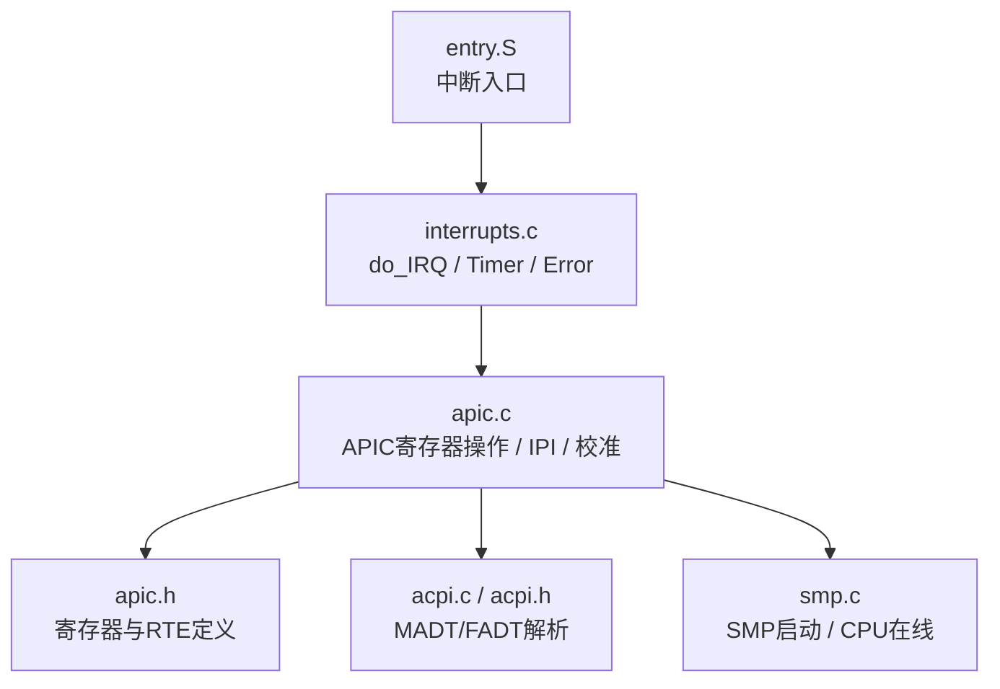
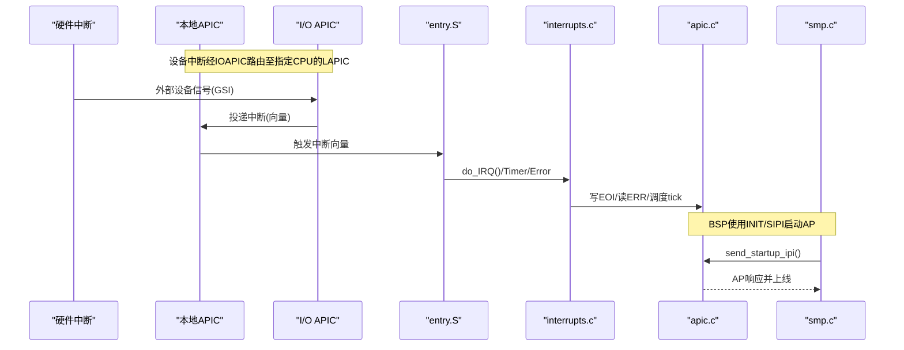
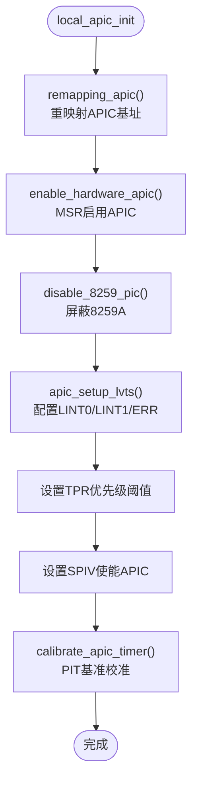
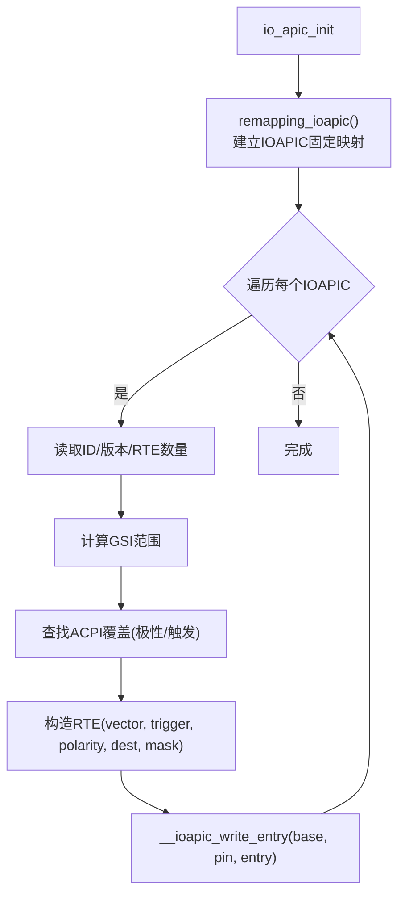
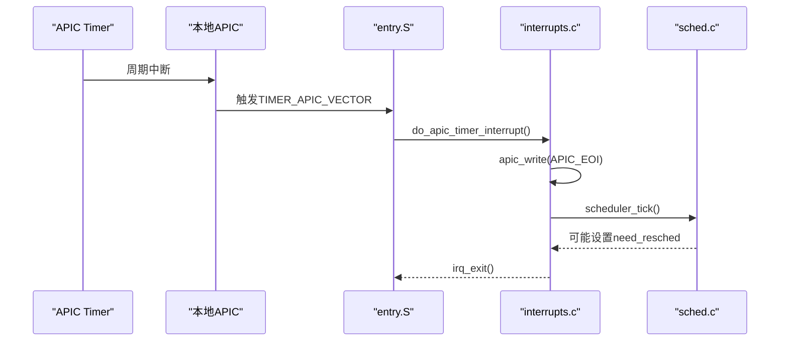
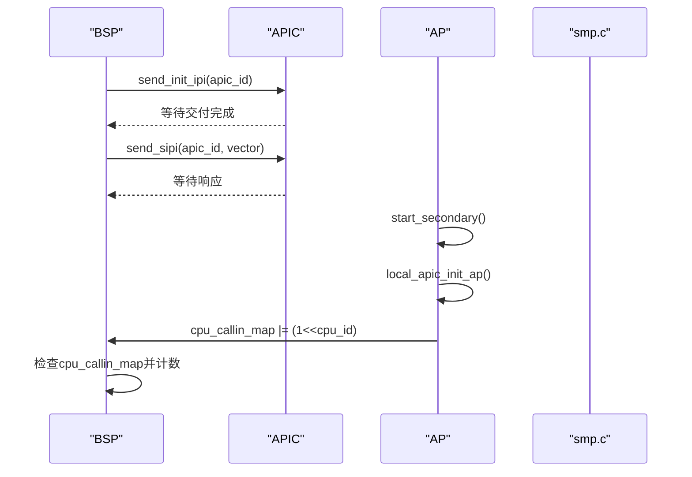
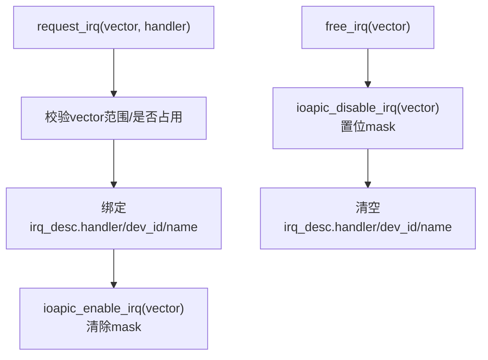
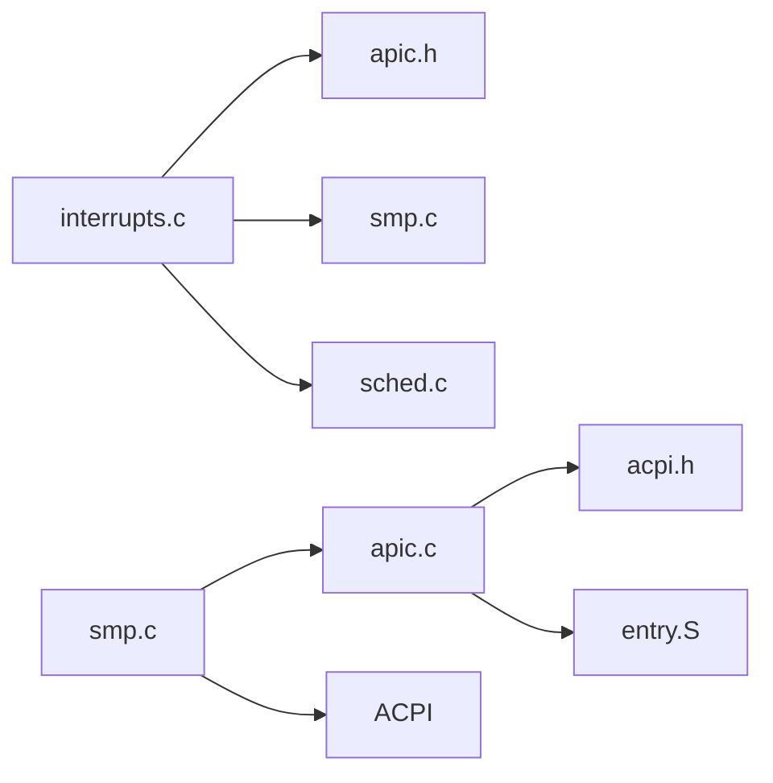

# APIC高级可编程中断控制器支持

<cite>
**本文引用的文件**
- [apic.c](file://arch/x86/kernel/apic.c)
- [apic.h](file://includes/arch/x86/apic.h)
- [smp.c](file://arch/x86/kernel/smp.c)
- [interrupts.c](file://kernel/interrupts/interrupts.c)
- [interrupts.h](file://includes/interrupts/interrupts.h)
- [acpi.c](file://arch/x86/kernel/acpi.c)
- [acpi.h](file://includes/arch/x86/acpi.h)
- [entry.S](file://arch/x86/entry.S)
</cite>

## 目录
1. [简介](#简介)
2. [项目结构](#项目结构)
3. [核心组件](#核心组件)
4. [架构总览](#架构总览)
5. [详细组件分析](#详细组件分析)
6. [依赖关系分析](#依赖关系分析)
7. [性能考虑](#性能考虑)
8. [故障排除指南](#故障排除指南)
9. [结论](#结论)
10. [附录：寄存器与配置速查](#附录寄存器与配置速查)

## 简介
本文件为LulaOS的APIC（高级可编程中断控制器）支持提供完整技术参考，覆盖本地APIC与I/O APIC的初始化、配置、定时器与错误中断处理、SMP多处理器环境下的中断路由与启动流程、以及调试与排错方法。文档面向SMP系统开发者，帮助理解并正确配置APIC以支撑设备中断、定时调度与多核协作。

## 项目结构
与APIC相关的代码主要分布在以下位置：
- arch/x86/kernel/apic.c：本地APIC/I/O APIC初始化、校准、IPI发送、SMP启动流程
- includes/arch/x86/apic.h：APIC寄存器定义、IOAPIC RTE结构体、API声明
- arch/x86/kernel/smp.c：SMP初始化、AP启动、CPU在线管理
- kernel/interrupts/interrupts.c：中断描述符表、设备中断注册/注销、APIC Timer/Error中断处理
- includes/interrupts/interrupts.h：向量号常量、NR_IRQS等
- arch/x86/kernel/acpi.c 与 includes/arch/x86/acpi.h：ACPI MADT/FADT解析，用于发现LAPIC、IOAPIC、GSI映射与ISA中断覆盖
- arch/x86/entry.S：中断入口与包装器，将硬件中断转交C层do_IRQ/APIC Timer/Error处理

图表来源
- [entry.S:186-200](file://arch/x86/entry.S#L186-L200)
- [interrupts.c:84-145](file://kernel/interrupts/interrupts.c#L84-L145)
- [apic.c:37-113](file://arch/x86/kernel/apic.c#L37-L113)
- [apic.h:9-197](file://includes/arch/x86/apic.h#L9-L197)
- [acpi.c:94-173](file://arch/x86/kernel/acpi.c#L94-L173)
- [smp.c:74-215](file://arch/x86/kernel/smp.c#L74-L215)

章节来源
- [apic.c:37-113](file://arch/x86/kernel/apic.c#L37-L113)
- [apic.h:9-197](file://includes/arch/x86/apic.h#L9-L197)
- [smp.c:74-215](file://arch/x86/kernel/smp.c#L74-L215)
- [interrupts.c:84-145](file://kernel/interrupts/interrupts.c#L84-L145)
- [acpi.c:94-173](file://arch/x86/kernel/acpi.c#L94-L173)
- [entry.S:186-200](file://arch/x86/entry.S#L186-L200)

## 核心组件
- 本地APIC（LAPIC）：每个CPU内置的中断控制器，负责接收来自I/O APIC或内部源的中断，进行优先级仲裁、向CPU投递、处理Timer与错误中断。
- I/O APIC（IOAPIC）：芯片组级中断控制器，负责汇聚外部设备中断（通过GSI），按触发模式、极性与目标CPU进行路由。
- ACPI MADT/FADT：系统固件提供的中断拓扑信息，包括LAPIC列表、IOAPIC地址与GSI基址、ISA中断覆盖（极性/触发）。
- SMP启动：BSP通过INIT-SIPI-SIPI序列唤醒AP，AP执行start_secondary并完成本地APIC初始化后进入idle循环。
- 中断子系统：设备驱动通过request_irq/free_irq注册/注销中断；do_IRQ统一分发；APIC Timer驱动调度tick；Error中断记录并恢复。

章节来源
- [apic.c:37-113](file://arch/x86/kernel/apic.c#L37-L113)
- [apic.c:230-380](file://arch/x86/kernel/apic.c#L230-L380)
- [acpi.c:94-173](file://arch/x86/kernel/acpi.c#L94-L173)
- [smp.c:74-215](file://arch/x86/kernel/smp.c#L74-L215)
- [interrupts.c:18-145](file://kernel/interrupts/interrupts.c#L18-L145)

## 架构总览
下图展示从硬件中断到内核调度的整体路径，以及SMP启动时BSP与AP之间的IPI交互。

图表来源
- [apic.c:387-475](file://arch/x86/kernel/apic.c#L387-L475)
- [interrupts.c:84-145](file://kernel/interrupts/interrupts.c#L84-L145)
- [entry.S:186-200](file://arch/x86/entry.S#L186-L200)
- [smp.c:185-215](file://arch/x86/kernel/smp.c#L185-L215)

## 详细组件分析

### 本地APIC初始化与配置
- 检测与启用：
  - 通过CPUID检测是否支持APIC/X2APIC，读取MSR启用本地APIC，必要时重新映射物理基址到固定映射页。
- LVT设置：
  - LINT0屏蔽并设为EXTINT（兼容8259A），LINT1屏蔽并设为NMI，错误LVT指向ERROR_APIC_VECTOR。
- TPR与SPIV：
  - 设置任务优先级寄存器接受高于阈值的优先级中断；软件使能APIC并配置伪中断向量。
- 定时器校准：
  - 使用PIT Channel 2作为时间基准，测量APIC Timer在已知窗口内的tick数，写入INITCNT并设置为周期性模式。

图表来源
- [apic.c:37-63](file://arch/x86/kernel/apic.c#L37-L63)
- [apic.c:102-113](file://arch/x86/kernel/apic.c#L102-L113)
- [apic.c:125-180](file://arch/x86/kernel/apic.c#L125-L180)

章节来源
- [apic.c:37-63](file://arch/x86/kernel/apic.c#L37-L63)
- [apic.c:102-113](file://arch/x86/kernel/apic.c#L102-L113)
- [apic.c:125-180](file://arch/x86/kernel/apic.c#L125-L180)
- [apic.h:9-197](file://includes/arch/x86/apic.h#L9-L197)

### I/O APIC初始化与中断路由
- ACPI发现：
  - 解析MADT中的LAPIC、IOAPIC与ISA中断覆盖项，记录各IOAPIC的物理地址与GSI基址。
- 重映射与枚举：
  - 对每个IOAPIC建立固定映射，读取ID、版本、RTE数量，打印调试信息。
- RTE配置：
  - 默认将GSI N映射到FIRST_DEVICE_VECTOR + N，根据ACPI覆盖更新极性/触发模式，目标CPU初始设为BSP，默认屏蔽，驱动通过ioapic_enable_irq解除屏蔽。
- 读写RTE：
  - 先写高32位再写低32位，避免竞态导致未就绪即生效。

图表来源
- [apic.c:219-289](file://arch/x86/kernel/apic.c#L219-L289)
- [apic.c:301-380](file://arch/x86/kernel/apic.c#L301-L380)
- [acpi.c:94-173](file://arch/x86/kernel/acpi.c#L94-L173)

章节来源
- [apic.c:219-289](file://arch/x86/kernel/apic.c#L219-L289)
- [apic.c:301-380](file://arch/x86/kernel/apic.c#L301-L380)
- [acpi.c:94-173](file://arch/x86/kernel/acpi.c#L94-L173)

### 定时器中断与错误中断处理
- APIC Timer：
  - 校准后以周期性模式运行，每次tick调用scheduler_tick递减当前任务counter，必要时置need_resched。
  - 中断入口由entry.S生成，调用do_apic_timer_interrupt，首先写EOI释放LAPIC ISR位。
- APIC Error：
  - 读取APIC_ERR寄存器并打印，随后写EOI，确保错误状态清除。

图表来源
- [interrupts.c:116-128](file://kernel/interrupts/interrupts.c#L116-L128)
- [entry.S:186-200](file://arch/x86/entry.S#L186-L200)

章节来源
- [interrupts.c:116-145](file://kernel/interrupts/interrupts.c#L116-L145)
- [entry.S:186-200](file://arch/x86/entry.S#L186-L200)

### 多处理器环境下的中断路由与负载均衡
- 启动流程（INIT-SIPI-SIPI）：
  - BSP复制trampoline到固定物理页，更新GDTR，遍历ACPI LAPIC列表，对每个AP发送INIT IPI，等待后发送SIPI两次（若第一次成功则跳过第二次），轮询cpu_callin_map确认AP上线。
- AP侧行为：
  - start_secondary尽早标记cpu_online_map，等待BSP的callout信号，初始化本地APIC，通知BSP完成，开中断进入idle循环。
- 中断路由：
  - IOAPIC RTE的目标CPU可配置为特定APIC ID，实现中断亲和性；当前实现默认路由到BSP，后续可扩展为按负载或亲和性分配。

图表来源
- [apic.c:407-475](file://arch/x86/kernel/apic.c#L407-L475)
- [smp.c:185-215](file://arch/x86/kernel/smp.c#L185-L215)
- [smp.c:233-276](file://arch/x86/kernel/smp.c#L233-L276)

章节来源
- [apic.c:407-475](file://arch/x86/kernel/apic.c#L407-L475)
- [smp.c:74-215](file://arch/x86/kernel/smp.c#L74-L215)
- [smp.c:233-276](file://arch/x86/kernel/smp.c#L233-L276)

### 设备中断注册与屏蔽控制
- 注册/注销：
  - request_irq将handler绑定到irq_desc，并解除对应GSI的屏蔽；free_irq先屏蔽再清理。
- 屏蔽/使能：
  - ioapic_disable_irq/ioapic_enable_irq直接操作IOAPIC RTE的低32位mask位。

图表来源
- [interrupts.c:40-77](file://kernel/interrupts/interrupts.c#L40-L77)
- [apic.c:330-368](file://arch/x86/kernel/apic.c#L330-L368)

章节来源
- [interrupts.c:40-77](file://kernel/interrupts/interrupts.c#L40-L77)
- [apic.c:330-368](file://arch/x86/kernel/apic.c#L330-L368)

## 依赖关系分析
- 模块耦合：
  - interrupts.c依赖apic.h进行寄存器操作，依赖smp.c获取CPU ID，依赖sched.c进行调度tick。
  - apic.c依赖acpi.c提供的MADT/FADT信息，依赖entry.S生成的中断入口。
  - smp.c依赖apic.c的IPI发送函数，依赖acpi.c的LAPIC列表。
- 外部依赖：
  - CPUID/MSR用于检测与启用APIC；PIT用于微秒延迟与定时器校准。
- 潜在环路：
  - 无直接循环依赖；中断路径自上而下清晰。

图表来源
- [interrupts.c:1-145](file://kernel/interrupts/interrupts.c#L1-L145)
- [apic.c:1-532](file://arch/x86/kernel/apic.c#L1-L532)
- [smp.c:1-277](file://arch/x86/kernel/smp.c#L1-L277)
- [entry.S:1-200](file://arch/x86/entry.S#L1-L200)

章节来源
- [interrupts.c:1-145](file://kernel/interrupts/interrupts.c#L1-L145)
- [apic.c:1-532](file://arch/x86/kernel/apic.c#L1-L532)
- [smp.c:1-277](file://arch/x86/kernel/smp.c#L1-L277)
- [entry.S:1-200](file://arch/x86/entry.S#L1-L200)

## 性能考虑
- 定时器校准精度：
  - 使用PIT Channel 2作为稳定基准，避免依赖不稳定的APIC频率；校准失败会输出日志并停止计时。
- IPI发送阻塞：
  - send_*_ipi等待Delivery Status清零，避免重复发送造成竞争；建议在高负载下评估IPI开销。
- IOAPIC RTE写入顺序：
  - 先高32位后低32位，防止mask=0时立即生效但目标未就绪导致的异常。
- 调度tick：
  - scheduler_tick仅在非idle任务上递减counter，减少空转开销。

[本节为通用指导，无需具体文件引用]

## 故障排除指南
- APIC未启用：
  - 检查CPUID是否支持APIC；确认MSR已启用；查看日志中“Local APIC disabled by BIOS -- reenabling”提示。
- 定时器不工作：
  - 校准失败时会打印“APIC Timer calibrate failed”，检查PIT通道2配置与端口访问；确认INITCNT写入与周期性模式设置。
- 设备中断不触发：
  - 确认IOAPIC RTE的mask位已清除；检查ACPI覆盖是否正确映射GSI与极性/触发；验证驱动已调用request_irq。
- 多核启动失败：
  - 检查INIT/SIPI序列是否成功；确认cpu_callin_map被AP置位；观察BSP超时日志；核对trampoline页与栈设置。
- 错误中断频繁：
  - 读取APIC_ERR寄存器定位错误类型；检查LVT配置与设备信号质量；必要时降低中断优先级或调整触发模式。

章节来源
- [apic.c:183-217](file://arch/x86/kernel/apic.c#L183-L217)
- [apic.c:125-180](file://arch/x86/kernel/apic.c#L125-L180)
- [interrupts.c:135-145](file://kernel/interrupts/interrupts.c#L135-L145)
- [smp.c:185-215](file://arch/x86/kernel/smp.c#L185-L215)

## 结论
LulaOS的APIC支持实现了本地APIC与I/O APIC的完整初始化、定时器校准、设备中断路由、SMP启动与调度tick集成。通过ACPI发现中断拓扑，结合IOAPIC RTE配置实现灵活的中断亲和性；APIC Timer驱动内核调度，保证多核时间片公平。开发者可在此基础上扩展负载均衡策略、优化IPI路径与增强错误诊断能力。

[本节为总结，无需具体文件引用]

## 附录：寄存器与配置速查
- 本地APIC关键寄存器：
  - APIC_ID、APIC_VERSION、APIC_TPR、APIC_SPIV、APIC_ICRLO/ICRHI、APIC_TIMER/INITCNT/CURRCNT/DIVIDE、APIC_LINT0/LINT1、APIC_ERR、APIC_EOI
- I/O APIC关键寄存器：
  - IOAPIC_ID、IOAPIC_VERSION、RTE表项（低32位：vector/delivery_mode/dest_mode/status/polarity/irr/trigger/mask；高32位：dest）
- 常用常量：
  - FIRST_EXTERNAL_VECTOR、TIMER_APIC_VECTOR、ERROR_APIC_VECTOR、FIRST_DEVICE_VECTOR、NR_IRQS
- 典型配置步骤：
  - 启用本地APIC → 配置LVT → 设置TPR/SPIV → 校准Timer → 解析ACPI → 配置IOAPIC RTE → 注册设备中断 → 启动SMP

章节来源
- [apic.h:9-197](file://includes/arch/x86/apic.h#L9-L197)
- [interrupts.h:35-42](file://includes/interrupts/interrupts.h#L35-L42)
- [apic.c:230-380](file://arch/x86/kernel/apic.c#L230-L380)