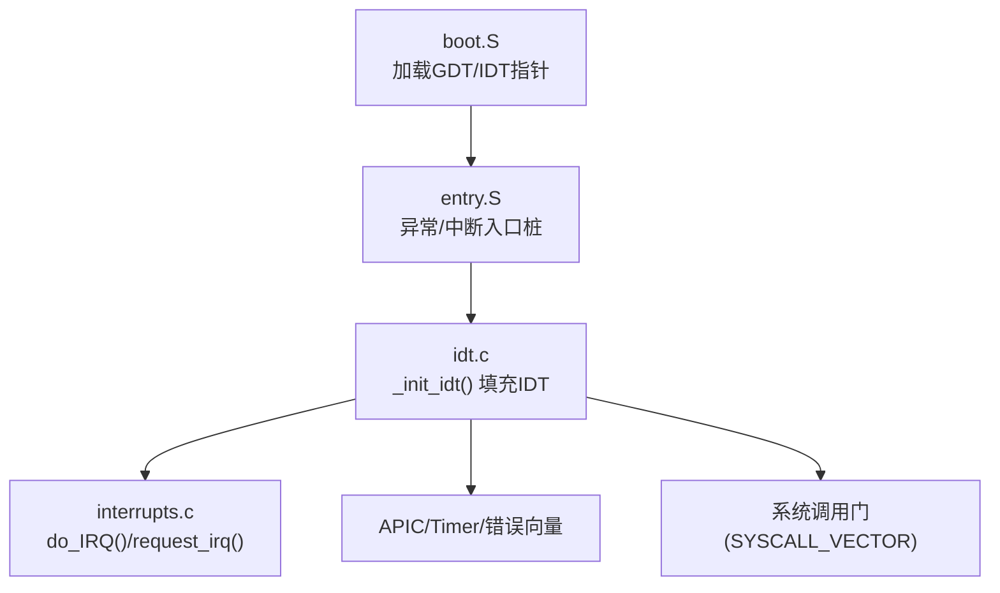
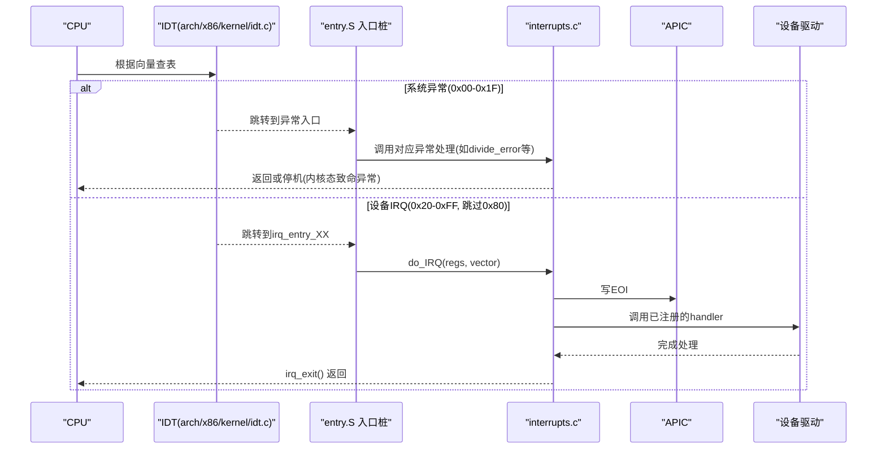
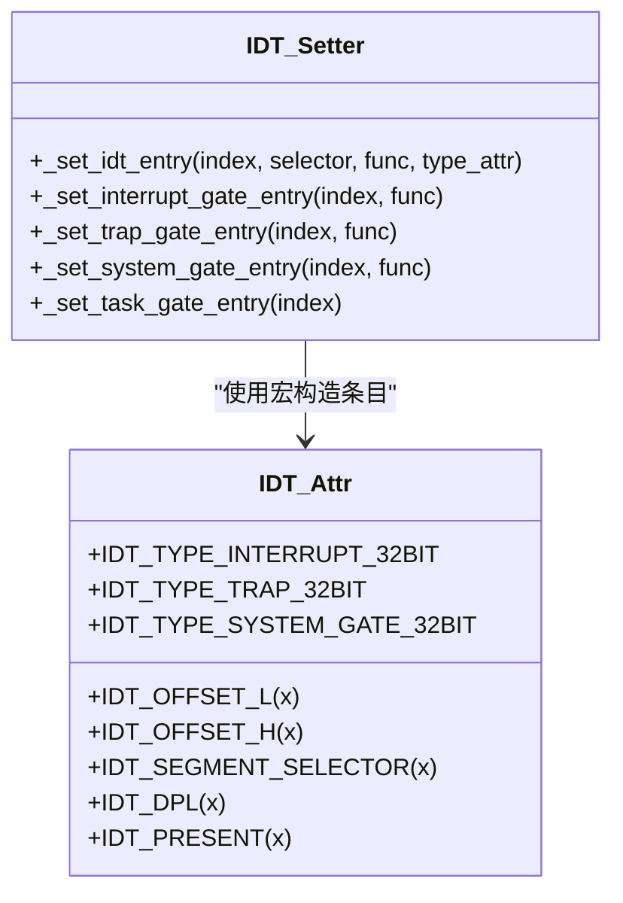
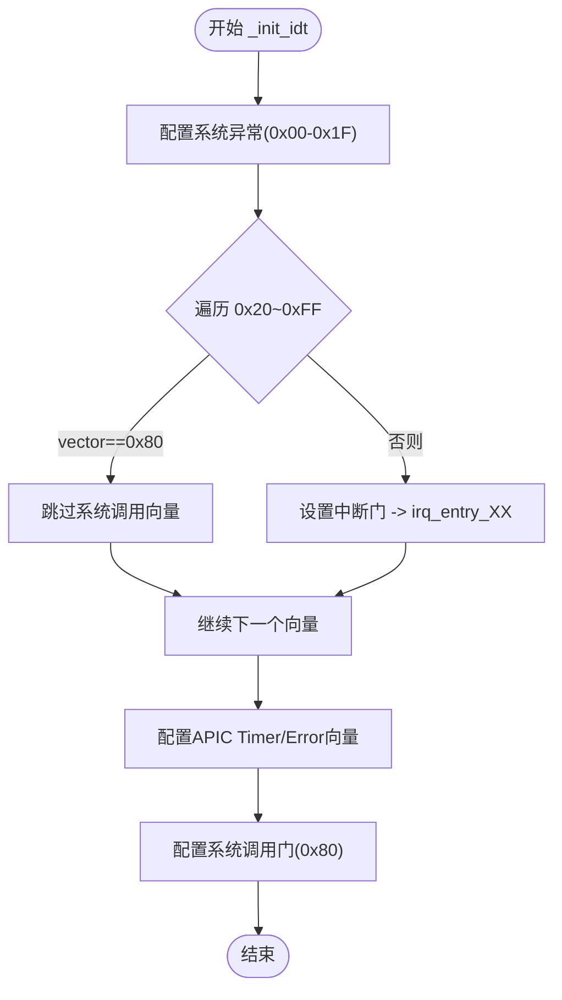
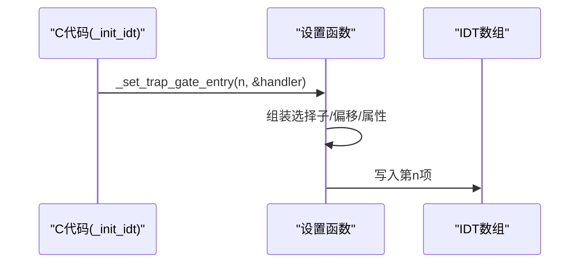
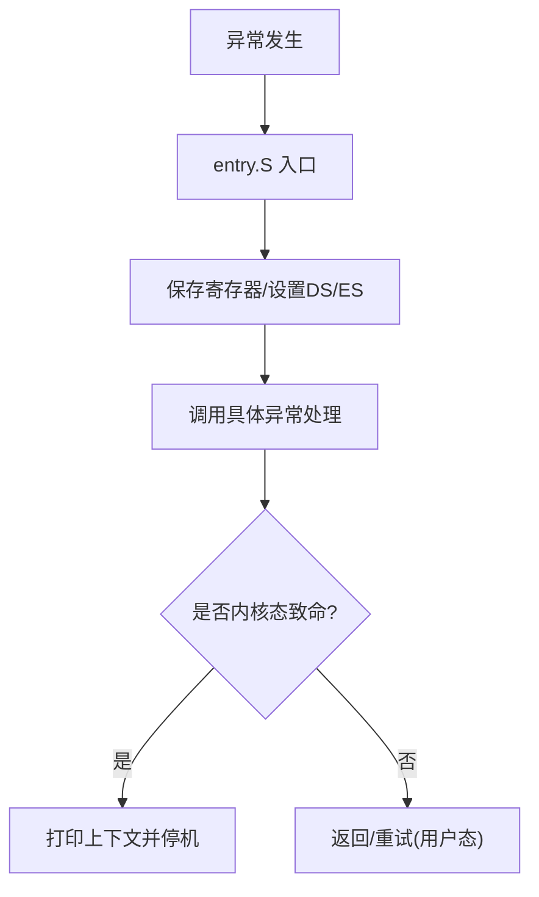
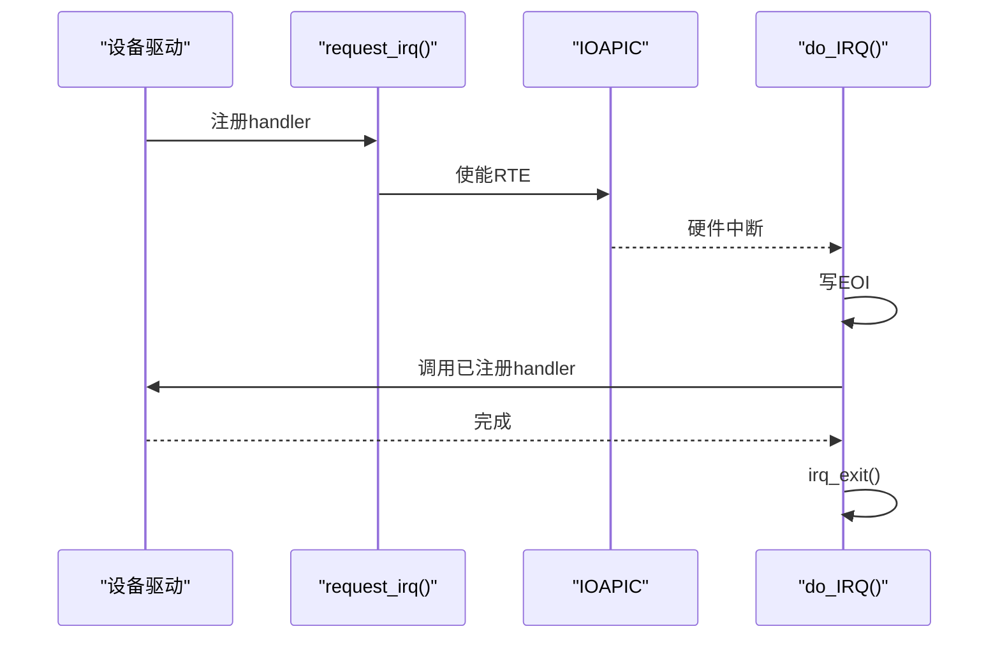
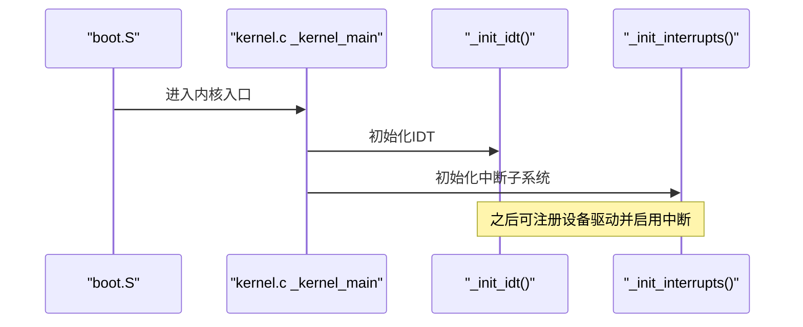
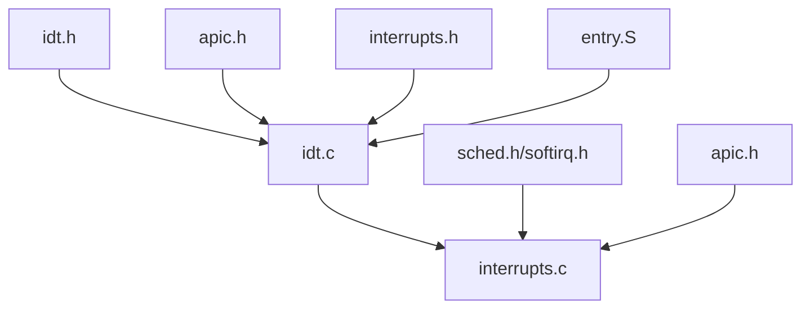

# 中断描述符表管理

<cite>
**本文引用的文件**
- [arch/x86/kernel/idt.c](file://arch/x86/kernel/idt.c)
- [includes/arch/x86/idt.h](file://includes/arch/x86/idt.h)
- [kernel/interrupts/interrupts.c](file://kernel/interrupts/interrupts.c)
- [includes/interrupts/interrupts.h](file://includes/interrupts/interrupts.h)
- [arch/x86/entry.S](file://arch/x86/entry.S)
- [arch/x86/boot/boot.S](file://arch/x86/boot/boot.S)
- [kernel/kernel.c](file://kernel/kernel.c)
</cite>

## 目录
1. [简介](#简介)
2. [项目结构](#项目结构)
3. [核心组件](#核心组件)
4. [架构总览](#架构总览)
5. [详细组件分析](#详细组件分析)
6. [依赖关系分析](#依赖关系分析)
7. [性能考虑](#性能考虑)
8. [故障排查指南](#故障排查指南)
9. [结论](#结论)
10. [附录](#附录)

## 简介
本文件面向LulaOS的中断描述符表（IDT）子系统，提供从数据结构、初始化流程到异常与中断处理路径的完整技术说明。重点覆盖：
- IDT条目结构与类型门配置（中断门、陷阱门、系统门）
- 向量分配策略与映射机制（系统异常、设备IRQ、APIC定时器/错误、系统调用）
- IDT设置函数实现细节与使用方式
- 异常处理程序注册与错误处理机制
- 为中断系统开发者提供的操作指导与最佳实践

## 项目结构
围绕IDT的关键代码分布在以下位置：
- 架构层C实现与头文件：定义IDT条目、设置函数、初始化流程
- 汇编入口：生成各向量的硬件中断入口桩，统一路由到内核处理函数
- 中断子系统：维护IRQ描述符表，提供request_irq/free_irq等API
- 启动阶段：在引导阶段加载GDT/IDT指针，进入内核后完成IDT填充并启用中断

**图示来源**
- [arch/x86/boot/boot.S:107-108](file://arch/x86/boot/boot.S#L107-L108)
- [arch/x86/entry.S:200-399](file://arch/x86/entry.S#L200-L399)
- [arch/x86/kernel/idt.c:284-331](file://arch/x86/kernel/idt.c#L284-L331)
- [kernel/interrupts/interrupts.c:18-108](file://kernel/interrupts/interrupts.c#L18-L108)

**章节来源**
- [arch/x86/boot/boot.S:100-160](file://arch/x86/boot/boot.S#L100-L160)
- [arch/x86/entry.S:200-399](file://arch/x86/entry.S#L200-L399)
- [arch/x86/kernel/idt.c:284-331](file://arch/x86/kernel/idt.c#L284-L331)
- [kernel/interrupts/interrupts.c:18-108](file://kernel/interrupts/interrupts.c#L18-L108)

## 核心组件
- IDT条目与属性宏：定义中断门、陷阱门、系统门的属性位及偏移/选择子拼装规则
- IDT设置函数：封装底层写入逻辑，提供任务门、中断门、陷阱门、系统门设置接口
- IDT初始化：按Intel规范配置系统异常向量；批量覆盖设备IRQ向量空间；配置APIC Timer/Error；配置系统调用门
- 硬件中断入口桩：通过宏为每个向量生成独立入口，压入向量号并跳转至统一处理
- IRQ描述符表：维护驱动注册的handler、dev_id、name，并提供请求/释放接口
- 启动时序：引导阶段载入IDT指针，内核主流程中先初始化IDT再初始化中断子系统

**章节来源**
- [includes/arch/x86/idt.h:7-26](file://includes/arch/x86/idt.h#L7-L26)
- [arch/x86/kernel/idt.c:256-282](file://arch/x86/kernel/idt.c#L256-L282)
- [arch/x86/kernel/idt.c:284-331](file://arch/x86/kernel/idt.c#L284-L331)
- [arch/x86/entry.S:200-399](file://arch/x86/entry.S#L200-L399)
- [kernel/interrupts/interrupts.c:10-27](file://kernel/interrupts/interrupts.c#L10-L27)
- [kernel/kernel.c:73-82](file://kernel/kernel.c#L73-L82)

## 架构总览
下图展示从CPU触发中断到内核处理的完整路径，包括异常与设备中断的不同分支。

**图示来源**
- [arch/x86/kernel/idt.c:284-331](file://arch/x86/kernel/idt.c#L284-L331)
- [arch/x86/entry.S:200-399](file://arch/x86/entry.S#L200-L399)
- [kernel/interrupts/interrupts.c:84-108](file://kernel/interrupts/interrupts.c#L84-L108)

## 详细组件分析

### IDT数据结构与属性宏
- 64位IDT条目由“低32位”和“高32位”组成，包含：
  - 段选择子（__KERNEL_CS）
  - 中断服务例程地址的低/高16位
  - 门类型（中断门/陷阱门/系统门/任务门）
  - DPL（特权级），系统调用门DPL=3，其他通常为0
  - Present位必须置1
- 宏集中定义了字段拼接方式与常用门属性，便于统一构造条目

**图示来源**
- [includes/arch/x86/idt.h:7-26](file://includes/arch/x86/idt.h#L7-L26)
- [arch/x86/kernel/idt.c:256-282](file://arch/x86/kernel/idt.c#L256-L282)

**章节来源**
- [includes/arch/x86/idt.h:7-26](file://includes/arch/x86/idt.h#L7-L26)
- [arch/x86/kernel/idt.c:256-282](file://arch/x86/kernel/idt.c#L256-L282)

### IDT初始化流程
- 系统异常向量（0x00-0x1F）：按Intel约定分别设置为陷阱门/中断门/系统门
  - 例如：除零、调试、NMI、INT3、溢出、边界检查、无效操作、双重故障、页故障等
- 设备IRQ向量（0x20-0xFF）：循环覆盖，跳过系统调用向量0x80，全部指向统一的硬件中断入口桩
- APIC相关：
  - 定时器向量：指向apic_timer_entry
  - 错误向量：指向apic_error_entry
- 系统调用：使用系统门（DPL=3）指向system_call，允许用户态触发

**图示来源**
- [arch/x86/kernel/idt.c:284-331](file://arch/x86/kernel/idt.c#L284-L331)

**章节来源**
- [arch/x86/kernel/idt.c:284-331](file://arch/x86/kernel/idt.c#L284-L331)

### 向量分配策略与映射机制
- 系统异常：固定0x00-0x1F，按Intel保留
- 设备IRQ：0x20-0xFF，共224个向量（NR_IRQS=224），其中0x80被预留用于系统调用
- APIC专用：
  - 定时器：0xEF
  - 错误：0xFE
- 系统调用：0x80，使用系统门（DPL=3）
- 映射关系：
  - 向量号 -> 入口桩（entry.S中BUILD_IRQ生成的irq_entry_XX）
  - 入口桩 -> do_IRQ（传递向量号）
  - do_IRQ -> 根据向量号索引irq_desc数组，调用已注册的handler

**图示来源**
- [arch/x86/entry.S:200-399](file://arch/x86/entry.S#L200-L399)
- [kernel/interrupts/interrupts.c:84-108](file://kernel/interrupts/interrupts.c#L84-L108)
- [includes/interrupts/interrupts.h:35-42](file://includes/interrupts/interrupts.h#L35-L42)

**章节来源**
- [includes/interrupts/interrupts.h:35-42](file://includes/interrupts/interrupts.h#L35-L42)
- [arch/x86/entry.S:200-399](file://arch/x86/entry.S#L200-L399)
- [kernel/interrupts/interrupts.c:84-108](file://kernel/interrupts/interrupts.c#L84-L108)

### IDT条目设置函数与使用示例
- 设置函数族：
  - _set_idt_entry：通用写入，组装选择子、偏移、类型属性
  - _set_interrupt_gate_entry：中断门（自动屏蔽嵌套中断）
  - _set_trap_gate_entry：陷阱门（不屏蔽中断）
  - _set_system_gate_entry：系统门（DPL=3，用户态可调用）
  - _set_task_gate_entry：任务门（当前未使用）
- 使用示例（概念性）：
  - 将某异常向量设置为陷阱门，指向对应的异常处理函数
  - 将设备IRQ向量设置为中断门，指向统一入口桩
  - 将系统调用向量设置为系统门，指向system_call

**图示来源**
- [arch/x86/kernel/idt.c:256-282](file://arch/x86/kernel/idt.c#L256-L282)
- [arch/x86/kernel/idt.c:284-331](file://arch/x86/kernel/idt.c#L284-L331)

**章节来源**
- [arch/x86/kernel/idt.c:256-282](file://arch/x86/kernel/idt.c#L256-L282)
- [arch/x86/kernel/idt.c:284-331](file://arch/x86/kernel/idt.c#L284-L331)

### 异常处理程序注册与错误处理机制
- 异常入口：entry.S为每个异常向量生成入口，压入错误码/向量号并跳转至统一包装器
- 包装器：保存寄存器上下文，设置数据段选择子，调用具体异常处理函数
- 默认处理器：对多数异常打印寄存器与指令片段，内核态致命异常会停机防止无限重试
- 特殊异常：如Invalid TSS，解析错误码位以定位问题来源（GDT/LDT/Gate）

**图示来源**
- [arch/x86/entry.S:93-184](file://arch/x86/entry.S#L93-L184)
- [arch/x86/kernel/idt.c:173-254](file://arch/x86/kernel/idt.c#L173-L254)

**章节来源**
- [arch/x86/entry.S:93-184](file://arch/x86/entry.S#L93-L184)
- [arch/x86/kernel/idt.c:173-254](file://arch/x86/kernel/idt.c#L173-L254)

### 设备中断注册与分发
- 注册：request_irq(vector, handler, name, dev_id)
  - 校验向量范围与占用情况
  - 记录handler/dev_id/name
  - 使能IOAPIC RTE，允许硬件中断
- 分发：do_IRQ
  - 计算idx = vector - FIRST_EXTERNAL_VECTOR
  - 发送EOI
  - 若存在handler则调用，否则打印未注册警告
  - irq_exit内部可能调度软中断
- 释放：free_irq(vector)
  - 先屏蔽IOAPIC RTE，再清除描述符

**图示来源**
- [kernel/interrupts/interrupts.c:18-108](file://kernel/interrupts/interrupts.c#L18-L108)

**章节来源**
- [kernel/interrupts/interrupts.c:18-108](file://kernel/interrupts/interrupts.c#L18-L108)

### 启动与加载时序
- 引导阶段：boot.S加载GDT/IDT指针，设置段寄存器，进入内核入口
- 内核主流程：kernel.c中依次调用_init_idt()与_init_interrupts()
- SMP/分页切换：entry.S在开启分页前重新加载正式GDT/IDT指针

**图示来源**
- [arch/x86/boot/boot.S:107-121](file://arch/x86/boot/boot.S#L107-L121)
- [kernel/kernel.c:73-82](file://kernel/kernel.c#L73-L82)
- [arch/x86/entry.S:678-679](file://arch/x86/entry.S#L678-L679)

**章节来源**
- [arch/x86/boot/boot.S:107-121](file://arch/x86/boot/boot.S#L107-L121)
- [kernel/kernel.c:73-82](file://kernel/kernel.c#L73-L82)
- [arch/x86/entry.S:678-679](file://arch/x86/entry.S#L678-L679)

## 依赖关系分析
- idt.c依赖：
  - arch/x86/idt.h：IDT条目与属性宏
  - arch/x86/apic.h：APIC定时器/错误向量常量
  - interrupts/interrupts.h：FIRST_EXTERNAL_VECTOR/SYSCALL_VECTOR等常量
  - entry.S：声明各异常/中断入口桩
- entry.S依赖：
  - linkage.h、segment.h：符号与段选择子
  - BUILD_IRQ宏生成所有硬件中断入口
- interrupts.c依赖：
  - apic.h：APIC读写与RTE控制
  - sched.h/softirq.h：调度与软中断支持
  - printk.h：日志输出

**图示来源**
- [includes/arch/x86/idt.h:1-41](file://includes/arch/x86/idt.h#L1-L41)
- [arch/x86/kernel/idt.c:1-9](file://arch/x86/kernel/idt.c#L1-L9)
- [kernel/interrupts/interrupts.c:1-6](file://kernel/interrupts/interrupts.c#L1-L6)
- [arch/x86/entry.S:1-3](file://arch/x86/entry.S#L1-L3)

**章节来源**
- [includes/arch/x86/idt.h:1-41](file://includes/arch/x86/idt.h#L1-L41)
- [arch/x86/kernel/idt.c:1-9](file://arch/x86/kernel/idt.c#L1-L9)
- [kernel/interrupts/interrupts.c:1-6](file://kernel/interrupts/interrupts.c#L1-L6)
- [arch/x86/entry.S:1-3](file://arch/x86/entry.S#L1-L3)

## 性能考虑
- 中断门 vs 陷阱门：
  - 中断门在进入时自动清零IF，避免嵌套中断导致栈溢出或死锁
  - 陷阱门不屏蔽中断，适合需要快速响应且自身不长时间持锁的场景
- EOI时机：
  - 在do_IRQ与APIC Timer/错误中断中尽早写EOI，避免阻塞同级或更低优先级中断
- 向量冲突规避：
  - 0x80作为系统调用向量，需在设备IRQ循环中跳过，避免覆盖
- 最小化中断上下文开销：
  - 入口桩仅做必要保存与参数传递，尽量将耗时逻辑移至C层处理

[本节为通用性能建议，无需特定文件引用]

## 故障排查指南
- 常见症状与定位：
  - 未注册handler的设备中断：do_IRQ会打印“no handler registered”，需检查request_irq调用与向量映射
  - 非法向量：超出FIRST_EXTERNAL_VECTOR~NR_IRQS范围会打印unexpected vector
  - 系统异常：do_trap打印EIP/EFLAGS/寄存器与附近指令字节，帮助定位崩溃点
- 关键检查点：
  - IDT是否正确加载：确认boot.S与entry.S中的lidt/gidt顺序与地址转换正确
  - 向量映射：核对interrupts.h中的FIRST_EXTERNAL_VECTOR/SYSCALL_VECTOR/TIMER_APIC_VECTOR/ERROR_APIC_VECTOR
  - APIC使能：request_irq成功后应调用ioapic_enable_irq，free_irq前应ioapic_disable_irq
- 调试技巧：
  - 利用printk输出向量号、idx、handler状态
  - 在异常处理中打印错误码位含义（如Invalid TSS的错误码解析）

**章节来源**
- [kernel/interrupts/interrupts.c:84-108](file://kernel/interrupts/interrupts.c#L84-L108)
- [arch/x86/kernel/idt.c:173-254](file://arch/x86/kernel/idt.c#L173-L254)
- [includes/interrupts/interrupts.h:35-42](file://includes/interrupts/interrupts.h#L35-L42)

## 结论
LulaOS的IDT子系统采用清晰的层次化设计：
- 通过宏与封装函数统一构造IDT条目，降低出错概率
- 将系统异常、设备IRQ、APIC专用向量与系统调用门清晰分离
- 借助entry.S的宏生成机制，保证所有向量均有入口桩并统一路由到内核处理
- 提供request_irq/free_irq简化驱动集成，配合APIC使能/屏蔽确保中断安全
遵循本文档的配置与使用规范，可为中断系统开发者提供稳定、可维护的实现基础。

[本节为总结性内容，无需特定文件引用]

## 附录
- 关键常量参考：
  - FIRST_EXTERNAL_VECTOR：设备IRQ起始向量
  - SYSCALL_VECTOR：系统调用向量
  - TIMER_APIC_VECTOR：APIC定时器向量
  - ERROR_APIC_VECTOR：APIC错误向量
  - NR_IRQS：设备IRQ数量
- 推荐实践：
  - 新增异常：在idt.c中添加陷阱门/中断门条目，并在entry.S添加入口桩（如需）
  - 新增设备IRQ：确保不与现有向量冲突，注册handler并启用IOAPIC RTE
  - 系统调用扩展：保持DPL=3的系统门配置，完善syscall表

**章节来源**
- [includes/interrupts/interrupts.h:35-42](file://includes/interrupts/interrupts.h#L35-L42)
- [arch/x86/kernel/idt.c:284-331](file://arch/x86/kernel/idt.c#L284-L331)