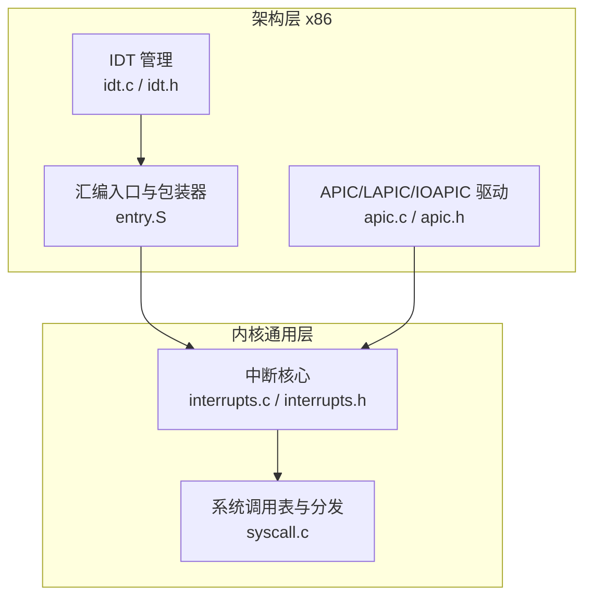
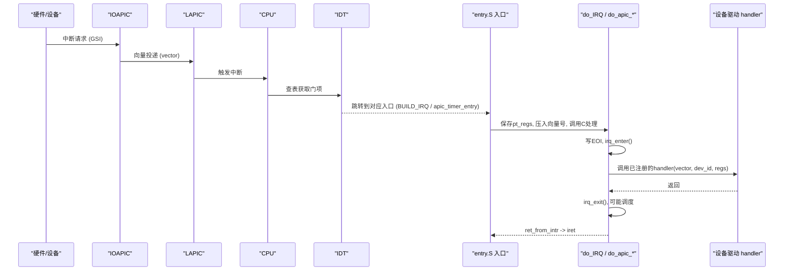
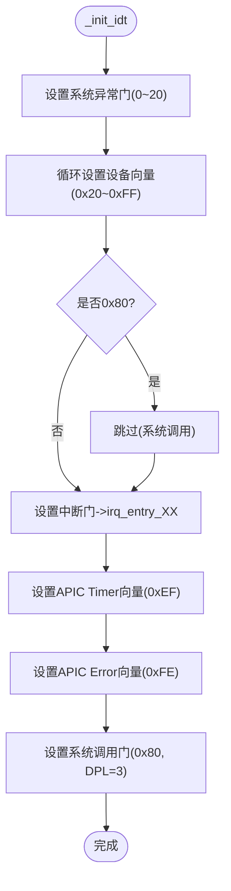
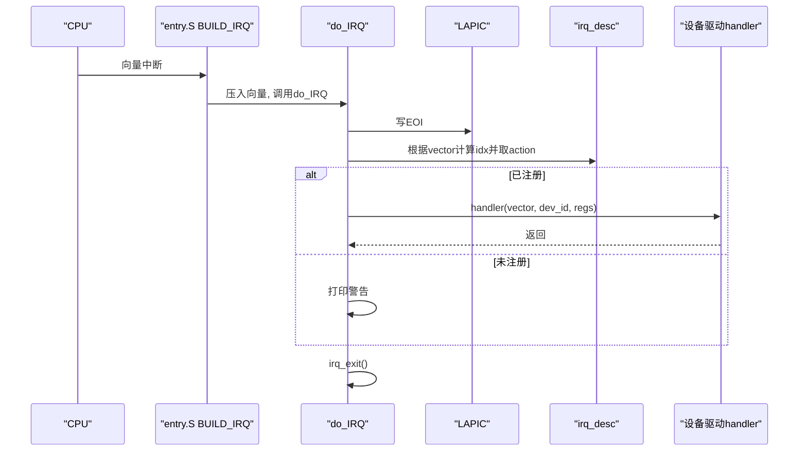
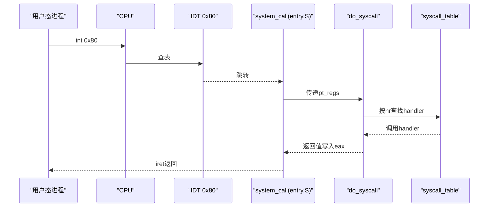
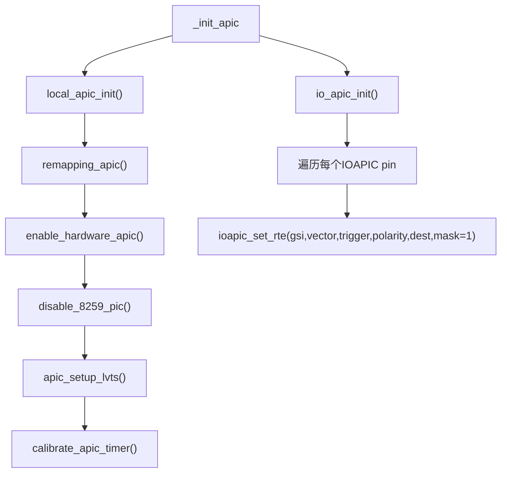
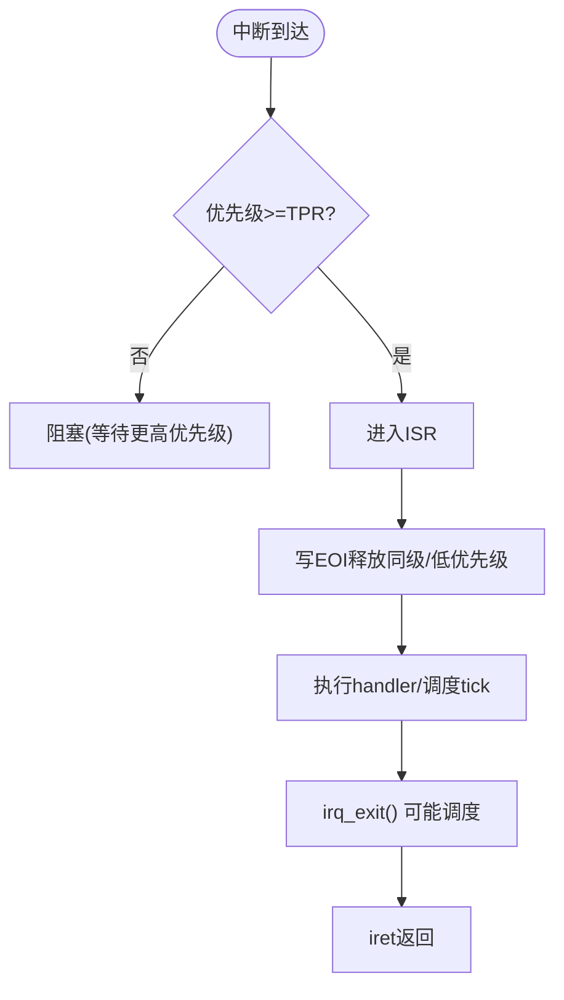
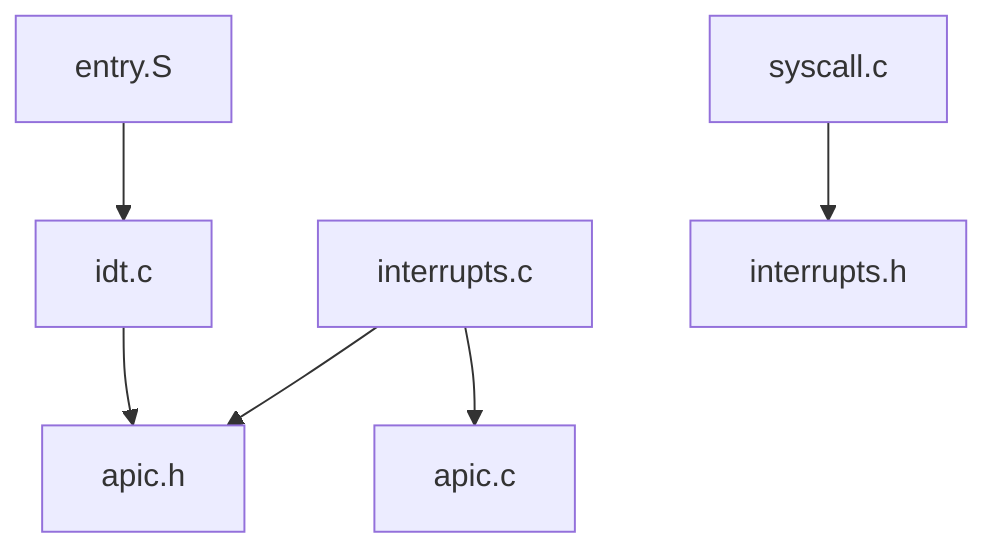

# 中断架构设计

<cite>
**本文引用的文件**
- [includes/arch/x86/idt.h](file://includes/arch/x86/idt.h)
- [arch/x86/kernel/idt.c](file://arch/x86/kernel/idt.c)
- [includes/interrupts/interrupts.h](file://includes/interrupts/interrupts.h)
- [kernel/interrupts/interrupts.c](file://kernel/interrupts/interrupts.c)
- [includes/arch/x86/apic.h](file://includes/arch/x86/apic.h)
- [arch/x86/kernel/apic.c](file://arch/x86/kernel/apic.c)
- [arch/x86/entry.S](file://arch/x86/entry.S)
- [kernel/syscall.c](file://kernel/syscall.c)
</cite>

## 目录
1. [简介](#简介)
2. [项目结构](#项目结构)
3. [核心组件](#核心组件)
4. [架构总览](#架构总览)
5. [详细组件分析](#详细组件分析)
6. [依赖关系分析](#依赖关系分析)
7. [性能与优先级](#性能与优先级)
8. [故障排查指南](#故障排查指南)
9. [结论](#结论)
10. [附录](#附录)

## 简介
本设计文档面向LulaOS中断系统开发者，系统性阐述以下主题：
- 中断描述符表（IDT）的管理机制与向量分配策略
- 硬件中断与软件中断的处理流程
- APIC（高级可编程中断控制器）的使用与配置
- 中断嵌套处理与优先级管理
- 中断处理时序图与中断路由机制图
- 面向开发者的最佳实践与常见问题定位方法

## 项目结构
LulaOS的中断子系统由“架构层（x86）+ 内核通用层”组成：
- 架构层负责IDT、APIC寄存器操作、汇编入口与上下文切换
- 内核通用层提供中断注册/分发、系统调用表、软中断调度等

**图表来源**
- [arch/x86/kernel/idt.c:284-331](file://arch/x86/kernel/idt.c#L284-L331)
- [arch/x86/entry.S:186-443](file://arch/x86/entry.S#L186-L443)
- [arch/x86/kernel/apic.c:512-529](file://arch/x86/kernel/apic.c#L512-L529)
- [kernel/interrupts/interrupts.c:18-27](file://kernel/interrupts/interrupts.c#L18-L27)
- [kernel/syscall.c:56-66](file://kernel/syscall.c#L56-L66)

**章节来源**
- [arch/x86/kernel/idt.c:284-331](file://arch/x86/kernel/idt.c#L284-L331)
- [arch/x86/entry.S:186-443](file://arch/x86/entry.S#L186-L443)
- [arch/x86/kernel/apic.c:512-529](file://arch/x86/kernel/apic.c#L512-L529)
- [kernel/interrupts/interrupts.c:18-27](file://kernel/interrupts/interrupts.c#L18-L27)
- [kernel/syscall.c:56-66](file://kernel/syscall.c#L56-L66)

## 核心组件
- IDT 管理：定义门类型属性、设置各向量门项、初始化系统异常与设备中断向量映射
- 汇编入口：为每个向量生成统一入口桩，保存上下文并调用C层处理函数
- 中断核心：维护irq_action表，实现request_irq/free_irq、do_IRQ总入口、APIC Timer/Error处理
- APIC驱动：本地APIC初始化、IOAPIC RTE配置、IPI发送、定时器校准
- 系统调用：通过系统门（DPL=3）进入，分发到系统调用表

**章节来源**
- [includes/arch/x86/idt.h:7-26](file://includes/arch/x86/idt.h#L7-L26)
- [arch/x86/kernel/idt.c:256-331](file://arch/x86/kernel/idt.c#L256-L331)
- [arch/x86/entry.S:186-443](file://arch/x86/entry.S#L186-L443)
- [kernel/interrupts/interrupts.c:9-108](file://kernel/interrupts/interrupts.c#L9-L108)
- [includes/arch/x86/apic.h:97-187](file://includes/arch/x86/apic.h#L97-L187)
- [kernel/syscall.c:56-99](file://kernel/syscall.c#L56-L99)

## 架构总览
下图展示从硬件中断到内核处理的完整路径：

**图表来源**
- [arch/x86/entry.S:186-443](file://arch/x86/entry.S#L186-L443)
- [kernel/interrupts/interrupts.c:84-108](file://kernel/interrupts/interrupts.c#L84-L108)
- [arch/x86/kernel/apic.c:301-380](file://arch/x86/kernel/apic.c#L301-L380)

## 详细组件分析

### IDT 管理机制与向量分配策略
- 门类型与属性：支持任务门、中断门、陷阱门、系统门；通过宏组合偏移、段选择子、DPL、Present位等
- 初始化流程：
  - 设置0~20的系统异常门（部分使用中断门以自动关中断，防止嵌套）
  - 覆盖0x20~0xFF设备向量区，将每个向量指向统一的irq_entry_XX入口桩（跳过0x80系统调用）
  - 单独设置APIC Timer和Error向量
  - 设置系统调用门（DPL=3）
- 向量分配策略：
  - 0x00~0x1F：系统保留/异常
  - 0x20~0x7F：设备IRQ（FIRST_EXTERNAL_VECTOR起始）
  - 0x80：系统调用（SYSCALL_VECTOR）
  - 0xEF：APIC Timer
  - 0xFE：APIC Error
  - 其余保留或扩展

**图表来源**
- [arch/x86/kernel/idt.c:284-331](file://arch/x86/kernel/idt.c#L284-L331)
- [includes/interrupts/interrupts.h:35-42](file://includes/interrupts/interrupts.h#L35-L42)

**章节来源**
- [includes/arch/x86/idt.h:7-26](file://includes/arch/x86/idt.h#L7-L26)
- [arch/x86/kernel/idt.c:256-331](file://arch/x86/kernel/idt.c#L256-L331)
- [includes/interrupts/interrupts.h:35-42](file://includes/interrupts/interrupts.h#L35-L42)

### 硬件中断处理流程（设备IRQ）
- 入口：entry.S中为每个向量生成BUILD_IRQ，压入向量号并跳转至interrupt_warpper，最终调用do_IRQ
- do_IRQ职责：
  - 记录irq_enter
  - 立即写APIC EOI释放同级及低优先级中断
  - 校验向量范围，查找irq_desc[idx]
  - 调用已注册的设备驱动handler
  - irq_exit（内部会检查并执行软中断）
- 设备驱动通过request_irq注册handler，成功后解除IOAPIC RTE屏蔽使能中断

**图表来源**
- [arch/x86/entry.S:186-443](file://arch/x86/entry.S#L186-L443)
- [kernel/interrupts/interrupts.c:84-108](file://kernel/interrupts/interrupts.c#L84-L108)

**章节来源**
- [arch/x86/entry.S:186-443](file://arch/x86/entry.S#L186-L443)
- [kernel/interrupts/interrupts.c:9-108](file://kernel/interrupts/interrupts.c#L9-L108)

### 软件中断与系统调用
- 系统调用通过INT 0x80（系统门，DPL=3）进入，entry.S的system_call保存寄存器并调用do_syscall
- do_syscall依据regs->eax中的系统调用号，在syscall_table中查找并调用对应处理函数
- 内置系统调用包括write、exit、getpid等

**图表来源**
- [arch/x86/entry.S:445-486](file://arch/x86/entry.S#L445-L486)
- [kernel/syscall.c:56-99](file://kernel/syscall.c#L56-L99)

**章节来源**
- [arch/x86/entry.S:445-486](file://arch/x86/entry.S#L445-L486)
- [kernel/syscall.c:56-99](file://kernel/syscall.c#L56-L99)

### APIC 高级可编程中断控制器
- Local APIC初始化：
  - 重映射APIC基址、开启硬件APIC、关闭8259 PIC
  - 配置LVT（LINT0/LINT1/ERR），设置TPR接受优先级
  - 启用SPIV并设置spurious向量
  - 校准APIC Timer（基于PIT Channel 2）
- IOAPIC初始化：
  - 重映射所有IOAPIC基址
  - 遍历每个IOAPIC的RTE条目，默认屏蔽，等待驱动enable
  - 根据ACPI覆盖信息调整GSI、trigger/polarity、目标CPU
- RTE配置与开关：
  - ioapic_set_rte：设置vector、delivery_mode、dest、mask等
  - ioapic_enable_irq/ioapic_disable_irq：解除/恢复屏蔽
- IPI与SMP启动：
  - send_ipi/send_init_ipi/send_sipi/send_startup_ipi实现INIT-SIPI序列

**图表来源**
- [arch/x86/kernel/apic.c:37-63](file://arch/x86/kernel/apic.c#L37-L63)
- [arch/x86/kernel/apic.c:102-113](file://arch/x86/kernel/apic.c#L102-L113)
- [arch/x86/kernel/apic.c:125-180](file://arch/x86/kernel/apic.c#L125-L180)
- [arch/x86/kernel/apic.c:230-289](file://arch/x86/kernel/apic.c#L230-L289)
- [arch/x86/kernel/apic.c:301-380](file://arch/x86/kernel/apic.c#L301-L380)
- [arch/x86/kernel/apic.c:512-529](file://arch/x86/kernel/apic.c#L512-L529)

**章节来源**
- [arch/x86/kernel/apic.c:37-180](file://arch/x86/kernel/apic.c#L37-L180)
- [arch/x86/kernel/apic.c:230-380](file://arch/x86/kernel/apic.c#L230-L380)
- [includes/arch/x86/apic.h:97-187](file://includes/arch/x86/apic.h#L97-L187)

### 中断嵌套与优先级管理
- 异常门类型选择：
  - 某些关键异常（如invalid_op）使用中断门，进入时自动清零IF，避免嵌套导致不可控状态
- TPR（Task Priority Register）：
  - 设置接受优先级阈值，仅允许高于阈值的向量进入
- EOI时机：
  - 在do_IRQ与APIC Timer/Error处理中尽早写EOI，确保同级和低优先级中断可被接收
- 调度点：
  - irq_exit内部会检查need_resched并可能调用schedule，保证高优先级任务及时运行

**图表来源**
- [arch/x86/kernel/idt.c:284-331](file://arch/x86/kernel/idt.c#L284-L331)
- [arch/x86/kernel/apic.c:47-50](file://arch/x86/kernel/apic.c#L47-L50)
- [kernel/interrupts/interrupts.c:84-108](file://kernel/interrupts/interrupts.c#L84-L108)

**章节来源**
- [arch/x86/kernel/idt.c:284-331](file://arch/x86/kernel/idt.c#L284-L331)
- [arch/x86/kernel/apic.c:47-50](file://arch/x86/kernel/apic.c#L47-L50)
- [kernel/interrupts/interrupts.c:84-108](file://kernel/interrupts/interrupts.c#L84-L108)

### 中断路由机制图

**图表来源**
- [arch/x86/kernel/apic.c:230-380](file://arch/x86/kernel/apic.c#L230-L380)
- [arch/x86/entry.S:186-443](file://arch/x86/entry.S#L186-L443)
- [kernel/interrupts/interrupts.c:84-108](file://kernel/interrupts/interrupts.c#L84-L108)

## 依赖关系分析
- entry.S依赖IDT向量映射，将硬件向量路由到统一入口
- idt.c依赖apic.h定义的向量常量与APIC相关入口
- interrupts.c依赖apic.h进行IOAPIC控制，依赖sched/softirq进行调度与软中断
- apic.c依赖ACPI上下文进行IOAPIC枚举与RTE配置
- syscall.c依赖interrupts.h提供的系统调用号与表大小

**图表来源**
- [arch/x86/entry.S:186-443](file://arch/x86/entry.S#L186-L443)
- [arch/x86/kernel/idt.c:1-9](file://arch/x86/kernel/idt.c#L1-L9)
- [kernel/interrupts/interrupts.c:1-6](file://kernel/interrupts/interrupts.c#L1-L6)
- [arch/x86/kernel/apic.c:1-10](file://arch/x86/kernel/apic.c#L1-L10)
- [kernel/syscall.c:1-4](file://kernel/syscall.c#L1-L4)

**章节来源**
- [arch/x86/entry.S:186-443](file://arch/x86/entry.S#L186-L443)
- [arch/x86/kernel/idt.c:1-9](file://arch/x86/kernel/idt.c#L1-L9)
- [kernel/interrupts/interrupts.c:1-6](file://kernel/interrupts/interrupts.c#L1-L6)
- [arch/x86/kernel/apic.c:1-10](file://arch/x86/kernel/apic.c#L1-L10)
- [kernel/syscall.c:1-4](file://kernel/syscall.c#L1-L4)

## 性能与优先级
- 尽早写EOI：减少同级/低优先级中断阻塞时间，提升吞吐
- 合理设置TPR：限制可接受的中断优先级，避免低优先级中断抢占关键路径
- 中断门 vs 陷阱门：对需要禁止嵌套的关键异常使用中断门，降低风险
- 定时器校准：基于PIT的校准确保tick精度，提高调度稳定性
- 最小化ISR工作：在中断上下文中只做必要操作，耗时逻辑延后到软中断或进程上下文

[本节为通用指导，不直接分析具体文件]

## 故障排查指南
- 无中断响应：
  - 检查IOAPIC RTE是否屏蔽（mask=1），确认request_irq成功并调用了ioapic_enable_irq
  - 查看APIC SPIV是否启用，SPURIOUS向量是否正确设置
- 重复中断/无法退出：
  - 确认是否在handler中正确写EOI
  - 检查TPR阈值是否过低导致频繁进入
- 系统调用无效：
  - 确认0x80系统门已设置为DPL=3
  - 检查syscall_table是否已注册对应系统调用
- APIC错误中断：
  - 读取APIC_ERR寄存器，定位错误原因并清理

**章节来源**
- [kernel/interrupts/interrupts.c:40-77](file://kernel/interrupts/interrupts.c#L40-L77)
- [kernel/interrupts/interrupts.c:135-144](file://kernel/interrupts/interrupts.c#L135-L144)
- [arch/x86/kernel/apic.c:330-368](file://arch/x86/kernel/apic.c#L330-L368)
- [arch/x86/kernel/apic.c:102-113](file://arch/x86/kernel/apic.c#L102-L113)
- [kernel/syscall.c:56-99](file://kernel/syscall.c#L56-L99)

## 结论
LulaOS的中断架构采用清晰的层次划分：IDT统一管理向量门，entry.S提供统一入口，中断核心负责分发与调度，APIC驱动完成硬件路由与配置。通过合理的向量分配、优先级管理与早期EOI策略，系统在多核环境下具备可扩展性与稳定性。开发者应遵循“短小精悍的ISR + 延后处理”的原则，充分利用软中断与调度机制，以获得更好的性能与可维护性。

[本节为总结，不直接分析具体文件]

## 附录
- 常用向量与常量：
  - FIRST_EXTERNAL_VECTOR、SYSCALL_VECTOR、TIMER_APIC_VECTOR、ERROR_APIC_VECTOR、NR_IRQS
- 关键接口：
  - request_irq/free_irq：设备中断注册与注销
  - ioapic_enable_irq/ioapic_disable_irq：IOAPIC RTE屏蔽控制
  - _set_interrupt_gate_entry/_set_trap_gate_entry/_set_system_gate_entry：IDT门设置
  - calibrate_apic_timer：APIC Timer校准
  - send_ipi/send_startup_ipi：IPI与SMP启动

**章节来源**
- [includes/interrupts/interrupts.h:35-42](file://includes/interrupts/interrupts.h#L35-L42)
- [kernel/interrupts/interrupts.c:40-77](file://kernel/interrupts/interrupts.c#L40-L77)
- [arch/x86/kernel/apic.c:125-180](file://arch/x86/kernel/apic.c#L125-L180)
- [arch/x86/kernel/apic.c:387-475](file://arch/x86/kernel/apic.c#L387-L475)
- [arch/x86/kernel/idt.c:256-331](file://arch/x86/kernel/idt.c#L256-L331)