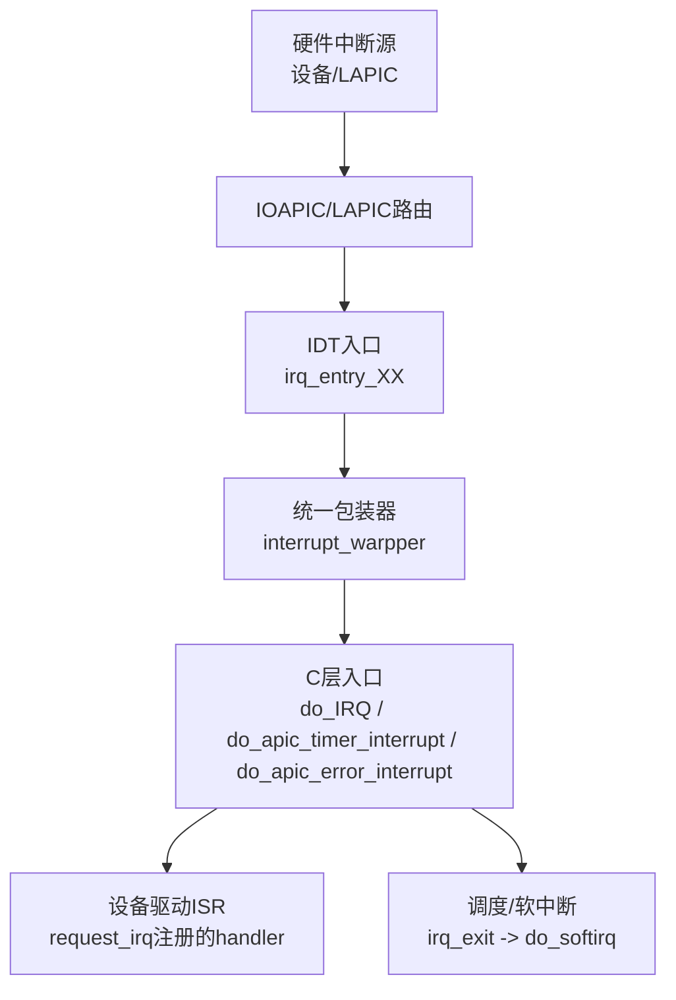
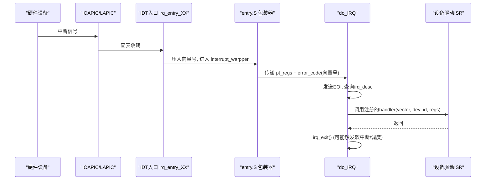
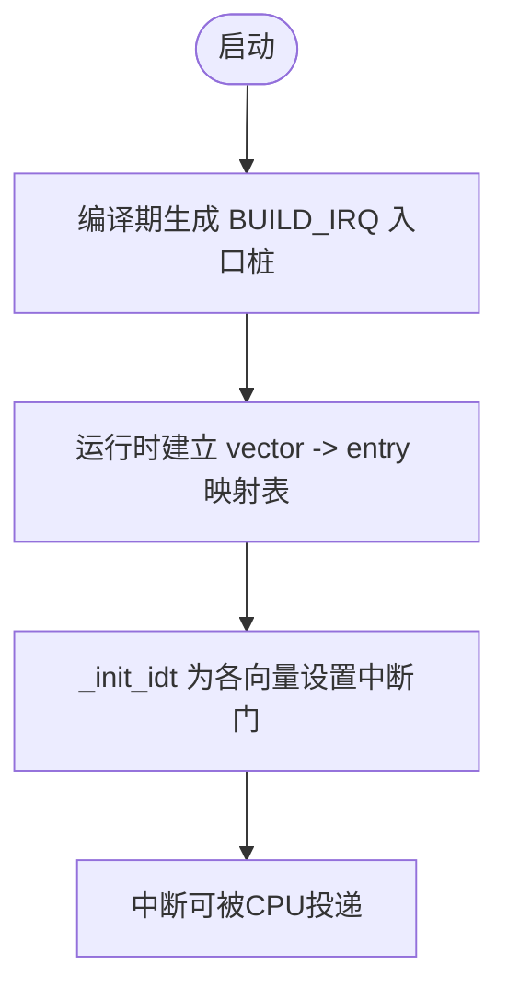
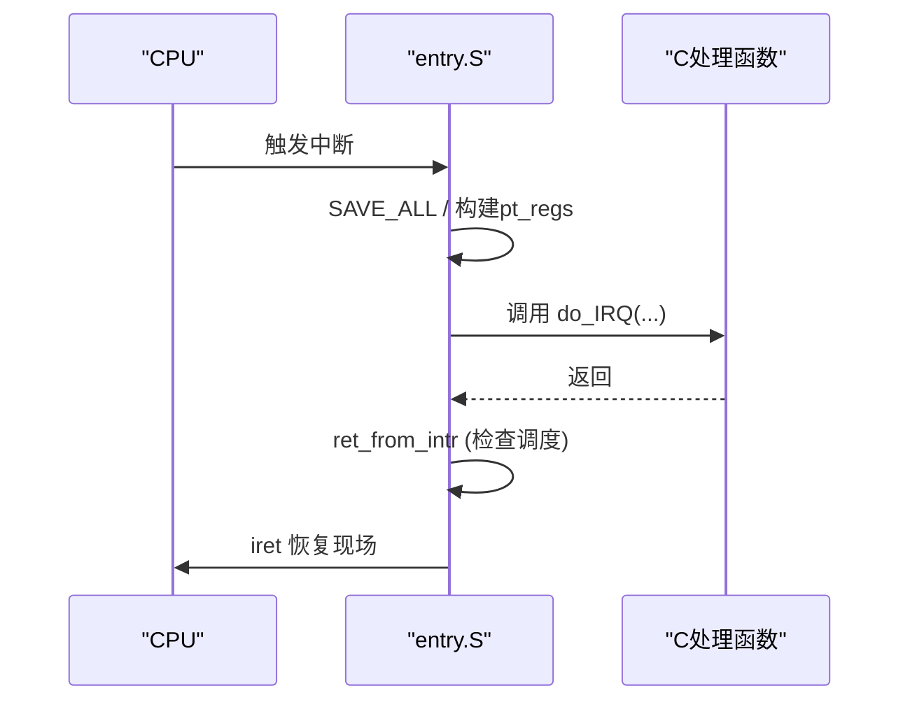
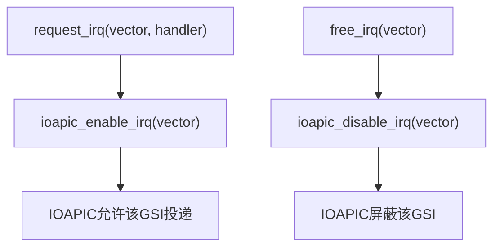
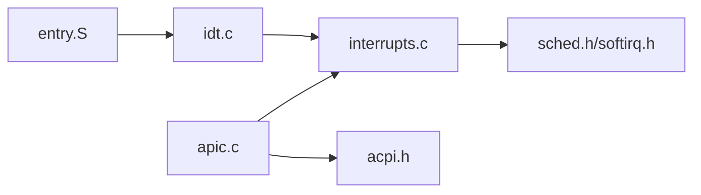

# 硬件中断处理

<cite>
**本文引用的文件**
- [entry.S](file://arch/x86/entry.S)
- [idt.c](file://arch/x86/kernel/idt.c)
- [apic.c](file://arch/x86/kernel/apic.c)
- [interrupts.h](file://includes/interrupts/interrupts.h)
- [interrupts.c](file://kernel/interrupts/interrupts.c)
- [apic.h](file://includes/arch/x86/apic.h)
- [idt.h](file://includes/arch/x86/idt.h)
- [ptrace.h](file://includes/arch/x86/ptrace.h)
</cite>

## 目录
1. [简介](#简介)
2. [项目结构](#项目结构)
3. [核心组件](#核心组件)
4. [架构总览](#架构总览)
5. [详细组件分析](#详细组件分析)
6. [依赖关系分析](#依赖关系分析)
7. [性能与优先级](#性能与优先级)
8. [故障排查指南](#故障排查指南)
9. [结论](#结论)
10. [附录：设备驱动编程接口](#附录设备驱动编程接口)

## 简介
本文件面向LulaOS的x86平台，系统化说明硬件中断从触发到处理的完整流程，涵盖中断入口桩生成与管理、中断服务程序调用约定与上下文切换、中断优先级与嵌套、屏蔽与使能控制、以及设备驱动可用的编程接口与调试技巧。目标是帮助设备驱动开发者正确注册、使用和管理硬件中断。

## 项目结构
围绕中断的关键代码分布在以下位置：
- 汇编入口与上下文切换：arch/x86/entry.S
- IDT初始化与异常门配置：arch/x86/kernel/idt.c
- APIC/IOAPIC初始化与RTE管理：arch/x86/kernel/apic.c
- 中断子系统API与通用处理：kernel/interrupts/interrupts.c
- 头文件定义（向量、IDT、APIC、pt_regs等）：includes/*

图表来源
- [entry.S:186-443](file://arch/x86/entry.S#L186-L443)
- [interrupts.c:84-145](file://kernel/interrupts/interrupts.c#L84-L145)
- [apic.c:230-368](file://arch/x86/kernel/apic.c#L230-L368)

章节来源
- [entry.S:186-443](file://arch/x86/entry.S#L186-L443)
- [idt.c:284-331](file://arch/x86/kernel/idt.c#L284-L331)
- [apic.c:512-529](file://arch/x86/kernel/apic.c#L512-L529)
- [interrupts.c:18-27](file://kernel/interrupts/interrupts.c#L18-L27)

## 核心组件
- 中断向量与常量：FIRST_EXTERNAL_VECTOR、NR_IRQS、TIMER_APIC_VECTOR、ERROR_APIC_VECTOR、SYSCALL_VECTOR
- IDT表与门类型：中断门/陷阱门/系统门，用于区分异常与中断行为
- 中断入口桩：BUILD_IRQ宏为每个向量生成独立入口，压入向量号并跳转至统一包装器
- 统一包装器：保存寄存器、设置段寄存器、构造pt_regs并调用C层处理函数
- 通用中断处理：do_IRQ负责设备中断分发；定时器与错误中断专用处理
- APIC/IOAPIC：本地APIC初始化、LVT配置、计时器校准；IOAPIC RTE映射GSI到向量、屏蔽/使能
- 设备驱动接口：request_irq/free_irq注册/注销ISR，自动完成IOAPIC使能/屏蔽

章节来源
- [interrupts.h:35-42](file://includes/interrupts/interrupts.h#L35-L42)
- [entry.S:191-431](file://arch/x86/entry.S#L191-L431)
- [interrupts.c:9-27](file://kernel/interrupts/interrupts.c#L9-L27)
- [apic.c:102-180](file://arch/x86/kernel/apic.c#L102-L180)
- [apic.c:230-368](file://arch/x86/kernel/apic.c#L230-L368)

## 架构总览
下图展示一次典型设备中断从硬件到驱动的调用序列：

图表来源
- [entry.S:191-206](file://arch/x86/entry.S#L191-L206)
- [entry.S:60-91](file://arch/x86/entry.S#L60-L91)
- [interrupts.c:84-108](file://kernel/interrupts/interrupts.c#L84-L108)

## 详细组件分析

### 中断入口桩的生成与管理
- 生成机制：entry.S通过BUILD_IRQ宏为0x20~0xFF（除0x80）生成独立的irq_entry_XX，每个入口将对应向量号压栈后跳转到统一包装器。
- 管理方式：idt.c维护一个从向量到入口桩地址的映射表interrupt[]，并在_init_idt中为每个外部向量设置中断门，指向对应的irq_entry_XX。
- 特殊向量：0xEF（APIC Timer）和0xFE（APIC Error）有专用入口apic_timer_entry/apic_error_entry，直接调用相应C处理函数。

图表来源
- [entry.S:191-431](file://arch/x86/entry.S#L191-L431)
- [idt.c:68-99](file://arch/x86/kernel/idt.c#L68-L99)
- [idt.c:284-331](file://arch/x86/kernel/idt.c#L284-L331)

章节来源
- [entry.S:191-431](file://arch/x86/entry.S#L191-L431)
- [idt.c:68-99](file://arch/x86/kernel/idt.c#L68-L99)
- [idt.c:284-331](file://arch/x86/kernel/idt.c#L284-L331)

### 中断服务程序的调用约定与上下文切换
- 上下文保存：entry.S在interrupt_warpper中保存通用寄存器、段寄存器，并将当前栈指针作为pt_regs传入C层。
- 参数约定：C层处理函数接收(struct pt_regs *regs, long error_code)，其中error_code对硬件中断保存的是向量号。
- 返回路径：ret_from_intr检查need_resched标志，必要时调用schedule后再恢复寄存器并iret返回。
- 进程切换：__switch_to实现prev/next任务间上下文切换，包括CR3页目录切换与新任务首次执行入口ret_from_fork。

图表来源
- [entry.S:23-58](file://arch/x86/entry.S#L23-L58)
- [entry.S:60-91](file://arch/x86/entry.S#L60-L91)
- [entry.S:489-610](file://arch/x86/entry.S#L489-L610)
- [ptrace.h:5-23](file://includes/arch/x86/ptrace.h#L5-L23)

章节来源
- [entry.S:23-58](file://arch/x86/entry.S#L23-L58)
- [entry.S:60-91](file://arch/x86/entry.S#L60-L91)
- [entry.S:489-610](file://arch/x86/entry.S#L489-L610)
- [ptrace.h:5-23](file://includes/arch/x86/ptrace.h#L5-L23)

### 中断优先级管理与嵌套中断处理
- LAPIC优先级：通过TPR寄存器设置接受阈值，仅允许高于该优先级的中断进入。
- 中断门类型：部分异常使用中断门（自动清IF），防止在异常处理中被嵌套中断打断；普通硬件中断由LAPIC/IOAPIC按优先级调度。
- 嵌套支持：当更高优先级中断到达且IF=1时，CPU可嵌套；否则需等待当前ISR结束。

章节来源
- [apic.c:37-63](file://arch/x86/kernel/apic.c#L37-L63)
- [apic.c:74-100](file://arch/x86/kernel/apic.c#L74-L100)
- [idt.c:284-331](file://arch/x86/kernel/idt.c#L284-L331)

### 中断屏蔽与使能控制机制
- IOAPIC RTE：每个GSI对应一条RTE，包含向量、触发模式、极性、目标CPU、屏蔽位。
- 屏蔽/使能：ioapic_disable_irq/ioapic_enable_irq操作RTE的低32位mask位，控制是否允许该GSI的中断继续投递。
- 驱动集成：request_irq在注册成功后自动解除对应GSI的屏蔽；free_irq先屏蔽再清理描述符，避免悬空中断。

图表来源
- [interrupts.c:40-77](file://kernel/interrupts/interrupts.c#L40-L77)
- [apic.c:330-368](file://arch/x86/kernel/apic.c#L330-L368)

章节来源
- [interrupts.c:40-77](file://kernel/interrupts/interrupts.c#L40-L77)
- [apic.c:330-368](file://arch/x86/kernel/apic.c#L330-L368)

### APIC定时器与错误中断
- 定时器：calibrate_apic_timer使用PIT Channel 2进行校准，设置周期性模式，向量0xEF，进入apic_timer_entry后调用scheduler_tick更新时间片。
- 错误中断：向量0xFE，读取APIC_ERR并记录错误信息，随后发送EOI。

章节来源
- [apic.c:115-180](file://arch/x86/kernel/apic.c#L115-L180)
- [interrupts.c:116-145](file://kernel/interrupts/interrupts.c#L116-L145)
- [entry.S:433-443](file://arch/x86/entry.S#L433-L443)

## 依赖关系分析
- entry.S依赖：linkage.h、segment.h；提供SAVE_ALL/RESTORE_ALL、中断包装器、系统调用入口、进程切换。
- idt.c依赖：idts.h、linkage.h、ptrace.h、apic.h、interrupts.h；负责IDT表项设置与异常门配置。
- apic.c依赖：apic.h、cpu.h、msr.h、acpi.h、io.h、ptrace.h、interrupts.h；负责LAPIC/IOAPIC初始化、RTE配置、IPI/SMP启动。
- interrupts.c依赖：interrupts.h、apic.h、ptrace.h、sched.h、softirq.h、printk.h；提供request_irq/free_irq、do_IRQ、定时器与错误中断处理。

图表来源
- [entry.S:1-3](file://arch/x86/entry.S#L1-L3)
- [idt.c:1-9](file://arch/x86/kernel/idt.c#L1-L9)
- [apic.c:1-10](file://arch/x86/kernel/apic.c#L1-L10)
- [interrupts.c:1-7](file://kernel/interrupts/interrupts.c#L1-L7)

章节来源
- [entry.S:1-3](file://arch/x86/entry.S#L1-L3)
- [idt.c:1-9](file://arch/x86/kernel/idt.c#L1-L9)
- [apic.c:1-10](file://arch/x86/kernel/apic.c#L1-L10)
- [interrupts.c:1-7](file://kernel/interrupts/interrupts.c#L1-L7)

## 性能与优先级
- 快速路径：do_IRQ在进入后立即发送EOI，确保同级及低优先级中断不被阻塞，减少中断延迟。
- 最小化工作：ISR应尽量短小，将耗时工作下沉到软中断或线程。
- 优先级策略：通过TPR限制可接受的最小优先级，结合IOAPIC触发模式与极性优化响应。
- 定时精度：APIC Timer经PIT校准，周期性tick驱动调度器，保证时间片公平性。

[本节为通用性能建议，不直接分析具体文件]

## 故障排查指南
- 常见症状：
  - “unexpected vector”：do_IRQ检测到非法或越界向量，检查IOAPIC RTE映射与IDT配置。
  - “no handler registered”：向量已投递但无驱动注册ISR，确认request_irq调用时机与vector范围。
  - APIC Error中断：读取APIC_ERR定位错误原因，检查LINT配置与总线状态。
- 调试技巧：
  - 使用show_registers打印中断现场，核对EIP/CS/EFLAGS与栈帧。
  - 校验IOAPIC RTE写入顺序（先高后低），避免竞态导致中断提前生效。
  - 利用PIT udelay进行精确延时，辅助时序问题定位。

章节来源
- [interrupts.c:84-108](file://kernel/interrupts/interrupts.c#L84-L108)
- [interrupts.c:135-145](file://kernel/interrupts/interrupts.c#L135-L145)
- [apic.c:371-380](file://arch/x86/kernel/apic.c#L371-L380)
- [apic.c:477-509](file://arch/x86/kernel/apic.c#L477-L509)

## 结论
LulaOS的x86中断子系统以“汇编入口桩 + C层统一处理 + APIC/IOAPIC配置”为核心，提供了清晰的设备中断注册与分发机制。通过合理的优先级设置、及时的EOI发送与最小化的ISR逻辑，可实现高效可靠的中断处理。设备驱动应遵循request_irq/free_irq接口，配合IOAPIC使能/屏蔽策略，确保稳定运行。

[本节为总结性内容，不直接分析具体文件]

## 附录：设备驱动编程接口
- 注册中断：
  - 接口：request_irq(vector, handler, name, dev_id)
  - 作用：绑定设备ISR，自动解除对应GSI屏蔽，使能硬件中断
  - 返回值：成功0，失败-1
- 注销中断：
  - 接口：free_irq(vector)
  - 作用：屏蔽GSI并清理描述符，避免悬空中断
- 中断处理函数签名：
  - void handler(int irq, void *dev_id, struct pt_regs *regs)
  - 注意：保持ISR简短，必要时提交软中断或唤醒线程处理重活
- 常用向量：
  - 设备IRQ：FIRST_EXTERNAL_VECTOR(0x20)起
  - 定时器：TIMER_APIC_VECTOR(0xEF)
  - 错误：ERROR_APIC_VECTOR(0xFE)
  - 系统调用：SYSCALL_VECTOR(0x80)

章节来源
- [interrupts.h:35-42](file://includes/interrupts/interrupts.h#L35-L42)
- [interrupts.h:50-55](file://includes/interrupts/interrupts.h#L50-L55)
- [interrupts.c:40-77](file://kernel/interrupts/interrupts.c#L40-L77)
- [interrupts.c:116-145](file://kernel/interrupts/interrupts.c#L116-L145)