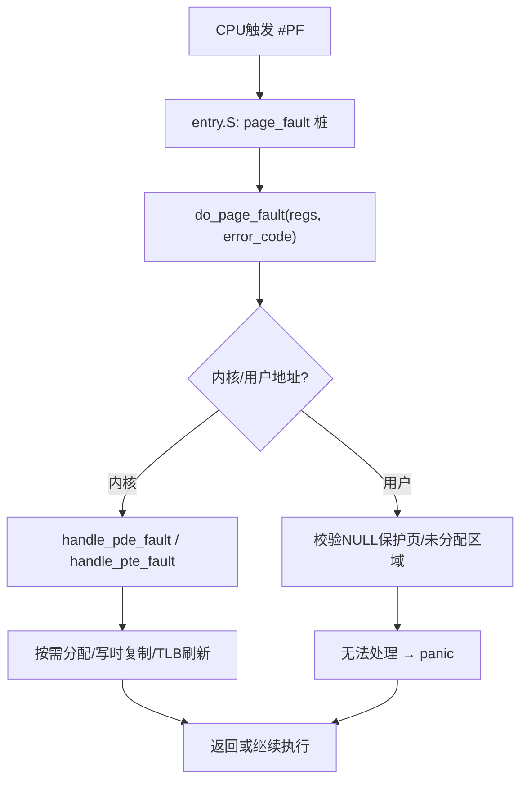
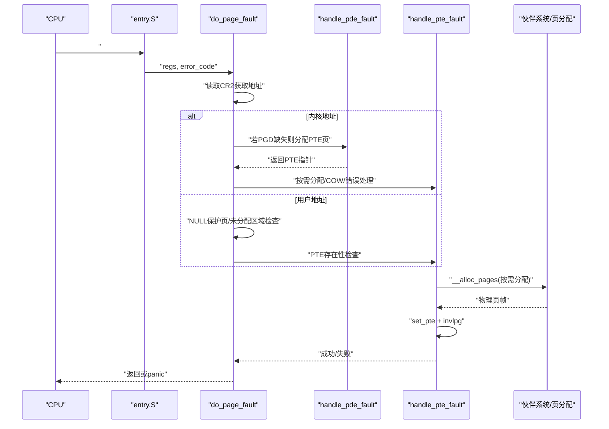
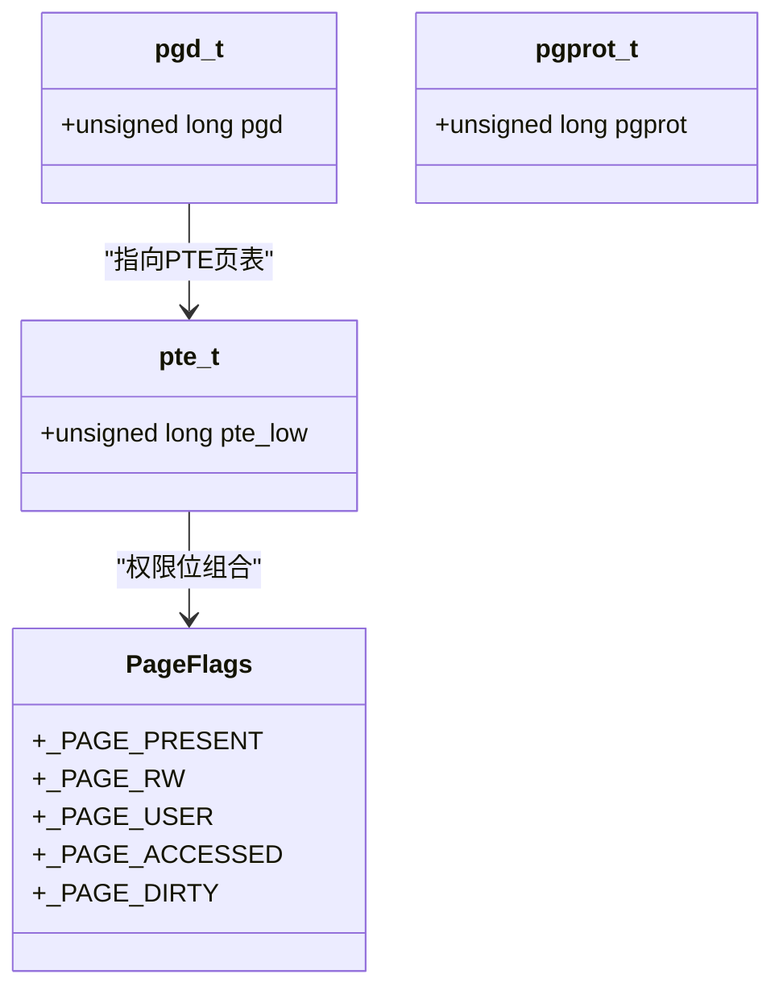
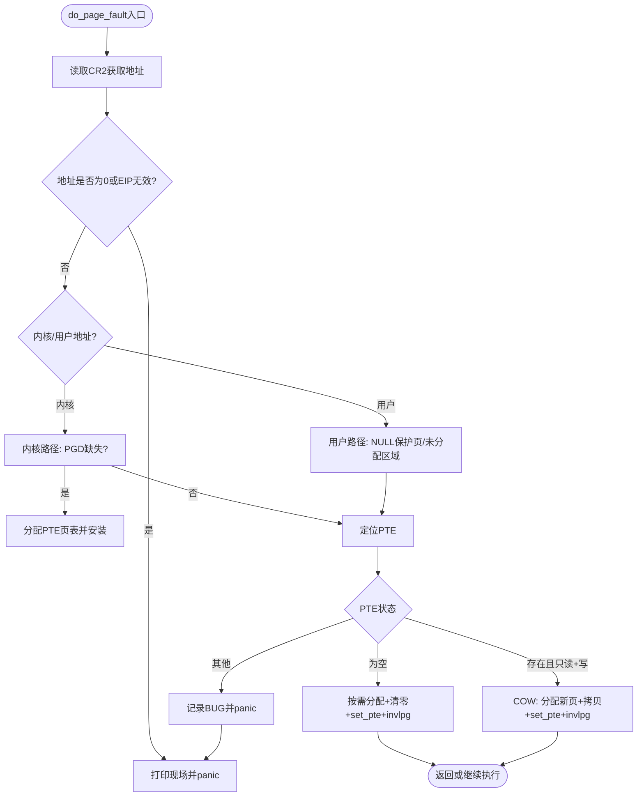
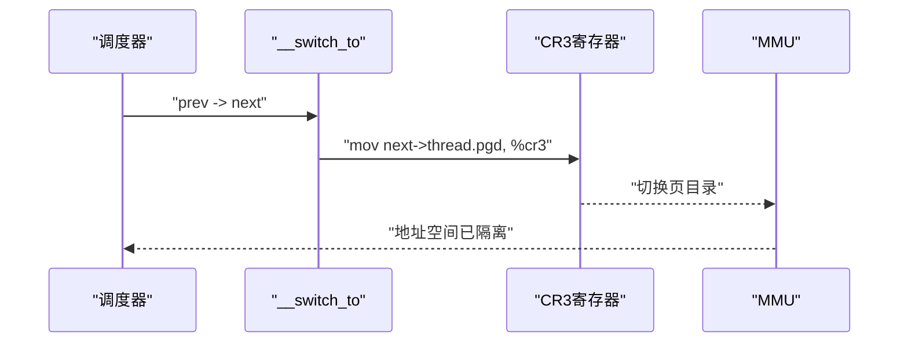
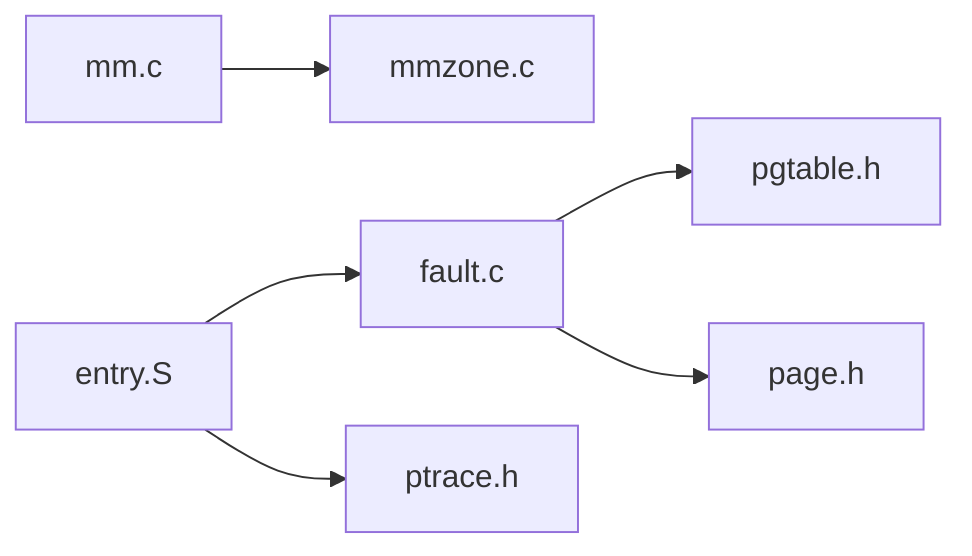

# 内存保护机制

<cite>
**本文引用的文件**
- [arch/x86/kernel/mm/fault.c](file://arch/x86/kernel/mm/fault.c)
- [arch/x86/kernel/mm/mm.c](file://arch/x86/kernel/mm/mm.c)
- [includes/arch/x86/pgtable.h](file://includes/arch/x86/pgtable.h)
- [includes/arch/x86/page.h](file://includes/arch/x86/page.h)
- [kernel/syscall.c](file://kernel/syscall.c)
- [arch/x86/entry.S](file://arch/x86/entry.S)
- [includes/arch/x86/ptrace.h](file://includes/arch/x86/ptrace.h)
- [kernel/mm/mmzone.c](file://kernel/mm/mmzone.c)
- [includes/mm/mm.h](file://includes/mm/mm.h)
</cite>

## 目录
1. [简介](#简介)
2. [项目结构](#项目结构)
3. [核心组件](#核心组件)
4. [架构总览](#架构总览)
5. [详细组件分析](#详细组件分析)
6. [依赖关系分析](#依赖关系分析)
7. [性能考虑](#性能考虑)
8. [故障排查指南](#故障排查指南)
9. [结论](#结论)
10. [附录](#附录)

## 简介
本文件系统性阐述LulaOS在x86架构下的内存保护机制，覆盖页表权限位设置、访问检查、页面故障处理流程（缺页、非法访问、权限错误）、用户态与内核态隔离、地址空间分离与保护域管理、越界检测与调试支持、安全漏洞防护与攻击面分析，以及内存保护相关的系统调用接口与调试工具使用方法。文档以仓库源码为依据，提供代码级图示与引用路径，便于读者深入理解并定位实现细节。

## 项目结构
围绕内存保护的关键代码分布在以下位置：
- 异常入口与上下文切换：arch/x86/entry.S
- 缺页异常处理：arch/x86/kernel/mm/fault.c
- 页表结构与属性：includes/arch/x86/pgtable.h、includes/arch/x86/page.h
- 页表初始化与直接映射：arch/x86/kernel/mm/mm.c
- 伙伴系统与页面分配：kernel/mm/mmzone.c
- 进程寄存器快照结构：includes/arch/x86/ptrace.h
- 系统调用框架：kernel/syscall.c
- 页描述符与标志位：includes/mm/mm.h

**图表来源**
- [arch/x86/entry.S:158-160](file://arch/x86/entry.S#L158-L160)
- [arch/x86/kernel/mm/fault.c:184-250](file://arch/x86/kernel/mm/fault.c#L184-L250)

**章节来源**
- [arch/x86/entry.S:158-160](file://arch/x86/entry.S#L158-L160)
- [arch/x86/kernel/mm/fault.c:184-250](file://arch/x86/kernel/mm/fault.c#L184-L250)

## 核心组件
- 页表与权限位定义：包含PGD/PTE结构、权限位宏、页表操作函数、TLB刷新接口等。
- 缺页异常处理：统一入口do_page_fault，分派到PDE/PTE级处理，支持按需分配与写时复制。
- 内存初始化与直接映射：建立0~896M的直接映射、固定映射区、持久映射区，加载CR3启用分页。
- 伙伴系统与页面分配：按阶分配/释放页面，维护空闲链表与位图。
- 进程上下文切换：切换CR3实现地址空间隔离，保存/恢复寄存器。
- 系统调用框架：注册与分发系统调用，为后续内存相关系统调用提供扩展点。

**章节来源**
- [includes/arch/x86/pgtable.h:24-90](file://includes/arch/x86/pgtable.h#L24-L90)
- [arch/x86/kernel/mm/fault.c:96-171](file://arch/x86/kernel/mm/fault.c#L96-L171)
- [arch/x86/kernel/mm/mm.c:24-134](file://arch/x86/kernel/mm/mm.c#L24-L134)
- [kernel/mm/mmzone.c:248-329](file://kernel/mm/mmzone.c#L248-L329)
- [arch/x86/entry.S:520-583](file://arch/x86/entry.S#L520-L583)
- [kernel/syscall.c:56-98](file://kernel/syscall.c#L56-L98)

## 架构总览
LulaOS采用两级页表（PGD→PTE）的x86分页模型，通过CR3切换不同进程的页目录实现地址空间隔离。内核空间位于PAGE_OFFSET以上，用户空间位于其下；内核态与用户态通过段选择符与页表USER位共同约束访问权限。缺页异常由硬件触发，经由entry.S进入C层处理，根据错误码与地址范围进行差异化处理。

**图表来源**
- [arch/x86/entry.S:158-160](file://arch/x86/entry.S#L158-L160)
- [arch/x86/kernel/mm/fault.c:184-250](file://arch/x86/kernel/mm/fault.c#L184-L250)
- [arch/x86/kernel/mm/fault.c:96-171](file://arch/x86/kernel/mm/fault.c#L96-L171)
- [kernel/mm/mmzone.c:248-329](file://kernel/mm/mmzone.c#L248-L329)

## 详细组件分析

### 页表权限位与访问控制
- 权限位定义：PRESENT、RW、USER、ACCESSED、DIRTY等，用于控制页是否有效、可读写、用户态可访问、访问/脏标记。
- 页表项构造：__mk_pte将物理页号与页保护属性组合，set_pte写入PTE。
- 访问检查：pte_present、pte_write、pte_user等内联函数用于判断当前PTE的权限状态。
- TLB刷新：__flush_tlb_one使用invlpg刷新单个虚拟地址的TLB条目，保证映射更新即时生效。

**图表来源**
- [includes/arch/x86/page.h:23-37](file://includes/arch/x86/page.h#L23-L37)
- [includes/arch/x86/pgtable.h:24-90](file://includes/arch/x86/pgtable.h#L24-L90)

**章节来源**
- [includes/arch/x86/pgtable.h:24-90](file://includes/arch/x86/pgtable.h#L24-L90)
- [includes/arch/x86/page.h:23-42](file://includes/arch/x86/page.h#L23-L42)

### 缺页异常处理流程
- 入口：entry.S中page_fault桩将regs与error_code传递给do_page_fault。
- 快速校验：读取CR2获取异常地址，检查空指针与无效EIP。
- 内核/用户分支：
  - 内核地址：若PGD缺失则分配PTE页表并安装；随后进入PTE级处理。
  - 用户地址：检查NULL保护页与未分配区域，再进入PTE级处理。
- PTE级处理三种情况：
  1) PTE为空：按需分配物理页、清零、设置PAGE_KERNEL属性、刷新TLB。
  2) PTE存在且只读+写访问：写时复制（COW），分配新页、拷贝内容、替换PTE为新页可写。
  3) 其他：内核态写保护违规等，记录BUG并panic。
- 无法处理：打印完整现场后停机。

**图表来源**
- [arch/x86/kernel/mm/fault.c:184-250](file://arch/x86/kernel/mm/fault.c#L184-L250)
- [arch/x86/kernel/mm/fault.c:96-171](file://arch/x86/kernel/mm/fault.c#L96-L171)

**章节来源**
- [arch/x86/kernel/mm/fault.c:184-250](file://arch/x86/kernel/mm/fault.c#L184-L250)
- [arch/x86/kernel/mm/fault.c:96-171](file://arch/x86/kernel/mm/fault.c#L96-L171)

### 用户态与内核态隔离与地址空间分离
- 地址空间划分：PAGE_OFFSET作为分界线，内核空间≥PAGE_OFFSET，用户空间<PAGE_OFFSET。
- 页目录切换：__switch_to在进程切换时加载next->thread.pgd到CR3，实现地址空间隔离。
- 权限约束：页表项USER位决定用户态可访问性；段选择符与特权级进一步限制访问。
- 保护域管理：通过不同进程的页目录实现隔离，内核态与用户态共享同一套页表API但权限不同。

**图表来源**
- [arch/x86/entry.S:520-583](file://arch/x86/entry.S#L520-L583)

**章节来源**
- [arch/x86/entry.S:520-583](file://arch/x86/entry.S#L520-L583)
- [includes/arch/x86/page.h:5-11](file://includes/arch/x86/page.h#L5-L11)

### 页面故障处理策略与错误分类
- 缺页（Not-Present）：按需分配物理页并建立映射。
- 写保护（Protection）：仅当PTE存在且只读时触发写访问，走COW路径。
- 用户态访问违规：用户态访问未分配区域或NULL保护页，记录SEGFAULT并panic。
- ioremap区域保护：该区域PTE必须由ioremap主动建立，禁止按需分配普通RAM页。

**章节来源**
- [arch/x86/kernel/mm/fault.c:64-70](file://arch/x86/kernel/mm/fault.c#L64-L70)
- [arch/x86/kernel/mm/fault.c:100-149](file://arch/x86/kernel/mm/fault.c#L100-L149)
- [arch/x86/kernel/mm/fault.c:205-247](file://arch/x86/kernel/mm/fault.c#L205-L247)

### 内存越界检测与调试支持
- 越界检测：通过页表权限位与异常处理实现访问越界拦截（如NULL保护页、未分配区域）。
- 调试支持：pt_regs结构保存中断/异常时的寄存器快照，便于调试器查看上下文；entry.S提供统一的异常入口与返回逻辑。
- 调试工具使用：结合printk输出与panic现场信息，定位异常地址、错误码、EIP等关键信息。

**章节来源**
- [includes/arch/x86/ptrace.h:5-23](file://includes/arch/x86/ptrace.h#L5-L23)
- [arch/x86/entry.S:62-91](file://arch/x86/entry.S#L62-L91)
- [arch/x86/kernel/mm/fault.c:256-290](file://arch/x86/kernel/mm/fault.c#L256-L290)

### 安全漏洞防护与攻击面分析
- 防护机制：
  - 页表权限位强制访问控制，防止用户态越权访问内核数据。
  - NULL保护页与未分配区域检查，避免空指针解引用与任意地址写入。
  - ioremap区域特殊处理，防止映射丢失导致的安全隐患。
- 攻击面：
  - 页表损坏：恶意修改PGD/PTE可能导致权限提升或数据泄露。
  - COW竞争条件：并发写时复制需确保原子性与一致性。
  - TLB一致性：频繁TLB刷新可能带来性能开销，需平衡安全性与效率。
- 缓解建议：
  - 严格校验页表项合法性，避免非法PTE安装。
  - 增强并发控制，确保COW路径的原子性。
  - 审计TLB刷新策略，减少不必要的全局刷新。

**章节来源**
- [includes/arch/x86/pgtable.h:24-90](file://includes/arch/x86/pgtable.h#L24-L90)
- [arch/x86/kernel/mm/fault.c:100-149](file://arch/x86/kernel/mm/fault.c#L100-L149)
- [arch/x86/kernel/mm/fault.c:205-247](file://arch/x86/kernel/mm/fault.c#L205-L247)

### 系统调用接口与调试工具使用方法
- 系统调用框架：syscall_init注册内置系统调用，do_syscall根据调用号分发到对应处理函数。
- 内存相关系统调用：当前实现未包含具体内存管理系统调用，可扩展mmap、munmap、brk等接口。
- 调试工具：
  - 利用pt_regs与printk输出异常现场信息。
  - 结合entry.S的统一异常入口，便于断点调试与日志收集。

**章节来源**
- [kernel/syscall.c:56-98](file://kernel/syscall.c#L56-L98)
- [includes/arch/x86/ptrace.h:5-23](file://includes/arch/x86/ptrace.h#L5-L23)

## 依赖关系分析
- fault.c依赖pgtable.h与page.h提供的页表操作与权限位定义。
- mm.c负责页表初始化与直接映射，依赖mmzone.c的伙伴系统接口。
- entry.S提供异常入口与进程切换逻辑，与fault.c协同完成缺页处理。
- ptrace.h定义寄存器快照结构，供异常处理与调试使用。

**图表来源**
- [arch/x86/kernel/mm/fault.c:1-10](file://arch/x86/kernel/mm/fault.c#L1-L10)
- [arch/x86/kernel/mm/mm.c:1-9](file://arch/x86/kernel/mm/mm.c#L1-L9)
- [arch/x86/entry.S:158-160](file://arch/x86/entry.S#L158-L160)

**章节来源**
- [arch/x86/kernel/mm/fault.c:1-10](file://arch/x86/kernel/mm/fault.c#L1-L10)
- [arch/x86/kernel/mm/mm.c:1-9](file://arch/x86/kernel/mm/mm.c#L1-L9)
- [arch/x86/entry.S:158-160](file://arch/x86/entry.S#L158-L160)

## 性能考虑
- 按需分配与COW：减少初始内存占用，提高多进程启动速度。
- TLB刷新粒度：优先使用invlpg局部刷新，避免全局刷新带来的性能损耗。
- 伙伴系统分配：按阶分配与合并，降低碎片化并提升分配效率。
- 直接映射：0~896M直接映射简化内核访问，减少页表遍历开销。

[本节为通用性能讨论，不直接分析具体文件]

## 故障排查指南
- 常见错误：
  - 空指针解引用：检查地址是否为0，确认指针初始化。
  - 用户态访问未分配区域：检查用户空间映射是否正确建立。
  - ioremap区域缺页：确认映射是否被正确建立与保持。
- 排查步骤：
  1. 查看panic输出的地址、错误码、EIP等信息。
  2. 分析错误码位：Present/Write/User/Reserved/Instruction-Fetch。
  3. 检查页表项是否存在及权限位是否正确。
  4. 验证进程切换时CR3是否正确加载。

**章节来源**
- [arch/x86/kernel/mm/fault.c:256-290](file://arch/x86/kernel/mm/fault.c#L256-L290)

## 结论
LulaOS在x86架构下实现了基于两级页表的内存保护机制，通过权限位控制、缺页异常处理、用户态与内核态隔离、伙伴系统分配等关键技术，提供了基础的内存安全与隔离能力。未来可扩展更多内存管理功能与调试工具，进一步提升系统的健壮性与可维护性。

[本节为总结性内容，不直接分析具体文件]

## 附录
- 术语解释：
  - PGD：页全局目录，存储页表基址。
  - PTE：页表项，存储物理页帧与权限位。
  - COW：写时复制，延迟物理页分配以提高效率。
  - TLB：转换后备缓冲器，缓存页表映射以提升访问速度。
- 参考路径：
  - 页表权限位定义：[includes/arch/x86/pgtable.h:24-90](file://includes/arch/x86/pgtable.h#L24-L90)
  - 缺页异常处理：[arch/x86/kernel/mm/fault.c:184-250](file://arch/x86/kernel/mm/fault.c#L184-L250)
  - 进程切换与CR3加载：[arch/x86/entry.S:520-583](file://arch/x86/entry.S#L520-L583)

[本节为补充说明，不直接分析具体文件]