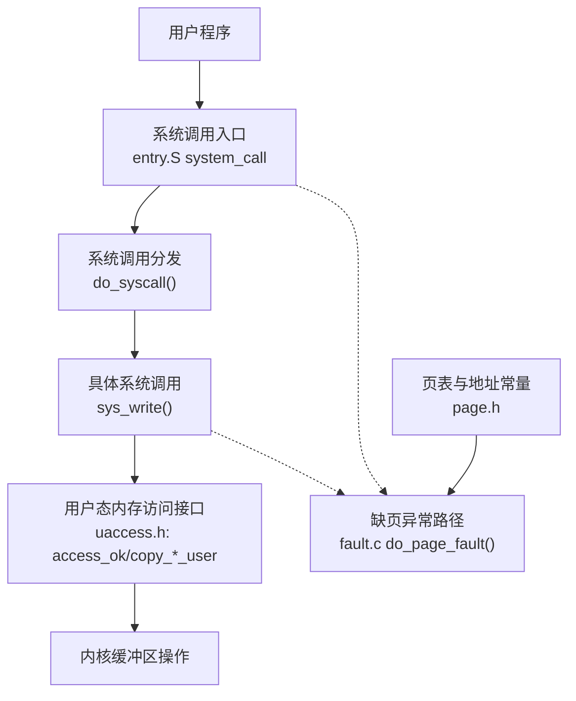
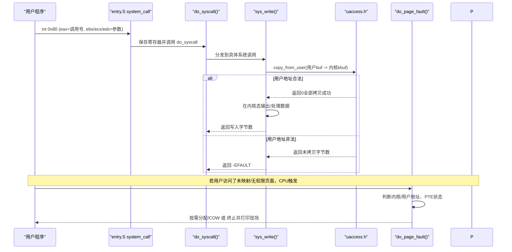
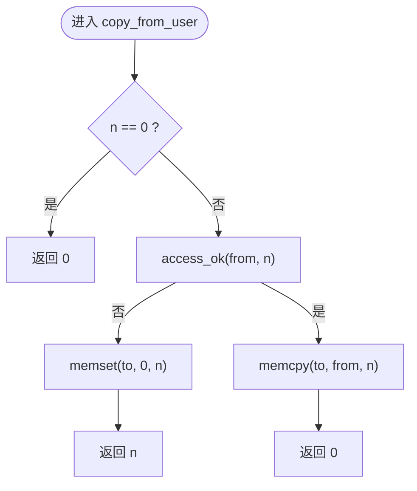
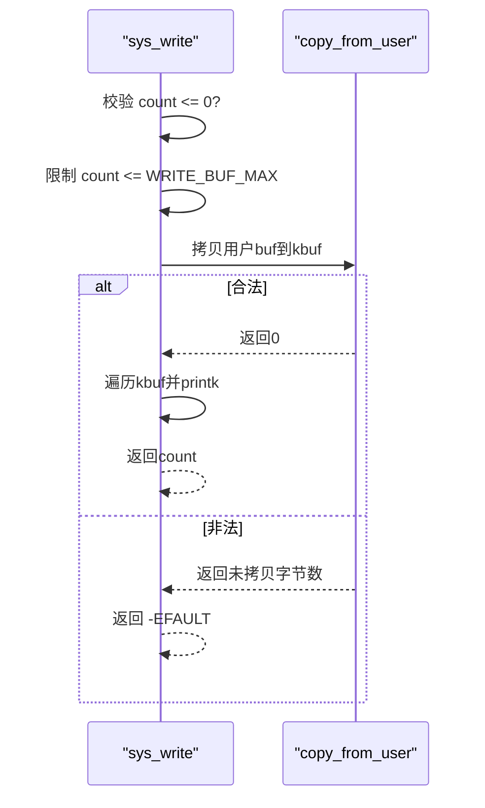
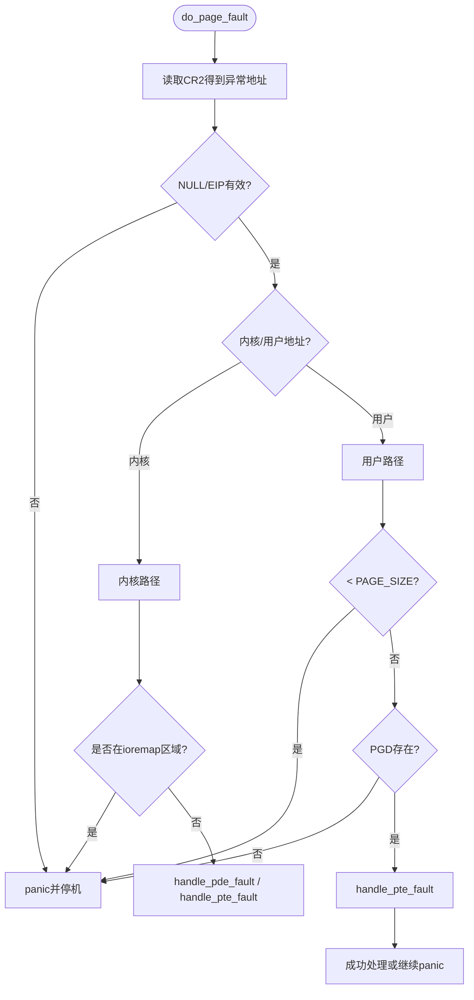
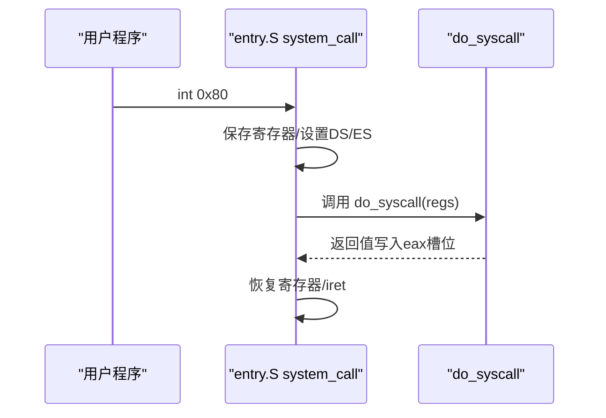
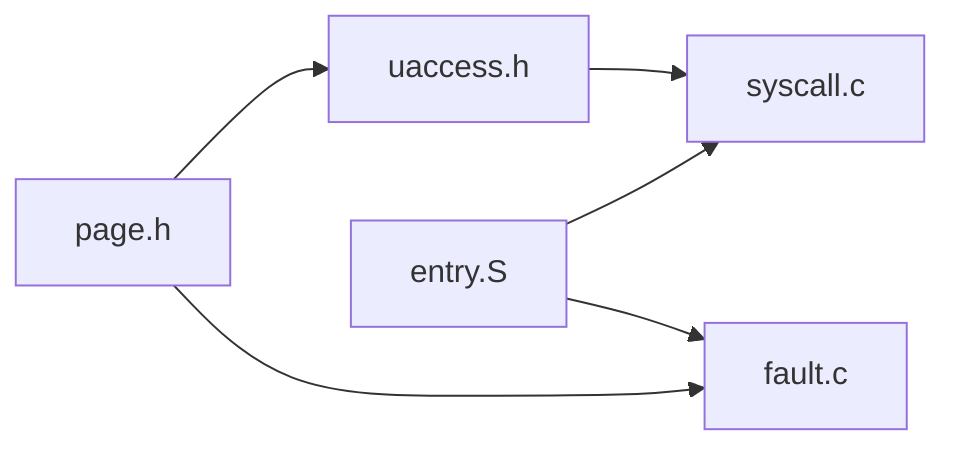

# 用户空间访问验证

<cite>
**本文引用的文件**
- [includes/arch/x86/uaccess.h](file://includes/arch/x86/uaccess.h)
- [arch/x86/kernel/mm/fault.c](file://arch/x86/kernel/mm/fault.c)
- [kernel/syscall.c](file://kernel/syscall.c)
- [arch/x86/entry.S](file://arch/x86/entry.S)
- [includes/arch/x86/page.h](file://includes/arch/x86/page.h)
- [README.md](file://README.md)
</cite>

## 目录
1. [简介](#简介)
2. [项目结构](#项目结构)
3. [核心组件](#核心组件)
4. [架构总览](#架构总览)
5. [详细组件分析](#详细组件分析)
6. [依赖关系分析](#依赖关系分析)
7. [性能考量](#性能考量)
8. [故障排查指南](#故障排查指南)
9. [结论](#结论)
10. [附录](#附录)

## 简介
本文件聚焦于 LulaOS 的“用户空间访问验证”机制，围绕内核与用户态地址空间的隔离、系统调用入口对用户指针的校验、以及缺页异常对非法用户内存访问的处理进行系统化说明。当前实现采用“先校验后拷贝”的保守策略：在系统调用中通过 access_ok/copy_from_user/copy_to_user 等接口完成用户指针合法性检查与数据拷贝；当发生缺页或权限违规时，由缺页异常处理程序进行诊断与恢复（按需分配/COW）或终止进程并打印现场信息。

## 项目结构
与用户空间访问验证直接相关的代码分布在以下位置：
- 用户态内存访问接口定义：includes/arch/x86/uaccess.h
- 系统调用实现与用户数据拷贝：kernel/syscall.c
- 缺页异常处理与内存保护：arch/x86/kernel/mm/fault.c
- 中断/系统调用入口与上下文切换：arch/x86/entry.S
- 页大小与地址常量：includes/arch/x86/page.h

图表来源
- [arch/x86/entry.S:445-486](file://arch/x86/entry.S#L445-L486)
- [kernel/syscall.c:31-56](file://kernel/syscall.c#L31-L56)
- [includes/arch/x86/uaccess.h:39-96](file://includes/arch/x86/uaccess.h#L39-L96)
- [arch/x86/kernel/mm/fault.c:184-251](file://arch/x86/kernel/mm/fault.c#L184-L251)
- [includes/arch/x86/page.h:5-11](file://includes/arch/x86/page.h#L5-L11)

章节来源
- [arch/x86/entry.S:445-486](file://arch/x86/entry.S#L445-L486)
- [kernel/syscall.c:31-56](file://kernel/syscall.c#L31-L56)
- [includes/arch/x86/uaccess.h:39-96](file://includes/arch/x86/uaccess.h#L39-L96)
- [arch/x86/kernel/mm/fault.c:184-251](file://arch/x86/kernel/mm/fault.c#L184-L251)
- [includes/arch/x86/page.h:5-11](file://includes/arch/x86/page.h#L5-L11)

## 核心组件
- 用户态内存访问接口（uaccess.h）
  - 提供 access_ok、copy_from_user、copy_to_user、strncpy_from_user 等函数，确保所有来自用户态的指针在进入内核前经过范围与边界检查，防止越界访问内核空间。
  - 使用 PAGE_OFFSET/TASK_SIZE 作为用户/内核地址分界，保证用户指针必须位于 [0, TASK_SIZE)。
- 系统调用实现（syscall.c）
  - sys_write 等系统调用在入口处使用 copy_from_user 将用户缓冲区拷贝到内核栈缓冲，再在内核态安全地处理数据。
  - 对 count 做上限限制，避免内核栈溢出；拷贝失败返回 -EFAULT。
- 缺页异常处理（fault.c）
  - do_page_fault 读取 CR2 获取异常地址，区分内核/用户空间，处理 PTE 缺失（按需分配）、写保护触发（COW），并对非法访问进行 panic。
  - 对 ioremap 区域进行特殊保护，禁止走按需分配路径。
- 入口与上下文（entry.S）
  - system_call 负责保存寄存器、切换到内核段、调用 do_syscall，并将返回值写回用户态寄存器。
  - page_fault 桩将异常路由到 do_page_fault。
- 页常量（page.h）
  - 定义 PAGE_OFFSET、PAGE_SIZE、页表类型与转换宏，为 uaccess 与 fault 提供基础常量与工具。

章节来源
- [includes/arch/x86/uaccess.h:39-96](file://includes/arch/x86/uaccess.h#L39-L96)
- [kernel/syscall.c:31-56](file://kernel/syscall.c#L31-L56)
- [arch/x86/kernel/mm/fault.c:184-251](file://arch/x86/kernel/mm/fault.c#L184-L251)
- [arch/x86/entry.S:445-486](file://arch/x86/entry.S#L445-L486)
- [includes/arch/x86/page.h:5-11](file://includes/arch/x86/page.h#L5-L11)

## 架构总览
下图展示了从用户态发起系统调用到内核态进行用户空间访问验证与处理的完整流程，包括正常路径与异常路径。

图表来源
- [arch/x86/entry.S:445-486](file://arch/x86/entry.S#L445-L486)
- [kernel/syscall.c:31-56](file://kernel/syscall.c#L31-L56)
- [includes/arch/x86/uaccess.h:39-96](file://includes/arch/x86/uaccess.h#L39-L96)
- [arch/x86/kernel/mm/fault.c:184-251](file://arch/x86/kernel/mm/fault.c#L184-L251)

## 详细组件分析

### 用户态内存访问接口（uaccess.h）
- 设计要点
  - 以 PAGE_OFFSET 作为用户/内核地址分界，TASK_SIZE = PAGE_OFFSET。
  - access_ok 严格校验 [addr, addr+size) 完全落在 [0, TASK_SIZE)，并防止 size 溢出导致的回绕。
  - copy_from_user/copy_to_user 在校验通过后执行 memcpy；失败时按 Linux ABI 返回未拷贝字节数，便于上层返回 -EFAULT。
  - strncpy_from_user 逐字节拷贝并每步检查是否越界，保证 dst 以 '\0' 结尾。
- 复杂度与性能
  - 时间复杂度 O(n)（n 为拷贝长度），空间复杂度 O(1)。
  - 由于是“先校验后拷贝”，避免了异常路径开销，但在大对象拷贝时仍受限于逐块 memcpy 的性能。
- 错误处理
  - 非法地址：清零目标缓冲（from_user）或直接返回未拷贝数（to_user）。
  - 字符串拷贝：遇到越界或非法地址返回 -1。

图表来源
- [includes/arch/x86/uaccess.h:65-77](file://includes/arch/x86/uaccess.h#L65-L77)

章节来源
- [includes/arch/x86/uaccess.h:39-96](file://includes/arch/x86/uaccess.h#L39-L96)
- [includes/arch/x86/uaccess.h:111-131](file://includes/arch/x86/uaccess.h#L111-L131)

### 系统调用中的用户数据拷贝（syscall.c）
- 设计要点
  - sys_write 限制单次写入量至 WRITE_BUF_MAX，避免内核栈溢出。
  - 使用 copy_from_user 将用户缓冲区拷贝到内核栈缓冲 kbuf，再在内核态安全输出。
  - 拷贝失败返回 -EFAULT，符合 Linux ABI。
- 错误处理
  - 非法用户指针：返回 -EFAULT。
  - 过大 count：截断到 WRITE_BUF_MAX。

图表来源
- [kernel/syscall.c:31-56](file://kernel/syscall.c#L31-L56)

章节来源
- [kernel/syscall.c:31-56](file://kernel/syscall.c#L31-L56)

### 缺页异常与用户空间保护（fault.c）
- 设计要点
  - do_page_fault 读取 CR2 获取异常地址，快速检查 NULL/EIP 有效性。
  - 区分内核/用户地址：
    - 内核地址：对 ioremap 区域禁止按需分配；否则可分配 PTE/PDE。
    - 用户地址：低地址 NULL 保护页（0~4K）直接报错；PGD 不存在则视为未分配区域。
  - handle_pte_fault 支持三种情况：
    - PTE 为空：按需分配物理页并建立映射。
    - PTE 存在且只读 + 写访问：COW（复制旧页到新页并更新 PTE）。
    - 内核态写保护违规：记录 BUG 并进入 panic。
- 错误处理
  - 无法处理的异常统一进入 do_page_fault_panic，打印寄存器现场并停机。

图表来源
- [arch/x86/kernel/mm/fault.c:184-251](file://arch/x86/kernel/mm/fault.c#L184-L251)
- [arch/x86/kernel/mm/fault.c:96-150](file://arch/x86/kernel/mm/fault.c#L96-L150)

章节来源
- [arch/x86/kernel/mm/fault.c:96-150](file://arch/x86/kernel/mm/fault.c#L96-L150)
- [arch/x86/kernel/mm/fault.c:184-251](file://arch/x86/kernel/mm/fault.c#L184-L251)

### 入口与上下文切换（entry.S）
- system_call
  - 保存寄存器、设置内核段寄存器、构造 pt_regs 并调用 do_syscall，最后将返回值写回 eax 槽位并 iret 返回用户态。
- page_fault
  - 将 #PF 异常路由到 do_page_fault，传递 error_code 与 pt_regs。
- 上下文切换
  - __switch_to 保存 prev 上下文、恢复 next 上下文、必要时切换 CR3 页目录。

图表来源
- [arch/x86/entry.S:445-486](file://arch/x86/entry.S#L445-L486)

章节来源
- [arch/x86/entry.S:445-486](file://arch/x86/entry.S#L445-L486)

## 依赖关系分析
- uaccess.h 依赖 page.h 提供的 PAGE_OFFSET、PAGE_SIZE 等常量，以及 memcpy/memset。
- syscall.c 依赖 uaccess.h 进行用户数据拷贝，依赖 printk 输出。
- fault.c 依赖 page.h、pgtable.h、mm.h 等进行页表操作与内存管理。
- entry.S 与 fault.c、syscall.c 通过符号名耦合，形成中断/系统调用的统一入口。

图表来源
- [includes/arch/x86/page.h:5-11](file://includes/arch/x86/page.h#L5-L11)
- [includes/arch/x86/uaccess.h:20-21](file://includes/arch/x86/uaccess.h#L20-L21)
- [kernel/syscall.c:1-5](file://kernel/syscall.c#L1-L5)
- [arch/x86/kernel/mm/fault.c:1-10](file://arch/x86/kernel/mm/fault.c#L1-L10)
- [arch/x86/entry.S:445-486](file://arch/x86/entry.S#L445-L486)

章节来源
- [includes/arch/x86/page.h:5-11](file://includes/arch/x86/page.h#L5-L11)
- [includes/arch/x86/uaccess.h:20-21](file://includes/arch/x86/uaccess.h#L20-L21)
- [kernel/syscall.c:1-5](file://kernel/syscall.c#L1-L5)
- [arch/x86/kernel/mm/fault.c:1-10](file://arch/x86/kernel/mm/fault.c#L1-L10)
- [arch/x86/entry.S:445-486](file://arch/x86/entry.S#L445-L486)

## 性能考量
- 用户态拷贝路径
  - 采用“先校验后拷贝”，减少异常开销，适合小/中等数据拷贝；大数据拷贝建议分批或优化拷贝策略。
- 缺页处理路径
  - 按需分配与 COW 会引入额外内存分配与复制成本，频繁触发会影响性能；应尽量避免大量写共享只读页。
- 系统调用开销
  - 每次系统调用涉及寄存器保存/恢复与可能的多次拷贝，需控制单次调用数据量（如 WRITE_BUF_MAX）。

[本节为通用指导，不直接分析具体文件]

## 故障排查指南
- 常见错误与定位
  - -EFAULT：系统调用返回 -EFAULT，通常表示用户指针非法或未映射。检查调用方传入的 buf/count 是否有效。
  - SEGFAULT/BUG：缺页异常日志显示用户访问未分配区域或权限不足。确认用户进程是否正确映射所需内存。
  - ioremap 区域缺页：内核访问设备映射区域失败，检查驱动是否正确建立映射。
- 调试建议
  - 查看 do_page_fault 输出的地址、错误码、EIP 等信息，结合用户态崩溃点定位问题。
  - 在系统调用入口处添加日志，打印用户参数与拷贝结果，辅助定位非法指针来源。

章节来源
- [arch/x86/kernel/mm/fault.c:256-290](file://arch/x86/kernel/mm/fault.c#L256-L290)
- [kernel/syscall.c:45-56](file://kernel/syscall.c#L45-L56)

## 结论
LulaOS 的用户空间访问验证通过“先校验后拷贝”的策略与完善的缺页异常处理，实现了内核与用户态的地址隔离与安全访问。当前阶段虽未引入异常表与更复杂的修复机制，但已能正确处理常见的用户指针非法访问、缺页与写保护场景。后续可在保持安全性的前提下，逐步引入更高效的用户态访问路径与更精细的错误恢复机制。

[本节为总结性内容，不直接分析具体文件]

## 附录
- 构建与运行环境配置请参考项目 README。

章节来源
- [README.md:1-84](file://README.md#L1-L84)