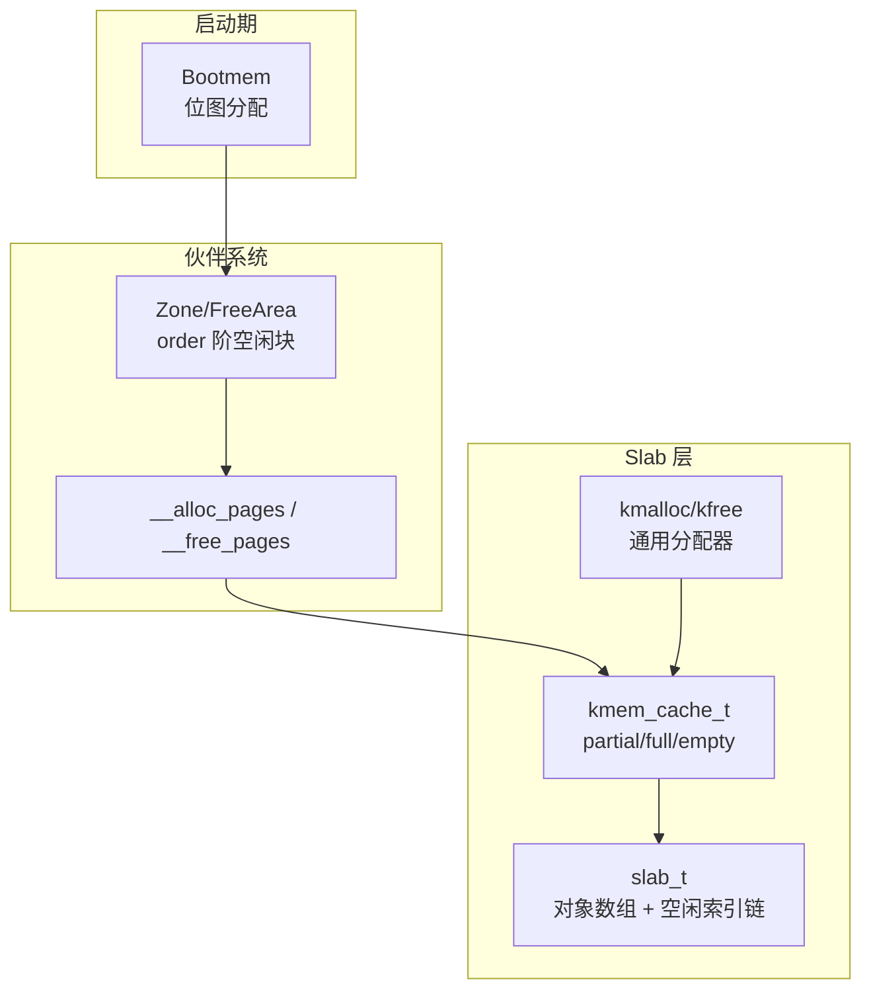
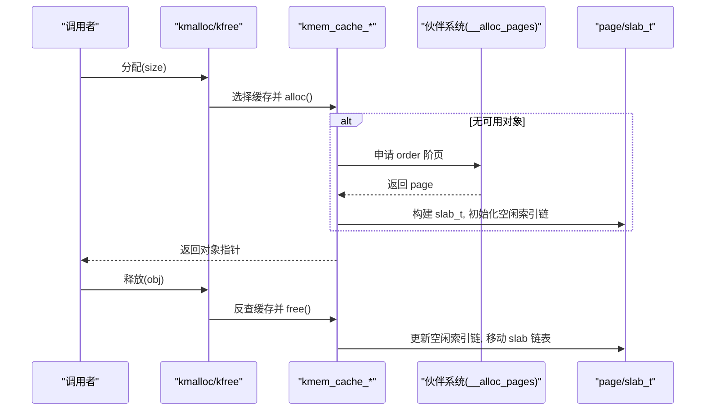
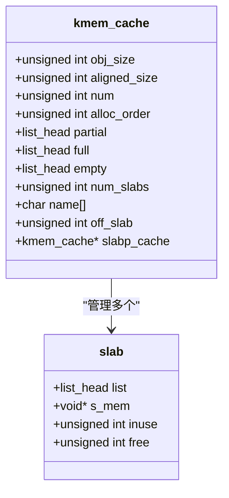
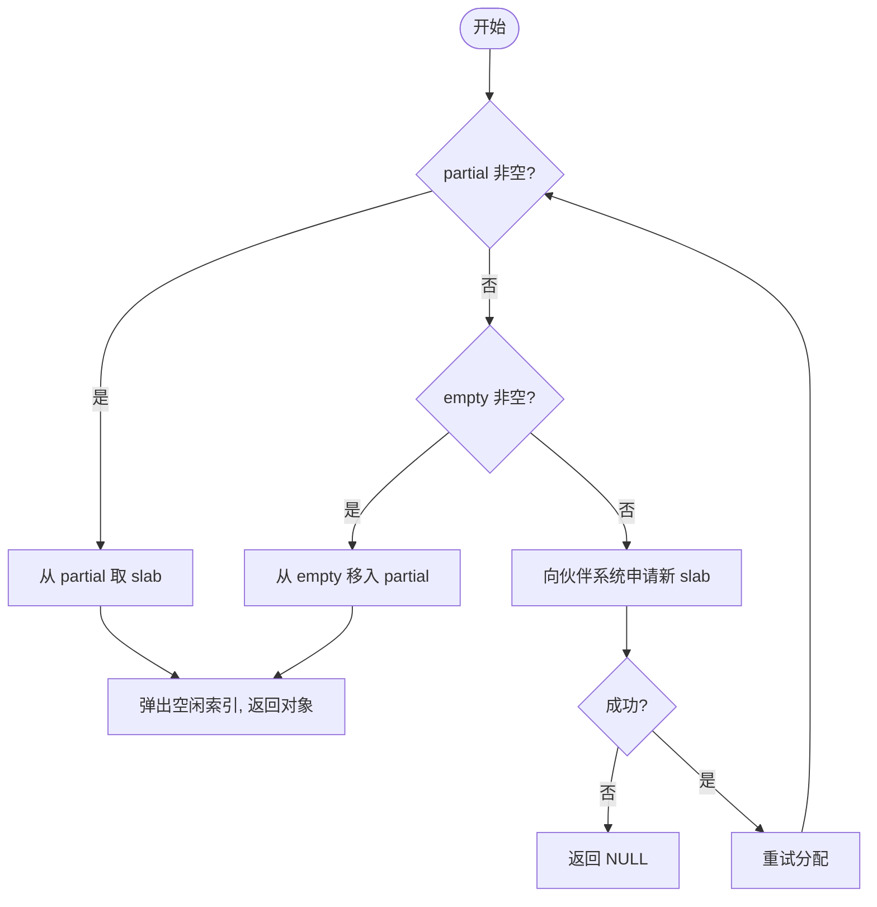
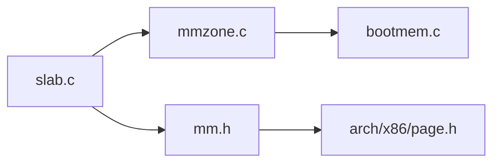

# 内存分配器

<cite>
**本文引用的文件**
- [kernel/mm/slab.c](file://kernel/mm/slab.c)
- [includes/mm/slab.h](file://includes/mm/slab.h)
- [kernel/mm/mmzone.c](file://kernel/mm/mmzone.c)
- [includes/mm/mmzone.h](file://includes/mm/mmzone.h)
- [kernel/mm/bootmem.c](file://kernel/mm/bootmem.c)
- [includes/mm/bootmem.h](file://includes/mm/bootmem.h)
- [includes/mm/mm.h](file://includes/mm/mm.h)
- [includes/arch/x86/page.h](file://includes/arch/x86/page.h)
</cite>

## 目录
1. [简介](#简介)
2. [项目结构](#项目结构)
3. [核心组件](#核心组件)
4. [架构总览](#架构总览)
5. [详细组件分析](#详细组件分析)
6. [依赖关系分析](#依赖关系分析)
7. [性能考量](#性能考量)
8. [故障排查指南](#故障排查指南)
9. [结论](#结论)
10. [附录](#附录)

## 简介
本文件为 LulaOS 的内存分配子系统提供系统化文档，重点围绕 Slab 分配器的设计原理与实现细节展开，涵盖缓存管理、对象分配/回收机制、不同大小对象的组织方式、与伙伴系统的集成（大块分配与释放）、以及性能优化策略。同时给出调优建议与自定义分配器的开发接口与最佳实践。

## 项目结构
LulaOS 的内存子系统由三层构成：
- 启动期分配器（Bootmem）：在页表与伙伴系统就绪前，使用位图进行简单分配，用于初始化内核数据结构。
- 伙伴系统（Buddy System）：基于页面粒度（order）的分配/回收，维护 free_area 链表与位图，支持合并与拆分。
- Slab 分配器：在伙伴系统之上，按对象尺寸建立缓存（cache），将多个相同大小的对象放入 slab 页中，减少碎片并提升分配速度。

图表来源
- [kernel/mm/bootmem.c:12-177](file://kernel/mm/bootmem.c#L12-L177)
- [kernel/mm/mmzone.c:248-329](file://kernel/mm/mmzone.c#L248-L329)
- [kernel/mm/slab.c:249-384](file://kernel/mm/slab.c#L249-L384)

章节来源
- [kernel/mm/bootmem.c:12-177](file://kernel/mm/bootmem.c#L12-L177)
- [kernel/mm/mmzone.c:248-329](file://kernel/mm/mmzone.c#L248-L329)
- [kernel/mm/slab.c:249-384](file://kernel/mm/slab.c#L249-L384)

## 核心组件
- Bootmem：提供 init_bootmem/free_bootmem/reserve_bootmem/__alloc_bootmem/free_all_bootmem，用于早期分配与后期回收至伙伴系统。
- 伙伴系统：通过 zone.free_area[MAX_ORDER] 维护各阶空闲块，支持从高阶块拆分到低阶分配，以及释放时尝试合并。
- Slab 分配器：以 kmem_cache_t 为单位管理同尺寸对象；每个 slab_t 描述一页对象区，内部用“空闲对象索引链”实现 O(1) 分配/回收；支持 ON_SLAB/OFF_SLAB 两种布局。
- 通用分配器 kmalloc/kfree：维护固定尺寸的缓存数组 malloc_caches[9]，按 size 选择最小满足的缓存进行分配/释放。

章节来源
- [includes/mm/bootmem.h:12-28](file://includes/mm/bootmem.h#L12-L28)
- [kernel/mm/bootmem.c:12-177](file://kernel/mm/bootmem.c#L12-L177)
- [includes/mm/mmzone.h:24-80](file://includes/mm/mmzone.h#L24-L80)
- [kernel/mm/mmzone.c:152-329](file://kernel/mm/mmzone.c#L152-L329)
- [includes/mm/slab.h:35-88](file://includes/mm/slab.h#L35-L88)
- [kernel/mm/slab.c:39-47](file://kernel/mm/slab.c#L39-L47)

## 架构总览
Slab 分配器向上提供 kmalloc/kfree 与 kmem_cache_create/alloc/free API，向下通过伙伴系统申请整页或连续多页（order）。Slab 层通过三条链表（partial/full/empty）管理 slab 页生命周期，并通过 page->virtual 字段反向定位 slab_t，从而完成对象到缓存的归属识别。

图表来源
- [kernel/mm/slab.c:518-584](file://kernel/mm/slab.c#L518-L584)
- [kernel/mm/slab.c:392-450](file://kernel/mm/slab.c#L392-L450)
- [kernel/mm/slab.c:130-199](file://kernel/mm/slab.c#L130-L199)
- [kernel/mm/mmzone.c:248-329](file://kernel/mm/mmzone.c#L248-L329)

## 详细组件分析

### Slab 分配器设计与实现
- 缓存描述符池：静态预分配 KMEM_CACHE_MAX 个 kmem_cache_t，避免“鸡生蛋”问题。
- 对象布局：每页包含一个 slab_t 头（ON_SLAB）或完全用于对象（OFF_SLAB）。对象区起始地址 s_mem，空闲对象以“下一个索引”嵌入对象头部，形成单链表，终止符为 SLAB_NULL。
- 缓存三链表：partial（有空闲）、full（全满）、empty（全空可回收）。分配优先 partial → empty → grow；释放后根据 inuse 数量在三链表间迁移。
- OFF_SLAB 策略：当对象尺寸较大（≥ PAGE_SIZE/8）且 slab 子系统已初始化时，启用 OFF_SLAB，描述符从独立的 slabp_cache（如 kmalloc-32）分配，slab 页 100% 用于对象，s_mem=页基址，保证 8KB 对齐，满足 current 宏需求。
- 增长与销毁：grow 通过伙伴系统申请 order 阶页，构造 slab_t 并初始化空闲索引链；destroy 则还原 page->virtual、清除 slab 标志并归还伙伴系统，必要时释放 slabp_cache。

图表来源
- [includes/mm/slab.h:35-88](file://includes/mm/slab.h#L35-L88)
- [kernel/mm/slab.c:249-384](file://kernel/mm/slab.c#L249-L384)

章节来源
- [kernel/mm/slab.c:9-47](file://kernel/mm/slab.c#L9-L47)
- [kernel/mm/slab.c:71-114](file://kernel/mm/slab.c#L71-L114)
- [kernel/mm/slab.c:130-238](file://kernel/mm/slab.c#L130-L238)
- [kernel/mm/slab.c:249-384](file://kernel/mm/slab.c#L249-L384)
- [kernel/mm/slab.c:392-502](file://kernel/mm/slab.c#L392-L502)

### 不同大小对象的组织
- 固定尺寸缓存：malloc_caches[9] 对应 32/64/128/256/512/1024/2048/4096/8192 字节，kmalloc 按 size 查找最小满足的缓存。
- 动态缓存：kmem_cache_create 根据 size 计算 aligned_size、alloc_order、num，并决定是否启用 OFF_SLAB。大对象（≥512B）在初始化完成后创建时会启用 OFF_SLAB，以获得更好的对齐与空间利用率。
- 页内布局：ON_SLAB 时 slab_t 占页首若干字节，随后对齐填充，再排布对象；OFF_SLAB 时 slab_t 独立分配，页全部用于对象，s_mem=页基址。

章节来源
- [kernel/mm/slab.c:39-47](file://kernel/mm/slab.c#L39-L47)
- [kernel/mm/slab.c:304-384](file://kernel/mm/slab.c#L304-L384)
- [kernel/mm/slab.c:256-296](file://kernel/mm/slab.c#L256-L296)

### 与伙伴系统的集成
- 分配流程：kmem_cache_grow 调用 __alloc_pages(gfp_mask=0, order)，获取连续页后构建 slab_t，并将 page->virtual 指向 slab_t（ON_SLAB）或描述符（OFF_SLAB），标记 PageSetSlab。
- 释放流程：kmem_slab_destroy 还原 page->virtual、PageClearSlab，调用 __free_pages(page, order)。伙伴系统在 __free_pages_ok 中尝试合并相邻块，直至无法合并或达到 MAX_ORDER。
- 区域与 zonelist：__alloc_pages 依据 gfp_mask 选择 zonelist，遍历 zone 的 free_area 从高阶到低阶查找可用块，找到后拆分至目标 order 并初始化 page 引用计数。

图表来源
- [kernel/mm/slab.c:392-450](file://kernel/mm/slab.c#L392-L450)
- [kernel/mm/slab.c:130-199](file://kernel/mm/slab.c#L130-L199)
- [kernel/mm/mmzone.c:248-329](file://kernel/mm/mmzone.c#L248-L329)

章节来源
- [kernel/mm/slab.c:130-238](file://kernel/mm/slab.c#L130-L238)
- [kernel/mm/mmzone.c:152-329](file://kernel/mm/mmzone.c#L152-L329)

### 通用分配器 kmalloc/kfree
- kmalloc：校验 size，查找最小满足的 malloc_caches[i]，调用 kmem_cache_alloc。size=THREAD_SIZE(8192) 时使用 order=1 分配 2 页，保证 8KB 对齐。
- kfree：通过 virt_to_page(obj)->virtual 反查 slab_t，再遍历 malloc_caches 匹配对象归属，调用 kmem_cache_free。

章节来源
- [kernel/mm/slab.c:518-584](file://kernel/mm/slab.c#L518-L584)

### 启动期分配器 Bootmem
- 初始化：init_bootmem 设置 min/max pfn，分配 bootmem map。
- 分配/保留：__alloc_bootmem 扫描位图寻找连续空闲页，支持 align/goal；reserve_bootmem/free_bootmem 标记位图。
- 回收：free_all_bootmem 将可用页与 bootmem map 页释放回伙伴系统。

章节来源
- [kernel/mm/bootmem.c:12-177](file://kernel/mm/bootmem.c#L12-L177)
- [kernel/mm/bootmem.c:194-223](file://kernel/mm/bootmem.c#L194-L223)

## 依赖关系分析
- Slab 依赖伙伴系统：kmem_cache_grow 通过 __alloc_pages 获取页；kmem_slab_destroy 通过 __free_pages 归还页。
- 伙伴系统依赖 Zone/FreeArea：维护 free_area[MAX_ORDER] 与位图 map，支持合并/拆分。
- 全局 page 元数据：page->flags 中的 PG_slab 用于标识 slab 页；page->virtual 用于反向定位 slab_t。
- 启动期依赖：bootmem 在伙伴系统就绪前工作，最终通过 free_all_bootmem 移交资源。

图表来源
- [kernel/mm/slab.c:1-7](file://kernel/mm/slab.c#L1-L7)
- [kernel/mm/mmzone.c:1-12](file://kernel/mm/mmzone.c#L1-L12)
- [includes/mm/mm.h:11-82](file://includes/mm/mm.h#L11-L82)
- [includes/arch/x86/page.h:39-43](file://includes/arch/x86/page.h#L39-L43)

章节来源
- [kernel/mm/slab.c:1-7](file://kernel/mm/slab.c#L1-L7)
- [kernel/mm/mmzone.c:1-12](file://kernel/mm/mmzone.c#L1-L12)
- [includes/mm/mm.h:11-82](file://includes/mm/mm.h#L11-L82)
- [includes/arch/x86/page.h:39-43](file://includes/arch/x86/page.h#L39-L43)

## 性能考量
- 分配路径优化：
  - 优先从 partial 链表分配，减少锁竞争与跨页操作。
  - 空闲对象以索引链形式嵌入对象头部，避免额外元数据开销，O(1) 分配/回收。
  - OFF_SLAB 提升大对象的空间利用率和对齐性，减少页内碎片。
- 伙伴系统优化：
  - 从高阶块拆分，降低频繁小分配带来的碎片。
  - 释放时尝试合并，提高大块可用性。
- 潜在瓶颈：
  - 全局 slab_lock 导致并发热点；在高核数场景可能成为瓶颈。
  - kfree 需遍历 malloc_caches 匹配缓存，存在线性扫描开销。
- 调优建议：
  - 合理设置对象尺寸，尽量命中固定尺寸缓存，减少跨缓存分配。
  - 对高频小对象，优先使用 kmalloc 的固定缓存；对大对象，考虑自定义缓存并启用 OFF_SLAB。
  - 若出现高锁竞争，可考虑引入 per-CPU 缓存或分片策略（需扩展 slab 层）。
  - 监控 num_slabs 与 empty 链表长度，评估是否需要调整 order 或缓存数量。

[本节为一般性指导，不直接分析具体文件]

## 故障排查指南
- OOM 告警：
  - 现象：kmem_cache_grow 打印 OOM，无法增长缓存。
  - 原因：伙伴系统无法满足 order 阶分配，或 slabp_cache（OFF_SLAB）分配失败。
  - 处理：检查系统内存压力，适当降低请求尺寸或减少缓存数量。
- 非法释放：
  - 现象：kfree 打印 not a slab object 或未找到缓存。
  - 原因：释放了非 kmalloc 分配的内存，或对象不属于任何 malloc_cache。
  - 处理：确保成对调用 kmalloc/kfree，避免越界与重复释放。
- 对齐问题：
  - 现象：current 宏异常或栈相关错误。
  - 原因：未获得 8KB 对齐的线程栈（kmalloc-8192 使用 order=1 保证对齐）。
  - 处理：确认使用 kmalloc 分配线程栈，避免手动分配导致对齐不足。

章节来源
- [kernel/mm/slab.c:130-199](file://kernel/mm/slab.c#L130-L199)
- [kernel/mm/slab.c:551-584](file://kernel/mm/slab.c#L551-L584)

## 结论
LulaOS 的内存分配器以 Bootmem 起步，经由伙伴系统提供大块分配能力，Slab 层在此基础上实现高效的小对象分配与回收。通过固定尺寸缓存、OFF_SLAB 策略与三链表管理，兼顾了性能与空间利用率。未来可在并发与 NUMA 方面进一步扩展，以提升多核与多节点环境下的吞吐与延迟表现。

[本节为总结性内容，不直接分析具体文件]

## 附录

### 自定义分配器开发接口与最佳实践
- 创建缓存：
  - 使用 kmem_cache_create(name, size) 创建专用缓存；对于大对象（≥512B），建议在 slab 子系统初始化后创建以启用 OFF_SLAB。
- 分配/释放：
  - 使用 kmem_cache_alloc(cache) 与 kmem_cache_free(cache, obj) 进行分配与回收。
- 最佳实践：
  - 尽量复用缓存，避免频繁创建/销毁。
  - 控制对象尺寸，使其落入固定尺寸缓存以减少碎片。
  - 对高频路径，尽量减少锁持有时间，避免在临界区内进行 I/O 或阻塞操作。
  - 结合统计信息（num_slabs、empty 链表长度）评估缓存规模是否合理。

章节来源
- [includes/mm/slab.h:97-144](file://includes/mm/slab.h#L97-L144)
- [kernel/mm/slab.c:249-384](file://kernel/mm/slab.c#L249-L384)
- [kernel/mm/slab.c:392-502](file://kernel/mm/slab.c#L392-L502)