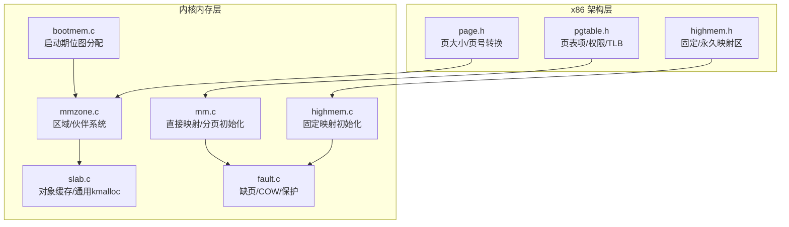
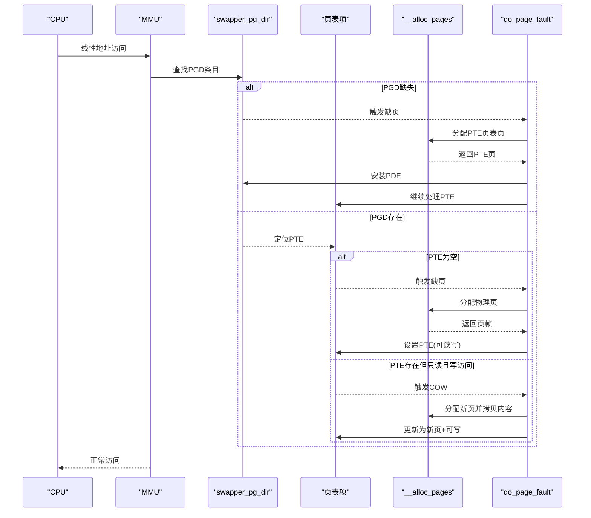
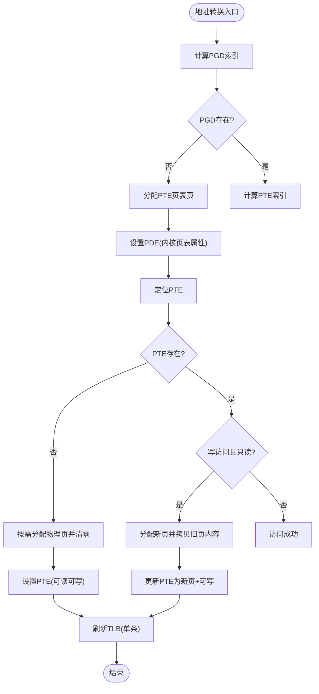
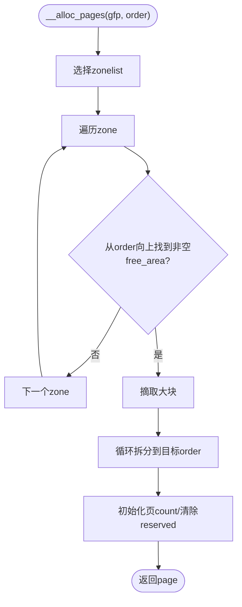
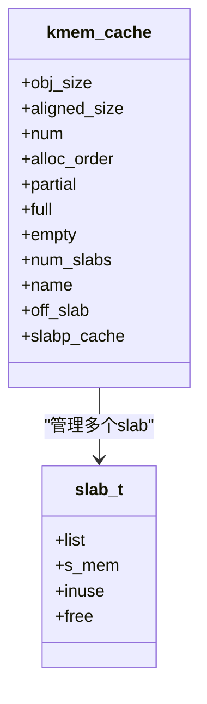
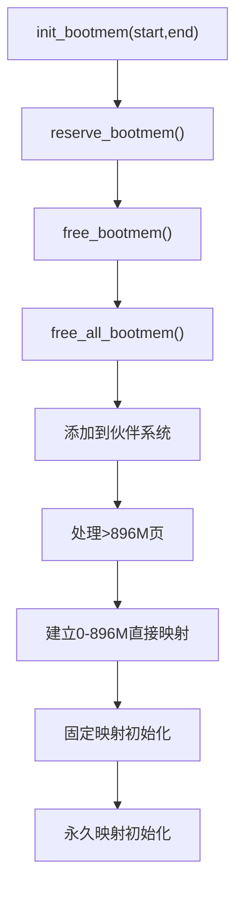
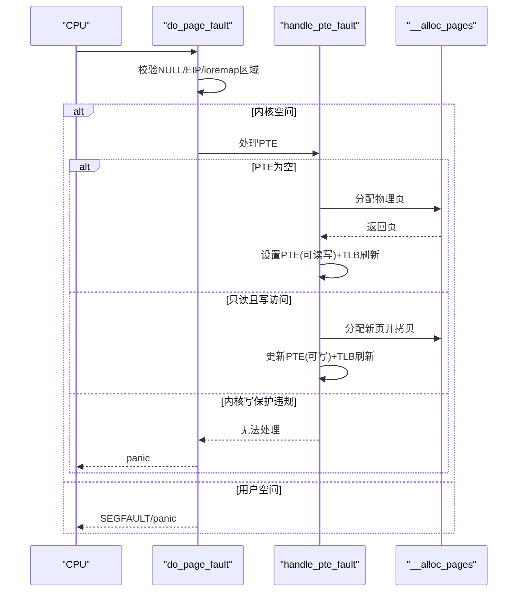
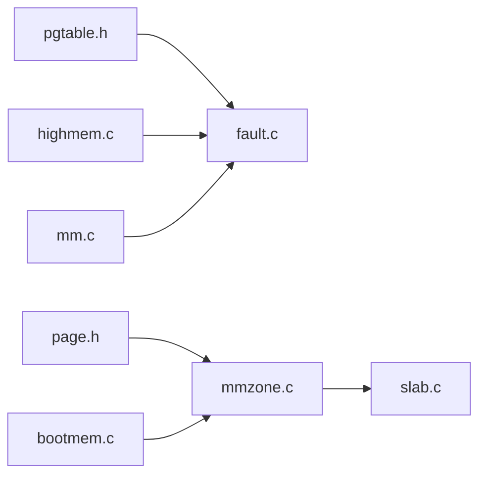
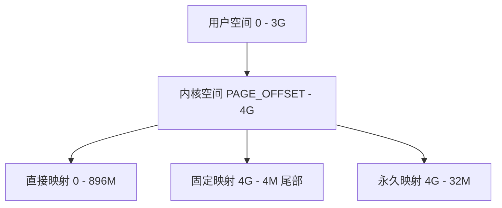
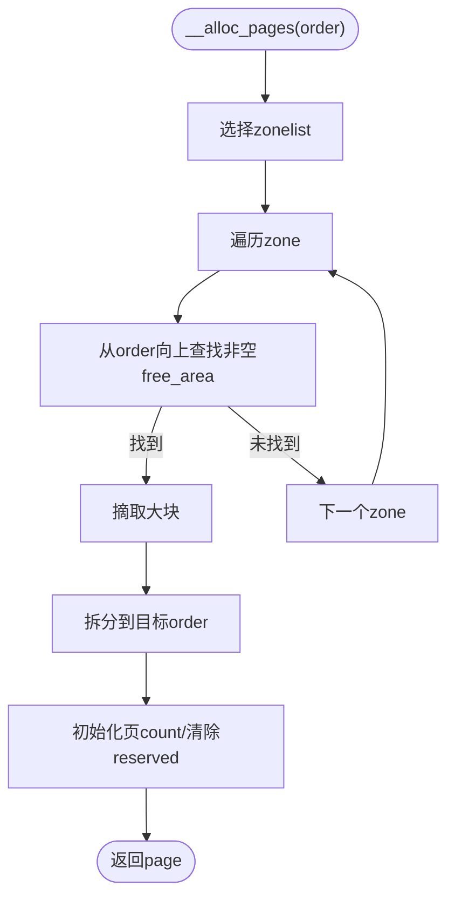

# 内存架构设计

<cite>
**本文引用的文件**
- [includes/mm/mm.h](file://includes/mm/mm.h)
- [includes/mm/mmzone.h](file://includes/mm/mmzone.h)
- [includes/mm/bootmem.h](file://includes/mm/bootmem.h)
- [includes/mm/slab.h](file://includes/mm/slab.h)
- [includes/arch/x86/page.h](file://includes/arch/x86/page.h)
- [includes/arch/x86/pgtable.h](file://includes/arch/x86/pgtable.h)
- [includes/arch/x86/highmem.h](file://includes/arch/x86/highmem.h)
- [kernel/mm/bootmem.c](file://kernel/mm/bootmem.c)
- [kernel/mm/mmzone.c](file://kernel/mm/mmzone.c)
- [kernel/mm/highmem.c](file://kernel/mm/highmem.c)
- [kernel/mm/slab.c](file://kernel/mm/slab.c)
- [arch/x86/kernel/mm/mm.c](file://arch/x86/kernel/mm/mm.c)
- [arch/x86/kernel/mm/fault.c](file://arch/x86/kernel/mm/fault.c)
</cite>

## 目录
1. [简介](#简介)
2. [项目结构](#项目结构)
3. [核心组件](#核心组件)
4. [架构总览](#架构总览)
5. [详细组件分析](#详细组件分析)
6. [依赖关系分析](#依赖关系分析)
7. [性能考量](#性能考量)
8. [故障排查指南](#故障排查指南)
9. [结论](#结论)
10. [附录](#附录)

## 简介
本设计文档面向LulaOS的内存管理子系统，系统性阐述虚拟内存管理机制、页表结构与地址转换流程、内存映射策略；深入解析伙伴系统与Slab分配器的设计与实现；说明物理内存管理、高端内存支持与内存池机制；分析内存保护与页面故障处理。文档提供内存布局图与关键算法流程图，帮助内存管理开发者快速理解并扩展系统能力。

## 项目结构
LulaOS的内存相关代码按“体系结构抽象 + 通用内核”分层组织：
- 体系结构相关（x86）：页大小、页表项、TLB操作、高端内存固定/永久映射等定义与初始化。
- 通用内核：启动期位图分配器（bootmem）、区域与伙伴系统（mmzone）、Slab对象缓存（slab）、缺页异常处理（fault）。

图表来源
- [includes/arch/x86/page.h:1-47](file://includes/arch/x86/page.h#L1-L47)
- [includes/arch/x86/pgtable.h:1-131](file://includes/arch/x86/pgtable.h#L1-L131)
- [includes/arch/x86/highmem.h:1-105](file://includes/arch/x86/highmem.h#L1-L105)
- [kernel/mm/bootmem.c:1-223](file://kernel/mm/bootmem.c#L1-L223)
- [kernel/mm/mmzone.c:1-329](file://kernel/mm/mmzone.c#L1-L329)
- [kernel/mm/slab.c:1-585](file://kernel/mm/slab.c#L1-L585)
- [kernel/mm/highmem.c:1-48](file://kernel/mm/highmem.c#L1-L48)
- [arch/x86/kernel/mm/mm.c:1-218](file://arch/x86/kernel/mm/mm.c#L1-L218)
- [arch/x86/kernel/mm/fault.c:1-290](file://arch/x86/kernel/mm/fault.c#L1-L290)

章节来源
- [arch/x86/kernel/mm/mm.c:117-134](file://arch/x86/kernel/mm/mm.c#L117-L134)
- [kernel/mm/mmzone.c:61-150](file://kernel/mm/mmzone.c#L61-L150)

## 核心组件
- 页描述符与标志：mem_map_t 表示物理页元数据，包含引用计数、标志位、所属区与内核映射指针等。
- 区域与伙伴系统：zone_struct/free_area/pdlist_data 划分DMA/Normal/HighMem区，维护多级空闲块链表与位图。
- 启动期分配器：bootmem_data_t 使用位图在低内存阶段进行简单分配/保留/释放。
- Slab分配器：kmem_cache/slab_t 提供小对象缓存与通用kmalloc/kfree，支持ON_SLAB/OFF_SLAB两种模式。
- 页表与映射：swapper_pg_dir/pgd/pte，建立0-896M直接映射、固定映射与永久映射区。
- 缺页处理：handle_pte_fault/handle_pde_fault 实现按需分配、写时复制与保护错误处理。

章节来源
- [includes/mm/mm.h:11-98](file://includes/mm/mm.h#L11-L98)
- [includes/mm/mmzone.h:24-80](file://includes/mm/mmzone.h#L24-L80)
- [includes/mm/bootmem.h:12-28](file://includes/mm/bootmem.h#L12-L28)
- [includes/mm/slab.h:45-147](file://includes/mm/slab.h#L45-L147)
- [includes/arch/x86/pgtable.h:10-131](file://includes/arch/x86/pgtable.h#L10-L131)
- [arch/x86/kernel/mm/fault.c:96-171](file://arch/x86/kernel/mm/fault.c#L96-L171)

## 架构总览
LulaOS采用两级页表（PGD→PTE），内核空间从PAGE_OFFSET开始直接映射低端物理内存（0-896M），并通过固定映射与永久映射区访问高端内存与设备寄存器。启动期通过bootmem完成早期分配，随后将可用页转入伙伴系统；Slab在伙伴系统之上提供高效的小对象分配。缺页异常根据PTE状态执行按需分配或COW，并对非法访问进行保护性停机。

图表来源
- [arch/x86/kernel/mm/fault.c:184-251](file://arch/x86/kernel/mm/fault.c#L184-L251)
- [arch/x86/kernel/mm/fault.c:96-171](file://arch/x86/kernel/mm/fault.c#L96-L171)
- [kernel/mm/mmzone.c:248-324](file://kernel/mm/mmzone.c#L248-L324)
- [includes/arch/x86/pgtable.h:93-128](file://includes/arch/x86/pgtable.h#L93-L128)

## 详细组件分析

### 虚拟内存与页表结构
- 两级页表：PGD索引与PTE索引由地址高位与低位决定，PTE包含存在位、读写位、用户位、脏位、访问位等属性。
- 直接映射：内核启动时建立0-896M的直接映射，便于内核以虚拟地址直接访问低端物理内存。
- 固定/永久映射：固定映射区位于高地址尾部，用于临时映射；永久映射区用于长期映射高端内存或设备IO。

图表来源
- [includes/arch/x86/pgtable.h:93-128](file://includes/arch/x86/pgtable.h#L93-L128)
- [arch/x86/kernel/mm/fault.c:96-171](file://arch/x86/kernel/mm/fault.c#L96-L171)

章节来源
- [arch/x86/kernel/mm/mm.c:24-53](file://arch/x86/kernel/mm/mm.c#L24-L53)
- [arch/x86/kernel/mm/mm.c:83-107](file://arch/x86/kernel/mm/mm.c#L83-L107)
- [includes/arch/x86/pgtable.h:24-63](file://includes/arch/x86/pgtable.h#L24-L63)

### 伙伴系统（Buddy Allocator）
- 区域划分：DMA(<16M)、Normal(16M-896M)、HighMem(>896M)。每个区维护MAX_ORDER级空闲块链表与位图。
- 分配流程：从目标阶向上查找空闲块，若找到则拆分至目标阶，并初始化返回页的引用计数与保留标志。
- 回收流程：将页加入对应阶的空闲链表，尝试与伙伴合并直至无法合并或达到最大阶。

图表来源
- [kernel/mm/mmzone.c:248-324](file://kernel/mm/mmzone.c#L248-L324)

章节来源
- [kernel/mm/mmzone.c:152-219](file://kernel/mm/mmzone.c#L152-L219)
- [kernel/mm/mmzone.c:248-324](file://kernel/mm/mmzone.c#L248-L324)
- [includes/mm/mmzone.h:24-80](file://includes/mm/mmzone.h#L24-L80)

### Slab分配器
- 设计要点：kmem_cache为对象缓存，slab_t为单个页内对象容器；支持ON_SLAB（描述符嵌入页首）与OFF_SLAB（描述符独立分配，页全用于对象）。
- 分配路径：优先partial链表，其次empty链表，最后grow申请新slab页；分配后若满则移入full链表。
- 释放路径：通过virt_to_page反查slab描述符，将对象推回空闲链表，并根据占用情况调整链表归属。

图表来源
- [includes/mm/slab.h:45-88](file://includes/mm/slab.h#L45-L88)
- [kernel/mm/slab.c:130-199](file://kernel/mm/slab.c#L130-L199)

章节来源
- [kernel/mm/slab.c:249-296](file://kernel/mm/slab.c#L249-L296)
- [kernel/mm/slab.c:392-450](file://kernel/mm/slab.c#L392-L450)
- [kernel/mm/slab.c:459-502](file://kernel/mm/slab.c#L459-L502)
- [kernel/mm/slab.c:518-585](file://kernel/mm/slab.c#L518-L585)

### 物理内存管理与高端内存支持
- 启动期：bootmem用位图管理低内存，预留内核与数据结构所需区域，之后将可用页转入伙伴系统。
- 低端映射：paging_init建立0-896M直接映射，使内核能以虚拟地址直接访问低端物理内存。
- 高端内存：HighMem页标记PG_highmem，通过固定/永久映射区进行临时或长期访问。

图表来源
- [kernel/mm/bootmem.c:12-28](file://kernel/mm/bootmem.c#L12-L28)
- [kernel/mm/bootmem.c:194-223](file://kernel/mm/bootmem.c#L194-L223)
- [arch/x86/kernel/mm/mm.c:117-134](file://arch/x86/kernel/mm/mm.c#L117-L134)
- [kernel/mm/highmem.c:43-48](file://kernel/mm/highmem.c#L43-L48)

章节来源
- [kernel/mm/bootmem.c:76-177](file://kernel/mm/bootmem.c#L76-L177)
- [arch/x86/kernel/mm/mm.c:145-205](file://arch/x86/kernel/mm/mm.c#L145-L205)
- [includes/arch/x86/highmem.h:19-67](file://includes/arch/x86/highmem.h#L19-L67)

### 内存保护与页面故障处理
- 保护机制：PTE中的用户位、读写位、存在位控制访问权限；内核态对只读页写访问视为保护违规。
- 按需分配：PTE为空时分配物理页并建立映射，避免启动时预分配所有页。
- 写时复制：PTE存在且只读，写访问时分配新页并拷贝内容，更新PTE为可写。
- 错误处理：对ioremap区域或非法访问进行panic，打印寄存器现场并停机。

图表来源
- [arch/x86/kernel/mm/fault.c:184-251](file://arch/x86/kernel/mm/fault.c#L184-L251)
- [arch/x86/kernel/mm/fault.c:96-171](file://arch/x86/kernel/mm/fault.c#L96-L171)

章节来源
- [arch/x86/kernel/mm/fault.c:67-70](file://arch/x86/kernel/mm/fault.c#L67-L70)
- [arch/x86/kernel/mm/fault.c:182-251](file://arch/x86/kernel/mm/fault.c#L182-L251)

## 依赖关系分析
- 页表与地址转换依赖x86页表宏与TLB操作，配合直接映射与固定/永久映射区。
- 伙伴系统依赖区域初始化与位图管理，为上层分配器提供物理页。
- Slab依赖伙伴系统获取页，并在页内组织对象链表；kmalloc基于固定大小缓存。
- 缺页处理依赖页表项属性判断与伙伴系统分配，必要时触发COW。

图表来源
- [includes/arch/x86/pgtable.h:1-131](file://includes/arch/x86/pgtable.h#L1-L131)
- [includes/arch/x86/page.h:1-47](file://includes/arch/x86/page.h#L1-L47)
- [kernel/mm/bootmem.c:1-223](file://kernel/mm/bootmem.c#L1-L223)
- [kernel/mm/mmzone.c:1-329](file://kernel/mm/mmzone.c#L1-L329)
- [kernel/mm/slab.c:1-585](file://kernel/mm/slab.c#L1-L585)
- [kernel/mm/highmem.c:1-48](file://kernel/mm/highmem.c#L1-L48)
- [arch/x86/kernel/mm/mm.c:1-218](file://arch/x86/kernel/mm/mm.c#L1-L218)
- [arch/x86/kernel/mm/fault.c:1-290](file://arch/x86/kernel/mm/fault.c#L1-L290)

章节来源
- [kernel/mm/mmzone.c:21-59](file://kernel/mm/mmzone.c#L21-L59)
- [kernel/mm/slab.c:130-199](file://kernel/mm/slab.c#L130-L199)
- [arch/x86/kernel/mm/fault.c:184-251](file://arch/x86/kernel/mm/fault.c#L184-L251)

## 性能考量
- 伙伴系统：通过多级空闲块与位图减少碎片，分配/回收复杂度近似O(log N)，适合大页分配。
- Slab分配器：对象缓存减少频繁分配开销，ON_SLAB/OFF_SLAB平衡描述符与对象空间；kmalloc固定大小缓存提升命中率。
- 缺页处理：按需分配避免启动开销，COW降低共享只读页的复制成本；TLB局部刷新减少同步开销。
- 高端内存：固定/永久映射减少频繁映射/解映射，提高设备IO与高层内存访问效率。

[本节为通用指导，不直接分析具体文件]

## 故障排查指南
- 缺页异常：检查CR2地址是否落在ioremap区域；确认PGD/PTE是否存在；验证PTE权限与写保护逻辑。
- 分配失败：查看伙伴系统zonelist与free_area是否为空；确认GFP标志与order是否合理；检查SLAB增长是否触发OOM。
- 高端内存访问：确认固定/永久映射已正确初始化；检查set_fixmap与pkmap_page_table配置。
- 保护违规：核对PTE的用户位与读写位；内核态写只读页应视为BUG并记录现场。

章节来源
- [arch/x86/kernel/mm/fault.c:67-70](file://arch/x86/kernel/mm/fault.c#L67-L70)
- [arch/x86/kernel/mm/fault.c:184-251](file://arch/x86/kernel/mm/fault.c#L184-L251)
- [kernel/mm/mmzone.c:248-324](file://kernel/mm/mmzone.c#L248-L324)
- [kernel/mm/slab.c:130-199](file://kernel/mm/slab.c#L130-L199)
- [kernel/mm/highmem.c:43-48](file://kernel/mm/highmem.c#L43-L48)

## 结论
LulaOS的内存架构以两级页表为核心，结合启动期位图分配器、区域化伙伴系统与Slab对象缓存，实现了高效的物理内存管理与灵活的虚拟内存映射。高端内存通过固定/永久映射区得到支持，缺页处理提供按需分配与写时复制，保障系统稳定性与性能。该设计为后续扩展（如NUMA、更细粒度LRU、高级保护机制）奠定了坚实基础。

[本节为总结，不直接分析具体文件]

## 附录

### 内存布局图（概念性）

[此图为概念示意，不对应具体源码结构]

### 分配算法流程图（伙伴系统）

图表来源
- [kernel/mm/mmzone.c:248-324](file://kernel/mm/mmzone.c#L248-L324)