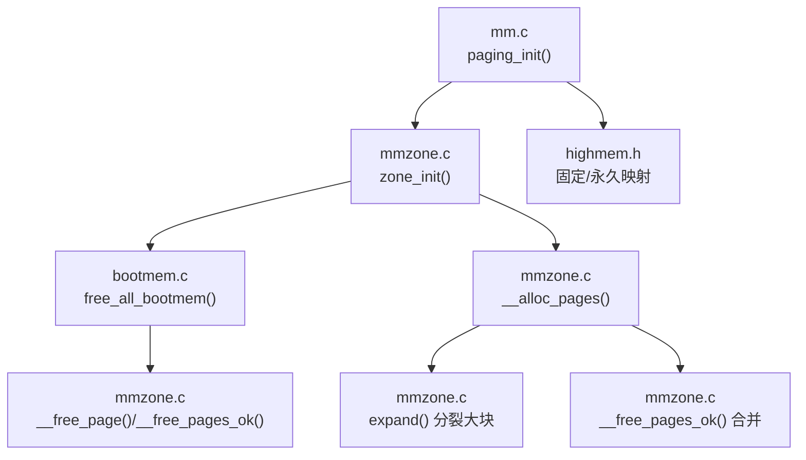
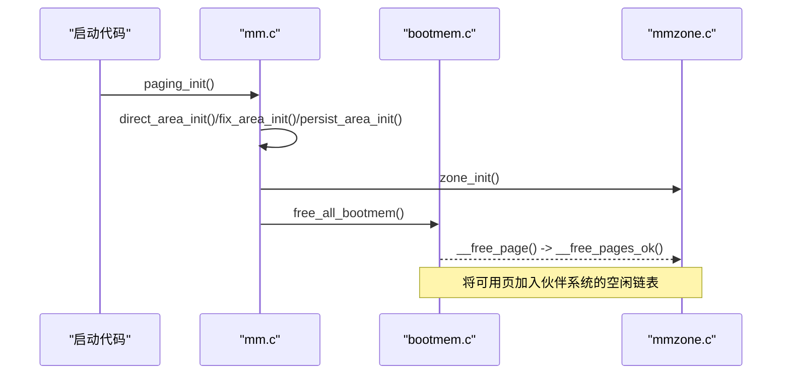
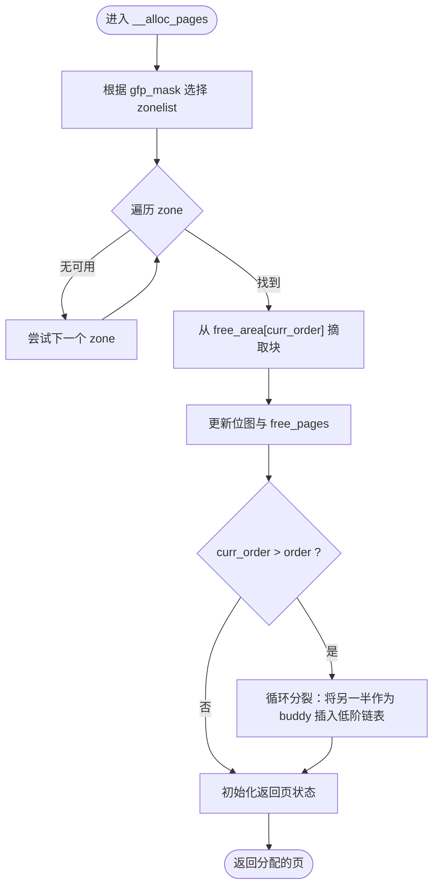
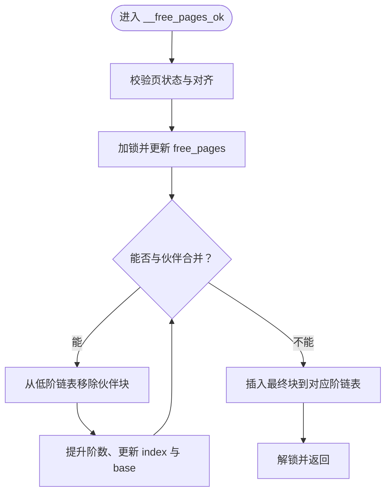
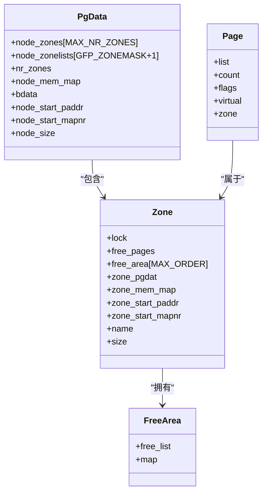
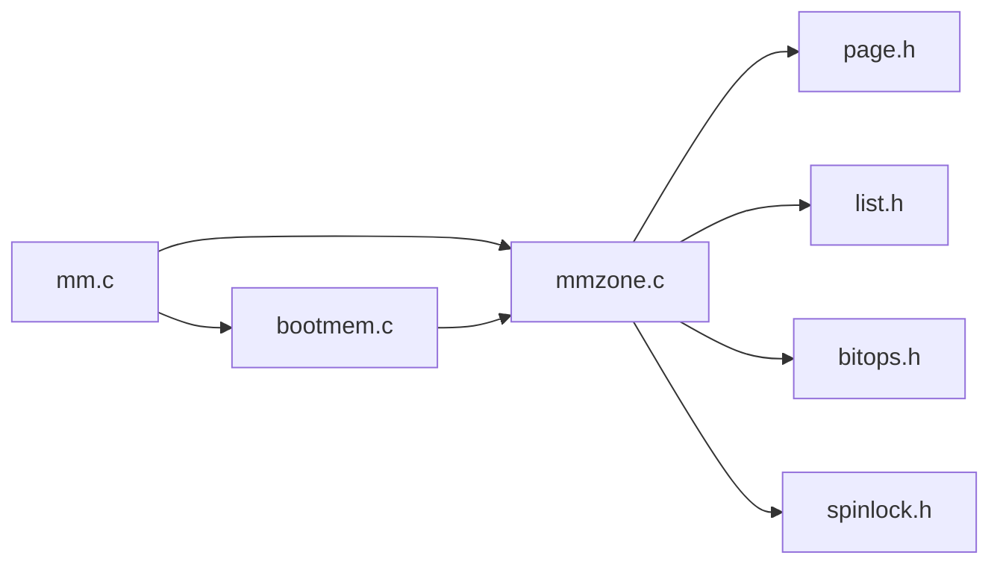
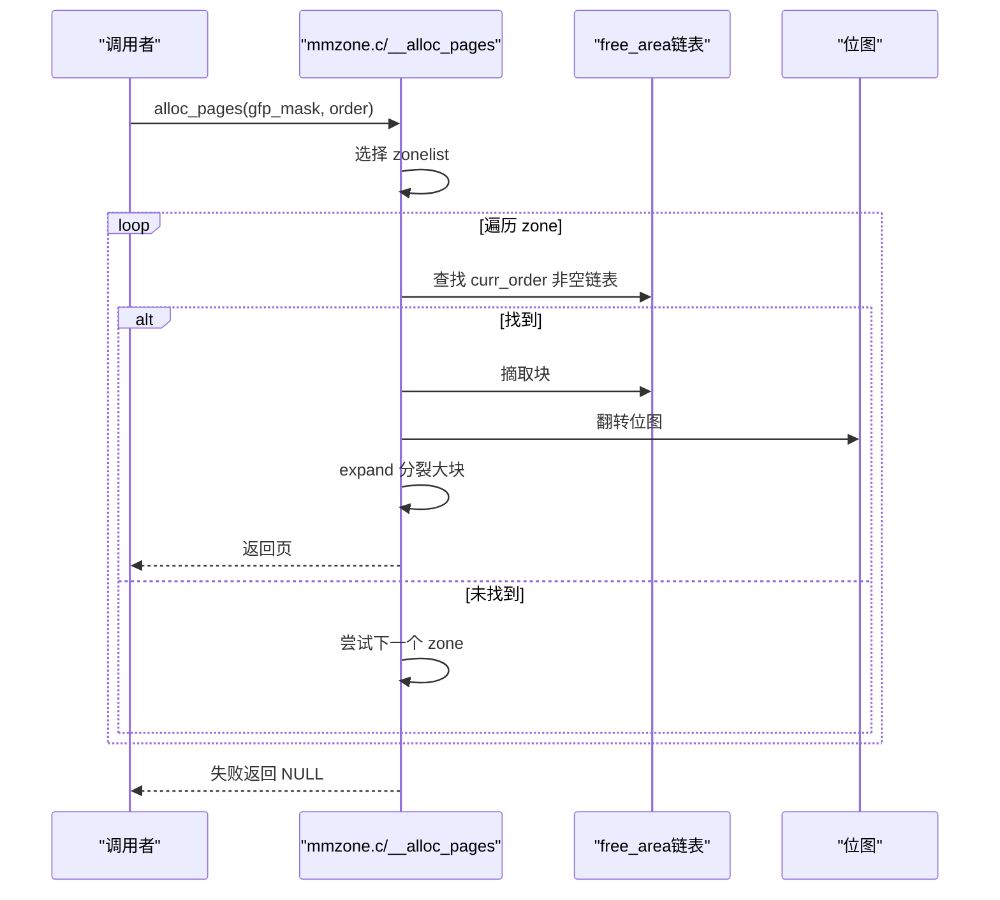
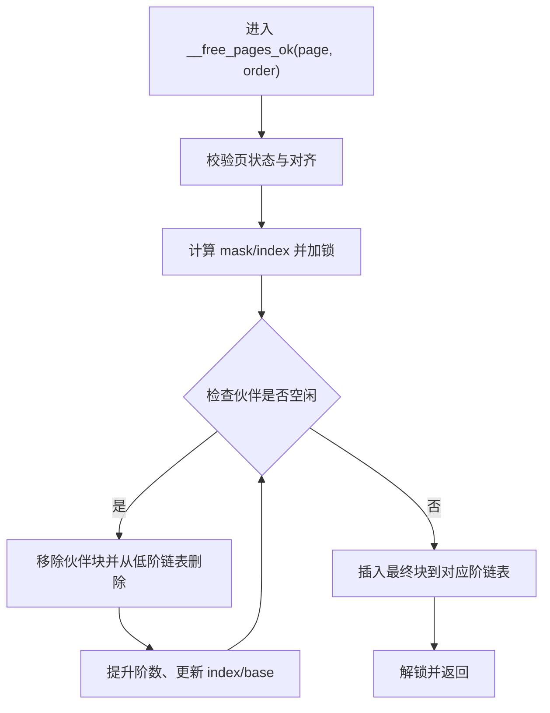

# 伙伴系统

<cite>
**本文引用的文件**
- [mmzone.h](file://includes/mm/mmzone.h)
- [mmzone.c](file://kernel/mm/mmzone.c)
- [bootmem.h](file://includes/mm/bootmem.h)
- [bootmem.c](file://kernel/mm/bootmem.c)
- [mm.h](file://includes/mm/mm.h)
- [page.h](file://includes/arch/x86/page.h)
- [highmem.h](file://includes/arch/x86/highmem.h)
- [mm.c](file://arch/x86/kernel/mm/mm.c)
</cite>

## 目录
1. [简介](#简介)
2. [项目结构](#项目结构)
3. [核心组件](#核心组件)
4. [架构总览](#架构总览)
5. [详细组件分析](#详细组件分析)
6. [依赖关系分析](#依赖关系分析)
7. [性能考虑](#性能考虑)
8. [故障诊断指南](#故障诊断指南)
9. [结论](#结论)
10. [附录](#附录)

## 简介
本文件为LulaOS的伙伴系统（Buddy System）提供系统化文档。内容涵盖：
- 伙伴系统算法的核心原理：内存块大小分级、伙伴关系的数学定义与合并策略
- 空闲链表数据结构设计：不同阶数的空闲块管理与位图元数据维护
- 内存分配流程：从GFP掩码选择zonelist，到最佳适配、边界伙伴查找与块分裂
- 内存释放机制：伙伴查找、递归合并与碎片整理
- 内存区域划分与管理：ZONE_DMA、ZONE_NORMAL、ZONE_HIGHMEM的职责与初始化
- 时序图与流程图：分配与合并的关键路径可视化
- 性能优化建议与故障诊断方法

## 项目结构
LulaOS将内存管理分为启动期分配器（bootmem）与运行时伙伴系统（buddy）。关键文件职责如下：
- includes/mm/mmzone.h：定义zone、free_area、MAX_ORDER、GFP标志等核心结构
- kernel/mm/mmzone.c：实现zone_init、__alloc_pages、__free_pages等核心逻辑
- includes/mm/bootmem.h / kernel/mm/bootmem.c：启动期位图分配器，负责早期分配并在后期移交至伙伴系统
- includes/mm/mm.h：page结构体、页标志宏、引用计数操作
- includes/arch/x86/page.h：页大小、页号转换、虚拟/物理地址转换
- includes/arch/x86/highmem.h：高端内存、固定映射、永久映射相关接口
- arch/x86/kernel/mm/mm.c：页表初始化、direct/fixed/persist区建立、zone_init调用、mm_init中回收bootmem并加入伙伴系统

图表来源
- [mm.c:117-134](file://arch/x86/kernel/mm/mm.c#L117-L134)
- [mmzone.c:61-150](file://kernel/mm/mmzone.c#L61-L150)
- [bootmem.c:194-223](file://kernel/mm/bootmem.c#L194-L223)
- [mmzone.c:248-329](file://kernel/mm/mmzone.c#L248-L329)

章节来源
- [mm.c:117-134](file://arch/x86/kernel/mm/mm.c#L117-L134)
- [mmzone.c:61-150](file://kernel/mm/mmzone.c#L61-L150)
- [bootmem.c:194-223](file://kernel/mm/bootmem.c#L194-L223)

## 核心组件
- 页面描述符 page：包含引用计数、标志位、所属zone、虚拟地址等
- 管理区 zone：每个zone维护free_pages计数、free_area数组（每阶一个空闲链表+位图）、起始物理地址和映射偏移
- free_area：每阶对应一个空闲链表和一个位图，用于快速判断某块是否空闲
- 节点 pg_data_t：包含node_zones、node_zonelists、node_mem_map等
- 启动期分配器 bootmem：使用位图在低内存进行早期分配，最终移交伙伴系统

章节来源
- [mm.h:11-18](file://includes/mm/mm.h#L11-L18)
- [mmzone.h:24-69](file://includes/mm/mmzone.h#L24-L69)
- [bootmem.h:12-27](file://includes/mm/bootmem.h#L12-L27)

## 架构总览
LulaOS采用“启动期位图分配器 + 运行时伙伴系统”的两阶段设计：
- 启动期：通过bootmem在低内存快速分配内核所需结构，使用位图记录占用
- 运行期：完成页表与直接映射后，将可用页全部转入伙伴系统，按阶组织空闲块，支持高效分配与合并

图表来源
- [mm.c:117-134](file://arch/x86/kernel/mm/mm.c#L117-L134)
- [bootmem.c:194-223](file://kernel/mm/bootmem.c#L194-L223)
- [mmzone.c:61-150](file://kernel/mm/mmzone.c#L61-L150)

## 详细组件分析

### 内存区域划分与管理（ZONE_DMA、ZONE_NORMAL、ZONE_HIGHMEM）
- 区域定义：
  - ZONE_DMA：DMA专用区，上限由MAX_DMA_ADDRESS决定（约16M）
  - ZONE_NORMAL：常规内核可寻址区（16M~896M）
  - ZONE_HIGHMEM：高端内存区（>896M），需特殊映射访问
- 初始化过程：
  - 计算各zone大小并设置zone->size、name、zone_pgdat等
  - 为每个zone分配free_area数组，除最高阶外均分配位图map
  - 构建zonelist，根据GFP掩码选择优先zone顺序
- 页表与映射：
  - direct_area_init建立0~896M的直接映射
  - fix_area_init建立固定映射区（如APIC、临时kmap）
  - persist_area_init建立永久映射区（PKMAP）

章节来源
- [mmzone.h:11-16](file://includes/mm/mmzone.h#L11-L16)
- [mmzone.c:21-59](file://kernel/mm/mmzone.c#L21-L59)
- [mmzone.c:61-150](file://kernel/mm/mmzone.c#L61-L150)
- [mm.c:24-134](file://arch/x86/kernel/mm/mm.c#L24-L134)
- [highmem.h:19-67](file://includes/arch/x86/highmem.h#L19-L67)

### 空闲链表与位图元数据
- free_area结构：
  - free_list：该阶的空闲块双向链表
  - map：位图，标记该阶各块是否空闲；最高阶无需位图
- 位图索引计算：
  - 对于order阶，位图粒度为2^order个页，索引=页基址偏移>>(1+order)
- 初始化：
  - 遍历每个zone，为order<MAX_ORDER-1分配位图，对齐长度
  - 所有free_list初始化为空

章节来源
- [mmzone.h:24-27](file://includes/mm/mmzone.h#L24-L27)
- [mmzone.c:134-147](file://kernel/mm/mmzone.c#L134-L147)

### 内存分配流程（__alloc_pages）
- 步骤概览：
  1) 根据gfp_mask选择zonelist（优先zone顺序）
  2) 遍历zonelist中的zone，从目标order向上查找非空free_list
  3) 找到后摘取块，更新位图与free_pages计数
  4) expand：若curr_order>order，将剩余一半作为buddy插入低阶空闲链表
  5) 初始化返回块的page状态（清除保留、设置引用计数）
- 复杂度：
  - 查找：O(MAX_ORDER)
  - 分裂：O(curr_order - order)
  - 整体近似常数时间（MAX_ORDER固定且较小）

图表来源
- [mmzone.c:248-329](file://kernel/mm/mmzone.c#L248-L329)

章节来源
- [mmzone.c:248-329](file://kernel/mm/mmzone.c#L248-L329)

### 内存释放机制（__free_pages_ok）
- 步骤概览：
  1) 校验页未锁定、不在LRU列表、未被激活
  2) 计算当前order对应的mask与index，验证对齐
  3) 加锁后更新free_pages计数
  4) 循环尝试与伙伴合并：
     - 检查伙伴是否空闲（位图测试）
     - 计算伙伴基址（异或-mas k）
     - 从低阶链表移除伙伴块
     - 提升阶数、右移位图索引、对齐块起始索引
  5) 将最终块插入对应阶空闲链表头部
- 复杂度：
  - 合并最多循环MAX_ORDER次，近似常数时间

图表来源
- [mmzone.c:153-219](file://kernel/mm/mmzone.c#L153-L219)

章节来源
- [mmzone.c:153-219](file://kernel/mm/mmzone.c#L153-L219)

### 启动期到伙伴系统的移交（free_all_bootmem）
- 作用：将bootmem位图中可用的页转为伙伴系统管理的空闲页
- 过程：
  1) 遍历0~896M范围，若位为0则视为可用
  2) 清除保留标志、设置引用计数、调用__free_page加入伙伴系统
  3) 释放bootmem位图页本身，同样加入伙伴系统
- 结果：伙伴系统接管低端内存，后续分配/释放走buddy路径

章节来源
- [bootmem.c:194-223](file://kernel/mm/bootmem.c#L194-L223)

### 类关系与数据结构

图表来源
- [mm.h:11-18](file://includes/mm/mm.h#L11-L18)
- [mmzone.h:24-69](file://includes/mm/mmzone.h#L24-L69)

## 依赖关系分析
- mm.c依赖：
  - bootmem：用于早期分配与移交
  - mmzone：调用zone_init，最终由mm_init触发free_all_bootmem
  - highmem：建立固定/永久映射
- mmzone.c依赖：
  - page.h：页大小、地址转换
  - bitops：位操作（测试/翻转位）
  - list：双向链表操作
  - spinlock：并发保护
- bootmem.c依赖：
  - mmzone：最终调用__free_page将可用页交给伙伴系统

图表来源
- [mm.c:1-10](file://arch/x86/kernel/mm/mm.c#L1-L10)
- [mmzone.c:1-12](file://kernel/mm/mmzone.c#L1-L12)
- [bootmem.c:1-6](file://kernel/mm/bootmem.c#L1-L6)

章节来源
- [mm.c:1-10](file://arch/x86/kernel/mm/mm.c#L1-L10)
- [mmzone.c:1-12](file://kernel/mm/mmzone.c#L1-L12)
- [bootmem.c:1-6](file://kernel/mm/bootmem.c#L1-L6)

## 性能考虑
- 分配路径优化：
  - 从目标order向上查找，避免全量扫描
  - 使用位图快速判定空闲，减少链表遍历
  - 分裂时仅处理必要阶数，降低开销
- 释放路径优化：
  - 合并循环次数受MAX_ORDER限制，常数级
  - 位图原子操作保证并发安全
- 区域优先级：
  - 通过zonelist控制优先zone，减少跨zone分配带来的碎片
- 建议：
  - 合理设置GFP掩码，尽量在合适zone分配，避免不必要的跨区
  - 对高频小对象分配，可在上层引入slab分配器以减少频繁buddy调用
  - 监控free_pages与高阶空闲块数量，评估碎片程度

[本节为通用性能指导，不直接分析具体文件]

## 故障诊断指南
- 常见问题定位：
  - 分配失败：检查zonelist配置与各zone的free_area是否为空
  - 释放无效：确认页未锁定、不在LRU、未被激活；检查order对齐与位图一致性
  - 合并异常：验证伙伴索引计算与位图测试逻辑
- 调试手段：
  - 打印zone名称与free_pages，观察分配/释放前后变化
  - 检查位图位是否正确翻转（分配置位、释放清零）
  - 在高阶free_list为空时，确认是否存在足够大的连续块
- 日志参考：
  - 分配失败输出：包含order信息，便于定位需求大小
  - 启动统计：available/reserved/highmem大小，辅助判断区域划分

章节来源
- [mmzone.c:321-323](file://kernel/mm/mmzone.c#L321-L323)
- [mmzone.c:153-219](file://kernel/mm/mmzone.c#L153-L219)
- [mm.c:192-201](file://arch/x86/kernel/mm/mm.c#L192-L201)

## 结论
LulaOS的伙伴系统通过清晰的zone划分、高效的free_area结构与位图元数据，实现了稳定的内存分配与释放。启动期bootmem与运行期buddy的协作，确保了内核早期与后期的内存管理需求。配合合理的GFP策略与监控，可在多场景下获得良好性能与稳定性。

[本节为总结性内容，不直接分析具体文件]

## 附录

### 分配时序图（__alloc_pages）

图表来源
- [mmzone.c:248-329](file://kernel/mm/mmzone.c#L248-L329)

### 合并流程图（__free_pages_ok）

图表来源
- [mmzone.c:153-219](file://kernel/mm/mmzone.c#L153-L219)