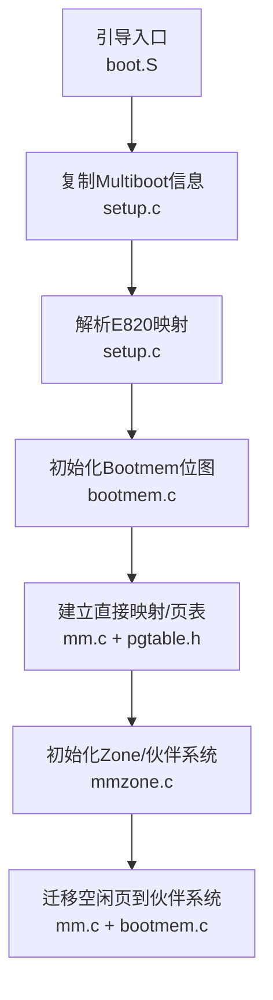
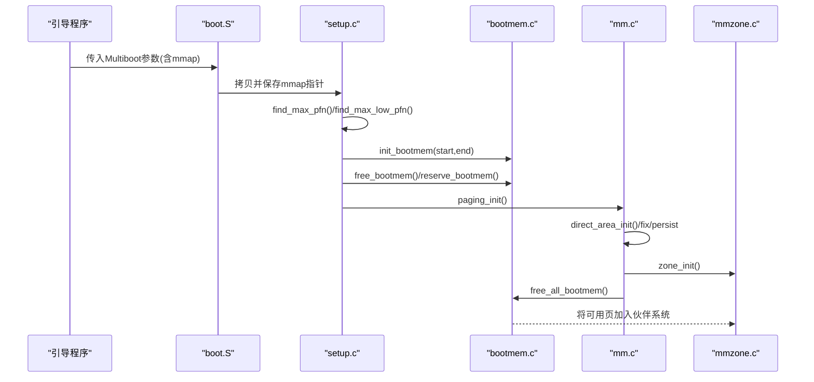
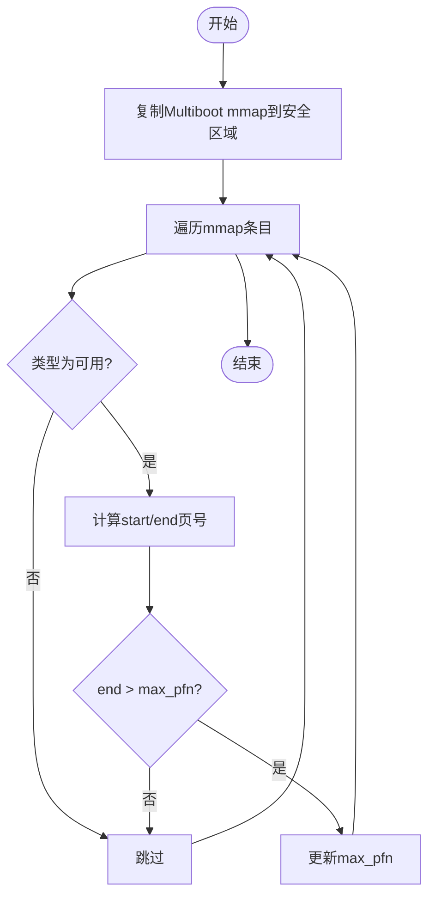
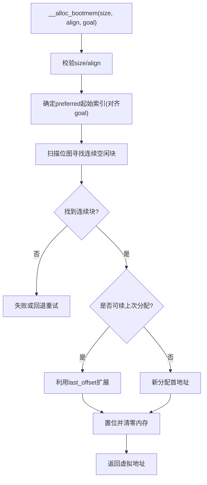
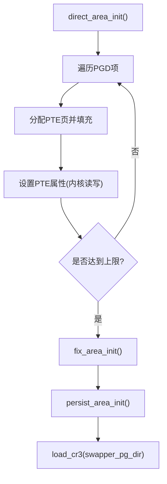
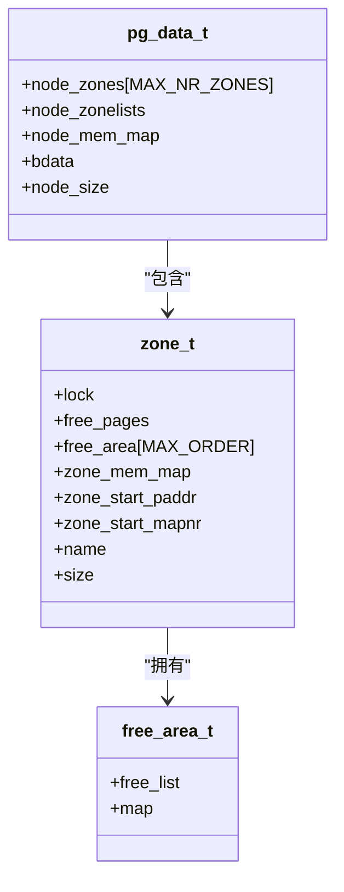
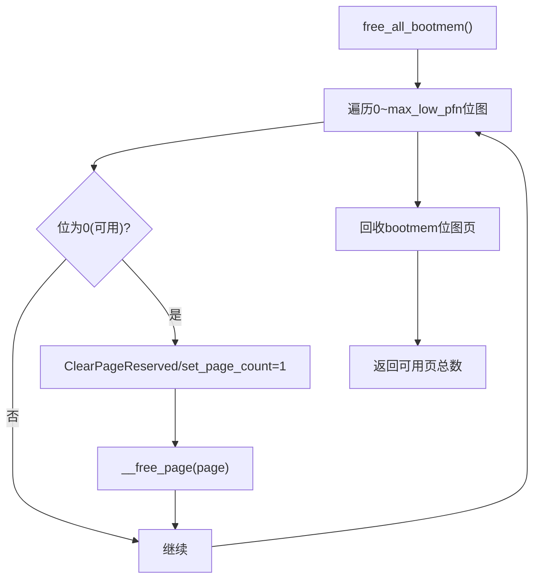
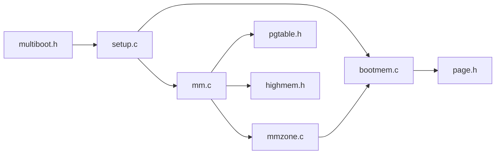
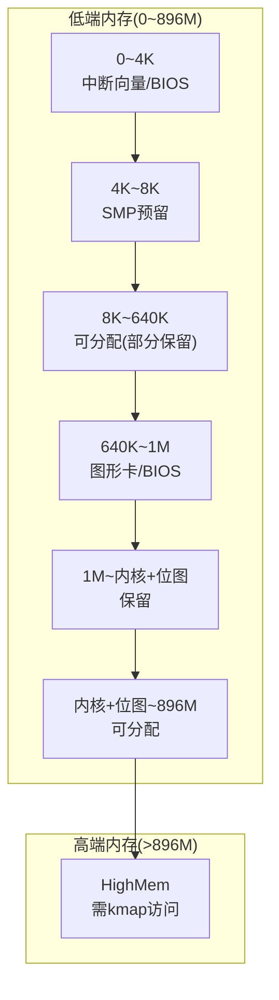
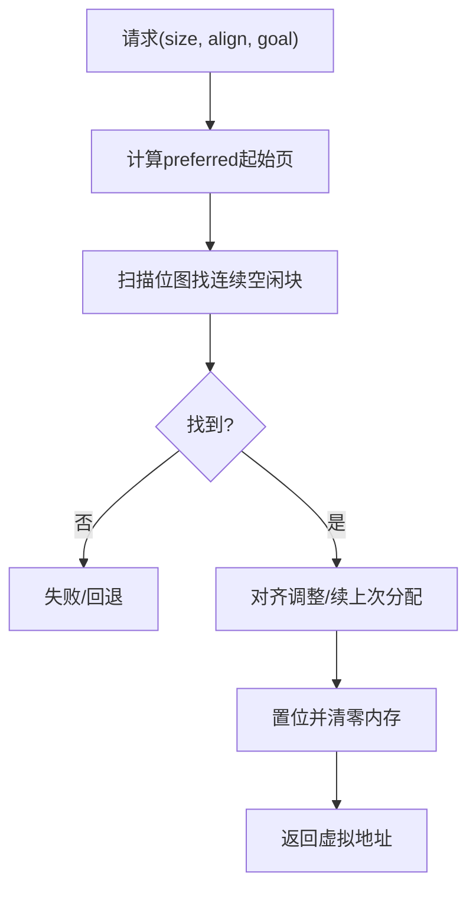

# 引导内存管理器

<cite>
**本文引用的文件**
- [arch/x86/boot/boot.S](file://arch/x86/boot/boot.S)
- [includes/arch/x86/boot/multiboot.h](file://includes/arch/x86/boot/multiboot.h)
- [arch/x86/kernel/setup.c](file://arch/x86/kernel/setup.c)
- [kernel/mm/bootmem.c](file://kernel/mm/bootmem.c)
- [includes/mm/bootmem.h](file://includes/mm/bootmem.h)
- [kernel/mm/mmzone.c](file://kernel/mm/mmzone.c)
- [includes/mm/mmzone.h](file://includes/mm/mmzone.h)
- [arch/x86/kernel/mm/mm.c](file://arch/x86/kernel/mm/mm.c)
- [includes/arch/x86/page.h](file://includes/arch/x86/page.h)
- [includes/arch/x86/pgtable.h](file://includes/arch/x86/pgtable.h)
- [includes/arch/x86/highmem.h](file://includes/arch/x86/highmem.h)
</cite>

## 目录
1. [简介](#简介)
2. [项目结构](#项目结构)
3. [核心组件](#核心组件)
4. [架构总览](#架构总览)
5. [详细组件分析](#详细组件分析)
6. [依赖关系分析](#依赖关系分析)
7. [性能考虑](#性能考虑)
8. [故障排查指南](#故障排查指南)
9. [结论](#结论)
10. [附录](#附录)

## 简介
本文件为LulaOS的“引导内存管理器”提供系统化、可操作的文档。内容覆盖：
- 引导阶段内存检测机制：通过Multiboot协议获取E820内存映射，解析并分类可用/保留区域。
- 引导内存分配器实现：位图数据结构设计、连续页面分配算法与对齐处理。
- 保留区域标记机制：内核代码段、数据段、页表等关键区域的保护策略。
- 内存释放流程：从引导内存到伙伴系统的迁移过程。
- 配套图示：内存布局图、分配流程图。
- 调试技巧与常见问题解决方案。

## 项目结构
围绕引导内存管理的关键源码分布在以下模块：
- 引导入口与Multiboot信息传递：boot.S、multiboot.h
- 系统初始化与内存拓扑发现：setup.c
- 引导期分配器（Bootmem）：bootmem.c、bootmem.h
- 伙伴系统与内存区（Zone）：mmzone.c、mmzone.h
- 页表与直接映射：pgtable.h、page.h、mm.c
- 高端内存与固定映射：highmem.h

图表来源
- [arch/x86/boot/boot.S:39-104](file://arch/x86/boot/boot.S#L39-L104)
- [arch/x86/kernel/setup.c:24-39](file://arch/x86/kernel/setup.c#L24-L39)
- [arch/x86/kernel/setup.c:94-118](file://arch/x86/kernel/setup.c#L94-L118)
- [kernel/mm/bootmem.c:12-27](file://kernel/mm/bootmem.c#L12-L27)
- [arch/x86/kernel/mm/mm.c:117-134](file://arch/x86/kernel/mm/mm.c#L117-L134)
- [kernel/mm/mmzone.c:61-150](file://kernel/mm/mmzone.c#L61-L150)

章节来源
- [arch/x86/boot/boot.S:39-104](file://arch/x86/boot/boot.S#L39-L104)
- [arch/x86/kernel/setup.c:24-39](file://arch/x86/kernel/setup.c#L24-L39)
- [arch/x86/kernel/setup.c:94-118](file://arch/x86/kernel/setup.c#L94-L118)
- [kernel/mm/bootmem.c:12-27](file://kernel/mm/bootmem.c#L12-L27)
- [arch/x86/kernel/mm/mm.c:117-134](file://arch/x86/kernel/mm/mm.c#L117-L134)
- [kernel/mm/mmzone.c:61-150](file://kernel/mm/mmzone.c#L61-L150)

## 核心组件
- Multiboot信息与E820映射
  - 由引导程序传入，包含可用/保留内存区域列表。
  - 用于计算max_pfn、max_low_pfn，并驱动后续内存分类与分配。
- Bootmem引导分配器
  - 使用位图记录页面可用性，支持预留、释放、按对齐分配。
  - 在早期无伙伴系统时提供简单分配能力。
- Zone与伙伴系统
  - 将物理内存划分为DMA/Normal/HighMem三个区。
  - 维护多级空闲块链表与位图，支持合并与拆分。
- 页表与直接映射
  - 建立0~896M的直接映射，以及固定映射和永久映射区。
  - 为后续子系统提供虚拟地址访问能力。

章节来源
- [includes/arch/x86/boot/multiboot.h:98-199](file://includes/arch/x86/boot/multiboot.h#L98-L199)
- [kernel/mm/bootmem.c:12-71](file://kernel/mm/bootmem.c#L12-L71)
- [kernel/mm/mmzone.c:61-150](file://kernel/mm/mmzone.c#L61-L150)
- [arch/x86/kernel/mm/mm.c:24-53](file://arch/x86/kernel/mm/mm.c#L24-L53)

## 架构总览
引导阶段的内存管理分为四个阶段：
1) 内存检测：从Multiboot信息中读取E820映射，统计最大页号与低端上限。
2) 引导分配器初始化：构建位图，标记保留区域，暴露早期分配接口。
3) 页表与直接映射：建立内核直接映射与特殊映射区。
4) 伙伴系统初始化与迁移：将可用页加入伙伴系统，回收Bootmem位图。

图表来源
- [arch/x86/boot/boot.S:43-58](file://arch/x86/boot/boot.S#L43-L58)
- [arch/x86/kernel/setup.c:24-39](file://arch/x86/kernel/setup.c#L24-L39)
- [arch/x86/kernel/setup.c:94-118](file://arch/x86/kernel/setup.c#L94-L118)
- [kernel/mm/bootmem.c:12-27](file://kernel/mm/bootmem.c#L12-L27)
- [arch/x86/kernel/mm/mm.c:117-134](file://arch/x86/kernel/mm/mm.c#L117-L134)
- [kernel/mm/mmzone.c:61-150](file://kernel/mm/mmzone.c#L61-L150)

## 详细组件分析

### 引导阶段内存检测与E820解析
- 入口与参数传递
  - 引导阶段通过Multiboot协议获得内存映射表指针，并在低内存区域复制一份供C代码使用。
- 解析逻辑
  - 遍历mmap条目，仅关注类型为“可用”的区域，计算最大页号max_pfn。
  - 根据配置限制max_low_pfn（通常为896M），区分低端与高端内存边界。
- 输出与日志
  - 打印各段起始地址、长度与类型，便于调试。

图表来源
- [arch/x86/kernel/setup.c:24-39](file://arch/x86/kernel/setup.c#L24-L39)
- [arch/x86/kernel/setup.c:94-118](file://arch/x86/kernel/setup.c#L94-L118)

章节来源
- [arch/x86/kernel/setup.c:24-39](file://arch/x86/kernel/setup.c#L24-L39)
- [arch/x86/kernel/setup.c:94-118](file://arch/x86/kernel/setup.c#L94-L118)
- [includes/arch/x86/boot/multiboot.h:98-199](file://includes/arch/x86/boot/multiboot.h#L98-L199)

### 引导内存分配器（Bootmem）
- 数据结构
  - 位图：每个bit对应一个页面，1表示已保留/不可用，0表示可用。
  - 元数据：记录起始页、低端上限、最近分配位置与偏移，以优化小对象分配。
- 初始化
  - 计算位图大小并对齐，指向低端内存区域，初始化为全1（全部保留）。
- 预留与释放
  - reserve_bootmem：将指定范围位位置1。
  - free_bootmem：将指定范围位清零。
- 分配算法
  - 支持goal优先、对齐约束；优先尝试last_pos延续分配，减少碎片。
  - 找到连续空闲页后，置位并清零返回内存。

图表来源
- [kernel/mm/bootmem.c:12-27](file://kernel/mm/bootmem.c#L12-L27)
- [kernel/mm/bootmem.c:55-71](file://kernel/mm/bootmem.c#L55-L71)
- [kernel/mm/bootmem.c:76-176](file://kernel/mm/bootmem.c#L76-L176)

章节来源
- [kernel/mm/bootmem.c:12-27](file://kernel/mm/bootmem.c#L12-L27)
- [kernel/mm/bootmem.c:33-71](file://kernel/mm/bootmem.c#L33-L71)
- [kernel/mm/bootmem.c:76-176](file://kernel/mm/bootmem.c#L76-L176)
- [includes/mm/bootmem.h:12-27](file://includes/mm/bootmem.h#L12-L27)

### 保留区域标记机制
- 保留策略
  - 0~4K：中断向量与BIOS数据区。
  - 4K~8K：SMP AP使用预留。
  - 1M~(1M+内核大小+bootmem位图大小)：内核镜像与引导元数据。
  - 其他非RAM区域：来自E820映射的类型过滤。
- 实现方式
  - 通过reserve_bootmem对相应范围置位，防止被分配。
  - 在页表建立前确保这些区域不被映射或误用。

章节来源
- [arch/x86/kernel/setup.c:123-176](file://arch/x86/kernel/setup.c#L123-L176)
- [kernel/mm/bootmem.c:55-71](file://kernel/mm/bootmem.c#L55-L71)

### 页表与直接映射
- 直接映射
  - 为0~896M建立线性映射，PTE逐页设置，PGD按需分配。
- 固定映射与永久映射
  - 固定映射位于高地址尾部，用于临时访问设备寄存器。
  - 永久映射区用于长期映射少量高端页。
- 加载页表
  - 完成映射后加载CR3切换至内核页表。

图表来源
- [arch/x86/kernel/mm/mm.c:24-53](file://arch/x86/kernel/mm/mm.c#L24-L53)
- [arch/x86/kernel/mm/mm.c:58-107](file://arch/x86/kernel/mm/mm.c#L58-L107)
- [arch/x86/kernel/mm/mm.c:117-134](file://arch/x86/kernel/mm/mm.c#L117-L134)
- [includes/arch/x86/pgtable.h:110-128](file://includes/arch/x86/pgtable.h#L110-L128)

章节来源
- [arch/x86/kernel/mm/mm.c:24-53](file://arch/x86/kernel/mm/mm.c#L24-L53)
- [arch/x86/kernel/mm/mm.c:58-107](file://arch/x86/kernel/mm/mm.c#L58-L107)
- [arch/x86/kernel/mm/mm.c:117-134](file://arch/x86/kernel/mm/mm.c#L117-L134)
- [includes/arch/x86/pgtable.h:110-128](file://includes/arch/x86/pgtable.h#L110-L128)

### 伙伴系统与Zone初始化
- Zone划分
  - DMA(<16M)、Normal(16M~896M)、HighMem(>896M)。
- Page描述符与位图
  - 为所有页面分配struct page数组，并初始化保留标志与链表头。
  - 每个Zone维护MAX_ORDER级空闲块链表与位图。
- 空闲块管理
  - 分配时从高阶向下拆分，释放时尝试与伙伴合并。

图表来源
- [includes/mm/mmzone.h:24-63](file://includes/mm/mmzone.h#L24-L63)
- [kernel/mm/mmzone.c:61-150](file://kernel/mm/mmzone.c#L61-L150)

章节来源
- [kernel/mm/mmzone.c:61-150](file://kernel/mm/mmzone.c#L61-L150)
- [includes/mm/mmzone.h:24-63](file://includes/mm/mmzone.h#L24-L63)

### 内存释放流程：从Bootmem到伙伴系统
- 迁移步骤
  - 遍历低端内存位图，若某页未保留则清除保留标志、设置引用计数并加入伙伴系统。
  - 回收Bootmem位图自身占用的页，同样加入伙伴系统。
- 结果
  - 所有可用页进入伙伴系统，Bootmem不再参与运行时分配。

图表来源
- [kernel/mm/bootmem.c:194-223](file://kernel/mm/bootmem.c#L194-L223)
- [arch/x86/kernel/mm/mm.c:145-205](file://arch/x86/kernel/mm/mm.c#L145-L205)

章节来源
- [kernel/mm/bootmem.c:194-223](file://kernel/mm/bootmem.c#L194-L223)
- [arch/x86/kernel/mm/mm.c:145-205](file://arch/x86/kernel/mm/mm.c#L145-L205)

## 依赖关系分析
- setup.c依赖Multiboot头定义，调用bootmem与mm子系统进行内存初始化。
- bootmem.c依赖page宏与位操作工具，提供底层位图管理。
- mmzone.c依赖bootmem进行早期分配，随后接管空闲页管理。
- mm.c负责页表建立与最终迁移，依赖pgtable与highmem。

图表来源
- [arch/x86/kernel/setup.c:1-11](file://arch/x86/kernel/setup.c#L1-L11)
- [kernel/mm/bootmem.c:1-6](file://kernel/mm/bootmem.c#L1-L6)
- [arch/x86/kernel/mm/mm.c:1-9](file://arch/x86/kernel/mm/mm.c#L1-L9)
- [kernel/mm/mmzone.c:1-12](file://kernel/mm/mmzone.c#L1-L12)

章节来源
- [arch/x86/kernel/setup.c:1-11](file://arch/x86/kernel/setup.c#L1-L11)
- [kernel/mm/bootmem.c:1-6](file://kernel/mm/bootmem.c#L1-L6)
- [arch/x86/kernel/mm/mm.c:1-9](file://arch/x86/kernel/mm/mm.c#L1-L9)
- [kernel/mm/mmzone.c:1-12](file://kernel/mm/mmzone.c#L1-L12)

## 性能考虑
- 位图粒度与对齐
  - Bootmem位图按字节对齐，避免跨字访问开销；分配时尽量复用last_pos以减少碎片。
- 伙伴系统合并
  - 释放时尽可能合并高阶块，降低分配延迟与外部碎片。
- 直接映射与TLB
  - 批量建立PTE后统一刷新TLB，减少上下文切换成本。
- 高端内存访问
  - 通过固定/永久映射减少频繁kmap/kunmap开销。

[本节为通用指导，不直接分析具体文件]

## 故障排查指南
- 现象：启动后无法分配内存
  - 检查E820映射是否正确复制与解析，确认max_pfn/max_low_pfn合理。
  - 核对保留区域是否误标导致可用空间过小。
- 现象：页表崩溃或段错误
  - 验证直接映射是否完整，PGD/PTE是否按序设置。
  - 确认CR3已正确加载，TLB刷新时机恰当。
- 现象：伙伴系统异常
  - 检查释放路径是否正确清理保留标志与引用计数。
  - 确认合并条件满足且位图状态一致。
- 建议调试手段
  - 启用printk输出关键变量（如min_low_pfn、max_low_pfn、max_pfn）。
  - 在关键函数入口/出口打印调用栈与状态位。
  - 使用Bochs/QEMU断点观察内存位图变化。

章节来源
- [arch/x86/kernel/setup.c:94-118](file://arch/x86/kernel/setup.c#L94-L118)
- [arch/x86/kernel/mm/mm.c:117-134](file://arch/x86/kernel/mm/mm.c#L117-L134)
- [kernel/mm/mmzone.c:153-240](file://kernel/mm/mmzone.c#L153-L240)

## 结论
LulaOS的引导内存管理器以Multiboot/E820为基础，通过Bootmem位图完成早期分配与保留标记，随后建立直接映射并初始化伙伴系统，最终将可用内存移交至高效的管理器。该设计兼顾了引导期的简洁性与运行期的可扩展性，具备清晰的职责划分与良好的可维护性。

[本节为总结性内容，不直接分析具体文件]

## 附录

### 内存布局图（概念示意）

[此图为概念示意，不对应具体源码结构]

### 分配流程图（Bootmem）

图表来源
- [kernel/mm/bootmem.c:76-176](file://kernel/mm/bootmem.c#L76-L176)