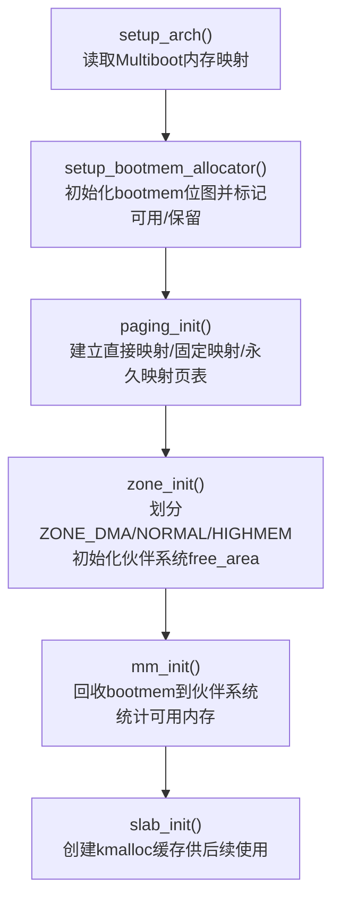
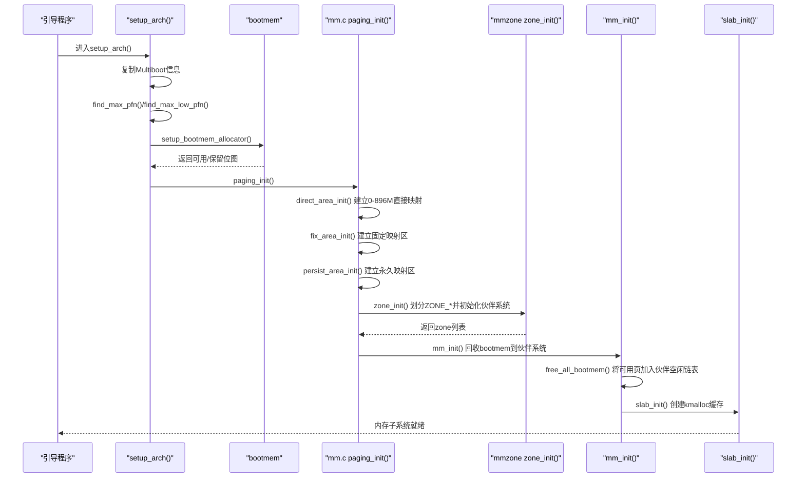
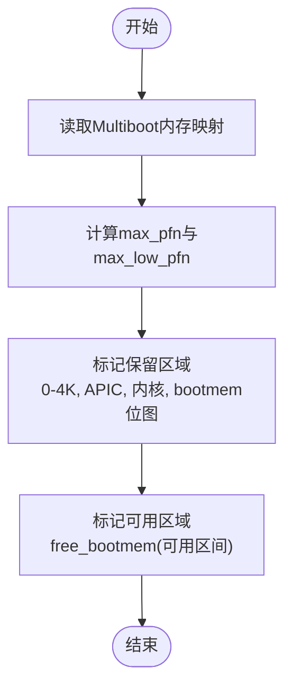
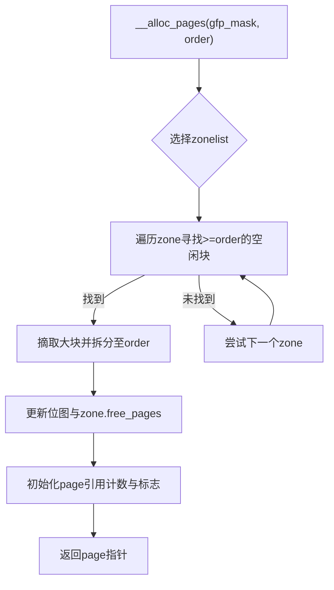
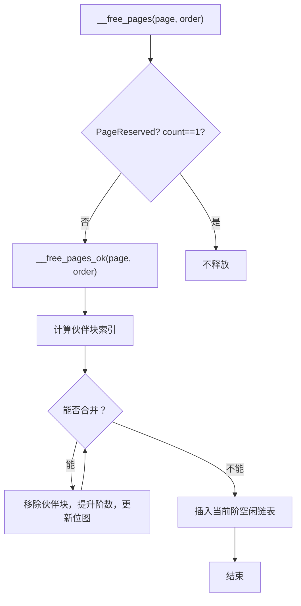
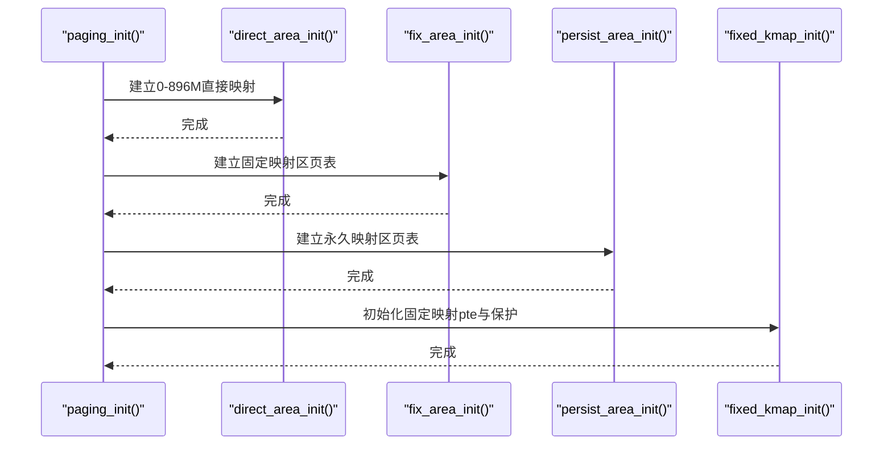
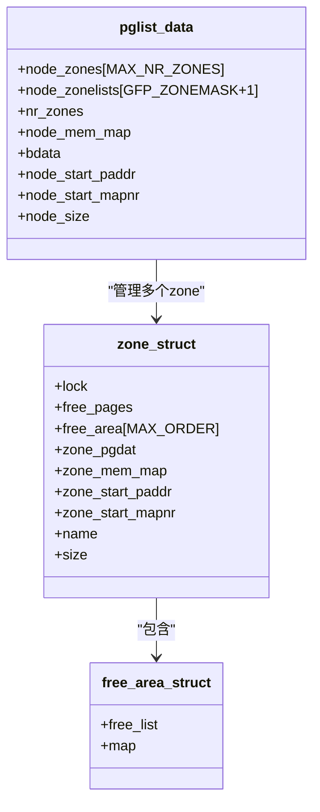
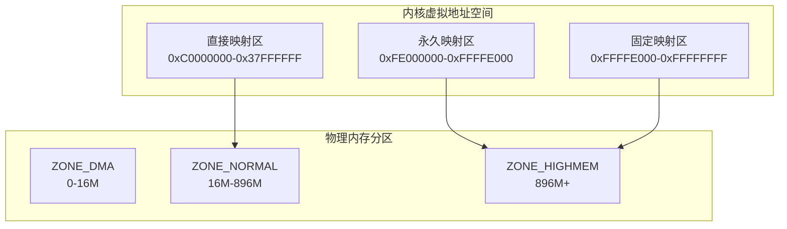
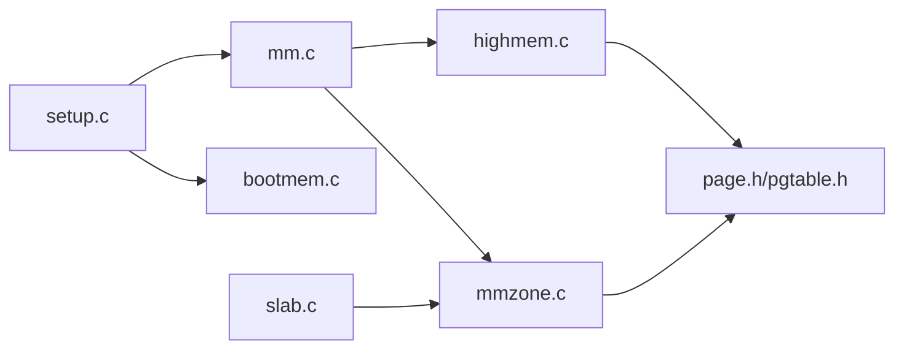

# 物理内存管理

<cite>
**本文引用的文件**
- [arch/x86/kernel/setup.c](file://arch/x86/kernel/setup.c)
- [arch/x86/kernel/mm/mm.c](file://arch/x86/kernel/mm/mm.c)
- [kernel/mm/bootmem.c](file://kernel/mm/bootmem.c)
- [kernel/mm/mmzone.c](file://kernel/mm/mmzone.c)
- [kernel/mm/highmem.c](file://kernel/mm/highmem.c)
- [includes/arch/x86/page.h](file://includes/arch/x86/page.h)
- [includes/arch/x86/highmem.h](file://includes/arch/x86/highmem.h)
- [includes/mm/bootmem.h](file://includes/mm/bootmem.h)
- [includes/mm/mm.h](file://includes/mm/mm.h)
- [includes/mm/mmzone.h](file://includes/mm/mmzone.h)
- [kernel/mm/slab.c](file://kernel/mm/slab.c)
</cite>

## 目录
1. [简介](#简介)
2. [项目结构](#项目结构)
3. [核心组件](#核心组件)
4. [架构总览](#架构总览)
5. [详细组件分析](#详细组件分析)
6. [依赖关系分析](#依赖关系分析)
7. [性能考量](#性能考量)
8. [故障排除指南](#故障排除指南)
9. [结论](#结论)
10. [附录](#附录)

## 简介
本文件面向LulaOS的物理内存管理子系统，覆盖引导阶段的内存检测、保留区域标记与可用内存池建立；解释伙伴系统算法的分配、合并与碎片整理机制；描述高端内存支持（固定映射与永久映射）；分析ZONE_DMA、ZONE_NORMAL、ZONE_HIGHMEM等区域的划分与管理；并提供内存布局图、分配流程图以及调试与故障排除建议。

## 项目结构
LulaOS将内存管理分为三层：
- 引导期分配器（bootmem）：在页表与伙伴系统就绪前，使用位图进行简单连续页分配，用于构建后续基础设施。
- 伙伴系统与区域（mmzone）：维护page描述符数组、zone分区、free_area阶链表与位图，实现通用页面分配/释放与合并。
- 高端内存映射（highmem）：为896M以上物理内存提供临时固定映射与永久映射能力，配合页表初始化完成内核直接映射区与特殊映射区。

图表来源
- [arch/x86/kernel/setup.c:182-216](file://arch/x86/kernel/setup.c#L182-L216)
- [arch/x86/kernel/mm/mm.c:117-134](file://arch/x86/kernel/mm/mm.c#L117-L134)
- [kernel/mm/mmzone.c:61-150](file://kernel/mm/mmzone.c#L61-L150)
- [kernel/mm/bootmem.c:12-28](file://kernel/mm/bootmem.c#L12-L28)
- [kernel/mm/slab.c:249-296](file://kernel/mm/slab.c#L249-L296)

章节来源
- [arch/x86/kernel/setup.c:182-216](file://arch/x86/kernel/setup.c#L182-L216)
- [arch/x86/kernel/mm/mm.c:117-134](file://arch/x86/kernel/mm/mm.c#L117-L134)
- [kernel/mm/mmzone.c:61-150](file://kernel/mm/mmzone.c#L61-L150)
- [kernel/mm/bootmem.c:12-28](file://kernel/mm/bootmem.c#L12-L28)
- [kernel/mm/slab.c:249-296](file://kernel/mm/slab.c#L249-L296)

## 核心组件
- 引导期内存管理器（bootmem）
  - 负责在早期阶段以位图方式管理低内存（0~896M），支持预留、释放与分配，为后续页表与伙伴系统搭建提供基础。
- 伙伴系统与区域（mmzone）
  - 维护zone分区（DMA/Normal/HighMem）、page描述符数组、free_area阶链表与位图，实现高效分配与合并。
- 高端内存映射（highmem）
  - 提供固定映射（fixmap）与永久映射（pkmap）能力，使内核可访问896M以上的物理内存。
- 页表与直接映射（mm.c）
  - 建立0~896M的直接映射、固定映射区与永久映射区，加载页表并启动分页。
- 对象级分配器（slab）
  - 基于伙伴系统分配页，组织小对象缓存，提高频繁小对象分配效率。

章节来源
- [kernel/mm/bootmem.c:12-177](file://kernel/mm/bootmem.c#L12-L177)
- [kernel/mm/mmzone.c:61-329](file://kernel/mm/mmzone.c#L61-L329)
- [kernel/mm/highmem.c:1-48](file://kernel/mm/highmem.c#L1-L48)
- [arch/x86/kernel/mm/mm.c:24-134](file://arch/x86/kernel/mm/mm.c#L24-L134)
- [kernel/mm/slab.c:249-585](file://kernel/mm/slab.c#L249-L585)

## 架构总览
下图展示了从引导到伙伴系统就绪的关键流程，包括内存检测、保留区域标记、可用内存池建立、页表初始化与区域划分。

图表来源
- [arch/x86/kernel/setup.c:182-216](file://arch/x86/kernel/setup.c#L182-L216)
- [arch/x86/kernel/mm/mm.c:117-134](file://arch/x86/kernel/mm/mm.c#L117-L134)
- [kernel/mm/mmzone.c:61-150](file://kernel/mm/mmzone.c#L61-L150)
- [kernel/mm/bootmem.c:194-223](file://kernel/mm/bootmem.c#L194-L223)
- [kernel/mm/slab.c:249-296](file://kernel/mm/slab.c#L249-L296)

## 详细组件分析

### 引导阶段内存检测与保留区域标记
- 内存检测
  - 通过Multiboot提供的内存映射遍历，计算最大物理页号max_pfn，并确定低端上限max_low_pfn（896M）。
  - 若存在高于896M的内存，则将其归入高端内存范围（highstart_pfn~highend_pfn）。
- 保留区域标记
  - 对0~4K、APIC相关区域、内核镜像与bootmem位图等关键区域调用reserve_bootmem标记为不可用。
  - 对可用的内存区间调用free_bootmem标记为可用。
- 可用内存池建立
  - 在mm_init中，调用free_all_bootmem将bootmem位图中可用的页转换为page描述符并加入伙伴系统的空闲链表，同时回收bootmem位图页本身。

图表来源
- [arch/x86/kernel/setup.c:45-118](file://arch/x86/kernel/setup.c#L45-L118)
- [arch/x86/kernel/setup.c:123-176](file://arch/x86/kernel/setup.c#L123-L176)
- [kernel/mm/bootmem.c:33-71](file://kernel/mm/bootmem.c#L33-L71)

章节来源
- [arch/x86/kernel/setup.c:45-118](file://arch/x86/kernel/setup.c#L45-L118)
- [arch/x86/kernel/setup.c:123-176](file://arch/x86/kernel/setup.c#L123-L176)
- [kernel/mm/bootmem.c:33-71](file://kernel/mm/bootmem.c#L33-L71)

### 伙伴系统算法：分配、合并与碎片整理
- 数据结构
  - zone_t包含free_area[MAX_ORDER]，每个free_area维护一个空闲链表与位图，表示该阶的空闲块集合。
  - page描述符数组mem_map记录每个页面的状态、所属zone、虚拟地址等信息。
- 分配流程（__alloc_pages）
  - 根据gfp_mask选择zonelist，按order从大到小查找空闲块。
  - 找到大块后，拆分为目标order，并将多余部分（buddy）插入更低阶空闲链表。
  - 更新位图与zone空闲计数，初始化page引用计数与标志。
- 释放与合并（__free_pages_ok）
  - 检查页面是否可释放（未锁定、非LRU、非脏等）。
  - 计算伙伴块索引，尝试向上合并直到无法合并或达到MAX_ORDER。
  - 将最终块插入对应阶空闲链表，更新位图与计数。
- 碎片整理
  - 通过持续合并相邻空闲块（伙伴块）减少外部碎片，提升大块分配成功率。

图表来源
- [kernel/mm/mmzone.c:248-329](file://kernel/mm/mmzone.c#L248-L329)

图表来源
- [kernel/mm/mmzone.c:153-219](file://kernel/mm/mmzone.c#L153-L219)

章节来源
- [kernel/mm/mmzone.c:153-219](file://kernel/mm/mmzone.c#L153-L219)
- [kernel/mm/mmzone.c:248-329](file://kernel/mm/mmzone.c#L248-L329)
- [includes/mm/mmzone.h:24-46](file://includes/mm/mmzone.h#L24-L46)

### 高端内存支持：临时映射与永久映射策略
- 固定映射（fixmap）
  - 位于内核虚拟地址空间顶部（如0xffffe000附近），提供少量固定槽位用于临时映射物理页，常用于设备寄存器访问或中断处理。
  - 通过__set_fixmap设置特定槽位的PTE，权限由PAGE_KERNEL控制。
- 永久映射（pkmap）
  - 位于固定映射之下的一段连续虚拟区域（如0xfe000000起），提供较多槽位用于长期映射高端内存页。
  - 通过persist_area_init建立页表项，并在需要时动态设置PTE。
- 页表初始化
  - direct_area_init建立0~896M直接映射。
  - fix_area_init建立固定映射区页表。
  - persist_area_init建立永久映射区页表。
  - 最后加载CR3启用分页，并初始化fixed_kmap_pte与保护属性。

图表来源
- [arch/x86/kernel/mm/mm.c:24-107](file://arch/x86/kernel/mm/mm.c#L24-L107)
- [kernel/mm/highmem.c:13-48](file://kernel/mm/highmem.c#L13-L48)

章节来源
- [arch/x86/kernel/mm/mm.c:24-134](file://arch/x86/kernel/mm/mm.c#L24-L134)
- [kernel/mm/highmem.c:1-48](file://kernel/mm/highmem.c#L1-L48)
- [includes/arch/x86/highmem.h:19-67](file://includes/arch/x86/highmem.h#L19-L67)

### 内存区域管理：ZONE_DMA、ZONE_NORMAL、ZONE_HIGHMEM
- 区域划分
  - ZONE_DMA：0~16M，用于DMA设备可直接寻址的低端内存。
  - ZONE_NORMAL：16M~896M，内核直接映射区，常规内核分配主要来源于此。
  - ZONE_HIGHMEM：896M以上，需通过kmap/pkmap等方式映射后才能访问。
- 初始化过程
  - zone_init计算各zone大小，分配mem_map数组，初始化page描述符与zone结构。
  - 为每个zone建立free_area链表与位图，并构建zonelist以便分配时按优先级查找。
- 分配策略
  - __alloc_pages根据gfp_mask选择zonelist，优先从指定zone查找，否则回退到其他zone。

图表来源
- [includes/mm/mmzone.h:24-63](file://includes/mm/mmzone.h#L24-L63)
- [kernel/mm/mmzone.c:61-150](file://kernel/mm/mmzone.c#L61-L150)

章节来源
- [includes/mm/mmzone.h:11-16](file://includes/mm/mmzone.h#L11-L16)
- [kernel/mm/mmzone.c:61-150](file://kernel/mm/mmzone.c#L61-L150)

### 内存布局图
- 虚拟地址空间（x86）
  - 0xC0000000~0xFFFFFFFF：内核空间
    - 0xC0000000~0x37FFFFFF：直接映射区（0~896M）
    - 0xFE000000~0xFFFFE000：永久映射区（pkmap）
    - 0xFFFFE000~0xFFFFFFFF：固定映射区（fixmap）
- 物理内存分区
  - 0~16M：ZONE_DMA
  - 16M~896M：ZONE_NORMAL
  - 896M以上：ZONE_HIGHMEM

图表来源
- [includes/arch/x86/page.h:5-11](file://includes/arch/x86/page.h#L5-L11)
- [includes/arch/x86/highmem.h:19-67](file://includes/arch/x86/highmem.h#L19-L67)
- [includes/mm/mmzone.h:11-16](file://includes/mm/mmzone.h#L11-L16)

## 依赖关系分析
- 模块耦合
  - setup.c依赖multiboot信息与bootmem接口，负责早期内存检测与保留。
  - mm.c依赖page与pgtable接口，负责页表建立与分页启用。
  - mmzone.c依赖bootmem与page接口，负责伙伴系统与区域管理。
  - highmem.c依赖pgtable与page接口，负责高端内存映射。
  - slab.c依赖伙伴系统接口，提供对象级分配。
- 潜在循环依赖
  - 通过头文件隔离与函数声明避免循环依赖；初始化顺序严格遵循setup→paging→zone→mm→slab。
- 外部依赖
  - Multiboot信息提供物理内存布局。
  - x86页表操作（PGD/PTE）与原子操作、自旋锁等底层原语。

图表来源
- [arch/x86/kernel/setup.c:182-216](file://arch/x86/kernel/setup.c#L182-L216)
- [arch/x86/kernel/mm/mm.c:117-134](file://arch/x86/kernel/mm/mm.c#L117-L134)
- [kernel/mm/mmzone.c:61-150](file://kernel/mm/mmzone.c#L61-L150)
- [kernel/mm/highmem.c:1-48](file://kernel/mm/highmem.c#L1-L48)
- [kernel/mm/slab.c:249-296](file://kernel/mm/slab.c#L249-L296)

章节来源
- [arch/x86/kernel/setup.c:182-216](file://arch/x86/kernel/setup.c#L182-L216)
- [arch/x86/kernel/mm/mm.c:117-134](file://arch/x86/kernel/mm/mm.c#L117-L134)
- [kernel/mm/mmzone.c:61-150](file://kernel/mm/mmzone.c#L61-L150)
- [kernel/mm/highmem.c:1-48](file://kernel/mm/highmem.c#L1-L48)
- [kernel/mm/slab.c:249-296](file://kernel/mm/slab.c#L249-L296)

## 性能考量
- 分配路径优化
  - 伙伴系统在分配时尽量从高阶块拆分，减少多次分配开销；释放时积极合并，降低外部碎片。
- 区域优先级
  - 通过zonelist配置不同GFP掩码下的zone优先级，确保DMA设备优先从ZONE_DMA分配。
- 高端内存映射成本
  - 固定映射与永久映射涉及PTE设置与TLB刷新，应尽量减少频繁切换映射。
- 对象级分配
  - slab缓存减少小对象分配的页分配次数，提高局部性与缓存命中率。

[本节为一般性指导，无需具体文件分析]

## 故障排除指南
- 常见问题定位
  - 内存不足：检查__alloc_pages失败日志，确认zone空闲计数与伙伴位图状态。
  - 高端映射错误：核对fix_to_virt与pkmap基址是否正确，检查PTE设置权限。
  - 保留区域冲突：确认reserve_bootmem调用是否正确，避免覆盖关键区域。
- 调试工具与建议
  - 打印zone与伙伴系统状态：输出zone.free_pages与各阶free_list长度。
  - 检查page标志：验证PageReserved、PageHighMem、PageSlab等标志是否符合预期。
  - 跟踪分配路径：在__alloc_pages与__free_pages_ok中添加日志，观察分配/合并行为。
- 常见错误场景
  - 非法页号或越界访问：校验pfn与zone边界，避免BAD_RANGE触发。
  - 并发竞争：确保在临界区使用自旋锁保护zone与free_area操作。

章节来源
- [kernel/mm/mmzone.c:248-329](file://kernel/mm/mmzone.c#L248-L329)
- [kernel/mm/mmzone.c:153-219](file://kernel/mm/mmzone.c#L153-L219)
- [kernel/mm/highmem.c:13-48](file://kernel/mm/highmem.c#L13-L48)
- [includes/mm/mmzone.h:7](file://includes/mm/mmzone.h#L7)

## 结论
LulaOS的物理内存管理采用经典的“引导期位图分配器 + 伙伴系统 + 区域划分 + 高端内存映射”的分层设计。引导阶段通过Multiboot信息完成内存检测与保留标记，随后建立页表与区域，将可用内存转入伙伴系统统一管理。伙伴系统通过阶链表与位图实现高效分配与合并，减少碎片；高端内存通过固定与永久映射提供灵活访问能力。整体架构清晰、可扩展性强，适合进一步扩展多节点NUMA与更复杂的内存策略。

[本节为总结性内容，无需具体文件分析]

## 附录
- 关键函数与职责
  - setup_bootmem_allocator：初始化bootmem位图并标记可用/保留区域。
  - paging_init：建立直接映射、固定映射与永久映射，加载页表。
  - zone_init：划分zone并初始化伙伴系统。
  - mm_init：回收bootmem到伙伴系统，统计可用内存。
  - kmem_cache_init：创建kmalloc缓存，启用OFF_SLAB优化。
- 参考路径
  - [arch/x86/kernel/setup.c:182-216](file://arch/x86/kernel/setup.c#L182-L216)
  - [arch/x86/kernel/mm/mm.c:117-134](file://arch/x86/kernel/mm/mm.c#L117-L134)
  - [kernel/mm/mmzone.c:61-150](file://kernel/mm/mmzone.c#L61-L150)
  - [kernel/mm/bootmem.c:194-223](file://kernel/mm/bootmem.c#L194-L223)
  - [kernel/mm/slab.c:249-296](file://kernel/mm/slab.c#L249-L296)

[本节为补充信息，无需具体文件分析]