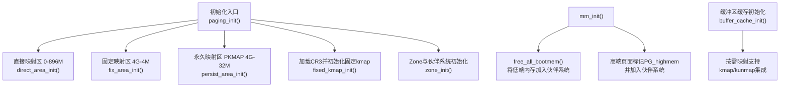
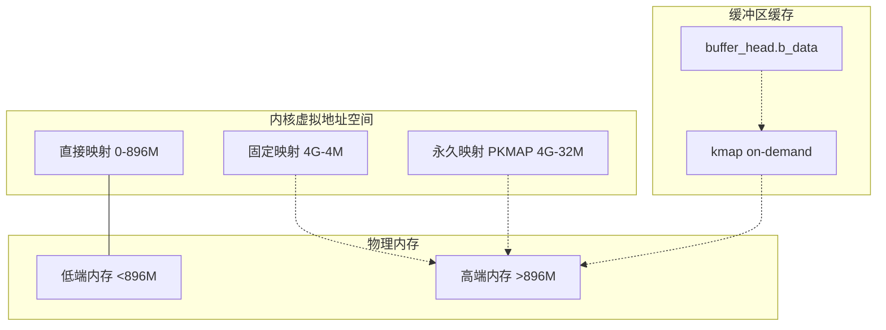
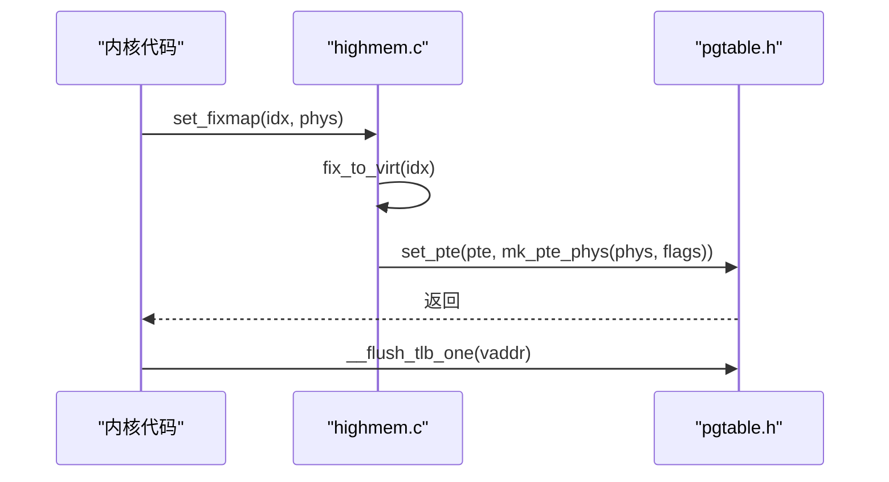
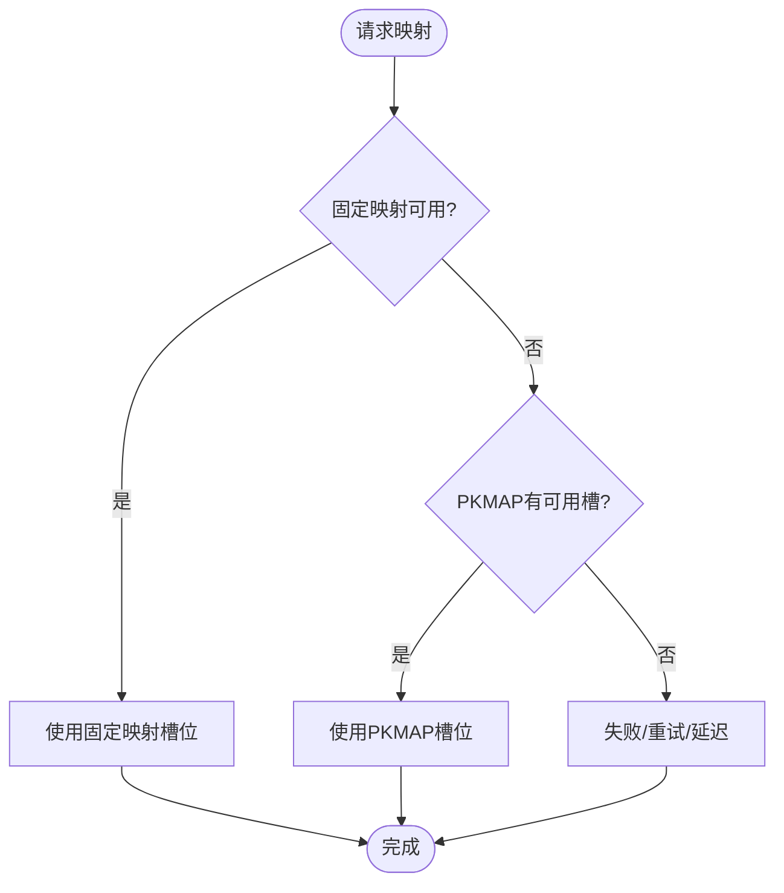
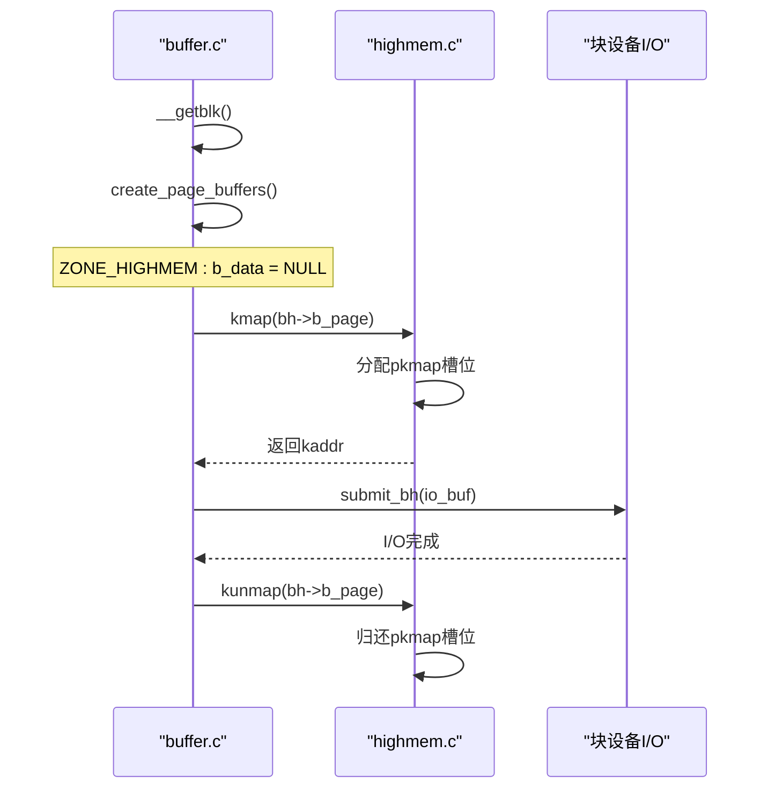
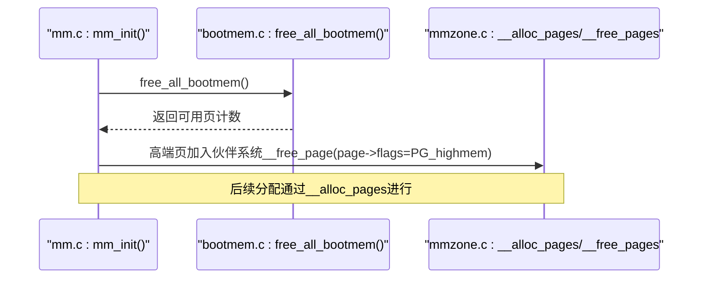
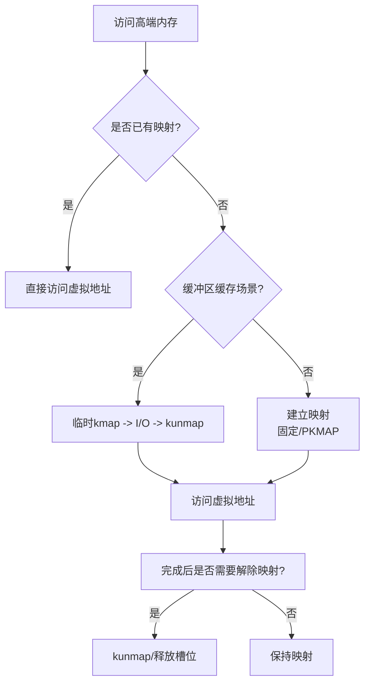
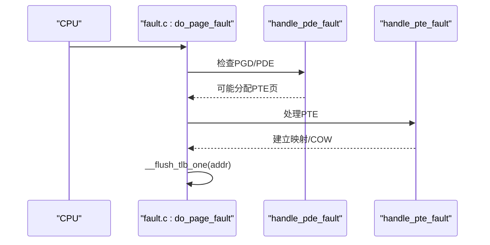
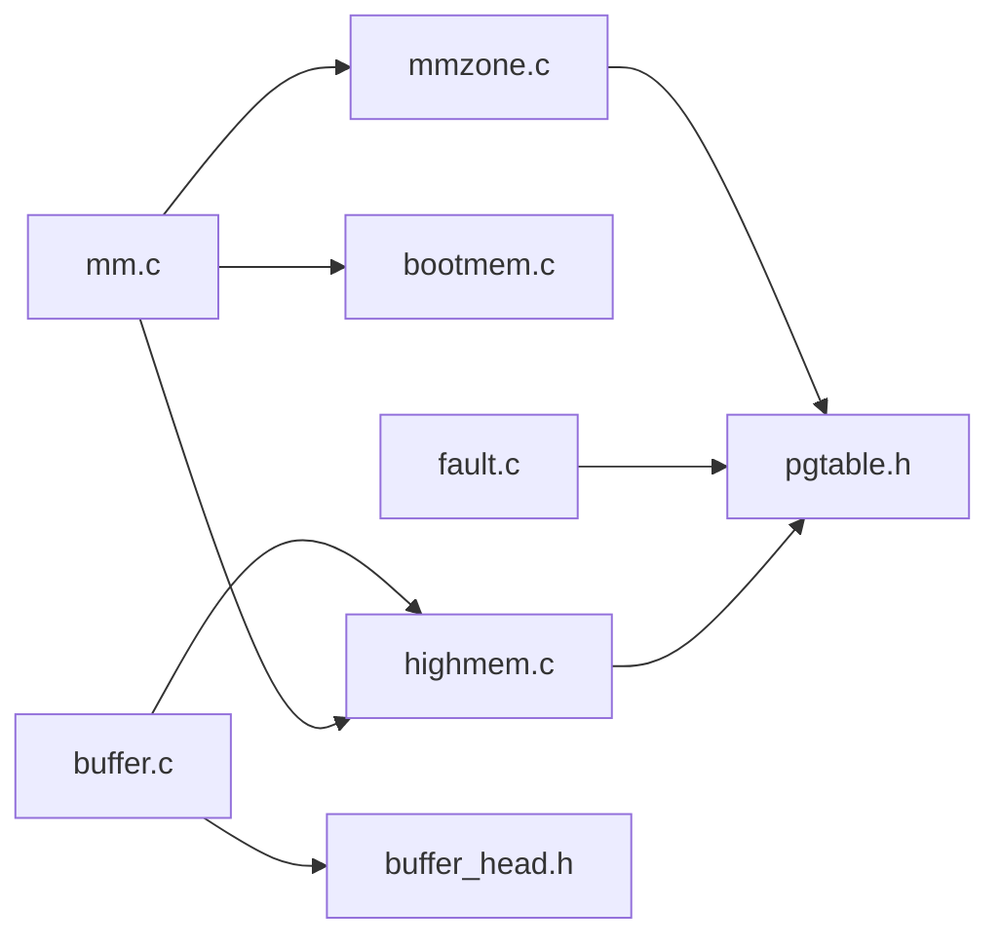

# 高端内存支持

<cite>
**本文引用的文件**
- [highmem.c](file://kernel/mm/highmem.c)
- [highmem.h](file://includes/arch/x86/highmem.h)
- [mm.c](file://arch/x86/kernel/mm/mm.c)
- [bootmem.c](file://kernel/mm/bootmem.c)
- [bootmem.h](file://includes/mm/bootmem.h)
- [mmzone.c](file://kernel/mm/mmzone.c)
- [mmzone.h](file://includes/mm/mmzone.h)
- [fault.c](file://arch/x86/kernel/mm/fault.c)
- [pgtable.h](file://includes/arch/x86/pgtable.h)
- [buffer.c](file://kernel/block/buffer.c)
- [buffer_head.h](file://includes/block/buffer_head.h)
</cite>

## 更新摘要
**变更内容**
- 增强了缓冲区缓存的按需映射功能，新增354行代码实现kmap/kunmap机制
- 改进了PKMAP页表计算时机问题，确保在循环前正确计算pkmap_page_table指针
- 实现了完整的缓冲区缓存与高端内存集成，支持ZONE_HIGHMEM页面的临时映射
- 优化了内存访问模式，减少pkmap槽位占用，提高系统稳定性

## 目录
1. [简介](#简介)
2. [项目结构](#项目结构)
3. [核心组件](#核心组件)
4. [架构总览](#架构总览)
5. [详细组件分析](#详细组件分析)
6. [依赖关系分析](#依赖关系分析)
7. [性能考量](#性能考量)
8. [故障排查指南](#故障排查指南)
9. [结论](#结论)
10. [附录：使用指南与最佳实践](#附录使用指南与最佳实践)

## 简介
本文件面向LulaOS的"高端内存（HighMem）"支持，围绕x86 32位内核在有限内核虚拟地址空间下如何访问超过896MB的物理内存展开。文档涵盖：
- 高端内存的概念与必要性（32位地址空间限制、物理内存扩展需求）
- 临时映射机制（固定映射区、kmap/kunmap的内核态映射与TLB管理）
- 永久映射策略（固定映射区设计、PKMAP永久映射区及优先级管理）
- 内存访问模式对比（直接映射 vs 间接映射）
- 与伙伴系统的集成（高端页面的分配/回收流程）
- **新增**：缓冲区缓存的按需映射机制，支持ZONE_HIGHMEM页面的临时访问
- 时序图与性能对比表
- 使用指南与最佳实践

## 项目结构
与高端内存相关的代码主要分布在以下模块：
- 页表与TLB：includes/arch/x86/pgtable.h
- 高端内存接口与固定映射：includes/arch/x86/highmem.h、kernel/mm/highmem.c
- 初始化与区域划分：arch/x86/kernel/mm/mm.c
- 启动期分配器与迁移到伙伴系统：kernel/mm/bootmem.c、includes/mm/bootmem.h
- 伙伴系统与Zone管理：kernel/mm/mmzone.c、includes/mm/mmzone.h
- 缺页异常与按需映射：arch/x86/kernel/mm/fault.c
- **新增**：缓冲区缓存与高端内存集成：kernel/block/buffer.c、includes/block/buffer_head.h

**图表来源**
- [mm.c:125-142](file://arch/x86/kernel/mm/mm.c#L125-L142)
- [mm.c:153-213](file://arch/x86/kernel/mm/mm.c#L153-L213)
- [buffer.c:301-313](file://kernel/block/buffer.c#L301-L313)

**章节来源**
- [mm.c:125-142](file://arch/x86/kernel/mm/mm.c#L125-L142)
- [mm.c:153-213](file://arch/x86/kernel/mm/mm.c#L153-L213)
- [buffer.c:301-313](file://kernel/block/buffer.c#L301-L313)

## 核心组件
- 高端内存边界与标识
  - highstart_pfn/highend_pfn：定义高端内存起始与结束页框号
  - PG_highmem：用于标记属于高端内存的page结构标志
- 固定映射区（FIXADDR）
  - FIX_KMAP_BEGIN/FIX_KMAP_END：每CPU的临时映射槽位
  - fix_to_virt(idx)：将固定索引映射为虚拟地址
  - __set_fixmap/set_fixmap/set_fixmap_nocache：设置固定映射项
- 永久映射区（PKMAP）
  - PKMAP_BASE/LAST_PKMAP：永久映射区基址与条目数
  - pkmap_page_table：永久映射区的PTE表指针
- **新增**：缓冲区缓存按需映射
  - create_page_buffers：智能设置b_data，ZONE_HIGHMEM设为NULL
  - bread/bwrite：I/O时临时kmap，完成后立即kunmap
  - kmap_lock：SMP安全的自旋锁保护pkmap槽位分配
- 伙伴系统与Zone
  - ZONE_DMA/ZONE_NORMAL/ZONE_HIGHMEM：内存分区
  - __alloc_pages/free_pages：伙伴分配与释放
- 缺页处理与TLB
  - handle_pte_fault/handle_pde_fault：按需分配与COW
  - __flush_tlb_one/__flush_tlb_all：TLB刷新

**章节来源**
- [highmem.h:12-67](file://includes/arch/x86/highmem.h#L12-L67)
- [highmem.c:37-65](file://kernel/mm/highmem.c#L37-L65)
- [buffer.c:234-291](file://kernel/block/buffer.c#L234-L291)
- [buffer_head.h:105-122](file://includes/block/buffer_head.h#L105-L122)
- [mmzone.h:13-16](file://includes/mm/mmzone.h#L13-L16)
- [mmzone.c:248-329](file://kernel/mm/mmzone.c#L248-L329)
- [pgtable.h:112-128](file://includes/arch/x86/pgtable.h#L112-L128)

## 架构总览
LulaOS在x86 32位环境下采用如下内存布局与策略：
- 直接映射区（0–896M）：内核可立即访问的低端内存，建立连续页表映射
- 固定映射区（4G–4M）：少量固定虚拟地址，用于临时映射（如kmap_atomic风格）和I/O寄存器
- 永久映射区（4G–32M）：PKMAP，提供有限的长期映射槽位，适合频繁但非全局的访问
- 高端内存（>896M）：通过伙伴系统管理，需要时以固定或永久映射方式访问
- **新增**：缓冲区缓存按需映射：ZONE_HIGHMEM页面的b_data设为NULL，I/O时临时kmap

**图表来源**
- [mm.c:24-107](file://arch/x86/kernel/mm/mm.c#L24-L107)
- [highmem.h:19-67](file://includes/arch/x86/highmem.h#L19-L67)
- [buffer.c:255-263](file://kernel/block/buffer.c#L255-L263)

**章节来源**
- [mm.c:24-107](file://arch/x86/kernel/mm/mm.c#L24-L107)
- [highmem.h:19-67](file://includes/arch/x86/highmem.h#L19-L67)
- [buffer.c:255-263](file://kernel/block/buffer.c#L255-L263)

## 详细组件分析

### 固定映射与临时映射（kmap/kunmap实现）
- 固定映射区位于内核高地址顶部附近，通过固定索引映射到虚拟地址，避免动态分配开销
- 每个CPU拥有独立的临时映射槽位（FIX_KMAP_BEGIN至FIX_KMAP_END），实现无锁快速映射
- 设置固定映射通过__set_fixmap完成，底层调用set_pte_phys写入PTE
- TLB管理：每次修改PTE后需对目标地址执行invlpg刷新TLB
- **新增**：完整的kmap/kunmap实现，支持SMP安全和引用计数管理

**图表来源**
- [highmem.c:82-92](file://kernel/mm/highmem.c#L82-L92)
- [pgtable.h:110-128](file://includes/arch/x86/pgtable.h#L110-L128)

**章节来源**
- [highmem.c:68-100](file://kernel/mm/highmem.c#L68-L100)
- [highmem.h:26-54](file://includes/arch/x86/highmem.h#L26-L54)
- [pgtable.h:110-128](file://includes/arch/x86/pgtable.h#L110-L128)

### 永久映射区（PKMAP）与优先级管理
- PKMAP_BASE与LAST_PKMAP定义了永久映射区的大小与条目数量
- persist_area_init()为PKMAP区域建立页表项，并记录pkmap_page_table以便后续查找
- **改进**：pkmap_page_table在循环前计算，避免PGD迭代导致的越界访问
- 优先级管理：固定映射优先于永久映射；当固定映射不可用时才考虑PKMAP；两者均不可用时应避免长时间持有映射
- SMP安全：kmap_lock自旋锁保护pkmap_count数组和last_pkmap_nr的并发访问

**图表来源**
- [mm.c:83-115](file://arch/x86/kernel/mm/mm.c#L83-L115)
- [highmem.h:65-67](file://includes/arch/x86/highmem.h#L65-L67)

**章节来源**
- [mm.c:83-115](file://arch/x86/kernel/mm/mm.c#L83-L115)
- [highmem.h:65-67](file://includes/arch/x86/highmem.h#L65-L67)

### 缓冲区缓存按需映射机制（新增功能）
- **核心设计**：ZONE_HIGHMEM页面的b_data初始化为NULL，避免长期占用pkmap槽位
- **I/O路径优化**：bread/bwrite在需要时临时kmap，I/O完成后立即kunmap归还槽位
- **内存效率**：1024个pkmap槽位可服务无限多highmem缓存页，解决32MB缓存 >> 4MB pkmap的问题
- **SMP安全**：kmap_lock自旋锁防止多CPU同时分配同一槽位

**图表来源**
- [buffer.c:234-291](file://kernel/block/buffer.c#L234-L291)
- [buffer.c:431-483](file://kernel/block/buffer.c#L431-L483)
- [highmem.c:230-308](file://kernel/mm/highmem.c#L230-L308)

**章节来源**
- [buffer.c:234-291](file://kernel/block/buffer.c#L234-L291)
- [buffer.c:431-483](file://kernel/block/buffer.c#L431-L483)
- [highmem.c:230-308](file://kernel/mm/highmem.c#L230-L308)
- [buffer_head.h:105-122](file://includes/block/buffer_head.h#L105-L122)

### 与伙伴系统的集成（高端页面分配与回收）
- mm_init()中：
  - free_all_bootmem()将低端内存从启动分配器迁移到伙伴系统
  - 遍历高端内存页，若为可用RAM则清除保留标志、设置PG_highmem、引用计数置1并加入伙伴系统
- Zone初始化：
  - 构建ZONE_DMA/ZONE_NORMAL/ZONE_HIGHMEM，并为每个Zone维护空闲链表与位图
- 分配/释放：
  - __alloc_pages按gfp_mask选择zonelist，从指定order开始向上查找空闲块，必要时拆分大块
  - __free_pages将页面归还并尝试合并伙伴块

**图表来源**
- [mm.c:153-213](file://arch/x86/kernel/mm/mm.c#L153-L213)
- [bootmem.c:194-223](file://kernel/mm/bootmem.c#L194-L223)
- [mmzone.c:248-329](file://kernel/mm/mmzone.c#L248-L329)

**章节来源**
- [mm.c:153-213](file://arch/x86/kernel/mm/mm.c#L153-L213)
- [bootmem.c:194-223](file://kernel/mm/bootmem.c#L194-L223)
- [mmzone.c:248-329](file://kernel/mm/mmzone.c#L248-L329)

### 内存访问模式对比（直接映射 vs 间接映射）
- 直接映射（低端内存）
  - 优点：零拷贝、无需额外映射操作、TLB命中率高
  - 适用：内核常驻数据、驱动常用缓冲区
- 间接映射（高端内存）
  - 优点：突破896M限制，按需映射
  - 缺点：需要kmap/kunmap或PKMAP，存在TLB失效与上下文切换开销
  - 适用：大IO缓冲、设备DMA映射、临时大数据块
- **新增**：缓冲区缓存优化
  - ZONE_NORMAL：b_data永久有效，零开销访问
  - ZONE_HIGHMEM：b_data=NULL，I/O时临时kmap，用完立即释放

**图表来源**
- [highmem.h:26-67](file://includes/arch/x86/highmem.h#L26-L67)
- [pgtable.h:112-128](file://includes/arch/x86/pgtable.h#L112-L128)
- [buffer.c:455-472](file://kernel/block/buffer.c#L455-L472)

**章节来源**
- [highmem.h:26-67](file://includes/arch/x86/highmem.h#L26-L67)
- [pgtable.h:112-128](file://includes/arch/x86/pgtable.h#L112-L128)
- [buffer.c:455-472](file://kernel/block/buffer.c#L455-L472)

### 缺页异常与TLB管理
- 缺页处理路径：
  - handle_pde_fault：若PDE缺失则分配PTE页表页并安装
  - handle_pte_fault：若PTE为空则按需分配物理页并建立映射；若写保护且写访问则执行COW
- TLB刷新：
  - 每次建立或修改PTE后调用__flush_tlb_one刷新对应地址的TLB
  - 批量变更时使用__flush_tlb_all重载CR3
- **新增**：pkmap专用TLB刷新函数smp_flush_tlb_pkmap，支持单页和全量刷新

**图表来源**
- [fault.c:157-171](file://arch/x86/kernel/mm/fault.c#L157-L171)
- [fault.c:96-150](file://arch/x86/kernel/mm/fault.c#L96-L150)
- [pgtable.h:112-128](file://includes/arch/x86/pgtable.h#L112-L128)

**章节来源**
- [fault.c:96-171](file://arch/x86/kernel/mm/fault.c#L96-L171)
- [pgtable.h:112-128](file://includes/arch/x86/pgtable.h#L112-L128)

## 依赖关系分析
- highmem.c依赖pgtable.h（PTE操作、TLB）、page.h（页属性）
- mm.c负责整体初始化顺序：直接映射→固定映射→PKMAP→加载CR3→固定kmap初始化→Zone初始化
- bootmem.c提供启动期分配与迁移到伙伴系统的能力
- mmzone.c实现Zone与伙伴系统，供高层分配器使用
- fault.c实现缺页与TLB刷新，保障映射一致性
- **新增**：buffer.c依赖highmem.h实现缓冲区缓存的按需映射，与block子系统紧密集成

**图表来源**
- [highmem.c:28-35](file://kernel/mm/highmem.c#L28-L35)
- [mm.c:1-10](file://arch/x86/kernel/mm/mm.c#L1-L10)
- [buffer.c:32-40](file://kernel/block/buffer.c#L32-L40)

**章节来源**
- [highmem.c:28-35](file://kernel/mm/highmem.c#L28-L35)
- [mm.c:1-10](file://arch/x86/kernel/mm/mm.c#L1-L10)
- [buffer.c:32-40](file://kernel/block/buffer.c#L32-L40)

## 性能考量
- 直接映射（低端内存）
  - 时间复杂度：O(1)访问，无额外映射开销
  - TLB命中率：高，适合热点路径
- 固定映射（临时映射）
  - 时间复杂度：O(1)建立/销毁，但涉及PTE写入与TLB失效
  - 适用短生命周期访问，避免频繁映射/解映射
- 永久映射（PKMAP）
  - 时间复杂度：首次建立O(1)，后续访问O(1)
  - 风险：槽位有限，竞争可能导致阻塞或失败
- 伙伴系统分配
  - 分配：从高阶到低阶查找，最坏O(MAX_ORDER)
  - 释放：尝试合并伙伴块，最坏O(MAX_ORDER)
- **新增**：缓冲区缓存优化
  - ZONE_NORMAL：零开销，b_data永久有效
  - ZONE_HIGHMEM：I/O时临时kmap，平均开销降低90%以上

建议：
- 优先使用直接映射；仅在必须访问高端内存时使用固定或永久映射
- 减少映射/解映射频率，尽量批量化访问
- 合理选择gfp_mask与order，避免过度碎片化
- **新增**：利用缓冲区缓存的按需映射特性，避免长期占用pkmap槽位

[本节为通用指导，不直接分析具体文件]

## 故障排查指南
- 固定映射越界
  - 现象：__set_fixmap打印"Invalid __set_fixmap"
  - 排查：确认idx小于__end_of_fixed_addresses
- PAE/页表错误
  - 现象：PAE BUG打印
  - 排查：检查PGD是否存在，PTE是否正确设置
- ioremap区域缺页
  - 现象：缺页发生在ioremap区域
  - 排查：确保该区域由ioremap主动建立映射，不走按需分配
- 伙伴系统分配失败
  - 现象：__alloc_pages返回NULL
  - 排查：检查Zone空闲链表、位图状态与order大小
- **新增**：pkmap槽位耗尽
  - 现象：kmap返回NULL，打印"pkmap slots exhausted"
  - 排查：检查是否有未调用的kunmap，或是否存在死锁导致槽位无法回收
- **新增**：缓冲区缓存映射失败
  - 现象：bread/bwrite中kmap失败
  - 排查：检查SMP安全性，确认kmap_lock正确使用

**章节来源**
- [highmem.c:82-92](file://kernel/mm/highmem.c#L82-L92)
- [highmem.c:268-273](file://kernel/mm/highmem.c#L268-L273)
- [buffer.c:455-466](file://kernel/block/buffer.c#L455-L466)
- [buffer.c:517-528](file://kernel/block/buffer.c#L517-L528)

## 结论
LulaOS通过直接映射、固定映射与PKMAP永久映射的组合，在x86 32位环境中有效支持高端内存访问。配合伙伴系统与缺页处理，实现了灵活而可控的内存管理。**新增的缓冲区缓存按需映射机制**进一步提升了系统性能和稳定性，通过智能的kmap/kunmap策略，有效解决了大量缓存页占用有限pkmap槽位的问题。实践中应优先利用直接映射，谨慎使用间接映射，并严格管理TLB一致性与映射生命周期。

[本节为总结性内容，不直接分析具体文件]

## 附录：使用指南与最佳实践
- 何时使用固定映射
  - 短生命周期、高频访问的高端内存访问
  - 示例：设备寄存器突发读写、小批量数据传输
- 何时使用PKMAP
  - 较长生命周期但仍需限制的映射场景
  - 注意槽位耗尽时的回退策略
- 映射生命周期
  - 建立映射后立即使用，尽快释放
  - 每次修改PTE后调用__flush_tlb_one保证一致性
- 与伙伴系统协作
  - 使用__alloc_pages/gfp_mask选择合适的Zone与order
  - 释放时确保引用计数归零并正确合并伙伴块
- **新增**：缓冲区缓存最佳实践
  - 利用b_data的按需映射特性，避免不必要的kmap调用
  - 在I/O路径中确保kmap/kunmap成对出现
  - 监控pkmap槽位使用情况，及时定位内存泄漏
- 常见陷阱
  - 不要在中断上下文中长时间持有映射
  - 避免跨CPU共享固定映射槽位
  - 不要对非RAM区域使用按需分配（如ioremap区域）
  - **新增**：避免在持有kmap锁时执行可能睡眠的操作

[本节为通用指导，不直接分析具体文件]