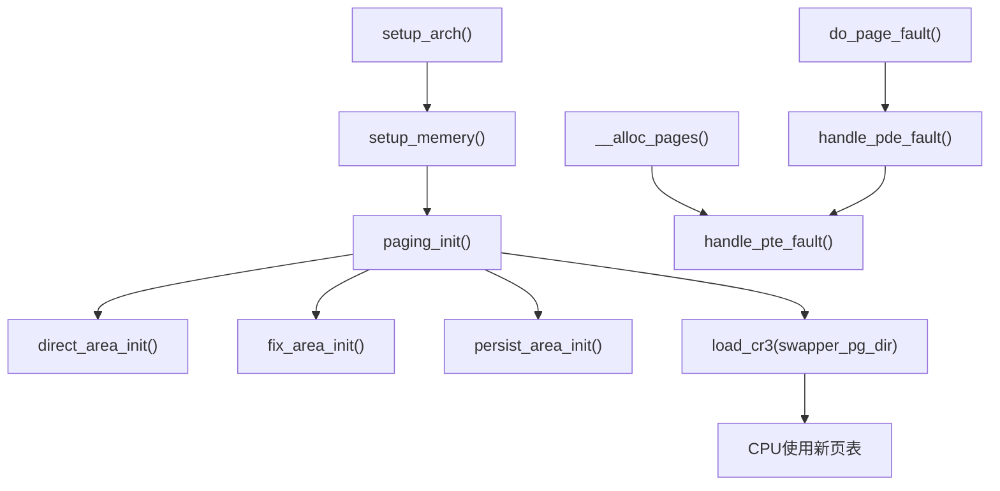
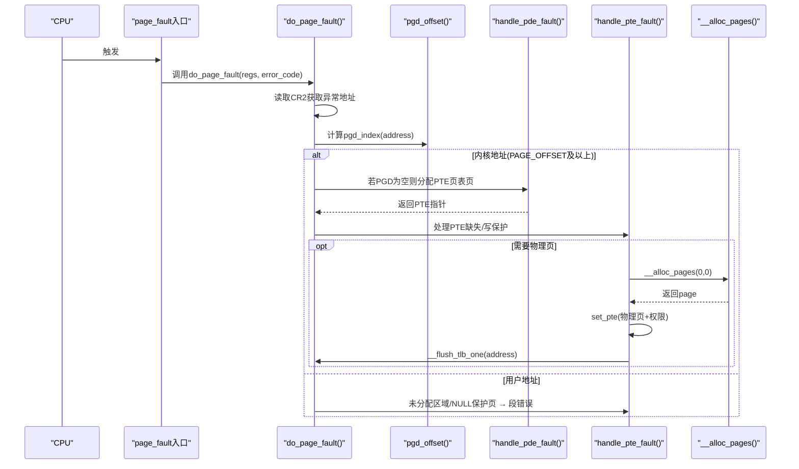
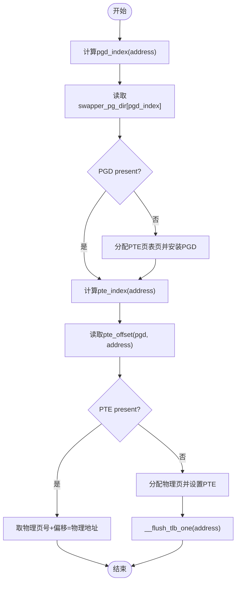
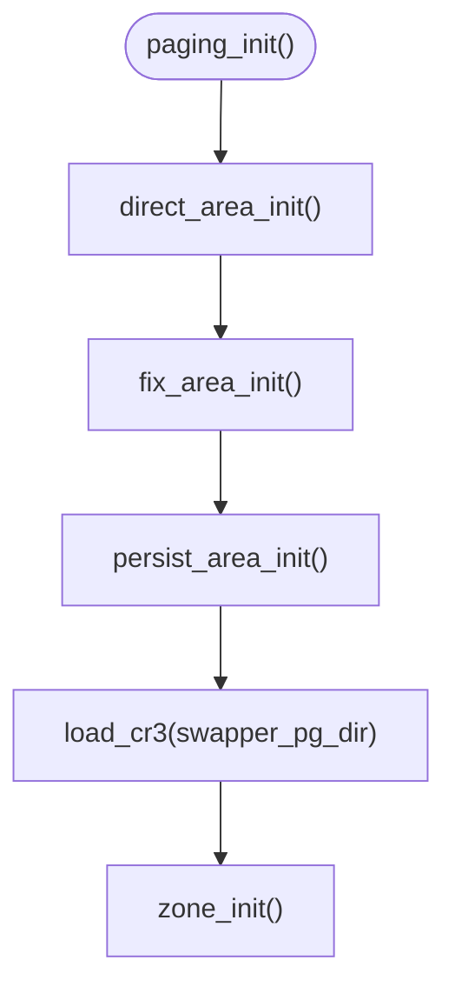
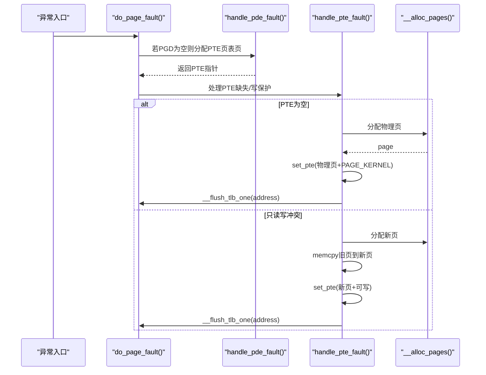
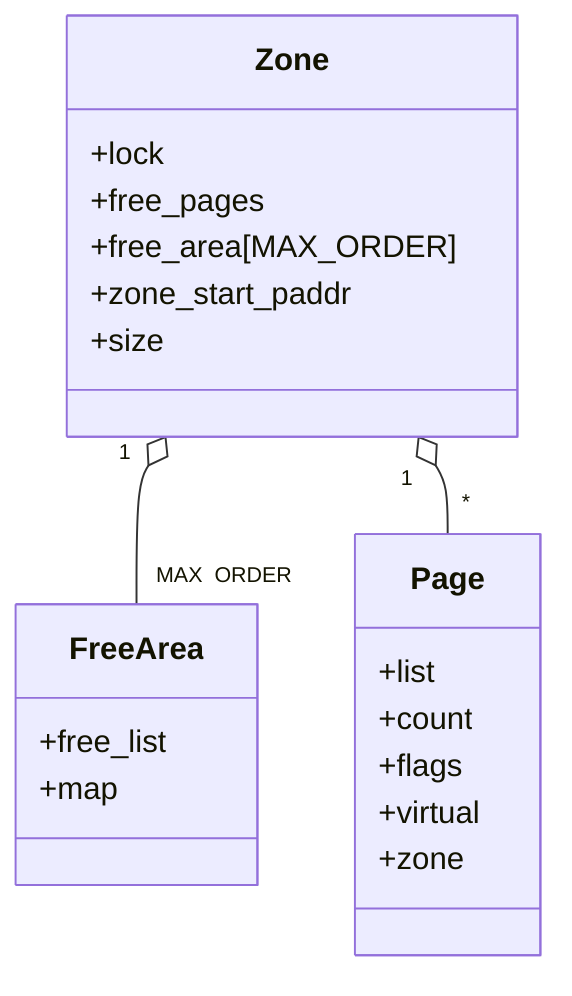
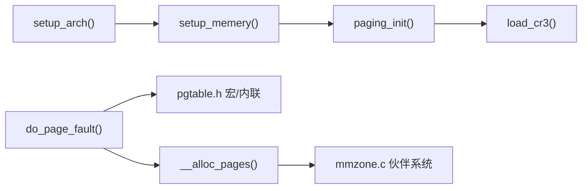

# 虚拟内存管理

<cite>
**本文引用的文件**
- [includes/arch/x86/page.h](file://includes/arch/x86/page.h)
- [includes/arch/x86/pgtable.h](file://includes/arch/x86/pgtable.h)
- [arch/x86/kernel/mm/mm.c](file://arch/x86/kernel/mm/mm.c)
- [arch/x86/kernel/mm/fault.c](file://arch/x86/kernel/mm/fault.c)
- [kernel/mm/bootmem.c](file://kernel/mm/bootmem.c)
- [includes/mm/mm.h](file://includes/mm/mm.h)
- [includes/mm/mmzone.h](file://includes/mm/mmzone.h)
- [kernel/mm/mmzone.c](file://kernel/mm/mmzone.c)
- [arch/x86/kernel/setup.c](file://arch/x86/kernel/setup.c)
</cite>

## 目录
1. [简介](#简介)
2. [项目结构](#项目结构)
3. [核心组件](#核心组件)
4. [架构总览](#架构总览)
5. [详细组件分析](#详细组件分析)
6. [依赖关系分析](#依赖关系分析)
7. [性能考虑](#性能考虑)
8. [故障排查指南](#故障排查指南)
9. [结论](#结论)
10. [附录](#附录)

## 简介
本文件面向LulaOS在x86架构下的虚拟内存子系统，系统性阐述页表结构（PGD、PTE）、地址转换机制、内存映射策略与权限控制。重点覆盖：
- 4KB页面粒度与多级页表遍历算法
- 页表项格式与读写/执行/用户态等权限位
- 虚拟地址到物理地址的转换流程
- 缺页异常处理（按需分配、写时复制）
- 页表初始化与动态映射创建
- 与伙伴系统、启动期内存分配器的协作

## 项目结构
围绕虚拟内存的关键代码分布在以下位置：
- 架构相关定义：页大小、页表项类型、TLB刷新接口等
- 内核页表与初始化：swapper_pg_dir、直接映射区、固定映射区、持久映射区
- 缺页异常处理：按需求页、写时复制、段错误处理
- 内存分配：启动期分配器（bootmem）与伙伴系统（zone/free_area）
- 体系结构引导：从Multiboot信息建立页表并加载CR3

图表来源
- [arch/x86/kernel/setup.c:182-197](file://arch/x86/kernel/setup.c#L182-L197)
- [arch/x86/kernel/mm/mm.c:117-134](file://arch/x86/kernel/mm/mm.c#L117-L134)
- [arch/x86/kernel/mm/fault.c:184-251](file://arch/x86/kernel/mm/fault.c#L184-L251)
- [kernel/mm/mmzone.c:248-329](file://kernel/mm/mmzone.c#L248-L329)

章节来源
- [arch/x86/kernel/setup.c:182-197](file://arch/x86/kernel/setup.c#L182-L197)
- [arch/x86/kernel/mm/mm.c:117-134](file://arch/x86/kernel/mm/mm.c#L117-L134)

## 核心组件
- 页与页表抽象
  - 页大小与对齐：PAGE_SHIFT=12，PAGE_SIZE=4KB，提供PFN/PFN_PHYS等工具宏
  - 页表项类型：pgd_t、pte_t、pgprot_t，以及set_pgd/set_pte等写入接口
- 页表项属性与权限位
  - 存在位、可写、用户态、缓存控制、访问/脏标志、全局等
  - 常用保护掩码：PAGE_KERNEL、PAGE_READONLY、PAGE_SHARED等
- 内核页表与映射区域
  - swapper_pg_dir为内核页目录
  - direct_area_init：0~896M直接映射
  - fix_area_init：固定映射区（4G附近）
  - persist_area_init：持久映射区（PKMAP）
- 缺页异常处理
  - do_page_fault：区分内核/用户空间，定位PGD/PTE
  - handle_pde_fault：按需分配PTE页表页
  - handle_pte_fault：按需分配物理页或COW
- 内存分配
  - bootmem：启动期位图分配器，用于早期页表页分配
  - 伙伴系统：zone/free_area，支持多阶块分配与合并

章节来源
- [includes/arch/x86/page.h:1-47](file://includes/arch/x86/page.h#L1-L47)
- [includes/arch/x86/pgtable.h:1-131](file://includes/arch/x86/pgtable.h#L1-L131)
- [arch/x86/kernel/mm/mm.c:24-134](file://arch/x86/kernel/mm/mm.c#L24-L134)
- [arch/x86/kernel/mm/fault.c:76-171](file://arch/x86/kernel/mm/fault.c#L76-L171)
- [kernel/mm/bootmem.c:12-182](file://kernel/mm/bootmem.c#L12-L182)
- [kernel/mm/mmzone.c:61-150](file://kernel/mm/mmzone.c#L61-L150)

## 架构总览
LulaOS采用两级页表（PGD→PTE），每级1024项，对应4KB页面。内核通过swapper_pg_dir维护全局映射，并在启动阶段完成三大区域的映射：
- 直接映射区：将低端物理内存以线性方式映射到内核高地址空间（PAGE_OFFSET起）
- 固定映射区：用于I/O寄存器、设备映射等固定虚拟地址
- 持久映射区：用于临时映射高端内存或设备内存

当发生缺页时，内核根据异常地址判断是内核还是用户空间，按需分配PTE页表页或物理页，并更新TLB。

图表来源
- [arch/x86/kernel/mm/fault.c:184-251](file://arch/x86/kernel/mm/fault.c#L184-L251)
- [arch/x86/kernel/mm/fault.c:157-171](file://arch/x86/kernel/mm/fault.c#L157-L171)
- [arch/x86/kernel/mm/fault.c:96-150](file://arch/x86/kernel/mm/fault.c#L96-L150)
- [kernel/mm/mmzone.c:248-329](file://kernel/mm/mmzone.c#L248-L329)

## 详细组件分析

### 页表结构与地址转换
- 页大小与索引
  - PAGE_SHIFT=12，PAGE_SIZE=4KB
  - PGDIR_SHIFT=22，PTRS_PER_PGD=1024，PTRS_PER_PTE=1024
  - pgd_index(address)、pte_index(address)分别提取PGD/PTE索引
- 地址转换步骤
  - 通过pgd_offset(mm, address)得到PGD条目指针
  - 通过pte_offset(pgd, address)得到PTE指针
  - 若PTE存在且present，取低20位作为物理页号，拼接偏移得到物理地址
- TLB刷新
  - __flush_tlb_all：重读CR3刷新全部TLB
  - __flush_tlb_one：invlpg刷新单个地址TLB

图表来源
- [includes/arch/x86/pgtable.h:93-107](file://includes/arch/x86/pgtable.h#L93-L107)
- [arch/x86/kernel/mm/fault.c:157-171](file://arch/x86/kernel/mm/fault.c#L157-L171)
- [arch/x86/kernel/mm/fault.c:96-150](file://arch/x86/kernel/mm/fault.c#L96-L150)
- [includes/arch/x86/pgtable.h:118-128](file://includes/arch/x86/pgtable.h#L118-L128)

章节来源
- [includes/arch/x86/page.h:1-47](file://includes/arch/x86/page.h#L1-L47)
- [includes/arch/x86/pgtable.h:14-107](file://includes/arch/x86/pgtable.h#L14-L107)
- [includes/arch/x86/pgtable.h:118-128](file://includes/arch/x86/pgtable.h#L118-L128)

### 权限控制与内存保护
- 页表项权限位
  - _PAGE_PRESENT/_PAGE_RW/_PAGE_USER/_PAGE_ACCESSED/_PAGE_DIRTY等
  - 常用保护组合：PAGE_KERNEL（内核可读可写）、PAGE_READONLY（只读）、PAGE_SHARED（共享）
- 检查与修改
  - pte_present/pte_write/pte_user/pte_dirty/pte_young等内联函数
  - pte_mkwrite/pte_wrprotect/pte_mkread/pte_mkexec等修改接口
- 段错误与保护违规
  - 用户态访问未映射或权限不足触发#PF，do_page_fault识别并进入段错误处理路径
  - ioremap区域禁止走按需分配，避免误映射普通RAM

章节来源
- [includes/arch/x86/pgtable.h:24-89](file://includes/arch/x86/pgtable.h#L24-L89)
- [arch/x86/kernel/mm/fault.c:67-70](file://arch/x86/kernel/mm/fault.c#L67-L70)
- [arch/x86/kernel/mm/fault.c:205-247](file://arch/x86/kernel/mm/fault.c#L205-L247)

### 页表初始化流程
- 直接映射区（0~896M）
  - 遍历PGD，为每个PGD分配PTE页表页，填充PTE指向连续物理页，权限为PAGE_KERNEL
- 固定映射区（4G附近）
  - 按4K对齐，确保相应PGD存在PTE页表页
- 持久映射区（PKMAP）
  - 预留一定范围供后续ioremapping/pkmap使用
- 加载CR3
  - load_cr3(swapper_pg_dir)启用新页表

图表来源
- [arch/x86/kernel/mm/mm.c:24-134](file://arch/x86/kernel/mm/mm.c#L24-L134)

章节来源
- [arch/x86/kernel/mm/mm.c:24-134](file://arch/x86/kernel/mm/mm.c#L24-L134)

### 动态映射创建与缺页处理
- 按需分配PTE页表页
  - handle_pde_fault：若PGD为空，分配一页PTE并安装到PGD
- 按需分配物理页
  - handle_pte_fault：若PTE为空，分配物理页，清零后设置PTE为PAGE_KERNEL
- 写时复制（COW）
  - 若PTE存在但只读且发生写访问，分配新页拷贝旧内容，替换PTE为新页并置可写
- TLB一致性
  - 每次修改PTE后调用__flush_tlb_one(address)

图表来源
- [arch/x86/kernel/mm/fault.c:157-171](file://arch/x86/kernel/mm/fault.c#L157-L171)
- [arch/x86/kernel/mm/fault.c:96-150](file://arch/x86/kernel/mm/fault.c#L96-L150)
- [kernel/mm/mmzone.c:248-329](file://kernel/mm/mmzone.c#L248-L329)

章节来源
- [arch/x86/kernel/mm/fault.c:96-171](file://arch/x86/kernel/mm/fault.c#L96-L171)
- [kernel/mm/mmzone.c:248-329](file://kernel/mm/mmzone.c#L248-L329)

### 内存分配与伙伴系统
- 启动期分配器（bootmem）
  - 基于位图的简单分配，用于早期页表页分配
  - free_all_bootmem：将可用页加入伙伴系统，释放bootmem位图页
- 伙伴系统（zone/free_area）
  - 将物理内存划分为ZONE_DMA/ZONE_NORMAL/ZONE_HIGHMEM
  - 支持多阶块分配与合并，减少碎片
  - __alloc_pages：从zonelist选择zone，查找空闲块，必要时拆分大块

图表来源
- [includes/mm/mmzone.h:24-46](file://includes/mm/mmzone.h#L24-L46)
- [kernel/mm/mmzone.c:61-150](file://kernel/mm/mmzone.c#L61-L150)

章节来源
- [kernel/mm/bootmem.c:12-182](file://kernel/mm/bootmem.c#L12-L182)
- [kernel/mm/bootmem.c:194-223](file://kernel/mm/bootmem.c#L194-L223)
- [kernel/mm/mmzone.c:61-150](file://kernel/mm/mmzone.c#L61-L150)
- [kernel/mm/mmzone.c:248-329](file://kernel/mm/mmzone.c#L248-L329)

## 依赖关系分析
- setup_arch → setup_memery → paging_init
  - paging_init依赖bootmem分配PTE页表页，再加载CR3
- fault处理依赖pgtable宏与mmzone分配器
  - do_page_fault通过pgd_offset/pte_offset定位页表项
  - 按需分配通过__alloc_pages从伙伴系统获取物理页
- 页表项权限由pgtable.h中的宏与内联函数统一封装

图表来源
- [arch/x86/kernel/setup.c:182-197](file://arch/x86/kernel/setup.c#L182-L197)
- [arch/x86/kernel/mm/fault.c:184-251](file://arch/x86/kernel/mm/fault.c#L184-L251)
- [kernel/mm/mmzone.c:248-329](file://kernel/mm/mmzone.c#L248-L329)

章节来源
- [arch/x86/kernel/setup.c:182-197](file://arch/x86/kernel/setup.c#L182-L197)
- [arch/x86/kernel/mm/fault.c:184-251](file://arch/x86/kernel/mm/fault.c#L184-L251)
- [kernel/mm/mmzone.c:248-329](file://kernel/mm/mmzone.c#L248-L329)

## 性能考虑
- 页表遍历开销
  - 两级页表带来两次内存访问，尽量复用已存在的PGD/PTE以减少缺页
- TLB命中率
  - 批量修改页表后使用__flush_tlb_all；单条修改使用__flush_tlb_one降低开销
- 内存分配策略
  - 优先从当前zone的低阶空闲块分配，必要时拆分大块，减少碎片
- 直接映射区
  - 0~896M直接映射减少频繁映射操作，提高内核访问效率

[本节为通用指导，不直接分析具体文件]

## 故障排查指南
- 常见缺页原因
  - 未映射区域：用户空间访问未分配内存
  - 权限不足：只读页写访问或未执行页执行
  - ioremap区域误用：该区域PTE必须由ioremap主动建立，不能走按需分配
- 调试要点
  - 打印error_code位含义（Present/Write/User/Reserved/Instruction-Fetch）
  - 记录EIP/EFLAGS/ESP及寄存器快照，定位触发点
  - 确认是否命中NULL保护页（<4K）
- 处理流程
  - do_page_fault快速校验NULL/EIP有效性
  - 内核地址：按需分配PTE/PTE页表页
  - 用户地址：未分配或权限违规 → 段错误

章节来源
- [arch/x86/kernel/mm/fault.c:184-251](file://arch/x86/kernel/mm/fault.c#L184-L251)
- [arch/x86/kernel/mm/fault.c:256-290](file://arch/x86/kernel/mm/fault.c#L256-L290)

## 结论
LulaOS在x86上实现了简洁而健壮的两级页表虚拟内存管理：
- 通过swapper_pg_dir建立直接映射、固定映射与持久映射
- 借助bootmem与伙伴系统完成页表页与物理页的动态分配
- 缺页处理实现按需分配与写时复制，兼顾性能与安全
- 权限控制与TLB刷新保证内存隔离与一致性

建议在生产环境中结合日志与断点进一步验证边界条件与并发场景。

[本节为总结性内容，不直接分析具体文件]

## 附录
- 关键宏与接口速查
  - 页与地址转换：PAGE_SHIFT、PAGE_SIZE、PFN_UP/DOWN、PFN_PHYS、__pa/__va
  - 页表项操作：set_pgd/set_pte、pgd_offset/pte_offset、mk_pte_phys
  - 权限位：_PAGE_PRESENT/_PAGE_RW/_PAGE_USER/_PAGE_ACCESSED/_PAGE_DIRTY
  - TLB刷新：__flush_tlb_all/__flush_tlb_one
- 典型流程参考
  - 页表初始化：paging_init → direct/fix/persist → load_cr3
  - 缺页处理：do_page_fault → handle_pde_fault → handle_pte_fault → __alloc_pages

章节来源
- [includes/arch/x86/page.h:1-47](file://includes/arch/x86/page.h#L1-L47)
- [includes/arch/x86/pgtable.h:24-128](file://includes/arch/x86/pgtable.h#L24-L128)
- [arch/x86/kernel/mm/mm.c:117-134](file://arch/x86/kernel/mm/mm.c#L117-L134)
- [arch/x86/kernel/mm/fault.c:96-171](file://arch/x86/kernel/mm/fault.c#L96-L171)
- [kernel/mm/mmzone.c:248-329](file://kernel/mm/mmzone.c#L248-L329)