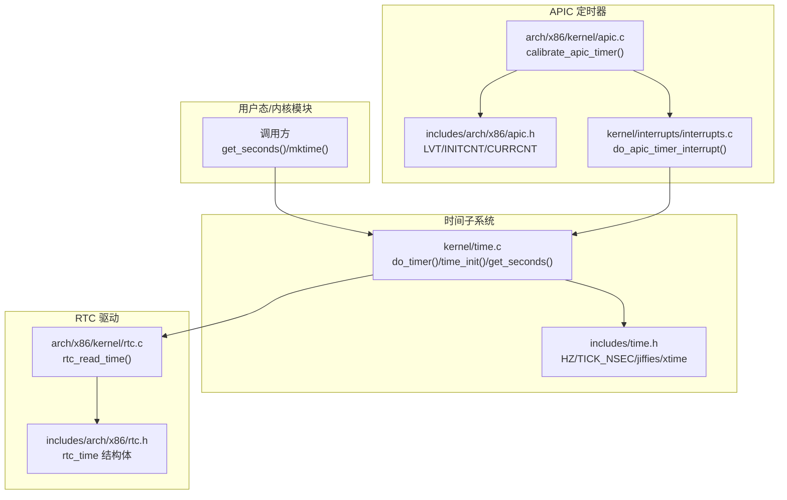
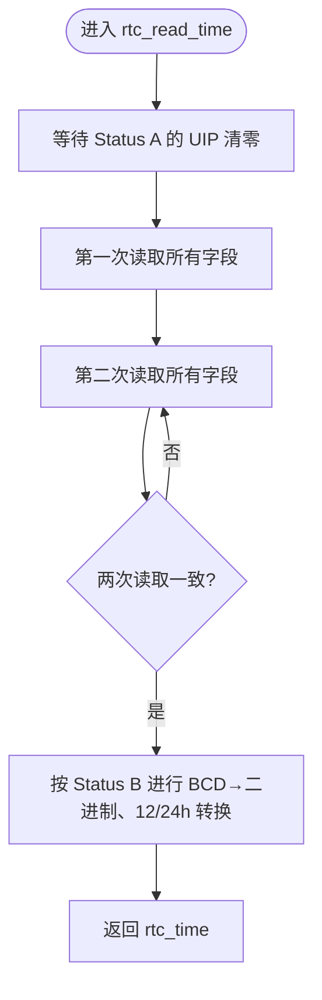
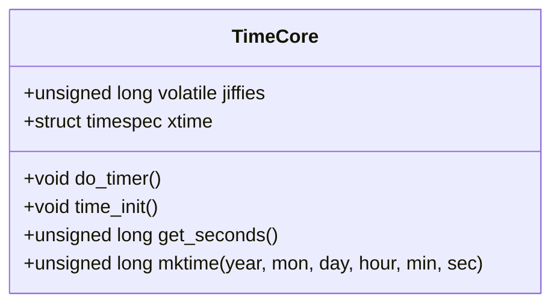
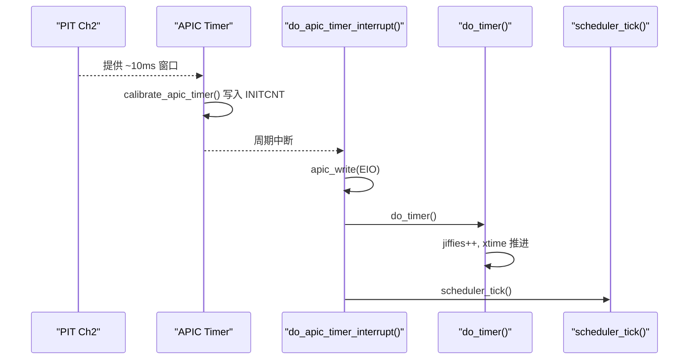
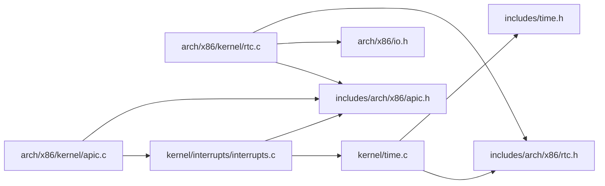

# 时间管理系统

<cite>
**本文引用的文件**
- [includes/time.h](file://includes/time.h)
- [kernel/time.c](file://kernel/time.c)
- [includes/arch/x86/rtc.h](file://includes/arch/x86/rtc.h)
- [arch/x86/kernel/rtc.c](file://arch/x86/kernel/rtc.c)
- [kernel/interrupts/interrupts.c](file://kernel/interrupts/interrupts.c)
- [arch/x86/kernel/apic.c](file://arch/x86/kernel/apic.c)
- [includes/arch/x86/apic.h](file://includes/arch/x86/apic.h)
- [README.md](file://README.md)
</cite>

## 目录
1. [简介](#简介)
2. [项目结构](#项目结构)
3. [核心组件](#核心组件)
4. [架构总览](#架构总览)
5. [详细组件分析](#详细组件分析)
6. [依赖关系分析](#依赖关系分析)
7. [性能考量](#性能考量)
8. [故障排查指南](#故障排查指南)
9. [结论](#结论)
10. [附录](#附录)

## 简介
本系统为 LulaOS 的时间子系统，提供：
- 基于 APIC Timer 的节拍（jiffies）与墙上时钟（xtime）维护
- 从 CMOS RTC 读取硬件时间并转换为 Unix 时间戳
- 在 BSP 上唯一推进全局时间的策略，避免多核重复计时
- 与调度器 tick 的集成，驱动进程时间片递减与抢占

该子系统参考 Linux 2.6.20 的设计思路，将“tick 计数 + 纳秒进位”的方式用于高精度时间推进，并通过 RTC 初始化初始时间。

## 项目结构
时间子系统涉及以下关键路径：
- 接口定义：includes/time.h、includes/arch/x86/rtc.h
- 实现：kernel/time.c、arch/x86/kernel/rtc.c
- 中断与定时器：kernel/interrupts/interrupts.c、arch/x86/kernel/apic.c、includes/arch/x86/apic.h



图表来源
- [kernel/time.c:11-67](file://kernel/time.c#L11-L67)
- [includes/time.h:15-61](file://includes/time.h#L15-L61)
- [arch/x86/kernel/rtc.c:52-110](file://arch/x86/kernel/rtc.c#L52-L110)
- [includes/arch/x86/rtc.h:16-34](file://includes/arch/x86/rtc.h#L16-L34)
- [arch/x86/kernel/apic.c:125-180](file://arch/x86/kernel/apic.c#L125-L180)
- [includes/arch/x86/apic.h:45-50](file://includes/arch/x86/apic.h#L45-L50)
- [kernel/interrupts/interrupts.c:118-134](file://kernel/interrupts/interrupts.c#L118-L134)

章节来源
- [includes/time.h:15-61](file://includes/time.h#L15-L61)
- [kernel/time.c:11-90](file://kernel/time.c#L11-L90)
- [includes/arch/x86/rtc.h:16-34](file://includes/arch/x86/rtc.h#L16-L34)
- [arch/x86/kernel/rtc.c:52-110](file://arch/x86/kernel/rtc.c#L52-L110)
- [kernel/interrupts/interrupts.c:118-134](file://kernel/interrupts/interrupts.c#L118-L134)
- [arch/x86/kernel/apic.c:125-180](file://arch/x86/kernel/apic.c#L125-L180)
- [includes/arch/x86/apic.h:45-50](file://includes/arch/x86/apic.h#L45-L50)

## 核心组件
- jiffies：全局 tick 计数器，由 APIC Timer 每 1/HZ 秒递增一次（HZ=100，即 10ms 一次）。
- xtime：墙上时钟，类型为 timespec，维护秒与纳秒；每次 tick 累加 TICK_NSEC，并在溢出时进位到秒。
- time_init：启动时从 CMOS RTC 读取当前时间，转换为 Unix 时间戳写入 xtime。
- do_timer：timer 中断顶层处理，仅 BSP 执行，负责 jiffies++ 与 xtime 推进。
- get_seconds：返回当前 Unix 时间戳（秒）。
- mktime：将年月日时分秒转换为 Unix 时间戳，供 time_init 使用。

章节来源
- [includes/time.h:15-61](file://includes/time.h#L15-L61)
- [kernel/time.c:11-90](file://kernel/time.c#L11-L90)

## 架构总览
时间子系统由“硬件层（RTC/APIC）—驱动层（RTC 驱动）—时间核心（time.c）—中断集成（interrupts.c）”构成。APIC Timer 周期性触发中断，BSP 上的中断处理函数调用 do_timer 推进全局时间；time_init 在启动阶段通过 RTC 设置初始时间。

```mermaid
sequenceDiagram
participant HW as "硬件"
participant APIC as "APIC Timer"
participant ISR as "中断处理<br/>do_apic_timer_interrupt()"
participant TIME as "时间核心<br/>do_timer()"
participant RTC as "RTC 驱动<br/>rtc_read_time()"
participant CORE as "时间核心<br/>time_init()/get_seconds()"
Note over CORE,HW : 启动阶段
CORE->>RTC : 读取当前时间
RTC-->>CORE : rtc_time
CORE->>CORE : mktime → 计算 Unix 时间戳
CORE->>CORE : 写入 xtime.tv_sec/tv_nsec
Note over APIC,CORE : 运行阶段
APIC-->>ISR : 定时中断
ISR->>ISR : 发送 EOI
ISR->>TIME : do_timer()
TIME->>TIME : jiffies++
TIME->>TIME : xtime.tv_nsec += TICK_NSEC; 必要时进位到秒
ISR-->>APIC : 完成中断处理
```

图表来源
- [arch/x86/kernel/apic.c:125-180](file://arch/x86/kernel/apic.c#L125-L180)
- [kernel/interrupts/interrupts.c:118-134](file://kernel/interrupts/interrupts.c#L118-L134)
- [kernel/time.c:53-67](file://kernel/time.c#L53-L67)
- [arch/x86/kernel/rtc.c:52-110](file://arch/x86/kernel/rtc.c#L52-L110)
- [kernel/time.c:74-89](file://kernel/time.c#L74-L89)

## 详细组件分析

### RTC 驱动（CMOS 时间读取）
- 通过 I/O 端口 0x70/0x71 访问 MC146818 兼容 RTC。
- 读取前等待 UIP 清零，避免读到更新中的影子寄存器数据。
- 连续读两次确保跨越秒边界时的数据一致性。
- 根据 Status B 配置进行 BCD/二进制转换以及 12/24 小时制换算。



图表来源
- [arch/x86/kernel/rtc.c:52-110](file://arch/x86/kernel/rtc.c#L52-L110)
- [includes/arch/x86/rtc.h:16-34](file://includes/arch/x86/rtc.h#L16-L34)

章节来源
- [arch/x86/kernel/rtc.c:52-110](file://arch/x86/kernel/rtc.c#L52-L110)
- [includes/arch/x86/rtc.h:16-34](file://includes/arch/x86/rtc.h#L16-L34)

### 时间核心（time.c）
- jiffies：volatile 全局变量，在中断上下文与进程上下文共享。
- xtime：timespec 结构，维护秒与纳秒；每次 tick 累加 TICK_NSEC，溢出时进位到秒。
- do_timer：仅在 BSP 上被调用，保证全局节拍唯一。
- time_init：从 RTC 读取时间，使用 mktime 转换为 Unix 时间戳并写入 xtime。
- get_seconds：直接返回 xtime.tv_sec。



图表来源
- [kernel/time.c:11-90](file://kernel/time.c#L11-L90)
- [includes/time.h:15-61](file://includes/time.h#L15-L61)

章节来源
- [kernel/time.c:11-90](file://kernel/time.c#L11-L90)
- [includes/time.h:15-61](file://includes/time.h#L15-L61)

### APIC 定时器与中断集成
- APIC Timer 校准：使用 PIT Channel 2 作为固定频率参考，测量约 10ms 内的 APIC tick 数，写入 INITCNT 并设置为周期性模式。
- 中断处理：do_apic_timer_interrupt 中先发送 EOI，再在 BSP 上调用 do_timer，随后调用 scheduler_tick 驱动调度器。



图表来源
- [arch/x86/kernel/apic.c:125-180](file://arch/x86/kernel/apic.c#L125-L180)
- [kernel/interrupts/interrupts.c:118-134](file://kernel/interrupts/interrupts.c#L118-L134)
- [includes/arch/x86/apic.h:45-50](file://includes/arch/x86/apic.h#L45-L50)

章节来源
- [arch/x86/kernel/apic.c:125-180](file://arch/x86/kernel/apic.c#L125-L180)
- [kernel/interrupts/interrupts.c:118-134](file://kernel/interrupts/interrupts.c#L118-L134)
- [includes/arch/x86/apic.h:45-50](file://includes/arch/x86/apic.h#L45-L50)

## 依赖关系分析
- kernel/time.c 依赖 includes/time.h（常量与全局声明）、includes/arch/x86/rtc.h（RTC 接口）。
- arch/x86/kernel/rtc.c 依赖 includes/arch/x86/rtc.h、arch/x86/io.h、apic.h、system.h。
- kernel/interrupts/interrupts.c 依赖 apic.h、apic 操作函数，并在 BSP 上调用 do_timer。
- arch/x86/kernel/apic.c 依赖 apic.h 与 io 操作，提供定时器校准与 LVT 配置。



图表来源
- [kernel/time.c:7-9](file://kernel/time.c#L7-L9)
- [arch/x86/kernel/rtc.c:7-10](file://arch/x86/kernel/rtc.c#L7-L10)
- [kernel/interrupts/interrupts.c:118-134](file://kernel/interrupts/interrupts.c#L118-L134)
- [arch/x86/kernel/apic.c:1-10](file://arch/x86/kernel/apic.c#L1-L10)

章节来源
- [kernel/time.c:7-9](file://kernel/time.c#L7-L9)
- [arch/x86/kernel/rtc.c:7-10](file://arch/x86/kernel/rtc.c#L7-L10)
- [kernel/interrupts/interrupts.c:118-134](file://kernel/interrupts/interrupts.c#L118-L134)
- [arch/x86/kernel/apic.c:1-10](file://arch/x86/kernel/apic.c#L1-L10)

## 性能考量
- 节拍精度：HZ=100，TICK_NSEC = 10ms；xtime 以纳秒为单位推进，减少累积误差。
- 多核安全：do_timer 仅在 BSP 上执行，避免多 CPU 重复累加导致时间过快。
- RTC 读取稳定性：等待 UIP 清零并双读校验，防止撕裂数据影响初始时间设置。
- 中断开销：中断处理中优先发送 EOI，降低阻塞风险；do_timer 逻辑简洁，避免耗时操作。

[本节为通用指导，不直接分析具体文件]

## 故障排查指南
- 时间不走或走得太快：
  - 检查 APIC Timer 校准是否成功（查看打印信息中的 ticks per ms），确认 INITCNT 已写入且周期性模式启用。
  - 确认中断处理函数正确调用 do_timer，且仅在 BSP 上执行。
- 初始时间不正确：
  - 检查 RTC 读取流程是否等待 UIP 清零并进行双读校验。
  - 确认 Status B 的 BCD/二进制与 12/24 小时制标志是否正确处理。
- 调度异常：
  - 确认 do_apic_timer_interrupt 在 do_timer 之后调用 scheduler_tick，确保时间片递减与抢占标志置位正常。

章节来源
- [arch/x86/kernel/apic.c:125-180](file://arch/x86/kernel/apic.c#L125-L180)
- [kernel/interrupts/interrupts.c:118-134](file://kernel/interrupts/interrupts.c#L118-L134)
- [arch/x86/kernel/rtc.c:52-110](file://arch/x86/kernel/rtc.c#L52-L110)

## 结论
LulaOS 时间子系统通过 APIC Timer 提供稳定的节拍与墙上时钟，结合 CMOS RTC 初始化初始时间，采用 BSP 唯一推进的策略保证多核环境下的时间一致性。整体设计简洁高效，满足基础操作系统对时间与调度的需求。

[本节为总结性内容，不直接分析具体文件]

## 附录
- 构建与运行：参见 README 中的工具链与运行命令。

章节来源
- [README.md:77-81](file://README.md#L77-L81)