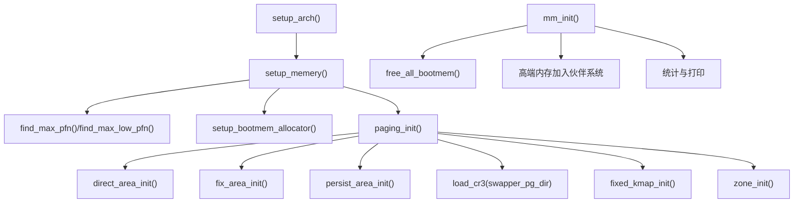
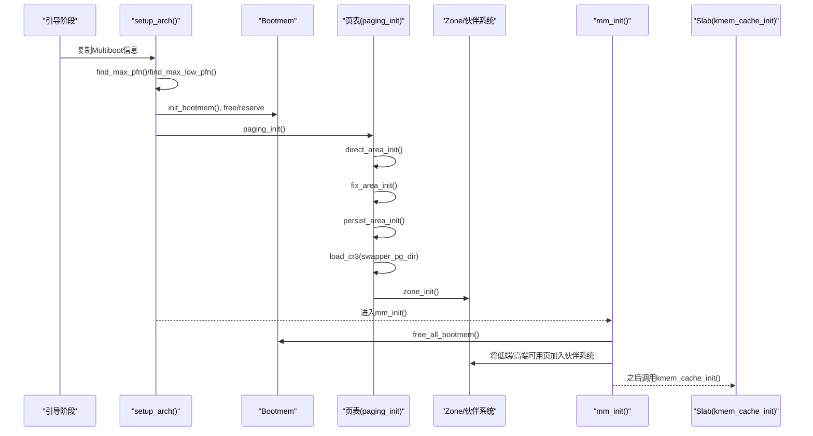
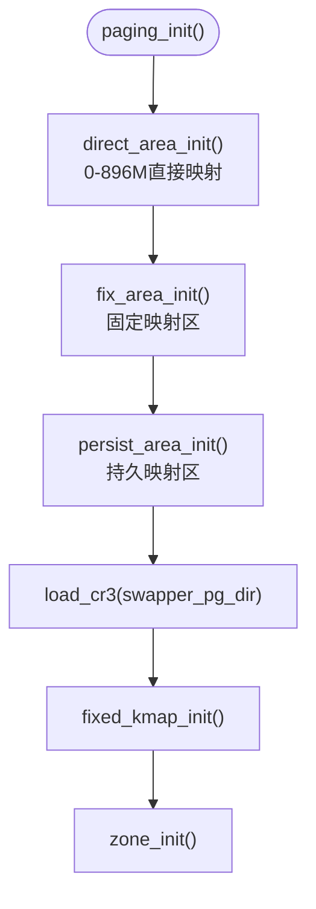
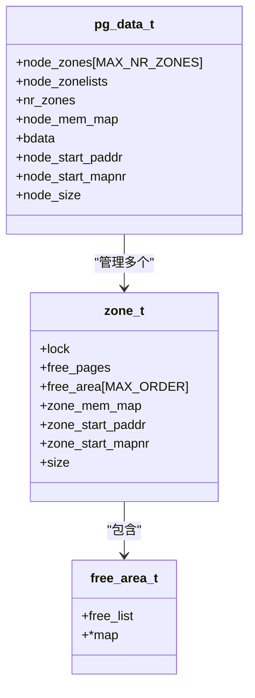
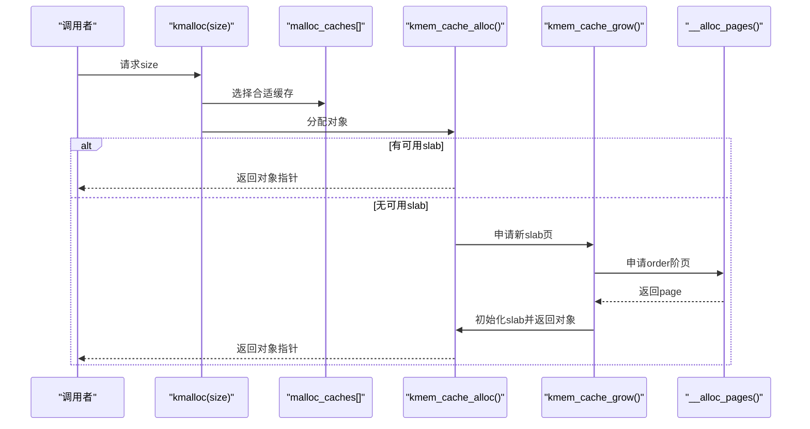

# 内存初始化

<cite>
**本文引用的文件**
- [arch/x86/kernel/mm/mm.c](file://arch/x86/kernel/mm/mm.c)
- [kernel/mm/bootmem.c](file://kernel/mm/bootmem.c)
- [kernel/mm/mmzone.c](file://kernel/mm/mmzone.c)
- [kernel/mm/slab.c](file://kernel/mm/slab.c)
- [includes/arch/x86/pgtable.h](file://includes/arch/x86/pgtable.h)
- [includes/arch/x86/page.h](file://includes/arch/x86/page.h)
- [includes/mm/mmzone.h](file://includes/mm/mmzone.h)
- [includes/mm/bootmem.h](file://includes/mm/bootmem.h)
- [includes/mm/slab.h](file://includes/mm/slab.h)
- [arch/x86/entry.S](file://arch/x86/entry.S)
- [arch/x86/kernel/setup.c](file://arch/x86/kernel/setup.c)
- [linker.lds](file://linker.lds)
</cite>

## 目录
1. [简介](#简介)
2. [项目结构](#项目结构)
3. [核心组件](#核心组件)
4. [架构总览](#架构总览)
5. [详细组件分析](#详细组件分析)
6. [依赖关系分析](#依赖关系分析)
7. [性能考量](#性能考量)
8. [故障排查指南](#故障排查指南)
9. [结论](#结论)
10. [附录](#附录)

## 简介
本文面向LulaOS的内存子系统，系统性梳理启动过程中的物理内存检测、页表构建、伙伴系统与Slab分配器的早期初始化，以及内核映像、BSS段与堆栈区域的布局。目标是帮助开发者理解从引导到可用内存管理就绪的关键时序、关键数据结构与实现细节。

## 项目结构
LulaOS的内存相关代码分布在以下位置：
- 架构相关页表与入口：arch/x86/*（页表宏、CR3加载、SMP trampoline等）
- 内存管理核心：kernel/mm/*（bootmem、伙伴系统、slab）
- 头文件：includes/*（页表、zone、bootmem、slab接口）
- 启动流程与链接布局：arch/x86/kernel/setup.c、linker.lds

图表来源
- [arch/x86/kernel/setup.c:182-196](file://arch/x86/kernel/setup.c#L182-L196)
- [arch/x86/kernel/mm/mm.c:117-134](file://arch/x86/kernel/mm/mm.c#L117-L134)
- [kernel/mm/bootmem.c:12-28](file://kernel/mm/bootmem.c#L12-L28)
- [kernel/mm/mmzone.c:61-150](file://kernel/mm/mmzone.c#L61-L150)

章节来源
- [arch/x86/kernel/setup.c:182-196](file://arch/x86/kernel/setup.c#L182-L196)
- [arch/x86/kernel/mm/mm.c:117-134](file://arch/x86/kernel/mm/mm.c#L117-L134)

## 核心组件
- 物理内存检测与保留：通过Multiboot信息建立位图，标记可用/保留区域
- 启动期分配器（Bootmem）：为早期数据结构分配内存，维护位图
- 页表初始化：建立直接映射、固定映射、持久映射，并加载CR3
- Zone与伙伴系统：划分DMA/Normal/HighMem区，维护空闲块链表与位图
- Slab分配器：创建对象缓存，提供kmalloc/kfree
- 链接布局：内核映像、BSS段、页表占位等由链接脚本定义

章节来源
- [arch/x86/kernel/setup.c:45-118](file://arch/x86/kernel/setup.c#L45-L118)
- [kernel/mm/bootmem.c:12-28](file://kernel/mm/bootmem.c#L12-L28)
- [arch/x86/kernel/mm/mm.c:24-134](file://arch/x86/kernel/mm/mm.c#L24-L134)
- [kernel/mm/mmzone.c:61-150](file://kernel/mm/mmzone.c#L61-L150)
- [kernel/mm/slab.c:249-296](file://kernel/mm/slab.c#L249-L296)
- [linker.lds:1-103](file://linker.lds#L1-L103)

## 架构总览
下图展示了内存初始化的整体流程与关键模块交互：

图表来源
- [arch/x86/kernel/setup.c:182-196](file://arch/x86/kernel/setup.c#L182-L196)
- [arch/x86/kernel/mm/mm.c:117-134](file://arch/x86/kernel/mm/mm.c#L117-L134)
- [kernel/mm/bootmem.c:12-28](file://kernel/mm/bootmem.c#L12-L28)
- [kernel/mm/mmzone.c:61-150](file://kernel/mm/mmzone.c#L61-L150)
- [kernel/mm/slab.c:249-296](file://kernel/mm/slab.c#L249-L296)

## 详细组件分析

### 物理内存检测与保留（Multiboot + Bootmem）
- 从Multiboot信息中拷贝内存映射，遍历可用区间，计算max_pfn与max_low_pfn，区分低端与高端内存边界
- 初始化bootmem位图，将所有可用区间标记为可分配；随后保留必要的区域（如0-4K、APIC、trampoline、bootmap自身等）
- 提供page_is_ram()用于判断某页是否属于可用RAM

图表来源
- [arch/x86/kernel/setup.c:24-39](file://arch/x86/kernel/setup.c#L24-L39)
- [arch/x86/kernel/setup.c:45-118](file://arch/x86/kernel/setup.c#L45-L118)
- [arch/x86/kernel/setup.c:123-176](file://arch/x86/kernel/setup.c#L123-L176)
- [kernel/mm/bootmem.c:12-28](file://kernel/mm/bootmem.c#L12-L28)
- [kernel/mm/bootmem.c:33-71](file://kernel/mm/bootmem.c#L33-L71)

章节来源
- [arch/x86/kernel/setup.c:45-118](file://arch/x86/kernel/setup.c#L45-L118)
- [arch/x86/kernel/setup.c:123-176](file://arch/x86/kernel/setup.c#L123-L176)
- [kernel/mm/bootmem.c:12-71](file://kernel/mm/bootmem.c#L12-L71)

### 页表构建过程（PGD/PDE/PTE）
- 直接映射：将0~896M物理地址以PAGE_KERNEL属性映射到内核虚拟空间，逐页设置PTE，并填充PGD项指向PTE页
- 固定映射：为固定地址范围（如设备寄存器）预留4M对齐的映射，按需分配PTE页
- 持久映射：为PKMAP区域建立映射，便于临时映射高端内存
- 加载CR3：将swapper_pg_dir载入CR3，启用分页
- 固定kmap与zone初始化：完成后续高级功能所需的基础设施

图表来源
- [arch/x86/kernel/mm/mm.c:24-134](file://arch/x86/kernel/mm/mm.c#L24-L134)
- [includes/arch/x86/pgtable.h:14-17](file://includes/arch/x86/pgtable.h#L14-L17)
- [includes/arch/x86/pgtable.h:24-63](file://includes/arch/x86/pgtable.h#L24-L63)
- [includes/arch/x86/pgtable.h:92-107](file://includes/arch/x86/pgtable.h#L92-L107)

章节来源
- [arch/x86/kernel/mm/mm.c:24-134](file://arch/x86/kernel/mm/mm.c#L24-L134)
- [includes/arch/x86/pgtable.h:14-17](file://includes/arch/x86/pgtable.h#L14-L17)
- [includes/arch/x86/pgtable.h:24-63](file://includes/arch/x86/pgtable.h#L24-L63)
- [includes/arch/x86/pgtable.h:92-107](file://includes/arch/x86/pgtable.h#L92-L107)

### 内存布局配置（内核映像、BSS段、堆栈）
- 链接脚本将内核映像置于高地址（PAGE_OFFSET+偏移），按节组织.text/.data/.bss等
- .bss中包含页表占位pg0，确保页表数据位于BSS段末尾附近
- 内核符号_text/_etext/_edata/_bss/_end用于统计代码/数据大小，辅助内存统计
- 进程切换时通过current宏（esp & ~0x1FFF）获取task_struct，要求线程栈8KB对齐

图表来源
- [linker.lds:1-103](file://linker.lds#L1-L103)
- [arch/x86/kernel/mm/mm.c:19-19](file://arch/x86/kernel/mm/mm.c#L19-L19)
- [includes/arch/x86/page.h:5-6](file://includes/arch/x86/page.h#L5-L6)
- [arch/x86/entry.S:520-583](file://arch/x86/entry.S#L520-L583)

章节来源
- [linker.lds:1-103](file://linker.lds#L1-L103)
- [arch/x86/kernel/mm/mm.c:19-19](file://arch/x86/kernel/mm/mm.c#L19-L19)
- [includes/arch/x86/page.h:5-6](file://includes/arch/x86/page.h#L5-L6)
- [arch/x86/entry.S:520-583](file://arch/x86/entry.S#L520-L583)

### 伙伴系统早期初始化
- zone_init()根据max_low_pfn与highstart/end_pfn划分DMA/Normal/HighMem三个区
- 为每个区分配free_area[]（包含空闲链表与位图），并初始化page数组（mem_map）
- 将bootmem释放后的可用页加入伙伴系统，支持order从0到MAX_ORDER-1的分配/回收
- __alloc_pages()按zonelist顺序查找空闲块，必要时拆分大块；__free_pages()尝试合并相邻块

图表来源
- [includes/mm/mmzone.h:24-63](file://includes/mm/mmzone.h#L24-L63)
- [kernel/mm/mmzone.c:61-150](file://kernel/mm/mmzone.c#L61-L150)
- [kernel/mm/mmzone.c:153-219](file://kernel/mm/mmzone.c#L153-L219)
- [kernel/mm/mmzone.c:248-329](file://kernel/mm/mmzone.c#L248-L329)

章节来源
- [kernel/mm/mmzone.c:61-150](file://kernel/mm/mmzone.c#L61-L150)
- [kernel/mm/mmzone.c:153-219](file://kernel/mm/mmzone.c#L153-L219)
- [kernel/mm/mmzone.c:248-329](file://kernel/mm/mmzone.c#L248-L329)
- [includes/mm/mmzone.h:24-63](file://includes/mm/mmzone.h#L24-L63)

### Slab分配器早期初始化
- kmem_cache_init()创建通用大小缓存（32/64/.../8192字节），供kmalloc/kfree使用
- 支持ON_SLAB与OFF_SLAB两种模式：大对象启用OFF_SLAB，描述符独立分配，提升对齐与利用率
- 首次分配触发kmem_cache_grow()向伙伴系统申请页，构建slab页并初始化空闲对象链表
- kmalloc()在malloc_caches[]中选择最小满足size的缓存进行分配

图表来源
- [kernel/mm/slab.c:249-296](file://kernel/mm/slab.c#L249-L296)
- [kernel/mm/slab.c:304-384](file://kernel/mm/slab.c#L304-L384)
- [kernel/mm/slab.c:392-450](file://kernel/mm/slab.c#L392-L450)
- [kernel/mm/slab.c:518-540](file://kernel/mm/slab.c#L518-L540)

章节来源
- [kernel/mm/slab.c:249-296](file://kernel/mm/slab.c#L249-L296)
- [kernel/mm/slab.c:304-384](file://kernel/mm/slab.c#L304-L384)
- [kernel/mm/slab.c:392-450](file://kernel/mm/slab.c#L392-L450)
- [kernel/mm/slab.c:518-540](file://kernel/mm/slab.c#L518-L540)

### 内存初始化时序与关键数据结构
- 时序
  - setup_arch() → setup_memery() → find_max_pfn()/find_max_low_pfn()
  - setup_bootmem_allocator() → paging_init() → zone_init()
  - mm_init() → free_all_bootmem() → 高端内存加入伙伴系统
  - 最后kmem_cache_init() → 通用缓存就绪
- 关键数据结构
  - bootmem_data_t：启动期位图与边界
  - pg_data_t/zone_t/free_area_t：伙伴系统核心
  - slab_t/kmem_cache_t：对象缓存与slab页描述符
  - mem_map：全局page数组，映射物理页到内核结构

章节来源
- [arch/x86/kernel/setup.c:182-196](file://arch/x86/kernel/setup.c#L182-L196)
- [kernel/mm/bootmem.c:12-28](file://kernel/mm/bootmem.c#L12-L28)
- [kernel/mm/mmzone.c:61-150](file://kernel/mm/mmzone.c#L61-L150)
- [arch/x86/kernel/mm/mm.c:145-205](file://arch/x86/kernel/mm/mm.c#L145-L205)
- [kernel/mm/slab.c:249-296](file://kernel/mm/slab.c#L249-L296)
- [includes/mm/bootmem.h:12-19](file://includes/mm/bootmem.h#L12-L19)
- [includes/mm/mmzone.h:35-63](file://includes/mm/mmzone.h#L35-L63)
- [includes/mm/slab.h:45-86](file://includes/mm/slab.h#L45-L86)

## 依赖关系分析
- setup.c依赖Multiboot信息与页表宏，驱动内存检测与页表初始化
- mm.c依赖pgtable.h/page.h进行页表操作，依赖bootmem与mmzone进行内存管理
- bootmem.c依赖mmzone.h提供的page数组与工具函数
- mmzone.c依赖pgtable.h与highmem.h，实现伙伴系统
- slab.c依赖mmzone.h与mm.h，最终通过伙伴系统分配页

图表来源
- [arch/x86/kernel/setup.c:1-11](file://arch/x86/kernel/setup.c#L1-L11)
- [arch/x86/kernel/mm/mm.c:1-9](file://arch/x86/kernel/mm/mm.c#L1-L9)
- [kernel/mm/bootmem.c:1-6](file://kernel/mm/bootmem.c#L1-L6)
- [kernel/mm/mmzone.c:1-12](file://kernel/mm/mmzone.c#L1-L12)
- [kernel/mm/slab.c:1-7](file://kernel/mm/slab.c#L1-L7)

章节来源
- [arch/x86/kernel/setup.c:1-11](file://arch/x86/kernel/setup.c#L1-L11)
- [arch/x86/kernel/mm/mm.c:1-9](file://arch/x86/kernel/mm/mm.c#L1-L9)
- [kernel/mm/bootmem.c:1-6](file://kernel/mm/bootmem.c#L1-L6)
- [kernel/mm/mmzone.c:1-12](file://kernel/mm/mmzone.c#L1-L12)
- [kernel/mm/slab.c:1-7](file://kernel/mm/slab.c#L1-L7)

## 性能考量
- 直接映射与固定映射一次性建立，避免频繁分配页表页
- 伙伴系统通过位图与链表快速定位空闲块，减少碎片
- Slab分配器对常用尺寸预建缓存，降低分配开销；大对象启用OFF_SLAB提高对齐与利用率
- 启动阶段尽量使用bootmem，减少复杂逻辑带来的不确定性

[本节为通用指导，不直接分析具体文件]

## 故障排查指南
- 页表未正确加载导致崩溃：检查load_cr3是否执行，PGD/PTE是否正确设置
- 内存不足或OOM：确认free_all_bootmem()后伙伴系统是否收到足够页面；检查slab grow失败日志
- 高端内存访问异常：确认PKMAP/fixed_kmap已初始化，且page_is_ram()判断正确
- 分配失败：检查gfp_mask与zonelist选择，确认zone大小与空闲块状态

章节来源
- [arch/x86/kernel/mm/mm.c:117-134](file://arch/x86/kernel/mm/mm.c#L117-L134)
- [kernel/mm/slab.c:130-199](file://kernel/mm/slab.c#L130-L199)
- [kernel/mm/mmzone.c:248-329](file://kernel/mm/mmzone.c#L248-L329)
- [arch/x86/kernel/setup.c:45-118](file://arch/x86/kernel/setup.c#L45-L118)

## 结论
LulaOS的内存初始化遵循“先检测、再映射、后管理”的原则：通过Multiboot信息识别物理内存，使用bootmem进行早期分配，建立直接/固定/持久映射并加载CR3，随后初始化zone与伙伴系统，最终启用Slab分配器提供高效的小对象分配。清晰的时序与数据结构设计使内存子系统具备可扩展性与稳定性。

[本节为总结性内容，不直接分析具体文件]

## 附录
- 关键常量与宏
  - PAGE_OFFSET、PGDIR_SHIFT、PTRS_PER_PGD/PTE
  - _PAGE_*标志位、PAGE_KERNEL等页表属性
  - ZONE_DMA/ZONE_NORMAL/ZONE_HIGHMEM分区边界
- 关键函数路径
  - 物理内存检测：setup.c中的find_max_pfn/find_max_low_pfn
  - 启动期分配：bootmem.c中的init_bootmem/free_bootmem/reserve_bootmem/__alloc_bootmem
  - 页表构建：mm.c中的direct_area_init/fix_area_init/persist_area_init/paging_init
  - 伙伴系统：mmzone.c中的zone_init/__alloc_pages/__free_pages
  - Slab分配：slab.c中的kmem_cache_init/kmem_cache_create/kmem_cache_alloc/kmalloc

章节来源
- [includes/arch/x86/pgtable.h:14-63](file://includes/arch/x86/pgtable.h#L14-L63)
- [includes/mm/mmzone.h:13-22](file://includes/mm/mmzone.h#L13-L22)
- [arch/x86/kernel/setup.c:68-118](file://arch/x86/kernel/setup.c#L68-L118)
- [kernel/mm/bootmem.c:12-177](file://kernel/mm/bootmem.c#L12-L177)
- [arch/x86/kernel/mm/mm.c:24-134](file://arch/x86/kernel/mm/mm.c#L24-L134)
- [kernel/mm/mmzone.c:61-329](file://kernel/mm/mmzone.c#L61-L329)
- [kernel/mm/slab.c:249-540](file://kernel/mm/slab.c#L249-L540)