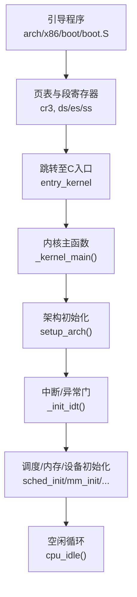
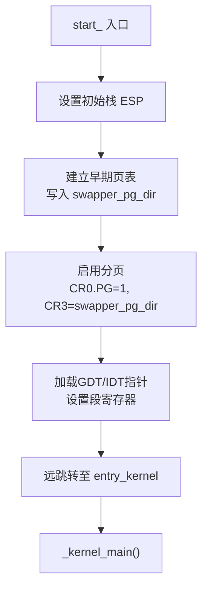
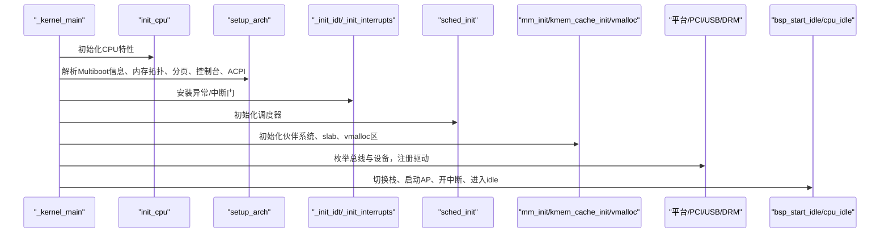
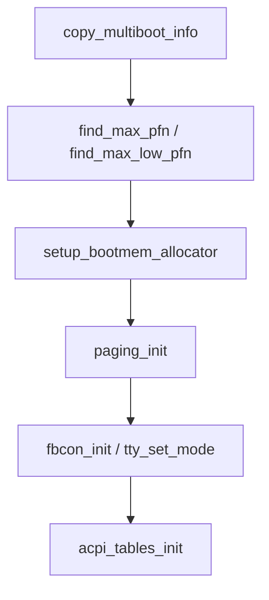
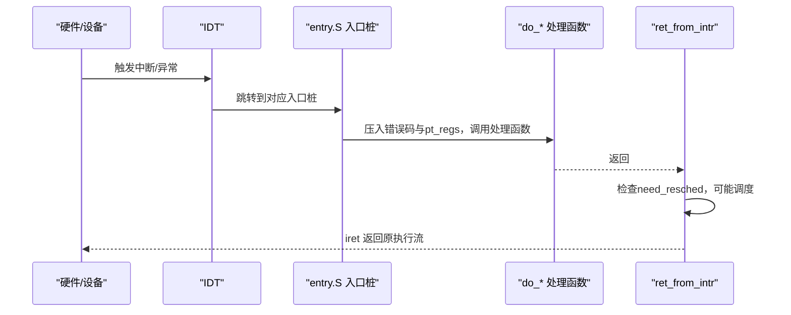
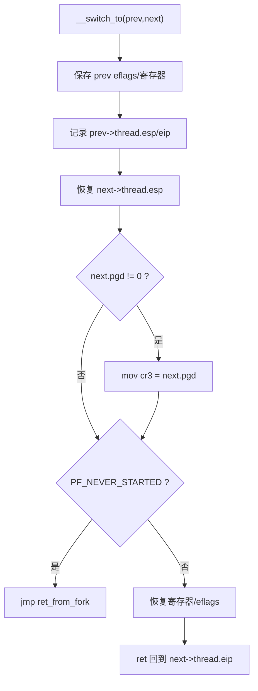
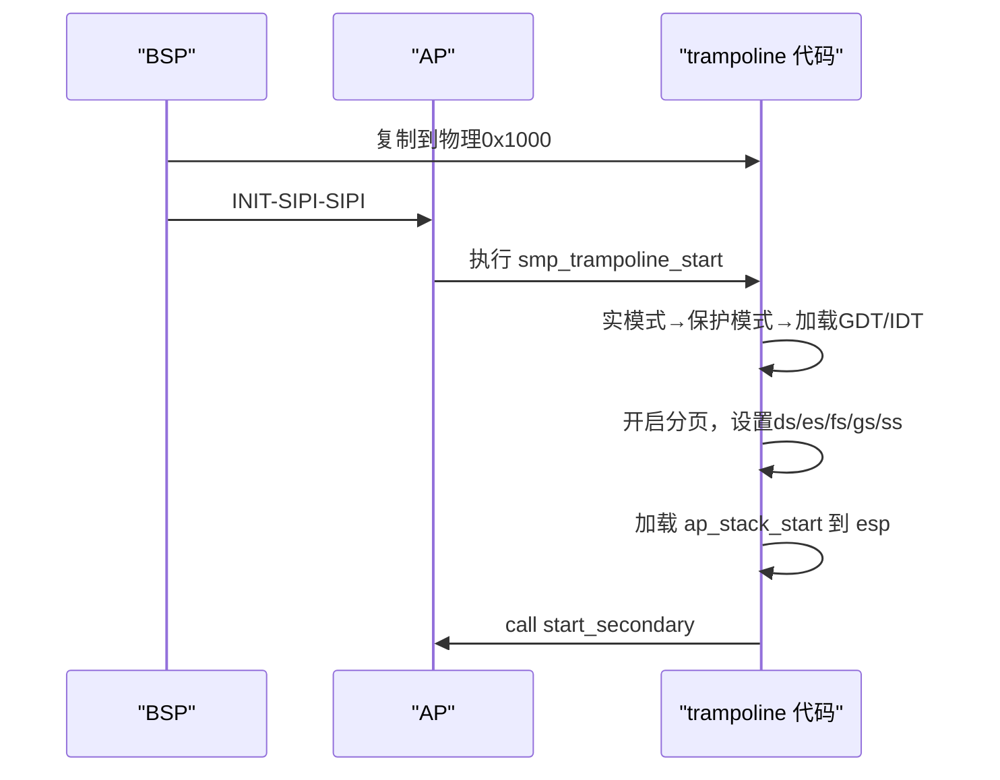
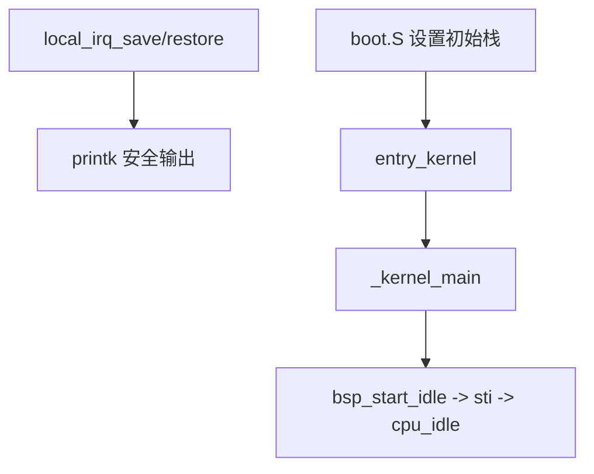
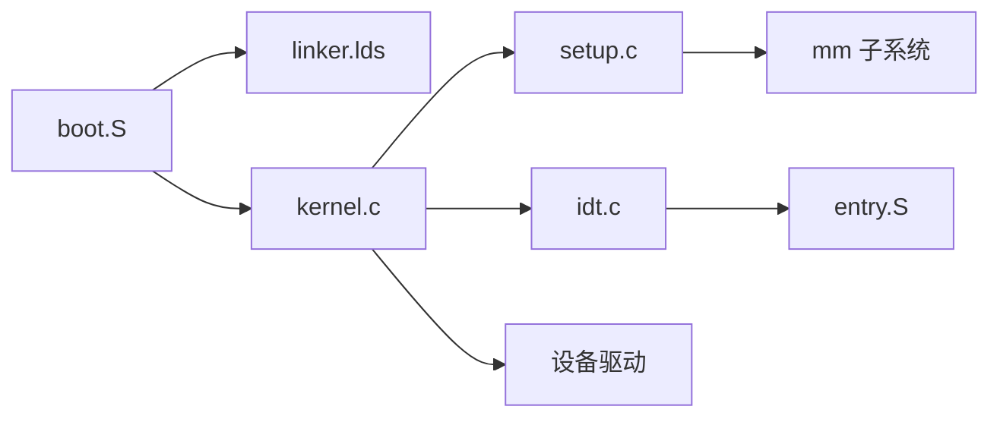

# 内核入口点

<cite>
**本文引用的文件**
- [arch/x86/boot/boot.S](file://arch/x86/boot/boot.S)
- [arch/x86/entry.S](file://arch/x86/entry.S)
- [kernel/kernel.c](file://kernel/kernel.c)
- [arch/x86/kernel/setup.c](file://arch/x86/kernel/setup.c)
- [includes/arch/x86/setup.h](file://includes/arch/x86/setup.h)
- [arch/x86/kernel/gdt.c](file://arch/x86/kernel/gdt.c)
- [arch/x86/kernel/idt.c](file://arch/x86/kernel/idt.c)
- [includes/arch/x86/system.h](file://includes/arch/x86/system.h)
- [kernel/printk.c](file://kernel/printk.c)
- [linker.lds](file://linker.lds)
</cite>

## 目录
1. [简介](#简介)
2. [项目结构](#项目结构)
3. [核心组件](#核心组件)
4. [架构总览](#架构总览)
5. [详细组件分析](#详细组件分析)
6. [依赖关系分析](#依赖关系分析)
7. [性能考虑](#性能考虑)
8. [故障排查指南](#故障排查指南)
9. [结论](#结论)

## 简介
本文面向LulaOS开发者，系统性梳理x86平台下的内核启动与入口流程，重点解释从引导程序到C语言主函数、再到子系统初始化序列的完整路径。文档涵盖：
- 汇编入口到C语言接口的映射（boot.S → entry_kernel → _kernel_main）
- 中断禁用、栈设置、页表建立等关键步骤
- setup阶段的硬件检测与内存配置
- 中断/异常处理入口与调度切换机制
- 多核AP启动的trampoline流程
- 为调试和扩展提供可操作的参考

## 项目结构
LulaOS在x86平台的入口由引导代码、链接脚本、以及内核C入口共同构成：
- 引导阶段：boot.S负责最小化环境搭建（栈、页表、GDT/IDT占位），并跳转到C入口
- 链接脚本：linker.lds定义段布局、入口符号、以及trampoline段的物理位置
- 内核入口：entry.S提供中断/系统调用/上下文切换等底层入口；kernel.c提供高层初始化编排
- 架构相关setup：setup.c完成内存拓扑解析、bootmem分配器初始化、分页初始化等



图表来源
- [arch/x86/boot/boot.S:61-121](file://arch/x86/boot/boot.S#L61-L121)
- [kernel/kernel.c:73-139](file://kernel/kernel.c#L73-L139)
- [arch/x86/kernel/setup.c:201-214](file://arch/x86/kernel/setup.c#L201-L214)
- [arch/x86/kernel/idt.c:284-331](file://arch/x86/kernel/idt.c#L284-L331)

章节来源
- [arch/x86/boot/boot.S:1-191](file://arch/x86/boot/boot.S#L1-L191)
- [linker.lds:1-103](file://linker.lds#L1-L103)

## 核心组件
- 引导与入口
  - boot.S：构建初始栈、建立早期页表、加载GDT/IDT指针、远跳转到entry_kernel
  - linker.lds：定义ENTRY(start_)、.multiboot/.text/.trampoline等段布局
- 内核主流程
  - kernel.c中的_kernel_main：CPU初始化、架构setup、中断门、调度、内存、设备驱动、图形子系统、进入idle
- 架构setup
  - setup.c：复制Multiboot信息、扫描内存映射、计算min/max pfn、初始化bootmem、建立3G~4G分页、初始化控制台与ACPI
- 中断与异常
  - entry.S：统一的异常/中断入口、ret_from_intr、__switch_to、ret_from_fork、SMP trampoline
  - idt.c：填充IDT，将向量号映射到具体处理函数或通用入口桩
- 系统工具
  - system.h：cli/sti/safe_halt等内联宏
  - printk.c：SMP安全的打印输出

章节来源
- [arch/x86/boot/boot.S:61-121](file://arch/x86/boot/boot.S#L61-L121)
- [kernel/kernel.c:73-139](file://kernel/kernel.c#L73-L139)
- [arch/x86/kernel/setup.c:201-214](file://arch/x86/kernel/setup.c#L201-L214)
- [arch/x86/entry.S:41-58](file://arch/x86/entry.S#L41-L58)
- [arch/x86/kernel/idt.c:284-331](file://arch/x86/kernel/idt.c#L284-L331)
- [includes/arch/x86/system.h:12-32](file://includes/arch/x86/system.h#L12-L32)
- [kernel/printk.c:21-35](file://kernel/printk.c#L21-L35)

## 架构总览
下图展示了从引导到内核主函数的关键调用链与环境切换过程。

```mermaid
sequenceDiagram
participant Boot as "引导程序<br/>boot.S"
participant Link as "链接脚本<br/>linker.lds"
participant Entry as "入口汇编<br/>entry.S"
participant Kernel as "内核主函数<br/>kernel.c"
participant Setup as "架构setup<br/>setup.c"
participant IDT as "中断门<br/>idt.c"
Note over Boot,Link : 链接入口为start_，段布局由linker.lds定义
Boot->>Boot : 设置初始栈、建立早期页表
Boot->>Boot : 加载GDT/IDT指针，设置段寄存器
Boot->>Entry : 远跳转至entry_kernel
Entry->>Kernel : 调用_kernel_main()
Kernel->>Setup : setup_arch()
Setup-->>Kernel : 完成内存拓扑与分页初始化
Kernel->>IDT : _init_idt()
Kernel->>Kernel : sched_init()/mm_init()/设备初始化
Kernel->>Kernel : bsp_start_idle() -> cpu_idle()
```

图表来源
- [arch/x86/boot/boot.S:61-121](file://arch/x86/boot/boot.S#L61-L121)
- [kernel/kernel.c:73-139](file://kernel/kernel.c#L73-L139)
- [arch/x86/kernel/setup.c:201-214](file://arch/x86/kernel/setup.c#L201-L214)
- [arch/x86/kernel/idt.c:284-331](file://arch/x86/kernel/idt.c#L284-L331)
- [linker.lds:1-21](file://linker.lds#L1-L21)

## 详细组件分析

### 引导与入口：从boot.S到entry_kernel
- 栈设置
  - 在.bss中预留初始栈空间，并将ESP指向栈顶附近，确保后续C调用安全
- 页表建立
  - 构造swapper_pg_dir，将低地址区域映射到虚拟地址，开启CR0.PG与CR3
- 段寄存器与描述符
  - 加载GDT指针与IDT指针，设置DS/ES/FS/GS/SS为内核数据段选择子
- 跳转至内核主流程
  - 通过retf远返回到entry_kernel，再调用C函数_kernel_main



图表来源
- [arch/x86/boot/boot.S:29-121](file://arch/x86/boot/boot.S#L29-L121)
- [linker.lds:1-21](file://linker.lds#L1-L21)

章节来源
- [arch/x86/boot/boot.S:29-121](file://arch/x86/boot/boot.S#L29-L121)
- [linker.lds:1-21](file://linker.lds#L1-L21)

### 内核主函数：_kernel_main的执行流程
- CPU初始化：init_cpu
- 架构setup：setup_arch（内存拓扑、分页、控制台、ACPI）
- 中断门初始化：_init_idt、_init_interrupts
- 调度与内存：sched_init、mm_init、kmem_cache_init、vmalloc_area_init
- 设备总线与驱动：platform_bus_init、ACPI平台设备注册、i8042、键盘、鼠标、PCI、ATA、USB/UHCI
- 图形子系统：DRM核心、Bochs VBE驱动、FB helper、测试图像
- 切换到init线程栈并进入空闲循环：bsp_start_idle → smp_init → sti → cpu_idle



图表来源
- [kernel/kernel.c:73-139](file://kernel/kernel.c#L73-L139)

章节来源
- [kernel/kernel.c:73-139](file://kernel/kernel.c#L73-L139)

### setup阶段：硬件检测与配置
- Multiboot信息复制
  - 将位于1MB以下的multiboot_info复制到安全区域，并重写mmap地址以指向拷贝后的内存映射表
- 内存拓扑解析
  - find_max_pfn：遍历内存映射，计算最大可用页帧
  - find_max_low_pfn：限制直接映射上限与高内存范围
- 启动期分配器
  - setup_bootmem_allocator：初始化bootmem，标记可用/保留区域（如0~8K、APIC、内核与bitmap等）
- 分页初始化
  - paging_init：建立3G~4G映射，使内核能使用高端内存
- 控制台与ACPI
  - fbcon_init：初始化帧缓冲控制台
  - acpi_tables_init：加载并解析ACPI表



图表来源
- [arch/x86/kernel/setup.c:24-39](file://arch/x86/kernel/setup.c#L24-L39)
- [arch/x86/kernel/setup.c:94-118](file://arch/x86/kernel/setup.c#L94-L118)
- [arch/x86/kernel/setup.c:123-176](file://arch/x86/kernel/setup.c#L123-L176)
- [arch/x86/kernel/setup.c:182-196](file://arch/x86/kernel/setup.c#L182-L196)
- [arch/x86/kernel/setup.c:201-214](file://arch/x86/kernel/setup.c#L201-L214)

章节来源
- [arch/x86/kernel/setup.c:24-214](file://arch/x86/kernel/setup.c#L24-L214)
- [includes/arch/x86/setup.h:6-18](file://includes/arch/x86/setup.h#L6-L18)

### 中断与异常：入口、路由与返回
- 统一入口与恢复
  - interrupt_warpper：保存寄存器、设置内核段、压入错误码与pt_regs指针，调用对应do_*处理函数
  - ret_from_intr：检查need_resched，必要时调度后恢复现场
- 异常与设备中断
  - 所有异常向量在entry.S中生成入口桩，统一转发到do_*
  - BUILD_IRQ为0x20~0xFF生成独立入口，压入向量号以便do_IRQ识别源
- IDT初始化
  - idt.c将各向量映射到trap/interrupt/system门，覆盖设备IRQ区间，并设置系统调用门



图表来源
- [arch/x86/entry.S:62-91](file://arch/x86/entry.S#L62-L91)
- [arch/x86/entry.S:93-184](file://arch/x86/entry.S#L93-L184)
- [arch/x86/entry.S:191-431](file://arch/x86/entry.S#L191-L431)
- [arch/x86/entry.S:41-58](file://arch/x86/entry.S#L41-L58)
- [arch/x86/kernel/idt.c:284-331](file://arch/x86/kernel/idt.c#L284-L331)

章节来源
- [arch/x86/entry.S:41-58](file://arch/x86/entry.S#L41-L58)
- [arch/x86/entry.S:62-91](file://arch/x86/entry.S#L62-L91)
- [arch/x86/entry.S:93-184](file://arch/x86/entry.S#L93-L184)
- [arch/x86/entry.S:191-431](file://arch/x86/entry.S#L191-L431)
- [arch/x86/kernel/idt.c:284-331](file://arch/x86/kernel/idt.c#L284-L331)

### 进程上下文切换与首次执行
- __switch_to
  - 保存prev的eflags与被调用者保存寄存器，记录prev->thread.esp/eip
  - 恢复next->thread.esp，切换CR3（若存在pgd）
  - 若next从未启动（标志位），跳转到ret_from_fork
- ret_from_fork
  - 清除“从未启动”标志，跳转到thread.eip（可能是kernel_thread_helper或ret_from_intr）



图表来源
- [arch/x86/entry.S:520-583](file://arch/x86/entry.S#L520-L583)
- [arch/x86/entry.S:600-610](file://arch/x86/entry.S#L600-L610)

章节来源
- [arch/x86/entry.S:520-583](file://arch/x86/entry.S#L520-L583)
- [arch/x86/entry.S:600-610](file://arch/x86/entry.S#L600-L610)

### SMP AP Trampoline：多核启动
- BSP将trampoline段复制到物理地址0x1000，发送INIT-SIPI-SIPI启动AP
- AP侧流程：
  - 实模式→保护模式→加载正式GDT/IDT→开启分页→设置AP栈→调用start_secondary
- 缓存一致性：首指令wbinvd确保BSP写入的ap_stack_start被AP正确读取



图表来源
- [arch/x86/entry.S:613-733](file://arch/x86/entry.S#L613-L733)
- [linker.lds:15-21](file://linker.lds#L15-L21)

章节来源
- [arch/x86/entry.S:613-733](file://arch/x86/entry.S#L613-L733)
- [linker.lds:15-21](file://linker.lds#L15-L21)

### 中断禁用、栈设置与内核主函数调用的对应关系
- 中断禁用
  - 在printk等关键路径中使用local_irq_save/restore避免死锁
  - 系统级cli/sti在idle前由bsp_start_idle打开
- 栈设置
  - boot.S设置初始栈；_kernel_main完成后切换到init_thread_union顶部栈
- 内核主函数调用
  - boot.S通过retf远返回到entry_kernel，再调用_kernel_main



图表来源
- [kernel/printk.c:21-35](file://kernel/printk.c#L21-L35)
- [arch/x86/boot/boot.S:29-121](file://arch/x86/boot/boot.S#L29-L121)
- [kernel/kernel.c:42-70](file://kernel/kernel.c#L42-L70)

章节来源
- [kernel/printk.c:21-35](file://kernel/printk.c#L21-L35)
- [arch/x86/boot/boot.S:29-121](file://arch/x86/boot/boot.S#L29-L121)
- [kernel/kernel.c:42-70](file://kernel/kernel.c#L42-L70)

## 依赖关系分析
- 模块耦合
  - boot.S依赖linker.lds定义的段布局与入口符号
  - kernel.c依赖setup.c提供的架构初始化能力
  - idt.c依赖entry.S生成的入口桩与向量常量
  - setup.c依赖Multiboot信息与页表数据结构
- 外部接口
  - Multiboot信息：由引导器传入，包含内存映射等关键信息
  - 设备驱动：通过平台总线与PCI总线发现与初始化



图表来源
- [arch/x86/boot/boot.S:61-121](file://arch/x86/boot/boot.S#L61-L121)
- [linker.lds:1-21](file://linker.lds#L1-L21)
- [kernel/kernel.c:73-139](file://kernel/kernel.c#L73-L139)
- [arch/x86/kernel/setup.c:201-214](file://arch/x86/kernel/setup.c#L201-L214)
- [arch/x86/kernel/idt.c:284-331](file://arch/x86/kernel/idt.c#L284-L331)
- [arch/x86/entry.S:191-431](file://arch/x86/entry.S#L191-L431)

章节来源
- [arch/x86/boot/boot.S:61-121](file://arch/x86/boot/boot.S#L61-L121)
- [linker.lds:1-21](file://linker.lds#L1-L21)
- [kernel/kernel.c:73-139](file://kernel/kernel.c#L73-L139)
- [arch/x86/kernel/setup.c:201-214](file://arch/x86/kernel/setup.c#L201-L214)
- [arch/x86/kernel/idt.c:284-331](file://arch/x86/kernel/idt.c#L284-L331)
- [arch/x86/entry.S:191-431](file://arch/x86/entry.S#L191-L431)

## 性能考虑
- 早期页表与分页
  - 尽早建立swapper_pg_dir可减少后续地址转换开销
- 中断与调度
  - ret_from_intr中按需调度，减少不必要的上下文切换
- 打印输出
  - printk使用自旋锁与关中断保护，避免并发破坏缓冲区与TTY输出
- 多核启动
  - trampoline段放置在固定物理地址，减少AP启动时的寻址复杂度

[本节为通用指导，不直接分析具体文件]

## 故障排查指南
- 常见异常与定位
  - 异常处理会打印EIP、CS、EFLAGS、寄存器与故障点前后指令字节，便于反汇编定位
  - 用户态异常暂不处理直接返回；内核态异常打印后停机，防止无限循环
- 打印问题
  - 确认tty已初始化（fbcon_init后设置模式）
  - 检查printk_lock是否被其他路径持有导致阻塞
- 中断未触发
  - 检查IDT是否正确安装（_init_idt）、向量是否覆盖设备IRQ区间
  - 确认BIOS/ACPI已正确配置APIC定时器与错误向量

章节来源
- [arch/x86/kernel/idt.c:173-205](file://arch/x86/kernel/idt.c#L173-L205)
- [kernel/printk.c:21-35](file://kernel/printk.c#L21-L35)
- [arch/x86/kernel/idt.c:284-331](file://arch/x86/kernel/idt.c#L284-L331)

## 结论
LulaOS的内核入口通过清晰的引导-入口-主流程三段式实现，结合setup阶段的内存与设备初始化，形成稳定的启动路径。entry.S提供高效的中断/异常与上下文切换支持，idt.c完成向量到处理器的映射，setup.c负责硬件探测与分页构建。开发者可据此快速定位启动问题、扩展新设备驱动或优化初始化顺序。