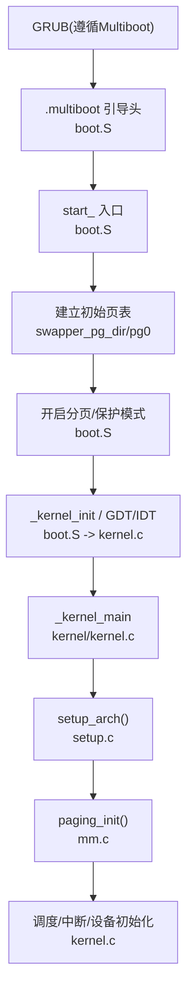
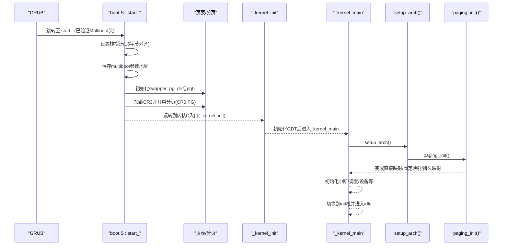
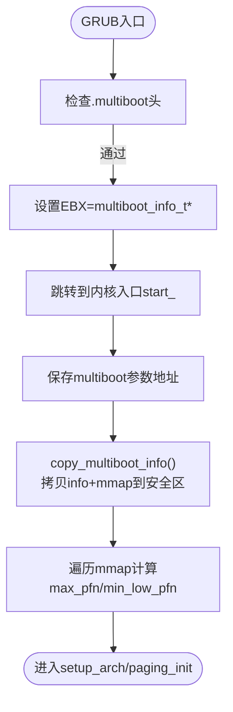
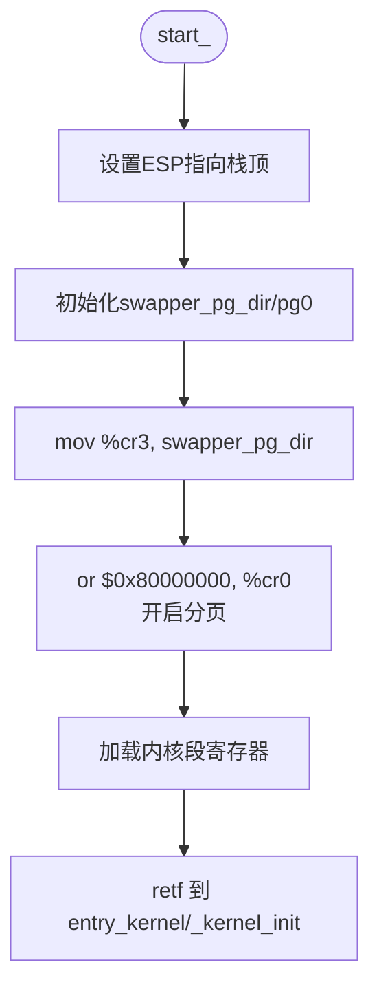
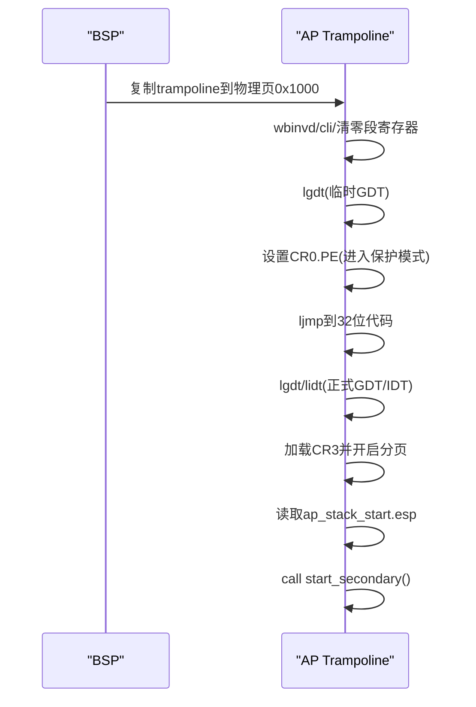
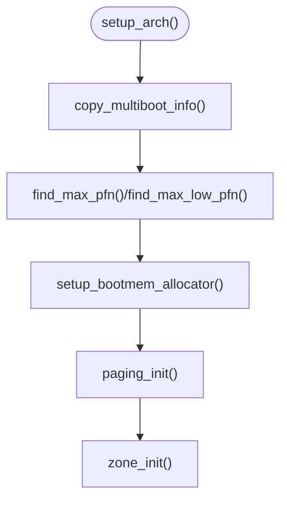
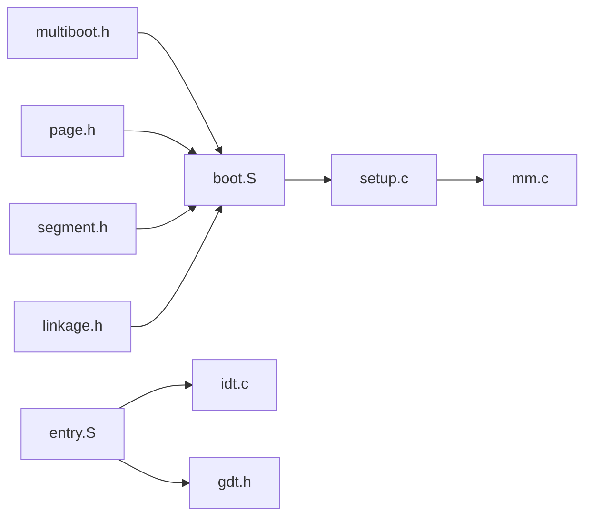

# 引导加载器集成

<cite>
**本文引用的文件**
- [arch/x86/boot/boot.S](file://arch/x86/boot/boot.S)
- [includes/arch/x86/boot/multiboot.h](file://includes/arch/x86/boot/multiboot.h)
- [arch/x86/entry.S](file://arch/x86/entry.S)
- [linker.lds](file://linker.lds)
- [arch/x86/kernel/setup.c](file://arch/x86/kernel/setup.c)
- [includes/arch/x86/setup.h](file://includes/arch/x86/setup.h)
- [kernel/kernel.c](file://kernel/kernel.c)
- [arch/x86/kernel/mm/mm.c](file://arch/x86/kernel/mm/mm.c)
- [includes/arch/x86/pgtable.h](file://includes/arch/x86/pgtable.h)
- [arch/x86/kernel/idt.c](file://arch/x86/kernel/idt.c)
- [includes/arch/x86/gdt.h](file://includes/arch/x86/gdt.h)
- [config-grub.sh](file://config-grub.sh)
</cite>

## 目录
1. [简介](#简介)
2. [项目结构](#项目结构)
3. [核心组件](#核心组件)
4. [架构总览](#架构总览)
5. [详细组件分析](#详细组件分析)
6. [依赖关系分析](#依赖关系分析)
7. [性能考虑](#性能考虑)
8. [故障排查指南](#故障排查指南)
9. [结论](#结论)
10. [附录](#附录)

## 简介
本文件面向开发者，系统性说明LulaOS的引导加载器集成方案，重点覆盖：
- Multiboot v1 规范的实现：引导头定义、标志位设置、内存与视频信息传递。
- GRUB如何加载内核镜像以及引导参数在实模式下的处理。
- 启动代码的初始化流程与栈设置过程。
- 启动时序图与关键数据结构说明，帮助理解从GRUB到内核主循环的完整路径。

## 项目结构
LulaOS将引导相关代码集中在x86架构目录下，并通过链接脚本控制段布局与入口点。关键组织方式如下：
- 引导入口与Multiboot头位于 arch/x86/boot/boot.S，包含 .multiboot 段和最小化的页表初始化。
- 多核AP启动的Trampoline代码位于 arch/x86/entry.S 的 .trampoline 节。
- 链接脚本 linker.lds 指定入口 start_、段布局（含 .multiboot、.text、.trampoline、.bss 等）及虚拟地址基址。
- 架构初始化与内存管理在 arch/x86/kernel/setup.c 中完成，使用 multiboot 提供的内存映射建立页表并初始化子系统。
- 内核主入口 kernel/kernel.c 负责系统各子系统初始化并最终进入 idle 循环。

图表来源
- [arch/x86/boot/boot.S:13-27](file://arch/x86/boot/boot.S#L13-L27)
- [arch/x86/boot/boot.S:39-121](file://arch/x86/boot/boot.S#L39-L121)
- [linker.lds:1-21](file://linker.lds#L1-L21)
- [arch/x86/kernel/setup.c:201-214](file://arch/x86/kernel/setup.c#L201-L214)
- [arch/x86/kernel/mm/mm.c:117-134](file://arch/x86/kernel/mm/mm.c#L117-L134)
- [kernel/kernel.c:73-141](file://kernel/kernel.c#L73-L141)

章节来源
- [arch/x86/boot/boot.S:13-27](file://arch/x86/boot/boot.S#L13-L27)
- [linker.lds:1-21](file://linker.lds#L1-L21)

## 核心组件
- Multiboot 引导头与标志位：定义于 includes/arch/x86/boot/multiboot.h，并在 boot.S 的 .multiboot 段中声明。
- 启动入口与栈设置：boot.S 中的 start_ 设置栈指针、复制/保存 multiboot 参数、构建初始页表、开启分页并跳转到内核C入口。
- AP Trampoline：entry.S 的 .trampoline 节提供SMP AP的16位到32位过渡、加载GDT/IDT、开启分页并调用 start_secondary。
- 架构初始化：setup.c 将 multiboot 信息复制到安全区域、解析内存映射、建立直接映射与固定映射、初始化伙伴系统与zone。
- 内核主循环：kernel.c 的 _kernel_main 依次初始化CPU、架构、中断、调度、内存、设备驱动，最终进入 idle。

章节来源
- [includes/arch/x86/boot/multiboot.h:6-27](file://includes/arch/x86/boot/multiboot.h#L6-L27)
- [arch/x86/boot/boot.S:39-121](file://arch/x86/boot/boot.S#L39-L121)
- [arch/x86/entry.S:631-733](file://arch/x86/entry.S#L631-L733)
- [arch/x86/kernel/setup.c:24-39](file://arch/x86/kernel/setup.c#L24-L39)
- [kernel/kernel.c:73-141](file://kernel/kernel.c#L73-L141)

## 架构总览
下图展示了从GRUB到内核主循环的关键阶段与数据流向：

图表来源
- [arch/x86/boot/boot.S:39-121](file://arch/x86/boot/boot.S#L39-L121)
- [arch/x86/kernel/setup.c:201-214](file://arch/x86/kernel/setup.c#L201-L214)
- [arch/x86/kernel/mm/mm.c:117-134](file://arch/x86/kernel/mm/mm.c#L117-L134)
- [kernel/kernel.c:73-141](file://kernel/kernel.c#L73-L141)

## 详细组件分析

### Multiboot规范实现
- 引导头定义与标志位：
  - 在 .multiboot 段写入 MULTIBOOT_MAGIC、MB_FLAGS 与校验和。
  - MB_FLAGS 组合了 MULTIBOOT_MEMORY_INFO、MULTIBOOT_PAGE_ALIGN、MULTIBOOT_VIDEO_MODE，要求GRUB提供内存信息与视频模式，并要求模块按页对齐。
  - 视频字段声明了线性图形模式的分辨率与色深。
- 内存与命令行信息：
  - GRUB在入口处通过寄存器传递 multiboot_info_t 指针；内核在 boot.S 中将该地址保存到全局变量，供后续 setup.c 使用。
  - setup.c 将 multiboot_info_t 及其 mmap 缓冲区拷贝到内核安全的连续区域，并更新 mmap_addr，以便后续解析物理内存分布。

图表来源
- [arch/x86/boot/boot.S:13-27](file://arch/x86/boot/boot.S#L13-L27)
- [arch/x86/boot/boot.S:41-58](file://arch/x86/boot/boot.S#L41-L58)
- [arch/x86/kernel/setup.c:24-39](file://arch/x86/kernel/setup.c#L24-L39)
- [arch/x86/kernel/setup.c:94-118](file://arch/x86/kernel/setup.c#L94-L118)

章节来源
- [includes/arch/x86/boot/multiboot.h:6-27](file://includes/arch/x86/boot/multiboot.h#L6-L27)
- [includes/arch/x86/boot/multiboot.h:98-175](file://includes/arch/x86/boot/multiboot.h#L98-L175)
- [arch/x86/boot/boot.S:13-27](file://arch/x86/boot/boot.S#L13-L27)
- [arch/x86/kernel/setup.c:24-39](file://arch/x86/kernel/setup.c#L24-L39)

### GRUB加载内核镜像与引导参数处理
- GRUB根据 .multiboot 头加载内核映像，并将 multiboot_info_t 指针置于 EBX，magic number 置于 EAX。
- 实模式下，boot.S 立即设置一个满足System V ABI的16字节对齐栈，并将 multiboot 参数地址保存到全局变量，避免被后续BSS/数据覆盖。
- 随后构建初始页表，使内核能在受保护的虚拟地址空间运行。

章节来源
- [arch/x86/boot/boot.S:39-58](file://arch/x86/boot/boot.S#L39-L58)
- [includes/arch/x86/boot/multiboot.h:6-27](file://includes/arch/x86/boot/multiboot.h#L6-L27)

### 启动代码的初始化与栈设置
- 栈设置：
  - 在 .bss 中预留16KB栈空间，start_ 将 ESP 指向栈顶（减去 PAGE_OFFSET），确保后续C函数调用正确。
- 页表初始化：
  - 初始化 swapper_pg_dir（页目录）与 pg0（页表），为内核虚拟地址空间建立基础映射。
  - 将 init_pg_tables_end 记录为页表结束位置，用于后续内存分配边界计算。
- 开启分页与保护模式：
  - 加载 CR3 指向页目录，置位 CR0.PG 开启分页，切换段寄存器至内核段选择子。
  - 通过 far return 进入 protected mode 的 C 入口 _kernel_init。

图表来源
- [arch/x86/boot/boot.S:29-34](file://arch/x86/boot/boot.S#L29-L34)
- [arch/x86/boot/boot.S:61-100](file://arch/x86/boot/boot.S#L61-L100)
- [arch/x86/boot/boot.S:102-121](file://arch/x86/boot/boot.S#L102-L121)

章节来源
- [arch/x86/boot/boot.S:29-34](file://arch/x86/boot/boot.S#L29-L34)
- [arch/x86/boot/boot.S:61-100](file://arch/x86/boot/boot.S#L61-L100)
- [arch/x86/boot/boot.S:102-121](file://arch/x86/boot/boot.S#L102-L121)

### AP启动Trampoline与SMP支持
- 16位到32位过渡：
  - 在 .trampoline 节中，AP以16位代码开始，执行 wbinvd、关闭中断、清零段寄存器、加载临时GDT，然后设置 CR0.PE 进入保护模式。
  - 远跳转到32位代码段，加载正式GDT/IDT，开启分页，设置段寄存器，并从全局变量读取AP栈顶，调用 start_secondary。
- 缓存一致性：
  - 首指令 wbinvd 确保BSP写入的 ap_stack_start.esp 等数据在主存中可见，避免AP读到陈旧缓存。

图表来源
- [arch/x86/entry.S:631-733](file://arch/x86/entry.S#L631-L733)

章节来源
- [arch/x86/entry.S:631-733](file://arch/x86/entry.S#L631-L733)

### 架构初始化与内存管理
- 复制与解析 multiboot 信息：
  - copy_multiboot_info() 将 multiboot_info_t 与 mmap 缓冲区拷贝到安全区域，并更新 mmap_addr。
  - find_max_pfn()/find_max_low_pfn() 遍历可用内存区间，计算 max_pfn 与 max_low_pfn，并打印日志。
- 启动内存分配器与保留区域：
  - setup_bootmem_allocator() 初始化bootmem，标记可分配范围，并保留0~8K、1M~内核+bootmap等关键区域。
- 页表与虚拟内存布局：
  - paging_init() 建立直接映射(0~896M)、固定映射(4G-4M)、持久映射(4G-8M)，加载CR3，初始化zone。

图表来源
- [arch/x86/kernel/setup.c:24-39](file://arch/x86/kernel/setup.c#L24-L39)
- [arch/x86/kernel/setup.c:94-118](file://arch/x86/kernel/setup.c#L94-L118)
- [arch/x86/kernel/setup.c:123-176](file://arch/x86/kernel/setup.c#L123-L176)
- [arch/x86/kernel/mm/mm.c:117-134](file://arch/x86/kernel/mm/mm.c#L117-L134)

章节来源
- [arch/x86/kernel/setup.c:24-39](file://arch/x86/kernel/setup.c#L24-L39)
- [arch/x86/kernel/setup.c:123-176](file://arch/x86/kernel/setup.c#L123-L176)
- [arch/x86/kernel/mm/mm.c:117-134](file://arch/x86/kernel/mm/mm.c#L117-L134)

### 内核主入口与子系统初始化
- _kernel_main 顺序执行：
  - 初始化CPU、架构(setup_arch)、中断(IDT/IRQ)、调度、内存(kmalloc/slab)、vmalloc区域、平台总线、ACPI设备、PS/2控制器、键盘鼠标、PCI、ATA、USB/UHCI、DRM框架与Bochs驱动。
  - 最后切换到 init_thread_union 栈并进入 idle 循环。

章节来源
- [kernel/kernel.c:73-141](file://kernel/kernel.c#L73-L141)

### 关键数据结构说明
- multiboot_info_t：包含 flags、mem_lower/upper、cmdline、mods_*、mmap_*、framebuffer_* 等字段，由GRUB填充。
- multiboot_mmap_entry：描述一段物理内存的地址与长度、类型（可用/保留/NVS等）。
- 页表结构：swapper_pg_dir（PGD）、pg0（PTE），配合 pgtable.h 中的宏与偏移常量。
- GDT/IDT：boot.S 中定义基本GDT项，entry.S 中定义中断向量桩与AP trampoline所需临时GDT/GDTR。

章节来源
- [includes/arch/x86/boot/multiboot.h:98-175](file://includes/arch/x86/boot/multiboot.h#L98-L175)
- [includes/arch/x86/boot/multiboot.h:184-199](file://includes/arch/x86/boot/multiboot.h#L184-L199)
- [includes/arch/x86/pgtable.h:10-12](file://includes/arch/x86/pgtable.h#L10-L12)
- [arch/x86/boot/boot.S:134-160](file://arch/x86/boot/boot.S#L134-L160)
- [arch/x86/entry.S:718-730](file://arch/x86/entry.S#L718-L730)

## 依赖关系分析
- 引导阶段依赖：
  - boot.S 依赖 multiboot.h 定义的常量与结构体，依赖 page.h/segment.h/linkage.h 进行页表与段操作。
  - linker.lds 决定 .multiboot 段位于内核映像起始处，确保GRUB能识别。
- 运行时依赖：
  - setup.c 依赖 mm/bootmem.h、mm/mm.h、arch/x86/page.h 等，用于内存管理与页表初始化。
  - entry.S 的 trampoline 依赖 gdt/idt 的全局符号，确保AP能正确加载系统表。

图表来源
- [includes/arch/x86/boot/multiboot.h:6-27](file://includes/arch/x86/boot/multiboot.h#L6-L27)
- [arch/x86/boot/boot.S:1-6](file://arch/x86/boot/boot.S#L1-L6)
- [arch/x86/kernel/setup.c:1-12](file://arch/x86/kernel/setup.c#L1-L12)
- [arch/x86/kernel/mm/mm.c:117-134](file://arch/x86/kernel/mm/mm.c#L117-L134)
- [arch/x86/entry.S:631-733](file://arch/x86/entry.S#L631-L733)
- [arch/x86/kernel/idt.c:303-331](file://arch/x86/kernel/idt.c#L303-L331)
- [includes/arch/x86/gdt.h:43-47](file://includes/arch/x86/gdt.h#L43-L47)

章节来源
- [arch/x86/boot/boot.S:1-6](file://arch/x86/boot/boot.S#L1-L6)
- [arch/x86/kernel/setup.c:1-12](file://arch/x86/kernel/setup.c#L1-L12)
- [arch/x86/kernel/idt.c:303-331](file://arch/x86/kernel/idt.c#L303-L331)

## 性能考虑
- 页表初始化采用顺序填充，时间复杂度与映射范围成正比；建议保持映射粒度合理，避免过度细碎映射。
- 启动阶段尽量使用静态分配的页表（pg0）以减少动态分配开销。
- AP启动时 wbinvd 会带来一定延迟，但保证缓存一致性是必要的；应仅在必要时使用。
- 内存映射遍历与统计输出应在开发阶段启用，生产环境可减少冗余打印以提升启动速度。

[本节为通用指导，不直接分析具体文件]

## 故障排查指南
- GRUB无法识别内核：
  - 检查 .multiboot 段是否位于内核映像起始处，且包含正确的 magic、flags 与 checksum。
  - 确认 linker.lds 中 .multiboot 段的位置与入口 start_ 的设置。
- 启动后崩溃或段错误：
  - 检查 ESP 是否正确设置为栈顶，并确保16字节对齐。
  - 检查 CR3 是否指向有效的 swapper_pg_dir，CR0.PG 是否置位。
  - 检查 GDT/IDT 是否已加载，段选择子是否正确。
- 内存映射异常：
  - 确认 copy_multiboot_info() 成功拷贝 mmap 并更新 mmap_addr。
  - 检查 find_max_pfn()/find_max_low_pfn() 是否正确解析可用内存区间。
- AP无法启动：
  - 检查 trampoline 节是否被复制到物理地址 0x1000，GDTR base 是否指向有效GDT。
  - 确认 BSP 在发送 SIPI 前写入 ap_stack_start.esp。

章节来源
- [arch/x86/boot/boot.S:13-27](file://arch/x86/boot/boot.S#L13-L27)
- [linker.lds:1-21](file://linker.lds#L1-L21)
- [arch/x86/boot/boot.S:29-34](file://arch/x86/boot/boot.S#L29-L34)
- [arch/x86/boot/boot.S:61-100](file://arch/x86/boot/boot.S#L61-L100)
- [arch/x86/kernel/setup.c:24-39](file://arch/x86/kernel/setup.c#L24-L39)
- [arch/x86/entry.S:718-730](file://arch/x86/entry.S#L718-L730)

## 结论
LulaOS通过标准的Multiboot v1接口与GRUB协作，实现了从实模式到保护模式、再到分页环境的平滑过渡。启动代码在极小范围内完成栈设置、页表初始化与段寄存器配置，随后交由C层完成架构与子系统初始化。AP trampoline保证了多核启动的一致性与可靠性。整体设计清晰、模块化良好，便于扩展与维护。

[本节为总结性内容，不直接分析具体文件]

## 附录
- GRUB配置脚本：config-grub.sh 用于生成GRUB配置文件，便于在不同环境中定制引导选项。
- 建议调试步骤：
  - 在 boot.S 与 setup.c 中加入 printk 输出，观察 multiboot 参数与内存映射。
  - 使用Bochs/QEMU的断点功能，逐步验证页表与段寄存器状态。
  - 检查 entry.S 的中断向量桩与IDT条目是否正确安装。

章节来源
- [config-grub.sh:1-5](file://config-grub.sh#L1-L5)