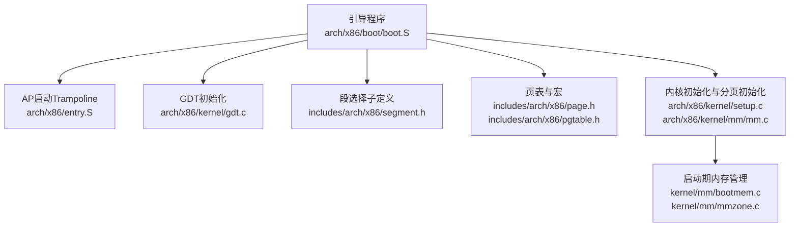
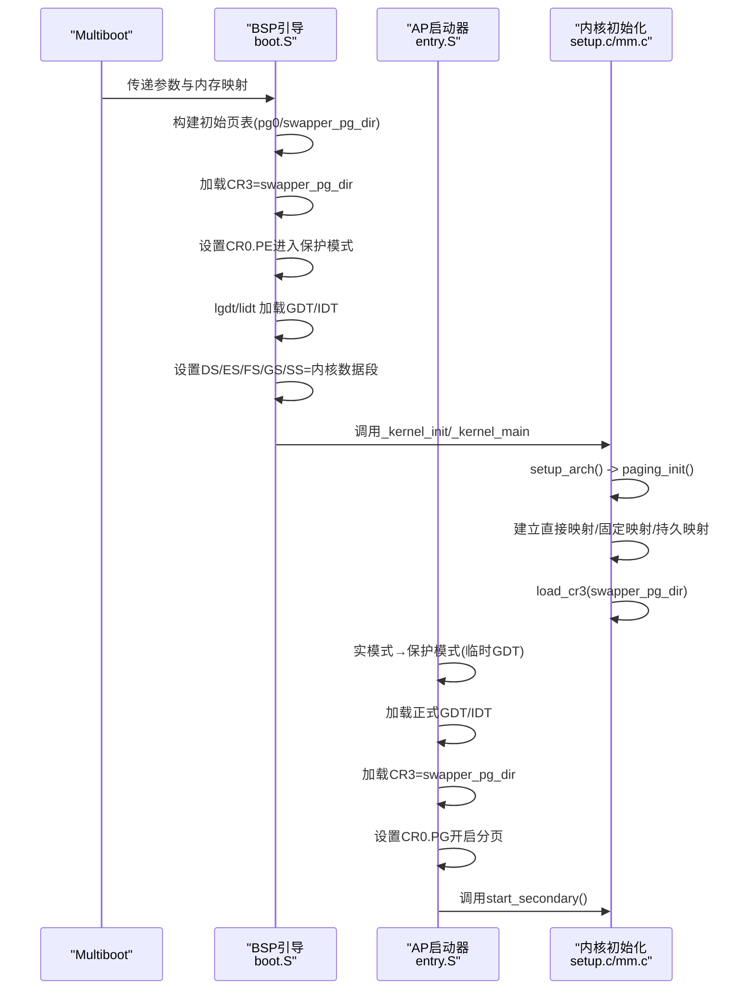
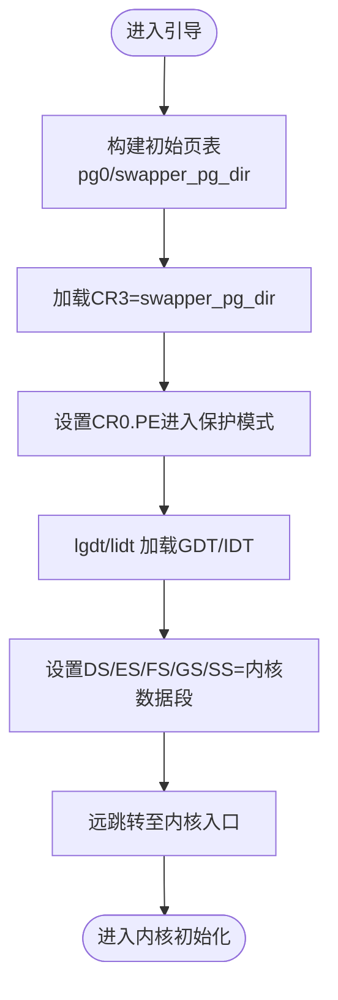
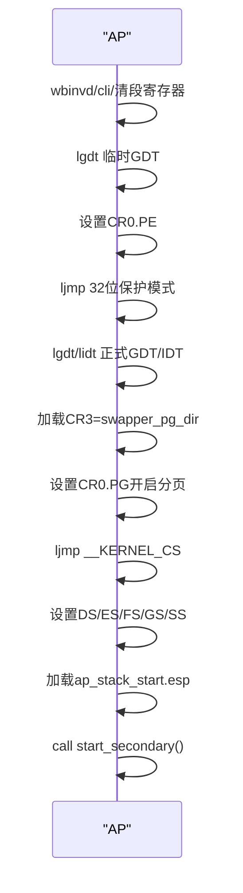
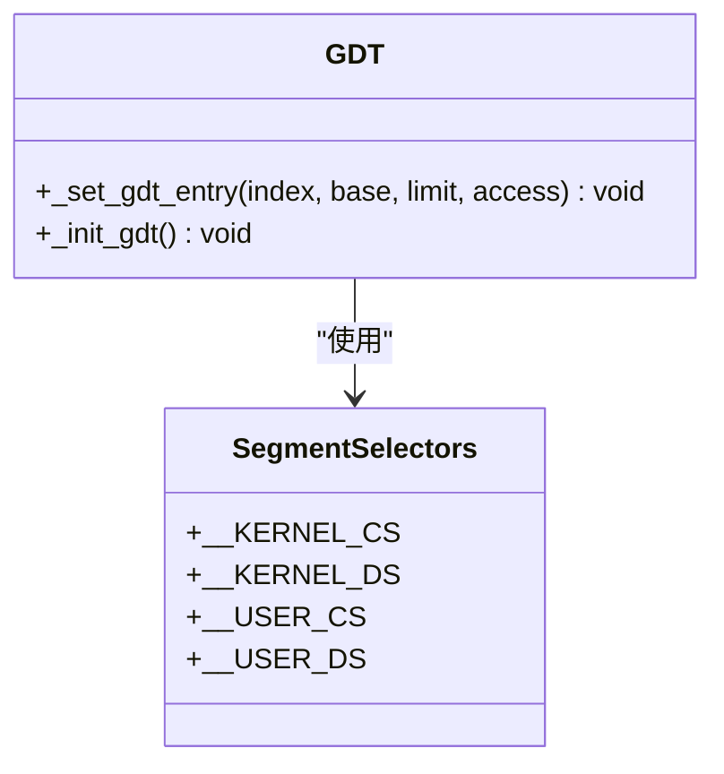
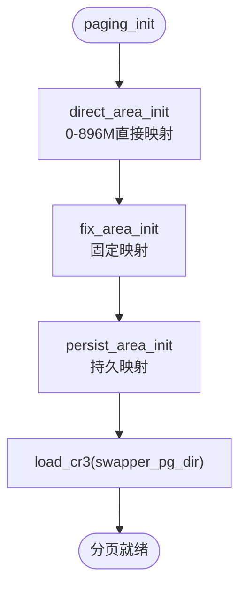
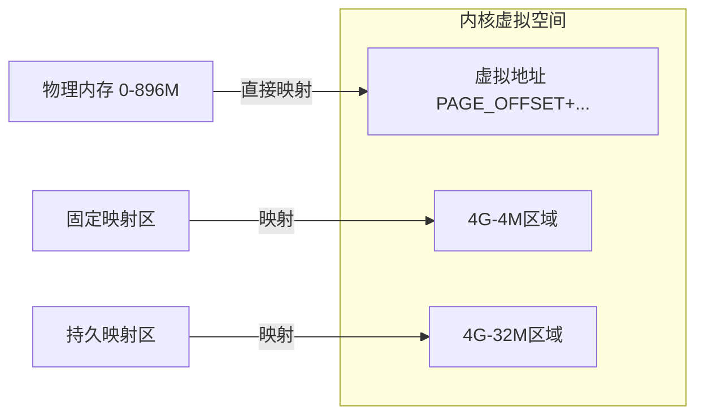
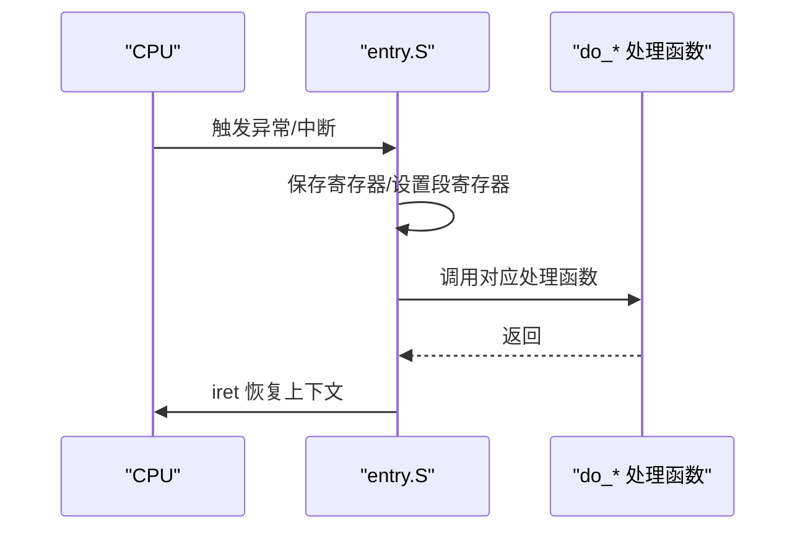
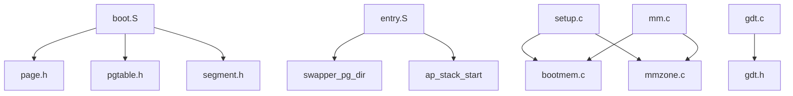

# 模式切换机制

<cite>
**本文引用的文件**
- [boot.S](file://arch/x86/boot/boot.S)
- [entry.S](file://arch/x86/entry.S)
- [gdt.c](file://arch/x86/kernel/gdt.c)
- [setup.c](file://arch/x86/kernel/setup.c)
- [mm.c](file://arch/x86/kernel/mm/mm.c)
- [page.h](file://includes/arch/x86/page.h)
- [pgtable.h](file://includes/arch/x86/pgtable.h)
- [segment.h](file://includes/arch/x86/segment.h)
- [gdt.h](file://includes/arch/x86/gdt.h)
- [bootmem.c](file://kernel/mm/bootmem.c)
- [mmzone.c](file://kernel/mm/mmzone.c)
</cite>

## 目录
1. [简介](#简介)
2. [项目结构](#项目结构)
3. [核心组件](#核心组件)
4. [架构总览](#架构总览)
5. [详细组件分析](#详细组件分析)
6. [依赖关系分析](#依赖关系分析)
7. [性能考虑](#性能考虑)
8. [故障排查指南](#故障排查指南)
9. [结论](#结论)
10. [附录](#附录)

## 简介
本文件面向LulaOS的底层开发者，系统性阐述从实模式到保护模式的完整转换过程、分页机制启用与页表构建、CR0/CR3寄存器配置、地址空间映射与内存布局变化，以及关键步骤与错误处理。文档以代码级为依据，配合时序图、流程图和类图帮助读者建立对x86模式切换与分页的深入理解。

## 项目结构
LulaOS将模式切换与分页相关的关键实现分布在以下位置：
- 引导阶段（实模式→保护模式→开启分页）：arch/x86/boot/boot.S
- AP启动与二次CPU进入保护模式：arch/x86/entry.S（含trampoline段）
- GDT初始化与描述符构造：arch/x86/kernel/gdt.c + includes/arch/x86/gdt.h
- 段选择子定义：includes/arch/x86/segment.h
- 页表结构与宏：includes/arch/x86/page.h, includes/arch/x86/pgtable.h
- 内核初始化流程与分页初始化入口：arch/x86/kernel/setup.c, arch/x86/kernel/mm/mm.c
- 启动期内存分配与伙伴系统：kernel/mm/bootmem.c, kernel/mm/mmzone.c

**图表来源**
- [boot.S:61-121](file://arch/x86/boot/boot.S#L61-L121)
- [entry.S:631-708](file://arch/x86/entry.S#L631-L708)
- [gdt.c:13-22](file://arch/x86/kernel/gdt.c#L13-L22)
- [page.h:1-47](file://includes/arch/x86/page.h#L1-L47)
- [pgtable.h:1-131](file://includes/arch/x86/pgtable.h#L1-L131)
- [setup.c:201-214](file://arch/x86/kernel/setup.c#L201-L214)
- [mm.c:117-134](file://arch/x86/kernel/mm/mm.c#L117-L134)

**章节来源**
- [boot.S:61-121](file://arch/x86/boot/boot.S#L61-L121)
- [entry.S:631-708](file://arch/x86/entry.S#L631-L708)
- [gdt.c:13-22](file://arch/x86/kernel/gdt.c#L13-L22)
- [page.h:1-47](file://includes/arch/x86/page.h#L1-L47)
- [pgtable.h:1-131](file://includes/arch/x86/pgtable.h#L1-L131)
- [setup.c:201-214](file://arch/x86/kernel/setup.c#L201-L214)
- [mm.c:117-134](file://arch/x86/kernel/mm/mm.c#L117-L134)

## 核心组件
- 引导程序（boot.S）：负责在BSP上构建初始页表、加载CR3、设置CR0.PE进入保护模式，随后加载GDT/IDT并切换到内核代码段，最终调用内核初始化。
- AP Trampoline（entry.S）：为每个AP提供从实模式到保护模式再到开启分页的最小路径，确保所有CPU共享同一套页表。
- GDT与段选择子（gdt.c, gdt.h, segment.h）：定义内核/用户态的代码与数据段描述符及选择子，供模式切换后使用。
- 页表与宏（page.h, pgtable.h）：定义页大小、偏移、PGD/PTE操作宏、TLB刷新接口等。
- 初始化流程（setup.c, mm.c）：解析Multiboot信息、计算可用内存范围、建立直接映射、固定映射与持久映射区域，最后加载CR3完成分页。
- 启动期内存管理（bootmem.c, mmzone.c）：维护位图与伙伴系统，为后续页表页分配提供基础。

**章节来源**
- [boot.S:61-121](file://arch/x86/boot/boot.S#L61-L121)
- [entry.S:631-708](file://arch/x86/entry.S#L631-L708)
- [gdt.c:13-22](file://arch/x86/kernel/gdt.c#L13-L22)
- [segment.h:1-10](file://includes/arch/x86/segment.h#L1-L10)
- [page.h:1-47](file://includes/arch/x86/page.h#L1-L47)
- [pgtable.h:1-131](file://includes/arch/x86/pgtable.h#L1-L131)
- [setup.c:201-214](file://arch/x86/kernel/setup.c#L201-L214)
- [mm.c:117-134](file://arch/x86/kernel/mm/mm.c#L117-L134)
- [bootmem.c:12-28](file://kernel/mm/bootmem.c#L12-L28)
- [mmzone.c:61-150](file://kernel/mm/mmzone.c#L61-L150)

## 架构总览
下图展示从引导到内核运行时的整体控制流，包括BSP与AP两条路径，以及分页启用后的内存映射建立。

**图表来源**
- [boot.S:61-121](file://arch/x86/boot/boot.S#L61-L121)
- [entry.S:631-708](file://arch/x86/entry.S#L631-L708)
- [setup.c:201-214](file://arch/x86/kernel/setup.c#L201-L214)
- [mm.c:117-134](file://arch/x86/kernel/mm/mm.c#L117-L134)

## 详细组件分析

### 引导阶段：实模式→保护模式→开启分页（BSP）
- 初始页表构建：在.bss.page_table中准备swapper_pg_dir与pg0，循环填充PDE/PTE，建立早期直接映射，保证后续访问稳定。
- 加载CR3并开启分页：将swapper_pg_dir物理地址写入CR3，设置CR0.PE进入保护模式；随后通过远跳转进入page_after标签，再lgdt/lidt并设置段寄存器，最终跳转到内核入口。
- 关键点：先加载CR3再设置CR0.PE，避免在开启分页前出现非法地址访问；远跳转确保CS指向__KERNEL_CS。

**图表来源**
- [boot.S:61-121](file://arch/x86/boot/boot.S#L61-L121)

**章节来源**
- [boot.S:61-121](file://arch/x86/boot/boot.S#L61-L121)

### AP启动：实模式→保护模式→开启分页（AP）
- 在trampoline页（物理0x1000）执行最小化引导：wbinvd清理缓存一致性，设置临时GDT，设置CR0.PE，远跳转到32位保护模式代码。
- 加载正式GDT/IDT，加载CR3=swapper_pg_dir，设置CR0.PG开启分页，远跳转确保CS正确，设置段寄存器，加载AP栈指针，调用start_secondary。

**图表来源**
- [entry.S:631-708](file://arch/x86/entry.S#L631-L708)

**章节来源**
- [entry.S:631-708](file://arch/x86/entry.S#L631-L708)

### GDT初始化与段寄存器设置
- 描述符构造：_init_gdt通过_set_gdt_entry组装基址、界限、访问权限等字段，创建内核代码/数据段与用户态代码/数据段。
- 选择子：__KERNEL_CS/__KERNEL_DS等用于保护模式下切换段。
- 在BSP与AP路径中均会加载GDT并设置段寄存器，确保后续内存访问合法。

**图表来源**
- [gdt.c:1-22](file://arch/x86/kernel/gdt.c#L1-L22)
- [segment.h:1-10](file://includes/arch/x86/segment.h#L1-L10)
- [gdt.h:1-49](file://includes/arch/x86/gdt.h#L1-L49)

**章节来源**
- [gdt.c:13-22](file://arch/x86/kernel/gdt.c#L13-L22)
- [segment.h:1-10](file://includes/arch/x86/segment.h#L1-L10)
- [gdt.h:1-49](file://includes/arch/x86/gdt.h#L1-L49)

### 分页机制启用与页表构建
- 页表结构：swapper_pg_dir为内核页目录，pg0为页表数组；pgtable.h定义了PGD/PTE属性宏与索引计算。
- 直接映射：direct_area_init将0~896M物理内存映射到PAGE_OFFSET开始的虚拟空间。
- 固定映射与持久映射：fix_area_init与persist_area_init分别建立固定地址映射与永久映射区，便于内核访问硬件与特殊区域。
- 加载CR3：paging_init最后load_cr3(swapper_pg_dir)，使分页生效。

**图表来源**
- [mm.c:117-134](file://arch/x86/kernel/mm/mm.c#L117-L134)
- [pgtable.h:1-131](file://includes/arch/x86/pgtable.h#L1-L131)
- [page.h:1-47](file://includes/arch/x86/page.h#L1-L47)

**章节来源**
- [mm.c:117-134](file://arch/x86/kernel/mm/mm.c#L117-L134)
- [pgtable.h:1-131](file://includes/arch/x86/pgtable.h#L1-L131)
- [page.h:1-47](file://includes/arch/x86/page.h#L1-L47)

### 地址空间映射与内存布局变化
- 虚拟地址基址：PAGE_OFFSET=0xC0000000，内核代码与数据位于高地址区。
- 直接映射：0~896M物理内存线性映射到PAGE_OFFSET起始区域，便于内核直接访问。
- 固定映射与持久映射：在4G附近预留固定与持久映射区，用于设备I/O与特殊缓冲。
- 启动期内存管理：bootmem.c维护位图，mmzone.c初始化zone与伙伴系统，为后续页表页分配提供能力。

**图表来源**
- [page.h:1-47](file://includes/arch/x86/page.h#L1-L47)
- [mm.c:117-134](file://arch/x86/kernel/mm/mm.c#L117-L134)
- [mmzone.c:61-150](file://kernel/mm/mmzone.c#L61-L150)

**章节来源**
- [page.h:1-47](file://includes/arch/x86/page.h#L1-L47)
- [mm.c:117-134](file://arch/x86/kernel/mm/mm.c#L117-L134)
- [mmzone.c:61-150](file://kernel/mm/mmzone.c#L61-L150)

### 中断与异常处理（与模式切换相关）
- 中断向量与包装：entry.S为各类异常与中断提供入口桩，统一压栈并调用do_*处理函数。
- 进程上下文切换：__switch_to保存prev状态、恢复next状态、切换CR3，并在首次运行时跳转到ret_from_fork。
- 这些机制在模式切换后由内核调度器使用，确保多任务环境下的正确性。

**图表来源**
- [entry.S:23-91](file://arch/x86/entry.S#L23-L91)
- [entry.S:489-610](file://arch/x86/entry.S#L489-L610)

**章节来源**
- [entry.S:23-91](file://arch/x86/entry.S#L23-L91)
- [entry.S:489-610](file://arch/x86/entry.S#L489-L610)

## 依赖关系分析
- boot.S依赖page.h与pgtable.h定义的页表结构与宏，依赖segment.h提供的段选择子。
- entry.S中的trampoline段依赖全局符号_ap_stack_start与swapper_pg_dir，确保AP能正确加载页表与栈。
- setup.c与mm.c依赖bootmem.c与mmzone.c提供的内存分配能力，以分配页表页并初始化zone。
- gdt.c与gdt.h提供GDT描述符构造，被引导阶段与AP路径使用。

**图表来源**
- [boot.S:61-121](file://arch/x86/boot/boot.S#L61-L121)
- [entry.S:631-708](file://arch/x86/entry.S#L631-L708)
- [setup.c:201-214](file://arch/x86/kernel/setup.c#L201-L214)
- [mm.c:117-134](file://arch/x86/kernel/mm/mm.c#L117-L134)
- [gdt.c:13-22](file://arch/x86/kernel/gdt.c#L13-L22)

**章节来源**
- [boot.S:61-121](file://arch/x86/boot/boot.S#L61-L121)
- [entry.S:631-708](file://arch/x86/entry.S#L631-L708)
- [setup.c:201-214](file://arch/x86/kernel/setup.c#L201-L214)
- [mm.c:117-134](file://arch/x86/kernel/mm/mm.c#L117-L134)
- [gdt.c:13-22](file://arch/x86/kernel/gdt.c#L13-L22)

## 性能考虑
- TLB刷新：pgtable.h提供__flush_tlb_all与__flush_tlb_one，建议在批量修改页表或切换CR3时使用，减少无效条目带来的性能损耗。
- 页表构建顺序：先建立直接映射再加载CR3，可避免缺页导致的额外开销。
- AP启动路径：trampoline尽量精简，减少指令数与缓存失效，提升多核启动效率。

[本节为通用指导，不直接分析具体文件]

## 故障排查指南
- 一般保护异常（#GP）：检查GDT描述符是否有效、段选择子是否正确、段寄存器是否已设置为内核段。
- 页错误（#PF）：检查CR3是否指向正确的页目录、页表项是否设置了PRESENT位、虚拟地址是否在映射范围内。
- AP无法启动：确认trampoline页内容正确、GDTR基址覆盖为物理地址、AP栈指针ap_stack_start已写入且分页已开启。
- 调试建议：在bochs.cfg/bochsrc.bxrc中启用调试输出，观察CR0/CR3变化与异常向量。

**章节来源**
- [entry.S:142-160](file://arch/x86/entry.S#L142-L160)
- [entry.S:631-708](file://arch/x86/entry.S#L631-L708)
- [pgtable.h:112-128](file://includes/arch/x86/pgtable.h#L112-L128)

## 结论
LulaOS的模式切换与分页机制遵循x86标准流程：引导阶段构建初始页表、加载CR3并开启保护模式与分页；AP通过trampoline快速进入相同环境；内核初始化进一步建立直接映射、固定映射与持久映射，并初始化伙伴系统。该设计保证了多核一致性与内核运行所需的地址空间布局，为上层子系统提供了稳定的基础。

[本节为总结，不直接分析具体文件]

## 附录
- 关键寄存器与标志：
  - CR0.PE：保护模式启用
  - CR0.PG：分页启用
  - CR3：页目录基址
- 关键宏与常量：
  - PAGE_OFFSET：内核虚拟基址
  - _PAGE_PRESENT/_PAGE_RW/_PAGE_USER：页表项属性
  - __KERNEL_CS/__KERNEL_DS：内核段选择子

[本节为补充说明，不直接分析具体文件]