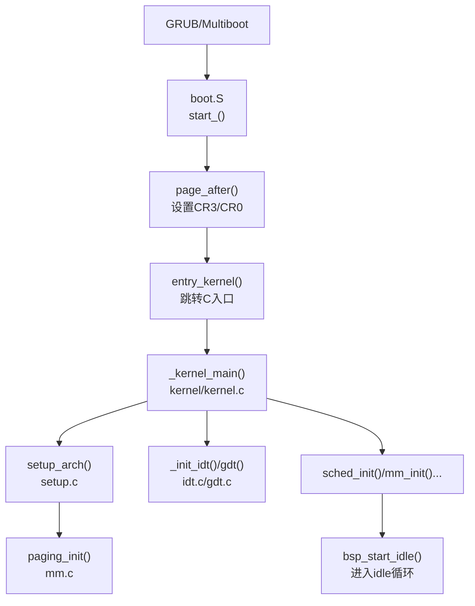
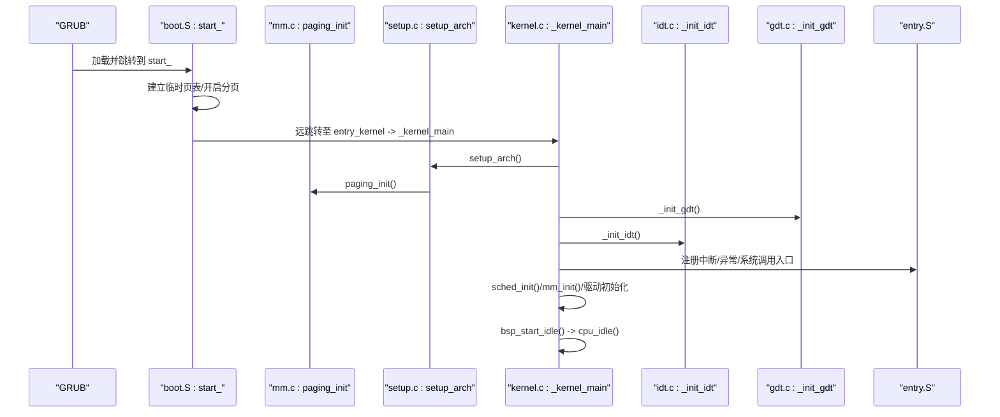
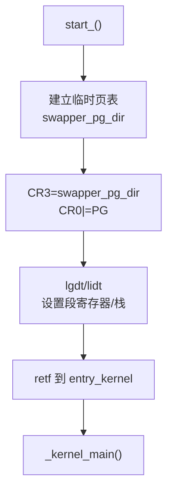
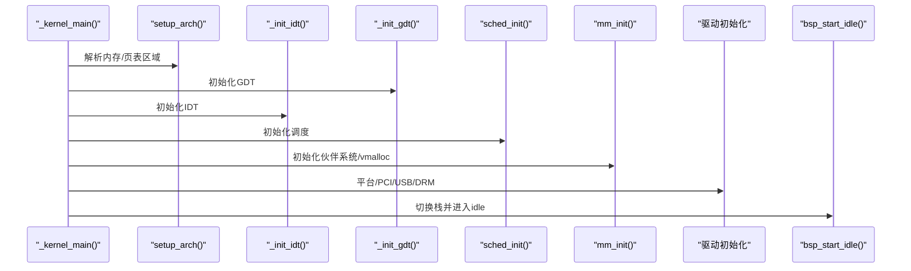
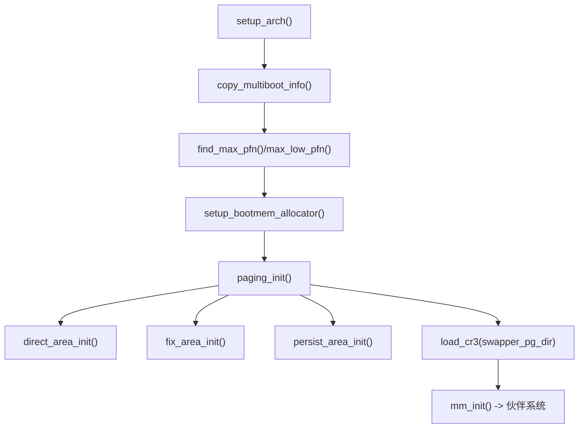
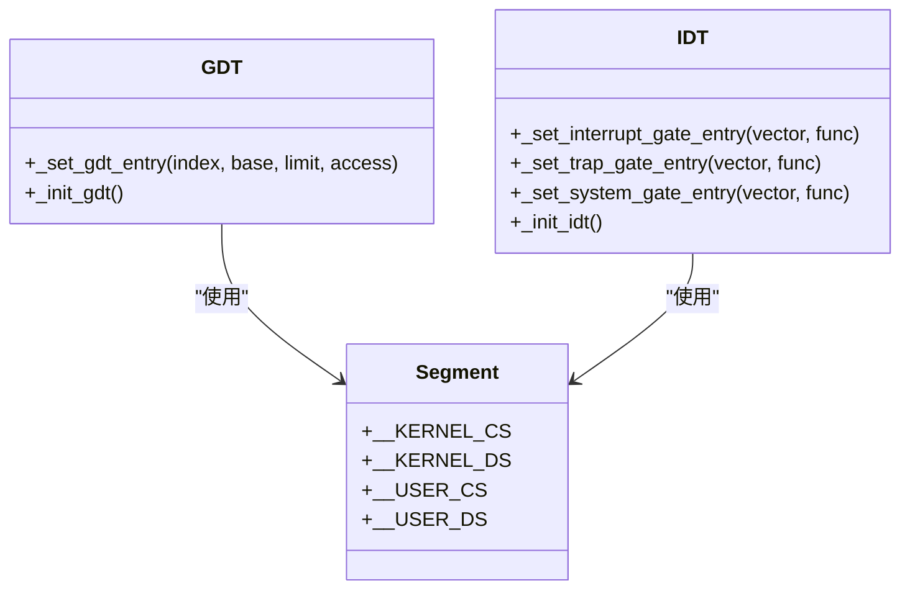
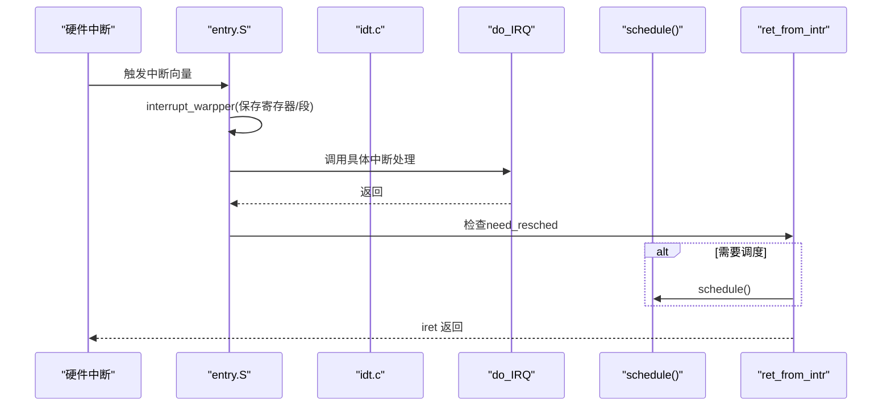
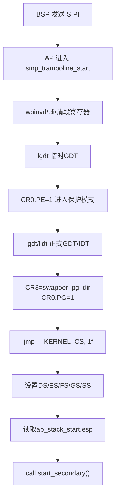
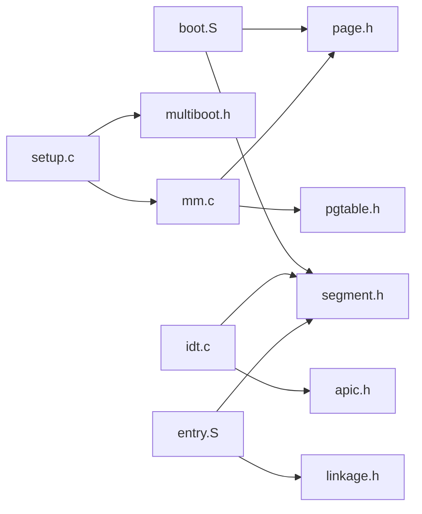

# 系统启动流程

<cite>
**本文引用的文件**
- [arch/x86/boot/boot.S](file://arch/x86/boot/boot.S)
- [arch/x86/entry.S](file://arch/x86/entry.S)
- [arch/x86/kernel/setup.c](file://arch/x86/kernel/setup.c)
- [arch/x86/kernel/gdt.c](file://arch/x86/kernel/gdt.c)
- [arch/x86/kernel/idt.c](file://arch/x86/kernel/idt.c)
- [kernel/kernel.c](file://kernel/kernel.c)
- [arch/x86/kernel/mm/mm.c](file://arch/x86/kernel/mm/mm.c)
- [includes/arch/x86/page.h](file://includes/arch/x86/page.h)
- [includes/arch/x86/system.h](file://includes/arch/x86/system.h)
- [includes/arch/x86/segment.h](file://includes/arch/x86/segment.h)
- [linker.lds](file://linker.lds)
</cite>

## 目录
1. [简介](#简介)
2. [项目结构](#项目结构)
3. [核心组件](#核心组件)
4. [架构总览](#架构总览)
5. [详细组件分析](#详细组件分析)
6. [依赖关系分析](#依赖关系分析)
7. [性能考虑](#性能考虑)
8. [故障排查指南](#故障排查指南)
9. [结论](#结论)
10. [附录](#附录)

## 简介
本文面向开发者，系统性梳理 LulaOS 从 GRUB/Multiboot 引导加载器到内核入口点的完整启动流程。重点覆盖：
- 实模式到保护模式的转换、GDT/IDT 初始化
- 内存布局配置、分页机制启用与硬件检测流程
- 关键启动阶段的执行顺序与数据传递机制
- 启动时序图与关键函数调用关系

## 项目结构
LulaOS 的 x86 启动路径由汇编与 C 协同完成：
- 引导阶段（Multiboot）：位于 arch/x86/boot/boot.S，负责建立最小页表、开启分页、设置段寄存器并跳转到内核主入口
- 内核入口与中断上下文：位于 arch/x86/entry.S，提供异常/中断/系统调用入口、进程切换与 SMP AP 启动 trampolines
- 体系结构初始化：位于 arch/x86/kernel/setup.c，解析 Multiboot 信息、构建内存模型、初始化页表与区域映射
- GDT/IDT：位于 arch/x86/kernel/gdt.c 与 arch/x86/kernel/idt.c
- 内核主流程：位于 kernel/kernel.c，按序初始化 CPU、架构、中断、调度、内存子系统、设备驱动等
- 页表与内存管理：位于 arch/x86/kernel/mm/mm.c，实现直接映射、固定映射、持久映射以及伙伴系统初始化
- 链接脚本：linker.lds 定义虚拟地址空间布局、节区位置与符号边界

图表来源
- [arch/x86/boot/boot.S:39-125](file://arch/x86/boot/boot.S#L39-L125)
- [kernel/kernel.c:72-135](file://kernel/kernel.c#L72-L135)
- [arch/x86/kernel/setup.c:201-214](file://arch/x86/kernel/setup.c#L201-L214)
- [arch/x86/kernel/mm/mm.c:117-134](file://arch/x86/kernel/mm/mm.c#L117-L134)

章节来源
- [arch/x86/boot/boot.S:39-125](file://arch/x86/boot/boot.S#L39-L125)
- [kernel/kernel.c:72-135](file://kernel/kernel.c#L72-L135)
- [arch/x86/kernel/setup.c:201-214](file://arch/x86/kernel/setup.c#L201-L214)
- [arch/x86/kernel/mm/mm.c:117-134](file://arch/x86/kernel/mm/mm.c#L117-L134)
- [linker.lds:1-103](file://linker.lds#L1-L103)

## 核心组件
- 引导程序 boot.S：在低内存建立临时页表，开启分页后切换到高地址运行，设置段寄存器与栈，最终跳转到 _kernel_main
- 内核入口 entry.S：统一的中断/异常/系统调用入口，进程上下文切换，SMP AP 启动代码
- setup.c：解析 Multiboot 内存映射，计算可用内存范围，初始化启动期分配器与页表区域
- mm.c：构建 0~896M 直接映射、固定映射、持久映射，加载 CR3，初始化 zone
- gdt.c/idt.c：构造内核/用户态段描述符，安装异常门、中断门与系统调用门
- kernel.c：串联各子系统初始化，最终进入 idle 循环

章节来源
- [arch/x86/boot/boot.S:39-125](file://arch/x86/boot/boot.S#L39-L125)
- [arch/x86/entry.S:42-185](file://arch/x86/entry.S#L42-L185)
- [arch/x86/kernel/setup.c:24-197](file://arch/x86/kernel/setup.c#L24-L197)
- [arch/x86/kernel/mm/mm.c:24-134](file://arch/x86/kernel/mm/mm.c#L24-L134)
- [arch/x86/kernel/gdt.c:13-22](file://arch/x86/kernel/gdt.c#L13-L22)
- [arch/x86/kernel/idt.c:284-331](file://arch/x86/kernel/idt.c#L284-L331)
- [kernel/kernel.c:72-135](file://kernel/kernel.c#L72-L135)

## 架构总览
下图展示了从 GRUB 到内核 idle 循环的关键阶段与模块交互：

图表来源
- [arch/x86/boot/boot.S:39-125](file://arch/x86/boot/boot.S#L39-L125)
- [kernel/kernel.c:72-135](file://kernel/kernel.c#L72-L135)
- [arch/x86/kernel/setup.c:201-214](file://arch/x86/kernel/setup.c#L201-L214)
- [arch/x86/kernel/mm/mm.c:117-134](file://arch/x86/kernel/mm/mm.c#L117-L134)
- [arch/x86/kernel/idt.c:284-331](file://arch/x86/kernel/idt.c#L284-L331)
- [arch/x86/kernel/gdt.c:13-22](file://arch/x86/kernel/gdt.c#L13-L22)

## 详细组件分析

### 引导阶段：从 Multiboot 到保护模式与分页
- 入口与栈：start_ 设置内核栈指针，准备 Multiboot 参数副本
- 临时页表：在 .bss.page_table 中为 swapper_pg_dir 分配空间，填充 PDE/PTE，使 0x0~0xC0000000+ 可访问
- 开启分页：写入 CR3 指向 swapper_pg_dir，置位 CR0.PG 开启分页
- 段与栈：加载 GDT/IDT，设置 DS/ES/FS/GS/SS，设置 init_stack_end 作为栈顶
- 跳转内核：retf 远跳转到 entry_kernel，再调用 _kernel_main

图表来源
- [arch/x86/boot/boot.S:61-125](file://arch/x86/boot/boot.S#L61-L125)
- [linker.lds:73-100](file://linker.lds#L73-L100)

章节来源
- [arch/x86/boot/boot.S:39-125](file://arch/x86/boot/boot.S#L39-L125)
- [linker.lds:1-103](file://linker.lds#L1-L103)

### 内核主流程：CPU/架构/中断/调度/内存/设备
- _kernel_main 顺序执行：
  - 初始化 CPU 特性
  - setup_arch：复制 Multiboot 信息、扫描内存映射、建立启动期分配器与页表区域
  - 初始化 GDT/IDT、中断子系统
  - 调度器初始化
  - 内存子系统初始化（伙伴系统、vmalloc、zone）
  - 平台总线、ACPI、PS/2、键盘鼠标、PCI、USB、DRM 等驱动初始化
  - 切换到 init_thread_union 栈并进入 idle 循环

图表来源
- [kernel/kernel.c:72-135](file://kernel/kernel.c#L72-L135)
- [arch/x86/kernel/setup.c:201-214](file://arch/x86/kernel/setup.c#L201-L214)
- [arch/x86/kernel/idt.c:284-331](file://arch/x86/kernel/idt.c#L284-L331)
- [arch/x86/kernel/gdt.c:13-22](file://arch/x86/kernel/gdt.c#L13-L22)

章节来源
- [kernel/kernel.c:72-135](file://kernel/kernel.c#L72-L135)
- [arch/x86/kernel/setup.c:201-214](file://arch/x86/kernel/setup.c#L201-L214)

### 内存布局与分页机制
- 虚拟地址基址：PAGE_OFFSET = 0xC0000000
- 直接映射：0~896M 通过 direct_area_init 建立 PTE 映射
- 固定映射：fix_area_init 为高端固定映射预留空间
- 持久映射：persist_area_init 为 PKMAP 预留空间
- 加载页表：load_cr3(swapper_pg_dir) 激活页表
- 伙伴系统：mm_init 将低端/高端内存加入伙伴系统，统计内存使用

图表来源
- [arch/x86/kernel/setup.c:24-197](file://arch/x86/kernel/setup.c#L24-L197)
- [arch/x86/kernel/mm/mm.c:24-134](file://arch/x86/kernel/mm/mm.c#L24-L134)
- [includes/arch/x86/page.h:4-43](file://includes/arch/x86/page.h#L4-L43)

章节来源
- [arch/x86/kernel/setup.c:24-197](file://arch/x86/kernel/setup.c#L24-L197)
- [arch/x86/kernel/mm/mm.c:24-134](file://arch/x86/kernel/mm/mm.c#L24-L134)
- [includes/arch/x86/page.h:4-43](file://includes/arch/x86/page.h#L4-L43)

### 实模式到保护模式与 GDT/IDT 初始化
- 保护模式切换：boot.S 中设置 CR0.PE，随后 ljmp 到 32 位代码段；AP 的 trampolines 也实现了相同流程
- GDT：_init_gdt 创建内核代码/数据段与用户态段描述符
- IDT：_init_idt 安装 0~20 号异常门、IRQ 中断门、APIC Timer/Error 门、系统调用门（DPL=3）
- 段选择子：__KERNEL_CS/__KERNEL_DS 对应内核段，__USER_CS/__USER_DS 对应用户态段

图表来源
- [arch/x86/kernel/gdt.c:13-22](file://arch/x86/kernel/gdt.c#L13-L22)
- [arch/x86/kernel/idt.c:284-331](file://arch/x86/kernel/idt.c#L284-L331)
- [includes/arch/x86/segment.h:3-9](file://includes/arch/x86/segment.h#L3-L9)

章节来源
- [arch/x86/kernel/gdt.c:13-22](file://arch/x86/kernel/gdt.c#L13-L22)
- [arch/x86/kernel/idt.c:284-331](file://arch/x86/kernel/idt.c#L284-L331)
- [includes/arch/x86/segment.h:3-9](file://includes/arch/x86/segment.h#L3-L9)

### 中断/异常/系统调用入口与上下文切换
- 统一入口：entry.S 中的 interrupt_warpper 保存寄存器、设置段寄存器、调用具体处理函数
- 异常处理：do_divide_error、do_page_fault 等通过宏生成默认处理逻辑，打印上下文并停机（内核态）
- 硬件中断：BUILD_IRQ 为 0x20~0xFF 生成入口桩，压入向量号并调用 do_IRQ
- 系统调用：system_call 保存 pt_regs，调用 do_syscall，返回值写回 eax
- 进程切换：__switch_to 保存 prev 上下文、恢复 next 上下文、切换 CR3、处理首次启动分支 ret_from_fork

图表来源
- [arch/x86/entry.S:62-91](file://arch/x86/entry.S#L62-L91)
- [arch/x86/entry.S:186-443](file://arch/x86/entry.S#L186-L443)
- [arch/x86/entry.S:445-486](file://arch/x86/entry.S#L445-L486)
- [arch/x86/entry.S:520-610](file://arch/x86/entry.S#L520-L610)
- [arch/x86/kernel/idt.c:284-331](file://arch/x86/kernel/idt.c#L284-L331)

章节来源
- [arch/x86/entry.S:62-91](file://arch/x86/entry.S#L62-L91)
- [arch/x86/entry.S:186-443](file://arch/x86/entry.S#L186-L443)
- [arch/x86/entry.S:445-486](file://arch/x86/entry.S#L445-L486)
- [arch/x86/entry.S:520-610](file://arch/x86/entry.S#L520-L610)
- [arch/x86/kernel/idt.c:284-331](file://arch/x86/kernel/idt.c#L284-L331)

### SMP AP 启动 Trampoline
- BSP 将 trampolines 复制到物理地址 0x1000，发送 INIT-SIPI-SIPI 启动 AP
- AP 首条指令 wbinvd 确保缓存一致性，加载临时 GDT，开启保护模式
- 加载正式 GDT/IDT，开启分页，远跳转至内核代码段，设置栈并调用 start_secondary

图表来源
- [arch/x86/entry.S:613-733](file://arch/x86/entry.S#L613-L733)

章节来源
- [arch/x86/entry.S:613-733](file://arch/x86/entry.S#L613-L733)

## 依赖关系分析
- boot.S 依赖 page.h 与 segment.h 定义的常量与段选择子
- setup.c 依赖 multiboot 头与 mm 子系统接口
- mm.c 依赖 page.h、pgtable.h、highmem.h 与 setup.h
- idt.c 依赖 segment.h、apic.h、interrupts.h
- entry.S 依赖 segment.h、linkage.h，并与 idt.c 的入口点绑定

图表来源
- [arch/x86/boot/boot.S:1-6](file://arch/x86/boot/boot.S#L1-L6)
- [arch/x86/kernel/setup.c:1-12](file://arch/x86/kernel/setup.c#L1-L12)
- [arch/x86/kernel/mm/mm.c:1-9](file://arch/x86/kernel/mm/mm.c#L1-L9)
- [arch/x86/kernel/idt.c:1-9](file://arch/x86/kernel/idt.c#L1-L9)
- [arch/x86/entry.S:1-3](file://arch/x86/entry.S#L1-L3)

章节来源
- [arch/x86/boot/boot.S:1-6](file://arch/x86/boot/boot.S#L1-L6)
- [arch/x86/kernel/setup.c:1-12](file://arch/x86/kernel/setup.c#L1-L12)
- [arch/x86/kernel/mm/mm.c:1-9](file://arch/x86/kernel/mm/mm.c#L1-L9)
- [arch/x86/kernel/idt.c:1-9](file://arch/x86/kernel/idt.c#L1-L9)
- [arch/x86/entry.S:1-3](file://arch/x86/entry.S#L1-L3)

## 性能考虑
- 启动期页表尽量复用 swapper_pg_dir，减少额外分配
- 直接映射 0~896M 采用顺序填充 PTE，避免随机访问
- 固定映射与持久映射按需分配 PTE，降低启动开销
- 中断入口使用宏批量生成，减少重复代码与跳转开销
- AP 启动前 wbinvd 保证缓存一致性，避免后续调试显示 CR0.CD/NW 异常

[本节为通用指导，不直接分析具体文件]

## 故障排查指南
- 异常处理：do_trap 会打印错误码、EIP、寄存器与附近指令字节，便于定位问题；内核态异常会停机防止无限循环
- 无效 TSS：do_invalid_TSS 根据 error_code 字段判断是外部事件或描述符问题，并输出相关段选择子索引
- 中断未响应：检查 IDT 是否正确安装，vector 是否被覆盖，系统调用门是否设置为 DPL=3
- 分页失败：确认 CR3 已正确加载，CR0.PG 已置位，且 swapper_pg_dir 已包含必要映射

章节来源
- [arch/x86/kernel/idt.c:173-231](file://arch/x86/kernel/idt.c#L173-L231)
- [arch/x86/kernel/idt.c:233-254](file://arch/x86/kernel/idt.c#L233-L254)
- [arch/x86/kernel/idt.c:284-331](file://arch/x86/kernel/idt.c#L284-L331)

## 结论
LulaOS 的启动流程遵循经典的 Multiboot 引导路径：boot.S 建立最小环境并开启分页，setup.c 解析内存并构建页表区域，mm.c 完成直接/固定/持久映射与伙伴系统初始化，idt.c/gdt.c 完成中断与段机制配置，kernel.c 串联各子系统并最终进入 idle 循环。该设计清晰分层、职责明确，便于扩展与维护。

[本节为总结性内容，不直接分析具体文件]

## 附录
- 链接脚本关键点：
  - 入口点：start_
  - 虚拟基址：0xC0000000 + 偏移
  - trampoline 节：独立于 .text，避免推出前 8KB
  - 页表与 Multiboot 参数：放在 .bss 特定区域，保证对齐与可寻址

章节来源
- [linker.lds:1-103](file://linker.lds#L1-L103)