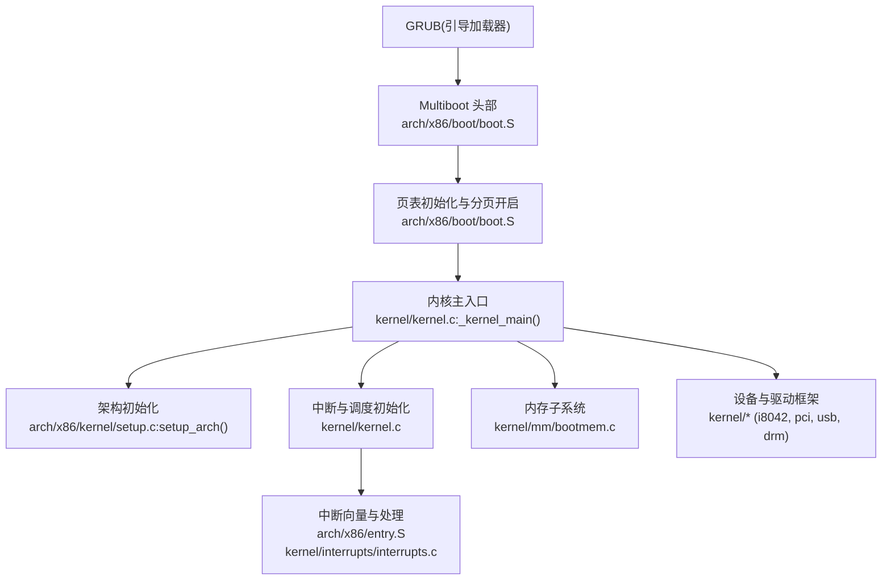
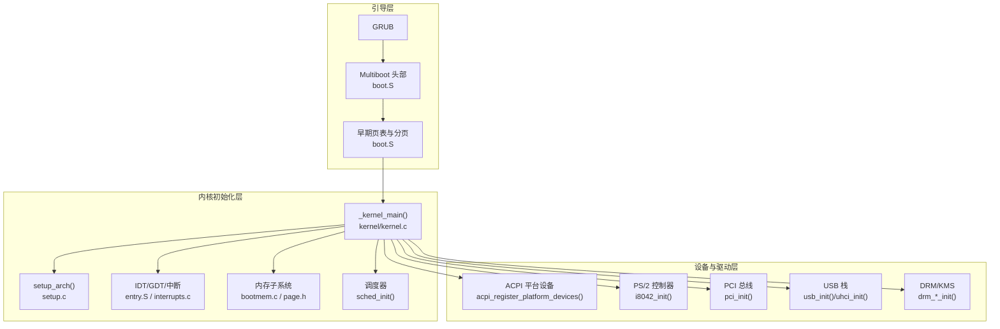
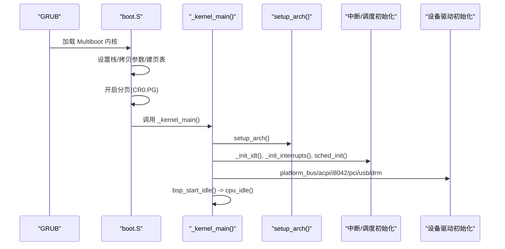
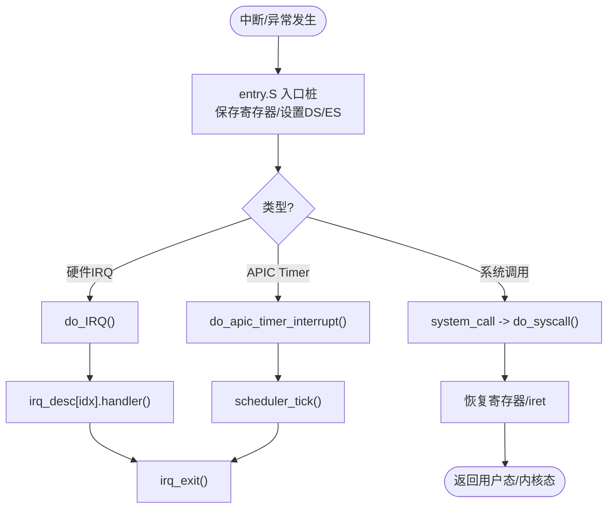
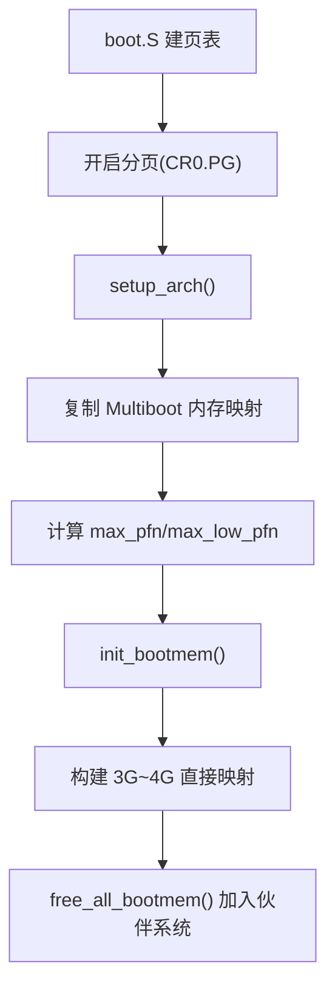
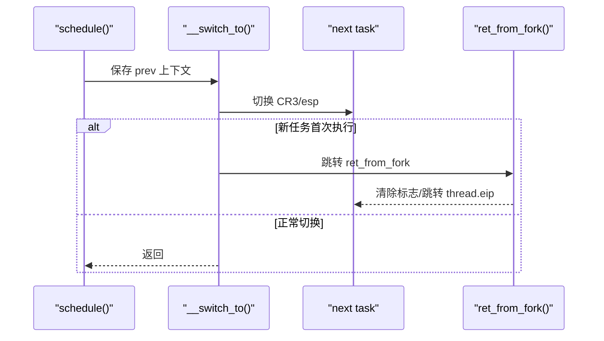
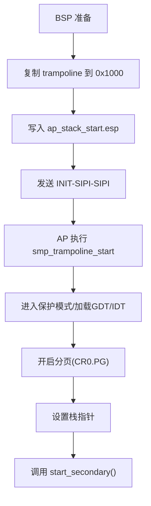
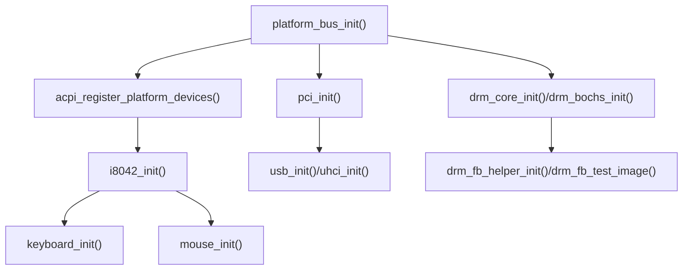
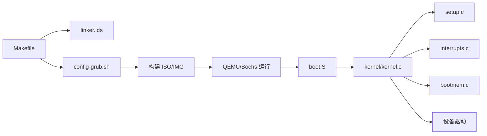

# 系统架构

<cite>
**本文引用的文件**
- [README.md](file://README.md)
- [Makefile](file://Makefile)
- [linker.lds](file://linker.lds)
- [arch/x86/boot/boot.S](file://arch/x86/boot/boot.S)
- [arch/x86/entry.S](file://arch/x86/entry.S)
- [kernel/kernel.c](file://kernel/kernel.c)
- [arch/x86/kernel/setup.c](file://arch/x86/kernel/setup.c)
- [includes/arch/x86/system.h](file://includes/arch/x86/system.h)
- [includes/arch/x86/page.h](file://includes/arch/x86/page.h)
- [includes/arch/x86/gdt.h](file://includes/arch/x86/gdt.h)
- [includes/arch/x86/idt.h](file://includes/arch/x86/idt.h)
- [kernel/interrupts/interrupts.c](file://kernel/interrupts/interrupts.c)
- [arch/x86/kernel/cpu.c](file://arch/x86/kernel/cpu.c)
- [kernel/mm/bootmem.c](file://kernel/mm/bootmem.c)
- [config-grub.sh](file://config-grub.sh)
</cite>

## 目录
1. [简介](#简介)
2. [项目结构](#项目结构)
3. [核心组件](#核心组件)
4. [架构总览](#架构总览)
5. [详细组件分析](#详细组件分析)
6. [依赖关系分析](#依赖关系分析)
7. [性能考量](#性能考量)
8. [故障排查指南](#故障排查指南)
9. [结论](#结论)
10. [附录](#附录)

## 简介
本文件为 LulaOS 的系统架构文档，面向架构师与高级开发者。内容涵盖：
- 分层架构模式与模块化设计原则
- 从 GRUB 引导加载器到内核入口点、硬件初始化的完整启动流程
- 关键设计决策与技术权衡（x86 架构选择、保护模式启用、分页机制等）
- 系统上下文图与组件关系图
- 中断子系统、内存管理、SMP 支持、设备驱动框架的交互关系

LulaOS 基于 x86 架构，采用 Multiboot 协议由 GRUB 加载内核镜像；内核以 32 位保护模式运行，开启分页并将内核映射至高端虚拟地址空间（PAGE_OFFSET=0xC0000000）。系统提供中断、调度、内存分配（bootmem→伙伴系统）、平台总线与 ACPI 设备枚举、PCI/USB/DRM 图形栈等基础能力。

**章节来源**
- [README.md:1-84](file://README.md#L1-L84)

## 项目结构
LulaOS 采用“架构相关代码 + 通用内核 + HAL/驱动”的分层组织方式：
- arch/x86：CPU/中断/页表/GDT/IDT/SMP trampoline 等与 x86 强相关的实现
- kernel：调度、中断分发、内存管理、TTY、键盘鼠标、PCI/USB、DRM 图形等通用内核功能
- includes：公共头文件，按 arch/device/driver 等维度划分
- hal：硬件抽象层（当前为空目录，预留扩展）
- 构建脚本与链接脚本：Makefile、linker.lds、config-grub.sh

**图表来源**
- [arch/x86/boot/boot.S:13-121](file://arch/x86/boot/boot.S#L13-L121)
- [kernel/kernel.c:72-135](file://kernel/kernel.c#L72-L135)
- [arch/x86/kernel/setup.c:201-214](file://arch/x86/kernel/setup.c#L201-L214)
- [kernel/interrupts/interrupts.c:18-27](file://kernel/interrupts/interrupts.c#L18-L27)
- [arch/x86/entry.S:186-443](file://arch/x86/entry.S#L186-L443)

**章节来源**
- [Makefile:1-138](file://Makefile#L1-L138)
- [linker.lds:1-103](file://linker.lds#L1-L103)

## 核心组件
- 引导与链接
  - Multiboot 头部与入口：定义在 boot.S 中，负责设置栈、拷贝参数、建立早期页表并开启分页，然后跳转到内核主函数。
  - 链接布局：linker.lds 将 .text/.data/.bss 等节映射到高端虚拟地址（PAGE_OFFSET+偏移），并保留 trampoline 段用于 SMP AP 启动。
- 架构初始化
  - setup_arch：复制 Multiboot 信息、计算物理内存范围、初始化 bootmem、构建 3G~4G 页表映射、初始化帧缓冲控制台与 ACPI。
  - CPU 探测：通过 CPUID 获取厂商、型号、地址宽度等信息。
- 中断与异常
  - entry.S 提供统一的异常/中断入口桩，压入寄存器状态后调用 do_IRQ 或具体处理器（如 page_fault、system_call）。
  - interrupts.c 维护 IRQ 描述符表，提供 request_irq/free_irq，APIC Timer 驱动调度 tick。
- 内存管理
  - bootmem.c：基于位图的简单分配器，负责保留关键区域、释放可用页到伙伴系统。
  - page.h/system.h：页大小、对齐、虚拟/物理地址转换、CR3 加载、中断开关等底层宏。
- 调度与进程
  - entry.S 中的 __switch_to 与 ret_from_fork 完成上下文切换与新任务首次执行。
  - kernel/kernel.c 中 sched_init 初始化调度器，APIC Timer 驱动 scheduler_tick。
- 设备与驱动
  - platform_bus_init/acpi_register_platform_devices：通过 ACPI 发现 PNP 设备并注册到平台总线。
  - i8042/keyboard/mouse：PS/2 控制器与输入设备驱动。
  - pci/usb/uhci：PCI 枚举与 USB 主机控制器驱动。
  - drm_core/drm_bochs/drm_fb_helper：VGA/VBE 图形显示与帧缓冲测试。

**章节来源**
- [arch/x86/boot/boot.S:13-121](file://arch/x86/boot/boot.S#L13-L121)
- [linker.lds:1-103](file://linker.lds#L1-L103)
- [arch/x86/kernel/setup.c:24-214](file://arch/x86/kernel/setup.c#L24-L214)
- [arch/x86/kernel/cpu.c:1-52](file://arch/x86/kernel/cpu.c#L1-L52)
- [arch/x86/entry.S:23-185](file://arch/x86/entry.S#L23-L185)
- [kernel/interrupts/interrupts.c:18-145](file://kernel/interrupts/interrupts.c#L18-L145)
- [kernel/mm/bootmem.c:12-223](file://kernel/mm/bootmem.c#L12-L223)
- [includes/arch/x86/page.h:1-47](file://includes/arch/x86/page.h#L1-L47)
- [includes/arch/x86/system.h:1-33](file://includes/arch/x86/system.h#L1-L33)
- [kernel/kernel.c:26-135](file://kernel/kernel.c#L26-L135)

## 架构总览
LulaOS 采用典型的“引导程序 → 内核初始化 → 子系统就绪 → 用户态服务”的分层架构：
- 引导层：GRUB 加载 Multiboot 内核镜像，进入 boot.S 完成早期环境搭建（栈、页表、分页）。
- 内核初始化层：setup_arch 解析内存布局，建立 3G~4G 直接映射；初始化 IDT/GDT、中断、调度、内存子系统。
- 设备与驱动层：ACPI 枚举平台设备，PS/2/PCI/USB/DRM 等驱动逐步注册并 probe。
- 运行时：APIC Timer 驱动调度 tick，调度器进行时间片轮转；空闲循环等待事件。

**图表来源**
- [arch/x86/boot/boot.S:13-121](file://arch/x86/boot/boot.S#L13-L121)
- [kernel/kernel.c:72-135](file://kernel/kernel.c#L72-L135)
- [arch/x86/kernel/setup.c:201-214](file://arch/x86/kernel/setup.c#L201-L214)
- [kernel/interrupts/interrupts.c:18-27](file://kernel/interrupts/interrupts.c#L18-L27)

## 详细组件分析

### 启动流程：从 GRUB 到内核入口
- GRUB 根据 config-grub.sh 生成 grub.cfg，加载内核二进制到内存，并跳转到 Multiboot 入口。
- boot.S 中：
  - 设置内核栈（位于 .bss 区）
  - 拷贝 Multiboot 参数到安全位置
  - 建立早期页表（swapper_pg_dir），将低内存与内核映射到虚拟地址
  - 开启分页（CR0.PG），切换到保护模式平坦段模型
  - 调用 _kernel_init（初始化 GDT），再跳转至 _kernel_main
- kernel/kernel.c 的 _kernel_main：
  - 打印欢迎信息
  - init_cpu 探测 CPU 特性
  - setup_arch 解析内存、建立页表、初始化帧缓冲与 ACPI
  - 初始化 IDT、中断、调度、内存子系统、vmalloc 区域
  - 注册平台总线、ACPI 设备、PS/2、键盘、鼠标、PCI、USB、UHCI、DRM
  - 切换到 init_thread_union 栈并进入 idle 循环

**图表来源**
- [arch/x86/boot/boot.S:37-121](file://arch/x86/boot/boot.S#L37-L121)
- [kernel/kernel.c:72-135](file://kernel/kernel.c#L72-L135)
- [arch/x86/kernel/setup.c:201-214](file://arch/x86/kernel/setup.c#L201-L214)

**章节来源**
- [arch/x86/boot/boot.S:37-121](file://arch/x86/boot/boot.S#L37-L121)
- [kernel/kernel.c:72-135](file://kernel/kernel.c#L72-L135)
- [arch/x86/kernel/setup.c:201-214](file://arch/x86/kernel/setup.c#L201-L214)
- [config-grub.sh:1-5](file://config-grub.sh#L1-L5)

### 中断与异常处理
- entry.S 为所有异常和硬件中断提供统一入口桩，保存寄存器状态，设置 DS/ES 为内核数据段，调用 C 层处理函数。
- 硬件中断经 BUILD_IRQ 宏生成各向量入口，压入向量号后调用 do_IRQ。
- interrupts.c：
  - 维护 irq_desc 数组，提供 request_irq/free_irq
  - do_IRQ 发送 EOI，查找并调用对应 handler
  - APIC Timer 中断驱动 scheduler_tick，触发调度检查
- 系统调用入口 system_call：保存用户态寄存器，调用 do_syscall，返回时恢复寄存器并 iret

**图表来源**
- [arch/x86/entry.S:186-443](file://arch/x86/entry.S#L186-L443)
- [kernel/interrupts/interrupts.c:18-145](file://kernel/interrupts/interrupts.c#L18-L145)

**章节来源**
- [arch/x86/entry.S:186-443](file://arch/x86/entry.S#L186-L443)
- [kernel/interrupts/interrupts.c:18-145](file://kernel/interrupts/interrupts.c#L18-L145)
- [includes/arch/x86/idt.h:1-41](file://includes/arch/x86/idt.h#L1-L41)

### 内存管理与分页
- 早期页表：boot.S 中建立 swapper_pg_dir，将低内存与内核映射到虚拟地址，开启分页后跳转至 _kernel_main。
- setup_arch：
  - 复制 Multiboot 内存映射
  - 计算 max_pfn/max_low_pfn，初始化 bootmem 分配器
  - 构建 3G~4G 直接映射页表（paging_init）
- bootmem.c：
  - 位图管理页面可用性
  - free_bootmem/reserve_bootmem 标记可用/保留区域
  - free_all_bootmem 将剩余可用页加入伙伴系统
- page.h/system.h：
  - PAGE_OFFSET=0xC0000000，__pa/__va 转换
  - load_cr3 宏用于切换页目录

**图表来源**
- [arch/x86/boot/boot.S:61-100](file://arch/x86/boot/boot.S#L61-L100)
- [arch/x86/kernel/setup.c:24-196](file://arch/x86/kernel/setup.c#L24-L196)
- [kernel/mm/bootmem.c:12-223](file://kernel/mm/bootmem.c#L12-L223)
- [includes/arch/x86/page.h:1-47](file://includes/arch/x86/page.h#L1-L47)
- [includes/arch/x86/system.h:26-33](file://includes/arch/x86/system.h#L26-L33)

**章节来源**
- [arch/x86/boot/boot.S:61-100](file://arch/x86/boot/boot.S#L61-L100)
- [arch/x86/kernel/setup.c:24-196](file://arch/x86/kernel/setup.c#L24-L196)
- [kernel/mm/bootmem.c:12-223](file://kernel/mm/bootmem.c#L12-L223)
- [includes/arch/x86/page.h:1-47](file://includes/arch/x86/page.h#L1-L47)
- [includes/arch/x86/system.h:26-33](file://includes/arch/x86/system.h#L26-L33)

### 进程与上下文切换
- __switch_to：保存 prev 的 eflags 与 callee-saved 寄存器到 thread_struct，更新 esp/eip；若 next.pgd 非空则切换 CR3；若 next 从未启动则跳转 ret_from_fork。
- ret_from_fork：清除 PF_NEVER_STARTED 标志，跳转到 thread.eip 继续执行。
- 调度：APIC Timer 中断驱动 scheduler_tick，必要时置 need_resched，ret_from_intr 检查并调用 schedule。

**图表来源**
- [arch/x86/entry.S:489-610](file://arch/x86/entry.S#L489-L610)
- [kernel/interrupts/interrupts.c:110-128](file://kernel/interrupts/interrupts.c#L110-L128)

**章节来源**
- [arch/x86/entry.S:489-610](file://arch/x86/entry.S#L489-L610)
- [kernel/interrupts/interrupts.c:110-128](file://kernel/interrupts/interrupts.c#L110-L128)

### SMP 启动与 Trampoline
- BSP 将 trampoline 代码复制到物理地址 0x1000，写入 AP 栈顶地址，发送 INIT-SIPI-SIPI 启动 AP。
- AP 在 trampoline 中：
  - 清缓存、关中断、设置段寄存器
  - 加载临时 GDT，进入保护模式
  - 加载正式 GDT/IDT，开启分页（共享 swapper_pg_dir）
  - 设置栈指针，调用 start_secondary()

**图表来源**
- [arch/x86/entry.S:613-733](file://arch/x86/entry.S#L613-L733)

**章节来源**
- [arch/x86/entry.S:613-733](file://arch/x86/entry.S#L613-L733)

### 设备与驱动框架
- 平台总线与 ACPI：platform_bus_init 注册平台总线，acpi_register_platform_devices 扫描 AML 发现 PNP 设备（如键盘/鼠标）。
- PS/2 控制器：i8042_init 初始化控制器并注册设备/驱动，完成硬件初始化。
- PCI/USB：pci_init 枚举 PCI 设备；usb_init 注册 USB 总线；uhci_init 初始化 UHCI 主机控制器并创建 Root Hub。
- DRM/KMS：drm_core_init 初始化图形核心；drm_bochs_init 检测 VGA/VBE 设备并初始化 KMS；drm_fb_helper_init 缓存 VRAM 参数；drm_fb_test_image 绘制测试图案验证显示服务。

**图表来源**
- [kernel/kernel.c:95-129](file://kernel/kernel.c#L95-L129)

**章节来源**
- [kernel/kernel.c:95-129](file://kernel/kernel.c#L95-L129)

## 依赖关系分析
- 引导阶段依赖 Multiboot 协议与 GRUB 配置；内核链接布局由 linker.lds 决定。
- 内核初始化依赖：
  - 页表与分页：page.h/system.h 提供页操作与 CR3 加载
  - 中断：entry.S 提供入口，interrupts.c 提供分发
  - 内存：setup.c 解析 Multiboot 信息，bootmem.c 管理位图
  - 调度：APIC Timer 驱动 scheduler_tick
  - 设备：ACPI/PCI/USB/DRM 依次初始化
- 构建依赖：Makefile 指定编译器、链接脚本、ISO 构建流程；config-grub.sh 生成 grub.cfg

**图表来源**
- [Makefile:1-138](file://Makefile#L1-L138)
- [linker.lds:1-103](file://linker.lds#L1-L103)
- [config-grub.sh:1-5](file://config-grub.sh#L1-L5)

**章节来源**
- [Makefile:1-138](file://Makefile#L1-L138)
- [linker.lds:1-103](file://linker.lds#L1-L103)
- [config-grub.sh:1-5](file://config-grub.sh#L1-L5)

## 性能考量
- 分页与缓存：trampoline 首指令 wbinvd 确保缓存一致性；AP 开启分页前清除 CR0.CD/NW，避免调试器显示异常。
- 中断延迟：do_IRQ 与 APIC Timer ISR 优先发送 EOI，减少同级及低优先级中断阻塞。
- 内存分配：bootmem 使用位图快速标记，free_all_bootmem 将剩余页加入伙伴系统，提升后续分配效率。
- 调度粒度：APIC Timer tick 驱动 scheduler_tick，合理的时间片切分保障响应性。

[本节为通用指导，不直接分析具体文件]

## 故障排查指南
- 无法进入内核主函数
  - 检查 Multiboot 头部与 GRUB 配置是否正确
  - 确认 boot.S 中页表建立与分页开启逻辑
- 中断无响应
  - 检查 IDT 是否初始化，IRQ 是否通过 request_irq 注册
  - 确认 IOAPIC/LAPIC 使能与 EOI 发送
- 内存分配失败
  - 检查 Multiboot 内存映射复制是否正确
  - 确认 bootmem 位图标记与保留区域设置
- 图形显示异常
  - 验证 DRM 核心与 Bochs/VBE 驱动初始化顺序
  - 检查 fb_ioremap 与 vmalloc_area_init 的地址冲突

**章节来源**
- [arch/x86/boot/boot.S:61-121](file://arch/x86/boot/boot.S#L61-L121)
- [kernel/interrupts/interrupts.c:18-145](file://kernel/interrupts/interrupts.c#L18-L145)
- [arch/x86/kernel/setup.c:24-214](file://arch/x86/kernel/setup.c#L24-L214)
- [kernel/kernel.c:95-129](file://kernel/kernel.c#L95-L129)

## 结论
LulaOS 采用清晰的层次化架构与模块化设计，从 GRUB 引导到内核初始化、设备驱动就绪的路径明确且可扩展。x86 架构选择结合保护模式与分页机制，提供了稳定的运行环境；中断与调度子系统保障了系统的实时性与响应性；内存管理从 bootmem 过渡到伙伴系统，兼顾了启动效率与运行时灵活性。SMP trampoline 与 ACPI 设备枚举为多核与即插即用能力奠定基础。整体设计在可维护性、可扩展性与性能之间取得良好平衡。

[本节为总结性内容，不直接分析具体文件]

## 附录
- 构建与运行
  - 使用 Makefile 构建 ISO/IMG，并通过 QEMU/Bochs 运行
  - 调试目标：all-debug、debug-qemu、debug-bochs
- 关键符号与地址
  - PAGE_OFFSET=0xC0000000，内核映射至高端虚拟地址
  - swapper_pg_dir：全局页目录，供 BSP/AP 共享
  - init_thread_union：BSP idle 循环使用的内核栈

**章节来源**
- [Makefile:86-112](file://Makefile#L86-L112)
- [includes/arch/x86/page.h:1-47](file://includes/arch/x86/page.h#L1-L47)
- [arch/x86/boot/boot.S:170-183](file://arch/x86/boot/boot.S#L170-L183)
- [kernel/kernel.c:41-69](file://kernel/kernel.c#L41-L69)