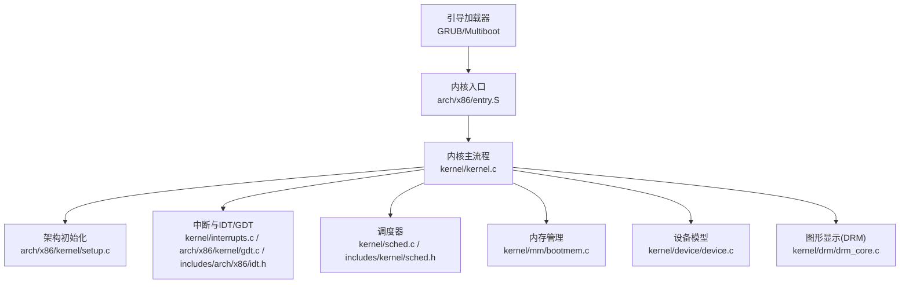
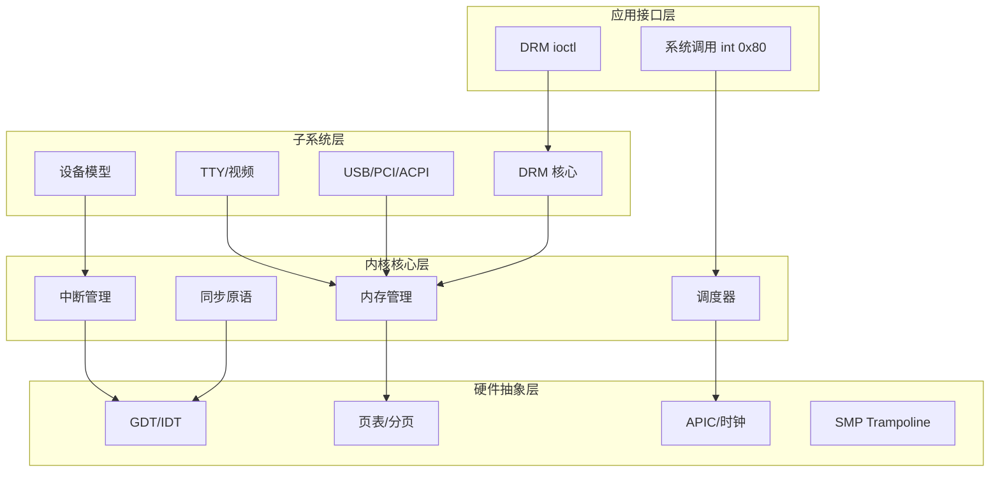
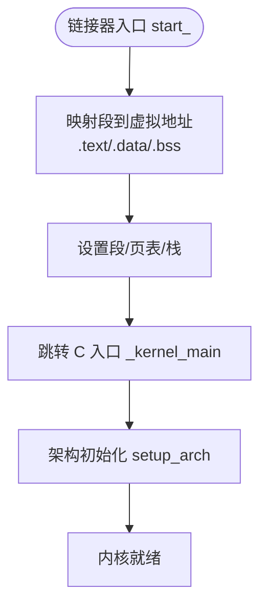
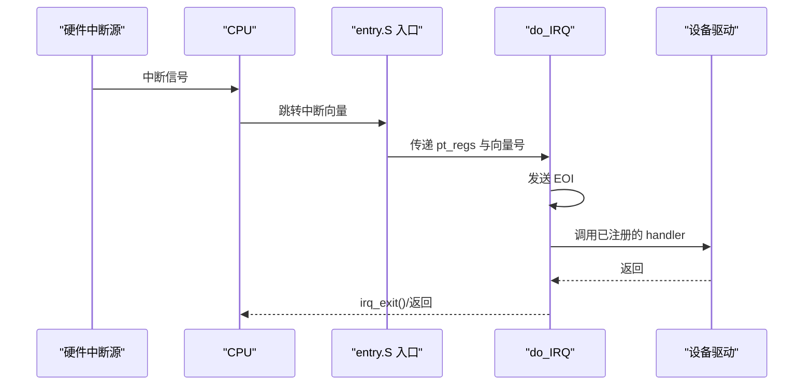
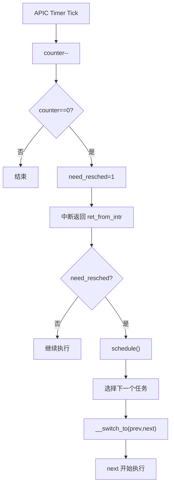
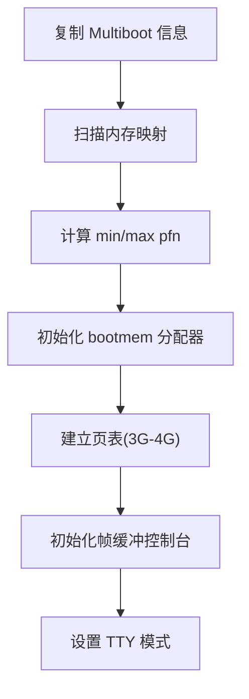
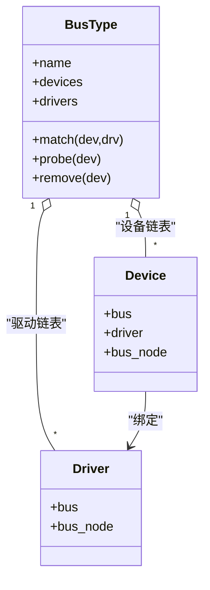
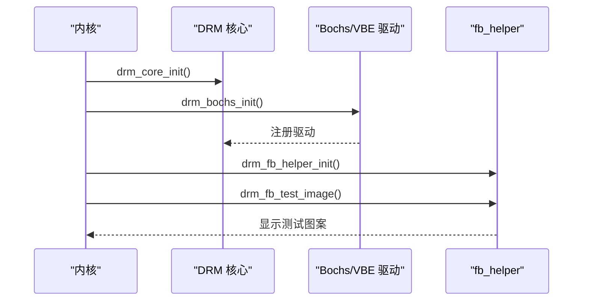
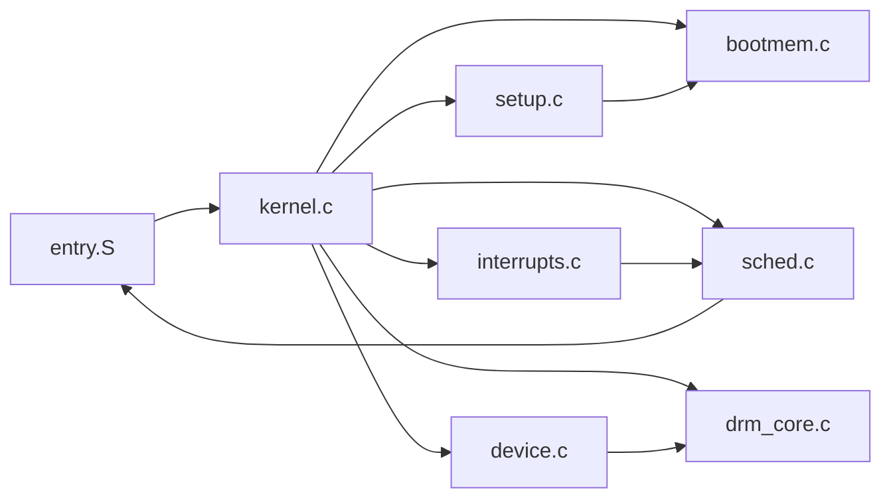

# 系统概览

<cite>
**本文引用的文件**
- [README.md](file://README.md)
- [Makefile](file://Makefile)
- [linker.lds](file://linker.lds)
- [entry.S](file://arch/x86/entry.S)
- [kernel.c](file://kernel/kernel.c)
- [setup.c](file://arch/x86/kernel/setup.c)
- [sched.c](file://kernel/sched.c)
- [bootmem.c](file://kernel/mm/bootmem.c)
- [system.h](file://includes/arch/x86/system.h)
- [sched.h](file://includes/kernel/sched.h)
- [interrupts.c](file://kernel/interrupts/interrupts.c)
- [idt.h](file://includes/arch/x86/idt.h)
- [gdt.c](file://arch/x86/kernel/gdt.c)
- [drm_core.c](file://kernel/drm/drm_core.c)
- [device.c](file://kernel/device/device.c)
</cite>

## 目录
1. [简介](#简介)
2. [项目结构](#项目结构)
3. [核心组件](#核心组件)
4. [架构总览](#架构总览)
5. [详细组件分析](#详细组件分析)
6. [依赖关系分析](#依赖关系分析)
7. [性能考量](#性能考量)
8. [故障排查指南](#故障排查指南)
9. [结论](#结论)
10. [附录：学习路径与使用指引](#附录学习路径与使用指引)

## 简介
LulaOS 是一个面向 x86 架构的教学型操作系统，目标是在最小内核中实现进程调度、中断管理、内存管理、设备模型与图形显示等核心能力。系统采用模块化设计，按“硬件抽象层（HAL）—内核核心层—子系统层—应用接口层”分层组织代码，便于扩展与维护。启动流程基于 Multiboot/GRUB，内核以固定虚拟地址映射运行，并通过 APIC 定时器驱动时间片轮转调度。

## 项目结构
- arch/x86：x86 架构相关实现（入口、中断向量、SMP Trampoline、GDT/IDT、APIC、CPU、页表等）
- kernel：内核核心与子系统（调度、内存、中断、设备模型、TTY、视频、USB、DRM 等）
- includes：公共头文件（架构相关、内核接口、子系统接口）
- libs：基础库（如 vsprintf）
- config、Makefile、linker.lds：构建与链接配置

图表来源
- [entry.S:452-486](file://arch/x86/entry.S#L452-L486)
- [kernel.c:72-135](file://kernel/kernel.c#L72-L135)
- [setup.c:201-214](file://arch/x86/kernel/setup.c#L201-L214)
- [interrupts.c:18-27](file://kernel/interrupts/interrupts.c#L18-L27)
- [gdt.c:13-22](file://arch/x86/kernel/gdt.c#L13-L22)
- [sched.c:76-97](file://kernel/sched.c#L76-L97)
- [bootmem.c:12-28](file://kernel/mm/bootmem.c#L12-L28)
- [device.c:22-34](file://kernel/device/device.c#L22-L34)
- [drm_core.c:258-263](file://kernel/drm/drm_core.c#L258-L263)

章节来源
- [Makefile:1-30](file://Makefile#L1-L30)
- [linker.lds:1-103](file://linker.lds#L1-L103)

## 核心组件
- 启动与链接：通过 GRUB 加载 Multiboot 镜像，链接脚本将 .text/.data/.bss 等段映射到固定虚拟地址空间，并定义 trampoline 与 initcall/init.data 等节用于早期初始化。
- 中断与异常：entry.S 提供统一的异常/中断入口与包装器，注册 IDT；interrupts.c 维护 IRQ 描述符表，分发至具体驱动处理函数。
- 调度器：基于静态优先级+时间片轮转，每个 CPU 拥有独立运行队列；通过 APIC 定时器 tick 递减 counter，触发 need_resched 并在合适时机调用 schedule()。
- 内存管理：启动阶段使用 bootmem 位图分配器，随后迁移到伙伴系统与 slab；setup_arch 负责扫描内存映射、建立页表与高内存区划分。
- 设备模型：统一 bus_type/device/device_driver 注册与匹配机制，支持平台总线、PCI、USB 等设备发现与绑定。
- 图形显示：DRM 核心框架 + Bochs/QEMU VBE 驱动，提供 dumb buffer、Page Flip、Framebuffer 创建与模式设置等能力。

章节来源
- [linker.lds:1-103](file://linker.lds#L1-L103)
- [entry.S:23-91](file://arch/x86/entry.S#L23-L91)
- [interrupts.c:18-27](file://kernel/interrupts/interrupts.c#L18-L27)
- [sched.c:128-213](file://kernel/sched.c#L128-L213)
- [setup.c:182-214](file://arch/x86/kernel/setup.c#L182-L214)
- [device.c:22-34](file://kernel/device/device.c#L22-L34)
- [drm_core.c:258-311](file://kernel/drm/drm_core.c#L258-L311)

## 架构总览
系统自下而上分为四层：
- 硬件抽象层（HAL）：x86 体系结构相关代码（段/页表/中断/时钟/SMP），屏蔽底层差异。
- 内核核心层：调度、内存、中断、同步原语、进程/线程模型。
- 子系统层：设备模型、TTY、视频、USB、PCI、ACPI、DRM 等。
- 应用接口层：系统调用入口（int 0x80）、DRM ioctl 等用户态交互通道。

图表来源
- [entry.S:452-486](file://arch/x86/entry.S#L452-L486)
- [interrupts.c:84-108](file://kernel/interrupts/interrupts.c#L84-L108)
- [sched.c:128-213](file://kernel/sched.c#L128-L213)
- [setup.c:182-214](file://arch/x86/kernel/setup.c#L182-L214)
- [gdt.c:13-22](file://arch/x86/kernel/gdt.c#L13-L22)
- [drm_core.c:258-311](file://kernel/drm/drm_core.c#L258-L311)

## 详细组件分析

### 启动与链接布局
- 链接脚本将内核载入固定虚拟地址（PAGE_OFFSET 以上），定义 .text/.init/*/.data/.rodata/.bss 等段，并将 trampoline 放在 .text 之后以避免被推出前 8KB。
- 入口点由 entry.S 的 start_ 开始，完成段寄存器、保护模式、分页等后进入 C 入口 _kernel_main。

图表来源
- [linker.lds:1-103](file://linker.lds#L1-L103)
- [entry.S:452-486](file://arch/x86/entry.S#L452-L486)
- [setup.c:201-214](file://arch/x86/kernel/setup.c#L201-L214)

章节来源
- [linker.lds:1-103](file://linker.lds#L1-L103)
- [entry.S:452-486](file://arch/x86/entry.S#L452-L486)
- [setup.c:201-214](file://arch/x86/kernel/setup.c#L201-L214)

### 中断与异常处理
- entry.S 为各类异常和硬件中断生成入口桩，统一压入参数并跳转到 interrupt_warpper，再进入 do_IRQ 或具体 handler。
- interrupts.c 维护 irq_desc 表，request_irq/free_irq 用于注册/注销中断；APIC Timer 中断驱动 scheduler_tick。

图表来源
- [entry.S:186-443](file://arch/x86/entry.S#L186-L443)
- [interrupts.c:84-128](file://kernel/interrupts/interrupts.c#L84-L128)

章节来源
- [entry.S:186-443](file://arch/x86/entry.S#L186-L443)
- [interrupts.c:18-27](file://kernel/interrupts/interrupts.c#L18-L27)
- [interrupts.c:84-128](file://kernel/interrupts/interrupts.c#L84-L128)
- [idt.h:1-41](file://includes/arch/x86/idt.h#L1-L41)

### 调度器与上下文切换
- sched.c 实现 runqueue、schedule、scheduler_tick、cpu_idle、sys_fork/kernel_thread 等；current 宏通过 esp 掩码直接定位 task_struct。
- entry.S 中的 __switch_to 保存 prev 上下文、恢复 next 上下文，必要时切换到 CR3 并处理首次启动标志。

图表来源
- [interrupts.c:116-128](file://kernel/interrupts/interrupts.c#L116-L128)
- [sched.c:128-213](file://kernel/sched.c#L128-L213)
- [entry.S:41-58](file://arch/x86/entry.S#L41-L58)
- [entry.S:520-583](file://arch/x86/entry.S#L520-L583)

章节来源
- [sched.c:76-97](file://kernel/sched.c#L76-L97)
- [sched.c:128-213](file://kernel/sched.c#L128-L213)
- [sched.c:250-259](file://kernel/sched.c#L250-L259)
- [entry.S:41-58](file://arch/x86/entry.S#L41-L58)
- [entry.S:520-583](file://arch/x86/entry.S#L520-L583)
- [sched.h:21-106](file://includes/kernel/sched.h#L21-L106)

### 内存管理与页表
- setup_arch 复制 Multiboot 信息、计算 max_pfn/max_low_pfn，初始化 bootmem 分配器，建立 3G-4G 页表映射，并初始化 fbcon/tty。
- bootmem.c 实现位图分配器，free_all_bootmem 将可用页迁移到伙伴系统。

图表来源
- [setup.c:24-39](file://arch/x86/kernel/setup.c#L24-L39)
- [setup.c:94-118](file://arch/x86/kernel/setup.c#L94-L118)
- [setup.c:123-176](file://arch/x86/kernel/setup.c#L123-L176)
- [setup.c:182-214](file://arch/x86/kernel/setup.c#L182-L214)
- [bootmem.c:12-28](file://kernel/mm/bootmem.c#L12-L28)
- [bootmem.c:194-223](file://kernel/mm/bootmem.c#L194-L223)

章节来源
- [setup.c:201-214](file://arch/x86/kernel/setup.c#L201-L214)
- [bootmem.c:12-28](file://kernel/mm/bootmem.c#L12-L28)
- [bootmem.c:194-223](file://kernel/mm/bootmem.c#L194-L223)

### 设备模型与总线
- device.c 提供 bus/device/driver 注册与匹配，支持 platform_bus、PCI、USB 等总线类型。
- kernel.c 在初始化流程中注册 platform_bus，并通过 ACPI 枚举平台设备，随后初始化 i8042、键盘、鼠标等。

图表来源
- [device.c:22-34](file://kernel/device/device.c#L22-L34)
- [device.c:94-105](file://kernel/device/device.c#L94-L105)
- [device.c:130-139](file://kernel/device/device.c#L130-L139)
- [kernel.c:95-108](file://kernel/kernel.c#L95-L108)

章节来源
- [device.c:22-34](file://kernel/device/device.c#L22-L34)
- [device.c:94-105](file://kernel/device/device.c#L94-L105)
- [device.c:130-139](file://kernel/device/device.c#L130-L139)
- [kernel.c:95-108](file://kernel/kernel.c#L95-L108)

### 图形显示（DRM）
- drm_core.c 实现 DRM 核心：驱动注册、ioctl 分发、GEM/KMS 基本能力；Bochs 驱动探测 VGA 设备并初始化 KMS。
- 启动流程中依次初始化 DRM 核心、Bochs 驱动与 fb_helper，并绘制测试图像验证显示服务。

图表来源
- [kernel.c:119-129](file://kernel/kernel.c#L119-L129)
- [drm_core.c:258-311](file://kernel/drm/drm_core.c#L258-L311)

章节来源
- [kernel.c:119-129](file://kernel/kernel.c#L119-L129)
- [drm_core.c:258-311](file://kernel/drm/drm_core.c#L258-L311)

## 依赖关系分析
- 启动链：entry.S → kernel.c → setup.c → 各子系统初始化
- 中断链：entry.S → interrupts.c → 设备驱动
- 调度链：APIC Timer → scheduler_tick → need_resched → schedule → __switch_to
- 内存链：setup_arch → bootmem → 伙伴系统/slab
- 设备链：platform_bus/ACPI → i8042/keyboard/mouse → PCI/USB/DRM

图表来源
- [entry.S:452-486](file://arch/x86/entry.S#L452-L486)
- [kernel.c:72-135](file://kernel/kernel.c#L72-L135)
- [setup.c:201-214](file://arch/x86/kernel/setup.c#L201-L214)
- [interrupts.c:84-128](file://kernel/interrupts/interrupts.c#L84-L128)
- [sched.c:128-213](file://kernel/sched.c#L128-L213)
- [bootmem.c:12-28](file://kernel/mm/bootmem.c#L12-L28)
- [device.c:22-34](file://kernel/device/device.c#L22-L34)
- [drm_core.c:258-311](file://kernel/drm/drm_core.c#L258-L311)

章节来源
- [kernel.c:72-135](file://kernel/kernel.c#L72-L135)
- [entry.S:452-486](file://arch/x86/entry.S#L452-L486)
- [interrupts.c:84-128](file://kernel/interrupts/interrupts.c#L84-L128)
- [sched.c:128-213](file://kernel/sched.c#L128-L213)
- [setup.c:201-214](file://arch/x86/kernel/setup.c#L201-L214)
- [bootmem.c:12-28](file://kernel/mm/bootmem.c#L12-L28)
- [device.c:22-34](file://kernel/device/device.c#L22-L34)
- [drm_core.c:258-311](file://kernel/drm/drm_core.c#L258-L311)

## 性能考量
- 调度器：idle 任务不递减 counter，避免无意义调度；need_resched 在中断返回时检查，减少主动调度开销。
- 中断处理：尽早发送 EOI，避免阻塞同级/低优先级中断；do_IRQ 快速路由到驱动。
- 内存：bootmem 位图分配简单高效；迁移到伙伴系统后降低碎片；vmalloc 区域与 framebuffer 对齐避免冲突。
- SMP：trampoline 确保 AP 安全进入保护模式并开启分页；负载均衡选择最空闲 CPU 减少迁移成本。

[本节为通用性能讨论，不直接分析特定文件]

## 故障排查指南
- 无法进入内核：检查 GRUB 配置与 Multiboot 头部；确认链接脚本地址与页表映射一致。
- 中断不触发：确认 IDT 已正确设置；request_irq 是否成功；IOAPIC/LAPIC 是否使能。
- 调度不工作：检查 APIC Timer 是否配置；scheduler_tick 是否被调用；need_resched 是否正确置位。
- 内存崩溃：核对 bootmem 位图边界；确认 free_all_bootmem 迁移逻辑；避免越界访问。
- 显示异常：确认 DRM 核心与驱动初始化顺序；检查 fb_helper 参数与 Page Flip 流程。

章节来源
- [entry.S:452-486](file://arch/x86/entry.S#L452-L486)
- [interrupts.c:18-27](file://kernel/interrupts/interrupts.c#L18-L27)
- [interrupts.c:84-128](file://kernel/interrupts/interrupts.c#L84-L128)
- [sched.c:250-259](file://kernel/sched.c#L250-L259)
- [bootmem.c:194-223](file://kernel/mm/bootmem.c#L194-L223)
- [drm_core.c:258-311](file://kernel/drm/drm_core.c#L258-L311)

## 结论
LulaOS 以清晰的分层与模块化设计实现了 x86 平台上的基础操作系统能力。通过 Multiboot/GRUB 启动、APIC 定时器驱动调度、bootmem→伙伴系统的内存演进、统一设备模型以及 DRM 图形框架，系统在可教学性与可扩展性之间取得平衡。后续可在 USB 输入、网络协议栈、文件系统等方面继续扩展。

[本节为总结性内容，不直接分析特定文件]

## 附录：学习路径与使用指引
- 环境准备：安装 GCC/G++、交叉编译工具链、QEMU/Bochs、GRUB 工具集。
- 构建与运行：
  - 全量构建：make all
  - QEMU 调试：make debug-qemu
  - Bochs 调试：make debug-bochs
- 建议阅读顺序：
  1) 链接脚本与入口：linker.lds → entry.S
  2) 内核主流程：kernel.c → setup.c
  3) 中断与调度：interrupts.c → sched.c → system.h
  4) 内存管理：bootmem.c → setup.c
  5) 设备模型与图形：device.c → drm_core.c

章节来源
- [README.md:3-84](file://README.md#L3-L84)
- [Makefile:86-112](file://Makefile#L86-L112)