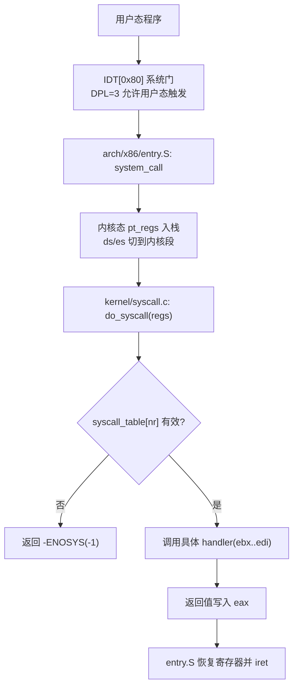
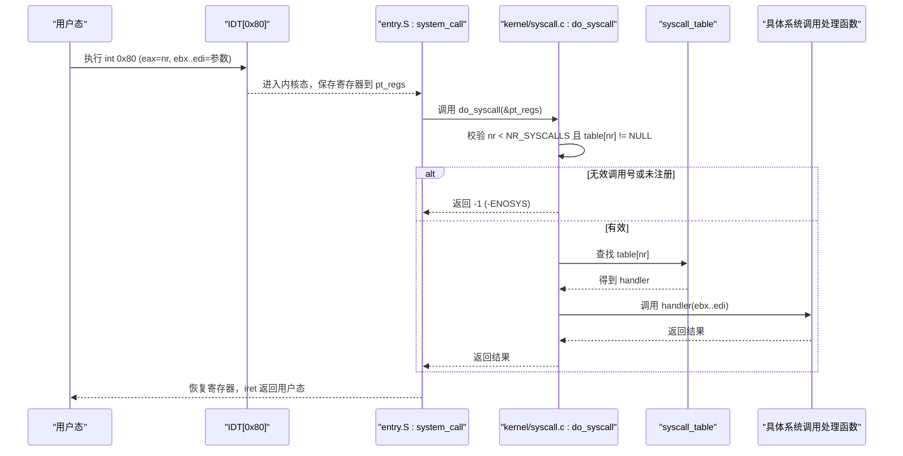
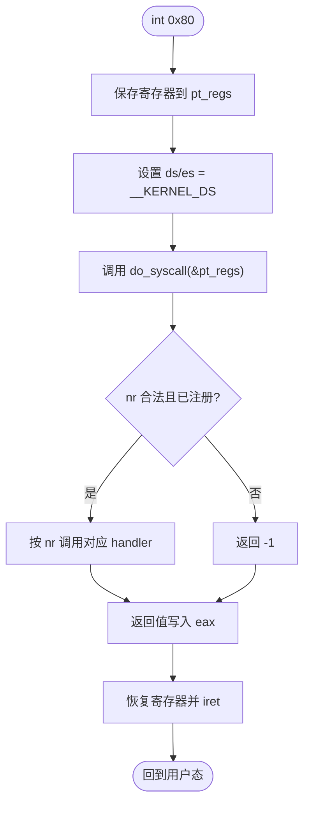
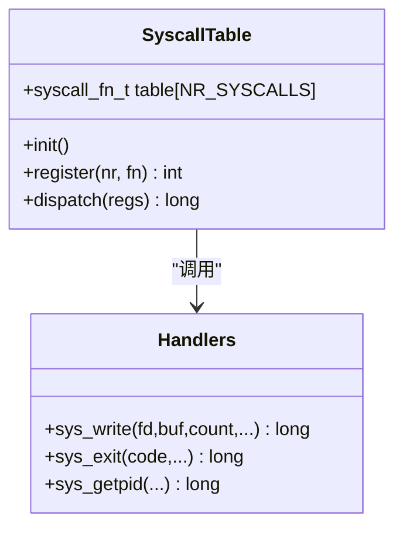
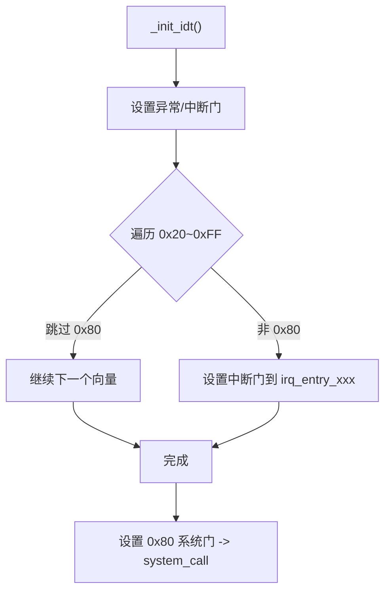
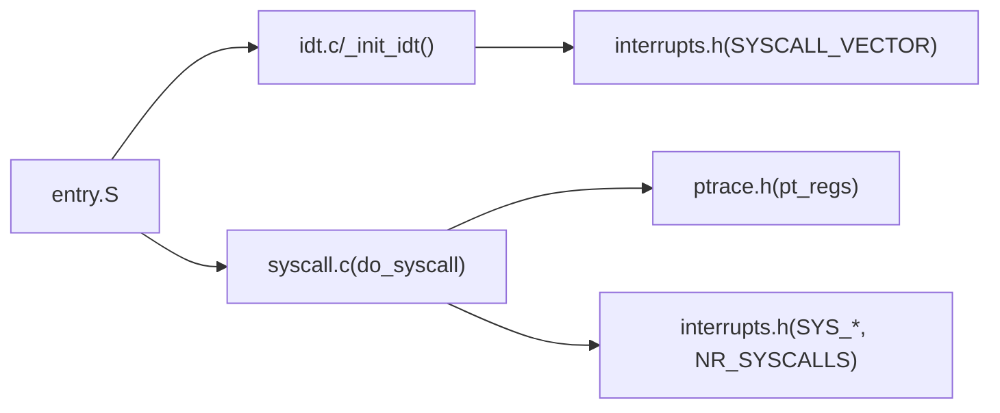
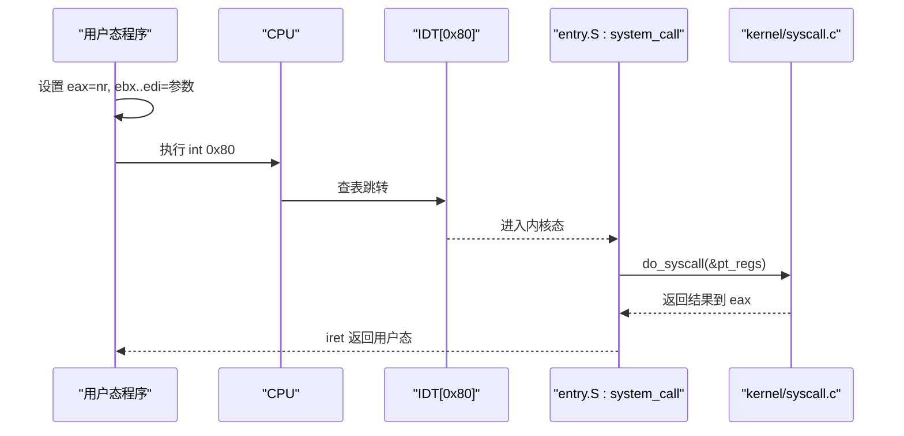

# 系统调用接口

<cite>
**本文引用的文件**
- [kernel/syscall.c](file://kernel/syscall.c)
- [arch/x86/entry.S](file://arch/x86/entry.S)
- [includes/interrupts/interrupts.h](file://includes/interrupts/interrupts.h)
- [includes/arch/x86/idt.h](file://includes/arch/x86/idt.h)
- [arch/x86/kernel/idt.c](file://arch/x86/kernel/idt.c)
- [includes/arch/x86/ptrace.h](file://includes/arch/x86/ptrace.h)
</cite>

## 目录
1. [简介](#简介)
2. [项目结构](#项目结构)
3. [核心组件](#核心组件)
4. [架构总览](#架构总览)
5. [详细组件分析](#详细组件分析)
6. [依赖关系分析](#依赖关系分析)
7. [性能与可扩展性](#性能与可扩展性)
8. [故障排查指南](#故障排查指南)
9. [结论](#结论)
10. [附录：ABI 规范与用户态集成指南](#附录abi-规范与用户态集成指南)

## 简介
本文件面向LulaOS的系统调用子系统，系统性说明系统调用的工作机制、调用约定、参数传递、系统调用表的建立与分发、以及安全与权限控制。文档同时提供流程图和ABI规范，帮助用户态程序开发者正确集成系统调用。

## 项目结构
围绕系统调用的关键代码分布如下：
- 入口与上下文切换：arch/x86/entry.S（包含 system_call 入口、寄存器保存/恢复、进程切换等）
- 系统调用表与分发：kernel/syscall.c（do_syscall、register_syscall、内置实现）
- IDT 初始化与向量映射：arch/x86/kernel/idt.c、includes/arch/x86/idt.h（将 SYSCALL_VECTOR 指向 system_call）
- 中断与系统调用号定义：includes/interrupts/interrupts.h（SYSCALL_VECTOR、SYS_*、NR_SYSCALLS）
- 寄存器帧结构：includes/arch/x86/ptrace.h（pt_regs）

图表来源
- [arch/x86/entry.S:445-486](file://arch/x86/entry.S#L445-L486)
- [kernel/syscall.c:86-98](file://kernel/syscall.c#L86-L98)
- [arch/x86/kernel/idt.c:328-329](file://arch/x86/kernel/idt.c#L328-L329)
- [includes/interrupts/interrupts.h:35-66](file://includes/interrupts/interrupts.h#L35-L66)

章节来源
- [arch/x86/entry.S:445-486](file://arch/x86/entry.S#L445-L486)
- [kernel/syscall.c:1-99](file://kernel/syscall.c#L1-L99)
- [arch/x86/kernel/idt.c:284-331](file://arch/x86/kernel/idt.c#L284-L331)
- [includes/interrupts/interrupts.h:35-66](file://includes/interrupts/interrupts.h#L35-L66)
- [includes/arch/x86/ptrace.h:5-23](file://includes/arch/x86/ptrace.h#L5-L23)

## 核心组件
- 系统调用入口与上下文切换：entry.S 中的 system_call，负责从用户态切换到内核态、保存寄存器、设置数据段、调用 do_syscall，并将返回值写回寄存器后返回用户态。
- 系统调用表与分发：syscall.c 维护 syscall_table，并在 do_syscall 中根据调用号进行边界检查与函数指针分发。
- IDT 配置：idt.c 将 SYSCALL_VECTOR(0x80) 设置为系统门（DPL=3），使用户态可通过 int 0x80 触发系统调用。
- 寄存器帧：pt_regs 在 entry.S 中压栈，作为 do_syscall 的参数，承载调用号与参数。

章节来源
- [arch/x86/entry.S:445-486](file://arch/x86/entry.S#L445-L486)
- [kernel/syscall.c:56-98](file://kernel/syscall.c#L56-L98)
- [arch/x86/kernel/idt.c:328-329](file://arch/x86/kernel/idt.c#L328-L329)
- [includes/arch/x86/ptrace.h:5-23](file://includes/arch/x86/ptrace.h#L5-L23)

## 架构总览
下图展示一次完整系统调用从用户态到内核态的时序：

图表来源
- [arch/x86/entry.S:445-486](file://arch/x86/entry.S#L445-L486)
- [kernel/syscall.c:86-98](file://kernel/syscall.c#L86-L98)
- [arch/x86/kernel/idt.c:328-329](file://arch/x86/kernel/idt.c#L328-L329)
- [includes/interrupts/interrupts.h:35-66](file://includes/interrupts/interrupts.h#L35-L66)

## 详细组件分析

### 系统调用入口与 ABI（entry.S）
- 触发方式：用户态通过 int 0x80 触发，CPU 根据 IDT 中 0x80 的系统门（DPL=3）转入内核态。
- 参数约定（Linux ABI 兼容）：
  - eax：系统调用号
  - ebx：参数1
  - ecx：参数2
  - edx：参数3
  - esi：参数4
  - edi：参数5
  - 返回值：eax
- 上下文切换要点：
  - 保存所有通用寄存器到 pt_regs
  - 将 ds/es 切换到内核数据段
  - 将 &pt_regs 作为参数传给 do_syscall
  - 将 do_syscall 返回值写回 pt_regs.eax
  - 恢复寄存器并通过 iret 返回用户态

图表来源
- [arch/x86/entry.S:445-486](file://arch/x86/entry.S#L445-L486)

章节来源
- [arch/x86/entry.S:445-486](file://arch/x86/entry.S#L445-L486)
- [includes/arch/x86/ptrace.h:5-23](file://includes/arch/x86/ptrace.h#L5-L23)

### 系统调用表与分发（kernel/syscall.c）
- 表结构：静态数组 syscall_table[NR_SYSCALLS]，元素类型为函数指针。
- 初始化：syscall_init 清零表并注册内置系统调用（write、exit、getpid）。
- 注册机制：register_syscall(nr, fn) 将函数指针写入表中，越界时返回错误。
- 分发逻辑：do_syscall 读取 regs->eax 为调用号，检查范围与有效性，然后调用对应 handler，参数来自 regs->ebx..edi，返回值写回 regs->eax。

图表来源
- [kernel/syscall.c:6-98](file://kernel/syscall.c#L6-L98)

章节来源
- [kernel/syscall.c:6-98](file://kernel/syscall.c#L6-L98)

### IDT 与向量映射（idt.c / idt.h）
- IDT 项类型：使用系统门（DPL=3）允许用户态触发。
- 向量分配：SYSCALL_VECTOR=0x80，被显式跳过设备 IRQ 循环，单独设置为 system_call。
- 初始化流程：_init_idt 将所有异常/中断门设置完毕，最后设置 0x80 系统门指向 system_call。

图表来源
- [arch/x86/kernel/idt.c:284-331](file://arch/x86/kernel/idt.c#L284-L331)
- [includes/arch/x86/idt.h:7-26](file://includes/arch/x86/idt.h#L7-L26)

章节来源
- [arch/x86/kernel/idt.c:284-331](file://arch/x86/kernel/idt.c#L284-L331)
- [includes/arch/x86/idt.h:7-26](file://includes/arch/x86/idt.h#L7-L26)

### 内置系统调用实现（kernel/syscall.c）
- sys_write：简化实现，忽略 fd，将 buf 内容逐字符输出到控制台，返回写入字节数。
- sys_exit：占位实现，打印退出码并停机。
- sys_getpid：占位实现，固定返回 PID=1。

章节来源
- [kernel/syscall.c:11-48](file://kernel/syscall.c#L11-L48)

## 依赖关系分析
- entry.S 依赖 IDT 配置（0x80 系统门）以进入内核。
- kernel/syscall.c 依赖 interrupts.h 中的常量（NR_SYSCALLS、SYS_*）与 ptrace.h 的 pt_regs。
- idt.c 依赖 interrupts.h 的向量定义，并将 system_call 绑定到 0x80。

图表来源
- [arch/x86/entry.S:445-486](file://arch/x86/entry.S#L445-L486)
- [arch/x86/kernel/idt.c:328-329](file://arch/x86/kernel/idt.c#L328-L329)
- [kernel/syscall.c:86-98](file://kernel/syscall.c#L86-L98)
- [includes/interrupts/interrupts.h:35-66](file://includes/interrupts/interrupts.h#L35-L66)
- [includes/arch/x86/ptrace.h:5-23](file://includes/arch/x86/ptrace.h#L5-L23)

章节来源
- [arch/x86/entry.S:445-486](file://arch/x86/entry.S#L445-L486)
- [arch/x86/kernel/idt.c:328-329](file://arch/x86/kernel/idt.c#L328-L329)
- [kernel/syscall.c:86-98](file://kernel/syscall.c#L86-L98)
- [includes/interrupts/interrupts.h:35-66](file://includes/interrupts/interrupts.h#L35-L66)
- [includes/arch/x86/ptrace.h:5-23](file://includes/arch/x86/ptrace.h#L5-L23)

## 性能与可扩展性
- 路径开销：一次系统调用涉及两次上下文切换（用户态→内核态、内核态→用户态），以及寄存器保存/恢复。当前实现简单直接，适合教学与轻量场景。
- 扩展建议：
  - 增加更多系统调用并完善参数校验（如缓冲区长度、地址合法性）。
  - 引入更细粒度的权限检查（如当前进程能力、资源限制）。
  - 对高频调用（如 write）考虑批处理或零拷贝优化。
  - 可考虑使用更快的系统调用指令（如 syscall/sysret）替代 int 0x80，但需配合相应的 IDT/GDT 与 ABI 调整。

## 故障排查指南
- 常见错误：
  - 调用号越界或未注册：do_syscall 会返回 -1（-ENOSYS），并打印日志。
  - 非法内存访问：若用户态传入的指针无效，handler 可能触发页错误或一般保护异常。
  - 未正确设置 IDT 0x80：无法进入系统调用入口。
- 调试手段：
  - 查看 do_syscall 的日志输出，确认调用号与分发情况。
  - 使用调试器断点在 system_call 与 do_syscall，检查 pt_regs 内容与寄存器值。
  - 检查 _init_idt 是否成功设置 0x80 系统门。

章节来源
- [kernel/syscall.c:86-98](file://kernel/syscall.c#L86-L98)
- [arch/x86/kernel/idt.c:328-329](file://arch/x86/kernel/idt.c#L328-L329)

## 结论
LulaOS 的系统调用基于 x86 int 0x80 与 IDT 系统门实现，采用 Linux 兼容 ABI，通过静态表分发到内核函数。当前实现了基础的 write、exit、getpid，具备清晰的扩展点。后续可增强参数与权限检查、丰富系统调用集，并考虑性能优化。

## 附录：ABI 规范与用户态集成指南

### 调用约定（ABI）
- 触发方式：int 0x80
- 参数传递：
  - eax：系统调用号（见 includes/interrupts/interrupts.h）
  - ebx：参数1
  - ecx：参数2
  - edx：参数3
  - esi：参数4
  - edi：参数5
- 返回值：eax
- 可用系统调用号（部分）：
  - SYS_WRITE=4
  - SYS_EXIT=1
  - SYS_GETPID=20
  - NR_SYSCALLS=256

章节来源
- [includes/interrupts/interrupts.h:35-66](file://includes/interrupts/interrupts.h#L35-L66)

### 用户态调用序列（概念图）

图表来源
- [arch/x86/entry.S:445-486](file://arch/x86/entry.S#L445-L486)
- [kernel/syscall.c:86-98](file://kernel/syscall.c#L86-L98)

### 集成步骤（用户态）
- 准备参数：将系统调用号放入 eax，参数依次放入 ebx..edi。
- 触发：执行 int 0x80。
- 获取结果：从 eax 读取返回值；如需错误码，注意负值表示错误（例如 -1 表示未实现）。
- 示例流程（概念）：
  - 调用 write：设置 eax=4，ebx=fd，ecx=buf，edx=count，执行 int 0x80，返回值在 eax。
  - 调用 getpid：设置 eax=20，执行 int 0x80，返回值在 eax。
  - 调用 exit：设置 eax=1，ebx=code，执行 int 0x80，进程终止。

章节来源
- [kernel/syscall.c:11-48](file://kernel/syscall.c#L11-L48)
- [includes/interrupts/interrupts.h:58-66](file://includes/interrupts/interrupts.h#L58-L66)