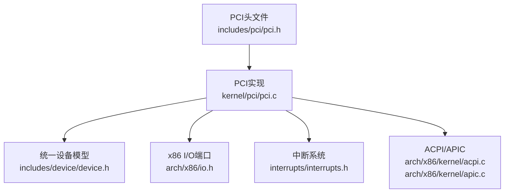
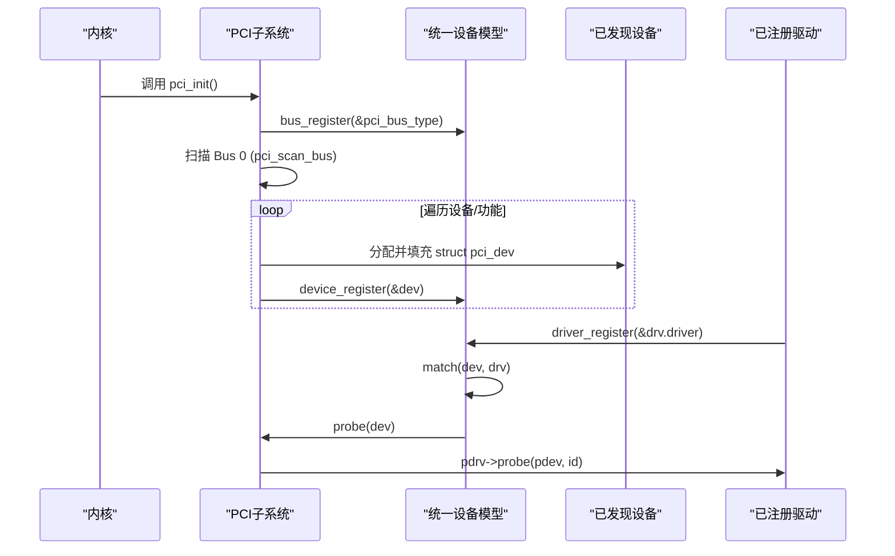
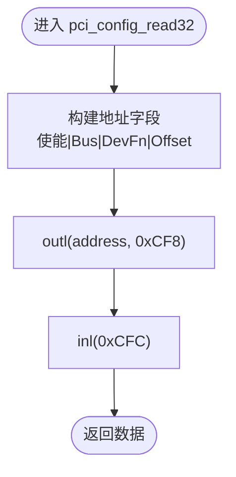
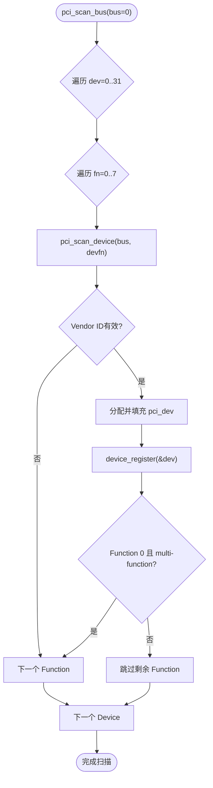
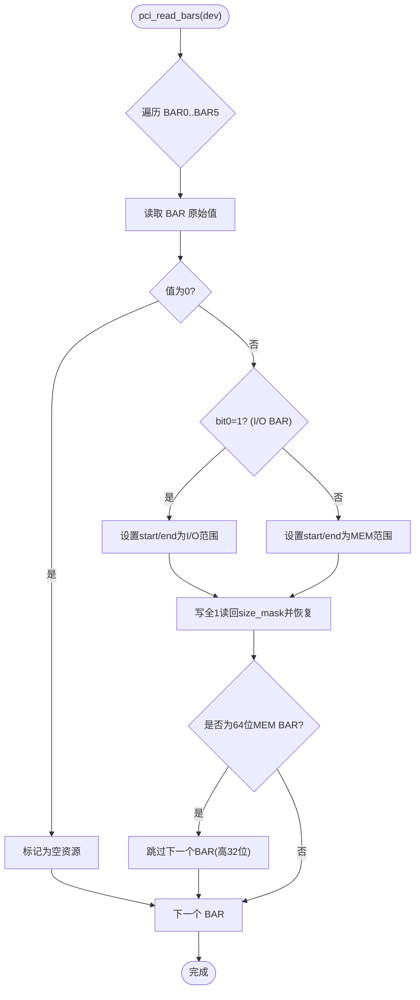
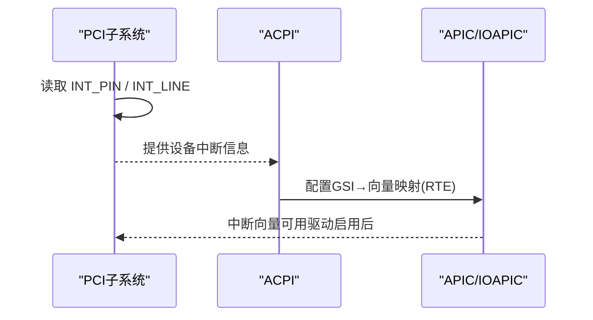
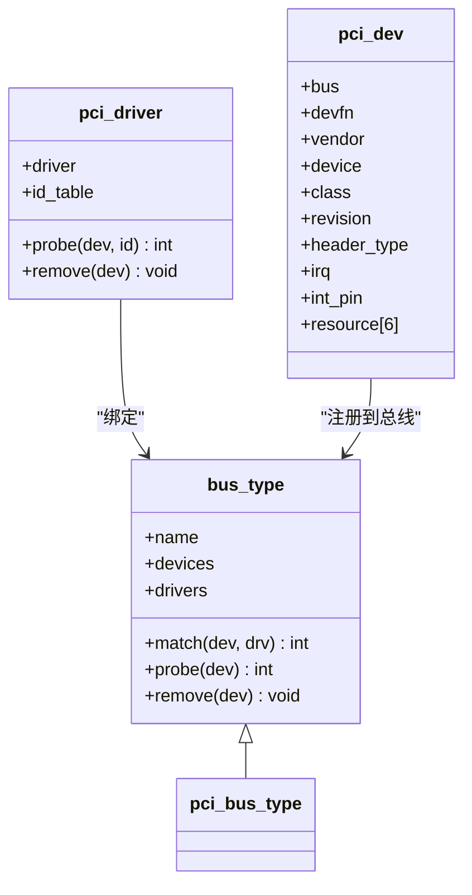
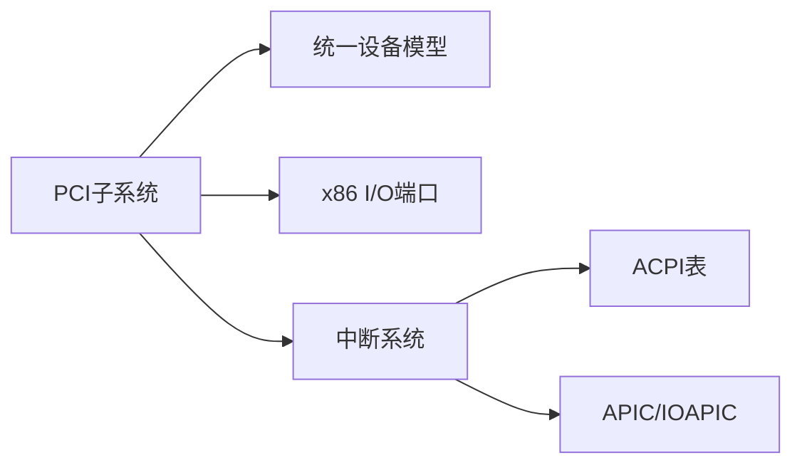

# PCI总线

<cite>
**本文引用的文件**
- [includes/pci/pci.h](file://includes/pci/pci.h)
- [kernel/pci/pci.c](file://kernel/pci/pci.c)
- [includes/device/device.h](file://includes/device/device.h)
- [arch/x86/kernel/acpi.c](file://arch/x86/kernel/acpi.c)
- [arch/x86/kernel/apic.c](file://arch/x86/kernel/apic.c)
</cite>

## 目录
1. [简介](#简介)
2. [项目结构](#项目结构)
3. [核心组件](#核心组件)
4. [架构总览](#架构总览)
5. [详细组件分析](#详细组件分析)
6. [依赖关系分析](#依赖关系分析)
7. [性能考量](#性能考量)
8. [故障排查指南](#故障排查指南)
9. [结论](#结论)
10. [附录：驱动开发最佳实践](#附录驱动开发最佳实践)

## 简介
本文件为LulaOS设备框架中的PCI子系统提供完整的技术文档，覆盖以下主题：
- PCI配置空间访问（Type 1机制）
- 设备枚举流程（从根总线到具体功能设备的层次化扫描）
- BAR资源解析（I/O与内存BAR、大小计算、64位BAR处理）
- 中断路由与MSI支持现状
- 电源管理与热插拔支持现状
- PCI驱动开发指南（设备识别、资源映射、中断处理）
- 配置空间读写示例与常见设备驱动模式

## 项目结构
PCI子系统由头文件与实现组成，并嵌入统一设备模型中：
- 接口定义：includes/pci/pci.h
- 实现逻辑：kernel/pci/pci.c
- 统一设备模型：includes/device/device.h
- ACPI/APIC中断相关：arch/x86/kernel/acpi.c、arch/x86/kernel/apic.c

图表来源
- [includes/pci/pci.h:1-170](file://includes/pci/pci.h#L1-L170)
- [kernel/pci/pci.c:1-512](file://kernel/pci/pci.c#L1-L512)
- [includes/device/device.h:1-80](file://includes/device/device.h#L1-L80)
- [arch/x86/kernel/acpi.c:1-277](file://arch/x86/kernel/acpi.c#L1-L277)
- [arch/x86/kernel/apic.c:250-316](file://arch/x86/kernel/apic.c#L250-L316)

章节来源
- [includes/pci/pci.h:1-170](file://includes/pci/pci.h#L1-L170)
- [kernel/pci/pci.c:1-512](file://kernel/pci/pci.c#L1-L512)
- [includes/device/device.h:1-80](file://includes/device/device.h#L1-L80)

## 核心组件
- 配置空间访问：通过I/O端口0xCF8/0xCFC的Type 1机制进行32位读写，并提供8/16位辅助读取。
- 设备描述符：struct pci_dev包含总线号、设备号、厂商/设备ID、类别码、修订版本、头部类型、中断信息以及6个BAR资源。
- 驱动框架：struct pci_driver包含匹配表、probe/remove回调；注册时绑定到pci_bus_type，触发统一设备模型的匹配与探测。
- 总线类型：pci_bus_type提供match/probe/remove钩子，将PCI特定逻辑接入统一设备模型。
- 资源管理：struct pci_resource描述每个BAR的起始地址、结束地址和类型（IO/MEM）。

章节来源
- [includes/pci/pci.h:71-169](file://includes/pci/pci.h#L71-L169)
- [kernel/pci/pci.c:25-241](file://kernel/pci/pci.c#L25-L241)

## 架构总览
PCI子系统在初始化阶段完成总线类型注册与设备枚举，随后通过统一设备模型完成驱动匹配与探测。

图表来源
- [kernel/pci/pci.c:469-512](file://kernel/pci/pci.c#L469-L512)
- [kernel/pci/pci.c:234-241](file://kernel/pci/pci.c#L234-L241)
- [kernel/pci/pci.c:331-368](file://kernel/pci/pci.c#L331-L368)
- [kernel/pci/pci.c:436-458](file://kernel/pci/pci.c#L436-L458)
- [includes/device/device.h:32-77](file://includes/device/device.h#L32-L77)

## 详细组件分析

### 配置空间访问
- Type 1机制：向CONFIG_ADDRESS(0xCF8)写入使能位、总线号、设备/功能号及寄存器偏移（4字节对齐），再从CONFIG_DATA(0xCFC)读写数据。
- 提供32位读写API，内部封装8/16位读取以适配不同寄存器宽度。

图表来源
- [kernel/pci/pci.c:46-75](file://kernel/pci/pci.c#L46-L75)
- [includes/pci/pci.h:19-23](file://includes/pci/pci.h#L19-L23)

章节来源
- [kernel/pci/pci.c:46-91](file://kernel/pci/pci.c#L46-L91)
- [includes/pci/pci.h:19-23](file://includes/pci/pci.h#L19-L23)

### 设备枚举过程
- 扫描策略：从Bus 0开始，遍历32个设备、每个设备最多8个功能。对Function 0检查multi-function标志或已知多功能白名单决定是否继续扫描其他Function。
- 设备发现：读取Vendor ID判断是否存在设备；若有效则分配并填充pci_dev，设置名称并注册到统一设备模型。
- 结果输出：打印设备列表与BAR资源，便于调试。

图表来源
- [kernel/pci/pci.c:331-368](file://kernel/pci/pci.c#L331-L368)
- [kernel/pci/pci.c:269-322](file://kernel/pci/pci.c#L269-L322)

章节来源
- [kernel/pci/pci.c:269-368](file://kernel/pci/pci.c#L269-L368)

### BAR资源解析
- 类型识别：根据BAR最低位判断I/O或内存空间；内存BAR进一步区分32/64位。
- 大小计算：写入全1后读回size mask，利用低位0的位数推导BAR大小，再恢复原始值。
- 64位BAR：若为64位类型，则占用两个连续BAR，第二个作为高32位占位。

图表来源
- [kernel/pci/pci.c:105-157](file://kernel/pci/pci.c#L105-L157)

章节来源
- [kernel/pci/pci.c:105-157](file://kernel/pci/pci.c#L105-L157)

### 中断路由与MSI支持
- 中断引脚与线：枚举过程中读取中断引脚与中断线字段，供后续路由使用。
- ACPI与APIC：系统通过ACPI MADT/FADT等表建立GSI与向量映射，并在IOAPIC中配置RTE条目；默认屏蔽，驱动启用时解除屏蔽。
- MSI支持：当前代码未实现MSI配置路径；PCI子系统仅基于传统INTx中断。

图表来源
- [kernel/pci/pci.c:310-316](file://kernel/pci/pci.c#L310-L316)
- [arch/x86/kernel/acpi.c:141-173](file://arch/x86/kernel/acpi.c#L141-L173)
- [arch/x86/kernel/apic.c:250-316](file://arch/x86/kernel/apic.c#L250-L316)

章节来源
- [kernel/pci/pci.c:310-316](file://kernel/pci/pci.c#L310-L316)
- [arch/x86/kernel/acpi.c:141-173](file://arch/x86/kernel/acpi.c#L141-L173)
- [arch/x86/kernel/apic.c:250-316](file://arch/x86/kernel/apic.c#L250-L316)

### 电源管理与热插拔支持
- 电源管理：当前实现未包含PCI PM能力链（如D状态切换、PM Capabilities枚举与配置）。
- 热插拔：未实现PCI Hotplug控制器与事件处理；设备仅在启动时静态枚举。

章节来源
- [kernel/pci/pci.c:1-512](file://kernel/pci/pci.c#L1-L512)
- [includes/pci/pci.h:1-170](file://includes/pci/pci.h#L1-L170)

### 驱动框架与匹配
- 匹配规则：依据vendor/device/class字段与驱动的id_table匹配，任一字段为0表示通配。
- 探测流程：匹配成功后，统一设备模型调用pci_bus_probe，转发至pci_driver->probe，并传入匹配的id项。
- 生命周期：提供remove回调用于设备移除时的清理。

图表来源
- [includes/device/device.h:32-77](file://includes/device/device.h#L32-L77)
- [includes/pci/pci.h:127-142](file://includes/pci/pci.h#L127-L142)
- [kernel/pci/pci.c:166-241](file://kernel/pci/pci.c#L166-L241)

章节来源
- [kernel/pci/pci.c:166-241](file://kernel/pci/pci.c#L166-L241)
- [includes/pci/pci.h:127-142](file://includes/pci/pci.h#L127-L142)

## 依赖关系分析
- PCI子系统依赖统一设备模型进行设备/驱动注册与匹配。
- 配置空间访问依赖x86 I/O端口操作。
- 中断路由依赖ACPI表解析与APIC/IOAPIC配置。
- 设备查询通过遍历总线设备链表实现。

图表来源
- [kernel/pci/pci.c:16-24](file://kernel/pci/pci.c#L16-L24)
- [arch/x86/kernel/acpi.c:141-173](file://arch/x86/kernel/acpi.c#L141-L173)
- [arch/x86/kernel/apic.c:250-316](file://arch/x86/kernel/apic.c#L250-L316)

章节来源
- [kernel/pci/pci.c:16-24](file://kernel/pci/pci.c#L16-L24)
- [arch/x86/kernel/acpi.c:141-173](file://arch/x86/kernel/acpi.c#L141-L173)
- [arch/x86/kernel/apic.c:250-316](file://arch/x86/kernel/apic.c#L250-L316)

## 性能考量
- 配置空间访问采用I/O端口方式，延迟较高；建议批量读取/写入以减少端口操作次数。
- 枚举过程为O(Bus×Device×Function)，在单总线系统中开销可控；多桥场景需递归扫描，注意避免重复枚举。
- BAR大小计算涉及多次配置空间读写，应尽量减少不必要的写回与校验。

## 故障排查指南
- 无设备发现：检查CONFIG_ADDRESS/CONFIG_DATA端口是否可访问；确认BIOS/固件是否正确暴露PCI配置空间。
- 枚举不完整：验证multi-function检测逻辑与已知多功能白名单；某些模拟器可能未正确设置头部类型。
- 中断不工作：确认ACPI MADT/FADT解析成功；检查IOAPIC RTE配置与默认屏蔽状态；确保驱动启用中断。
- BAR映射失败：核对BAR类型与大小计算；确认内存/I/O空间已被操作系统保留并可映射。

章节来源
- [kernel/pci/pci.c:269-368](file://kernel/pci/pci.c#L269-L368)
- [arch/x86/kernel/acpi.c:141-173](file://arch/x86/kernel/acpi.c#L141-L173)
- [arch/x86/kernel/apic.c:250-316](file://arch/x86/kernel/apic.c#L250-L316)

## 结论
LulaOS的PCI子系统实现了基础的配置空间访问、设备枚举、BAR解析与驱动匹配框架，并通过统一设备模型集成到内核设备树中。中断路由基于ACPI与APIC，但尚未实现MSI、电源管理与热插拔。对于大多数基础PCI设备驱动，该框架已足够支撑设备识别、资源映射与中断处理。

## 附录：驱动开发最佳实践
- 设备识别
  - 在驱动中声明pci_device_id表，列出支持的vendor/device/class组合。
  - 使用pci_find_device或pci_find_class定位目标设备。
- 资源映射
  - 通过枚举得到的BAR资源进行I/O或内存映射；注意区分I/O与MEM类型与大小。
  - 对64位BAR，需正确处理高32位占位的BAR。
- 中断处理
  - 读取设备的INT_PIN/INT_LINE，结合ACPI与APIC配置进行中断向量映射。
  - 在驱动probe中启用设备（开启I/O与MEM响应），并注册中断服务例程。
- 配置空间读写示例
  - 使用pci_config_read32/pci_config_write32访问配置寄存器；确保偏移4字节对齐。
  - 通过读取命令寄存器启用设备响应，必要时调整Latency Timer等参数。
- 常见设备驱动模式
  - 存储控制器：解析BAR0/1为内存或I/O区域，配置DMA与队列。
  - 网络控制器：配置BAR与中断，初始化MAC与收发队列。
  - 显示控制器：映射帧缓冲BAR，设置显示模式与中断。

章节来源
- [includes/pci/pci.h:146-169](file://includes/pci/pci.h#L146-L169)
- [kernel/pci/pci.c:419-426](file://kernel/pci/pci.c#L419-L426)
- [kernel/pci/pci.c:469-512](file://kernel/pci/pci.c#L469-L512)