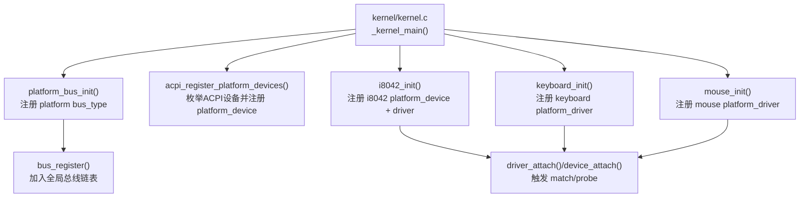
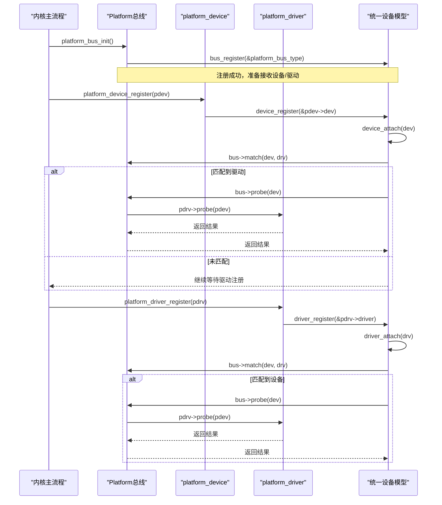
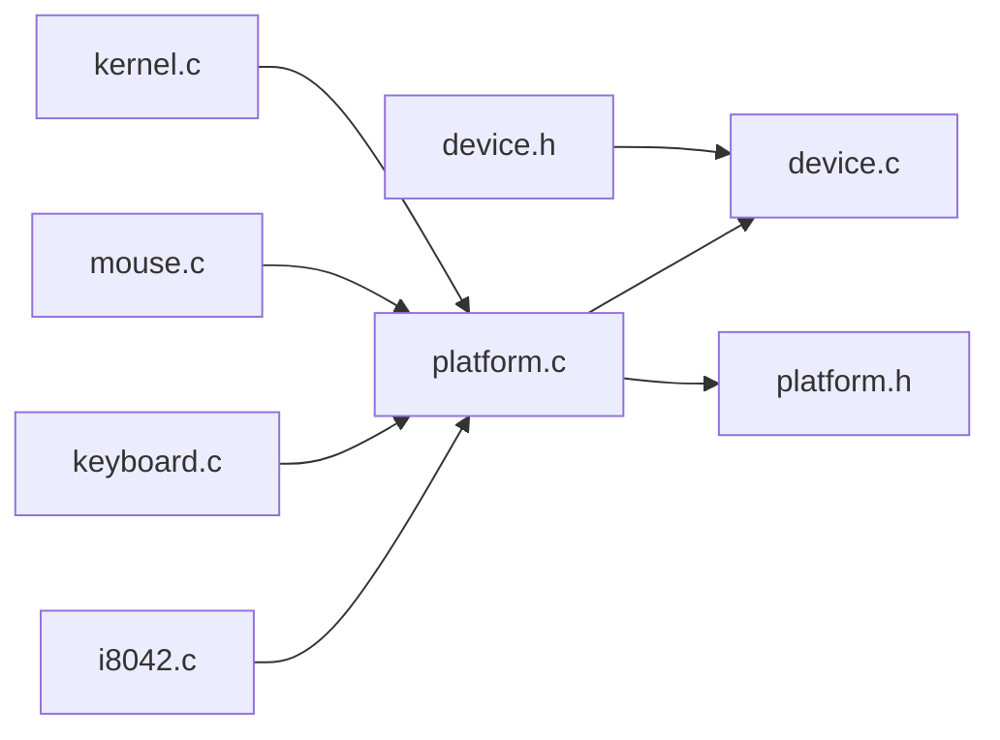

# Platform总线

<cite>
**本文引用的文件**
- [kernel/device/platform.c](file://kernel/device/platform.c)
- [includes/device/platform.h](file://includes/device/platform.h)
- [kernel/device/device.c](file://kernel/device/device.c)
- [includes/device/device.h](file://includes/device/device.h)
- [kernel/kernel.c](file://kernel/kernel.c)
- [kernel/i8042.c](file://kernel/i8042.c)
- [kernel/keyboard.c](file://kernel/keyboard.c)
- [kernel/mouse.c](file://kernel/mouse.c)
</cite>

## 目录
1. [简介](#简介)
2. [项目结构](#项目结构)
3. [核心组件](#核心组件)
4. [架构总览](#架构总览)
5. [详细组件分析](#详细组件分析)
6. [依赖关系分析](#依赖关系分析)
7. [性能考虑](#性能考虑)
8. [故障排查指南](#故障排查指南)
9. [结论](#结论)
10. [附录：API使用示例与最佳实践](#附录api使用示例与最佳实践)

## 简介
Platform总线用于描述非PCI发现机制的设备（如SoC内部外设、PS/2控制器、中断控制器等），通过设备名称字符串匹配设备和驱动。LulaOS的Platform总线基于统一设备模型，提供设备/驱动的注册、匹配、探测和资源管理，并在系统启动早期完成初始化，为键盘、鼠标等设备提供统一的接入点。

## 项目结构
- 总线与设备模型核心：device.c、device.h
- Platform总线实现：platform.c、platform.h
- 启动流程集成：kernel.c
- 典型平台设备/驱动示例：i8042.c（PS/2控制器）、keyboard.c（键盘）、mouse.c（鼠标）

图表来源
- [kernel/kernel.c:73-139](file://kernel/kernel.c#L73-L139)
- [kernel/device/platform.c:70-77](file://kernel/device/platform.c#L70-L77)
- [kernel/device/device.c:94-139](file://kernel/device/device.c#L94-L139)

章节来源
- [kernel/kernel.c:73-139](file://kernel/kernel.c#L73-L139)
- [kernel/device/platform.c:70-77](file://kernel/device/platform.c#L70-L77)
- [kernel/device/device.c:94-139](file://kernel/device/device.c#L94-L139)

## 核心组件
- bus_type：总线类型抽象，定义该总线下的match/probe/remove行为，维护设备/驱动链表。
- device：设备基础结构，包含名称、所属总线、已绑定驱动指针等。
- device_driver：驱动基础结构，包含名称、所属总线等。
- platform_device：平台设备扩展，包含资源数组（内存/I/O/IRQ）。
- platform_driver：平台驱动扩展，包含probe/remove回调。
- platform_bus_type：Platform总线实例，提供名称和匹配/探测/移除逻辑。

章节来源
- [includes/device/device.h:26-77](file://includes/device/device.h#L26-L77)
- [includes/device/platform.h:28-81](file://includes/device/platform.h#L28-L81)
- [kernel/device/platform.c:14-17](file://kernel/device/platform.c#L14-L17)

## 架构总览
Platform总线在系统启动时由内核主流程注册，随后ACPI或板级代码注册平台设备；驱动模块注册后，总线会尝试将设备与驱动进行匹配，匹配成功后调用probe完成硬件初始化。

图表来源
- [kernel/device/platform.c:70-114](file://kernel/device/platform.c#L70-L114)
- [kernel/device/device.c:42-87](file://kernel/device/device.c#L42-L87)
- [kernel/device/device.c:94-139](file://kernel/device/device.c#L94-L139)

## 详细组件分析

### 设备名称匹配机制（platform_match）
- 匹配规则：比较platform_device.dev.name与platform_driver.driver.name是否相同。
- 实现要点：通过to_platform_device宏从device获取具体平台设备，再取名称与驱动名称做字符串比较。
- 复杂度：O(1)比较，但整体匹配过程受遍历设备/驱动链表影响。

章节来源
- [kernel/device/platform.c:25-30](file://kernel/device/platform.c#L25-L30)
- [includes/device/platform.h:68-70](file://includes/device/platform.h#L68-L70)

### 驱动绑定过程（device_attach/driver_attach）
- 设备注册时：将设备加入总线设备链表，遍历总线上的驱动列表，调用bus->match匹配，成功后设置dev->driver并调用bus->probe。
- 驱动注册时：将驱动加入总线驱动链表，遍历总线上的设备列表，对未绑定的设备尝试匹配，成功后设置dev->driver并调用bus->probe。
- 关键点：避免重复绑定（已绑定设备跳过），确保probe仅执行一次。

章节来源
- [kernel/device/device.c:42-87](file://kernel/device/device.c#L42-L87)
- [kernel/device/device.c:94-139](file://kernel/device/device.c#L94-L139)

### 资源管理（platform_resource与platform_get_resource）
- 资源类型：IORESOURCE_MEM（MMIO范围）、IORESOURCE_IO（I/O端口范围）、IORESOURCE_IRQ（中断号）。
- 资源访问：按类型和序号查找对应资源项，返回资源指针供驱动使用。
- 典型用法：键盘/鼠标驱动在probe中通过platform_get_resource获取IRQ，计算中断向量并注册中断处理函数。

章节来源
- [includes/device/platform.h:23-49](file://includes/device/platform.h#L23-L49)
- [kernel/device/platform.c:142-159](file://kernel/device/platform.c#L142-L159)
- [kernel/keyboard.c:197-218](file://kernel/keyboard.c#L197-L218)
- [kernel/mouse.c:129-150](file://kernel/mouse.c#L129-L150)

### platform_probe调用流程
- 统一入口：bus->probe(dev)被调用后，platform_probe将device转换为platform_device和platform_driver，然后调用pdrv->probe(pdev)。
- 日志输出：若probe返回0，打印绑定成功信息，便于调试。
- 错误处理：若pdrv->probe为空，直接返回0表示无操作。

章节来源
- [kernel/device/platform.c:37-50](file://kernel/device/platform.c#L37-L50)

### platform_remove资源清理机制
- 触发时机：设备注销或驱动注销时，若存在已绑定驱动且总线提供remove回调，则调用bus->remove。
- 转发逻辑：platform_remove将device转换为platform_driver，并调用pdrv->remove(pdev)以释放资源。
- 注意事项：确保remove中释放所有分配的资源（中断、内存映射等），避免泄漏。

章节来源
- [kernel/device/platform.c:55-62](file://kernel/device/platform.c#L55-L62)
- [kernel/device/device.c:113-123](file://kernel/device/device.c#L113-L123)
- [kernel/device/device.c:147-164](file://kernel/device/device.c#L147-L164)

### 数据结构设计（platform_device与platform_driver）
- platform_device：嵌入device作为首成员，支持container_of转换；包含id、资源数量、资源数组指针。
- platform_driver：嵌入device_driver作为首成员；包含probe/remove回调。
- 辅助宏：to_platform_device/to_platform_driver用于安全类型转换。

章节来源
- [includes/device/platform.h:44-60](file://includes/device/platform.h#L44-L60)
- [includes/device/platform.h:68-70](file://includes/device/platform.h#L68-L70)

### 启动过程中的初始化时机与作用
- 初始化顺序：内核主流程先初始化CPU、中断、调度、内存、kmalloc等基础子系统，然后注册Platform总线。
- 设备发现：ACPI扫描DSDT表，发现PNP设备并注册为platform_device；若未发现，i8042控制器驱动可回退注册键盘/鼠标设备。
- 驱动加载：键盘/鼠标驱动随后注册，总线自动匹配并调用probe完成中断注册与硬件初始化。

章节来源
- [kernel/kernel.c:73-139](file://kernel/kernel.c#L73-L139)
- [kernel/i8042.c:253-263](file://kernel/i8042.c#L253-L263)

## 依赖关系分析
- platform.c依赖device.c提供的统一设备模型接口（bus_register、device_register、driver_register）。
- i8042/keyboard/mouse示例展示了如何定义platform_device和platform_driver，并通过platform_bus_init完成总线注册。
- 启动流程串联了总线、设备、驱动的注册与匹配。

图表来源
- [kernel/device/platform.c:1-160](file://kernel/device/platform.c#L1-L160)
- [kernel/device/device.c:1-165](file://kernel/device/device.c#L1-L165)
- [kernel/i8042.c:1-303](file://kernel/i8042.c#L1-L303)
- [kernel/keyboard.c:1-235](file://kernel/keyboard.c#L1-L235)
- [kernel/mouse.c:1-167](file://kernel/mouse.c#L1-L167)
- [kernel/kernel.c:1-141](file://kernel/kernel.c#L1-L141)

章节来源
- [kernel/device/platform.c:1-160](file://kernel/device/platform.c#L1-L160)
- [kernel/device/device.c:1-165](file://kernel/device/device.c#L1-L165)

## 性能考虑
- 匹配复杂度：设备/驱动注册时会遍历对方链表，时间复杂度O(N)，N为同总线设备或驱动数量。对于少量平台设备，开销可接受。
- 资源查找：platform_get_resource线性扫描资源数组，复杂度O(M)，M为资源数量，通常很小。
- 建议：合理组织设备/驱动数量，避免过多同名设备导致匹配冲突；资源数组尽量紧凑。

[本节为通用指导，不直接分析具体文件]

## 故障排查指南
- 设备无名称：platform_device_register会检查设备名称是否为空，若为空返回错误并打印提示。
- 驱动未匹配：确认platform_device.dev.name与platform_driver.driver.name完全一致；检查设备是否已注册，驱动是否在之后注册。
- probe失败：检查probe返回值，若返回非0，总线不会记录绑定成功；查看相关printk输出定位问题。
- remove未调用：确认设备/驱动正确注销；若驱动未提供remove，需自行释放资源。
- IRQ资源缺失：键盘/鼠标驱动在probe中通过platform_get_resource获取IRQ，若资源不存在会打印错误并返回失败。

章节来源
- [kernel/device/platform.c:84-98](file://kernel/device/platform.c#L84-L98)
- [kernel/device/platform.c:37-50](file://kernel/device/platform.c#L37-L50)
- [kernel/keyboard.c:197-218](file://kernel/keyboard.c#L197-L218)
- [kernel/mouse.c:129-150](file://kernel/mouse.c#L129-L150)

## 结论
LulaOS的Platform总线提供了简洁而强大的设备/驱动管理机制，通过名称匹配实现松耦合的设备发现与驱动绑定。其核心在于统一设备模型的抽象与扩展，使得不同总线（如PCI、USB）可以复用相同的注册/匹配/探测流程。结合ACPI枚举与板级回退策略，Platform总线能够灵活适配多种硬件场景，并为键盘、鼠标等关键输入设备提供稳定支撑。

[本节为总结性内容，不直接分析具体文件]

## 附录：API使用示例与最佳实践

### 设备注册
- 步骤：
  - 定义platform_device，设置dev.name、id、resource数组及num_resources。
  - 调用platform_device_register完成注册，内部会设置bus并触发匹配。
- 参考路径：
  - [i8042设备定义与注册:267-303](file://kernel/i8042.c#L267-L303)
  - [platform_device_register实现:84-98](file://kernel/device/platform.c#L84-L98)

### 驱动注册
- 步骤：
  - 定义platform_driver，设置driver.name、probe/remove回调。
  - 调用platform_driver_register完成注册，内部会设置bus并触发匹配。
- 参考路径：
  - [键盘驱动定义与注册:220-234](file://kernel/keyboard.c#L220-L234)
  - [鼠标驱动定义与注册:152-166](file://kernel/mouse.c#L152-L166)
  - [platform_driver_register实现:105-114](file://kernel/device/platform.c#L105-L114)

### 资源获取
- 步骤：
  - 在probe中调用platform_get_resource获取指定类型的资源（如IRQ）。
  - 根据资源start/end字段配置硬件或注册中断。
- 参考路径：
  - [platform_get_resource实现:142-159](file://kernel/device/platform.c#L142-L159)
  - [键盘probe中获取IRQ:197-218](file://kernel/keyboard.c#L197-L218)
  - [鼠标probe中获取IRQ:129-150](file://kernel/mouse.c#L129-L150)

### 常见错误处理
- 设备名称为空：platform_device_register会返回错误并打印提示。
- 资源缺失：probe中检查platform_get_resource返回值，若为空则返回错误。
- 中断注册失败：request_irq返回非0时，打印错误并返回失败。

章节来源
- [kernel/device/platform.c:84-98](file://kernel/device/platform.c#L84-L98)
- [kernel/device/platform.c:142-159](file://kernel/device/platform.c#L142-L159)
- [kernel/keyboard.c:197-218](file://kernel/keyboard.c#L197-L218)
- [kernel/mouse.c:129-150](file://kernel/mouse.c#L129-L150)