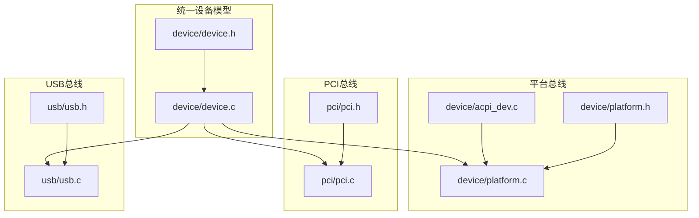
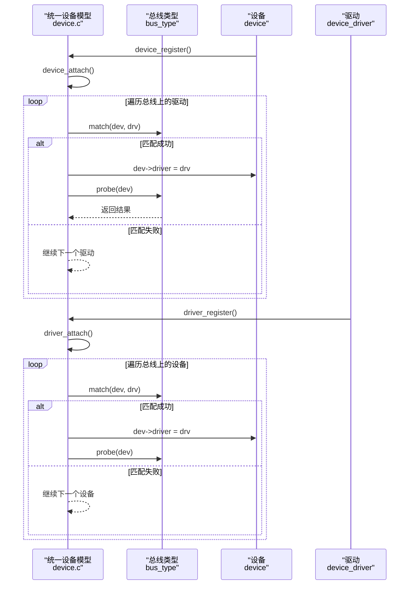
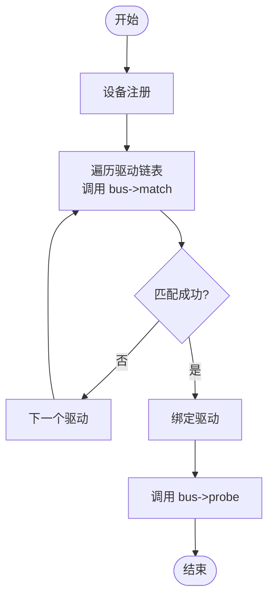
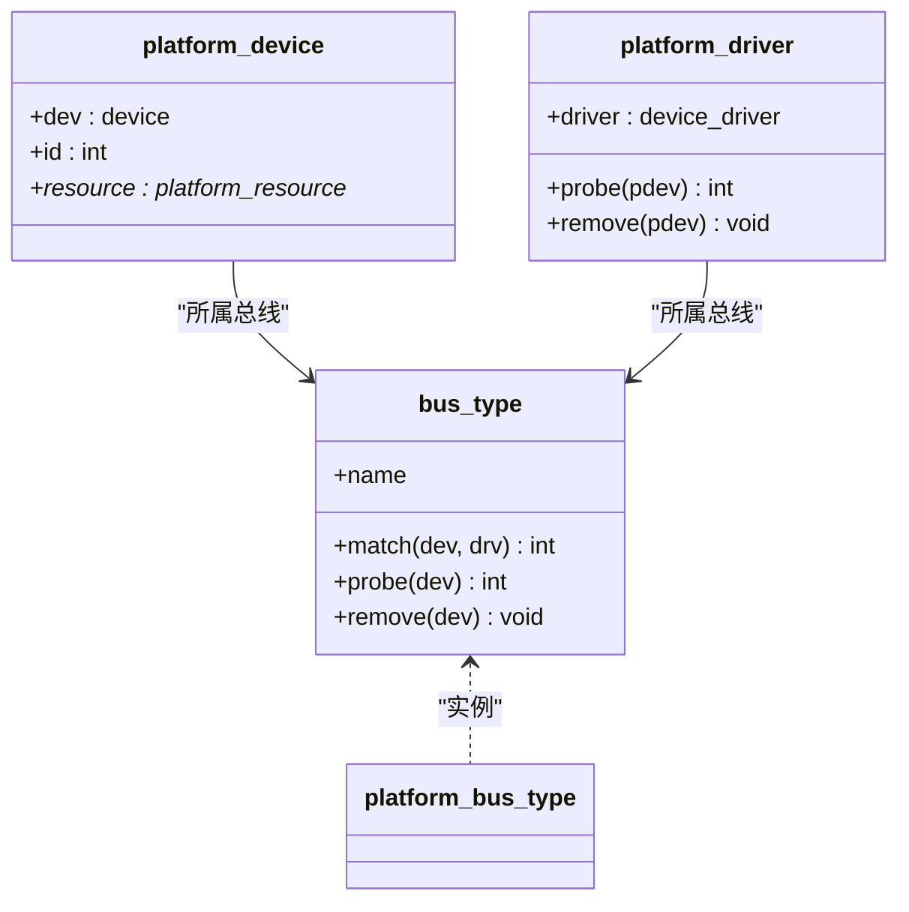
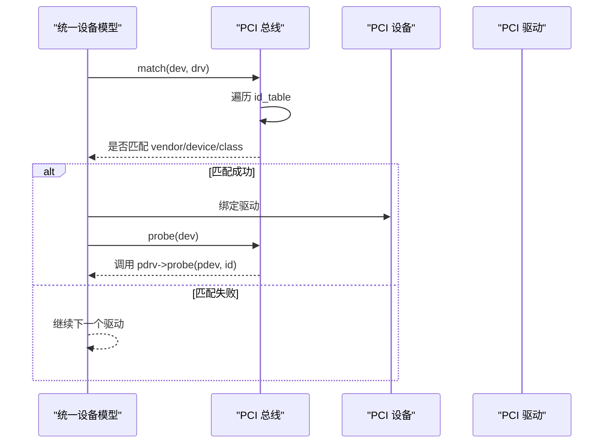
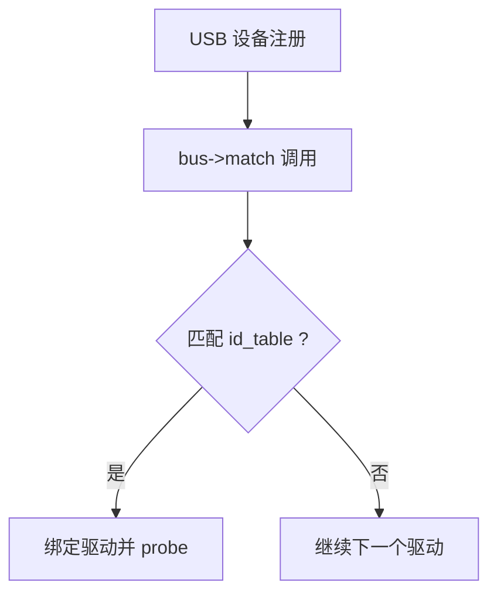
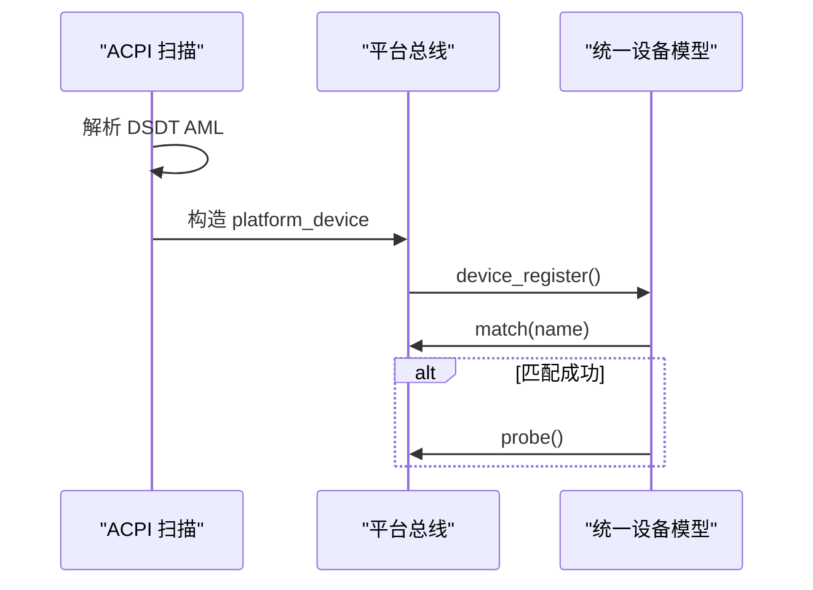
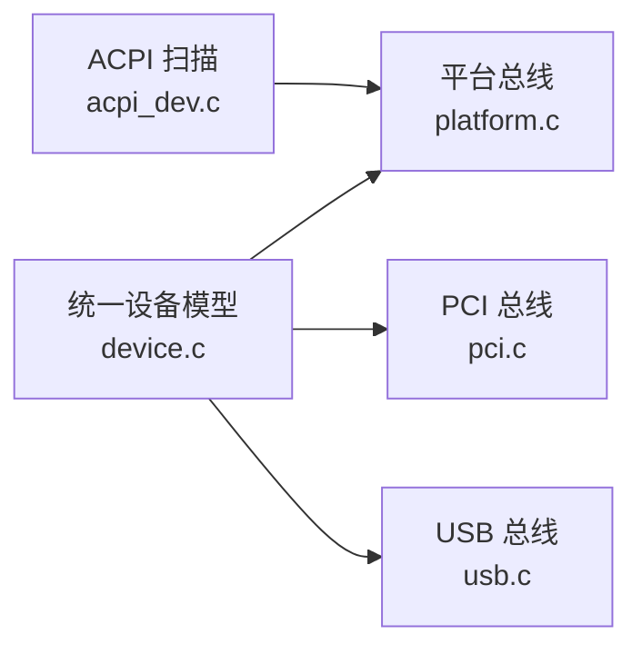

# 总线匹配机制

<cite>
**本文引用的文件**   
- [includes/device/device.h](file://includes/device/device.h)
- [kernel/device/device.c](file://kernel/device/device.c)
- [includes/device/platform.h](file://includes/device/platform.h)
- [kernel/device/platform.c](file://kernel/device/platform.c)
- [kernel/device/acpi_dev.c](file://kernel/device/acpi_dev.c)
- [includes/pci/pci.h](file://includes/pci/pci.h)
- [kernel/pci/pci.c](file://kernel/pci/pci.c)
- [includes/usb/usb.h](file://includes/usb/usb.h)
- [kernel/usb/usb.c](file://kernel/usb/usb.c)
</cite>

## 目录
1. [简介](#简介)
2. [项目结构](#项目结构)
3. [核心组件](#核心组件)
4. [架构总览](#架构总览)
5. [详细组件分析](#详细组件分析)
6. [依赖关系分析](#依赖关系分析)
7. [性能考虑](#性能考虑)
8. [故障排查指南](#故障排查指南)
9. [结论](#结论)
10. [附录：自定义总线匹配开发指南](#附录自定义总线匹配开发指南)

## 简介
本文件系统性阐述 LulaOS 统一设备模型中的“总线匹配机制”。重点包括：
- 统一设备模型中 device、device_driver 与 bus_type 的关系
- bus_type->match 的作用与实现方式
- Platform、PCI、USB 三种总线类型的匹配策略差异
- 匹配失败的处理流程与重试机制
- 自定义总线匹配函数的设计要点与性能优化
- 调试方法与常见问题排查

## 项目结构
LulaOS 将“总线类型抽象”与“具体总线实现”解耦：
- 统一设备模型核心在 includes/device/device.h 与 kernel/device/device.c，提供 bus_type、device、device_driver 的注册、注销与匹配调度。
- 各总线（Platform、PCI、USB）各自定义 bus_type 实例，并实现各自的 match/probe/remove。
- ACPI 扫描将固件描述的设备转换为 platform_device，并通过平台总线参与匹配。

图表来源
- [includes/device/device.h:26-41](file://includes/device/device.h#L26-L41)
- [kernel/device/device.c:22-87](file://kernel/device/device.c#L22-L87)
- [includes/device/platform.h:28-63](file://includes/device/platform.h#L28-L63)
- [kernel/device/platform.c:14-77](file://kernel/device/platform.c#L14-L77)
- [kernel/device/acpi_dev.c:749-796](file://kernel/device/acpi_dev.c#L749-L796)
- [includes/pci/pci.h:95-138](file://includes/pci/pci.h#L95-L138)
- [kernel/pci/pci.c:27-30](file://kernel/pci/pci.c#L27-L30)
- [includes/usb/usb.h:113-158](file://includes/usb/usb.h#L113-L158)
- [kernel/usb/usb.c:124-131](file://kernel/usb/usb.c#L124-L131)

章节来源
- [includes/device/device.h:26-41](file://includes/device/device.h#L26-L41)
- [kernel/device/device.c:22-87](file://kernel/device/device.c#L22-L87)

## 核心组件
- bus_type：总线类型抽象，包含 name、devices/drivers 链表以及 match/probe/remove 函数指针。每种总线一个实例。
- device：设备基础结构，嵌入所属总线指针、驱动绑定指针等。
- device_driver：驱动基础结构，嵌入所属总线指针。
- 匹配调度：device_register/driver_register 时分别触发 device_attach/driver_attach，遍历对端链表调用 bus_type->match，成功后设置绑定并调用 probe。

关键职责
- 统一接口：所有总线通过 bus_type 暴露一致的匹配与探测入口。
- 解耦策略：具体匹配逻辑由总线实现决定，核心框架不关心细节。

章节来源
- [includes/device/device.h:26-66](file://includes/device/device.h#L26-L66)
- [kernel/device/device.c:36-87](file://kernel/device/device.c#L36-L87)

## 架构总览
下图展示设备/驱动注册到匹配调度的整体流程，以及不同总线如何注入自己的匹配逻辑。

图表来源
- [kernel/device/device.c:36-87](file://kernel/device/device.c#L36-L87)
- [kernel/device/platform.c:70-77](file://kernel/device/platform.c#L70-L77)
- [kernel/pci/pci.c:234-241](file://kernel/pci/pci.c#L234-L241)
- [kernel/usb/usb.c:140-144](file://kernel/usb/usb.c#L140-L144)

## 详细组件分析

### 统一设备模型与匹配调度
- 设备注册：将设备加入总线设备链表，随后尝试匹配已注册驱动。
- 驱动注册：将驱动加入总线驱动链表，随后尝试匹配已注册设备。
- 匹配失败：当前实现未做延迟重试或热插拔事件重扫；若后续新增驱动/设备，需重新注册以触发匹配。

图表来源
- [kernel/device/device.c:42-60](file://kernel/device/device.c#L42-L60)
- [kernel/device/device.c:68-87](file://kernel/device/device.c#L68-L87)

章节来源
- [kernel/device/device.c:22-165](file://kernel/device/device.c#L22-L165)

### Platform 总线：名称匹配
- 匹配策略：platform_device.dev.name 与 platform_driver.driver.name 字符串相等即匹配。
- 资源：platform_resource 描述 I/O、内存、IRQ 等资源范围。
- 典型用途：SoC 内部外设、固定地址设备等。

图表来源
- [includes/device/platform.h:28-63](file://includes/device/platform.h#L28-L63)
- [kernel/device/platform.c:14-30](file://kernel/device/platform.c#L14-L30)

章节来源
- [includes/device/platform.h:28-84](file://includes/device/platform.h#L28-L84)
- [kernel/device/platform.c:14-160](file://kernel/device/platform.c#L14-L160)

### PCI 总线：设备ID匹配
- 匹配策略：根据 pci_driver.id_table 中的 vendor/device/class 字段与 pci_dev 对应字段匹配，任一字段为 0 表示通配。
- 枚举：PCI 子系统扫描配置空间，解析 BAR，生成设备并注册到统一设备模型。
- 典型用途：扩展卡、桥接设备等。

图表来源
- [kernel/pci/pci.c:166-200](file://kernel/pci/pci.c#L166-L200)
- [kernel/pci/pci.c:208-217](file://kernel/pci/pci.c#L208-L217)
- [kernel/pci/pci.c:436-445](file://kernel/pci/pci.c#L436-L445)

章节来源
- [includes/pci/pci.h:95-138](file://includes/pci/pci.h#L95-L138)
- [kernel/pci/pci.c:159-241](file://kernel/pci/pci.c#L159-L241)
- [kernel/pci/pci.c:428-445](file://kernel/pci/pci.c#L428-L445)

### USB 总线：描述符匹配
- 匹配策略：基于 usb_device_id 表与 usb_device.descriptor 的 vendor/product/class/subclass/protocol 等字段匹配。
- 典型用途：USB 主机控制器与各类 USB 设备。

图表来源
- [kernel/usb/usb.c:30-85](file://kernel/usb/usb.c#L30-L85)
- [kernel/usb/usb.c:93-111](file://kernel/usb/usb.c#L93-L111)
- [includes/usb/usb.h:132-158](file://includes/usb/usb.h#L132-L158)

章节来源
- [kernel/usb/usb.c:1-188](file://kernel/usb/usb.c#L1-L188)
- [includes/usb/usb.h:113-158](file://includes/usb/usb.h#L113-L158)

### ACPI 到 Platform 设备的转换
- 扫描 DSDT，提取 _HID/_CID/_CRS，构造 platform_device 并注册到平台总线。
- 设备名优先使用 HID，资源映射为 platform_resource。

图表来源
- [kernel/device/acpi_dev.c:749-796](file://kernel/device/acpi_dev.c#L749-L796)
- [kernel/device/platform.c:84-98](file://kernel/device/platform.c#L84-L98)

章节来源
- [kernel/device/acpi_dev.c:1-797](file://kernel/device/acpi_dev.c#L1-L797)
- [kernel/device/platform.c:84-160](file://kernel/device/platform.c#L84-L160)

## 依赖关系分析
- 统一设备模型依赖各总线提供的 bus_type 实例与 match/probe/remove 回调。
- Platform/PCI/USB 均通过 container_of 从通用 device/driver 获取具体结构体。
- ACPI 作为设备发现源，输出 platform_device 进入平台总线匹配流程。

图表来源
- [kernel/device/device.c:22-87](file://kernel/device/device.c#L22-L87)
- [kernel/device/platform.c:70-77](file://kernel/device/platform.c#L70-L77)
- [kernel/pci/pci.c:234-241](file://kernel/pci/pci.c#L234-L241)
- [kernel/usb/usb.c:140-144](file://kernel/usb/usb.c#L140-L144)
- [kernel/device/acpi_dev.c:749-796](file://kernel/device/acpi_dev.c#L749-L796)

章节来源
- [kernel/device/device.c:22-165](file://kernel/device/device.c#L22-L165)

## 性能考虑
- 匹配复杂度：
  - Platform：O(N_drv) 次字符串比较，适合少量设备/驱动。
  - PCI/USB：O(N_drv) 次 ID 表遍历，通常条目较少，开销可控。
- 优化建议：
  - 合理组织 id_table，将高频匹配项前置。
  - 避免在 match 中进行昂贵操作（如复杂计算、IO）。
  - 对于大规模设备场景，可引入哈希索引（例如按 vendor/class 分组），但需权衡维护成本。
- 资源访问：
  - Platform/PCI 的 probe 阶段可能涉及 IO/内存映射，应尽量避免重复映射，缓存必要信息。

[本节为通用性能讨论，不直接分析具体代码行]

## 故障排查指南
常见问题与定位方法：
- 设备未匹配到驱动
  - 检查 bus->match 是否正确设置（Platform 名称是否一致；PCI/USB 的 id_table 是否覆盖目标设备）。
  - 确认设备已正确注册到对应总线（PCI 枚举后是否调用 device_register；ACPI 是否成功构造 platform_device）。
  - 查看日志：平台总线在匹配成功后会打印绑定信息；PCI/USB 初始化会打印设备列表。
- 匹配成功但未进入 probe
  - 检查 bus->probe 是否被赋值；某些总线仅在匹配成功后才调用 probe。
- 驱动卸载后设备仍显示绑定
  - 确认 driver_unregister 是否清除了 dev->driver，并调用了 remove。
- 资源冲突或无效
  - Platform：核对 platform_resource 的 start/end/flags 是否正确。
  - PCI：核对 BAR 解析结果与命令寄存器使能位。

章节来源
- [kernel/device/platform.c:37-50](file://kernel/device/platform.c#L37-L50)
- [kernel/pci/pci.c:469-511](file://kernel/pci/pci.c#L469-L511)
- [kernel/device/device.c:113-165](file://kernel/device/device.c#L113-L165)

## 结论
LulaOS 的统一设备模型通过 bus_type 抽象出匹配的通用流程，各总线以最小代价接入自身匹配策略。Platform 采用名称匹配，简单直观；PCI/USB 采用 ID/描述符匹配，具备更强的可扩展性。ACPI 作为设备发现源，将固件描述转化为平台设备，进一步融入统一匹配体系。当前实现简洁清晰，便于扩展新总线类型。

[本节为总结性内容，不直接分析具体代码行]

## 附录：自定义总线匹配开发指南

### 设计步骤
- 定义总线结构体与 bus_type 实例，设置 name、match、probe、remove。
- 实现 match：
  - 从 device/driver 中提取总线特定信息（如 Platform 的名称、PCI 的 vendor/device/class、USB 的描述符）。
  - 返回非零值表示匹配成功。
- 实现 probe/remove：
  - 将统一模型的 probe/remove 转发到具体驱动的回调。
- 注册总线与设备/驱动：
  - 总线初始化时调用 bus_register。
  - 设备注册时设置 dev->bus 并调用 device_register。
  - 驱动注册时设置 drv->bus 并调用 driver_register。

### 匹配逻辑设计要点
- 明确匹配依据：名称、ID、类别、协议等。
- 支持通配：允许部分字段为 0 表示任意值（参考 PCI/USB 的 id_table）。
- 避免副作用：match 应为纯判断，不修改状态、不做 IO。

### 性能优化
- 快速路径：优先匹配常见组合，减少遍历次数。
- 预过滤：在 match 前进行轻量级筛选（如先比对大类再细粒度匹配）。
- 数据结构：使用数组+终止符或链表存储 id_table，保证顺序与可读性。

### 调试方法
- 打印匹配过程：在 match 前后记录设备/驱动标识与匹配结果。
- 验证资源：对 Platform/PCI 设备打印资源范围，确保 probe 可用。
- 逐步缩小范围：先让 match 恒真，确认 probe 正常，再逐步收紧匹配条件。

章节来源
- [includes/device/device.h:26-66](file://includes/device/device.h#L26-L66)
- [kernel/device/device.c:36-87](file://kernel/device/device.c#L36-L87)
- [kernel/device/platform.c:14-77](file://kernel/device/platform.c#L14-L77)
- [kernel/pci/pci.c:166-241](file://kernel/pci/pci.c#L166-L241)
- [kernel/usb/usb.c:30-131](file://kernel/usb/usb.c#L30-L131)