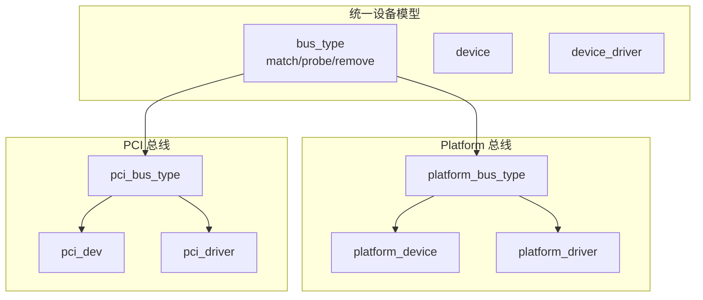
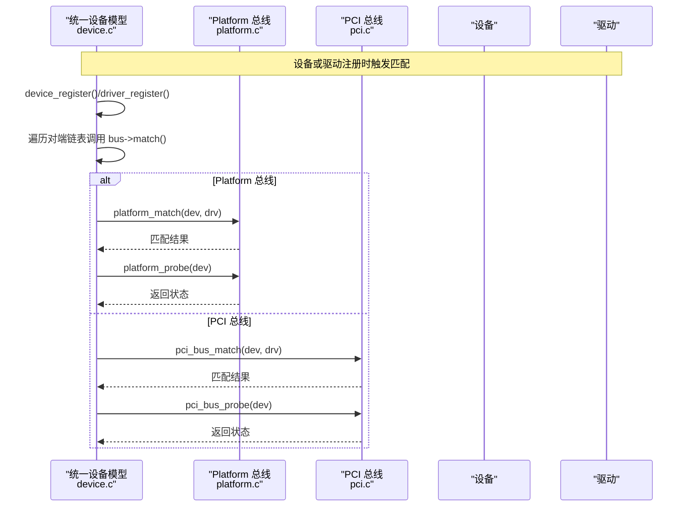
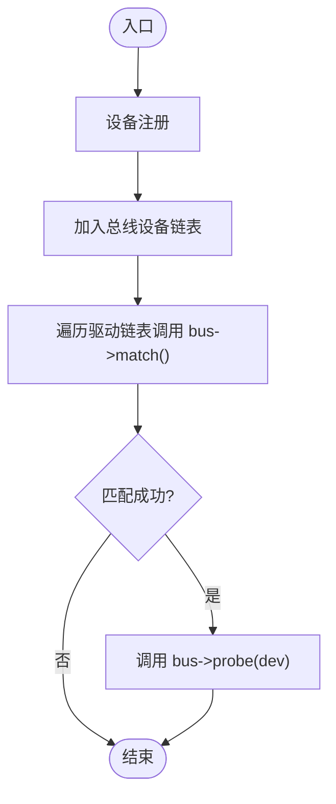
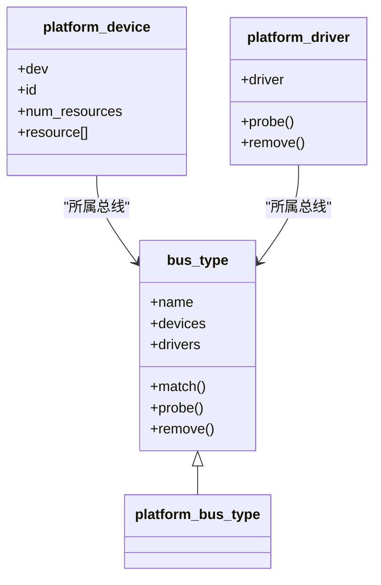
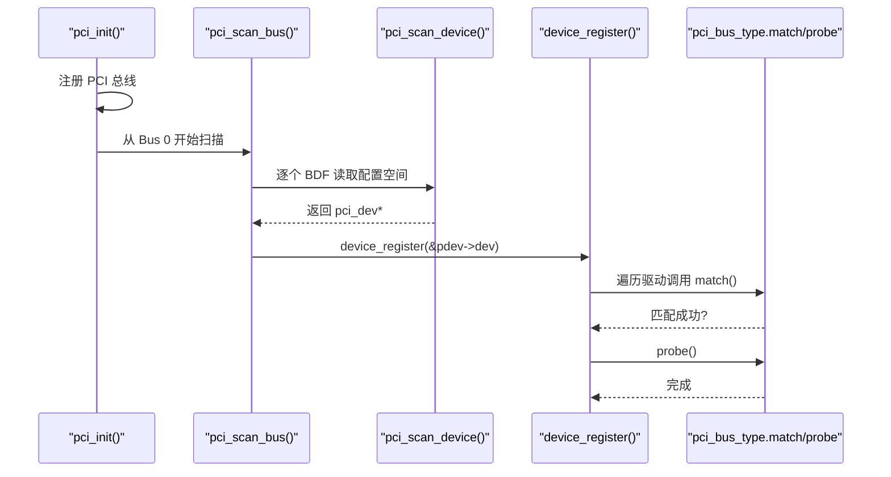
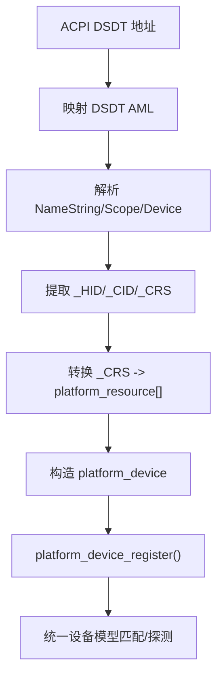
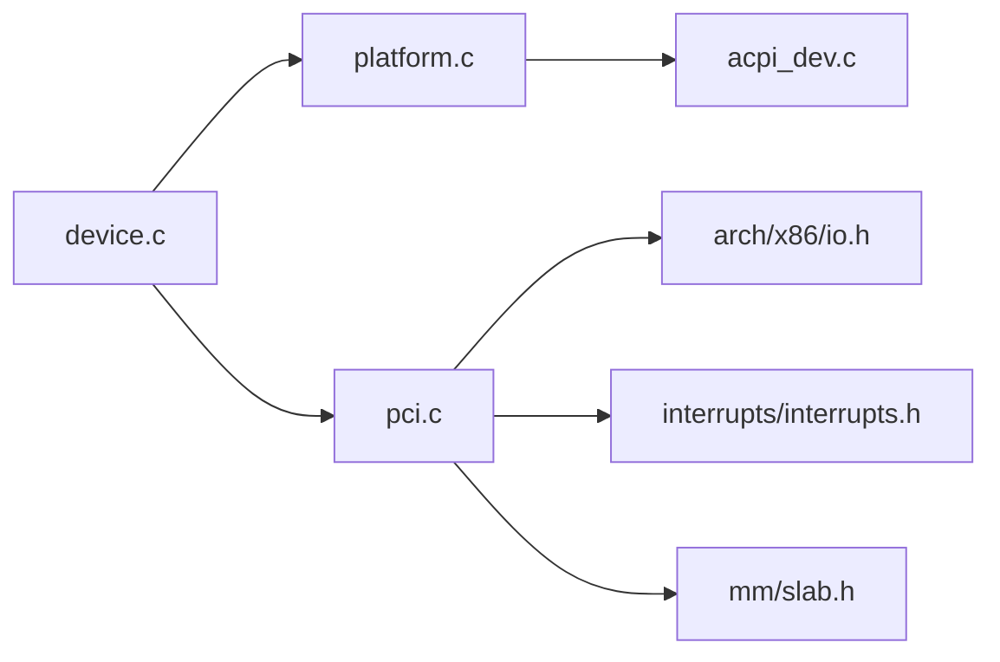

# 总线机制

<cite>
**本文引用的文件**
- [includes/device/device.h](file://includes/device/device.h)
- [kernel/device/device.c](file://kernel/device/device.c)
- [includes/device/platform.h](file://includes/device/platform.h)
- [kernel/device/platform.c](file://kernel/device/platform.c)
- [includes/pci/pci.h](file://includes/pci/pci.h)
- [kernel/pci/pci.c](file://kernel/pci/pci.c)
- [kernel/device/acpi_dev.c](file://kernel/device/acpi_dev.c)
</cite>

## 目录
1. [简介](#简介)
2. [项目结构](#项目结构)
3. [核心组件](#核心组件)
4. [架构总览](#架构总览)
5. [详细组件分析](#详细组件分析)
6. [依赖关系分析](#依赖关系分析)
7. [性能考量](#性能考量)
8. [故障排查指南](#故障排查指南)
9. [结论](#结论)
10. [附录：总线驱动开发规范与最佳实践](#附录总线驱动开发规范与最佳实践)

## 简介
本文件面向LulaOS的设备子系统，系统性阐述“统一设备模型”以及Platform总线、PCI总线的实现原理与差异。文档覆盖总线类型的注册与管理、设备枚举与驱动匹配流程、不同总线类型的特性适配与扩展点，并提供架构图与数据流图，最后给出总线驱动开发的指导原则与接口规范。

## 项目结构
- 统一设备模型核心位于 includes/device/device.h 与 kernel/device/device.c，提供 bus_type、device、device_driver 的通用抽象与注册/注销/匹配框架。
- Platform 总线用于非PCI发现机制的设备（SoC内部外设、PS/2控制器、中断控制器等），通过名称字符串匹配设备与驱动，并在 ACPI DSDT 扫描后自动注册为 platform_device。
- PCI 总线负责配置空间访问、Bus/Device/Function 枚举、BAR 资源解析、中断信息读取，并通过 id_table 进行设备与驱动的匹配。

图表来源
- [includes/device/device.h:26-79](file://includes/device/device.h#L26-L79)
- [kernel/device/device.c:22-165](file://kernel/device/device.c#L22-L165)
- [includes/device/platform.h:28-83](file://includes/device/platform.h#L28-L83)
- [kernel/device/platform.c:14-160](file://kernel/device/platform.c#L14-L160)
- [includes/pci/pci.h:78-169](file://includes/pci/pci.h#L78-L169)
- [kernel/pci/pci.c:27-241](file://kernel/pci/pci.c#L27-L241)

章节来源
- [includes/device/device.h:26-79](file://includes/device/device.h#L26-L79)
- [kernel/device/device.c:22-165](file://kernel/device/device.c#L22-L165)
- [includes/device/platform.h:28-83](file://includes/device/platform.h#L28-L83)
- [kernel/device/platform.c:14-160](file://kernel/device/platform.c#L14-L160)
- [includes/pci/pci.h:78-169](file://includes/pci/pci.h#L78-L169)
- [kernel/pci/pci.c:27-241](file://kernel/pci/pci.c#L27-L241)

## 核心组件
- bus_type：总线类型抽象，定义 match/probe/remove 回调，维护该总线下的设备链表与驱动链表，并挂入全局总线链表。
- device：设备基础结构，包含所属总线指针、已绑定驱动指针、私有数据等；各总线设备结构体需将其作为首成员嵌入。
- device_driver：驱动基础结构，包含所属总线指针；各总线驱动结构体需将其作为首成员嵌入。
- 平台总线：platform_bus_type，使用名称匹配策略，支持 platform_resource 描述 I/O/MEM/IRQ 资源。
- PCI 总线：pci_bus_type，使用 vendor/device/class 与 id_table 匹配策略，支持 BAR 资源解析与中断信息读取。

章节来源
- [includes/device/device.h:26-79](file://includes/device/device.h#L26-L79)
- [kernel/device/device.c:22-165](file://kernel/device/device.c#L22-L165)
- [includes/device/platform.h:28-83](file://includes/device/platform.h#L28-L83)
- [kernel/device/platform.c:14-160](file://kernel/device/platform.c#L14-L160)
- [includes/pci/pci.h:78-169](file://includes/pci/pci.h#L78-L169)
- [kernel/pci/pci.c:27-241](file://kernel/pci/pci.c#L27-L241)

## 架构总览
统一设备模型将“总线-设备-驱动”解耦：总线负责匹配与生命周期管理，设备与驱动分别由具体总线子系统创建和注册。Platform 与 PCI 总线均复用同一套注册/匹配/探测框架，但各自实现不同的匹配策略与资源模型。

图表来源
- [kernel/device/device.c:42-87](file://kernel/device/device.c#L42-L87)
- [kernel/device/platform.c:25-50](file://kernel/device/platform.c#L25-L50)
- [kernel/pci/pci.c:194-217](file://kernel/pci/pci.c#L194-L217)

## 详细组件分析

### 统一设备模型（bus_type / device / device_driver）
- 总线注册：初始化设备/驱动链表，加入全局总线链表。
- 设备注册：加入所属总线设备链表，尝试匹配已注册驱动。
- 驱动注册：加入所属总线驱动链表，尝试匹配已注册设备。
- 移除逻辑：从链表移除，必要时调用 remove 回调清理。

图表来源
- [kernel/device/device.c:94-105](file://kernel/device/device.c#L94-L105)
- [kernel/device/device.c:42-60](file://kernel/device/device.c#L42-L60)

章节来源
- [kernel/device/device.c:22-165](file://kernel/device/device.c#L22-L165)

### Platform 总线
- 匹配策略：基于 platform_device.dev.name 与 platform_driver.driver.name 字符串相等。
- 资源模型：platform_resource 描述 I/O、内存、IRQ 资源，支持按类型与索引获取。
- 设备来源：可由板级代码静态声明，或由 ACPI DSDT 扫描生成 platform_device。
- 驱动注册：设置所属总线为 platform_bus_type，调用 driver_register 触发匹配。

图表来源
- [includes/device/device.h:26-79](file://includes/device/device.h#L26-L79)
- [includes/device/platform.h:28-83](file://includes/device/platform.h#L28-L83)
- [kernel/device/platform.c:14-160](file://kernel/device/platform.c#L14-L160)

章节来源
- [includes/device/platform.h:28-83](file://includes/device/platform.h#L28-L83)
- [kernel/device/platform.c:14-160](file://kernel/device/platform.c#L14-L160)
- [kernel/device/acpi_dev.c:749-797](file://kernel/device/acpi_dev.c#L749-L797)

### PCI 总线
- 配置空间访问：通过 I/O 端口 Type 1 机制读写配置寄存器。
- 设备枚举：递归扫描 Bus/Device/Function，读取 Vendor ID、Class、Revision、Header Type、中断引脚/线，解析 BAR 资源。
- 匹配策略：通过 pci_driver.id_table 中的 vendor/device/class 字段匹配设备。
- 驱动注册：设置所属总线为 pci_bus_type，调用 driver_register 触发匹配。

图表来源
- [kernel/pci/pci.c:469-512](file://kernel/pci/pci.c#L469-L512)
- [kernel/pci/pci.c:269-368](file://kernel/pci/pci.c#L269-L368)
- [kernel/device/device.c:94-105](file://kernel/device/device.c#L94-L105)
- [kernel/pci/pci.c:194-217](file://kernel/pci/pci.c#L194-L217)

章节来源
- [includes/pci/pci.h:19-169](file://includes/pci/pci.h#L19-L169)
- [kernel/pci/pci.c:35-157](file://kernel/pci/pci.c#L35-L157)
- [kernel/pci/pci.c:166-241](file://kernel/pci/pci.c#L166-L241)
- [kernel/pci/pci.c:269-368](file://kernel/pci/pci.c#L269-L368)
- [kernel/pci/pci.c:469-512](file://kernel/pci/pci.c#L469-L512)

### ACPI 到 Platform 设备的桥接
- AML 解析：最小化遍历 DSDT，提取 Device 节点及其 _HID/_CID/_CRS。
- 资源转换：将 _CRS 中的 IRQ/I/O/Memory 描述符转换为 platform_resource。
- 设备注册：构造 platform_device，设置 name=HID，资源数组，调用 platform_device_register 进入统一设备模型。

图表来源
- [kernel/device/acpi_dev.c:632-740](file://kernel/device/acpi_dev.c#L632-L740)
- [kernel/device/acpi_dev.c:749-797](file://kernel/device/acpi_dev.c#L749-L797)
- [kernel/device/platform.c:84-98](file://kernel/device/platform.c#L84-L98)

章节来源
- [kernel/device/acpi_dev.c:632-740](file://kernel/device/acpi_dev.c#L632-L740)
- [kernel/device/acpi_dev.c:749-797](file://kernel/device/acpi_dev.c#L749-L797)

## 依赖关系分析
- 统一设备模型依赖双向链表与打印接口，不感知具体总线细节。
- Platform 总线依赖字符串比较与资源访问接口，依赖 ACPI 子系统提供设备描述。
- PCI 总线依赖 x86 I/O 端口访问、中断子系统、内存分配器（kmalloc）。
- 两者均通过 container_of 宏从通用 device/driver 指针推导具体总线结构。

图表来源
- [kernel/device/device.c:9-11](file://kernel/device/device.c#L9-L11)
- [kernel/device/platform.c:9-12](file://kernel/device/platform.c#L9-L12)
- [kernel/pci/pci.c:16-23](file://kernel/pci/pci.c#L16-L23)
- [kernel/device/acpi_dev.c:13-20](file://kernel/device/acpi_dev.c#L13-L20)

章节来源
- [kernel/device/device.c:9-11](file://kernel/device/device.c#L9-L11)
- [kernel/device/platform.c:9-12](file://kernel/device/platform.c#L9-L12)
- [kernel/pci/pci.c:16-23](file://kernel/pci/pci.c#L16-L23)
- [kernel/device/acpi_dev.c:13-20](file://kernel/device/acpi_dev.c#L13-L20)

## 性能考量
- 匹配复杂度：Platform 总线匹配为 O(N_drivers)，PCI 总线匹配为 O(N_drivers × |id_table|)。设备数量增长时建议精简 id_table 与驱动数量。
- 枚举开销：PCI 枚举涉及大量配置空间 I/O 访问，应尽量减少不必要的读/写，避免在热路径中重复查询。
- 资源解析：BAR 解析需要多次写全 1 计算大小，注意缓存结果，避免重复解析。
- 并发安全：当前实现未显式加锁，若引入多核并发注册/卸载，需在总线层增加互斥保护。

[本节为通用性能讨论，不直接分析具体文件]

## 故障排查指南
- 设备未匹配：检查 platform_device.name 与 platform_driver.name 是否一致；检查 PCI 驱动的 id_table 是否包含对应 vendor/device/class。
- 资源不可用：确认 platform_resource.flags 与 start/end 是否正确；PCI 设备需确保命令寄存器使能了 I/O 与 MEM 响应。
- 枚举遗漏：检查 multi-function 设备白名单与 header_type 标志；Bochs/QEMU 环境可能需特殊处理。
- 日志定位：关注总线注册、设备注册、匹配与探测阶段的 printk 输出，快速定位失败阶段。

章节来源
- [kernel/device/platform.c:25-50](file://kernel/device/platform.c#L25-L50)
- [kernel/pci/pci.c:194-217](file://kernel/pci/pci.c#L194-L217)
- [kernel/pci/pci.c:419-426](file://kernel/pci/pci.c#L419-L426)
- [kernel/pci/pci.c:252-261](file://kernel/pci/pci.c#L252-L261)

## 结论
LulaOS 的统一设备模型以 bus_type 为核心，将 Platform 与 PCI 两种总线纳入同一框架，既保证了设备/驱动管理的通用性，又保留了各总线的特性适配能力。Platform 总线适合固定资源、名称匹配的内核外设；PCI 总线适合动态发现、复杂资源与中断路由的外设。通过 ACPI 桥接，系统可自动发现并注册平台设备，提升可移植性与可维护性。

[本节为总结性内容，不直接分析具体文件]

## 附录：总线驱动开发规范与最佳实践

### 接口规范
- 平台设备驱动
  - 设备结构：platform_device 必须将 struct device 作为首成员。
  - 驱动结构：platform_driver 必须将 struct device_driver 作为首成员，并实现 probe/remove。
  - 资源访问：使用 platform_get_resource 按类型与索引获取 I/O/MEM/IRQ。
  - 注册流程：先 platform_bus_init，再 platform_device_register 与 platform_driver_register。
- PCI 设备驱动
  - 设备结构：pci_dev 必须将 struct device 作为首成员。
  - 驱动结构：pci_driver 必须将 struct device_driver 作为首成员，提供 id_table 与 probe/remove。
  - 配置空间：通过 pci_config_read32/write32 访问；使用 pci_enable_device 开启 I/O/MEM。
  - 资源解析：利用 BAR 解析结果进行内存映射或 I/O 端口访问。
  - 注册流程：先 pci_init，再 pci_register_driver。

章节来源
- [includes/device/platform.h:44-83](file://includes/device/platform.h#L44-L83)
- [kernel/device/platform.c:84-114](file://kernel/device/platform.c#L84-L114)
- [includes/pci/pci.h:95-169](file://includes/pci/pci.h#L95-L169)
- [kernel/pci/pci.c:436-458](file://kernel/pci/pci.c#L436-L458)

### 最佳实践
- 明确匹配策略：Platform 使用稳定且唯一的名称；PCI 使用精确的 vendor/device/class 组合，避免过度通配。
- 资源管理：优先使用总线提供的资源接口，避免硬编码地址；PCI 设备务必启用命令寄存器后再访问。
- 错误处理：probe 返回非零表示失败，确保驱动在失败路径释放已分配资源。
- 可移植性：尽量通过 ACPI/设备树描述硬件，减少板级硬编码；对模拟器/芯片组差异使用白名单或 quirk。
- 调试与日志：在关键路径添加 printk，便于定位匹配与探测问题。

[本节为通用指导，不直接分析具体文件]