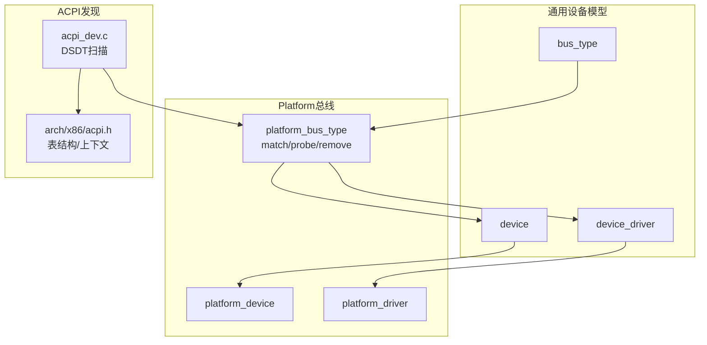
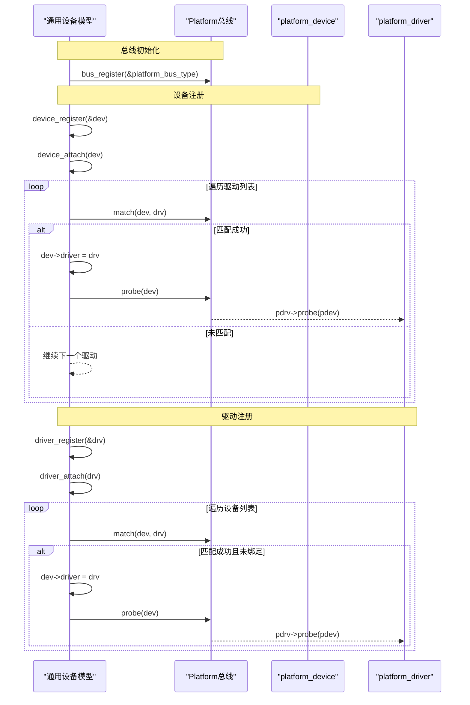
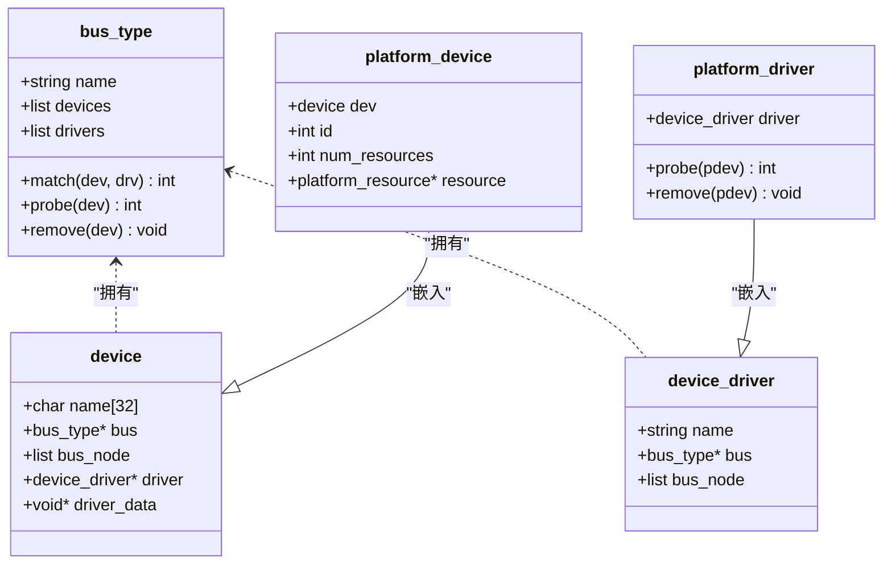
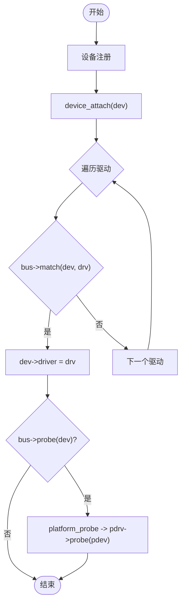
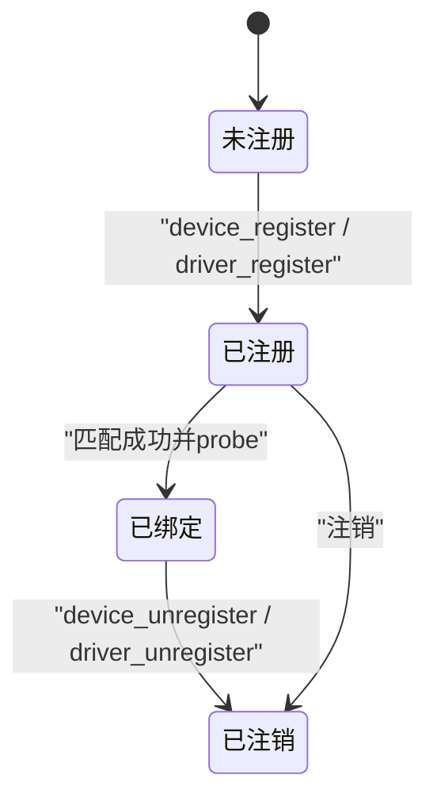
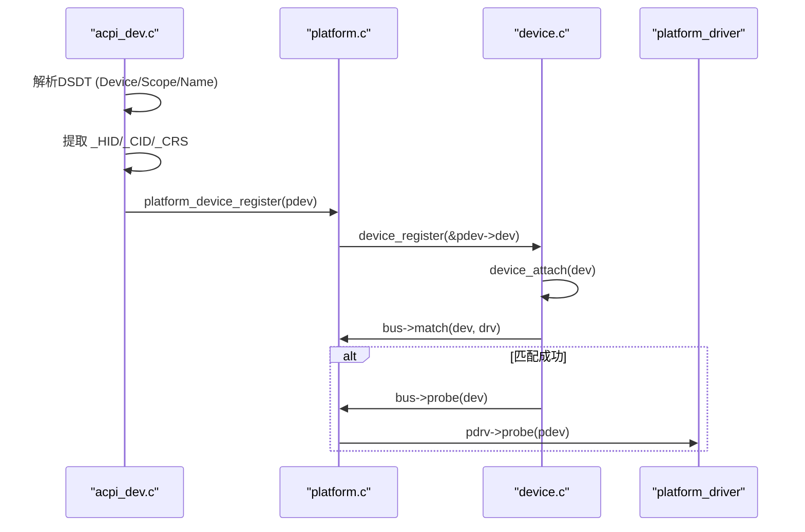
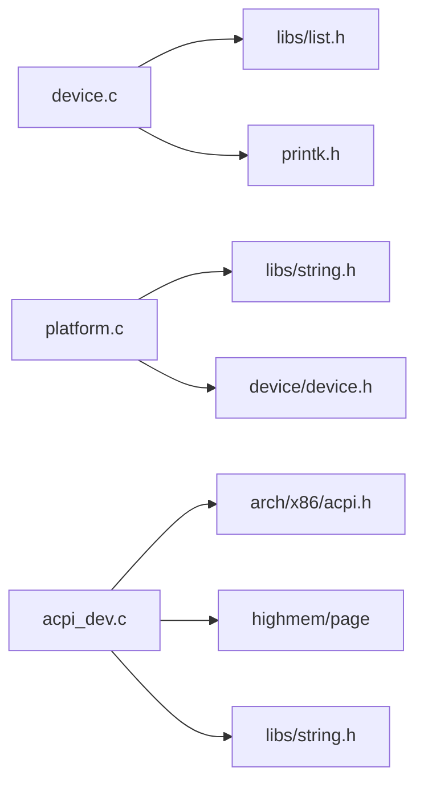

# 统一设备模型

<cite>
**本文引用的文件**
- [includes/device/device.h](file://includes/device/device.h)
- [kernel/device/device.c](file://kernel/device/device.c)
- [includes/device/platform.h](file://includes/device/platform.h)
- [kernel/device/platform.c](file://kernel/device/platform.c)
- [kernel/device/acpi_dev.c](file://kernel/device/acpi_dev.c)
- [includes/arch/x86/acpi.h](file://includes/arch/x86/acpi.h)
</cite>

## 目录
1. [简介](#简介)
2. [项目结构](#项目结构)
3. [核心组件](#核心组件)
4. [架构总览](#架构总览)
5. [详细组件分析](#详细组件分析)
6. [依赖关系分析](#依赖关系分析)
7. [性能与可扩展性](#性能与可扩展性)
8. [故障排查指南](#故障排查指南)
9. [结论](#结论)
10. [附录：开发最佳实践与常见陷阱](#附录：开发最佳实践与常见陷阱)

## 简介
本文件面向LulaOS的统一设备模型，围绕三个核心数据结构 device、device_driver、bus_type 进行系统化说明。文档涵盖：
- 设计理念与相互关系
- 设备注册/注销生命周期
- 设备与驱动的绑定机制与匹配算法
- 设备树（ACPI DSDT）扫描到Platform设备的流程
- 状态转换图与数据流图
- 驱动开发最佳实践与避坑指南

## 项目结构
统一设备模型由“通用层 + Platform总线实现 + ACPI发现”三部分构成：
- 通用层：定义 bus_type、device、device_driver 及注册/注销、匹配/探测的通用逻辑
- Platform总线：提供名称匹配的 match、probe/remove 转发，以及 platform_device/platform_driver 抽象
- ACPI发现：解析DSDT中的Device节点，提取_HID/_CID/_CRS等资源，构造并注册为Platform设备

图表来源
- [includes/device/device.h:26-66](file://includes/device/device.h#L26-L66)
- [kernel/device/platform.c:14-77](file://kernel/device/platform.c#L14-L77)
- [kernel/device/acpi_dev.c:749-796](file://kernel/device/acpi_dev.c#L749-L796)
- [includes/arch/x86/acpi.h:202-242](file://includes/arch/x86/acpi.h#L202-L242)

章节来源
- [includes/device/device.h:26-66](file://includes/device/device.h#L26-L66)
- [kernel/device/device.c:22-34](file://kernel/device/device.c#L22-L34)
- [kernel/device/platform.c:14-77](file://kernel/device/platform.c#L14-L77)
- [kernel/device/acpi_dev.c:749-796](file://kernel/device/acpi_dev.c#L749-L796)
- [includes/arch/x86/acpi.h:202-242](file://includes/arch/x86/acpi.h#L202-L242)

## 核心组件
- bus_type：总线类型抽象，持有 name、设备链表、驱动链表，以及 match/probe/remove 回调指针。每种总线（如 platform）提供一个实例，并在初始化时填充回调。
- device：设备基础结构，包含 name、所属 bus、在总线上的节点、已绑定 driver、驱动私有数据等。各总线设备需将 device 作为首成员嵌入。
- device_driver：驱动基础结构，包含 name、所属 bus、在总线上的节点。各总线驱动需将 device_driver 作为首成员嵌入。

三者关系：
- 设备通过 bus_node 挂入对应 bus->devices
- 驱动通过 bus_node 挂入对应 bus->drivers
- 注册时触发匹配：设备注册遍历驱动列表；驱动注册遍历设备列表
- 匹配成功设置 dev->driver，并调用 bus->probe(dev)

章节来源
- [includes/device/device.h:26-66](file://includes/device/device.h#L26-L66)
- [kernel/device/device.c:42-87](file://kernel/device/device.c#L42-L87)

## 架构总览
统一设备模型的核心流程如下：
- 总线注册：初始化设备/驱动链表，加入全局总线链表
- 设备注册：加入总线设备链表，尝试匹配已注册驱动
- 驱动注册：加入总线驱动链表，尝试匹配已注册设备
- 匹配算法：由总线实现 match()，Platform总线基于名称字符串相等匹配
- 探测阶段：匹配成功后调用 probe()，Platform总线转发到 platform_driver->probe()
- 注销流程：设备/驱动注销时解除绑定，必要时调用 remove()

图表来源
- [kernel/device/device.c:22-34](file://kernel/device/device.c#L22-L34)
- [kernel/device/device.c:42-87](file://kernel/device/device.c#L42-L87)
- [kernel/device/platform.c:25-50](file://kernel/device/platform.c#L25-L50)

## 详细组件分析

### 数据结构与关系
- bus_type：维护总线名、设备/驱动链表，以及 match/probe/remove 回调
- device：设备实体，含 name、bus、driver、driver_data
- device_driver：驱动实体，含 name、bus
- platform_device：扩展设备，含 id、资源数组指针
- platform_driver：扩展驱动，含 probe/remove 回调

图表来源
- [includes/device/device.h:26-66](file://includes/device/device.h#L26-L66)
- [includes/device/platform.h:28-60](file://includes/device/platform.h#L28-L60)

章节来源
- [includes/device/device.h:26-66](file://includes/device/device.h#L26-L66)
- [includes/device/platform.h:28-60](file://includes/device/platform.h#L28-L60)

### 匹配与绑定机制
- 通用匹配入口：
  - 设备注册后调用 device_attach：遍历总线驱动列表，调用 bus->match，成功则设置 dev->driver 并调用 bus->probe
  - 驱动注册后调用 driver_attach：遍历总线设备列表，跳过已绑定设备，调用 bus->match，成功则设置 dev->driver 并调用 bus->probe
- Platform总线匹配：
  - 比较 platform_device.dev.name 与 platform_driver.driver.name，相等即匹配成功
- 探测转发：
  - platform_probe 中将 device_driver 转换为 platform_driver，再调用其 probe(pdev)

图表来源
- [kernel/device/device.c:42-87](file://kernel/device/device.c#L42-L87)
- [kernel/device/platform.c:25-50](file://kernel/device/platform.c#L25-L50)

章节来源
- [kernel/device/device.c:42-87](file://kernel/device/device.c#L42-L87)
- [kernel/device/platform.c:25-50](file://kernel/device/platform.c#L25-L50)

### 生命周期管理（注册/注销）
- 设备注册：
  - 初始化 bus_node，加入 bus->devices，清空 driver，调用 device_attach
- 设备注销：
  - 若存在绑定驱动且总线提供 remove，则调用 bus->remove
  - 从总线移除设备节点，清空 driver
- 驱动注册：
  - 初始化 bus_node，加入 bus->drivers，调用 driver_attach
- 驱动注销：
  - 遍历总线设备列表，找到绑定该驱动的设备，调用 bus->remove 并解绑
  - 从总线移除驱动节点

图表来源
- [kernel/device/device.c:94-164](file://kernel/device/device.c#L94-L164)

章节来源
- [kernel/device/device.c:94-164](file://kernel/device/device.c#L94-L164)

### ACPI设备树扫描与Platform设备注册
- DSDT扫描：
  - 解析AML顶层对象，识别 Device/Scope/Name 等
  - 提取 _HID/_CID/_CRS，将资源描述符转为 acpi_resource_info
  - 保存设备信息到 acpi_context.dsdt_devices
- Platform设备注册：
  - 对每个有 HID 的设备，构造 platform_device，复制资源，调用 platform_device_register
  - 随后进入统一设备模型的匹配流程，最终可能触发 platform_driver->probe

图表来源
- [kernel/device/acpi_dev.c:632-740](file://kernel/device/acpi_dev.c#L632-L740)
- [kernel/device/acpi_dev.c:749-796](file://kernel/device/acpi_dev.c#L749-L796)
- [kernel/device/platform.c:84-114](file://kernel/device/platform.c#L84-L114)
- [kernel/device/device.c:94-104](file://kernel/device/device.c#L94-L104)

章节来源
- [kernel/device/acpi_dev.c:632-740](file://kernel/device/acpi_dev.c#L632-L740)
- [kernel/device/acpi_dev.c:749-796](file://kernel/device/acpi_dev.c#L749-L796)
- [includes/arch/x86/acpi.h:202-242](file://includes/arch/x86/acpi.h#L202-L242)

## 依赖关系分析
- 通用设备模型依赖：
  - 链表操作（libs/list.h）
  - 打印（printk.h）
  - 空指针处理（stddef.h）
- Platform总线依赖：
  - 字符串比较（libs/string.h）
  - 设备模型接口（device/device.h）
- ACPI发现依赖：
  - x86平台ACPI表结构（arch/x86/acpi.h）
  - 内存映射（highmem/page）
  - 字符串与内存操作（string/memcpy）

图表来源
- [kernel/device/device.c:9-11](file://kernel/device/device.c#L9-L11)
- [kernel/device/platform.c:9-12](file://kernel/device/platform.c#L9-L12)
- [kernel/device/acpi_dev.c:13-20](file://kernel/device/acpi_dev.c#L13-L20)
- [includes/arch/x86/acpi.h:202-242](file://includes/arch/x86/acpi.h#L202-L242)

章节来源
- [kernel/device/device.c:9-11](file://kernel/device/device.c#L9-L11)
- [kernel/device/platform.c:9-12](file://kernel/device/platform.c#L9-L12)
- [kernel/device/acpi_dev.c:13-20](file://kernel/device/acpi_dev.c#L13-L20)
- [includes/arch/x86/acpi.h:202-242](file://includes/arch/x86/acpi.h#L202-L242)

## 性能与可扩展性
- 时间复杂度：
  - 设备注册/驱动注册时的匹配为 O(N)，N为同总线下的驱动或设备数量
  - Platform总线匹配为字符串比较，常数开销较小
- 可扩展性：
  - 新增总线只需实现 bus_type 并提供 match/probe/remove
  - 设备/驱动通过容器宏 container_of 嵌入，保持通用性与扩展性
- 优化建议：
  - 对大规模设备场景可引入索引或哈希加速匹配
  - 避免在 probe 中执行耗时操作，尽量延迟初始化

## 故障排查指南
- 设备未匹配：
  - 检查 platform_device.dev.name 与 platform_driver.driver.name 是否一致
  - 确认总线已正确初始化（platform_bus_init）
- 探针失败：
  - 检查 platform_driver->probe 返回值，非零表示失败
  - 查看资源是否正确获取（platform_get_resource）
- 资源冲突：
  - 确保 I/O/MEM/IRQ 资源不重复分配
  - 核对 ACPI _CRS 解析结果与实际硬件一致
- 注销异常：
  - 确认 bus->remove 实现正确释放资源
  - 避免在 remove 后仍访问设备资源

章节来源
- [kernel/device/platform.c:25-50](file://kernel/device/platform.c#L25-L50)
- [kernel/device/platform.c:117-159](file://kernel/device/platform.c#L117-L159)
- [kernel/device/device.c:113-164](file://kernel/device/device.c#L113-L164)

## 结论
LulaOS的统一设备模型以简洁的三要素（bus_type、device、device_driver）为核心，通过Platform总线实现名称匹配，结合ACPI DSDT扫描完成设备发现与注册。该设计具备良好的可扩展性与清晰的职责划分，便于后续接入更多总线类型与设备驱动。

## 附录：开发最佳实践与常见陷阱
- 最佳实践
  - 设备与驱动名称保持一致，确保匹配成功
  - 在 probe 中仅做必要初始化，复杂逻辑延后
  - 使用 platform_get_resource 安全获取资源，避免硬编码地址
  - 在 remove 中释放所有资源，防止泄漏
  - 总线初始化必须在设备/驱动注册之前完成
- 常见陷阱
  - 忘记设置 bus 指针导致注册失败
  - 设备无 name 或驱动无 name 导致匹配失败
  - 资源越界或重复分配引发系统不稳定
  - 在 probe/remove 中调用阻塞操作导致启动卡顿
  - ACPI _CRS 解析不完整导致资源缺失

章节来源
- [kernel/device/platform.c:84-114](file://kernel/device/platform.c#L84-L114)
- [kernel/device/platform.c:117-159](file://kernel/device/platform.c#L117-L159)
- [kernel/device/acpi_dev.c:749-796](file://kernel/device/acpi_dev.c#L749-L796)