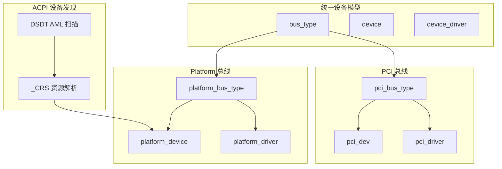
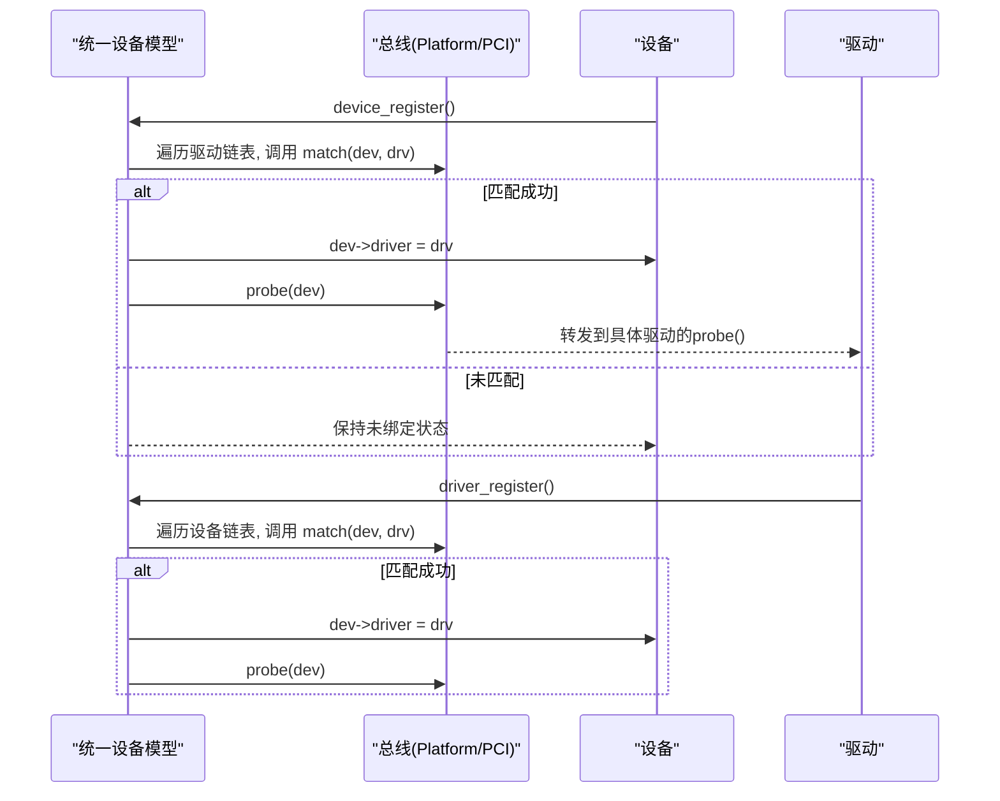
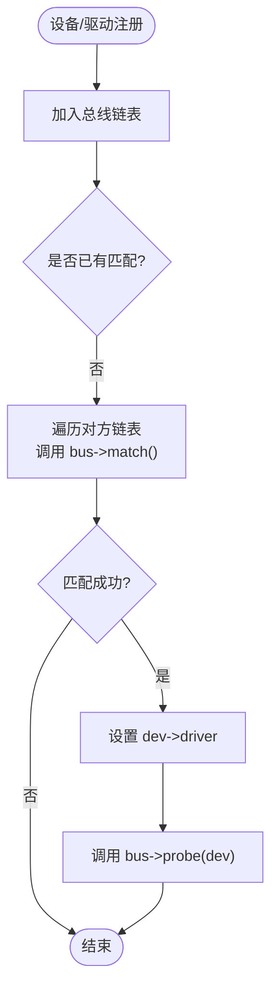
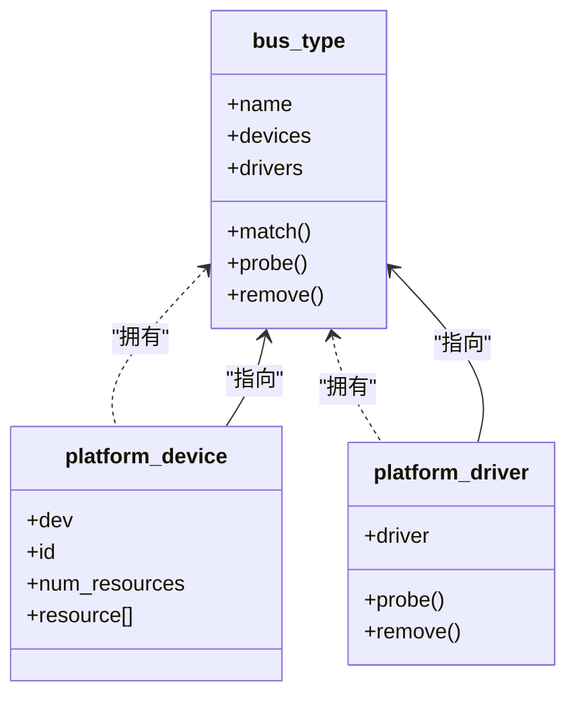
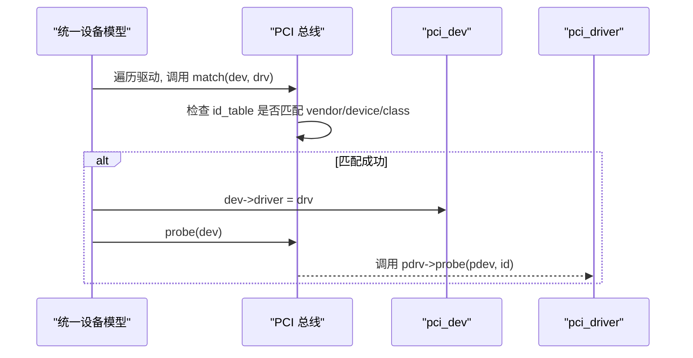
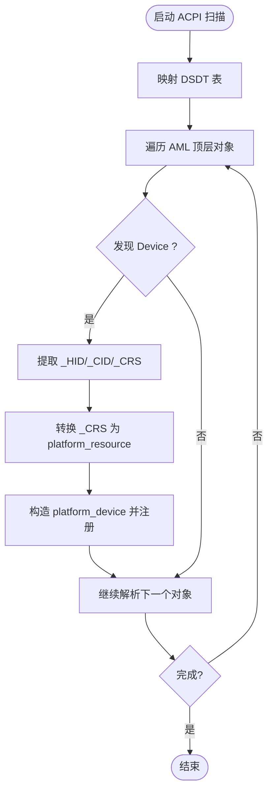
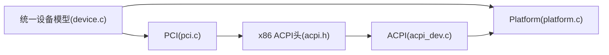

# 设备框架架构

<cite>
**本文引用的文件**
- [includes/device/device.h](file://includes/device/device.h)
- [kernel/device/device.c](file://kernel/device/device.c)
- [includes/device/platform.h](file://includes/device/platform.h)
- [kernel/device/platform.c](file://kernel/device/platform.c)
- [includes/pci/pci.h](file://includes/pci/pci.h)
- [kernel/pci/pci.c](file://kernel/pci/pci.c)
- [includes/arch/x86/acpi.h](file://includes/arch/x86/acpi.h)
- [kernel/device/acpi_dev.c](file://kernel/device/acpi_dev.c)
</cite>

## 目录
1. [简介](#简介)
2. [项目结构](#项目结构)
3. [核心组件](#核心组件)
4. [架构总览](#架构总览)
5. [详细组件分析](#详细组件分析)
6. [依赖关系分析](#依赖关系分析)
7. [性能与可扩展性](#性能与可扩展性)
8. [故障排查指南](#故障排查指南)
9. [结论](#结论)
10. [附录：驱动开发最佳实践](#附录驱动开发最佳实践)

## 简介
本文件面向LulaOS的设备驱动开发者，系统化阐述统一设备模型的设计原理、组件关系、总线匹配算法、Platform与PCI总线的实现差异、设备生命周期管理与资源分配策略，并给出设备树（ACPI DSDT）扫描到平台设备注册的流程图。目标是帮助读者快速理解LulaOS设备子系统的整体架构，并在开发新驱动时遵循一致的模式与最佳实践。

## 项目结构
LulaOS将设备抽象为“总线-设备-驱动”三元模型，所有总线共享统一的注册、匹配与探测流程；具体总线（如Platform、PCI）在通用接口之上提供各自的匹配规则与资源解析逻辑。

图表来源
- [includes/device/device.h:26-66](file://includes/device/device.h#L26-L66)
- [kernel/device/device.c:22-87](file://kernel/device/device.c#L22-L87)
- [includes/device/platform.h:28-81](file://includes/device/platform.h#L28-L81)
- [kernel/device/platform.c:15-77](file://kernel/device/platform.c#L15-L77)
- [includes/pci/pci.h:78-138](file://includes/pci/pci.h#L78-L138)
- [kernel/pci/pci.c:27-241](file://kernel/pci/pci.c#L27-L241)
- [includes/arch/x86/acpi.h:202-240](file://includes/arch/x86/acpi.h#L202-L240)
- [kernel/device/acpi_dev.c:749-796](file://kernel/device/acpi_dev.c#L749-L796)

章节来源
- [includes/device/device.h:26-66](file://includes/device/device.h#L26-L66)
- [kernel/device/device.c:22-87](file://kernel/device/device.c#L22-L87)
- [includes/device/platform.h:28-81](file://includes/device/platform.h#L28-L81)
- [kernel/device/platform.c:15-77](file://kernel/device/platform.c#L15-L77)
- [includes/pci/pci.h:78-138](file://includes/pci/pci.h#L78-L138)
- [kernel/pci/pci.c:27-241](file://kernel/pci/pci.c#L27-L241)
- [includes/arch/x86/acpi.h:202-240](file://includes/arch/x86/acpi.h#L202-L240)
- [kernel/device/acpi_dev.c:749-796](file://kernel/device/acpi_dev.c#L749-L796)

## 核心组件
- bus_type：总线类型抽象，定义该总线下的设备/驱动匹配规则与生命周期回调（match/probe/remove）。
- device：设备基础结构，各总线扩展（如 pci_dev、platform_device）必须将其作为首成员嵌入。
- device_driver：驱动基础结构，各总线扩展（如 pci_driver、platform_driver）必须将其作为首成员嵌入。
- Platform 总线：用于非PCI发现机制的固定地址设备（SoC内部外设等），通过名称字符串匹配。
- PCI 总线：枚举硬件配置空间，按vendor/device/class匹配驱动ID表。
- ACPI 设备发现：扫描DSDT中的Device节点，提取_HID/_CID/_CRS，转换为Platform设备并注册。

章节来源
- [includes/device/device.h:26-66](file://includes/device/device.h#L26-L66)
- [includes/device/platform.h:28-81](file://includes/device/platform.h#L28-L81)
- [includes/pci/pci.h:78-138](file://includes/pci/pci.h#L78-L138)
- [kernel/device/acpi_dev.c:749-796](file://kernel/device/acpi_dev.c#L749-L796)

## 架构总览
统一设备模型的核心思想是“总线无关”的设备与驱动描述，以及“总线特定”的匹配与探测。设备注册后，系统会尝试将其绑定到已注册的驱动；反之亦然。匹配成功后调用总线提供的probe进行初始化。

图表来源
- [kernel/device/device.c:42-87](file://kernel/device/device.c#L42-L87)
- [kernel/device/platform.c:25-50](file://kernel/device/platform.c#L25-L50)
- [kernel/pci/pci.c:194-217](file://kernel/pci/pci.c#L194-L217)

章节来源
- [kernel/device/device.c:42-87](file://kernel/device/device.c#L42-L87)

## 详细组件分析

### 统一设备模型（bus/device/driver）
- 设计要点
  - 所有总线共享同一套注册/注销与匹配流程，降低重复代码。
  - 设备与驱动均包含所属总线指针，便于归属管理。
  - 匹配由总线实现，probe/remove也由总线转发到具体驱动。
- 关键流程
  - 设备注册：加入总线设备链表，尝试匹配已注册驱动。
  - 驱动注册：加入总线驱动链表，尝试匹配已注册设备。
  - 设备注销：若已绑定驱动且总线提供remove，则调用remove后再移除。
  - 驱动注销：解除所有绑定该驱动的设备并移除。

图表来源
- [kernel/device/device.c:94-164](file://kernel/device/device.c#L94-L164)

章节来源
- [includes/device/device.h:26-66](file://includes/device/device.h#L26-L66)
- [kernel/device/device.c:22-164](file://kernel/device/device.c#L22-L164)

### Platform 总线
- 匹配算法
  - 基于名称字符串比较：platform_device.dev.name == platform_driver.driver.name。
- 资源模型
  - platform_resource：支持内存、I/O端口、IRQ三类资源，start/end/flags描述范围与类型。
  - 提供platform_get_resource(type, index)按类型和序号获取资源。
- 生命周期
  - platform_probe：将统一模型的probe转发到platform_driver->probe(pdev)。
  - platform_remove：将统一模型的remove转发到platform_driver->remove(pdev)。
- 典型用途
  - SoC内部外设（UART、GPIO、Timer）、PS/2控制器、中断控制器等。

图表来源
- [includes/device/platform.h:28-81](file://includes/device/platform.h#L28-L81)
- [kernel/device/platform.c:15-77](file://kernel/device/platform.c#L15-L77)

章节来源
- [includes/device/platform.h:28-81](file://includes/device/platform.h#L28-L81)
- [kernel/device/platform.c:15-160](file://kernel/device/platform.c#L15-L160)

### PCI 总线
- 匹配算法
  - 基于驱动声明的pci_device_id表，匹配vendor/device/class字段（0表示通配）。
- 资源模型
  - 通过BAR寄存器解析出Memory或I/O资源范围，最多6个BAR，支持32/64位。
  - 使用IORESOURCE_MEM / IORESOURCE_IO标志区分资源类型。
- 生命周期
  - pci_bus_probe：将统一模型的probe转发到pci_driver->probe(pdev, id)，并传入匹配的id项。
  - pci_bus_remove：将统一模型的remove转发到pci_driver->remove(pdev)。
- 枚举与查询
  - 从Bus 0开始递归枚举，读取Vendor ID判断是否存在设备，处理多功能设备。
  - 提供pci_find_device与pci_find_class进行设备查找。

图表来源
- [kernel/pci/pci.c:166-217](file://kernel/pci/pci.c#L166-L217)
- [includes/pci/pci.h:115-138](file://includes/pci/pci.h#L115-L138)

章节来源
- [includes/pci/pci.h:78-138](file://includes/pci/pci.h#L78-L138)
- [kernel/pci/pci.c:105-241](file://kernel/pci/pci.c#L105-L241)

### ACPI 设备树扫描与平台设备注册
- 扫描目标
  - 解析DSDT中的AML字节流，识别Scope/Device/Name对象，提取_HID/_CID/_CRS属性。
- 资源转换
  - 将_CRS中的小型/大型资源描述符转换为acpi_resource_info（IO/MEM/IRQ）。
- 设备注册
  - 将每个有_HID的设备转为platform_device，复制资源数组，调用platform_device_register。
  - 设备名优先使用HID，便于与驱动名称匹配。

图表来源
- [kernel/device/acpi_dev.c:632-740](file://kernel/device/acpi_dev.c#L632-L740)
- [kernel/device/acpi_dev.c:749-796](file://kernel/device/acpi_dev.c#L749-L796)
- [includes/arch/x86/acpi.h:202-240](file://includes/arch/x86/acpi.h#L202-L240)

章节来源
- [kernel/device/acpi_dev.c:632-796](file://kernel/device/acpi_dev.c#L632-L796)
- [includes/arch/x86/acpi.h:202-240](file://includes/arch/x86/acpi.h#L202-L240)

## 依赖关系分析
- 耦合与内聚
  - 统一设备模型（device.c）仅依赖bus_type接口，对具体总线无感知，内聚度高。
  - Platform与PCI各自维护bus_type实例，并通过to_*宏从通用结构推导具体结构，解耦良好。
- 直接依赖
  - Platform总线依赖字符串比较与资源访问；PCI总线依赖配置空间读写与BAR解析。
  - ACPI扫描依赖arch/x86的内存映射能力与ACPI表结构。
- 外部集成点
  - 中断子系统（PCI中断线读取）、内存管理（kmalloc/slab）、打印子系统（printk）。

图表来源
- [kernel/device/device.c:22-164](file://kernel/device/device.c#L22-L164)
- [kernel/device/platform.c:15-160](file://kernel/device/platform.c#L15-L160)
- [kernel/pci/pci.c:27-512](file://kernel/pci/pci.c#L27-L512)
- [kernel/device/acpi_dev.c:632-796](file://kernel/device/acpi_dev.c#L632-L796)
- [includes/arch/x86/acpi.h:202-240](file://includes/arch/x86/acpi.h#L202-L240)

章节来源
- [kernel/device/device.c:22-164](file://kernel/device/device.c#L22-L164)
- [kernel/device/platform.c:15-160](file://kernel/device/platform.c#L15-L160)
- [kernel/pci/pci.c:27-512](file://kernel/pci/pci.c#L27-L512)
- [kernel/device/acpi_dev.c:632-796](file://kernel/device/acpi_dev.c#L632-L796)
- [includes/arch/x86/acpi.h:202-240](file://includes/arch/x86/acpi.h#L202-L240)

## 性能与可扩展性
- 匹配复杂度
  - Platform：O(N_drivers)字符串比较，简单高效。
  - PCI：O(N_drivers * M_entries)遍历id_table，通常条目较少，开销可控。
- 资源解析
  - PCI BAR解析需多次配置空间读写，注意最小化访问次数。
- 可扩展性建议
  - 新增总线时仅需实现bus_type的match/probe/remove，复用统一设备模型。
  - 资源模型可进一步抽象为通用resource结构，减少平台差异。

[本节为通用指导，不直接分析具体文件]

## 故障排查指南
- 设备未绑定
  - 检查设备名称是否与驱动名称一致（Platform）。
  - 检查PCI驱动的id_table是否包含设备的vendor/device/class。
- 资源冲突或未找到
  - 确认platform_resource或PCI BAR是否正确描述范围与类型。
  - 使用platform_get_resource或PCI BAR打印信息核对。
- ACPI扫描异常
  - 确认DSDT映射成功，_CRS资源描述符格式正确。
  - 检查设备是否有_HID，否则不会注册为Platform设备。

章节来源
- [kernel/device/platform.c:119-160](file://kernel/device/platform.c#L119-L160)
- [kernel/pci/pci.c:377-410](file://kernel/pci/pci.c#L377-L410)
- [kernel/device/acpi_dev.c:749-796](file://kernel/device/acpi_dev.c#L749-L796)

## 结论
LulaOS的统一设备模型以bus_type为核心，将设备与驱动解耦，Platform与PCI总线分别实现了适合自身特性的匹配与资源管理策略。ACPI扫描将固件描述的设备转化为Platform设备，进入统一模型进行驱动绑定。该架构清晰、可扩展，便于驱动开发者聚焦于具体功能实现。

[本节为总结，不直接分析具体文件]

## 附录：驱动开发最佳实践
- 选择合适总线
  - 固定地址/板级设备：Platform总线，确保设备名与驱动名一致。
  - 可插拔/标准总线设备：PCI总线，完善id_table并正确处理BAR。
- 资源管理
  - 明确资源类型与范围，避免重叠；必要时在probe中校验资源可用性。
  - 使用platform_get_resource或PCI BAR接口获取资源，不要硬编码地址。
- 生命周期
  - 在probe中完成必要的初始化（使能设备、映射内存、注册中断等）。
  - 在remove中释放资源、取消绑定，保证可热插拔或模块卸载安全。
- 调试与日志
  - 充分利用printk输出设备与驱动绑定过程，定位匹配失败原因。
  - 对于PCI设备，打印BAR与中断信息辅助诊断。

[本节为通用指导，不直接分析具体文件]