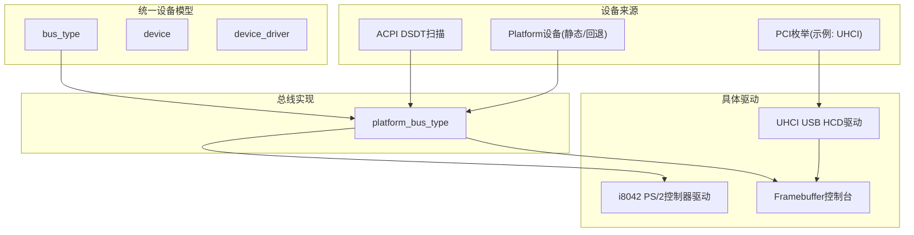
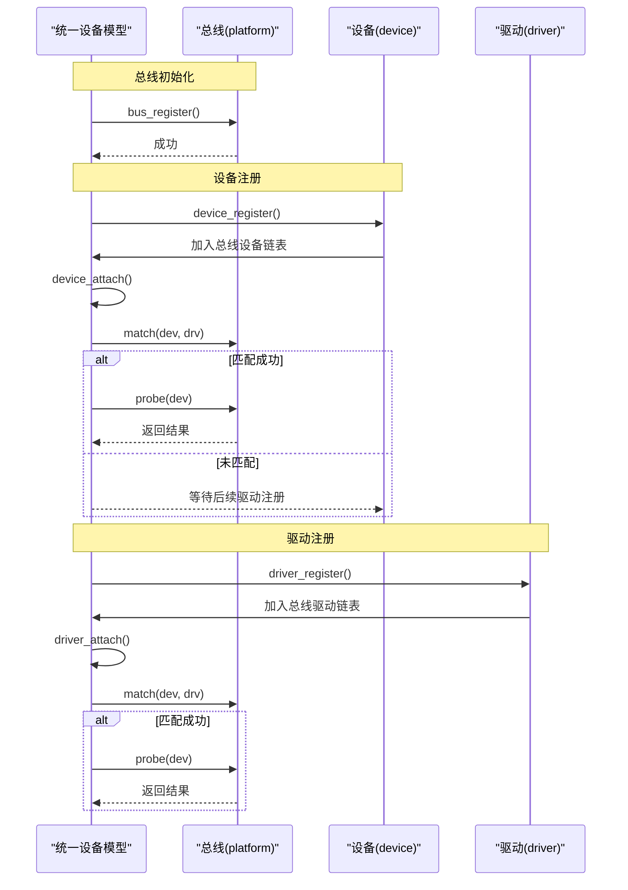
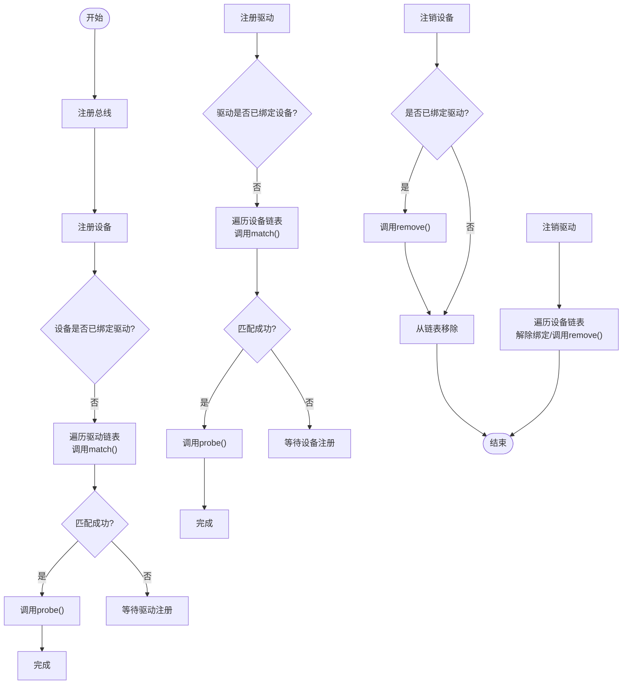
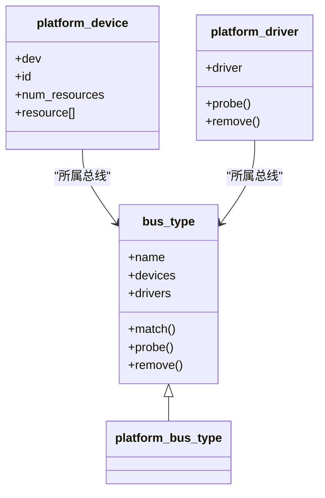
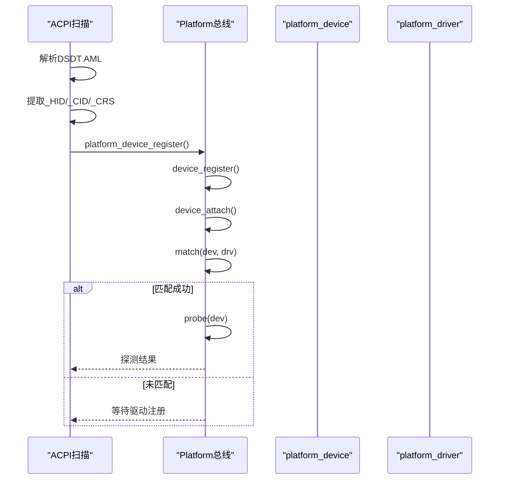
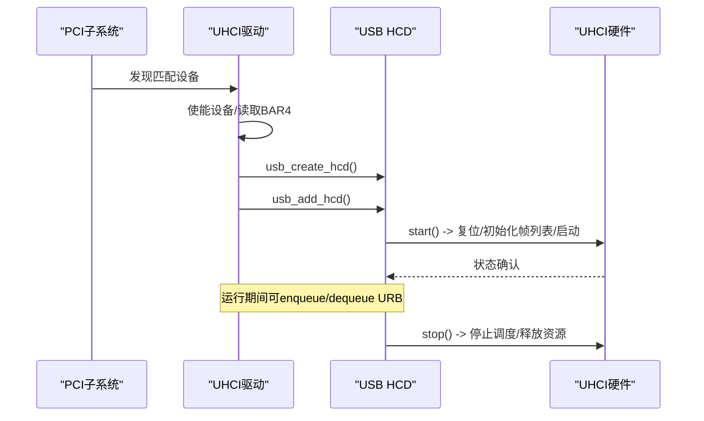
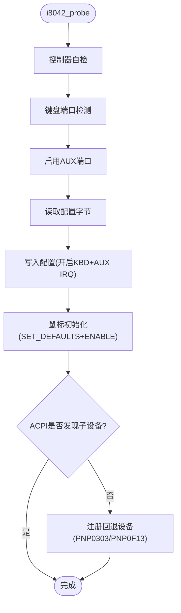
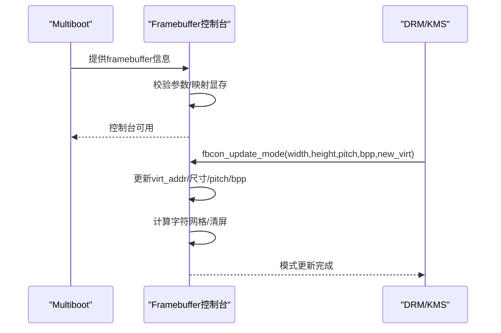
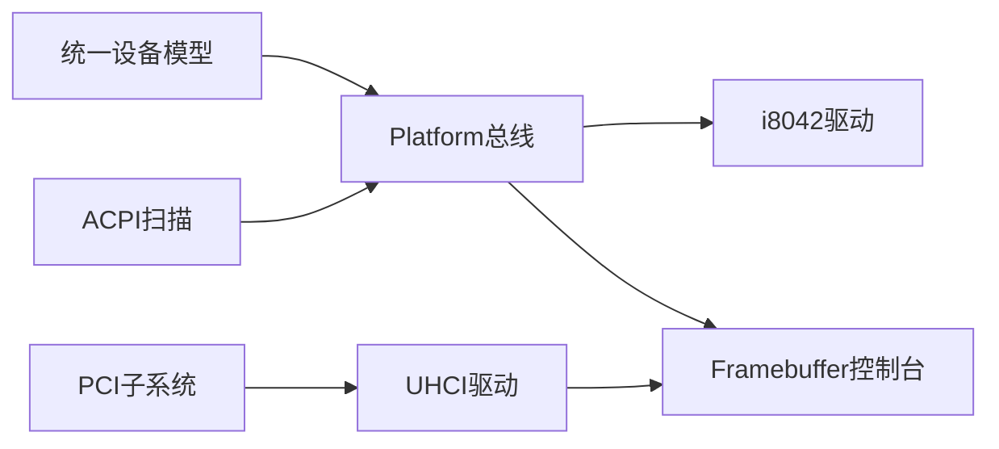

# 驱动管理

<cite>
**本文引用的文件**
- [kernel/device/device.c](file://kernel/device/device.c)
- [includes/device/device.h](file://includes/device/device.h)
- [kernel/device/platform.c](file://kernel/device/platform.c)
- [includes/device/platform.h](file://includes/device/platform.h)
- [kernel/device/acpi_dev.c](file://kernel/device/acpi_dev.c)
- [kernel/usb/uhci-hcd.c](file://kernel/usb/uhci-hcd.c)
- [kernel/video/fb.c](file://kernel/video/fb.c)
- [kernel/i8042.c](file://kernel/i8042.c)
</cite>

## 目录
1. [简介](#简介)
2. [项目结构](#项目结构)
3. [核心组件](#核心组件)
4. [架构总览](#架构总览)
5. [详细组件分析](#详细组件分析)
6. [依赖关系分析](#依赖关系分析)
7. [性能考虑](#性能考虑)
8. [故障排查指南](#故障排查指南)
9. [结论](#结论)
10. [附录：API参考与调试技巧](#附录api参考与调试技巧)

## 简介
本文件面向LulaOS的驱动开发者与维护者，系统性说明设备驱动模型的核心机制：驱动的注册与注销、生命周期管理、设备与驱动的动态绑定与解绑、加载顺序与依赖处理、资源管理与错误恢复策略。文档包含状态机图与初始化流程图，并提供API参考与调试建议，帮助快速定位问题并正确实现新驱动。

## 项目结构
LulaOS的设备子系统采用“统一设备模型 + 总线抽象”的设计：
- 统一设备模型提供 bus_type / device / device_driver 三要素及匹配、探测、移除等通用流程。
- Platform 总线用于非PCI类设备（如SoC外设、PS/2控制器），通过名称匹配设备与驱动。
- ACPI DSDT扫描将固件描述的设备转换为Platform设备并注册。
- PCI驱动（如UHCI USB主机控制器）通过PCI子系统发现设备后创建HCD并启动控制器。
- 显示子系统（Framebuffer控制台）在DRM/KMS切换分辨率时更新映射与参数，保证控制台稳定输出。

图表来源
- [kernel/device/device.c:22-34](file://kernel/device/device.c#L22-L34)
- [kernel/device/platform.c:15-77](file://kernel/device/platform.c#L15-L77)
- [kernel/device/acpi_dev.c:749-796](file://kernel/device/acpi_dev.c#L749-L796)
- [kernel/usb/uhci-hcd.c:275-395](file://kernel/usb/uhci-hcd.c#L275-L395)
- [kernel/video/fb.c:255-319](file://kernel/video/fb.c#L255-L319)

章节来源
- [kernel/device/device.c:22-34](file://kernel/device/device.c#L22-L34)
- [kernel/device/platform.c:15-77](file://kernel/device/platform.c#L15-L77)
- [kernel/device/acpi_dev.c:749-796](file://kernel/device/acpi_dev.c#L749-L796)
- [kernel/usb/uhci-hcd.c:275-395](file://kernel/usb/uhci-hcd.c#L275-L395)
- [kernel/video/fb.c:255-319](file://kernel/video/fb.c#L255-L319)

## 核心组件
- 总线类型 bus_type：定义 name、设备/驱动链表、match/probe/remove 回调。
- 设备 device：嵌入到各总线设备结构中，记录所属总线、已绑定驱动、私有数据。
- 驱动 device_driver：嵌入到各总线驱动结构中，记录名称、所属总线。
- Platform 总线：以名称匹配 platform_device 与 platform_driver，转发 probe/remove。
- ACPI 设备扫描：解析DSDT AML，提取 _HID/_CID/_CRS，生成 platform_device 并注册。
- PCI驱动（UHCI）：发现USB控制器，创建并启动HCD，完成控制器初始化。
- Framebuffer控制台：基于Multiboot信息初始化，支持分辨率切换时的重映射与参数同步。

章节来源
- [includes/device/device.h:26-77](file://includes/device/device.h#L26-L77)
- [kernel/device/platform.c:15-77](file://kernel/device/platform.c#L15-L77)
- [kernel/device/acpi_dev.c:749-796](file://kernel/device/acpi_dev.c#L749-L796)
- [kernel/usb/uhci-hcd.c:275-395](file://kernel/usb/uhci-hcd.c#L275-L395)
- [kernel/video/fb.c:255-319](file://kernel/video/fb.c#L255-L319)

## 架构总览
统一设备模型负责“注册-匹配-探测-移除”的通用流程；各总线实现具体的匹配规则与探测逻辑。设备可由ACPI或平台代码静态注册，也可由PCI枚举发现。驱动在注册时触发与已有设备的匹配；设备在注册时触发与已有驱动的匹配。

图表来源
- [kernel/device/device.c:22-34](file://kernel/device/device.c#L22-L34)
- [kernel/device/device.c:42-87](file://kernel/device/device.c#L42-L87)
- [kernel/device/device.c:94-139](file://kernel/device/device.c#L94-L139)
- [kernel/device/platform.c:25-77](file://kernel/device/platform.c#L25-L77)

## 详细组件分析

### 统一设备模型（bus/device/driver）
- 注册总线：初始化设备/驱动链表，加入全局总线列表。
- 设备注册：加入总线设备链表，尝试匹配已注册驱动；若匹配成功则调用probe。
- 驱动注册：加入总线驱动链表，尝试匹配已注册设备；若匹配成功则调用probe。
- 设备注销：若已绑定驱动且总线提供remove回调，则调用remove并从链表移除。
- 驱动注销：遍历总线设备链表，解除所有绑定该驱动的设备，必要时调用remove。

图表来源
- [kernel/device/device.c:22-34](file://kernel/device/device.c#L22-L34)
- [kernel/device/device.c:42-87](file://kernel/device/device.c#L42-L87)
- [kernel/device/device.c:94-139](file://kernel/device/device.c#L94-L139)
- [kernel/device/device.c:113-164](file://kernel/device/device.c#L113-L164)

章节来源
- [kernel/device/device.c:22-34](file://kernel/device/device.c#L22-L34)
- [kernel/device/device.c:42-87](file://kernel/device/device.c#L42-L87)
- [kernel/device/device.c:94-139](file://kernel/device/device.c#L94-L139)
- [kernel/device/device.c:113-164](file://kernel/device/device.c#L113-L164)

### Platform 总线
- 匹配规则：比较 platform_device.dev.name 与 platform_driver.driver.name。
- 探测转发：将统一模型的 probe 调用转发到 platform_driver->probe。
- 资源访问：提供按类型和序号获取资源的接口。
- 设备查找：支持按名称查找已注册的 platform_device。

图表来源
- [includes/device/device.h:26-77](file://includes/device/device.h#L26-L77)
- [includes/device/platform.h:44-83](file://includes/device/platform.h#L44-L83)
- [kernel/device/platform.c:15-77](file://kernel/device/platform.c#L15-L77)

章节来源
- [kernel/device/platform.c:15-77](file://kernel/device/platform.c#L15-L77)
- [includes/device/platform.h:44-83](file://includes/device/platform.h#L44-L83)

### ACPI 设备扫描与注册
- 解析DSDT AML：识别Device节点，提取_HID/_CID/_CRS属性。
- 资源转换：将_CRS中的IRQ/I/O/Memory描述符转为 platform_resource。
- 设备注册：为每个有_HID的设备构造 platform_device 并注册，从而触发匹配与探测。

图表来源
- [kernel/device/acpi_dev.c:749-796](file://kernel/device/acpi_dev.c#L749-L796)
- [kernel/device/platform.c:84-98](file://kernel/device/platform.c#L84-L98)
- [kernel/device/device.c:94-105](file://kernel/device/device.c#L94-L105)

章节来源
- [kernel/device/acpi_dev.c:749-796](file://kernel/device/acpi_dev.c#L749-L796)
- [kernel/device/platform.c:84-98](file://kernel/device/platform.c#L84-L98)
- [kernel/device/device.c:94-105](file://kernel/device/device.c#L94-L105)

### PCI 驱动（UHCI USB HCD）
- 设备发现：通过PCI类码匹配UHCI控制器。
- 资源获取：从BAR4读取I/O基址，分配HCD与私有数据结构。
- 控制器初始化：复位、初始化帧列表、配置中断、启动调度器。
- 生命周期：提供start/stop回调，确保资源正确释放。

图表来源
- [kernel/usb/uhci-hcd.c:275-395](file://kernel/usb/uhci-hcd.c#L275-L395)
- [kernel/usb/uhci-hcd.c:148-202](file://kernel/usb/uhci-hcd.c#L148-L202)
- [kernel/usb/uhci-hcd.c:207-248](file://kernel/usb/uhci-hcd.c#L207-L248)

章节来源
- [kernel/usb/uhci-hcd.c:275-395](file://kernel/usb/uhci-hcd.c#L275-L395)
- [kernel/usb/uhci-hcd.c:148-202](file://kernel/usb/uhci-hcd.c#L148-L202)
- [kernel/usb/uhci-hcd.c:207-248](file://kernel/usb/uhci-hcd.c#L207-L248)

### i8042 PS/2控制器（Platform驱动）
- 控制器自检与端口检测：验证控制器与键盘端口可用性。
- 配置字节读写：启用AUX端口，开启键盘/鼠标中断。
- 鼠标初始化：发送SET_DEFAULTS与ENABLE命令。
- 子设备回退注册：若ACPI未发现键盘/鼠标设备，则补充注册。

图表来源
- [kernel/i8042.c:128-220](file://kernel/i8042.c#L128-L220)
- [kernel/i8042.c:253-263](file://kernel/i8042.c#L253-L263)
- [kernel/i8042.c:283-302](file://kernel/i8042.c#L283-L302)

章节来源
- [kernel/i8042.c:128-220](file://kernel/i8042.c#L128-L220)
- [kernel/i8042.c:253-263](file://kernel/i8042.c#L253-L263)
- [kernel/i8042.c:283-302](file://kernel/i8042.c#L283-L302)

### Framebuffer控制台（显示子系统）
- 初始化：从Multiboot信息读取framebuffer参数，进行基本校验，映射显存。
- 字符渲染：根据字体数据绘制字符，支持换行、滚动。
- 模式更新：DRM/KMS切换分辨率后，更新虚拟地址、尺寸、pitch、bpp，并清屏。

图表来源
- [kernel/video/fb.c:255-319](file://kernel/video/fb.c#L255-L319)
- [kernel/video/fb.c:222-251](file://kernel/video/fb.c#L222-L251)

章节来源
- [kernel/video/fb.c:255-319](file://kernel/video/fb.c#L255-L319)
- [kernel/video/fb.c:222-251](file://kernel/video/fb.c#L222-L251)

## 依赖关系分析
- 统一设备模型依赖链表与打印接口。
- Platform总线依赖字符串比较与打印接口。
- ACPI扫描依赖页映射与内存拷贝工具。
- UHCI驱动依赖PCI、HCD、页管理与slab分配。
- i8042驱动依赖I/O端口操作与平台设备/驱动注册。
- Framebuffer控制台依赖页表操作与高内存映射。

图表来源
- [kernel/device/device.c:22-34](file://kernel/device/device.c#L22-L34)
- [kernel/device/platform.c:15-77](file://kernel/device/platform.c#L15-L77)
- [kernel/device/acpi_dev.c:749-796](file://kernel/device/acpi_dev.c#L749-L796)
- [kernel/usb/uhci-hcd.c:275-395](file://kernel/usb/uhci-hcd.c#L275-L395)
- [kernel/video/fb.c:255-319](file://kernel/video/fb.c#L255-L319)

章节来源
- [kernel/device/device.c:22-34](file://kernel/device/device.c#L22-L34)
- [kernel/device/platform.c:15-77](file://kernel/device/platform.c#L15-L77)
- [kernel/device/acpi_dev.c:749-796](file://kernel/device/acpi_dev.c#L749-L796)
- [kernel/usb/uhci-hcd.c:275-395](file://kernel/usb/uhci-hcd.c#L275-L395)
- [kernel/video/fb.c:255-319](file://kernel/video/fb.c#L255-L319)

## 性能考虑
- 匹配复杂度：设备/驱动注册时遍历对方链表，时间复杂度O(N)。对于大量设备/驱动场景，应考虑更高效的匹配索引（如哈希表）。
- 资源分配：UHCI控制器初始化分配帧列表与QH/TD池，需确保对齐与释放路径完整，避免内存泄漏。
- I/O访问：i8042控制器使用轮询等待超时，应避免长时间阻塞；在高负载下考虑中断驱动优化。
- 显存映射：Framebuffer控制台在分辨率切换时需重新映射并清屏，尽量减少不必要的重映射范围。

[本节为通用性能讨论，不直接分析具体文件]

## 故障排查指南
- 设备未匹配：检查设备名称与驱动名称是否一致；确认总线已注册；查看probe返回值。
- 资源冲突：核对platform_resource的IO/MEM/IRQ范围；确保无重复占用。
- 控制器初始化失败：检查I/O端口响应、超时计数、命令序列是否正确；查看日志中自检与端口检测结果。
- 显存花屏或Page Fault：确认fbcon_update_mode已调用并传入正确的new_virt；检查pitch与bpp是否与DRM驱动一致。

章节来源
- [kernel/device/platform.c:25-77](file://kernel/device/platform.c#L25-L77)
- [kernel/i8042.c:128-220](file://kernel/i8042.c#L128-L220)
- [kernel/video/fb.c:222-251](file://kernel/video/fb.c#L222-L251)

## 结论
LulaOS的设备驱动管理采用简洁而可扩展的统一设备模型，结合Platform总线与ACPI扫描，实现了设备与驱动的动态绑定与解绑。PCI驱动通过HCD框架管理控制器生命周期，显示子系统在分辨率变化时保持控制台稳定。遵循本文的流程与API，开发者可以可靠地实现新驱动并有效排查问题。

[本节为总结性内容，不直接分析具体文件]

## 附录：API参考与调试技巧

### API参考
- 总线注册/注销
  - bus_register(bus)
  - bus_unregister(bus)（当前实现未暴露，可通过扩展添加）
- 设备注册/注销
  - device_register(dev)
  - device_unregister(dev)
- 驱动注册/注销
  - driver_register(drv)
  - driver_unregister(drv)
- Platform总线
  - platform_bus_init()
  - platform_device_register(pdev)
  - platform_driver_register(pdrv)
  - platform_find_device(name)
  - platform_get_resource(pdev, type, index)
- ACPI设备注册
  - acpi_register_platform_devices()
- UHCI驱动
  - uhci_init()
  - usb_create_hcd()/usb_add_hcd()/usb_remove_hcd()（通过HCD接口）
- Framebuffer控制台
  - fbcon_init()
  - fbcon_update_mode(width, height, pitch, bpp, new_virt)

章节来源
- [includes/device/device.h:68-77](file://includes/device/device.h#L68-L77)
- [kernel/device/platform.c:70-159](file://kernel/device/platform.c#L70-L159)
- [kernel/device/acpi_dev.c:749-796](file://kernel/device/acpi_dev.c#L749-L796)
- [kernel/usb/uhci-hcd.c:391-395](file://kernel/usb/uhci-hcd.c#L391-L395)
- [kernel/video/fb.c:255-319](file://kernel/video/fb.c#L255-L319)

### 调试技巧
- 启用打印：利用printk输出关键路径（总线注册、设备/驱动匹配、probe返回值）。
- 检查资源：使用platform_get_resource确认IO/MEM/IRQ范围是否符合预期。
- 控制器状态：在UHCI控制器start/stop前后读取状态寄存器，确认复位与启动成功。
- 显存映射：在fbcon_update_mode前后对比virt_addr与pitch，确保映射覆盖完整VRAM。
- 回退机制：当ACPI未发现设备时，检查i8042回退设备是否注册成功。

章节来源
- [kernel/device/platform.c:25-77](file://kernel/device/platform.c#L25-L77)
- [kernel/usb/uhci-hcd.c:148-202](file://kernel/usb/uhci-hcd.c#L148-L202)
- [kernel/video/fb.c:222-251](file://kernel/video/fb.c#L222-L251)
- [kernel/i8042.c:253-263](file://kernel/i8042.c#L253-L263)