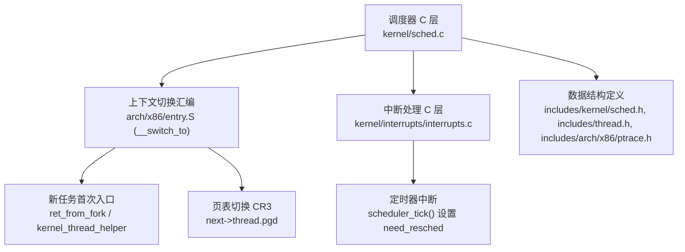
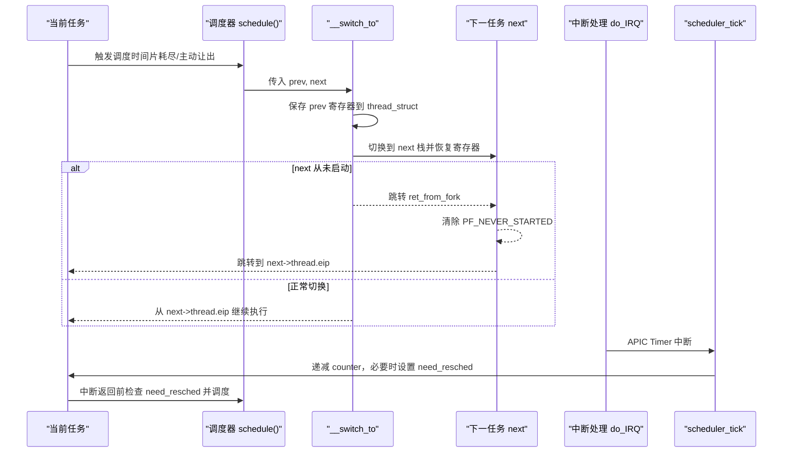
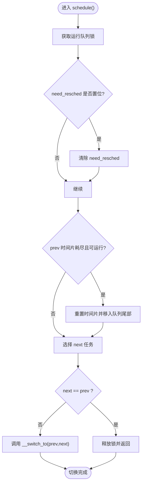
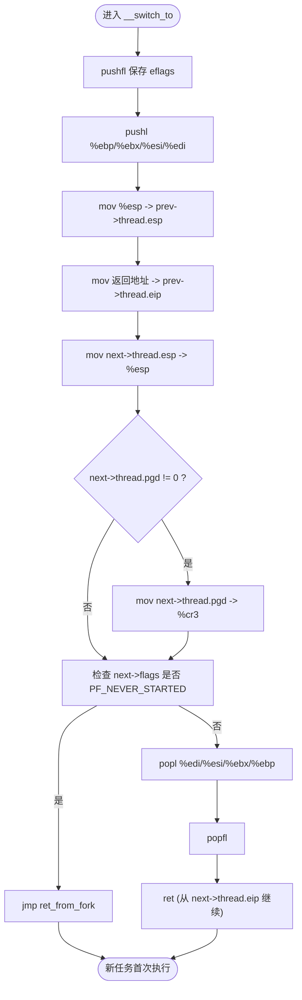
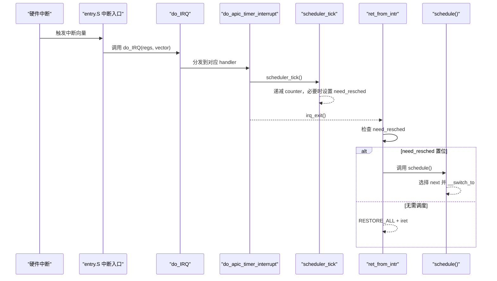
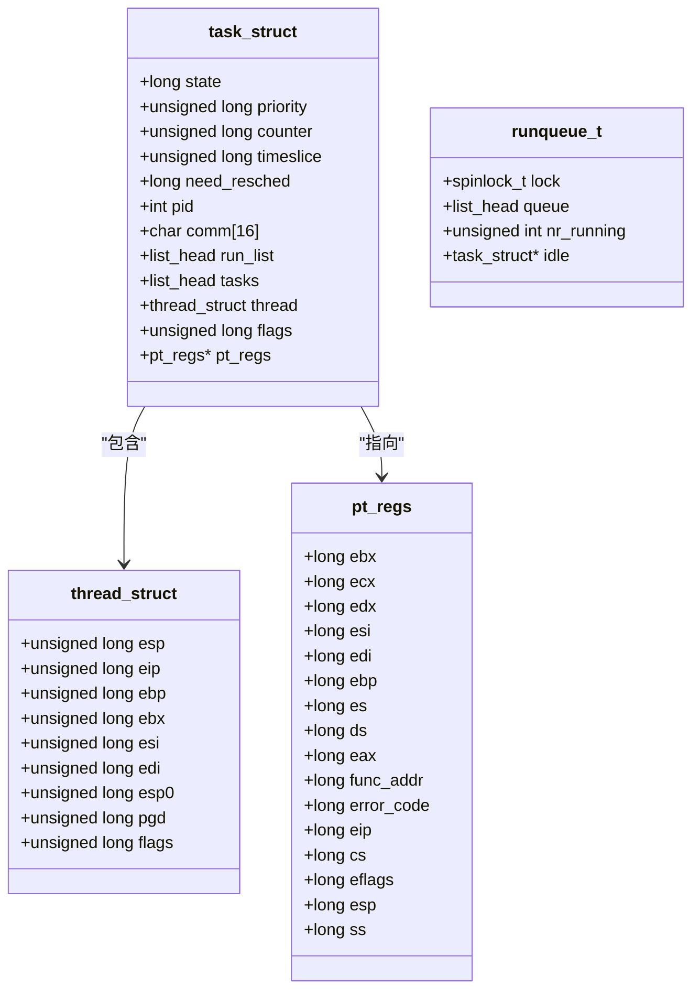
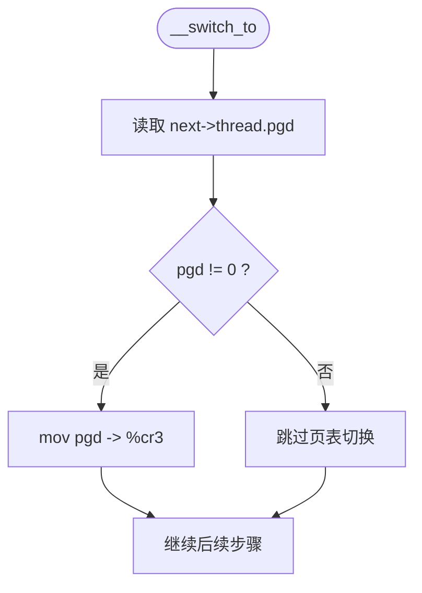
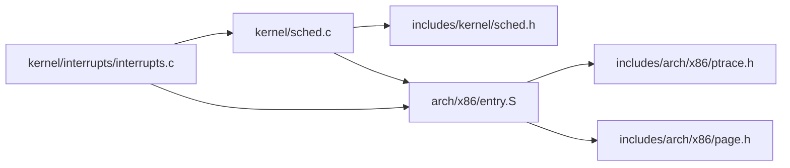

# 上下文切换机制

<cite>
**本文引用的文件**
- [arch/x86/entry.S](file://arch/x86/entry.S)
- [kernel/sched.c](file://kernel/sched.c)
- [includes/kernel/sched.h](file://includes/kernel/sched.h)
- [includes/thread.h](file://includes/thread.h)
- [includes/arch/x86/ptrace.h](file://includes/arch/x86/ptrace.h)
- [arch/x86/kernel/process.S](file://arch/x86/kernel/process.S)
- [kernel/interrupts/interrupts.c](file://kernel/interrupts/interrupts.c)
- [includes/arch/x86/page.h](file://includes/arch/x86/page.h)
</cite>

## 目录
1. [简介](#简介)
2. [项目结构](#项目结构)
3. [核心组件](#核心组件)
4. [架构总览](#架构总览)
5. [详细组件分析](#详细组件分析)
6. [依赖关系分析](#依赖关系分析)
7. [性能考量](#性能考量)
8. [故障排查指南](#故障排查指南)
9. [结论](#结论)
10. [附录](#附录)

## 简介
本文面向LulaOS的上下文切换机制，聚焦x86架构下的进程/线程切换实现。内容涵盖：
- 调度器如何触发上下文切换
- __switch_to汇编实现中寄存器保存与恢复、栈指针切换、页表（CR3）切换
- 新任务首次执行路径（ret_from_fork → kernel_thread_helper 或 ret_from_intr）
- 中断处理与need_resched驱动的调度时机
- 时序图与流程图，帮助理解关键路径
- 调试技巧与常见问题定位方法

## 项目结构
围绕上下文切换的关键代码分布在以下位置：
- 调度器C层：schedule()、scheduler_tick()、cpu_idle()、sys_fork()/kernel_thread()
- 上下文切换汇编：__switch_to、ret_from_fork、RESTORE_ALL、系统调用入口等
- 数据结构：task_struct、thread_struct、pt_regs、runqueue_t
- 中断子系统：do_IRQ、APIC Timer中断、need_resched设置与调度触发



图表来源
- [kernel/sched.c:136-213](file://kernel/sched.c#L136-L213)
- [arch/x86/entry.S:489-610](file://arch/x86/entry.S#L489-L610)
- [kernel/interrupts/interrupts.c:116-128](file://kernel/interrupts/interrupts.c#L116-L128)
- [includes/kernel/sched.h:44-106](file://includes/kernel/sched.h#L44-L106)
- [includes/thread.h:6-17](file://includes/thread.h#L6-L17)
- [includes/arch/x86/ptrace.h:5-23](file://includes/arch/x86/ptrace.h#L5-L23)

章节来源
- [kernel/sched.c:136-213](file://kernel/sched.c#L136-L213)
- [arch/x86/entry.S:489-610](file://arch/x86/entry.S#L489-L610)
- [kernel/interrupts/interrupts.c:116-128](file://kernel/interrupts/interrupts.c#L116-L128)
- [includes/kernel/sched.h:44-106](file://includes/kernel/sched.h#L44-L106)
- [includes/thread.h:6-17](file://includes/thread.h#L6-L17)
- [includes/arch/x86/ptrace.h:5-23](file://includes/arch/x86/ptrace.h#L5-L23)

## 核心组件
- 调度器（schedule）：选择下一个任务并调用__switch_to完成切换
- 上下文切换（__switch_to）：保存prev寄存器到其thread_struct，加载next寄存器并从next->thread.eip继续
- 新任务首次执行（ret_from_fork）：清除PF_NEVER_STARTED后跳转到thread.eip
- 内核线程启动（kernel_thread_helper）：弹出fn和arg，调用fn(arg)，返回后调用do_exit
- 中断与调度触发（scheduler_tick）：递减时间片，置位need_resched，中断返回前检查并调度
- 数据结构：task_struct、thread_struct、pt_regs、runqueue_t

章节来源
- [kernel/sched.c:136-213](file://kernel/sched.c#L136-L213)
- [arch/x86/entry.S:489-610](file://arch/x86/entry.S#L489-L610)
- [arch/x86/kernel/process.S:10-24](file://arch/x86/kernel/process.S#L10-L24)
- [kernel/interrupts/interrupts.c:116-128](file://kernel/interrupts/interrupts.c#L116-L128)
- [includes/kernel/sched.h:44-106](file://includes/kernel/sched.h#L44-L106)
- [includes/thread.h:6-17](file://includes/thread.h#L6-L17)
- [includes/arch/x86/ptrace.h:5-23](file://includes/arch/x86/ptrace.h#L5-L23)

## 架构总览
下图展示从调度器到上下文切换再到中断处理的完整交互流程。



图表来源
- [kernel/sched.c:136-213](file://kernel/sched.c#L136-L213)
- [arch/x86/entry.S:489-610](file://arch/x86/entry.S#L489-L610)
- [kernel/interrupts/interrupts.c:116-128](file://kernel/interrupts/interrupts.c#L116-L128)

## 详细组件分析

### 调度器与调度触发
- schedule()：获取运行队列锁，处理prev的时间片与状态，选择next；若next==prev则直接返回；否则通过内联汇编调用__switch_to(prev,next)
- scheduler_tick()：在APIC Timer中断中递减counter，当counter为0时设置need_resched
- cpu_idle()：空闲循环等待need_resched，然后调用schedule()



图表来源
- [kernel/sched.c:136-213](file://kernel/sched.c#L136-L213)

章节来源
- [kernel/sched.c:136-213](file://kernel/sched.c#L136-L213)
- [kernel/sched.c:223-237](file://kernel/sched.c#L223-L237)
- [kernel/sched.c:250-259](file://kernel/sched.c#L250-L259)

### 上下文切换汇编实现（__switch_to）
- 保存阶段（prev）：
  - pushfl 保存eflags
  - pushl %ebp/%ebx/%esi/%edi 保存被调用者保存寄存器
  - 将当前esp保存到prev->thread.esp
  - 将返回地址保存到prev->thread.eip
- 切换阶段：
  - 从next->thread.esp加载esp，切换到next的内核栈
  - 若next->thread.pgd非零，写入CR3完成页表切换
  - 若next->flags包含PF_NEVER_STARTED，跳转到ret_from_fork
- 恢复阶段（next）：
  - popl %edi/%esi/%ebx/%ebp 恢复寄存器
  - popfl 恢复eflags
  - ret 从next->thread.eip继续执行



图表来源
- [arch/x86/entry.S:489-583](file://arch/x86/entry.S#L489-L583)

章节来源
- [arch/x86/entry.S:489-583](file://arch/x86/entry.S#L489-L583)

### 新任务首次执行路径（ret_from_fork）
- ret_from_fork通过esp & ~0x1FFF定位current task_struct
- 清除PF_NEENER_STARTED标志
- 跳转到thread.eip保存的地址：
  - 对于sys_fork创建的任务：thread.eip = ret_from_intr，最终通过RESTORE_ALL iret返回用户态
  - 对于kernel_thread创建的任务：thread.eip = kernel_thread_helper，弹出fn和arg后调用fn(arg)

```mermaid
sequenceDiagram
participant SW as "__switch_to"
participant RF as "ret_from_fork"
participant KH as "kernel_thread_helper"
participant RI as "ret_from_intr"
SW->>RF : 检测到 PF_NEVER_STARTED
RF->>RF : 清除 flags.PF_NEVER_STARTED
alt 新任务是 fork 子进程
RF->>RI : 跳转到 thread.eip (ret_from_intr)
RI-->>RI : RESTORE_ALL + iret 返回用户态
else 新任务是内核线程
RF->>KH : 跳转到 thread.eip (kernel_thread_helper)
KH->>KH : sti; pop fn,arg; call fn(arg); do_exit(code)
end
```

图表来源
- [arch/x86/entry.S:586-610](file://arch/x86/entry.S#L586-L610)
- [arch/x86/kernel/process.S:10-24](file://arch/x86/kernel/process.S#L10-L24)

章节来源
- [arch/x86/entry.S:586-610](file://arch/x86/entry.S#L586-L610)
- [arch/x86/kernel/process.S:10-24](file://arch/x86/kernel/process.S#L10-L24)

### 中断处理与调度触发
- 硬件中断入口统一通过interrupt_warpper压入参数并调用具体handler
- do_IRQ负责分发到设备驱动，并在irq_enter/irq_exit中处理软中断
- APIC Timer中断（do_apic_timer_interrupt）调用scheduler_tick()，递减时间片并可能设置need_resched
- 中断返回前（ret_from_intr）检查need_resched，若置位则调用schedule()



图表来源
- [arch/x86/entry.S:23-58](file://arch/x86/entry.S#L23-L58)
- [kernel/interrupts/interrupts.c:84-128](file://kernel/interrupts/interrupts.c#L84-L128)
- [kernel/sched.c:223-237](file://kernel/sched.c#L223-L237)

章节来源
- [arch/x86/entry.S:23-58](file://arch/x86/entry.S#L23-L58)
- [kernel/interrupts/interrupts.c:84-128](file://kernel/interrupts/interrupts.c#L84-L128)
- [kernel/sched.c:223-237](file://kernel/sched.c#L223-L237)

### 数据结构与内存布局
- task_struct：包含调度信息、CPU上下文（thread_struct）、链表节点等
- thread_struct：保存切换所需的寄存器与页目录基址（pgd）
- pt_regs：中断/系统调用时的寄存器快照，用于返回用户态
- runqueue_t：每CPU运行队列，维护可运行任务链表与idle任务



图表来源
- [includes/kernel/sched.h:44-106](file://includes/kernel/sched.h#L44-L106)
- [includes/thread.h:6-17](file://includes/thread.h#L6-L17)
- [includes/arch/x86/ptrace.h:5-23](file://includes/arch/x86/ptrace.h#L5-L23)

章节来源
- [includes/kernel/sched.h:44-106](file://includes/kernel/sched.h#L44-L106)
- [includes/thread.h:6-17](file://includes/thread.h#L6-L17)
- [includes/arch/x86/ptrace.h:5-23](file://includes/arch/x86/ptrace.h#L5-L23)

### 页表切换（CR3）
- __switch_to在切换到next之前检查next->thread.pgd，若非零则写入CR3
- page.h定义了pgd_t类型及宏，便于C层操作页目录项
- 新进程fork时，thread.pgd通常由父进程复制，确保地址空间隔离



图表来源
- [arch/x86/entry.S:554-559](file://arch/x86/entry.S#L554-L559)
- [includes/arch/x86/page.h:22-37](file://includes/arch/x86/page.h#L22-L37)

章节来源
- [arch/x86/entry.S:554-559](file://arch/x86/entry.S#L554-L559)
- [includes/arch/x86/page.h:22-37](file://includes/arch/x86/page.h#L22-L37)

## 依赖关系分析
- 调度器依赖：
  - 数据结构：task_struct、thread_struct、runqueue_t
  - 汇编接口：__switch_to、ret_from_fork、ret_from_intr
  - 中断子系统：scheduler_tick、do_IRQ
- 上下文切换依赖：
  - 寄存器保存/恢复约定（cdecl callee-saved）
  - 栈布局：thread_union合并task_struct与内核栈，保证current宏有效
  - 页表切换：CR3更新依赖于next->thread.pgd



图表来源
- [kernel/sched.c:136-213](file://kernel/sched.c#L136-L213)
- [arch/x86/entry.S:489-610](file://arch/x86/entry.S#L489-L610)
- [kernel/interrupts/interrupts.c:84-128](file://kernel/interrupts/interrupts.c#L84-L128)
- [includes/kernel/sched.h:44-106](file://includes/kernel/sched.h#L44-L106)
- [includes/arch/x86/ptrace.h:5-23](file://includes/arch/x86/ptrace.h#L5-L23)
- [includes/arch/x86/page.h:22-37](file://includes/arch/x86/page.h#L22-L37)

章节来源
- [kernel/sched.c:136-213](file://kernel/sched.c#L136-L213)
- [arch/x86/entry.S:489-610](file://arch/x86/entry.S#L489-L610)
- [kernel/interrupts/interrupts.c:84-128](file://kernel/interrupts/interrupts.c#L84-L128)
- [includes/kernel/sched.h:44-106](file://includes/kernel/sched.h#L44-L106)
- [includes/arch/x86/ptrace.h:5-23](file://includes/arch/x86/ptrace.h#L5-L23)
- [includes/arch/x86/page.h:22-37](file://includes/arch/x86/page.h#L22-L37)

## 性能考量
- 最小化寄存器保存数量：仅保存callee-saved寄存器，减少栈操作开销
- 条件页表切换：仅在next->thread.pgd非零时写入CR3，避免不必要的TLB失效
- 快速路径优化：若next==prev则直接返回，避免无意义的切换
- 中断延迟控制：scheduler_tick快速处理，尽早设置need_resched，减少调度抖动
- 空闲循环节能：cpu_idle使用safe_halt等待中断，降低功耗

[本节提供通用指导，不直接分析具体文件]

## 故障排查指南
- 现象：切换后程序崩溃或段错误
  - 检查next->thread.pgd是否正确设置，确认CR3切换逻辑
  - 验证pt_regs布局与RESTORE_ALL匹配，避免返回用户态时寄存器错乱
- 现象：新任务未执行或卡死
  - 确认PF_NEVER_STARTED标志在ret_from_fork中被正确清除
  - 检查kernel_thread_helper是否正确弹出fn和arg并调用
- 现象：调度不生效
  - 检查scheduler_tick是否被APIC Timer调用，确认need_resched设置
  - 验证ret_from_intr是否正确检查need_resched并调用schedule
- 调试技巧：
  - 在__switch_to前后打印prev/next的pid、eip、esp、pgd
  - 在中断入口和退出处记录时间戳，评估中断延迟
  - 使用printk输出调度决策（选择next的原因、时间片变化）

章节来源
- [arch/x86/entry.S:489-610](file://arch/x86/entry.S#L489-L610)
- [arch/x86/kernel/process.S:10-24](file://arch/x86/kernel/process.S#L10-L24)
- [kernel/interrupts/interrupts.c:116-128](file://kernel/interrupts/interrupts.c#L116-L128)
- [kernel/sched.c:223-237](file://kernel/sched.c#L223-L237)

## 结论
LulaOS的上下文切换机制以简洁高效的汇编实现为核心，结合C层调度器与中断子系统，实现了可靠的进程/线程切换。关键点包括：
- __switch_to精确保存/恢复寄存器，并通过CR3切换页表
- ret_from_fork确保新任务首次执行路径正确
- scheduler_tick与ret_from_intr协作，基于need_resched驱动调度
- 数据结构设计合理，支持多CPU扩展与负载均衡

该实现兼顾性能与可维护性，适合教学与小型操作系统开发。

[本节总结性内容，不直接分析具体文件]

## 附录
- 相关符号与偏移：
  - task_struct字段偏移：need_resched=16, thread.esp=56, thread.eip=60, thread.pgd=84, flags=92
  - 这些偏移在__switch_to与ret_from_fork中被直接使用，需保持一致
- 参考实现：
  - Linux 2.6.20的sched.c、process.c、entry.S提供了重要参考

章节来源
- [kernel/sched.c:20-26](file://kernel/sched.c#L20-L26)
- [arch/x86/entry.S:514-519](file://arch/x86/entry.S#L514-L519)
- [arch/x86/entry.S:596-599](file://arch/x86/entry.S#L596-L599)