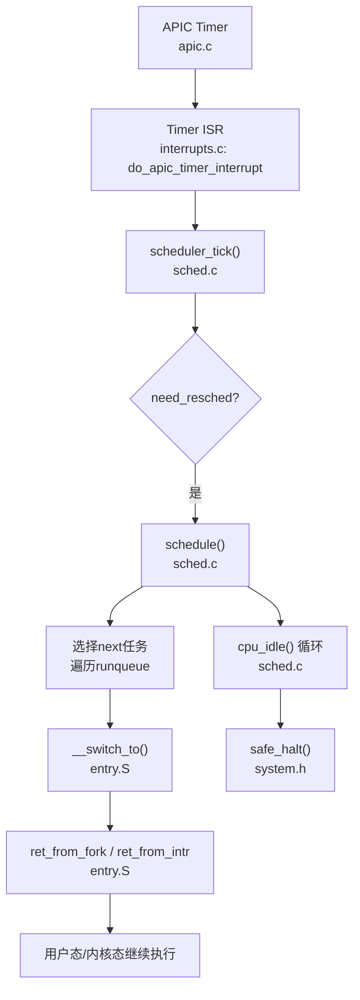
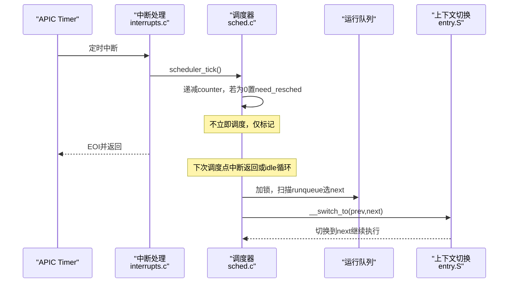
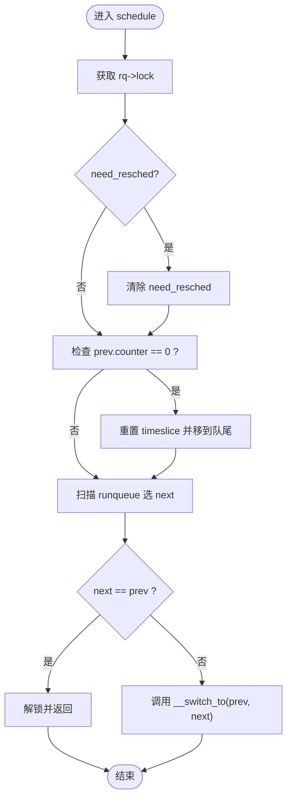
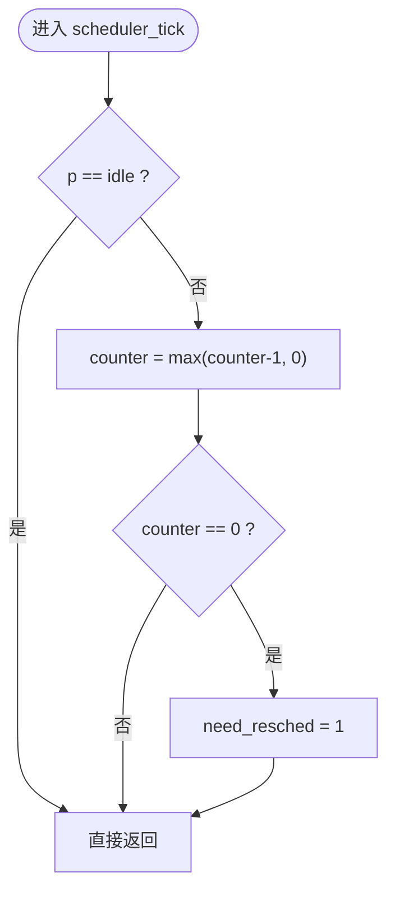
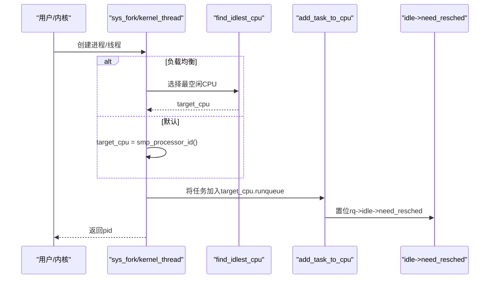
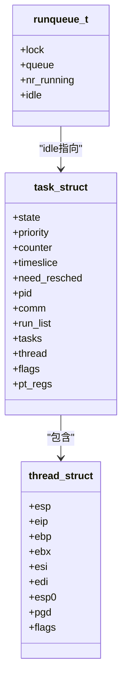
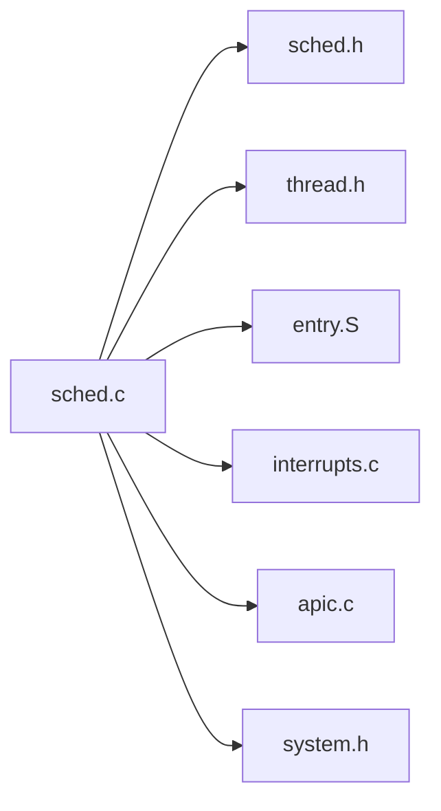

# 调度算法实现

<cite>
**本文引用的文件**
- [kernel/sched.c](file://kernel/sched.c)
- [includes/kernel/sched.h](file://includes/kernel/sched.h)
- [includes/thread.h](file://includes/thread.h)
- [arch/x86/entry.S](file://arch/x86/entry.S)
- [arch/x86/kernel/process.S](file://arch/x86/kernel/process.S)
- [kernel/interrupts/interrupts.c](file://kernel/interrupts/interrupts.c)
- [arch/x86/kernel/apic.c](file://arch/x86/kernel/apic.c)
- [includes/arch/x86/system.h](file://includes/arch/x86/system.h)
</cite>

## 目录
1. [简介](#简介)
2. [项目结构](#项目结构)
3. [核心组件](#核心组件)
4. [架构总览](#架构总览)
5. [详细组件分析](#详细组件分析)
6. [依赖关系分析](#依赖关系分析)
7. [性能考虑](#性能考虑)
8. [故障排查指南](#故障排查指南)
9. [结论](#结论)
10. [附录](#附录)

## 简介
本文件为LulaOS的调度器实现提供系统化、可操作的文档。重点覆盖：
- 时间片轮转调度算法的实现原理与代码路径
- 调度器的核心数据结构（运行队列、任务状态、优先级与时间片）
- 调度点选择与调度决策执行过程
- 时间片管理与定时器中断处理
- 负载均衡与多核扩展
- 伪代码与实际实现的对照
- 调优建议与自定义调度算法的扩展指导

## 项目结构
调度相关的关键位置与职责：
- includes/kernel/sched.h：定义任务描述符、运行队列、current宏、初始化宏、调度API等
- kernel/sched.c：调度器主逻辑（schedule、scheduler_tick、cpu_idle、进程创建/退出、负载均衡）
- arch/x86/entry.S：上下文切换__switch_to、新任务首次入口ret_from_fork
- arch/x86/kernel/process.S：内核线程首次执行入口kernel_thread_helper
- kernel/interrupts/interrupts.c：APIC Timer中断处理，调用scheduler_tick驱动调度
- arch/x86/kernel/apic.c：APIC Timer校准与周期性配置
- includes/arch/x86/system.h：safe_halt、中断开关等底层原语

图表来源
- [arch/x86/kernel/apic.c:125-180](file://arch/x86/kernel/apic.c#L125-L180)
- [kernel/interrupts/interrupts.c:116-128](file://kernel/interrupts/interrupts.c#L116-L128)
- [kernel/sched.c:136-213](file://kernel/sched.c#L136-L213)
- [arch/x86/entry.S:520-610](file://arch/x86/entry.S#L520-L610)
- [includes/arch/x86/system.h:17-22](file://includes/arch/x86/system.h#L17-L22)

章节来源
- [kernel/sched.c:1-479](file://kernel/sched.c#L1-L479)
- [includes/kernel/sched.h:1-201](file://includes/kernel/sched.h#L1-L201)
- [arch/x86/entry.S:500-699](file://arch/x86/entry.S#L500-L699)
- [arch/x86/kernel/process.S:1-24](file://arch/x86/kernel/process.S#L1-L24)
- [kernel/interrupts/interrupts.c:1-145](file://kernel/interrupts/interrupts.c#L1-L145)
- [arch/x86/kernel/apic.c:1-532](file://arch/x86/kernel/apic.c#L1-L532)
- [includes/arch/x86/system.h:1-33](file://includes/arch/x86/system.h#L1-L33)

## 核心组件
- 任务描述符task_struct：包含状态、优先级、剩余时间片counter、基础时间片timeslice、need_resched标志、链表节点、CPU上下文(thread_struct)、页目录pgd等
- 运行队列runqueue_t：每CPU一个，含自旋锁、双向链表queue、nr_running计数、idle指针
- current宏：通过esp屏蔽低13位直接定位当前task_struct，避免额外查找
- 调度API：schedule、scheduler_tick、cpu_idle、进程创建/退出、负载均衡find_idlest_cpu
- 上下文切换：__switch_to保存prev寄存器到thread_struct，恢复next寄存器并切换CR3；ret_from_fork用于新任务首次执行

章节来源
- [includes/kernel/sched.h:44-89](file://includes/kernel/sched.h#L44-L89)
- [includes/kernel/sched.h:91-126](file://includes/kernel/sched.h#L91-L126)
- [includes/thread.h:6-17](file://includes/thread.h#L6-L17)
- [kernel/sched.c:76-97](file://kernel/sched.c#L76-L97)
- [arch/x86/entry.S:520-610](file://arch/x86/entry.S#L520-L610)

## 架构总览
LulaOS采用“静态优先级 + 时间片轮转”的调度策略：
- 每个tick（APIC Timer触发）递减当前任务的counter
- counter归零时设置need_resched，等待下一次调度点
- schedule()在以下时机被调用：
  - 中断返回前（由中断框架检查need_resched）
  - 主动调用（如do_exit、interruptible_sleep）
  - cpu_idle循环中检测到need_resched后
- 选择下一个任务：遍历当前CPU的运行队列，取counter最大的TASK_RUNNING任务；若无则切换到idle

图表来源
- [kernel/interrupts/interrupts.c:116-128](file://kernel/interrupts/interrupts.c#L116-L128)
- [kernel/sched.c:223-237](file://kernel/sched.c#L223-L237)
- [kernel/sched.c:136-213](file://kernel/sched.c#L136-L213)
- [arch/x86/entry.S:520-610](file://arch/x86/entry.S#L520-L610)

## 详细组件分析

### 调度器主流程：schedule()
- 获取当前CPU与运行队列，关中断保护
- 清除need_resched
- 若prev仍为TASK_RUNNING且counter=0，重置其time slice并移到队尾
- 扫描runqueue选择counter最大的TASK_RUNNING任务作为next；否则选择idle
- 若next==prev则直接返回；否则解锁并调用__switch_to进行上下文切换
- 恢复中断

图表来源
- [kernel/sched.c:136-213](file://kernel/sched.c#L136-L213)

章节来源
- [kernel/sched.c:136-213](file://kernel/sched.c#L136-L213)

### 定时器Tick与时间片管理：scheduler_tick()
- 每次APIC Timer中断调用
- 若当前任务是idle则直接返回（idle不消耗时间片）
- 否则递减counter，若counter=0则设置need_resched
- 不立即调度，交由调度点统一处理

图表来源
- [kernel/sched.c:223-237](file://kernel/sched.c#L223-L237)

章节来源
- [kernel/sched.c:223-237](file://kernel/sched.c#L223-L237)

### 空闲循环：cpu_idle()
- 内层循环：当need_resched未置位时执行safe_halt进入低功耗等待
- 外层循环：中断返回后检查need_resched，若置位则调用schedule()
- 保证无任务时可安全休眠并在有新任务时及时唤醒

章节来源
- [kernel/sched.c:250-259](file://kernel/sched.c#L250-L259)
- [includes/arch/x86/system.h:17-22](file://includes/arch/x86/system.h#L17-L22)

### 进程创建与加入运行队列
- sys_fork：复制父进程上下文，分配新PID，初始化调度状态，根据fork_flags选择目标CPU（KT_BALANCE使用find_idlest_cpu），将子进程加入目标CPU运行队列，并置位目标idle的need_resched以唤醒
- kernel_thread：类似sys_fork，但首次执行入口为kernel_thread_helper，构造初始栈帧[fn,arg]，首次调度时跳转到helper并调用fn(arg)，返回后调用do_exit

图表来源
- [kernel/sched.c:275-356](file://kernel/sched.c#L275-L356)
- [kernel/sched.c:369-433](file://kernel/sched.c#L369-L433)
- [kernel/sched.c:108-124](file://kernel/sched.c#L108-L124)
- [includes/kernel/sched.h:172-181](file://includes/kernel/sched.h#L172-L181)

章节来源
- [kernel/sched.c:275-433](file://kernel/sched.c#L275-L433)
- [includes/kernel/sched.h:147-181](file://includes/kernel/sched.h#L147-L181)

### 上下文切换：__switch_to与ret_from_fork
- __switch_to：保存prev的callee-saved寄存器和eip到thread_struct，恢复next的寄存器并切换CR3；若next的PF_NEVER_STARTED置位则跳转ret_from_fork
- ret_from_fork：通过esp&~(THREAD_SIZE-1)得到current，清除PF_NEER_STARTED，然后跳转到thread.eip（kernel_thread_helper或ret_from_intr）

图表来源
- [includes/kernel/sched.h:44-89](file://includes/kernel/sched.h#L44-L89)
- [includes/thread.h:6-17](file://includes/thread.h#L6-L17)
- [arch/x86/entry.S:520-610](file://arch/x86/entry.S#L520-L610)

章节来源
- [arch/x86/entry.S:520-610](file://arch/x86/entry.S#L520-L610)
- [includes/kernel/sched.h:44-89](file://includes/kernel/sched.h#L44-L89)
- [includes/thread.h:6-17](file://includes/thread.h#L6-L17)

### APIC Timer与调度驱动
- APIC Timer校准：使用PIT Channel 2作为参考，计算每毫秒的tick数，设置为周期性模式
- Timer中断处理：do_apic_timer_interrupt发送EOI并调用scheduler_tick，驱动调度器

章节来源
- [arch/x86/kernel/apic.c:125-180](file://arch/x86/kernel/apic.c#L125-L180)
- [kernel/interrupts/interrupts.c:116-128](file://kernel/interrupts/interrupts.c#L116-L128)

### 进程退出与睡眠
- do_exit：将状态置为ZOMBIE，从运行队列移除，打印日志，调用schedule触发切换
- interruptible_sleep：将状态置为INTERRUPTIBLE并从运行队列移除，调用schedule

章节来源
- [kernel/sched.c:437-479](file://kernel/sched.c#L437-L479)

## 依赖关系分析
- sched.c依赖：
  - includes/kernel/sched.h：数据结构与API
  - includes/thread.h：thread_struct定义
  - arch/x86/entry.S：__switch_to、ret_from_fork
  - kernel/interrupts/interrupts.c：timer中断回调
  - arch/x86/kernel/apic.c：timer校准与配置
  - includes/arch/x86/system.h：safe_halt、中断开关
- 耦合性：
  - 调度器与中断子系统紧密耦合（通过scheduler_tick）
  - 上下文切换与体系结构强绑定（x86 entry.S）
  - 多核支持通过per-CPU runqueue与find_idlest_cpu解耦

图表来源
- [kernel/sched.c:28-37](file://kernel/sched.c#L28-L37)
- [kernel/sched.c:66-72](file://kernel/sched.c#L66-L72)
- [kernel/interrupts/interrupts.c:1-7](file://kernel/interrupts/interrupts.c#L1-L7)
- [arch/x86/kernel/apic.c:1-10](file://arch/x86/kernel/apic.c#L1-L10)
- [includes/arch/x86/system.h:1-22](file://includes/arch/x86/system.h#L1-L22)

章节来源
- [kernel/sched.c:28-72](file://kernel/sched.c#L28-L72)
- [kernel/interrupts/interrupts.c:1-7](file://kernel/interrupts/interrupts.c#L1-L7)
- [arch/x86/kernel/apic.c:1-10](file://arch/x86/kernel/apic.c#L1-L10)
- [includes/arch/x86/system.h:1-22](file://includes/arch/x86/system.h#L1-L22)

## 性能考虑
- 时间片粒度：MIN_TIMESLICE~MAX_TIMESLICE范围可调，影响响应性与吞吐平衡
- 调度开销：schedule()中遍历runqueue选择next，复杂度O(n)，n为可运行任务数；可通过优先级分层或多级队列优化
- 上下文切换：__switch_to仅保存必要寄存器，减少切换成本；新任务首次执行走ret_from_fork快速路径
- 负载均衡：find_idlest_cpu基于nr_running简单启发式，适合轻量场景；更复杂系统可引入亲和性、负载阈值迁移
- Idle节能：safe_halt降低功耗，配合need_resched快速唤醒

[本节为通用性能讨论，不直接分析具体文件]

## 故障排查指南
- 定时器不触发：
  - 检查APIC Timer校准是否成功（apic.c中的calibrate_apic_timer）
  - 确认LVT配置为周期性模式并启用
- 调度不生效：
  - 检查scheduler_tick是否正确递减counter并置位need_resched
  - 确认cpu_idle循环能检测need_resched并调用schedule
- 上下文切换异常：
  - 验证__switch_to正确保存/恢复寄存器与CR3
  - 新任务首次执行需确保PF_NEVER_STARTED路径正确跳转ret_from_fork
- 负载均衡无效：
  - 检查find_idlest_cpu是否遍历在线CPU并比较nr_running
  - 确认add_task_to_cpu对目标idle置位need_resched

章节来源
- [arch/x86/kernel/apic.c:125-180](file://arch/x86/kernel/apic.c#L125-L180)
- [kernel/sched.c:223-237](file://kernel/sched.c#L223-L237)
- [kernel/sched.c:250-259](file://kernel/sched.c#L250-L259)
- [arch/x86/entry.S:520-610](file://arch/x86/entry.S#L520-L610)
- [kernel/sched.c:108-124](file://kernel/sched.c#L108-L124)
- [includes/kernel/sched.h:172-181](file://includes/kernel/sched.h#L172-L181)

## 结论
LulaOS的调度器实现了简洁高效的时间片轮转调度，结合APIC Timer驱动与x86上下文切换机制，提供了稳定的进程/线程管理能力。通过per-CPU运行队列与简单负载均衡，系统在单核与多核环境下均能工作。未来可扩展多级优先级队列、动态时间片调整、更精细的负载均衡策略以提升整体性能与公平性。

[本节为总结性内容，不直接分析具体文件]

## 附录

### 伪代码与实际实现对比
- 伪代码：
  - 每个tick：counter--；若counter==0则need_resched=1
  - 调度点：若need_resched则选择counter最大的TASK_RUNNING任务，否则idle
  - 切换：保存prev上下文，恢复next上下文，切换CR3
- 实际实现：
  - scheduler_tick：递减counter并置位need_resched
  - schedule：遍历runqueue选择next，调用__switch_to
  - __switch_to/ret_from_fork：完成上下文切换与新任务首次执行

章节来源
- [kernel/sched.c:223-237](file://kernel/sched.c#L223-L237)
- [kernel/sched.c:136-213](file://kernel/sched.c#L136-L213)
- [arch/x86/entry.S:520-610](file://arch/x86/entry.S#L520-L610)

### 调度器调优与自定义调度算法指导
- 调优方向：
  - 调整MIN_TIMESLICE/MAX_TIMESLICE以平衡响应性与吞吐
  - 引入优先级继承或实时优先级提升，改善关键任务延迟
  - 改进负载均衡：增加负载阈值、亲和性、NUMA感知
- 自定义调度算法：
  - 在schedule()中替换选择next的逻辑（例如CFS类虚拟时钟）
  - 维护新的调度统计信息（如run_delay、avg_load）
  - 保持与scheduler_tick、add_task_to_runqueue、del_task_from_runqueue的兼容性
  - 测试用例：高并发fork、长时间CPU密集任务、I/O阻塞任务混合场景

[本节为通用指导，不直接分析具体文件]