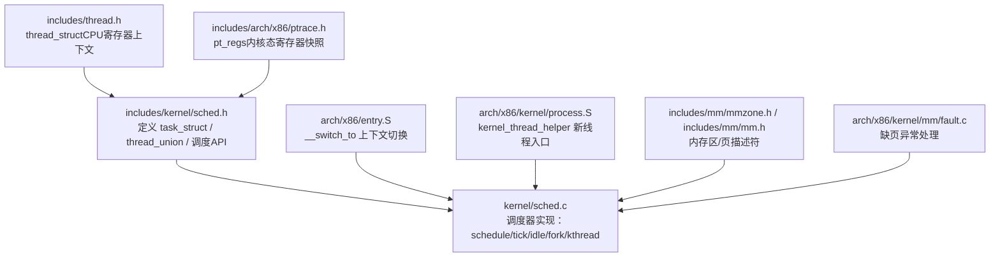
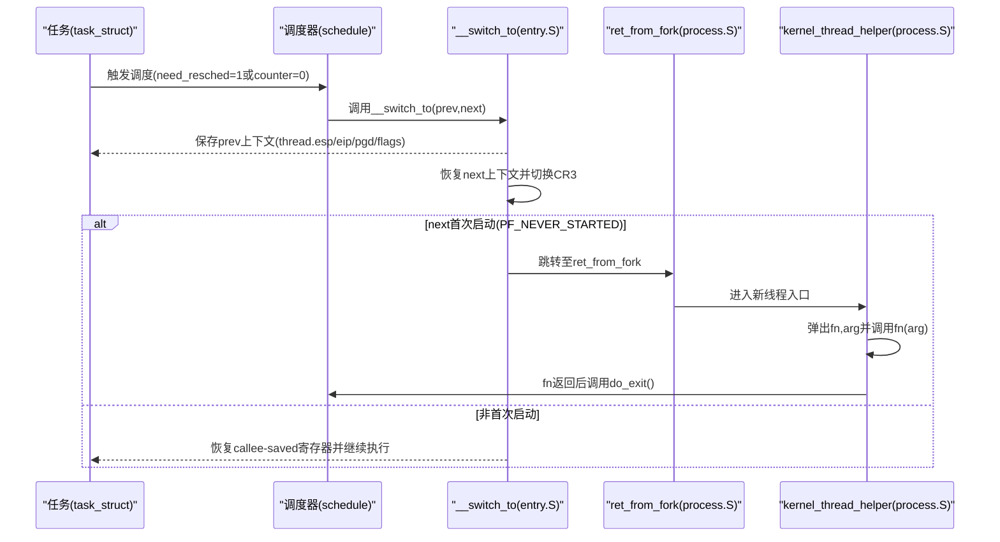
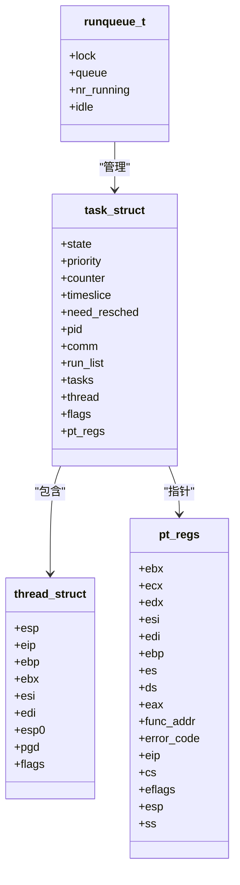
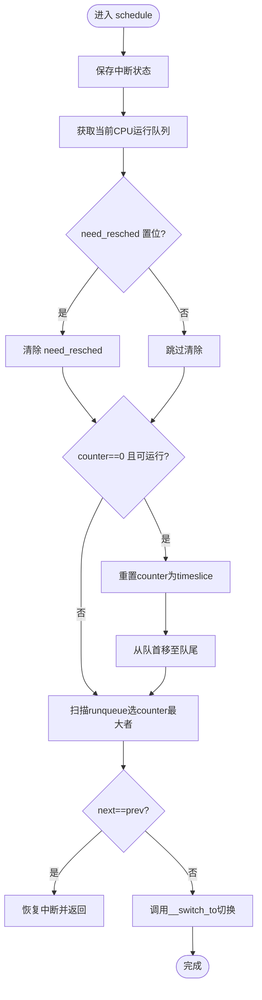

# 进程控制块设计

<cite>
**本文引用的文件**
- [includes/kernel/sched.h](file://includes/kernel/sched.h)
- [kernel/sched.c](file://kernel/sched.c)
- [includes/thread.h](file://includes/thread.h)
- [includes/arch/x86/thread_info.h](file://includes/arch/x86/thread_info.h)
- [includes/arch/x86/ptrace.h](file://includes/arch/x86/ptrace.h)
- [arch/x86/entry.S](file://arch/x86/entry.S)
- [arch/x86/kernel/process.S](file://arch/x86/kernel/process.S)
- [includes/mm/mmzone.h](file://includes/mm/mmzone.h)
- [includes/mm/mm.h](file://includes/mm/mm.h)
- [arch/x86/kernel/mm/fault.c](file://arch/x86/kernel/mm/fault.c)
</cite>

## 目录
1. [简介](#简介)
2. [项目结构](#项目结构)
3. [核心组件](#核心组件)
4. [架构总览](#架构总览)
5. [详细组件分析](#详细组件分析)
6. [依赖关系分析](#依赖关系分析)
7. [性能考虑](#性能考虑)
8. [故障排查指南](#故障排查指南)
9. [结论](#结论)
10. [附录](#附录)

## 简介
本设计文档围绕 LulaOS 的进程控制块（task_struct）展开，系统性阐述其字段含义、内存布局与分配策略、线程信息（thread_info）与 THREAD_SIZE 的设计考量、调度与上下文切换机制、生命周期管理（创建、运行、睡眠、退出），以及如何在代码中访问和操作关键域。文档同时给出与实现对应的时序图、类图和流程图，帮助读者从高层到代码级全面理解。

## 项目结构
LulaOS 将进程控制块定义在调度头文件中，并通过 thread_union 将 task_struct 与内核栈合并为固定大小的内存块；调度器实现位于 kernel/sched.c；上下文切换由 arch/x86/entry.S 中的 __switch_to 完成；新线程入口在 arch/x86/kernel/process.S；页表与缺页处理在 arch/x86/kernel/mm/fault.c；内存区与伙伴系统相关类型在 includes/mm/mmzone.h 和 includes/mm/mm.h。

图表来源
- [includes/kernel/sched.h:45-81](file://includes/kernel/sched.h#L45-L81)
- [kernel/sched.c:76-97](file://kernel/sched.c#L76-L97)
- [includes/thread.h:7-17](file://includes/thread.h#L7-L17)
- [includes/arch/x86/ptrace.h:5-23](file://includes/arch/x86/ptrace.h#L5-L23)
- [arch/x86/entry.S:536-581](file://arch/x86/entry.S#L536-L581)
- [arch/x86/kernel/process.S:1-23](file://arch/x86/kernel/process.S#L1-L23)
- [includes/mm/mmzone.h:35-63](file://includes/mm/mmzone.h#L35-L63)
- [includes/mm/mm.h:11-18](file://includes/mm/mm.h#L11-L18)
- [arch/x86/kernel/mm/fault.c:12-42](file://arch/x86/kernel/mm/fault.c#L12-L42)

章节来源
- [includes/kernel/sched.h:1-201](file://includes/kernel/sched.h#L1-L201)
- [kernel/sched.c:1-479](file://kernel/sched.c#L1-L479)

## 核心组件
- task_struct：进程控制块，包含调度状态、优先级、时间片、标识、链表节点、CPU 上下文、标志位与 pt_regs 指针等。
- thread_struct：保存上下文切换所需的 callee-saved 寄存器、返回地址、内核栈顶、页目录基址与 PF_* 标志。
- thread_union：将 task_struct 与内核栈合并到同一 8KB 块，使 current 宏可通过 esp 屏蔽低 13 位直接定位。
- runqueue_t：每 CPU 运行队列，维护可运行任务链表、计数与空闲任务指针。
- 调度 API：sched_init、schedule、scheduler_tick、cpu_idle、sys_fork、kernel_thread、do_exit、interruptible_sleep 等。

章节来源
- [includes/kernel/sched.h:45-89](file://includes/kernel/sched.h#L45-L89)
- [includes/thread.h:7-17](file://includes/thread.h#L7-L17)
- [includes/kernel/sched.h:128-143](file://includes/kernel/sched.h#L128-L143)

## 架构总览
下图展示调度器、进程控制块、上下文切换与新线程入口之间的交互关系。

图表来源
- [kernel/sched.c:136-213](file://kernel/sched.c#L136-L213)
- [arch/x86/entry.S:536-581](file://arch/x86/entry.S#L536-L581)
- [arch/x86/kernel/process.S:1-23](file://arch/x86/kernel/process.S#L1-L23)

## 详细组件分析

### task_struct 字段详解
- state：任务状态，包括 TASK_RUNNING、TASK_INTERRUPTIBLE、TASK_UNINTERRUPTIBLE、TASK_ZOMBIE、TASK_STOPPED。用于调度器选择与唤醒逻辑。
- priority：静态优先级，影响基础时间片大小。
- counter：剩余时间片（tick），每个 tick 递减，为 0 时设置 need_resched。
- timeslice：基础时间片，counter 耗尽时重置为该值。
- need_resched：重调度标志，置位后 schedule() 将被调用。
- pid：进程标识。
- comm：进程名（最多 16 字符）。
- run_list/tasks：分别用于加入 per-CPU 运行队列与全局任务链表。
- thread：CPU 上下文（thread_struct），保存切换所需寄存器与页目录基址等。
- flags：PF_* 标志，如 PF_NEVER_STARTED 表示任务从未被调度过。
- pt_regs：指向内核栈顶保存的寄存器快照（用户态进入内核时的现场）。

章节来源
- [includes/kernel/sched.h:45-67](file://includes/kernel/sched.h#L45-L67)
- [kernel/sched.c:20-26](file://kernel/sched.c#L20-L26)

### thread_struct（CPU 上下文）
- esp：保存的内核栈指针（pushal 之后）。
- eip：返回地址（switch_to 的 ret 弹出目标）。
- ebp/ebx/esi/edi：callee-saved 寄存器。
- esp0：内核栈顶（TSS 兼容，暂保留）。
- pgd：CR3 页目录基地址，用于地址空间切换。
- flags：PF_* 标志位。

章节来源
- [includes/thread.h:7-17](file://includes/thread.h#L7-L17)

### thread_union 与 THREAD_SIZE 设计
- thread_union 将 task_struct 与内核栈合并到同一 8KB 块，task_struct 位于低地址，内核栈在高地址向下增长。
- THREAD_SIZE = 8192，THREAD_MASK = ~0x1FFF，current 通过 esp & THREAD_MASK 直接得到 task_struct 基址，避免额外查找。
- BSP 的 init_task 使用 .data.init_task 节并以 8KB 对齐，确保 current 宏对初始任务有效。

章节来源
- [includes/kernel/sched.h:21-23](file://includes/kernel/sched.h#L21-L23)
- [includes/kernel/sched.h:69-81](file://includes/kernel/sched.h#L69-L81)
- [kernel/sched.c:41-55](file://kernel/sched.c#L41-L55)
- [includes/arch/x86/thread_info.h:4-5](file://includes/arch/x86/thread_info.h#L4-L5)

### 运行队列与调度算法
- runqueue_t：每 CPU 一个，含自旋锁、可运行链表、nr_running 计数与 idle 任务指针。
- 调度策略：静态优先级 + 时间片轮转。每个 tick 递减 counter，counter 为 0 则设置 need_resched；schedule() 遍历 runqueue 选取 counter 最大的 TASK_RUNNING 任务。
- add/del/wake_up：提供加入/移除/唤醒任务的辅助函数，并在 idle 上置 need_resched 以避免饿死。

章节来源
- [includes/kernel/sched.h:83-89](file://includes/kernel/sched.h#L83-L89)
- [includes/kernel/sched.h:147-198](file://includes/kernel/sched.h#L147-L198)
- [kernel/sched.c:136-237](file://kernel/sched.c#L136-L237)

### 上下文切换流程（__switch_to）
- 保存 prev 的 thread.esp/eip/pgd/flags。
- 恢复 next 的 thread.esp，若 next.pgd != 0 则写入 CR3。
- 若 next.flags 含 PF_NEVER_STARTED，跳转到 ret_from_fork 以初始化新任务栈帧。
- 否则恢复 callee-saved 寄存器并返回。

章节来源
- [arch/x86/entry.S:536-581](file://arch/x86/entry.S#L536-L581)

### 新线程入口（kernel_thread_helper）
- 新内核线程首次执行入口，弹栈获取 fn 与 arg，开启中断，调用 fn(arg)，返回后调用 do_exit()。

章节来源
- [arch/x86/kernel/process.S:1-23](file://arch/x86/kernel/process.S#L1-L23)

### 进程创建与内存布局
- sys_fork：分配 8KB 对齐的 thread_union，复制父进程基本字段，重新初始化链表与调度状态，设置子进程内核栈顶与 pt_regs，设置 thread.eip/esp 指向 ret_from_intr，根据 fork_flags 选择目标 CPU 并加入运行队列。
- kernel_thread：类似 fork，但构造初始栈帧为 [fn, arg]，并将 thread.eip 设为 kernel_thread_helper。
- 内存布局：thread_union 低地址为 task_struct，高地址为内核栈；当前任务通过 esp 屏蔽低 13 位定位。

章节来源
- [kernel/sched.c:275-356](file://kernel/sched.c#L275-L356)
- [kernel/sched.c:369-433](file://kernel/sched.c#L369-L433)
- [includes/kernel/sched.h:69-81](file://includes/kernel/sched.h#L69-L81)

### 进程生命周期管理
- 初始化：sched_init 初始化各 CPU 的运行队列，将 init_task 链入全局任务链表。
- 运行：scheduler_tick 在每个 tick 递减 counter，必要时设置 need_resched；cpu_idle 循环等待 need_resched 并调用 schedule。
- 睡眠：interruptible_sleep 将状态改为 TASK_INTERRUPTIBLE 并从运行队列移除，然后调度。
- 退出：do_exit 将状态改为 TASK_ZOMBIE，从运行队列移除，打印日志并调度。

章节来源
- [kernel/sched.c:76-97](file://kernel/sched.c#L76-L97)
- [kernel/sched.c:223-259](file://kernel/sched.c#L223-L259)
- [kernel/sched.c:437-478](file://kernel/sched.c#L437-L478)

### 内存管理与页表关联
- 虽然 task_struct 不直接持有 mm_struct，但 thread_struct.pgd 保存 CR3 页目录基址，用于地址空间切换。
- 缺页异常处理基于两级页表（PGD→PTE），支持按需分页与写时复制。
- 内存区与伙伴系统通过 zone_t/pg_data_t 管理物理页分配。

章节来源
- [includes/thread.h:14-16](file://includes/thread.h#L14-L16)
- [arch/x86/kernel/mm/fault.c:12-42](file://arch/x86/kernel/mm/fault.c#L12-L42)
- [includes/mm/mmzone.h:35-63](file://includes/mm/mmzone.h#L35-L63)
- [includes/mm/mm.h:11-18](file://includes/mm/mm.h#L11-L18)

### 访问与操作示例（路径引用）
- 获取当前任务指针：[includes/kernel/sched.h:93-106](file://includes/kernel/sched.h#L93-L106)
- 将任务加入运行队列：[includes/kernel/sched.h:147-162](file://includes/kernel/sched.h#L147-L162)
- 将任务从运行队列移除：[includes/kernel/sched.h:183-191](file://includes/kernel/sched.h#L183-L191)
- 唤醒任务：[includes/kernel/sched.h:193-198](file://includes/kernel/sched.h#L193-L198)
- 设置任务状态并调度：[kernel/sched.c:437-478](file://kernel/sched.c#L437-L478)
- 创建内核线程：[kernel/sched.c:369-433](file://kernel/sched.c#L369-L433)
- 创建子进程：[kernel/sched.c:275-356](file://kernel/sched.c#L275-L356)

## 依赖关系分析
- task_struct 依赖 thread_struct（CPU 上下文）、list_head（链表）、pt_regs（寄存器快照）。
- 调度器依赖 runqueues[NR_CPUS]、spinlock、APIC timer（通过 scheduler_tick）。
- 上下文切换依赖 entry.S 的 __switch_to 与 process.S 的 kernel_thread_helper。
- 内存子系统通过 mmzone/mm 提供页分配与缺页处理。

图表来源
- [includes/kernel/sched.h:45-89](file://includes/kernel/sched.h#L45-L89)
- [includes/thread.h:7-17](file://includes/thread.h#L7-L17)
- [includes/arch/x86/ptrace.h:5-23](file://includes/arch/x86/ptrace.h#L5-L23)

章节来源
- [includes/kernel/sched.h:45-89](file://includes/kernel/sched.h#L45-L89)
- [includes/thread.h:7-17](file://includes/thread.h#L7-L17)
- [includes/arch/x86/ptrace.h:5-23](file://includes/arch/x86/ptrace.h#L5-L23)

## 性能考虑
- 8KB 对齐的 thread_union 保证 current 宏 O(1) 获取，减少间接寻址开销。
- 静态优先级 + 时间片轮转简单高效，适合嵌入式/教学型内核。
- per-CPU 运行队列降低锁竞争；负载均衡可选 KT_BALANCE 将新任务放置到最空闲 CPU。
- 仅保存 callee-saved 寄存器，减少上下文切换成本。
- 缺页处理按需分配与写时复制，提高内存利用率。

## 故障排查指南
- 任务未运行：检查 need_resched 是否置位、是否在运行队列中、state 是否为 TASK_RUNNING。
- 上下文切换异常：确认 thread.esp/eip 是否正确设置，PF_NEVER_STARTED 标志是否按预期清除。
- 内存错误：查看缺页异常 error_code，区分 PTE 缺失与权限不足；检查 CR3 切换逻辑。
- 调度饥饿：确认 idle 任务的 need_resched 是否被正确置位，避免 idle 永远 hlt。

章节来源
- [kernel/sched.c:136-237](file://kernel/sched.c#L136-L237)
- [arch/x86/entry.S:536-581](file://arch/x86/entry.S#L536-L581)
- [arch/x86/kernel/mm/fault.c:12-42](file://arch/x86/kernel/mm/fault.c#L12-L42)

## 结论
LulaOS 的进程控制块采用简洁高效的 design：task_struct 集中调度与标识信息，thread_struct 保存最小必要上下文，thread_union 将控制块与内核栈合并以实现 O(1) current 定位。调度器基于静态优先级与时间片轮转，配合 per-CPU 运行队列与轻量上下文切换，满足多任务并发需求。内存子系统通过页表与缺页处理支撑虚拟内存与按需分配。整体设计清晰、易于扩展与维护。

## 附录

### 关键流程图：调度决策

图表来源
- [kernel/sched.c:136-213](file://kernel/sched.c#L136-L213)