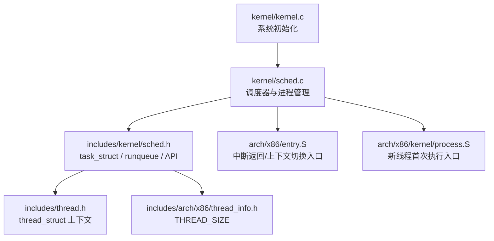
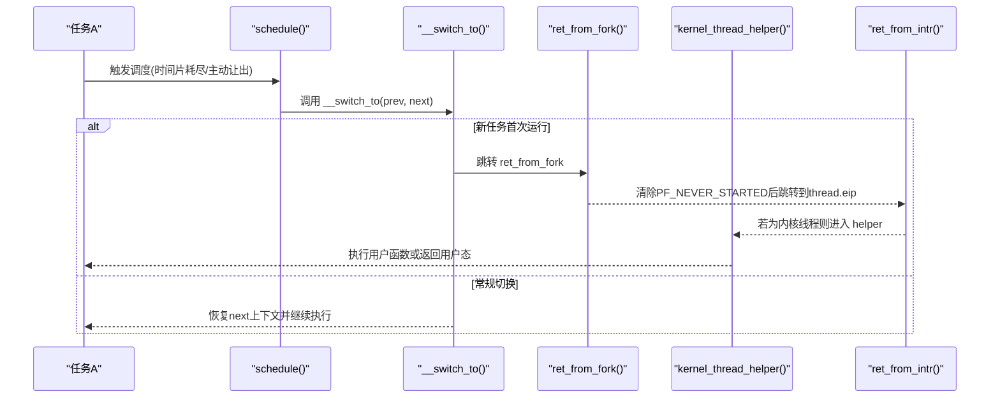
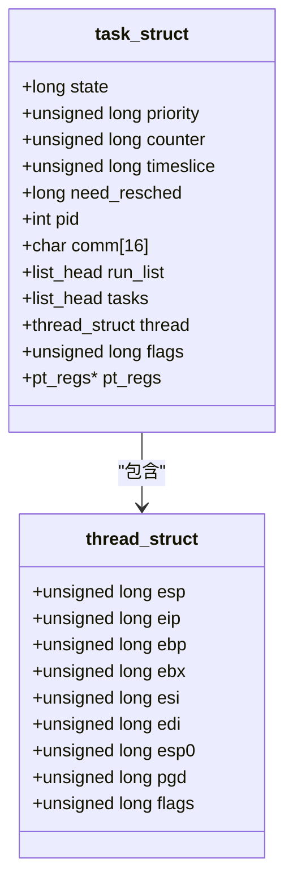
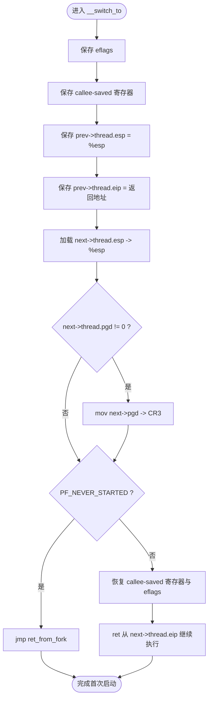
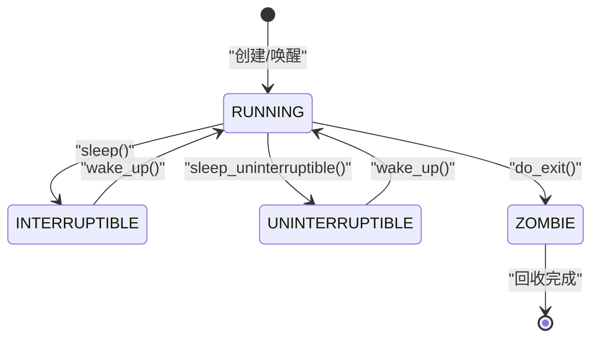
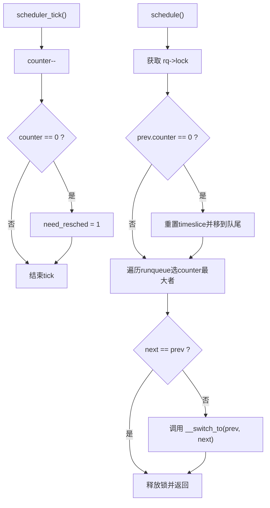
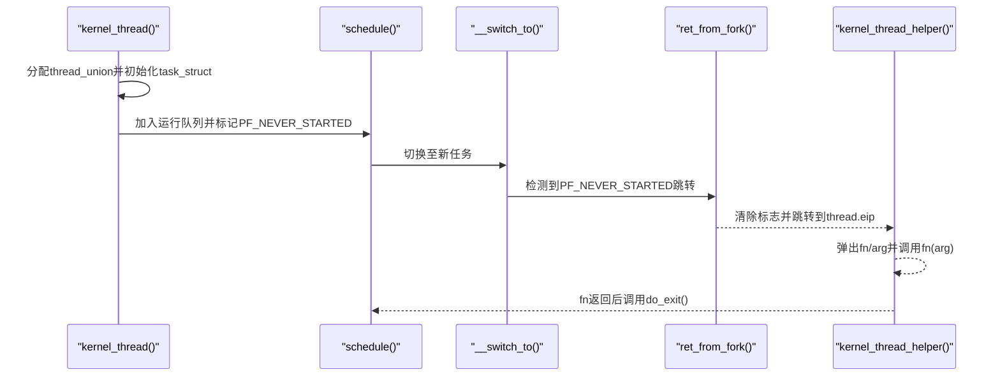
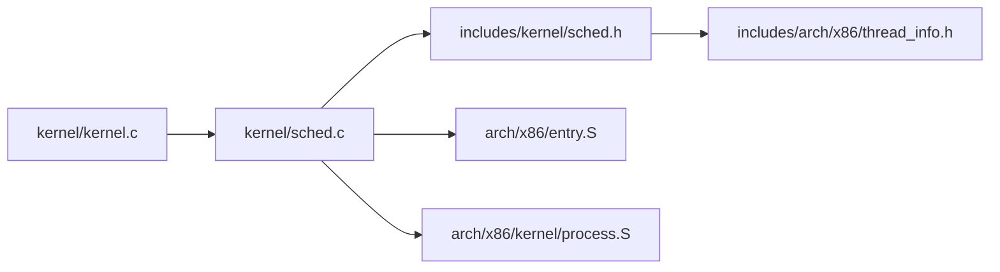

# 进程架构设计

<cite>
**本文引用的文件**
- [includes/kernel/sched.h](file://includes/kernel/sched.h)
- [kernel/sched.c](file://kernel/sched.c)
- [arch/x86/entry.S](file://arch/x86/entry.S)
- [arch/x86/kernel/process.S](file://arch/x86/kernel/process.S)
- [includes/thread.h](file://includes/thread.h)
- [includes/arch/x86/thread_info.h](file://includes/arch/x86/thread_info.h)
- [kernel/kernel.c](file://kernel/kernel.c)
</cite>

## 目录
1. [引言](#引言)
2. [项目结构](#项目结构)
3. [核心组件](#核心组件)
4. [架构总览](#架构总览)
5. [详细组件分析](#详细组件分析)
6. [依赖关系分析](#依赖关系分析)
7. [性能考虑](#性能考虑)
8. [故障排查指南](#故障排查指南)
9. [结论](#结论)
10. [附录](#附录)

## 引言
本文件面向LulaOS进程管理开发者，系统性阐述进程控制块（task_struct）的数据结构与字段含义、上下文切换机制（寄存器保存与恢复、栈切换）、进程状态与生命周期管理、调度器设计与算法实现，并给出进程状态转换图与上下文切换时序图，帮助读者快速掌握内核中进程管理的核心路径。

## 项目结构
LulaOS的进程相关代码分布在以下位置：
- 数据结构与接口定义：includes/kernel/sched.h、includes/thread.h、includes/arch/x86/thread_info.h
- 调度器与进程管理逻辑：kernel/sched.c
- 架构相关入口与上下文切换：arch/x86/entry.S、arch/x86/kernel/process.S
- 系统初始化流程：kernel/kernel.c

**图表来源**
- [kernel/kernel.c:73-141](file://kernel/kernel.c#L73-L141)
- [kernel/sched.c:76-97](file://kernel/sched.c#L76-L97)
- [includes/kernel/sched.h:44-89](file://includes/kernel/sched.h#L44-L89)
- [arch/x86/entry.S:41-58](file://arch/x86/entry.S#L41-L58)
- [arch/x86/kernel/process.S:10-24](file://arch/x86/kernel/process.S#L10-L24)
- [includes/thread.h:7-17](file://includes/thread.h#L7-L17)
- [includes/arch/x86/thread_info.h:4-6](file://includes/arch/x86/thread_info.h#L4-L6)

**章节来源**
- [kernel/kernel.c:73-141](file://kernel/kernel.c#L73-L141)
- [kernel/sched.c:76-97](file://kernel/sched.c#L76-L97)
- [includes/kernel/sched.h:44-89](file://includes/kernel/sched.h#L44-L89)

## 核心组件
- task_struct：进程描述符，包含调度信息、标识、链表节点、CPU上下文、标志位与pt_regs指针等。
- thread_struct：进程切换时保存的CPU寄存器上下文（仅callee-saved寄存器）。
- runqueue_t：每CPU运行队列，维护可运行任务链表与空闲任务指针。
- 调度器API：schedule()、scheduler_tick()、cpu_idle()、sys_fork()、kernel_thread()、do_exit()、interruptible_sleep()等。
- 架构入口：__switch_to()、ret_from_fork()、ret_from_intr()、kernel_thread_helper()等。

**章节来源**
- [includes/kernel/sched.h:44-89](file://includes/kernel/sched.h#L44-L89)
- [includes/thread.h:7-17](file://includes/thread.h#L7-L17)
- [kernel/sched.c:136-213](file://kernel/sched.c#L136-L213)
- [arch/x86/entry.S:490-610](file://arch/x86/entry.S#L490-L610)
- [arch/x86/kernel/process.S:10-24](file://arch/x86/kernel/process.S#L10-L24)

## 架构总览
LulaOS采用“静态优先级 + 时间片轮转”的调度策略：每个tick递减当前任务的counter，耗尽时设置need_resched；schedule()在需要时选择counter最大的TASK_RUNNING任务执行。上下文切换由__switch_to完成，负责保存prev上下文、切换到next的栈、必要时切换CR3页表，并在首次启动新任务时通过ret_from_fork跳转到其入口。

**图表来源**
- [kernel/sched.c:136-213](file://kernel/sched.c#L136-L213)
- [arch/x86/entry.S:520-610](file://arch/x86/entry.S#L520-L610)
- [arch/x86/kernel/process.S:10-24](file://arch/x86/kernel/process.S#L10-L24)

## 详细组件分析

### 进程控制块（task_struct）与上下文结构
- task_struct关键字段：
  - state：进程状态（TASK_RUNNING/TASK_INTERRUPTIBLE/TASK_UNINTERRUPTIBLE/TASK_ZOMBIE/TASK_STOPPED）
  - priority/counter/timeslice/need_resched：调度相关信息
  - pid/comm：进程标识与名称
  - run_list/tasks：运行队列与全局任务链表节点
  - thread：CPU上下文（thread_struct）
  - flags：PF_*标志（如PF_NEVER_STARTED）
  - pt_regs：内核栈顶保存的寄存器快照
- thread_struct关键字段：
  - esp/eip/ebp/ebx/esi/edi：被调用者保存寄存器的上下文
  - esp0：内核栈顶（TSS兼容保留）
  - pgd：CR3页目录基址
  - flags：进程级标志位

**图表来源**
- [includes/kernel/sched.h:44-67](file://includes/kernel/sched.h#L44-L67)
- [includes/thread.h:7-17](file://includes/thread.h#L7-L17)

**章节来源**
- [includes/kernel/sched.h:44-67](file://includes/kernel/sched.h#L44-L67)
- [includes/thread.h:7-17](file://includes/thread.h#L7-L17)

### 上下文切换机制（寄存器保存/恢复与栈切换）
- 保存阶段（prev）：
  - 保存eflags与被调用者保存寄存器到prev->thread对应的栈帧
  - 将当前esp写入prev->thread.esp，返回地址写入prev->thread.eip
- 恢复阶段（next）：
  - 将next->thread.esp加载到%esp，恢复被调用者保存寄存器与eflags
  - 若next->thread.pgd非零，则更新CR3以切换地址空间
  - 若next设置了PF_NEVER_STARTED，则跳转到ret_from_fork进行首次启动处理
- 首次启动（ret_from_fork）：
  - 通过esp & ~0x1FFF定位current，清除PF_NEVER_STARTED
  - 跳转到thread.eip保存的地址（ret_from_intr或kernel_thread_helper）

**图表来源**
- [arch/x86/entry.S:520-610](file://arch/x86/entry.S#L520-L610)

**章节来源**
- [arch/x86/entry.S:520-610](file://arch/x86/entry.S#L520-L610)

### 进程状态管理与生命周期
- 状态定义：
  - TASK_RUNNING：可运行，位于运行队列中
  - TASK_INTERRUPTIBLE：可中断睡眠
  - TASK_UNINTERRUPTIBLE：不可中断睡眠
  - TASK_ZOMBIE：已退出，等待回收
  - TASK_STOPPED：已停止
- 生命周期关键路径：
  - 创建：sys_fork()/kernel_thread()分配thread_union、初始化task_struct、设置初始上下文与状态
  - 运行：scheduler_tick()递减counter，置need_resched；schedule()选择下一个任务
  - 睡眠/唤醒：interruptible_sleep()将状态设为可中断睡眠并从运行队列移除；wake_up_process()恢复为TASK_RUNNING并加入运行队列
  - 退出：do_exit()将状态设为ZOMBIE，从运行队列移除，触发调度

**图表来源**
- [includes/kernel/sched.h:25-30](file://includes/kernel/sched.h#L25-L30)
- [kernel/sched.c:437-478](file://kernel/sched.c#L437-L478)

**章节来源**
- [includes/kernel/sched.h:25-30](file://includes/kernel/sched.h#L25-L30)
- [kernel/sched.c:275-433](file://kernel/sched.c#L275-L433)
- [kernel/sched.c:437-478](file://kernel/sched.c#L437-L478)

### 调度器设计与算法实现
- 调度策略：静态优先级 + 时间片轮转
  - 每个tick调用scheduler_tick()递减当前任务的counter
  - counter=0时设置need_resched，下次schedule()选择counter最大的TASK_RUNNING任务
  - idle任务的counter保持MAX_TIMESLICE，避免被移出队列
- 负载均衡：find_idlest_cpu()扫描在线CPU，选择nr_running最小的CPU
- 运行队列：per-CPU的runqueue_t，使用双向链表维护可运行任务
- 调度入口：schedule()获取rq锁、处理prev的时间片、选择next、调用__switch_to

**图表来源**
- [kernel/sched.c:223-237](file://kernel/sched.c#L223-L237)
- [kernel/sched.c:136-213](file://kernel/sched.c#L136-L213)

**章节来源**
- [kernel/sched.c:136-213](file://kernel/sched.c#L136-L213)
- [kernel/sched.c:223-237](file://kernel/sched.c#L223-L237)

### 新进程/线程的首次执行
- sys_fork()：复制父进程上下文，设置子进程的pt_regs与thread.eip=ret_from_intr，使子进程首次调度时通过RESTORE_ALL+iret返回用户态
- kernel_thread()：构造初始栈帧[fn, arg]，设置thread.eip=kernel_thread_helper，首次调度时进入helper并调用fn(arg)，结束后调用do_exit()
- ret_from_fork()：清除PF_NEVER_STARTED，跳转到thread.eip

**图表来源**
- [kernel/sched.c:369-433](file://kernel/sched.c#L369-L433)
- [arch/x86/entry.S:586-610](file://arch/x86/entry.S#L586-L610)
- [arch/x86/kernel/process.S:10-24](file://arch/x86/kernel/process.S#L10-L24)

**章节来源**
- [kernel/sched.c:369-433](file://kernel/sched.c#L369-L433)
- [arch/x86/entry.S:586-610](file://arch/x86/entry.S#L586-L610)
- [arch/x86/kernel/process.S:10-24](file://arch/x86/kernel/process.S#L10-L24)

## 依赖关系分析
- sched.c依赖sched.h中的task_struct、runqueue_t与API
- entry.S提供中断返回与上下文切换入口，供sched.c调用__switch_to
- process.S提供新线程首次执行入口，供ret_from_fork跳转
- thread_info.h定义THREAD_SIZE，用于current宏与栈对齐
- kernel.c在系统初始化中调用sched_init()并进入cpu_idle()

**图表来源**
- [kernel/sched.c:28-37](file://kernel/sched.c#L28-L37)
- [arch/x86/entry.S:41-58](file://arch/x86/entry.S#L41-L58)
- [arch/x86/kernel/process.S:1-9](file://arch/x86/kernel/process.S#L1-L9)
- [includes/arch/x86/thread_info.h:4-6](file://includes/arch/x86/thread_info.h#L4-L6)
- [kernel/kernel.c:84-89](file://kernel/kernel.c#L84-L89)

**章节来源**
- [kernel/sched.c:28-37](file://kernel/sched.c#L28-L37)
- [kernel/kernel.c:84-89](file://kernel/kernel.c#L84-L89)

## 性能考虑
- 时间片粒度：MIN_TIMESLICE~MAX_TIMESLICE可调，影响响应性与吞吐
- 负载均衡：find_idlest_cpu()减少跨核迁移开销，优先选择当前CPU
- 空闲循环：cpu_idle()使用safe_halt()降低功耗，需确保need_resched正确置位
- 上下文切换：__switch_to仅保存必要寄存器，减少切换开销

[本节为通用指导，不直接分析具体文件]

## 故障排查指南
- 调度不生效：检查scheduler_tick()是否正确递减counter并设置need_resched；确认cpu_idle()内层循环能检测到need_resched
- 新进程无法启动：确认sys_fork()/kernel_thread()正确设置thread.eip与PF_NEVER_STARTED；验证ret_from_fork能清除标志并跳转
- 上下文损坏：检查__switch_to中prev->thread.esp/eip保存与next->thread.esp恢复顺序；确认CR3切换条件
- 栈溢出：确保thread_union大小为THREAD_SIZE且8KB对齐，避免stack越界

**章节来源**
- [kernel/sched.c:223-237](file://kernel/sched.c#L223-L237)
- [kernel/sched.c:250-259](file://kernel/sched.c#L250-L259)
- [arch/x86/entry.S:520-610](file://arch/x86/entry.S#L520-L610)
- [includes/arch/x86/thread_info.h:4-6](file://includes/arch/x86/thread_info.h#L4-L6)

## 结论
LulaOS的进程架构基于简洁高效的调度与上下文切换机制：task_struct集中管理进程状态与上下文，schedule()实现时间片轮转，__switch_to完成寄存器与栈切换，ret_from_fork与kernel_thread_helper协同支持新任务首次执行。该设计易于扩展与维护，适合教学与轻量级操作系统场景。

[本节为总结性内容，不直接分析具体文件]

## 附录
- 关键常量：
  - THREAD_SIZE：8192字节，task_struct与内核栈合并大小
  - MAX_PRIO/DEF_PRIO/MIN_TIMESLICE/MAX_TIMESLICE：调度优先级与时间片范围
  - PF_NEVER_STARTED：新任务首次调度标志
  - KT_BALANCE：新线程创建时的负载均衡标志

**章节来源**
- [includes/arch/x86/thread_info.h:4-6](file://includes/arch/x86/thread_info.h#L4-L6)
- [includes/kernel/sched.h:32-42](file://includes/kernel/sched.h#L32-L42)