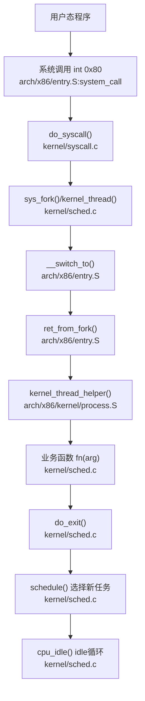
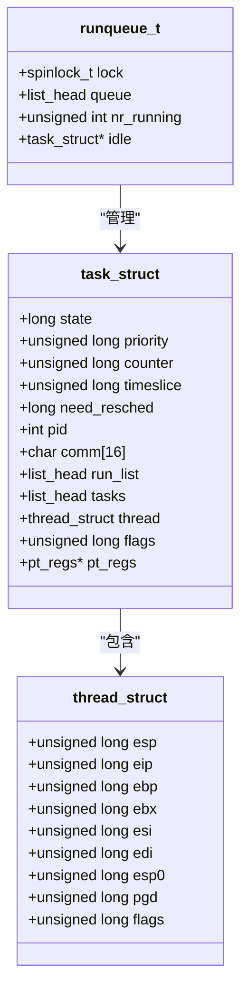
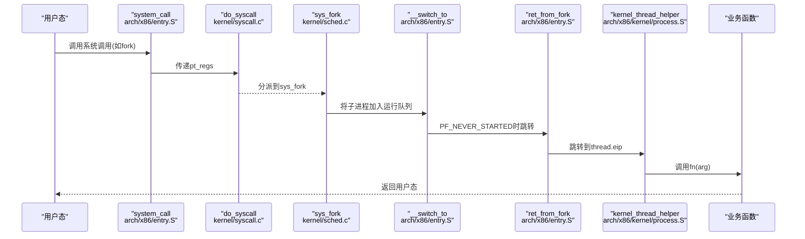
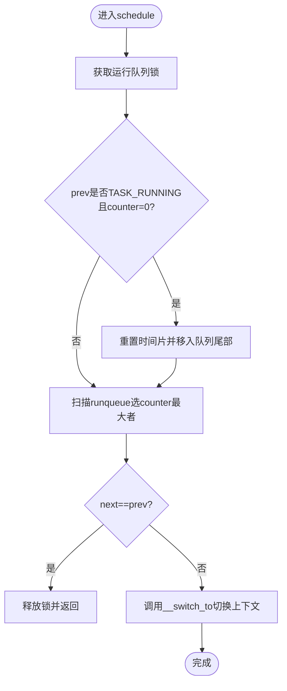
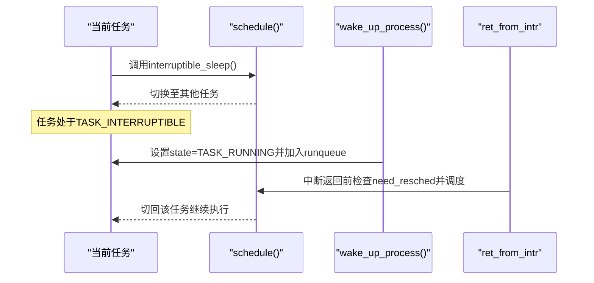
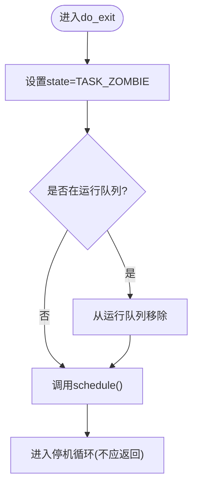
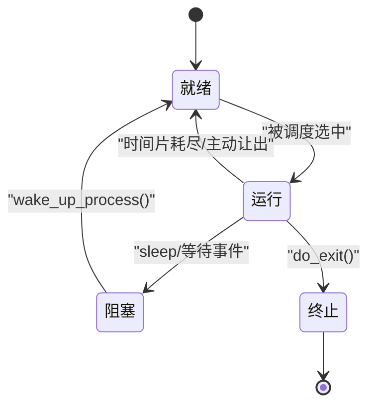
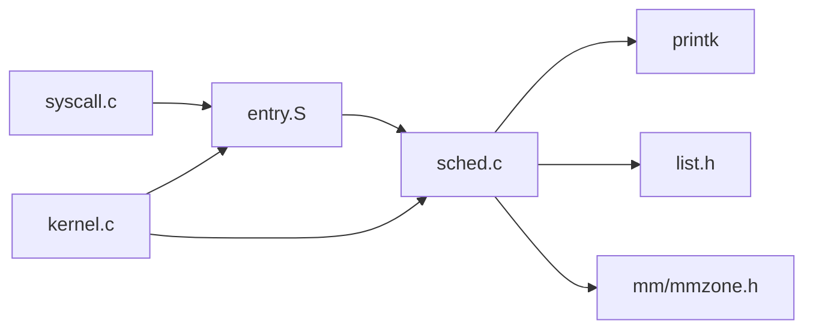
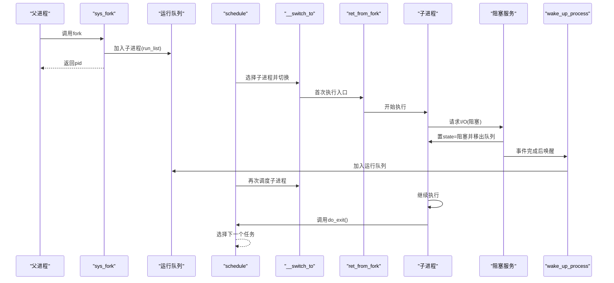

# 进程生命周期管理

<cite>
**本文引用的文件**
- [kernel/sched.c](file://kernel/sched.c)
- [includes/kernel/sched.h](file://includes/kernel/sched.h)
- [arch/x86/entry.S](file://arch/x86/entry.S)
- [arch/x86/kernel/process.S](file://arch/x86/kernel/process.S)
- [kernel/syscall.c](file://kernel/syscall.c)
- [kernel/kernel.c](file://kernel/kernel.c)
- [includes/thread.h](file://includes/thread.h)
</cite>

## 目录
1. [简介](#简介)
2. [项目结构](#项目结构)
3. [核心组件](#核心组件)
4. [架构总览](#架构总览)
5. [详细组件分析](#详细组件分析)
6. [依赖关系分析](#依赖关系分析)
7. [性能考虑](#性能考虑)
8. [故障排查指南](#故障排查指南)
9. [结论](#结论)
10. [附录](#附录)

## 简介
本文件面向LulaOS的进程生命周期管理，系统性说明进程的创建、启动、运行、阻塞与终止等阶段的处理流程；解释就绪态、运行态、阻塞态之间的状态转换条件；描述从fork到exec的系统调用链（当前仓库中fork已实现，exec为扩展点）；总结进程资源管理与清理机制；提供进程状态转换图与生命周期时序图；并给出调试与监控方法。

## 项目结构
围绕进程生命周期，关键代码分布在以下位置：
- 调度器与任务控制块定义：includes/kernel/sched.h、kernel/sched.c
- 上下文切换与首次执行入口：arch/x86/entry.S、arch/x86/kernel/process.S
- 系统调用分发与内置系统调用：kernel/syscall.c
- 内核初始化与idle循环：kernel/kernel.c
- 线程上下文结构体：includes/thread.h

图表来源
- [arch/x86/entry.S:452-486](file://arch/x86/entry.S#L452-L486)
- [kernel/syscall.c:86-98](file://kernel/syscall.c#L86-L98)
- [kernel/sched.c:275-356](file://kernel/sched.c#L275-L356)
- [arch/x86/entry.S:520-610](file://arch/x86/entry.S#L520-L610)
- [arch/x86/kernel/process.S:10-18](file://arch/x86/kernel/process.S#L10-L18)
- [kernel/sched.c:437-462](file://kernel/sched.c#L437-L462)
- [kernel/sched.c:250-259](file://kernel/sched.c#L250-L259)

章节来源
- [kernel/sched.c:1-479](file://kernel/sched.c#L1-L479)
- [includes/kernel/sched.h:1-201](file://includes/kernel/sched.h#L1-L201)
- [arch/x86/entry.S:1-736](file://arch/x86/entry.S#L1-L736)
- [arch/x86/kernel/process.S:1-24](file://arch/x86/kernel/process.S#L1-L24)
- [kernel/syscall.c:1-99](file://kernel/syscall.c#L1-L99)
- [kernel/kernel.c:27-141](file://kernel/kernel.c#L27-L141)
- [includes/thread.h:1-32](file://includes/thread.h#L1-L32)

## 核心组件
- 任务控制块 task_struct：包含状态、优先级、时间片、链表节点、CPU上下文、标志位、pt_regs等。
- 运行队列 runqueue_t：每个CPU一个，维护可运行任务链表、计数与idle指针。
- 调度器 schedule()：基于静态优先级+时间片轮转，扫描runqueue选择counter最大的TASK_RUNNING任务。
- 上下文切换 __switch_to()：保存prev寄存器与返回地址，恢复next寄存器与栈指针，必要时切换CR3。
- 首次执行 ret_from_fork()：清除PF_NEVER_STARTED后跳转到thread.eip。
- 内核线程入口 kernel_thread_helper()：开启中断，弹出fn与arg，调用fn(arg)，结束后调用do_exit()。
- 系统调用分发 do_syscall()：根据eax中的调用号分派到具体处理函数。

章节来源
- [includes/kernel/sched.h:44-89](file://includes/kernel/sched.h#L44-L89)
- [kernel/sched.c:136-213](file://kernel/sched.c#L136-L213)
- [arch/x86/entry.S:520-610](file://arch/x86/entry.S#L520-L610)
- [arch/x86/kernel/process.S:10-18](file://arch/x86/kernel/process.S#L10-L18)
- [kernel/syscall.c:86-98](file://kernel/syscall.c#L86-L98)

## 架构总览
LulaOS采用简化版Linux 2.6风格调度模型：
- 每个CPU拥有独立运行队列，任务通过run_list加入对应队列。
- 调度策略：静态优先级priority决定基础时间片timeslice，tick递减counter，counter=0时设置need_resched并在合适时机触发schedule()。
- 上下文切换在汇编层完成，支持PF_NEVER_STARTED标记以区分“从未被调度过”的新任务。
- 内核线程与用户态子进程均通过统一机制入队并调度。

图表来源
- [includes/kernel/sched.h:44-89](file://includes/kernel/sched.h#L44-L89)
- [includes/thread.h:7-17](file://includes/thread.h#L7-L17)

章节来源
- [includes/kernel/sched.h:1-201](file://includes/kernel/sched.h#L1-L201)
- [includes/thread.h:1-32](file://includes/thread.h#L1-L32)

## 详细组件分析

### 进程创建与启动（fork与内核线程）
- sys_fork(regs, fork_flags)：分配8KB对齐的thread_union，复制父进程基本字段，分配新PID，初始化调度状态，拷贝pt_regs到子进程栈顶，设置thread.eip=ret_from_intr、thread.esp=child_regs，按fork_flags选择目标CPU并加入运行队列，置state=TASK_RUNNING。
- kernel_thread(fn, arg, flags)：类似fork但构造初始栈帧[fn,arg]，设置thread.eip=kernel_thread_helper，首次调度时进入kernel_thread_helper并调用fn(arg)。
- 首次执行路径：__switch_to检测到PF_NEVER_STARTED则跳转ret_from_fork，清除标志后跳转到thread.eip。

图表来源
- [arch/x86/entry.S:452-486](file://arch/x86/entry.S#L452-L486)
- [kernel/syscall.c:86-98](file://kernel/syscall.c#L86-L98)
- [kernel/sched.c:275-356](file://kernel/sched.c#L275-L356)
- [arch/x86/entry.S:520-610](file://arch/x86/entry.S#L520-L610)
- [arch/x86/kernel/process.S:10-18](file://arch/x86/kernel/process.S#L10-L18)

章节来源
- [kernel/sched.c:275-433](file://kernel/sched.c#L275-L433)
- [arch/x86/entry.S:520-610](file://arch/x86/entry.S#L520-L610)
- [arch/x86/kernel/process.S:10-18](file://arch/x86/kernel/process.S#L10-L18)

### 运行与调度（时间片与抢占）
- scheduler_tick()：APIC Timer每次触发时递减当前任务的counter，若counter=0则设置need_resched。
- schedule()：获取当前CPU运行队列锁，若prev仍为TASK_RUNNING且counter=0则重置时间片并移到队列尾部；扫描runqueue选择counter最大的TASK_RUNNING任务；若next==prev直接返回；否则调用__switch_to进行上下文切换。
- cpu_idle()：空闲循环等待need_resched置位，然后调用schedule()切换到其他任务。

图表来源
- [kernel/sched.c:136-213](file://kernel/sched.c#L136-L213)
- [kernel/sched.c:223-237](file://kernel/sched.c#L223-L237)
- [kernel/sched.c:250-259](file://kernel/sched.c#L250-L259)

章节来源
- [kernel/sched.c:136-259](file://kernel/sched.c#L136-L259)

### 阻塞与唤醒（睡眠与中断驱动）
- interruptible_sleep()：将当前任务状态置为TASK_INTERRUPTIBLE并从运行队列移除，随后调用schedule()让出CPU。
- wake_up_process(p)：将p的状态置为TASK_RUNNING并加入当前CPU的运行队列尾部；若当前CPU正在idle，会设置idle->need_resched以唤醒调度。
- 中断返回前检查need_resched：ret_from_intr在返回用户态前检查need_resched，若置位则调用schedule()。

图表来源
- [kernel/sched.c:464-478](file://kernel/sched.c#L464-L478)
- [includes/kernel/sched.h:194-198](file://includes/kernel/sched.h#L194-L198)
- [arch/x86/entry.S:41-58](file://arch/x86/entry.S#L41-L58)

章节来源
- [kernel/sched.c:464-478](file://kernel/sched.c#L464-L478)
- [includes/kernel/sched.h:194-198](file://includes/kernel/sched.h#L194-L198)
- [arch/x86/entry.S:41-58](file://arch/x86/entry.S#L41-L58)

### 终止与回收（退出流程）
- do_exit(code)：将当前任务状态置为TASK_ZOMBIE，若仍在运行队列则移除，打印退出信息，调用schedule()让出CPU，之后进入停机循环。
- 当前sys_exit占位实现仅打印并hlt，未接入完整回收逻辑；实际回收应在父进程或init进程中遍历task_list清理ZOMBIE任务。

图表来源
- [kernel/sched.c:437-462](file://kernel/sched.c#L437-L462)

章节来源
- [kernel/sched.c:437-462](file://kernel/sched.c#L437-L462)

### 进程状态转换机制
- 状态常量：TASK_RUNNING、TASK_INTERRUPTIBLE、TASK_UNINTERRUPTIBLE、TASK_ZOMBIE、TASK_STOPPED。
- 转换条件：
  - 就绪→运行：被schedule()选中并成功切换上下文。
  - 运行→就绪：时间片耗尽(counter=0)或被主动让出（如sleep）。
  - 运行→阻塞：调用interruptible_sleep()或不可中断睡眠（当前实现可见TASK_UNINTERRUPTIBLE用于创建初期临时状态）。
  - 阻塞→就绪：被wake_up_process()唤醒。
  - 运行→终止：调用do_exit()置为ZOMBIE并让出CPU。

图表来源
- [includes/kernel/sched.h:25-30](file://includes/kernel/sched.h#L25-L30)
- [kernel/sched.c:163-180](file://kernel/sched.c#L163-L180)
- [kernel/sched.c:464-478](file://kernel/sched.c#L464-L478)
- [kernel/sched.c:437-462](file://kernel/sched.c#L437-L462)

章节来源
- [includes/kernel/sched.h:25-30](file://includes/kernel/sched.h#L25-L30)
- [kernel/sched.c:163-180](file://kernel/sched.c#L163-L180)
- [kernel/sched.c:437-478](file://kernel/sched.c#L437-L478)

### 进程初始化与系统调用链（fork到exec）
- 当前仓库已实现fork与内核线程创建；exec尚未实现，可作为扩展点：
  - 在sys_execve中加载可执行文件，建立新的页表与用户态栈，设置thread.eip为用户程序入口，thread.esp为用户栈顶，并将任务状态置为TASK_RUNNING加入运行队列。
  - 由于当前sys_fork未复制地址空间（pgd=0），exec需负责为新进程建立独立的页表映射。

章节来源
- [kernel/sched.c:275-356](file://kernel/sched.c#L275-L356)
- [kernel/syscall.c:86-98](file://kernel/syscall.c#L86-L98)

### 资源管理与清理
- 内存分配：fork与内核线程使用kmalloc(THREAD_SIZE)分配8KB对齐的thread_union，确保current宏在新任务中有效。
- 链表管理：全局task_list用于调试与遍历；每个任务通过tasks节点加入。
- 运行队列：add_task_to_runqueue/add_task_to_cpu将任务加入指定CPU的runqueue；del_task_from_runqueue移除任务。
- 清理机制：do_exit将任务置为ZOMBIE并移除运行队列；后续应由父进程或init遍历task_list释放thread_union等资源（当前仓库未实现完整回收）。

章节来源
- [kernel/sched.c:275-356](file://kernel/sched.c#L275-L356)
- [kernel/sched.c:437-462](file://kernel/sched.c#L437-L462)
- [includes/kernel/sched.h:147-198](file://includes/kernel/sched.h#L147-L198)

## 依赖关系分析
- sched.c依赖：printk、list、memcpy、spinlock、page、mmzone、slab、atomic等。
- entry.S依赖：linkage、segment，以及C侧符号schedule、ret_from_intr、do_syscall等。
- syscall.c依赖：interrupts、ptrace、printk、string。
- kernel.c依赖：各子系统初始化顺序（GDT、IDT、中断、调度、内存、设备、DRM等），最终进入cpu_idle。

图表来源
- [kernel/sched.c:28-37](file://kernel/sched.c#L28-L37)
- [arch/x86/entry.S:1-3](file://arch/x86/entry.S#L1-L3)
- [kernel/syscall.c:1-4](file://kernel/syscall.c#L1-L4)
- [kernel/kernel.c:1-25](file://kernel/kernel.c#L1-L25)

章节来源
- [kernel/sched.c:28-37](file://kernel/sched.c#L28-L37)
- [arch/x86/entry.S:1-3](file://arch/x86/entry.S#L1-L3)
- [kernel/syscall.c:1-4](file://kernel/syscall.c#L1-L4)
- [kernel/kernel.c:1-25](file://kernel/kernel.c#L1-L25)

## 性能考虑
- 调度开销：schedule()每tick可能触发，需尽量减少临界区长度；当前实现持有rq->lock期间仅做链表操作与counter比较，开销较低。
- 负载均衡：fork与kernel_thread支持KT_BALANCE，将新任务加入最空闲CPU，减少热点负载。
- idle优化：cpu_idle使用safe_halt等待中断，降低功耗；need_resched作为轻量唤醒信号。
- 上下文切换：__switch_to仅在必要时切换CR3，避免不必要的TLB失效。

## 故障排查指南
- 无法调度：检查need_resched是否被正确置位与清位；确认ret_from_intr是否正确调用schedule()。
- 新进程不运行：确认PF_NEVER_STARTED是否被ret_from_fork清除；检查thread.eip与thread.esp是否正确设置。
- 死锁或饥饿：检查runqueue锁使用是否正确；确认时间片分配与counter递减逻辑。
- 退出卡住：确认do_exit后是否调用了schedule()；检查是否有任务仍持有锁或中断被禁用。

章节来源
- [arch/x86/entry.S:41-58](file://arch/x86/entry.S#L41-L58)
- [arch/x86/entry.S:520-610](file://arch/x86/entry.S#L520-L610)
- [kernel/sched.c:136-213](file://kernel/sched.c#L136-L213)
- [kernel/sched.c:437-462](file://kernel/sched.c#L437-L462)

## 结论
LulaOS实现了简洁而有效的进程生命周期管理：通过task_struct与runqueue组织任务，基于静态优先级与时间片轮转进行调度；上下文切换在汇编层高效完成；fork与内核线程创建路径清晰；阻塞与唤醒机制完备；退出流程将任务置为ZOMBIE并让出CPU。未来可扩展exec以支持用户态进程加载，完善资源回收以提升健壮性。

## 附录

### 进程生命周期时序图（创建→运行→阻塞→唤醒→终止）

图表来源
- [kernel/sched.c:275-356](file://kernel/sched.c#L275-L356)
- [kernel/sched.c:464-478](file://kernel/sched.c#L464-L478)
- [kernel/sched.c:437-462](file://kernel/sched.c#L437-L462)
- [arch/x86/entry.S:520-610](file://arch/x86/entry.S#L520-L610)

### 调试与监控方法
- 打印信息：利用printk在关键路径输出pid、cpu、state等信息，便于跟踪调度与创建过程。
- 全局任务链表：通过task_list遍历所有任务，辅助诊断僵尸进程与资源泄漏。
- 运行队列统计：观察nr_running与idle指针变化，评估负载均衡效果。
- 中断与定时器：检查scheduler_tick是否正确递减counter并设置need_resched。

章节来源
- [kernel/sched.c:92-97](file://kernel/sched.c#L92-L97)
- [kernel/sched.c:352-355](file://kernel/sched.c#L352-L355)
- [kernel/sched.c:429-431](file://kernel/sched.c#L429-L431)
- [kernel/sched.c:452-453](file://kernel/sched.c#L452-L453)