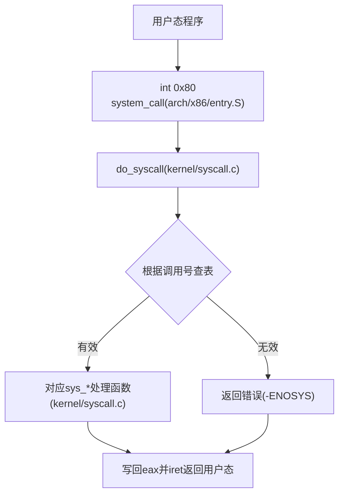
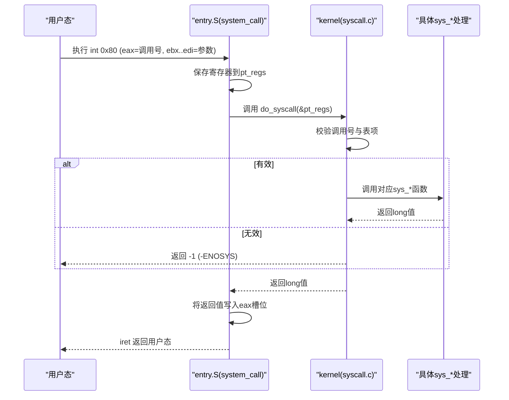
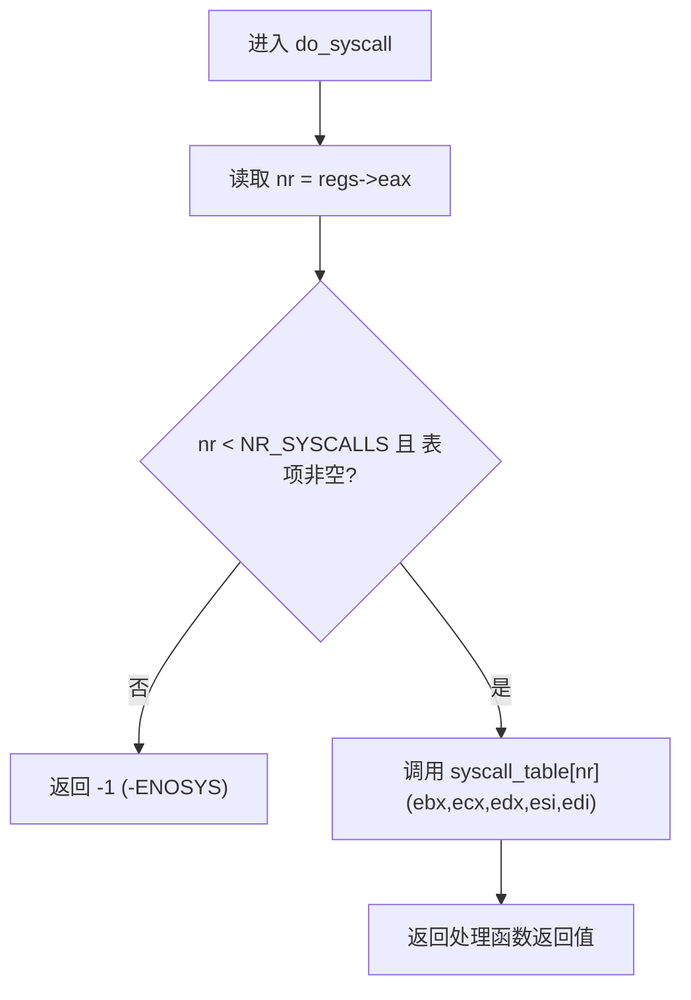
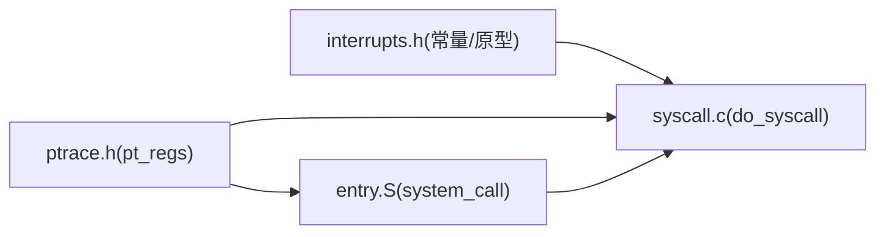

# 系统调用接口

<cite>
**本文引用的文件**
- [kernel/syscall.c](file://kernel/syscall.c)
- [arch/x86/entry.S](file://arch/x86/entry.S)
- [includes/interrupts/interrupts.h](file://includes/interrupts/interrupts.h)
- [includes/arch/x86/ptrace.h](file://includes/arch/x86/ptrace.h)
- [README.md](file://README.md)
</cite>

## 目录
1. [简介](#简介)
2. [项目结构](#项目结构)
3. [核心组件](#核心组件)
4. [架构总览](#架构总览)
5. [详细组件分析](#详细组件分析)
6. [依赖关系分析](#依赖关系分析)
7. [性能考虑](#性能考虑)
8. [故障排查指南](#故障排查指南)
9. [结论](#结论)
10. [附录：API参考与使用指南](#附录api参考与使用指南)

## 简介
本文件面向LulaOS的系统调用接口，系统性说明用户态到内核态的切换机制、参数传递与返回值处理、系统调用表的组织与分发、以及当前已实现的系统调用API。文档同时提供安全与权限方面的注意事项，并为用户态程序开发者给出API使用指南与示例思路。

## 项目结构
围绕系统调用的关键代码分布如下：
- 入口与上下文切换：arch/x86/entry.S 中的 system_call 中断门（int 0x80）负责保存寄存器、切换到内核段、调用 do_syscall，并将返回值写回寄存器后返回用户态。
- 分发与实现：kernel/syscall.c 维护系统调用表，提供 do_syscall 分发器与若干内置系统调用实现（write、exit、getpid），并提供注册接口 register_syscall。
- 常量与类型：includes/interrupts/interrupts.h 定义系统调用号、NR_SYSCALLS、syscall_fn_t 等；includes/arch/x86/ptrace.h 定义 pt_regs 结构体，用于保存/恢复寄存器上下文。

图表来源
- [arch/x86/entry.S:445-486](file://arch/x86/entry.S#L445-L486)
- [kernel/syscall.c:86-98](file://kernel/syscall.c#L86-L98)

章节来源
- [arch/x86/entry.S:445-486](file://arch/x86/entry.S#L445-L486)
- [kernel/syscall.c:1-98](file://kernel/syscall.c#L1-L98)
- [includes/interrupts/interrupts.h:58-76](file://includes/interrupts/interrupts.h#L58-L76)
- [includes/arch/x86/ptrace.h:5-23](file://includes/arch/x86/ptrace.h#L5-L23)

## 核心组件
- 系统调用入口（arch/x86/entry.S）：通过 int 0x80 触发，保存寄存器上下文，设置内核数据段，将 pt_regs 指针传给 do_syscall，并在返回前将结果写入 eax 槽位，最后 iret 回到用户态。
- 系统调用分发器（kernel/syscall.c）：从 regs->eax 读取调用号，校验范围与表项有效性，按表调用相应 sys_* 函数，并将返回值写回。
- 系统调用表与注册（kernel/syscall.c + includes/interrupts/interrupts.h）：静态数组 syscall_table[NR_SYSCALLS]，由 register_syscall 在初始化阶段填充；syscall_init 注册内置调用。
- 寄存器上下文（includes/arch/x86/ptrace.h）：pt_regs 描述进入系统调用时的寄存器布局，entry.S 压栈顺序与恢复顺序与之严格对应。

章节来源
- [arch/x86/entry.S:445-486](file://arch/x86/entry.S#L445-L486)
- [kernel/syscall.c:56-78](file://kernel/syscall.c#L56-L78)
- [kernel/syscall.c:86-98](file://kernel/syscall.c#L86-L98)
- [includes/interrupts/interrupts.h:58-76](file://includes/interrupts/interrupts.h#L58-L76)
- [includes/arch/x86/ptrace.h:5-23](file://includes/arch/x86/ptrace.h#L5-L23)

## 架构总览
下图展示一次完整系统调用从用户态到内核态再返回的时序：

图表来源
- [arch/x86/entry.S:445-486](file://arch/x86/entry.S#L445-L486)
- [kernel/syscall.c:86-98](file://kernel/syscall.c#L86-L98)

## 详细组件分析

### 用户态到内核态切换（int 0x80）
- 触发方式：用户态执行 int 0x80，CPU 自动加载内核CS/SS并跳转到 system_call。
- 上下文保存：entry.S 将 ebx..esi、ebp、es、ds、eax 等依次压栈形成 pt_regs，并设置内核数据段。
- 调用分发：将 pt_regs 指针作为参数传递给 do_syscall。
- 返回值处理：do_syscall 返回后，entry.S 将返回值写入 pt_regs->eax 槽位，然后按相反顺序弹出寄存器并 iret 返回用户态。

章节来源
- [arch/x86/entry.S:445-486](file://arch/x86/entry.S#L445-L486)
- [includes/arch/x86/ptrace.h:5-23](file://includes/arch/x86/ptrace.h#L5-L23)

### 系统调用表与分发机制
- 表结构：静态数组 syscall_table[NR_SYSCALLS]，元素类型为 syscall_fn_t（五参 long 函数指针）。
- 初始化：syscall_init 将表清零，并注册 SYS_WRITE、SYS_EXIT、SYS_GETPID 对应的处理函数。
- 分发流程：do_syscall 从 regs->eax 取调用号，检查是否越界且表项非空，若合法则调用对应处理函数，否则返回 -1。
- 扩展性：新增系统调用只需定义 sys_xxx 并通过 register_syscall 注册到表中。

图表来源
- [kernel/syscall.c:86-98](file://kernel/syscall.c#L86-L98)
- [kernel/syscall.c:56-78](file://kernel/syscall.c#L56-L78)
- [includes/interrupts/interrupts.h:58-76](file://includes/interrupts/interrupts.h#L58-L76)

章节来源
- [kernel/syscall.c:56-78](file://kernel/syscall.c#L56-L78)
- [kernel/syscall.c:86-98](file://kernel/syscall.c#L86-L98)
- [includes/interrupts/interrupts.h:58-76](file://includes/interrupts/interrupts.h#L58-L76)

### 参数传递与返回值约定
- 参数传递：遵循 Linux ABI，调用号在 eax，参数依次在 ebx、ecx、edx、esi、edi。
- 返回值：统一以 long 形式返回，最终写入 regs->eax，用户态从 eax 获取。
- 寄存器上下文：entry.S 压栈顺序与 pt_regs 字段布局一致，确保 do_syscall 能正确访问各寄存器。

章节来源
- [arch/x86/entry.S:445-486](file://arch/x86/entry.S#L445-L486)
- [includes/arch/x86/ptrace.h:5-23](file://includes/arch/x86/ptrace.h#L5-L23)
- [kernel/syscall.c:86-98](file://kernel/syscall.c#L86-L98)

### 已实现的系统调用API
当前内核实现了以下三个系统调用：

- write
  - 原型：long sys_write(long fd, long buf, long count, long d, long e)
  - 行为：忽略 fd，将 buf 指向的用户缓冲区内容逐字符输出到控制台（printk），遇到终止符或达到 count 停止。
  - 参数：fd（忽略）、buf（用户空间缓冲指针）、count（最大字节数）、d/e（忽略）
  - 返回：成功返回写入的字节数；失败返回 -1
  - 参考路径：[kernel/syscall.c:16-25](file://kernel/syscall.c#L16-L25)

- exit
  - 原型：long sys_exit(long code, long b, long c, long d, long e)
  - 行为：打印退出码并停机（cli; hlt），当前无进程管理，直接 halt。
  - 参数：code（退出码），其余忽略
  - 返回：不可达（停机）
  - 参考路径：[kernel/syscall.c:31-38](file://kernel/syscall.c#L31-L38)

- getpid
  - 原型：long sys_getpid(long a, long b, long c, long d, long e)
  - 行为：占位实现，固定返回 PID=1（内核进程）
  - 参数：全部忽略
  - 返回：1
  - 参考路径：[kernel/syscall.c:44-48](file://kernel/syscall.c#L44-L48)

章节来源
- [kernel/syscall.c:16-48](file://kernel/syscall.c#L16-L48)

### 安全与权限考虑
- 当前实现未对用户态传入的指针进行合法性检查（如 write 中直接使用 buf 指针），存在潜在风险。建议在后续版本中加入用户态内存访问检查与拷贝。
- 未实现权限检查（如仅允许特定特权级调用），所有 int 0x80 均被接受。可在 do_syscall 入口处增加特权级校验。
- 对非法调用号的处理返回 -1（-ENOSYS），避免崩溃，但应记录日志以便调试。

章节来源
- [kernel/syscall.c:86-98](file://kernel/syscall.c#L86-L98)

## 依赖关系分析
- entry.S 依赖 pt_regs 布局（ptrace.h）和 do_syscall 符号（interrupts.h 声明）。
- syscall.c 依赖 interrupts.h 提供的常量与函数原型，依赖 ptrace.h 的 pt_regs 结构。
- 系统调用号与表大小由 interrupts.h 集中管理，便于扩展与维护。

图表来源
- [includes/arch/x86/ptrace.h:5-23](file://includes/arch/x86/ptrace.h#L5-L23)
- [includes/interrupts/interrupts.h:58-76](file://includes/interrupts/interrupts.h#L58-L76)
- [arch/x86/entry.S:445-486](file://arch/x86/entry.S#L445-L486)
- [kernel/syscall.c:86-98](file://kernel/syscall.c#L86-L98)

章节来源
- [includes/arch/x86/ptrace.h:5-23](file://includes/arch/x86/ptrace.h#L5-L23)
- [includes/interrupts/interrupts.h:58-76](file://includes/interrupts/interrupts.h#L58-L76)
- [arch/x86/entry.S:445-486](file://arch/x86/entry.S#L445-L486)
- [kernel/syscall.c:86-98](file://kernel/syscall.c#L86-L98)

## 性能考虑
- 系统调用开销主要来自上下文保存/恢复与表查找，当前为 O(1) 表索引，效率较高。
- 建议：
  - 减少不必要的 printk 调用（如 write 逐字符输出），可改为批量输出。
  - 在高频调用路径上避免额外分支与锁操作。
  - 未来可扩展为更高效的调用表（如分段表或哈希表）以降低冲突。

## 故障排查指南
- 现象：调用未实现或调用号越界
  - 表现：返回 -1（-ENOSYS），内核打印“invalid syscall number”
  - 排查：确认调用号是否正确、是否在 NR_SYSCALLS 范围内、是否已通过 register_syscall 注册
  - 参考路径：[kernel/syscall.c:86-98](file://kernel/syscall.c#L86-L98)

- 现象：write 输出异常或崩溃
  - 可能原因：用户态 buf 指针无效或 count 过大
  - 建议：增加用户态指针合法性检查与边界校验
  - 参考路径：[kernel/syscall.c:16-25](file://kernel/syscall.c#L16-L25)

- 现象：exit 导致系统停机
  - 说明：当前实现直接 cli; hlt，属于预期行为
  - 建议：在具备进程管理后，实现进程退出逻辑而非停机
  - 参考路径：[kernel/syscall.c:31-38](file://kernel/syscall.c#L31-L38)

章节来源
- [kernel/syscall.c:16-25](file://kernel/syscall.c#L16-L25)
- [kernel/syscall.c:31-38](file://kernel/syscall.c#L31-L38)
- [kernel/syscall.c:86-98](file://kernel/syscall.c#L86-L98)

## 结论
LulaOS 的系统调用接口基于 int 0x80 实现，采用统一的寄存器 ABI 与 pt_regs 上下文，通过静态表分发到具体 sys_* 处理函数。当前已实现 write、exit、getpid，具备可扩展的注册机制。后续应加强用户态内存访问检查与权限控制，提升安全性与健壮性。

## 附录：API参考与使用指南

### 系统调用号与ABI
- 调用号定义：参见 [includes/interrupts/interrupts.h:58-66](file://includes/interrupts/interrupts.h#L58-L66)
- ABI 约定：
  - eax：系统调用号
  - ebx、ecx、edx、esi、edi：第1至第5个参数
  - 返回值：eax

章节来源
- [includes/interrupts/interrupts.h:58-66](file://includes/interrupts/interrupts.h#L58-L66)

### 已实现API一览
- write(fd, buf, count, d, e)
  - 功能：将 buf 内容输出到控制台
  - 返回：写入字节数或 -1
  - 参考路径：[kernel/syscall.c:16-25](file://kernel/syscall.c#L16-L25)

- exit(code, b, c, d, e)
  - 功能：打印退出码并停机
  - 返回：不可达
  - 参考路径：[kernel/syscall.c:31-38](file://kernel/syscall.c#L31-L38)

- getpid(a, b, c, d, e)
  - 功能：返回固定 PID=1
  - 返回：1
  - 参考路径：[kernel/syscall.c:44-48](file://kernel/syscall.c#L44-L48)

章节来源
- [kernel/syscall.c:16-48](file://kernel/syscall.c#L16-L48)

### 用户态调用示例（思路）
- 步骤：
  1. 将调用号放入 eax，参数依次放入 ebx..edi
  2. 执行 int 0x80
  3. 从 eax 读取返回值
- 注意：
  - 确保用户态缓冲区地址有效且可读
  - 对于 write，需保证字符串以终止符结尾或正确设置 count

章节来源
- [arch/x86/entry.S:445-486](file://arch/x86/entry.S#L445-L486)
- [kernel/syscall.c:16-25](file://kernel/syscall.c#L16-L25)

### 构建与运行
- 环境准备与运行命令请参考项目说明。
- 参考路径：[README.md:77-81](file://README.md#L77-L81)

章节来源
- [README.md:77-81](file://README.md#L77-L81)