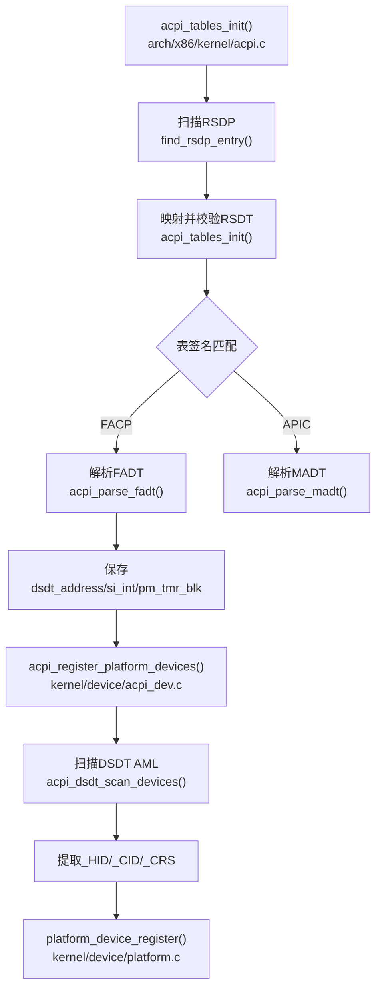
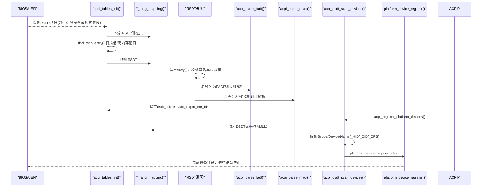
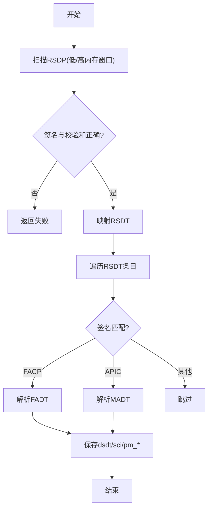
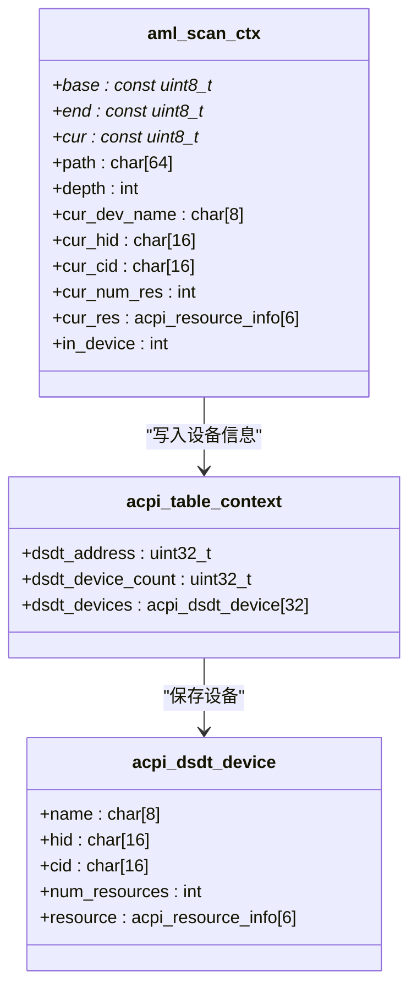
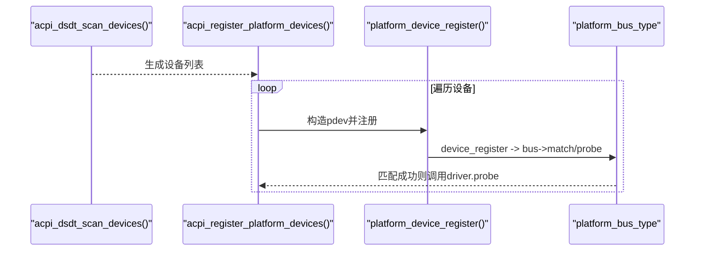
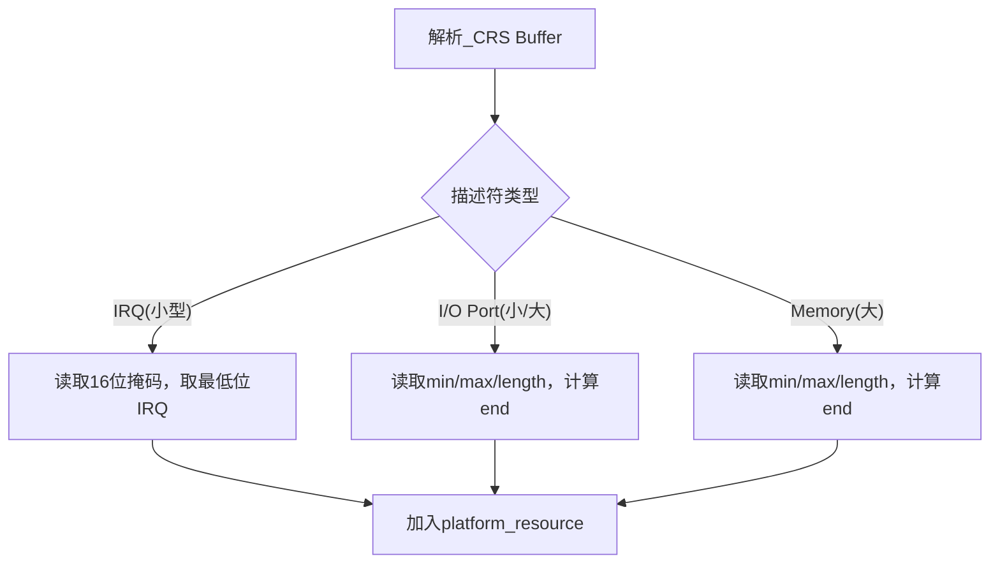
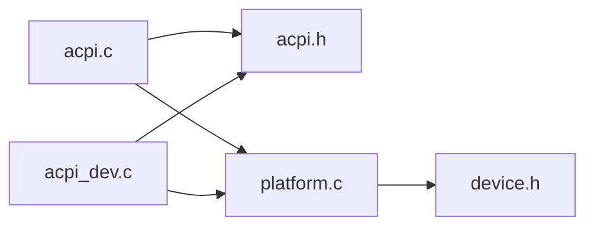

# ACPI设备发现

<cite>
**本文引用的文件**
- [arch/x86/kernel/acpi.c](file://arch/x86/kernel/acpi.c)
- [includes/arch/x86/acpi.h](file://includes/arch/x86/acpi.h)
- [kernel/device/acpi_dev.c](file://kernel/device/acpi_dev.c)
- [kernel/device/platform.c](file://kernel/device/platform.c)
- [includes/device/platform.h](file://includes/device/platform.h)
- [includes/device/device.h](file://includes/device/device.h)
</cite>

## 目录
1. [简介](#简介)
2. [项目结构](#项目结构)
3. [核心组件](#核心组件)
4. [架构总览](#架构总览)
5. [详细组件分析](#详细组件分析)
6. [依赖关系分析](#依赖关系分析)
7. [性能考虑](#性能考虑)
8. [故障排查指南](#故障排查指南)
9. [结论](#结论)
10. [附录](#附录)

## 简介
本文件面向LulaOS的ACPI设备发现机制，系统性说明ACPI表（RSDP、RSDT/XSDT、FADT等）的读取与解析流程，DSDT命名空间中的设备对象（如_SB、_CRS、_STA等）的发现与解析方法，以及ACPI设备到Platform设备的转换过程。同时给出中断与资源映射规则、错误处理与兼容性注意事项，以及与BIOS/UEFI固件交互的关键点。文档力求在保持技术深度的同时，提供清晰的图示和可操作的实践建议。

## 项目结构
与ACPI设备发现相关的代码主要分布在以下位置：
- arch/x86/kernel/acpi.c：ACPI表扫描与解析入口，包含RSDP搜索、RSDT遍历、MADT/FADT解析等。
- includes/arch/x86/acpi.h：ACPI表结构定义、上下文、常量与接口声明。
- kernel/device/acpi_dev.c：DSDT AML最小遍历器，提取_HID/_CID/_CRS并注册为Platform设备。
- kernel/device/platform.c：Platform总线实现，负责设备/驱动匹配与probe转发。
- includes/device/platform.h：Platform设备/驱动/资源结构体定义。
- includes/device/device.h：统一设备模型基础结构（bus_type、device、device_driver）。

图表来源
- [arch/x86/kernel/acpi.c:203-277](file://arch/x86/kernel/acpi.c#L203-L277)
- [kernel/device/acpi_dev.c:749-796](file://kernel/device/acpi_dev.c#L749-L796)
- [kernel/device/platform.c:84-98](file://kernel/device/platform.c#L84-L98)

章节来源
- [arch/x86/kernel/acpi.c:16-91](file://arch/x86/kernel/acpi.c#L16-L91)
- [arch/x86/kernel/acpi.c:203-277](file://arch/x86/kernel/acpi.c#L203-L277)
- [kernel/device/acpi_dev.c:749-796](file://kernel/device/acpi_dev.c#L749-L796)
- [kernel/device/platform.c:14-98](file://kernel/device/platform.c#L14-L98)

## 核心组件
- ACPI表上下文与结构定义：集中管理RSDP/RSDT/FADT/MADT/DSDT相关数据，并提供设备枚举结果存储。
- RSDP扫描与RSDT遍历：在固定内存窗口查找RSDP，校验签名与校验和，读取RSDT条目并分发到对应解析函数。
- FADT解析：获取DSDT物理地址、SCI中断号、PM Timer/Event/Ctrl端口基址等关键信息。
- MADT解析：收集LAPIC、IOAPIC、中断源覆盖等信息，用于中断路由与多核初始化。
- DSDT AML遍历：最小化解析器，仅做只读扫描，提取设备名、HID/CID、CRS资源，不执行Method。
- Platform设备注册：将ACPI发现的设备转换为Platform设备，交由Platform总线进行匹配与探测。

章节来源
- [includes/arch/x86/acpi.h:88-247](file://includes/arch/x86/acpi.h#L88-L247)
- [arch/x86/kernel/acpi.c:62-91](file://arch/x86/kernel/acpi.c#L62-L91)
- [arch/x86/kernel/acpi.c:141-201](file://arch/x86/kernel/acpi.c#L141-L201)
- [kernel/device/acpi_dev.c:22-74](file://kernel/device/acpi_dev.c#L22-L74)
- [kernel/device/acpi_dev.c:334-421](file://kernel/device/acpi_dev.c#L334-L421)
- [kernel/device/acpi_dev.c:749-796](file://kernel/device/acpi_dev.c#L749-L796)

## 架构总览
下图展示了从固件提供的ACPI表到内核中Platform设备注册的完整流程，包括关键函数调用和数据流转。

图表来源
- [arch/x86/kernel/acpi.c:203-277](file://arch/x86/kernel/acpi.c#L203-L277)
- [kernel/device/acpi_dev.c:632-740](file://kernel/device/acpi_dev.c#L632-L740)
- [kernel/device/platform.c:84-98](file://kernel/device/platform.c#L84-L98)

## 详细组件分析

### ACPI表结构与解析流程
- RSDP定位与校验：
  - 在低内存窗口[0x0000,0x0400)和高内存窗口[0xE0000,0xF0000)按步长扫描，匹配签名“RSD PTR ”并校验前20字节之和为0。
  - 成功后获得RSDT地址。
- RSDT遍历：
  - 映射RSDT表头，校验签名“RSDT”，计算条目数，逐项映射表头并校验签名与校验和。
  - 根据签名分派到对应解析函数（当前支持FACP、APIC）。
- FADT解析：
  - 记录FADT物理地址、DSDT物理地址、SCI中断号、PM Timer/Event/Ctrl端口基址。
- MADT解析：
  - 解析LAPIC、IOAPIC、中断源覆盖项，填充上下文数组，便于后续中断路由。

图表来源
- [arch/x86/kernel/acpi.c:62-91](file://arch/x86/kernel/acpi.c#L62-L91)
- [arch/x86/kernel/acpi.c:203-277](file://arch/x86/kernel/acpi.c#L203-L277)
- [arch/x86/kernel/acpi.c:141-201](file://arch/x86/kernel/acpi.c#L141-L201)

章节来源
- [arch/x86/kernel/acpi.c:62-91](file://arch/x86/kernel/acpi.c#L62-L91)
- [arch/x86/kernel/acpi.c:141-201](file://arch/x86/kernel/acpi.c#L141-L201)
- [arch/x86/kernel/acpi.c:203-277](file://arch/x86/kernel/acpi.c#L203-L277)
- [includes/arch/x86/acpi.h:88-193](file://includes/arch/x86/acpi.h#L88-L193)

### DSDT命名空间与设备对象发现
- AML遍历策略：
  - 仅做只读扫描，不执行任何Method，避免副作用。
  - 识别扩展操作码（如Device、Scope），维护路径栈与深度限制。
  - 解析Name对象，提取_HID、_CID、_CRS等属性。
- _HID/_CID解析：
  - 支持字符串形式与EISA ID整数形式（DWORD/WORD/BYTE），将EISA ID解码为“PNPxxxx”格式。
- _CRS资源解析：
  - 解析小型/大型资源描述符，提取I/O端口、Memory范围、IRQ掩码。
  - 将资源转为平台资源结构，供后续驱动使用。
- 设备保存与注册：
  - 将设备名、HID/CID、资源保存到全局上下文，随后转换为Platform设备并注册。

图表来源
- [kernel/device/acpi_dev.c:76-92](file://kernel/device/acpi_dev.c#L76-L92)
- [includes/arch/x86/acpi.h:208-240](file://includes/arch/x86/acpi.h#L208-L240)

章节来源
- [kernel/device/acpi_dev.c:22-74](file://kernel/device/acpi_dev.c#L22-L74)
- [kernel/device/acpi_dev.c:107-143](file://kernel/device/acpi_dev.c#L107-L143)
- [kernel/device/acpi_dev.c:334-421](file://kernel/device/acpi_dev.c#L334-L421)
- [kernel/device/acpi_dev.c:429-628](file://kernel/device/acpi_dev.c#L429-L628)
- [kernel/device/acpi_dev.c:632-740](file://kernel/device/acpi_dev.c#L632-L740)

### ACPI设备到Platform设备的转换
- 转换流程：
  - 扫描完成后，遍历acpi_context.dsdt_devices，过滤无HID的设备。
  - 构造platform_device，设置名称（优先HID）、ID=-1、资源数组。
  - 调用platform_device_register，进入Platform总线匹配流程。
- 资源复制：
  - 将ACPI资源（I/O/MEM/IRQ）复制到platform_resource数组，供驱动查询。

图表来源
- [kernel/device/acpi_dev.c:749-796](file://kernel/device/acpi_dev.c#L749-L796)
- [kernel/device/platform.c:84-98](file://kernel/device/platform.c#L84-L98)

章节来源
- [kernel/device/acpi_dev.c:749-796](file://kernel/device/acpi_dev.c#L749-L796)
- [kernel/device/platform.c:84-98](file://kernel/device/platform.c#L84-L98)

### ACPI中断与资源映射规则
- IRQ映射：
  - 从小型/大型IRQ描述符中提取IRQ掩码，取最低置位位作为设备IRQ。
  - 结合MADT中的IOAPIC global_irq_base，可将GSI映射到具体IOAPIC索引（辅助函数已提供）。
- I/O与Memory资源：
  - 解析I/O端口范围与Memory范围，记录start/end，flags区分类型。
- SCI与PM寄存器：
  - 从FADT获取SCI中断号与PM Timer/Event/Ctrl端口基址，用于系统电源管理与事件处理。

图表来源
- [kernel/device/acpi_dev.c:334-421](file://kernel/device/acpi_dev.c#L334-L421)
- [includes/arch/x86/acpi.h:252-266](file://includes/arch/x86/acpi.h#L252-L266)

章节来源
- [kernel/device/acpi_dev.c:334-421](file://kernel/device/acpi_dev.c#L334-L421)
- [includes/arch/x86/acpi.h:252-266](file://includes/arch/x86/acpi.h#L252-L266)
- [arch/x86/kernel/acpi.c:141-201](file://arch/x86/kernel/acpi.c#L141-L201)

### 与BIOS/UEFI固件的交互方式
- RSDP位于约定内存窗口，由固件放置；内核通过固定窗口扫描定位。
- RSDT/XSDT由固件提供，包含各ACPI表物理地址；内核需校验签名与校验和。
- DSDT由FADT提供物理地址；内核映射后解析AML，但不执行Method，保证安全。
- MADT由固件提供中断拓扑；内核据此建立中断路由。

章节来源
- [arch/x86/kernel/acpi.c:62-91](file://arch/x86/kernel/acpi.c#L62-L91)
- [arch/x86/kernel/acpi.c:203-277](file://arch/x86/kernel/acpi.c#L203-L277)
- [arch/x86/kernel/acpi.c:141-201](file://arch/x86/kernel/acpi.c#L141-L201)

## 依赖关系分析
- 模块耦合：
  - acpi.c依赖acpi.h的结构定义与内存映射工具。
  - acpi_dev.c依赖acpi.h的上下文与平台设备接口。
  - platform.c依赖device.h的统一设备模型。
- 外部依赖：
  - 内存映射工具（fixmap）用于安全访问物理内存。
  - 打印与字符串/内存操作库。

图表来源
- [arch/x86/kernel/acpi.c:1-7](file://arch/x86/kernel/acpi.c#L1-L7)
- [kernel/device/acpi_dev.c:13-20](file://kernel/device/acpi_dev.c#L13-L20)
- [kernel/device/platform.c:9-12](file://kernel/device/platform.c#L9-L12)

章节来源
- [arch/x86/kernel/acpi.c:1-7](file://arch/x86/kernel/acpi.c#L1-L7)
- [kernel/device/acpi_dev.c:13-20](file://kernel/device/acpi_dev.c#L13-L20)
- [kernel/device/platform.c:9-12](file://kernel/device/platform.c#L9-L12)

## 性能考虑
- 只读扫描：DSDT解析不执行Method，避免昂贵的解释开销与潜在副作用。
- 固定容量数组：设备与资源采用静态上限，减少动态分配开销，适合嵌入式环境。
- 分页映射：使用fixmap按需映射ACPI表，避免一次性映射大块内存。
- 早期日志：关键步骤输出日志，便于快速定位问题。

[本节为通用指导，不直接分析具体文件]

## 故障排查指南
- RSDP未找到：
  - 检查固件是否正确放置RSDP到约定窗口；确认扫描窗口与步长配置。
- RSDT签名错误或条目过多：
  - 校验RSDT长度与条目数量，确保不超过预期；必要时增加调试输出。
- DSDT映射失败：
  - 确认FADT中dsdt_address有效；检查fixmap是否可用。
- 设备未注册：
  - 检查设备是否有_HID；确认platform_device.name非空；查看platform总线匹配日志。
- 资源解析异常：
  - 核对_CRS Buffer格式；关注小型/大型描述符边界与长度字段。

章节来源
- [arch/x86/kernel/acpi.c:215-237](file://arch/x86/kernel/acpi.c#L215-L237)
- [kernel/device/acpi_dev.c:632-658](file://kernel/device/acpi_dev.c#L632-L658)
- [kernel/device/platform.c:84-98](file://kernel/device/platform.c#L84-L98)

## 结论
LulaOS的ACPI设备发现机制通过稳健的RSDP/RSDT/FADT/MADT解析与最小化的DSDT AML遍历，实现了从固件表到内核Platform设备的可靠转换。该设计强调安全性（只读扫描）、简洁性（静态资源与设备上限）与可观测性（详细日志）。在此基础上，开发者可基于Platform总线编写设备驱动，利用HID/CID进行匹配，并通过平台资源接口访问I/O、Memory与IRQ。

[本节为总结性内容，不直接分析具体文件]

## 附录
- ACPI表结构参考：
  - RSDP、RSDT、FADT、MADT、DSDT等结构定义见头文件。
- 平台设备接口：
  - 设备/驱动注册、资源查询、总线匹配等接口见平台模块。

章节来源
- [includes/arch/x86/acpi.h:88-247](file://includes/arch/x86/acpi.h#L88-L247)
- [includes/device/platform.h:28-81](file://includes/device/platform.h#L28-L81)
- [includes/device/device.h:32-77](file://includes/device/device.h#L32-L77)