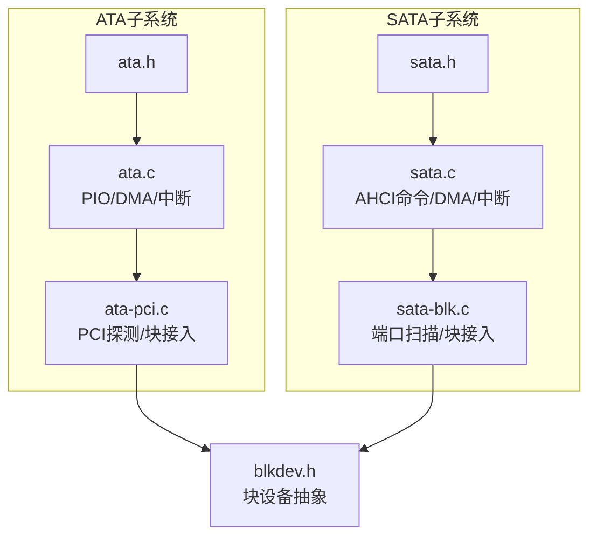
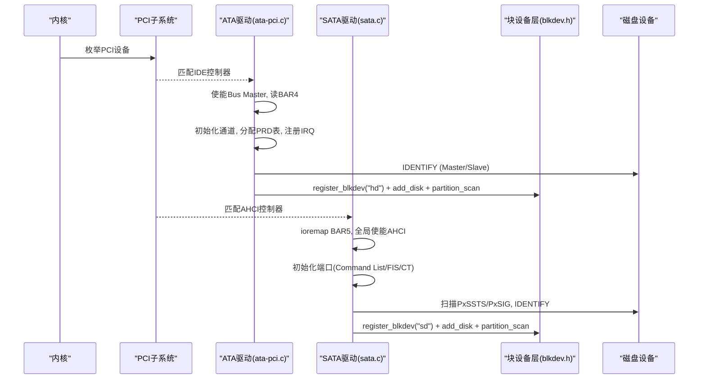
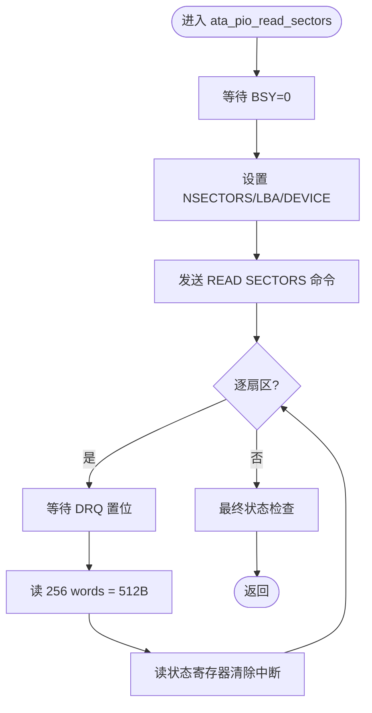
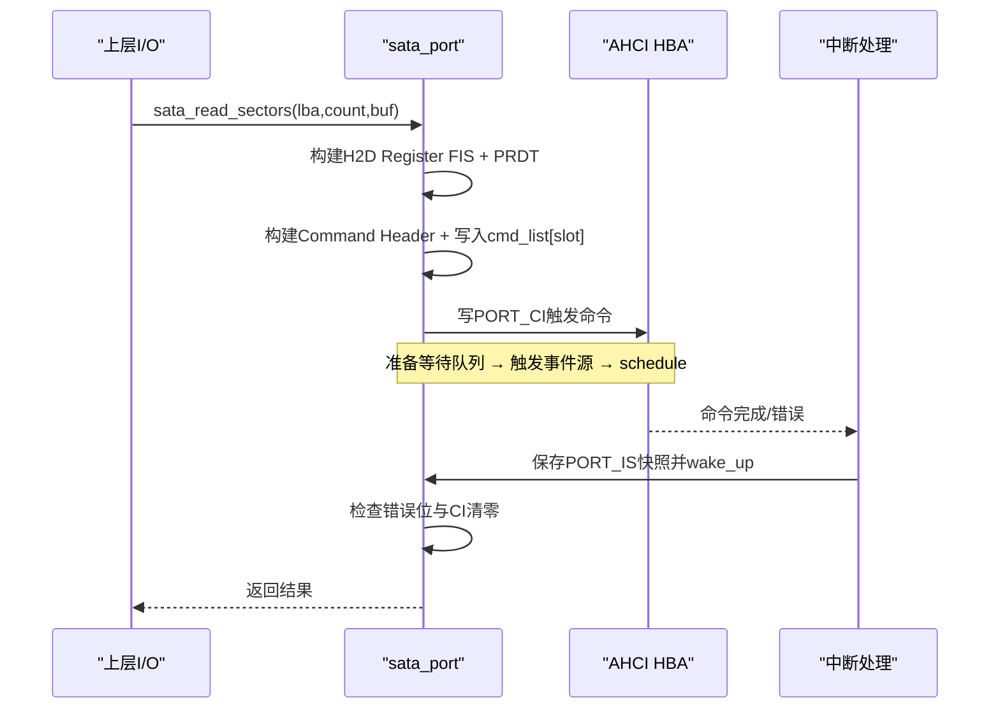
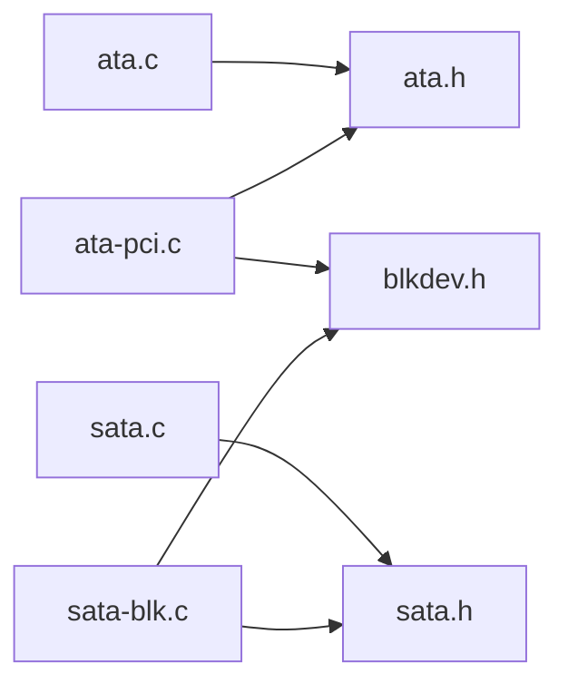
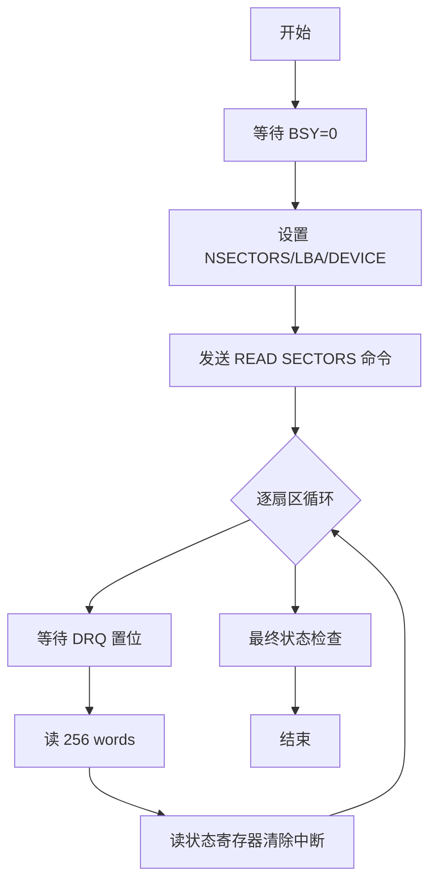
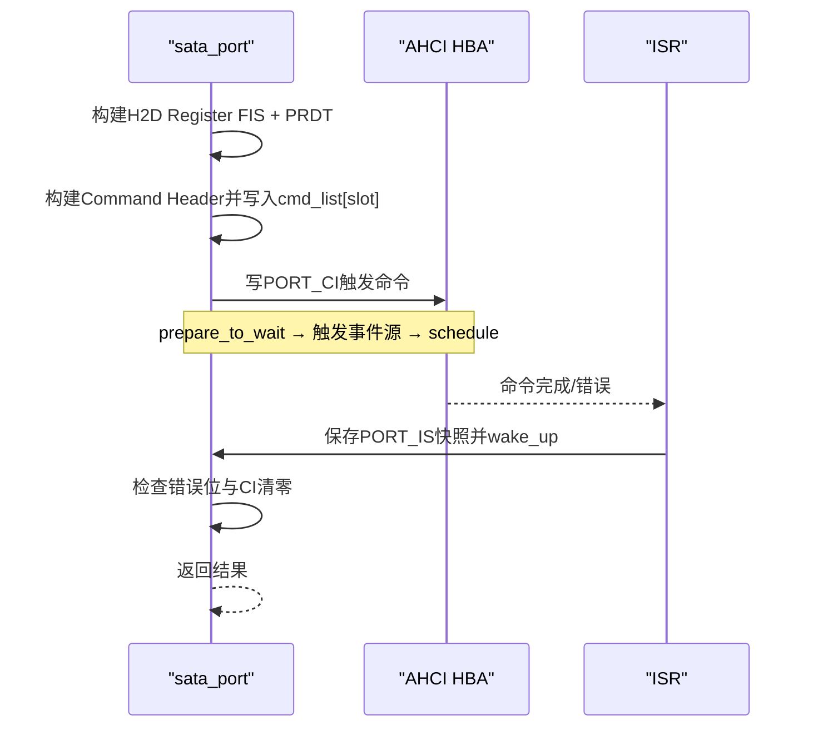

# ATA/SATA存储驱动

<cite>
**本文引用的文件**
- [includes/ata/ata.h](file://includes/ata/ata.h)
- [kernel/ata/ata.c](file://kernel/ata/ata.c)
- [kernel/ata/ata-pci.c](file://kernel/ata/ata-pci.c)
- [includes/sata/sata.h](file://includes/sata/sata.h)
- [kernel/sata/sata.c](file://kernel/sata/sata.c)
- [kernel/sata/sata-blk.c](file://kernel/sata/sata-blk.c)
- [includes/block/blkdev.h](file://includes/block/blkdev.h)
- [README.md](file://README.md)
</cite>

## 目录
1. [简介](#简介)
2. [项目结构](#项目结构)
3. [核心组件](#核心组件)
4. [架构总览](#架构总览)
5. [详细组件分析](#详细组件分析)
6. [依赖关系分析](#依赖关系分析)
7. [性能与限制](#性能与限制)
8. [故障排查指南](#故障排查指南)
9. [结论](#结论)
10. [附录：关键流程图与时序图](#附录关键流程图与时序图)

## 简介
本仓库实现了LulaOS的ATA（IDE）与SATA/AHCI两类存储驱动，提供从PCI探测、设备枚举、数据传输到块设备接入的完整路径。ATA部分支持Legacy I/O端口与Bus Master DMA；SATA部分基于AHCI规范，使用MMIO、命令列表、FIS与PRDT进行DMA传输，并支持LBA48寻址。两者均通过统一的块设备抽象层注册为磁盘设备，并自动解析MBR分区表，暴露整盘与分区视图。

## 项目结构
- ATA驱动
  - 头文件：includes/ata/ata.h（寄存器定义、数据结构、API）
  - 传输层：kernel/ata/ata.c（PIO/DMA读写、IDENTIFY、SET FEATURES、中断处理）
  - 探测与块接入：kernel/ata/ata-pci.c（PCI匹配、通道初始化、设备识别、注册hdX）
- SATA/AHCI驱动
  - 头文件：includes/sata/sata.h（AHCI寄存器、命令结构、端口/控制器描述、API）
  - 传输层：kernel/sata/sata.c（端口控制、命令下发、IDENTIFY、DMA读写、中断）
  - 总线扫描与块接入：kernel/sata/sata-blk.c（端口扫描、设备识别、注册sdX）
- 块设备抽象：includes/block/blkdev.h（gendisk、block_device_operations、submit_bh等）

图表来源
- [includes/ata/ata.h:18-344](file://includes/ata/ata.h#L18-L344)
- [kernel/ata/ata.c:18-30](file://kernel/ata/ata.c#L18-L30)
- [kernel/ata/ata-pci.c:21-45](file://kernel/ata/ata-pci.c#L21-L45)
- [includes/sata/sata.h:29-322](file://includes/sata/sata.h#L29-L322)
- [kernel/sata/sata.c:30-42](file://kernel/sata/sata.c#L30-L42)
- [kernel/sata/sata-blk.c:21-33](file://kernel/sata/sata-blk.c#L21-L33)
- [includes/block/blkdev.h:75-154](file://includes/block/blkdev.h#L75-L154)

章节来源
- [includes/ata/ata.h:18-344](file://includes/ata/ata.h#L18-L344)
- [kernel/ata/ata.c:1-30](file://kernel/ata/ata.c#L1-L30)
- [kernel/ata/ata-pci.c:1-45](file://kernel/ata/ata-pci.c#L1-L45)
- [includes/sata/sata.h:29-322](file://includes/sata/sata.h#L29-L322)
- [kernel/sata/sata.c:1-42](file://kernel/sata/sata.c#L1-L42)
- [kernel/sata/sata-blk.c:1-33](file://kernel/sata/sata-blk.c#L1-L33)
- [includes/block/blkdev.h:75-154](file://includes/block/blkdev.h#L75-L154)

## 核心组件
- ATA传输层（ata.c）
  - PIO读写扇区、DMA读写扇区（Bus Master IDE）、IDENTIFY DEVICE、SET FEATURES设置传输模式、中断完成等待队列
- ATA探测与块接入（ata-pci.c）
  - PCI ID匹配（PIIX3/PIIX4或任意IDE类），使能Bus Master，读取BAR4，初始化通道，枚举Master/Slave，可选MBR自测，注册hdX并解析分区
- SATA传输层（sata.c）
  - AHCI端口启停、Command List/FIS Receive/Command Table分配、H2D Register FIS构建、READ/WRITE DMA EXT、中断驱动等待、IDENTIFY DEVICE
- SATA扫描与块接入（sata-blk.c）
  - 遍历PxSSTS/PxSIG检测在线设备，调用sata_identify填充容量/型号/序列号，注册sdX并解析分区
- 块设备抽象（blkdev.h）
  - gendisk、block_device_operations、register_blkdev/add_disk/partition_scan/submit_bh等接口

章节来源
- [kernel/ata/ata.c:226-693](file://kernel/ata/ata.c#L226-L693)
- [kernel/ata/ata-pci.c:56-154](file://kernel/ata/ata-pci.c#L56-L154)
- [kernel/sata/sata.c:357-627](file://kernel/sata/sata.c#L357-L627)
- [kernel/sata/sata-blk.c:50-130](file://kernel/sata/sata-blk.c#L50-L130)
- [includes/block/blkdev.h:75-154](file://includes/block/blkdev.h#L75-L154)

## 架构总览
系统启动后，块设备子系统初始化，随后分别注册ATA与SATA的PCI驱动。ATA驱动匹配IDE控制器，启用Bus Master并枚举通道上的设备；SATA驱动匹配AHCI控制器，映射BAR5并初始化端口。两者均将设备接入块设备层，形成hdX/sdX节点，并通过partition_scan解析MBR创建分区节点。

图表来源
- [kernel/ata/ata-pci.c:257-371](file://kernel/ata/ata-pci.c#L257-L371)
- [kernel/sata/sata.c:749-800](file://kernel/sata/sata.c#L749-L800)
- [kernel/sata/sata-blk.c:148-210](file://kernel/sata/sata-blk.c#L148-L210)
- [includes/block/blkdev.h:165-195](file://includes/block/blkdev.h#L165-L195)

## 详细组件分析

### ATA传输层（PIO/DMA/中断）
- 功能要点
  - PIO读写：逐扇区等待DRQ，按字读写数据，写后发送CACHE FLUSH
  - DMA读写：构建PRD表，写入BM PRDT寄存器，发送READ/WRITE DMA命令，三段式等待（prepare_to_wait → 启动 → schedule → finish_wait）
  - IDENTIFY：选择驱动器、等待BSY清零、发送命令、读取256 words、解析能力/容量/型号/序列号
  - SET FEATURES：设置MWDMA2传输模式，失败回退PIO
  - 中断：ATA IRQ14/15，检查BM Status INTR位，唤醒等待队列
- 复杂度与限制
  - 单次DMA传输受PRD条目限制（单条目最大64KB）
  - PIO路径CPU参与搬运，延迟较高
  - 错误处理包含超时、ERR位检查与日志输出

图表来源
- [kernel/ata/ata.c:396-465](file://kernel/ata/ata.c#L396-L465)

章节来源
- [kernel/ata/ata.c:226-693](file://kernel/ata/ata.c#L226-L693)

### ATA探测与块接入（ata-pci.c）
- 功能要点
  - PCI ID表匹配PIIX3/PIIX4或任意IDE类
  - 使能I/O空间与Bus Master，读取BAR4作为BM基址
  - 初始化Primary/Secondary通道，分配PRD表，注册IRQ
  - 对每个通道的Master/Slave执行IDENTIFY，尝试SET FEATURES启用MWDMA2
  - 可选MBR读取验证（DMA优先，失败回退PIO）
  - 注册主设备号3（hd），add_disk并partition_scan
- 关键点
  - 防重入：仅绑定第一个IDE控制器
  - DMA能力由设备能力与控制器状态共同决定

章节来源
- [kernel/ata/ata-pci.c:240-371](file://kernel/ata/ata-pci.c#L240-L371)

### SATA传输层（AHCI）
- 功能要点
  - 端口控制：停止/启动顺序（先FRE再ST），清理SERR
  - 内存分配：对齐分配Command List（1024B）、FIS Receive（256B）、Command Table（128B）
  - 命令下发：构建H2D Register FIS，填写PRDT，写入Command Header，触发PORT_CI
  - 中断驱动等待：ISR保存PORT_IS快照并唤醒等待进程
  - IDENTIFY：通过H2D Register FIS获取设备信息，解析LBA28/LBA48容量、型号、序列号
  - DMA读写：READ/WRITE DMA EXT（LBA48），写后追加CACHE FLUSH
- 限制
  - 单PRDT条目最大4MB（DBC为22位）
  - LBA48计数16位（0表示65536扇区），策略层保守拒绝过大请求

图表来源
- [kernel/sata/sata.c:181-226](file://kernel/sata/sata.c#L181-L226)
- [kernel/sata/sata.c:301-332](file://kernel/sata/sata.c#L301-L332)
- [kernel/sata/sata.c:481-542](file://kernel/sata/sata.c#L481-L542)

章节来源
- [kernel/sata/sata.c:357-627](file://kernel/sata/sata.c#L357-L627)

### SATA扫描与块接入（sata-blk.c）
- 功能要点
  - 遍历ports_implemented位图，读取PxSSTS.DET判断设备在线且PHY建立
  - 读取PxSIG区分SATA磁盘与ATAPI光驱
  - 调用sata_identify填充容量/型号/序列号
  - 注册主设备号8（sd），add_disk并partition_scan
- 关键点
  - ATAPI暂不处理，跳过
  - 每端口一块盘，first_minor=port_no*16

章节来源
- [kernel/sata/sata-blk.c:148-210](file://kernel/sata/sata-blk.c#L148-L210)

### 块设备抽象（blkdev.h）
- 关键接口
  - block_device_operations.strategy：同步I/O入口，sector为整盘LBA（分区重映射在块层完成）
  - register_blkdev/add_disk/partition_scan：注册主设备号、创建磁盘、解析MBR分区
  - submit_bh：直接调用strategy，无请求队列（简化实现）
- 设计取舍
  - 无电梯调度与请求队列，便于快速集成文件系统
  - 分区语义透明，驱动无需感知分区存在

章节来源
- [includes/block/blkdev.h:75-154](file://includes/block/blkdev.h#L75-L154)
- [includes/block/blkdev.h:165-195](file://includes/block/blkdev.h#L165-L195)
- [includes/block/blkdev.h:261-282](file://includes/block/blkdev.h#L261-L282)

## 依赖关系分析
- ATA子系统
  - ata.c依赖ata.h（寄存器/结构体）、pci.h（PCI配置访问）、wait.h（等待队列）、interrupts.h（IRQ注册）
  - ata-pci.c依赖ata.h、pci.h、blkdev.h（块设备注册）
- SATA子系统
  - sata.c依赖sata.h、pci.h、highmem.h（ioremap）、interrupts.h、sched.h、wait.h
  - sata-blk.c依赖sata.h、blkdev.h
- 块设备层
  - blkdev.h被ATA与SATA驱动共同引用，提供统一I/O入口

图表来源
- [kernel/ata/ata.c:18-28](file://kernel/ata/ata.c#L18-L28)
- [kernel/ata/ata-pci.c:21-25](file://kernel/ata/ata-pci.c#L21-L25)
- [kernel/sata/sata.c:30-42](file://kernel/sata/sata.c#L30-L42)
- [kernel/sata/sata-blk.c:21-25](file://kernel/sata/sata-blk.c#L21-L25)

章节来源
- [kernel/ata/ata.c:18-28](file://kernel/ata/ata.c#L18-L28)
- [kernel/ata/ata-pci.c:21-25](file://kernel/ata/ata-pci.c#L21-L25)
- [kernel/sata/sata.c:30-42](file://kernel/sata/sata.c#L30-L42)
- [kernel/sata/sata-blk.c:21-25](file://kernel/sata/sata-blk.c#L21-L25)

## 性能与限制
- ATA
  - PIO路径CPU占用高，适合小批量或回退场景
  - Bus Master DMA需BAR4有效且Bus Master使能，单PRD条目最大64KB
  - 传输模式通过SET FEATURES设置为MWDMA2，失败回退PIO
- SATA/AHCI
  - 全路径DMA，单PRDT条目最大4MB，支持LBA48大容量磁盘
  - 中断驱动等待减少忙轮询，提高CPU效率
  - 写操作后强制CACHE FLUSH确保数据持久化
- 通用限制
  - 当前实现未引入请求队列与电梯调度，并发I/O能力有限
  - 分区大小受限于块层与驱动策略（如SATA策略层保守拒绝过大count）

[本节为通用性能讨论，不直接分析具体文件]

## 故障排查指南
- ATA常见问题
  - BSY卡死：检查设备就绪流程与超时逻辑，确认控制器复位与IRQ注册成功
  - DMA失败：确认BAR4有效、Bus Master使能、PRD表物理地址正确、中断注册成功
  - IDENTIFY失败：检查设备类型（ATAPI不支持）、ERR位与签名校验
- SATA常见问题
  - 端口无法启动：确认先FRE再ST顺序，SERR已清零，Command List/FIS/CT分配成功
  - 命令挂起：检查PORT_CI是否清零、ISR是否正确保存PORT_IS并唤醒
  - 传输过大：单PRDT条目上限4MB，需拆分请求
- 块设备问题
  - 注册失败：确认register_blkdev返回值与主设备号可用
  - 分区未出现：确认add_disk后调用partition_scan，MBR签名有效

章节来源
- [kernel/ata/ata.c:143-206](file://kernel/ata/ata.c#L143-L206)
- [kernel/ata/ata.c:557-623](file://kernel/ata/ata.c#L557-L623)
- [kernel/sata/sata.c:94-155](file://kernel/sata/sata.c#L94-L155)
- [kernel/sata/sata.c:181-226](file://kernel/sata/sata.c#L181-L226)
- [kernel/sata/sata-blk.c:92-130](file://kernel/sata/sata-blk.c#L92-L130)

## 结论
LulaOS的ATA与SATA存储驱动提供了完整的硬件发现、设备枚举、数据传输与块设备接入能力。ATA部分兼容传统IDE控制器，支持PIO与Bus Master DMA；SATA部分遵循AHCI规范，采用现代DMA机制与中断驱动模型，支持LBA48大容量磁盘。两者均通过统一的块设备抽象层注册为hdX/sdX设备，并自动解析MBR分区表，便于上层文件系统使用。未来可考虑引入请求队列与电梯调度以提升并发性能，并扩展ATAPI设备支持。

[本节为总结性内容，不直接分析具体文件]

## 附录：关键流程图与时序图

### ATA PIO读取扇区流程

图表来源
- [kernel/ata/ata.c:396-465](file://kernel/ata/ata.c#L396-L465)

### SATA命令下发与中断等待时序

图表来源
- [kernel/sata/sata.c:181-226](file://kernel/sata/sata.c#L181-L226)
- [kernel/sata/sata.c:301-332](file://kernel/sata/sata.c#L301-L332)