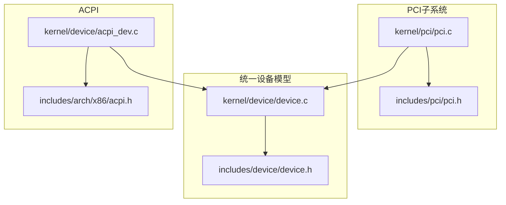
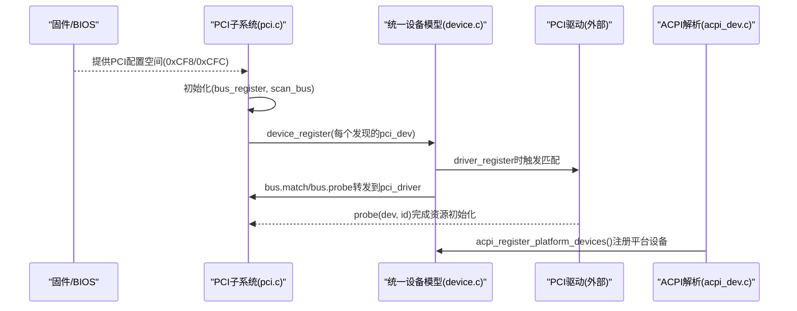
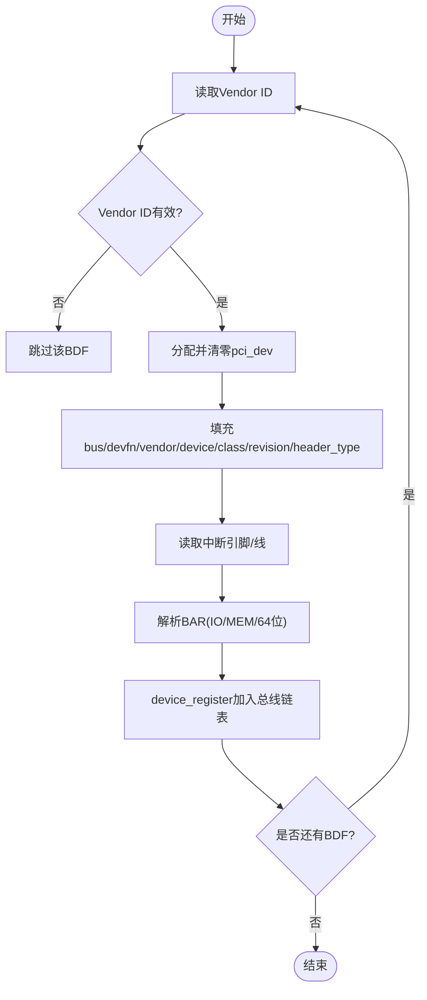
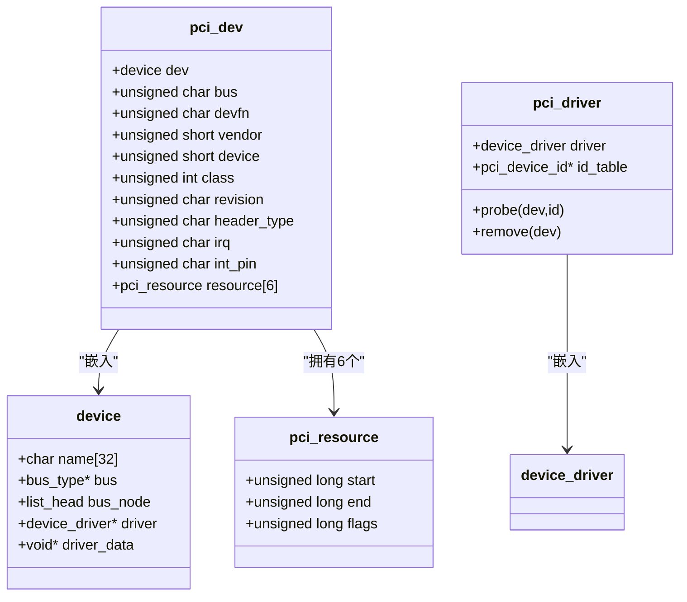
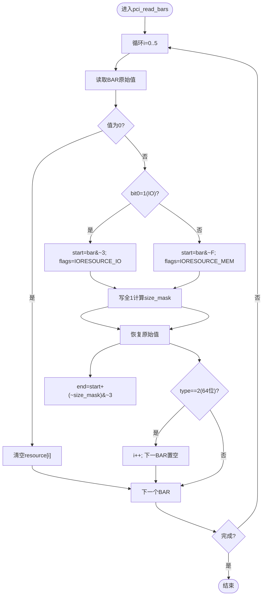
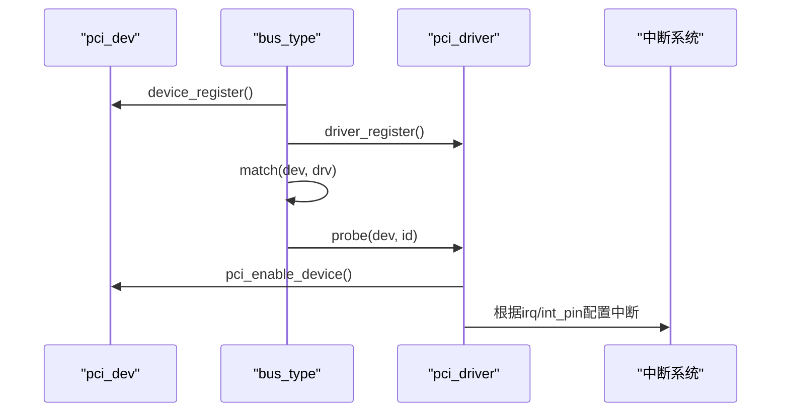
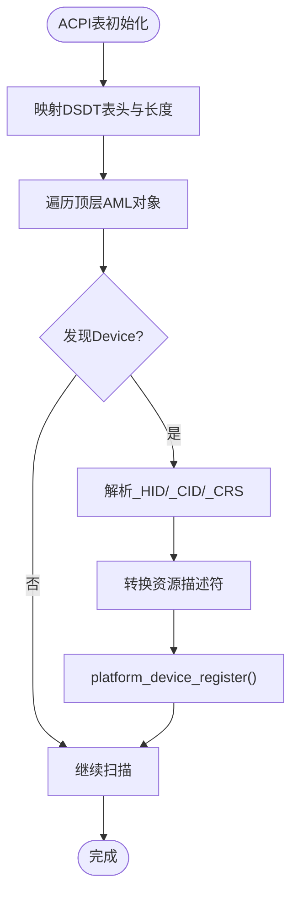
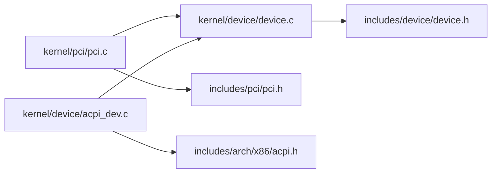

# PCI总线

<cite>
**本文引用的文件**
- [includes/pci/pci.h](file://includes/pci/pci.h)
- [kernel/pci/pci.c](file://kernel/pci/pci.c)
- [includes/device/device.h](file://includes/device/device.h)
- [kernel/device/device.c](file://kernel/device/device.c)
- [includes/arch/x86/acpi.h](file://includes/arch/x86/acpi.h)
- [kernel/device/acpi_dev.c](file://kernel/device/acpi_dev.c)
</cite>

## 目录
1. [简介](#简介)
2. [项目结构](#项目结构)
3. [核心组件](#核心组件)
4. [架构总览](#架构总览)
5. [详细组件分析](#详细组件分析)
6. [依赖关系分析](#依赖关系分析)
7. [性能与实现特性](#性能与实现特性)
8. [故障排查指南](#故障排查指南)
9. [结论](#结论)
10. [附录：PCI驱动开发示例](#附录pcidriver开发示例)

## 简介
本文件为LulaOS的PCI子系统提供完整技术文档，覆盖以下主题：
- PCI总线架构与枚举流程（Bus/Device/Function）
- 配置空间访问机制（Type 1 I/O端口方式）
- pci_dev结构与配置空间映射
- BAR寄存器解析与内存映射I/O资源获取
- 设备识别、资源分配与中断设置
- 电源管理与热插拔现状说明
- 设备分类与厂商ID管理机制
- 与ACPI的集成及DSDT设备描述解析

## 项目结构
LulaOS将PCI子系统独立在kernel/pci与includes/pci下，并通过统一设备模型（bus_type/device/device_driver）进行设备/驱动注册与匹配。ACPI相关能力位于arch/x86与kernel/device中，用于解析DSDT并注册平台设备。

图表来源
- [kernel/pci/pci.c:27-30](file://kernel/pci/pci.c#L27-L30)
- [kernel/device/device.c:22-34](file://kernel/device/device.c#L22-L34)
- [kernel/device/acpi_dev.c:749-796](file://kernel/device/acpi_dev.c#L749-L796)

章节来源
- [includes/pci/pci.h:1-170](file://includes/pci/pci.h#L1-L170)
- [kernel/pci/pci.c:1-512](file://kernel/pci/pci.c#L1-L512)
- [includes/device/device.h:1-80](file://includes/device/device.h#L1-L80)
- [kernel/device/device.c:1-165](file://kernel/device/device.c#L1-L165)
- [includes/arch/x86/acpi.h:1-268](file://includes/arch/x86/acpi.h#L1-L268)
- [kernel/device/acpi_dev.c:1-797](file://kernel/device/acpi_dev.c#L1-L797)

## 核心组件
- 配置空间访问：通过I/O端口0xCF8/0xCFC实现Type 1配置读写，支持32位对齐偏移。
- 设备枚举：从Bus 0开始扫描所有Device/Function，读取Vendor ID判断存在性，处理多功能设备。
- BAR解析：识别IO/MEM类型，计算BAR大小，处理64位BAR的高32位占用下一个BAR。
- 设备查询：按Vendor/Device或Class查找已枚举设备。
- 驱动框架：基于统一设备模型的match/probe/remove回调，支持pci_driver注册与自动绑定。
- ACPI集成：解析DSDT AML，提取_HID/_CID/_CRS，注册为平台设备。

章节来源
- [kernel/pci/pci.c:35-75](file://kernel/pci/pci.c#L35-L75)
- [kernel/pci/pci.c:95-157](file://kernel/pci/pci.c#L95-L157)
- [kernel/pci/pci.c:269-368](file://kernel/pci/pci.c#L269-L368)
- [kernel/pci/pci.c:377-410](file://kernel/pci/pci.c#L377-L410)
- [kernel/pci/pci.c:436-458](file://kernel/pci/pci.c#L436-L458)
- [kernel/device/acpi_dev.c:334-421](file://kernel/device/acpi_dev.c#L334-L421)
- [kernel/device/acpi_dev.c:749-796](file://kernel/device/acpi_dev.c#L749-L796)

## 架构总览
下图展示了PCI子系统与统一设备模型、ACPI之间的交互关系。

图表来源
- [kernel/pci/pci.c:234-241](file://kernel/pci/pci.c#L234-L241)
- [kernel/pci/pci.c:331-368](file://kernel/pci/pci.c#L331-L368)
- [kernel/device/device.c:94-105](file://kernel/device/device.c#L94-L105)
- [kernel/device/device.c:130-139](file://kernel/device/device.c#L130-L139)
- [kernel/device/acpi_dev.c:749-796](file://kernel/device/acpi_dev.c#L749-L796)

## 详细组件分析

### 配置空间访问与枚举流程
- Type 1配置机制：通过CONFIG_ADDRESS(0xCF8)写入包含使能位、总线号、设备号、功能号与寄存器偏移的地址；CONFIG_DATA(0xCFC)读写数据。
- 枚举策略：遍历Bus 0上的32个Device与最多8个Function；对Function 0检查multi-function标志决定是否继续扫描其他Function；同时维护已知多功能设备白名单以兼容模拟器/芯片组。
- 设备发现：读取Vendor ID，若为0xFFFF则视为无设备；否则分配pci_dev并填充标识、类别、修订版本、中断引脚/线、BAR等。

图表来源
- [kernel/pci/pci.c:46-75](file://kernel/pci/pci.c#L46-L75)
- [kernel/pci/pci.c:269-322](file://kernel/pci/pci.c#L269-L322)
- [kernel/pci/pci.c:331-368](file://kernel/pci/pci.c#L331-L368)

章节来源
- [kernel/pci/pci.c:46-75](file://kernel/pci/pci.c#L46-L75)
- [kernel/pci/pci.c:269-368](file://kernel/pci/pci.c#L269-L368)

### pci_dev结构与配置空间映射
- pci_dev嵌入struct device作为首成员，便于统一设备模型管理；包含总线号、设备号、厂商/设备ID、类别码、修订版本、头部类型、中断信息以及6个BAR资源数组。
- 配置空间映射：通过常量定义各寄存器偏移（如Vendor ID、Device ID、Command、Status、BAR0~BAR5、Capability List、Interrupt Line/Pin等），配合pci_config_read32/write32进行访问。

图表来源
- [includes/device/device.h:32-66](file://includes/device/device.h#L32-L66)
- [includes/pci/pci.h:83-138](file://includes/pci/pci.h#L83-L138)

章节来源
- [includes/pci/pci.h:21-46](file://includes/pci/pci.h#L21-L46)
- [includes/pci/pci.h:83-138](file://includes/pci/pci.h#L83-L138)

### BAR寄存器管理与内存映射I/O获取
- BAR类型识别：bit0=1表示IO空间，=0表示内存空间；内存BAR的bits[2:1]指示类型（含64位）。
- 大小计算：向BAR写入全1后读回，得到size mask；根据mask计算end地址；恢复原始值。
- 64位BAR：低32位在当前BAR，高32位在下一个BAR；实现中将下一个BAR标记为空占位。
- 资源标志：使用IORESOURCE_IO与IORESOURCE_MEM区分类型。

图表来源
- [kernel/pci/pci.c:95-157](file://kernel/pci/pci.c#L95-L157)

章节来源
- [kernel/pci/pci.c:95-157](file://kernel/pci/pci.c#L95-L157)

### 设备识别、资源分配与中断设置
- 设备识别：通过Vendor/Device/Class匹配驱动的id_table；支持通配字段（0表示任意）。
- 资源分配：BAR解析后，驱动可在probe中启用设备（开启I/O与MEM响应），并依据BAR范围进行映射或使用。
- 中断设置：读取INTERRUPT_LINE与INTERRUPT_PIN；结合ACPI的MADT/IOAPIC/GSI映射可进一步完成中断路由（当前代码提供GSI到IOAPIC索引查找辅助）。

图表来源
- [kernel/pci/pci.c:166-217](file://kernel/pci/pci.c#L166-L217)
- [kernel/pci/pci.c:419-426](file://kernel/pci/pci.c#L419-L426)
- [includes/arch/x86/acpi.h:252-266](file://includes/arch/x86/acpi.h#L252-L266)

章节来源
- [kernel/pci/pci.c:166-217](file://kernel/pci/pci.c#L166-L217)
- [kernel/pci/pci.c:419-426](file://kernel/pci/pci.c#L419-L426)
- [includes/arch/x86/acpi.h:252-266](file://includes/arch/x86/acpi.h#L252-L266)

### 电源管理与热插拔支持
- 电源管理：当前PCI实现未暴露PM能力接口；可通过扩展命令寄存器位或ACPI FADT中的PM控制块进行后续增强。
- 热插拔：当前枚举为启动时静态扫描，未实现运行时热插拔检测与动态设备添加/移除；可在bus_type.remove基础上扩展事件处理。

章节来源
- [includes/pci/pci.h:56-63](file://includes/pci/pci.h#L56-L63)
- [kernel/pci/pci.c:469-512](file://kernel/pci/pci.c#L469-L512)

### 设备分类与厂商ID管理机制
- 分类：使用class字段（24位）存储基类/子类/编程接口；提供常见类别常量（显示、网络、存储、桥接）。
- 厂商ID：Vendor ID与Device ID用于设备唯一标识；匹配时支持通配。
- 查询API：提供按Vendor/Device或Class的设备查找函数。

章节来源
- [includes/pci/pci.h:65-70](file://includes/pci/pci.h#L65-L70)
- [kernel/pci/pci.c:377-410](file://kernel/pci/pci.c#L377-L410)

### 与ACPI的集成与设备描述解析
- DSDT扫描：最小AML遍历器，解析Scope/Device/Name对象，提取_HID/_CID/_CRS属性。
- 资源转换：将_CRS中的IRQ/I/O/Memory描述符转换为platform_resource，并注册为平台设备。
- GSI到IOAPIC：提供根据GSI查找对应IOAPIC索引的辅助函数，便于中断路由。

图表来源
- [kernel/device/acpi_dev.c:632-740](file://kernel/device/acpi_dev.c#L632-L740)
- [kernel/device/acpi_dev.c:749-796](file://kernel/device/acpi_dev.c#L749-L796)

章节来源
- [includes/arch/x86/acpi.h:88-141](file://includes/arch/x86/acpi.h#L88-L141)
- [includes/arch/x86/acpi.h:208-240](file://includes/arch/x86/acpi.h#L208-L240)
- [kernel/device/acpi_dev.c:334-421](file://kernel/device/acpi_dev.c#L334-L421)
- [kernel/device/acpi_dev.c:749-796](file://kernel/device/acpi_dev.c#L749-L796)

## 依赖关系分析
- PCI子系统依赖统一设备模型进行设备/驱动注册与匹配。
- ACPI模块独立于PCI，但可为PCI设备提供额外资源信息（如中断路由、资源范围）。
- 关键耦合点：bus_type的match/probe/remove回调由PCI实现；设备生命周期由device.c管理。

图表来源
- [kernel/pci/pci.c:234-241](file://kernel/pci/pci.c#L234-L241)
- [kernel/device/device.c:22-34](file://kernel/device/device.c#L22-L34)
- [kernel/device/acpi_dev.c:749-796](file://kernel/device/acpi_dev.c#L749-L796)

章节来源
- [kernel/pci/pci.c:234-241](file://kernel/pci/pci.c#L234-L241)
- [kernel/device/device.c:22-34](file://kernel/device/device.c#L22-L34)
- [kernel/device/acpi_dev.c:749-796](file://kernel/device/acpi_dev.c#L749-L796)

## 性能与实现特性
- 配置空间访问采用I/O端口直接读写，延迟较低，适合内核态高频操作。
- 枚举过程为线性扫描，复杂度O(Bus×Device×Function)，在当前单总线场景下开销可控。
- BAR解析通过写全1快速计算大小，避免多次试探。
- 驱动匹配为列表遍历，数量较少时性能良好；可扩展为哈希或树形索引优化。

[本节为通用性能讨论，不直接分析具体文件]

## 故障排查指南
- 无法发现设备：检查CONFIG_ADDRESS/CONFIG_DATA端口访问是否正确；确认Bus/Device/Function组合有效；验证Vendor ID非0xFFFF。
- BAR大小为0：确认BAR原始值非0；检查64位BAR处理逻辑；确保写全1后正确恢复原始值。
- 驱动未匹配：核对id_table中的vendor/device/class是否与设备一致；确认driver_register已调用且bus已注册。
- 中断无效：检查INTERRUPT_LINE/PIN读取；结合ACPI的MADT/IOAPIC信息确认GSI映射；必要时调整触发极性与触发模式。

章节来源
- [kernel/pci/pci.c:46-75](file://kernel/pci/pci.c#L46-L75)
- [kernel/pci/pci.c:95-157](file://kernel/pci/pci.c#L95-L157)
- [kernel/pci/pci.c:166-217](file://kernel/pci/pci.c#L166-L217)
- [includes/arch/x86/acpi.h:252-266](file://includes/arch/x86/acpi.h#L252-L266)

## 结论
LulaOS的PCI子系统提供了完整的配置空间访问、设备枚举、BAR解析与驱动匹配框架，并与统一设备模型和ACPI集成良好。当前实现聚焦于启动时静态枚举与基础资源管理，电源管理与热插拔可作为后续扩展方向。通过清晰的pci_dev结构与API，开发者可以便捷地编写PCI驱动并完成设备识别、资源分配与中断设置。

[本节为总结性内容，不直接分析具体文件]

## 附录：PCI驱动开发示例
以下为开发PCI驱动的推荐步骤与要点（基于现有API与数据结构）：
- 定义设备ID表：声明pci_device_id数组，列出支持的vendor/device/class，并以{0}结尾。
- 实现probe/remove回调：在probe中启用设备（pci_enable_device）、读取BAR范围并进行必要的映射或I/O操作；在remove中释放资源。
- 注册驱动：调用pci_register_driver将驱动挂入PCI总线，系统将自动匹配已注册设备并调用probe。
- 中断设置：读取dev->irq与dev->int_pin，结合ACPI的GSI到IOAPIC映射完成中断路由。
- 资源使用：依据BAR的start/end与flags（IORESOURCE_IO/IORESOURCE_MEM）进行I/O或内存访问。

参考路径
- [includes/pci/pci.h:121-138](file://includes/pci/pci.h#L121-L138)
- [kernel/pci/pci.c:166-217](file://kernel/pci/pci.c#L166-L217)
- [kernel/pci/pci.c:419-426](file://kernel/pci/pci.c#L419-L426)
- [includes/arch/x86/acpi.h:252-266](file://includes/arch/x86/acpi.h#L252-L266)