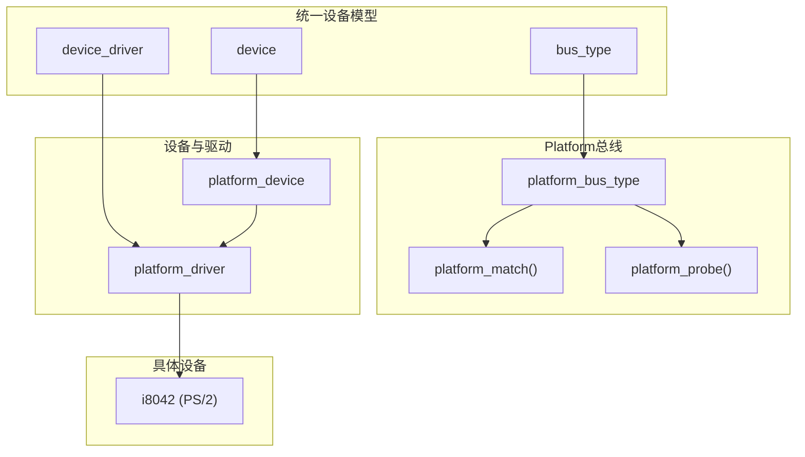
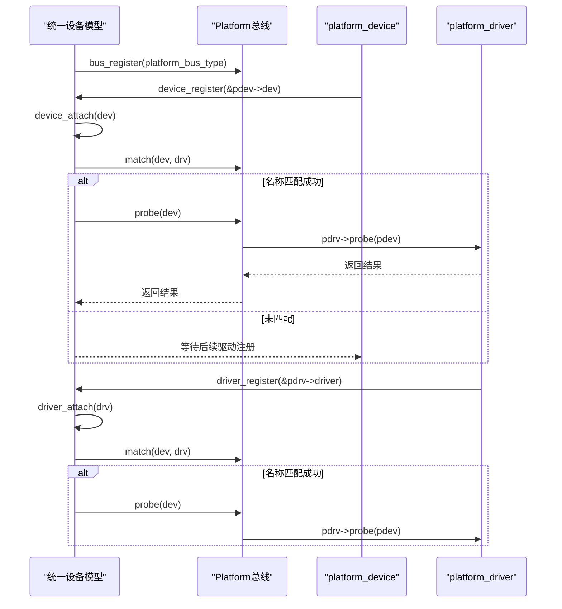
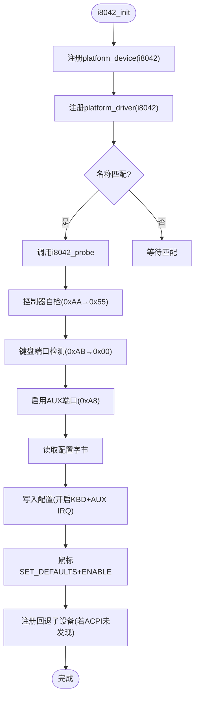
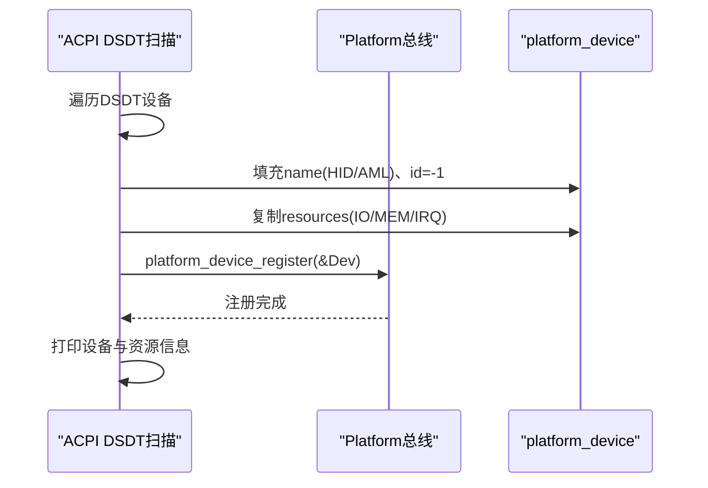
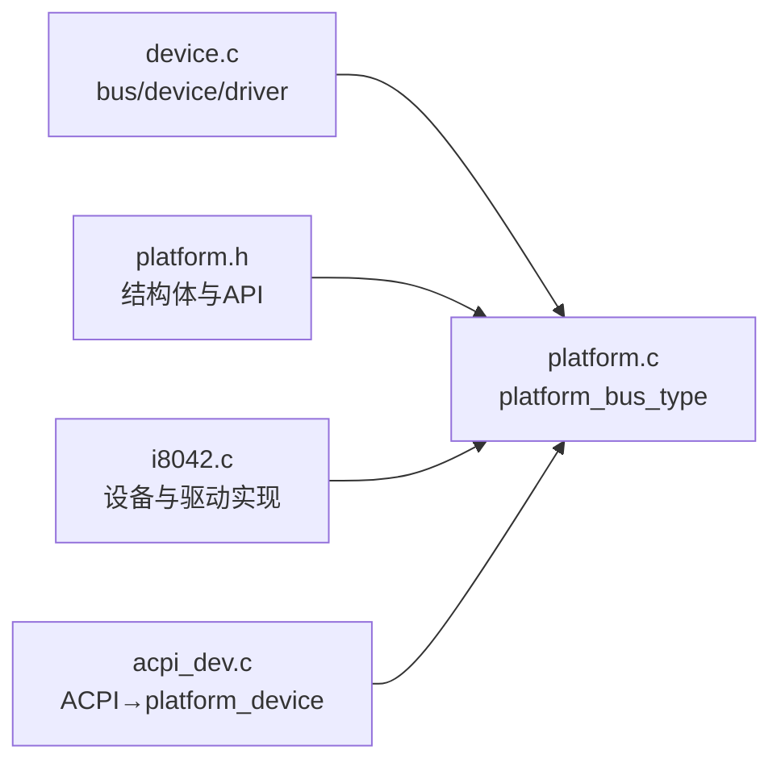

# Platform总线

<cite>
**本文引用的文件**
- [includes/device/platform.h](file://includes/device/platform.h)
- [kernel/device/platform.c](file://kernel/device/platform.c)
- [includes/device/device.h](file://includes/device/device.h)
- [kernel/device/device.c](file://kernel/device/device.c)
- [kernel/i8042.c](file://kernel/i8042.c)
- [kernel/device/acpi_dev.c](file://kernel/device/acpi_dev.c)
</cite>

## 目录
1. [简介](#简介)
2. [项目结构](#项目结构)
3. [核心组件](#核心组件)
4. [架构总览](#架构总览)
5. [详细组件分析](#详细组件分析)
6. [依赖关系分析](#依赖关系分析)
7. [性能考虑](#性能考虑)
8. [故障排查指南](#故障排查指南)
9. [结论](#结论)
10. [附录](#附录)

## 简介
Platform总线用于描述非PCI发现机制的板级设备，例如SoC内部外设（UART、GPIO、Timer）、PS/2控制器、中断控制器以及通过设备树或ACPI描述的固定地址设备。其核心思想是：通过“设备名”与“驱动名”字符串匹配完成绑定，并在probe阶段完成资源获取与硬件初始化。

适用场景
- 固定地址的内存映射I/O设备（MMIO）
- I/O端口设备
- 基于IRQ的中断控制器或外设
- 由设备树或ACPI解析后生成的平台设备

## 项目结构
LulaOS将统一设备模型与Platform总线解耦：
- 统一设备模型提供bus_type、device、device_driver抽象及注册/匹配流程
- Platform总线在统一模型之上实现名称匹配、probe转发和资源访问接口
- 具体设备（如i8042 PS/2控制器）以platform_device和platform_driver形式注册
- ACPI子系统可将DSDT中的设备描述转换为platform_device并注册

图表来源
- [includes/device/device.h:26-66](file://includes/device/device.h#L26-L66)
- [kernel/device/device.c:22-87](file://kernel/device/device.c#L22-L87)
- [includes/device/platform.h:15-83](file://includes/device/platform.h#L15-L83)
- [kernel/device/platform.c:14-77](file://kernel/device/platform.c#L14-L77)

章节来源
- [includes/device/device.h:26-66](file://includes/device/device.h#L26-L66)
- [kernel/device/device.c:22-87](file://kernel/device/device.c#L22-L87)
- [includes/device/platform.h:15-83](file://includes/device/platform.h#L15-L83)
- [kernel/device/platform.c:14-77](file://kernel/device/platform.c#L14-L77)

## 核心组件
- bus_type：总线类型抽象，定义match/probe/remove回调
- device/device_driver：设备与驱动的通用基类
- platform_device/platform_driver：Platform总线下的设备与驱动扩展
- platform_resource：描述MMIO、I/O端口、IRQ等资源
- platform_bus_type：Platform总线实例，提供名称匹配与probe转发

关键职责
- 统一设备模型负责总线、设备、驱动的注册与匹配流程
- Platform总线实现名称匹配，并将probe/remove转发到具体驱动
- 资源管理通过platform_resource数组描述，并提供按类型/序号查询接口

章节来源
- [includes/device/device.h:26-66](file://includes/device/device.h#L26-L66)
- [includes/device/platform.h:23-83](file://includes/device/platform.h#L23-L83)
- [kernel/device/platform.c:14-77](file://kernel/device/platform.c#L14-L77)

## 架构总览
Platform总线的工作流如下：
- 先注册platform_bus_type
- 注册platform_device时，设置所属总线并加入总线设备链表，随后尝试匹配已注册驱动
- 注册platform_driver时，设置所属总线并加入总线驱动链表，随后尝试匹配已注册设备
- 匹配成功后调用bus->probe，Platform总线将其转发到platform_driver->probe

图表来源
- [kernel/device/device.c:42-87](file://kernel/device/device.c#L42-L87)
- [kernel/device/platform.c:25-77](file://kernel/device/platform.c#L25-L77)

章节来源
- [kernel/device/device.c:42-87](file://kernel/device/device.c#L42-L87)
- [kernel/device/platform.c:25-77](file://kernel/device/platform.c#L25-L77)

## 详细组件分析

### platform_device与platform_driver结构
- platform_device嵌入device作为首成员，包含id、num_resources、resource指针
- platform_driver嵌入device_driver作为首成员，包含probe/remove回调
- 匹配规则：platform_device.dev.name与platform_driver.driver.name字符串相等即匹配

资源描述
- platform_resource包含start/end/flags，支持IO/MEM/IRQ三类资源
- flags使用IORESOURCE_IO、IORESOURCE_MEM、IORESOURCE_IRQ标识

章节来源
- [includes/device/platform.h:23-83](file://includes/device/platform.h#L23-L83)

### 设备与驱动的注册流程
- platform_device_register：设置bus为platform_bus_type，初始化链表节点，校验name非空，调用device_register触发匹配
- platform_driver_register：设置bus为platform_bus_type，初始化链表节点，校验name非空，调用driver_register触发匹配
- 匹配成功后调用platform_probe，再转发到pdrv->probe

章节来源
- [kernel/device/platform.c:64-114](file://kernel/device/platform.c#L64-L114)
- [kernel/device/device.c:90-139](file://kernel/device/device.c#L90-L139)

### 资源分配与管理机制
- 资源以platform_resource数组形式静态或动态分配，num_resources记录数量
- 通过platform_get_resource(type, index)按类型和序号获取资源
- 典型资源类型：
  - IORESOURCE_MEM：内存映射寄存器范围
  - IORESOURCE_IO：I/O端口范围
  - IORESOURCE_IRQ：中断号

章节来源
- [includes/device/platform.h:23-83](file://includes/device/platform.h#L23-L83)
- [kernel/device/platform.c:136-159](file://kernel/device/platform.c#L136-L159)

### 完整Platform驱动开发示例（PS/2控制器 i8042）
- 设备定义：声明platform_resource数组描述I/O端口，构造platform_device并设置name/id/resources
- 驱动定义：实现probe回调，完成控制器自检、端口检测、AUX启用、配置字节更新、鼠标初始化等
- 注册顺序：先platform_device_register，再platform_driver_register；也可先注册驱动再注册设备，统一模型会双向匹配
- 子设备回退：若ACPI未发现键盘/鼠标设备，则动态注册回退platform_device

图表来源
- [kernel/i8042.c:267-303](file://kernel/i8042.c#L267-L303)
- [kernel/i8042.c:128-220](file://kernel/i8042.c#L128-L220)

章节来源
- [kernel/i8042.c:267-303](file://kernel/i8042.c#L267-L303)
- [kernel/i8042.c:128-220](file://kernel/i8042.c#L128-L220)

### 设备树/ACPI中的Platform设备描述格式
- ACPI扫描DSDT时，对每个有HID的设备创建platform_device
- 设备名优先使用HID，否则使用AML名称
- 资源复制：将解析到的IO/MEM/IRQ资源复制到platform_resource数组
- 注册后打印设备名、HID/CID及各资源类型与范围

图表来源
- [kernel/device/acpi_dev.c:750-797](file://kernel/device/acpi_dev.c#L750-L797)

章节来源
- [kernel/device/acpi_dev.c:750-797](file://kernel/device/acpi_dev.c#L750-L797)

### 常见Platform设备类型与最佳实践
- 常见类型
  - SoC内部外设：UART、GPIO、Timer、Watchdog
  - 输入控制器：PS/2控制器（i8042）
  - 中断控制器：PIC/APIC相关平台设备
  - 固定地址设备：通过设备树/ACPI描述的资源设备
- 最佳实践
  - 确保设备名唯一且与驱动名一致，避免误匹配
  - 资源数组应覆盖所有必需资源（MEM/IO/IRQ），并按序组织
  - 在probe中完成必要的硬件自检与初始化，失败时返回错误码
  - 使用platform_get_resource按类型与序号获取资源，避免硬编码地址
  - 对于可热插拔或可移除设备，实现remove回调释放资源
  - 结合ACPI/设备树生成设备，减少板级代码耦合

章节来源
- [includes/device/platform.h:23-83](file://includes/device/platform.h#L23-L83)
- [kernel/device/platform.c:136-159](file://kernel/device/platform.c#L136-L159)
- [kernel/i8042.c:267-303](file://kernel/i8042.c#L267-L303)

## 依赖关系分析
- platform.c依赖device.c提供的bus/device/driver注册与匹配机制
- platform.h定义platform_device/platform_driver/resource结构与API
- i8042.c展示具体设备如何使用Platform总线进行设备/驱动注册与资源访问
- acpi_dev.c将ACPI描述转换为platform_device并注册

图表来源
- [kernel/device/device.c:22-139](file://kernel/device/device.c#L22-L139)
- [kernel/device/platform.c:14-159](file://kernel/device/platform.c#L14-L159)
- [kernel/i8042.c:267-303](file://kernel/i8042.c#L267-L303)
- [kernel/device/acpi_dev.c:750-797](file://kernel/device/acpi_dev.c#L750-L797)

章节来源
- [kernel/device/device.c:22-139](file://kernel/device/device.c#L22-L139)
- [kernel/device/platform.c:14-159](file://kernel/device/platform.c#L14-L159)
- [kernel/i8042.c:267-303](file://kernel/i8042.c#L267-L303)
- [kernel/device/acpi_dev.c:750-797](file://kernel/device/acpi_dev.c#L750-L797)

## 性能考虑
- 匹配复杂度：设备与驱动注册时会遍历对方链表进行名称匹配，O(N)；合理命名与少量设备可忽略开销
- 资源查找：platform_get_resource线性扫描资源数组，O(M)；建议保持资源数量精简
- 初始化顺序：尽早注册platform_bus_type，确保设备/驱动注册时总线可用
- 避免重复注册：检查设备是否已存在（如ACPI未发现时再注册回退设备）

[本节为通用指导，不直接分析具体文件]

## 故障排查指南
- 设备无名称：platform_device_register会拒绝注册并打印错误；确保dev.name非空
- 驱动未匹配：检查platform_device.dev.name与platform_driver.driver.name是否一致
- 资源缺失：确认platform_resource数组包含所需MEM/IO/IRQ，并使用platform_get_resource正确索引
- 初始化失败：在probe中检查硬件自检返回值，必要时回滚部分初始化步骤
- ACPI设备未出现：检查DSDT扫描逻辑与资源解析，确认HID/CID是否正确

章节来源
- [kernel/device/platform.c:84-98](file://kernel/device/platform.c#L84-L98)
- [kernel/device/platform.c:105-114](file://kernel/device/platform.c#L105-L114)
- [kernel/device/platform.c:136-159](file://kernel/device/platform.c#L136-L159)
- [kernel/device/acpi_dev.c:750-797](file://kernel/device/acpi_dev.c#L750-L797)

## 结论
LulaOS的Platform总线基于统一设备模型，提供了简洁可靠的板级设备管理机制。通过名称匹配与probe回调，设备与驱动得以解耦；通过platform_resource描述MMIO/IO/IRQ资源，便于跨平台复用。结合ACPI/DSDT扫描，可在不同固件环境下自动发现并注册平台设备。遵循最佳实践可实现稳定、可维护的板级集成。

[本节为总结性内容，不直接分析具体文件]

## 附录
- 关键API路径参考
  - 总线与设备模型：[includes/device/device.h](file://includes/device/device.h), [kernel/device/device.c](file://kernel/device/device.c)
  - Platform总线：[includes/device/platform.h](file://includes/device/platform.h), [kernel/device/platform.c](file://kernel/device/platform.c)
  - 示例设备（i8042）：[kernel/i8042.c](file://kernel/i8042.c)
  - ACPI到Platform设备转换：[kernel/device/acpi_dev.c](file://kernel/device/acpi_dev.c)

[本节为导航性内容，不直接分析具体文件]