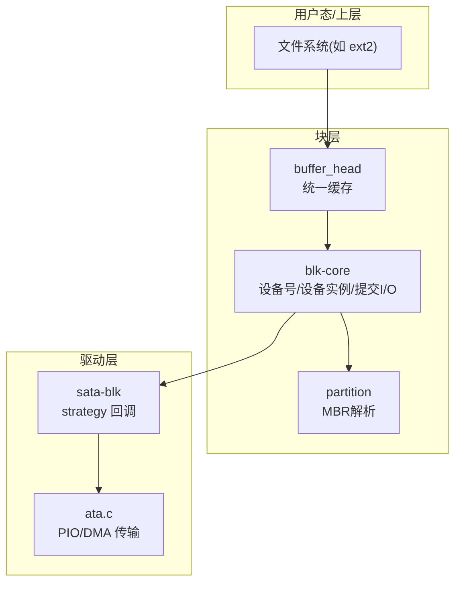
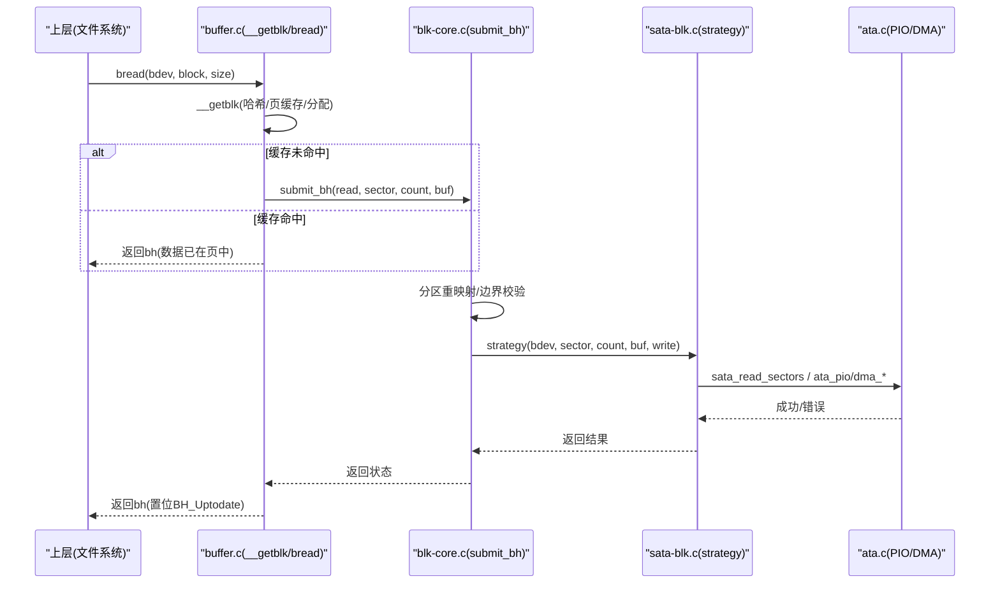
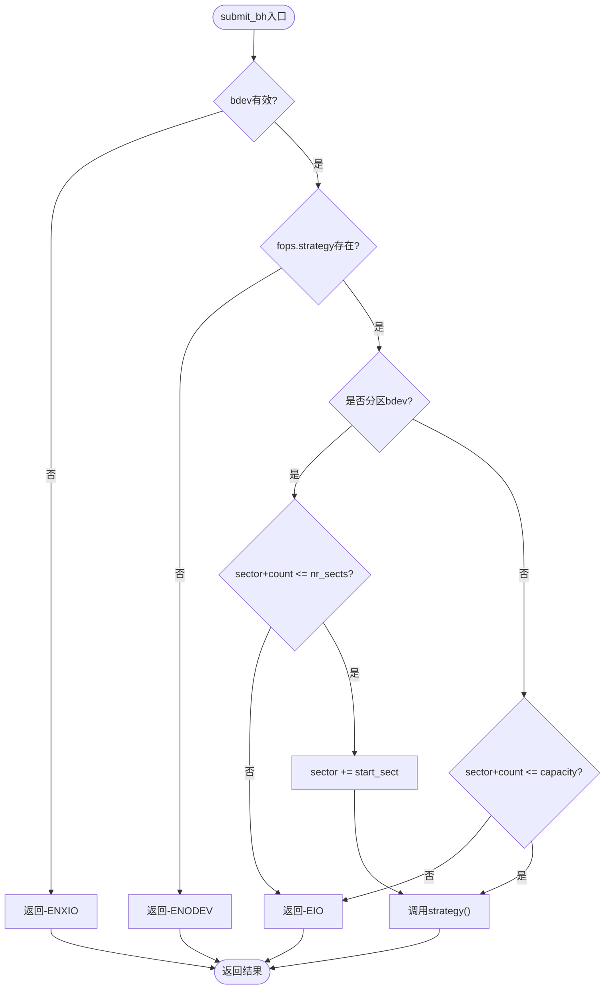
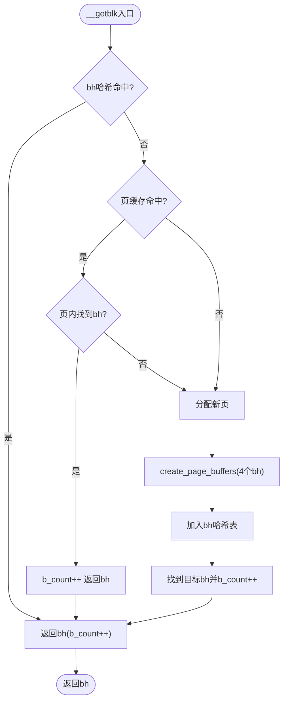
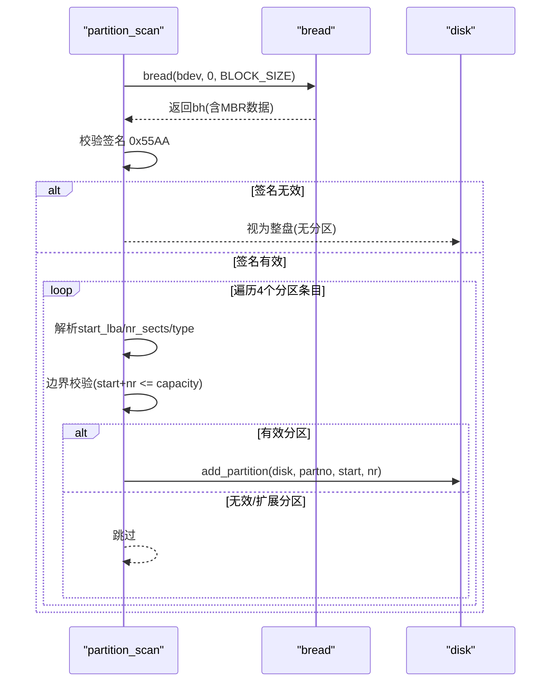
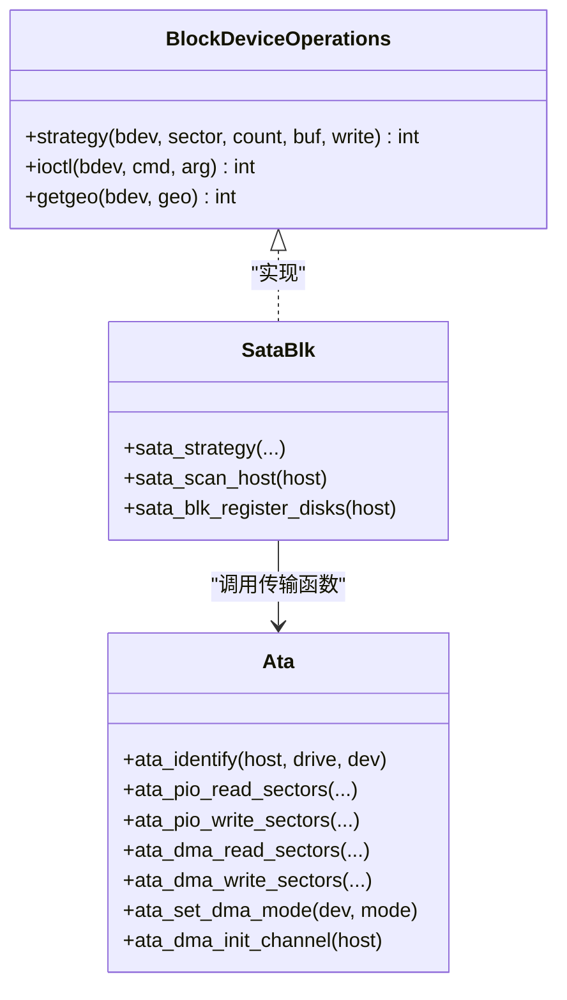
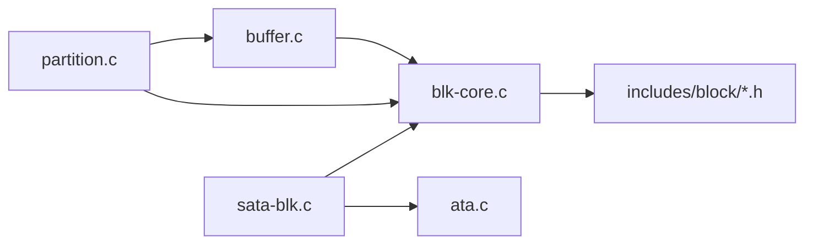

# 块设备子系统

<cite>
**本文引用的文件**
- [includes/block/blkdev.h](file://includes/block/blkdev.h)
- [includes/block/buffer_head.h](file://includes/block/buffer_head.h)
- [kernel/block/blk-core.c](file://kernel/block/blk-core.c)
- [kernel/block/buffer.c](file://kernel/block/buffer.c)
- [kernel/block/partition.c](file://kernel/block/partition.c)
- [kernel/sata/sata-blk.c](file://kernel/sata/sata-blk.c)
- [includes/ata/ata.h](file://includes/ata/ata.h)
- [kernel/ata/ata.c](file://kernel/ata/ata.c)
</cite>

## 目录
1. [简介](#简介)
2. [项目结构](#项目结构)
3. [核心组件](#核心组件)
4. [架构总览](#架构总览)
5. [详细组件分析](#详细组件分析)
6. [依赖关系分析](#依赖关系分析)
7. [性能考量](#性能考量)
8. [故障排查指南](#故障排查指南)
9. [结论](#结论)
10. [附录](#附录)

## 简介
本文件系统为 LulaOS 的块设备子系统，提供统一的块 I/O 抽象、页缓存与缓冲区头（buffer_head）合并的统一缓存层、MBR 分区解析以及 ATA/SATA 驱动接入。其设计参考 Linux 2.6.20 的块设备模型，但做了简化：无请求队列与电梯调度、无 bio 层，submit_bh 直接同步调用驱动的 strategy 回调；分区语义通过相对扇区到整盘 LBA 的重映射实现，驱动无需感知分区存在。

## 项目结构
块设备子系统由以下关键部分组成：
- 抽象接口与数据结构：includes/block/blkdev.h、includes/block/buffer_head.h
- 核心层：kernel/block/blk-core.c（设备号注册、gendisk 管理、bdget/bdput、submit_bh）
- 统一缓存：kernel/block/buffer.c（__getblk、bread、bwrite、LRU 记录）
- 分区解析：kernel/block/partition.c（读取 MBR、创建分区 block_device）
- 驱动接入：kernel/sata/sata-blk.c（SATA 磁盘注册与 strategy）、kernel/ata/ata.c（PIO/DMA 传输）

图表来源
- [kernel/block/blk-core.c:1-120](file://kernel/block/blk-core.c#L1-L120)
- [kernel/block/buffer.c:1-60](file://kernel/block/buffer.c#L1-L60)
- [kernel/block/partition.c:1-40](file://kernel/block/partition.c#L1-L40)
- [kernel/sata/sata-blk.c:1-40](file://kernel/sata/sata-blk.c#L1-L40)
- [kernel/ata/ata.c:1-40](file://kernel/ata/ata.c#L1-L40)

章节来源
- [kernel/block/blk-core.c:1-120](file://kernel/block/blk-core.c#L1-L120)
- [kernel/block/buffer.c:1-60](file://kernel/block/buffer.c#L1-L60)
- [kernel/block/partition.c:1-40](file://kernel/block/partition.c#L1-L40)
- [kernel/sata/sata-blk.c:1-40](file://kernel/sata/sata-blk.c#L1-L40)
- [kernel/ata/ata.c:1-40](file://kernel/ata/ata.c#L1-L40)

## 核心组件
- 块设备抽象与生命周期
  - gendisk：描述一个物理磁盘（主设备号、容量、操作表等）
  - block_device：已打开的设备实例（整盘或分区），持有 bd_disk 反向引用与可选的 hd_struct
  - block_device_operations：驱动实现的 strategy/ioctl/getgeo
- 统一缓存（page cache + buffer_head）
  - page_hashtable：按 (dev, page_index) 索引页
  - bh_hashtable：按 (dev, blocknr) 快速查找 buffer_head
  - LRU：b_count=0 的 bh 链入等待回收（当前仅记录）
- 分区解析
  - 读取 LBA0，校验 0x55AA，遍历 4 个主分区条目，调用 add_partition 创建分区 bdev
- 驱动接入
  - SATA：注册主设备号 8，枚举端口，填充 gendisk，add_disk + partition_scan
  - ATA：实现 PIO/DMA 传输，供策略回调使用

章节来源
- [includes/block/blkdev.h:23-154](file://includes/block/blkdev.h#L23-L154)
- [includes/block/buffer_head.h:35-122](file://includes/block/buffer_head.h#L35-L122)
- [kernel/block/blk-core.c:169-247](file://kernel/block/blk-core.c#L169-L247)
- [kernel/block/buffer.c:42-72](file://kernel/block/buffer.c#L42-L72)
- [kernel/block/partition.c:63-83](file://kernel/block/partition.c#L63-L83)
- [kernel/sata/sata-blk.c:27-91](file://kernel/sata/sata-blk.c#L27-L91)
- [includes/ata/ata.h:234-341](file://includes/ata/ata.h#L234-L341)

## 架构总览
块 I/O 从上层发起，经统一缓存命中或分配数据页，再通过 submit_bh 进入块层，完成分区重映射后调用驱动的 strategy，最终落到 ATA/SATA 传输层。

图表来源
- [kernel/block/buffer.c:315-483](file://kernel/block/buffer.c#L315-L483)
- [kernel/block/blk-core.c:433-506](file://kernel/block/blk-core.c#L433-L506)
- [kernel/sata/sata-blk.c:50-76](file://kernel/sata/sata-blk.c#L50-L76)
- [kernel/ata/ata.c:396-465](file://kernel/ata/ata.c#L396-L465)

## 详细组件分析

### 块设备核心（blk-core.c）
- 设备号注册与注销
  - register_blkdev：支持动态/静态主设备号注册，维护 blkdevs[]
  - unregister_blkdev：名称校验后清理槽位
- gendisk 管理
  - add_disk：校验 major，链入 disk_list，为整盘创建 block_device
  - del_gendisk：移除并释放整盘 bdev
- 分区管理
  - add_partition：分配 hd_struct，创建分区 bdev，建立 bd_part 指向
  - delete_partition：按 (major, first_minor+partno) 查找并释放
- 设备实例生命周期
  - bdget：按 dev_t 查找或分配 bdev，维护 bd_openers
  - bdput：减少打开计数，归零时释放
- 提交 I/O
  - submit_bh：校验 bdev/fops，分区重映射（sector += start_sect），边界检查，调用 strategy

图表来源
- [kernel/block/blk-core.c:433-506](file://kernel/block/blk-core.c#L433-L506)

章节来源
- [kernel/block/blk-core.c:93-167](file://kernel/block/blk-core.c#L93-L167)
- [kernel/block/blk-core.c:169-247](file://kernel/block/blk-core.c#L169-L247)
- [kernel/block/blk-core.c:248-328](file://kernel/block/blk-core.c#L248-L328)
- [kernel/block/blk-core.c:330-431](file://kernel/block/blk-core.c#L330-L431)
- [kernel/block/blk-core.c:433-506](file://kernel/block/blk-core.c#L433-L506)

### 统一缓存（buffer.c）
- 哈希表与 LRU
  - page_hashtable：按 (dev, index) 索引页
  - bh_hashtable：按 (dev, blocknr) 索引 bh，__getblk 快速路径
  - lru_list：b_count=0 的 bh 链入（暂不回收）
- 页缓存操作
  - page_cache_lookup/add/remove：增删查页，维护引用计数
- buffer_head 操作
  - create_page_buffers：为一页创建 BLOCKS_PER_PAGE 个 bh，环形链表串联
  - __getblk：三层查找（bh哈希→页缓存→分配新页）
  - bread：若未命中则触发读 I/O，成功后置位 BH_Uptodate
  - bwrite：写回单个 bh，清除脏标志
  - brelse/bforget：释放引用或强制丢弃（用于错误路径）
  - mark_buffer_dirty/sync_buffers：标记脏与批量写回

图表来源
- [kernel/block/buffer.c:315-408](file://kernel/block/buffer.c#L315-L408)

章节来源
- [kernel/block/buffer.c:42-72](file://kernel/block/buffer.c#L42-L72)
- [kernel/block/buffer.c:98-145](file://kernel/block/buffer.c#L98-L145)
- [kernel/block/buffer.c:147-291](file://kernel/block/buffer.c#L147-L291)
- [kernel/block/buffer.c:293-313](file://kernel/block/buffer.c#L293-L313)
- [kernel/block/buffer.c:315-408](file://kernel/block/buffer.c#L315-L408)
- [kernel/block/buffer.c:410-546](file://kernel/block/buffer.c#L410-L546)
- [kernel/block/buffer.c:548-669](file://kernel/block/buffer.c#L548-L669)

### 分区解析（partition.c）
- 读取 LBA0（block 0，覆盖前两个扇区），定位 MBR
- 校验签名 0x55AA，失败视为无分区盘
- 遍历 4 个主分区条目，跳过扩展分区与越界条目
- 对每个有效分区调用 add_partition，创建分区 bdev

图表来源
- [kernel/block/partition.c:63-189](file://kernel/block/partition.c#L63-L189)

章节来源
- [kernel/block/partition.c:63-189](file://kernel/block/partition.c#L63-L189)

### 驱动接入（SATA/ATA）
- SATA 块设备接入
  - 注册主设备号 8（sd），定义 sata_fops.strategy
  - sata_scan_host：扫描端口，识别磁盘类型，发送 IDENTIFY 获取容量
  - sata_blk_register_disks：填充 gendisk，add_disk + partition_scan
- ATA 传输层
  - 实现 PIO 读写、DMA 读写、IDENTIFY、SET FEATURES、PRD 表配置与中断处理

图表来源
- [kernel/sata/sata-blk.c:50-91](file://kernel/sata/sata-blk.c#L50-L91)
- [kernel/sata/sata-blk.c:148-210](file://kernel/sata/sata-blk.c#L148-L210)
- [includes/ata/ata.h:234-341](file://includes/ata/ata.h#L234-L341)
- [kernel/ata/ata.c:226-381](file://kernel/ata/ata.c#L226-L381)
- [kernel/ata/ata.c:396-539](file://kernel/ata/ata.c#L396-L539)
- [kernel/ata/ata.c:576-623](file://kernel/ata/ata.c#L576-L623)
- [kernel/ata/ata.c:626-693](file://kernel/ata/ata.c#L626-L693)
- [kernel/ata/ata.c:695-800](file://kernel/ata/ata.c#L695-L800)

章节来源
- [kernel/sata/sata-blk.c:27-130](file://kernel/sata/sata-blk.c#L27-L130)
- [kernel/sata/sata-blk.c:148-210](file://kernel/sata/sata-blk.c#L148-L210)
- [includes/ata/ata.h:234-341](file://includes/ata/ata.h#L234-L341)
- [kernel/ata/ata.c:226-381](file://kernel/ata/ata.c#L226-L381)
- [kernel/ata/ata.c:396-539](file://kernel/ata/ata.c#L396-L539)
- [kernel/ata/ata.c:576-623](file://kernel/ata/ata.c#L576-L623)
- [kernel/ata/ata.c:626-693](file://kernel/ata/ata.c#L626-L693)
- [kernel/ata/ata.c:695-800](file://kernel/ata/ata.c#L695-L800)

## 依赖关系分析
- 模块耦合
  - buffer.c 依赖 blk-core.c（submit_bh）与 mm 子系统（__alloc_pages、kmap/kunmap）
  - blk-core.c 依赖 includes/block/blkdev.h（数据结构与 API）
  - partition.c 依赖 buffer.c（bread）与 blk-core.c（add_partition）
  - sata-blk.c 依赖 blk-core.c（register_blkdev/add_disk/partition_scan）与 ata.c（传输）
- 外部依赖
  - PCI 子系统（ata-pci.c 探测，不在本范围）
  - 内存管理（slab、page cache）
  - 中断与等待队列（ata DMA 完成）

图表来源
- [kernel/block/buffer.c:32-40](file://kernel/block/buffer.c#L32-L40)
- [kernel/block/blk-core.c:26-30](file://kernel/block/blk-core.c#L26-L30)
- [kernel/block/partition.c:30-34](file://kernel/block/partition.c#L30-L34)
- [kernel/sata/sata-blk.c:21-25](file://kernel/sata/sata-blk.c#L21-L25)

章节来源
- [kernel/block/buffer.c:32-40](file://kernel/block/buffer.c#L32-L40)
- [kernel/block/blk-core.c:26-30](file://kernel/block/blk-core.c#L26-L30)
- [kernel/block/partition.c:30-34](file://kernel/block/partition.c#L30-L34)
- [kernel/sata/sata-blk.c:21-25](file://kernel/sata/sata-blk.c#L21-L25)

## 性能考量
- 缓存命中率
  - bh 哈希表作为快速路径，避免重复分配与页查找
  - 页缓存复用同一页内的多个 bh，减少页分配
- I/O 路径简化
  - 无请求队列与电梯调度，submit_bh 直接调用 strategy，降低延迟但缺少并发优化
- 高内存页（HIGHMEM）访问
  - kmap on-demand：仅在需要时临时映射，避免 pkmap 耗尽
- 分区重映射
  - 在块层完成相对扇区到整盘 LBA 转换，驱动侧保持简单

[本节为通用指导，不直接分析具体文件]

## 故障排查指南
- 常见错误码
  - -ENXIO（-6）：bdev 为空
  - -ENODEV（-19）：无 strategy 回调
  - -EIO（-5）：超出分区或磁盘容量边界
  - -EINVAL（-22）：buf 为空或 count 为 0
- 调试要点
  - 确认 block_dev_init 先于 ata_init 调用
  - 确认 register_blkdev 成功且 major 未被占用
  - 检查 add_disk 后是否调用 partition_scan
  - 对于 HIGHMEM 页，确保 kmap/kunmap 配对使用
- 日志定位
  - 关注 printk 输出中的“block:”、“buffer:”、“partition:”、“SATA:”、“ATA:”前缀

章节来源
- [kernel/block/blk-core.c:464-506](file://kernel/block/blk-core.c#L464-L506)
- [kernel/block/buffer.c:431-483](file://kernel/block/buffer.c#L431-L483)
- [kernel/block/buffer.c:499-546](file://kernel/block/buffer.c#L499-L546)
- [kernel/block/partition.c:84-189](file://kernel/block/partition.c#L84-L189)
- [kernel/sata/sata-blk.c:92-130](file://kernel/sata/sata-blk.c#L92-L130)

## 结论
该块设备子系统以简洁的同步 I/O 路径实现了块设备的统一抽象、缓存与分区支持，并通过 SATA/ATA 驱动接入硬件。其设计在保持可理解性的同时，覆盖了文件系统所需的核心能力。未来可在请求队列、bio 层与并发控制方面迭代增强，以提升吞吐与可扩展性。

[本节为总结，不直接分析具体文件]

## 附录
- 关键数据结构
  - dev_t：12 位 MAJOR + 20 位 MINOR
  - gendisk：磁盘描述符（容量、操作表、私有数据）
  - block_device：设备实例（整盘/分区，持有 bd_part）
  - hd_struct：分区描述（起始扇区、扇区数）
  - buffer_head：统一缓存中的块描述符（状态、所属页、逻辑块号、设备、哈希/LRU、引用计数）

章节来源
- [includes/block/blkdev.h:23-154](file://includes/block/blkdev.h#L23-L154)
- [includes/block/buffer_head.h:35-122](file://includes/block/buffer_head.h#L35-L122)