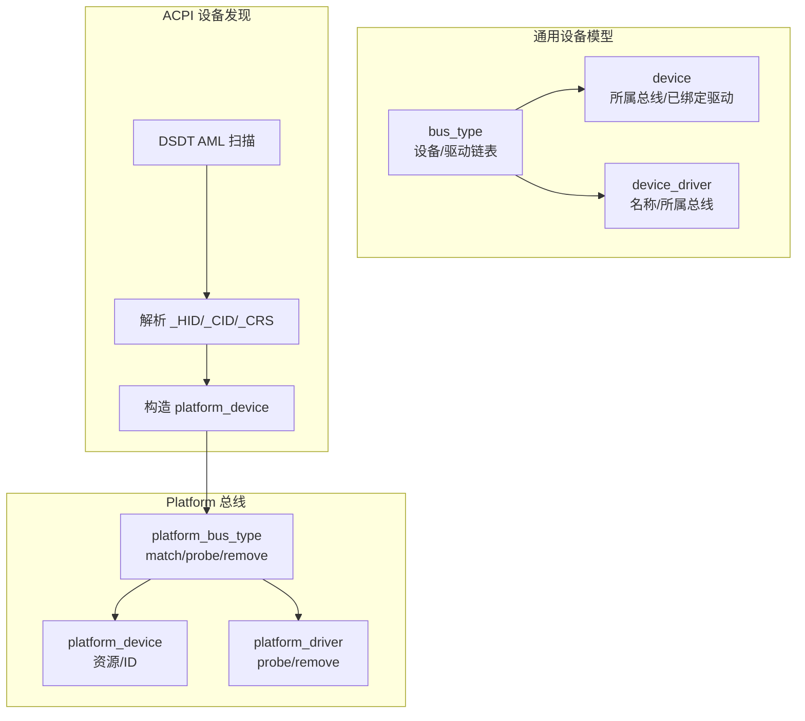
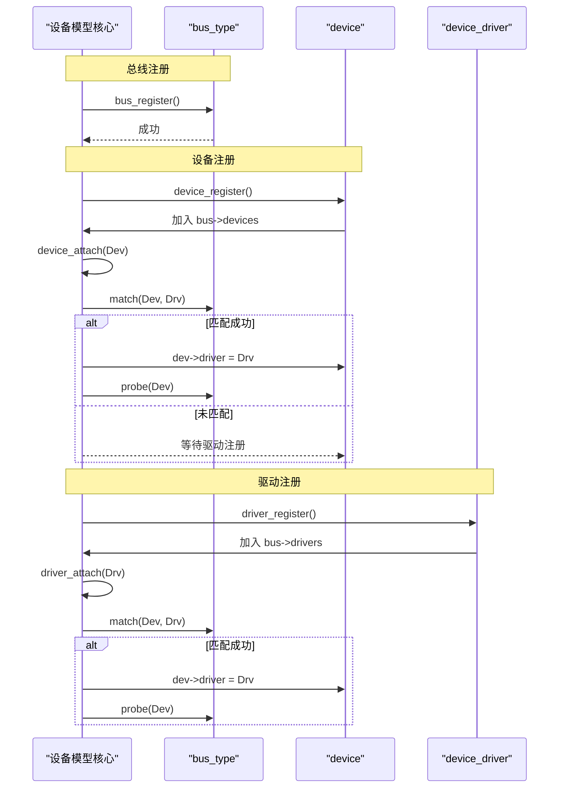
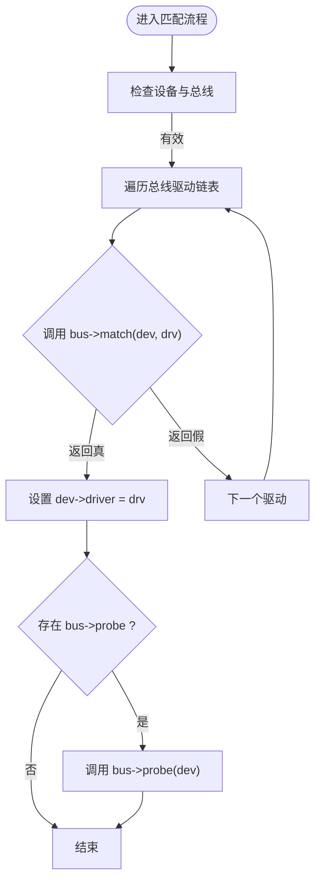
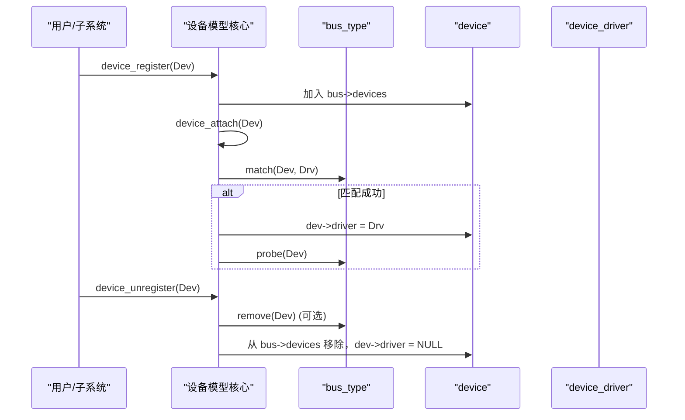
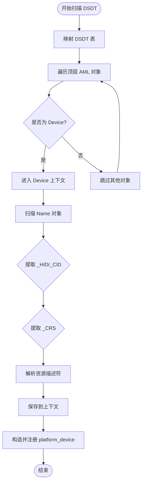
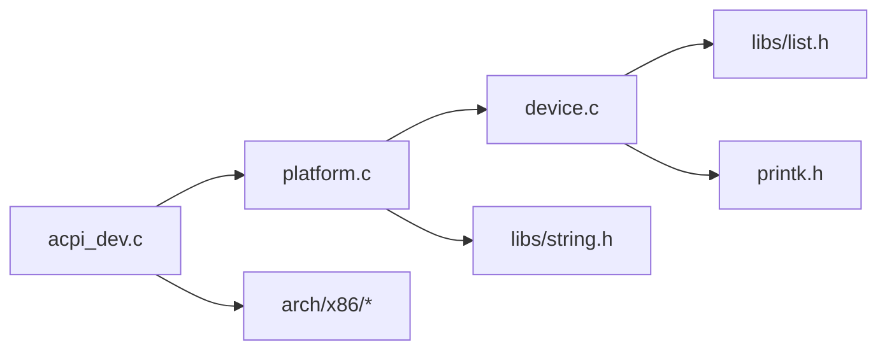

# 统一设备模型

<cite>
**本文引用的文件**
- [includes/device/device.h](file://includes/device/device.h)
- [kernel/device/device.c](file://kernel/device/device.c)
- [includes/device/platform.h](file://includes/device/platform.h)
- [kernel/device/platform.c](file://kernel/device/platform.c)
- [kernel/device/acpi_dev.c](file://kernel/device/acpi_dev.c)
- [includes/arch/x86/acpi.h](file://includes/arch/x86/acpi.h)
- [kernel/kernel.c](file://kernel/kernel.c)
</cite>

## 目录
1. [简介](#简介)
2. [项目结构](#项目结构)
3. [核心组件](#核心组件)
4. [架构总览](#架构总览)
5. [详细组件分析](#详细组件分析)
6. [依赖关系分析](#依赖关系分析)
7. [性能考量](#性能考量)
8. [故障排查指南](#故障排查指南)
9. [结论](#结论)
10. [附录：扩展新总线类型示例](#附录：扩展新总线类型示例)

## 简介
本文件为 LulaOS 统一设备模型的完整技术文档，围绕 bus_type、device、device_driver 三个核心结构体展开，解释其设计理念与相互关系；详细说明设备-驱动匹配机制（match 回调的实现与调用时机）、设备生命周期管理（注册、注销、绑定、解绑）；提供扩展新总线类型的步骤与要点；说明 container_of 宏在设备模型中的应用；并深入解析 ACPI DSDT 设备树扫描与 Platform 设备注册流程。

## 项目结构
LulaOS 的统一设备模型位于 device 子系统，核心由“通用设备模型”和“Platform 总线实现”两部分组成，并通过 ACPI 扫描将固件描述的设备转化为 Platform 设备，最终与具体驱动完成匹配与初始化。

图表来源
- [includes/device/device.h:26-66](file://includes/device/device.h#L26-L66)
- [kernel/device/device.c:22-87](file://kernel/device/device.c#L22-L87)
- [kernel/device/platform.c:15-77](file://kernel/device/platform.c#L15-L77)
- [kernel/device/acpi_dev.c:632-797](file://kernel/device/acpi_dev.c#L632-L797)

章节来源
- [kernel/kernel.c:95-114](file://kernel/kernel.c#L95-L114)

## 核心组件
- bus_type：总线类型抽象，维护该总线下的设备与驱动链表，并提供 match/probe/remove 回调接口。
- device：设备基础结构，包含名称、所属总线、总线节点、已绑定驱动指针及驱动私有数据。
- device_driver：驱动基础结构，包含名称、所属总线、总线节点。

三者通过链表组织到对应总线实例中，形成“总线—设备—驱动”的三元关系。设备与驱动的匹配由总线提供的 match 回调决定，匹配成功后由 probe 完成驱动侧初始化。

章节来源
- [includes/device/device.h:26-66](file://includes/device/device.h#L26-L66)
- [kernel/device/device.c:22-87](file://kernel/device/device.c#L22-L87)

## 架构总览
统一设备模型的核心流程如下：
- 总线注册：创建并注册 bus_type，加入全局总线链表。
- 设备注册：将设备挂入所属总线的设备链表，尝试匹配已注册驱动。
- 驱动注册：将驱动挂入所属总线的驱动链表，尝试匹配已注册设备。
- 匹配与探测：遍历对方链表，调用 bus->match 判断是否匹配；若匹配成功，设置 dev->driver，并调用 bus->probe。
- 注销与解绑：从链表移除，必要时调用 bus->remove 清理资源。

图表来源
- [kernel/device/device.c:22-87](file://kernel/device/device.c#L22-L87)
- [kernel/device/device.c:94-139](file://kernel/device/device.c#L94-L139)

章节来源
- [kernel/device/device.c:22-165](file://kernel/device/device.c#L22-L165)

## 详细组件分析

### 设备-驱动匹配机制
- 匹配触发时机：
  - 设备注册时：device_register -> device_attach，遍历当前总线上的所有驱动，调用 bus->match。
  - 驱动注册时：driver_register -> driver_attach，遍历当前总线上的所有设备，调用 bus->match。
- 匹配函数：
  - Platform 总线通过 platform_match 比较 platform_device.dev.name 与 device_driver.name。
- 探测函数：
  - 匹配成功后，调用 bus->probe，Platform 总线将其转发到 platform_driver->probe。

图表来源
- [kernel/device/device.c:42-87](file://kernel/device/device.c#L42-L87)
- [kernel/device/platform.c:25-50](file://kernel/device/platform.c#L25-L50)

章节来源
- [kernel/device/device.c:42-87](file://kernel/device/device.c#L42-L87)
- [kernel/device/platform.c:25-50](file://kernel/device/platform.c#L25-L50)

### 设备生命周期管理
- 注册：
  - device_register：初始化设备节点，加入总线设备链表，触发匹配。
  - driver_register：初始化驱动节点，加入总线驱动链表，触发匹配。
- 注销：
  - device_unregister：若已绑定且总线提供 remove，则调用 remove，然后从链表移除并清空驱动指针。
  - driver_unregister：遍历设备链表，解除与该驱动的所有绑定，必要时调用 remove，然后从链表移除。

图表来源
- [kernel/device/device.c:94-123](file://kernel/device/device.c#L94-L123)
- [kernel/device/device.c:147-164](file://kernel/device/device.c#L147-L164)

章节来源
- [kernel/device/device.c:94-164](file://kernel/device/device.c#L94-L164)

### container_of 宏的应用
- 作用：根据结构体内成员指针反推外层结构体地址，用于从通用 device* 获取具体总线设备（如 platform_device）。
- 应用点：
  - platform_match 中将 device* 转为 platform_device*。
  - platform_probe/remove 中将 device_driver* 转为 platform_driver*。
  - platform_find_device 中遍历设备链表并转换类型。

章节来源
- [includes/device/device.h:19-22](file://includes/device/device.h#L19-L22)
- [kernel/device/platform.c:25-62](file://kernel/device/platform.c#L25-L62)
- [kernel/device/platform.c:119-134](file://kernel/device/platform.c#L119-L134)

### 设备树管理与遍历机制（ACPI DSDT）
- 目标：扫描 DSDT 中的 AML 命名空间，提取 Device 对象的 _HID、_CID、_CRS 属性，转换为 Platform 设备并注册。
- 关键流程：
  - 映射 DSDT 表，定位 AML 起始位置。
  - 顶层遍历 AML 对象，识别 Device/Scope 等扩展操作码。
  - 解析 NameString，进入 Device 后扫描内部 Name 对象，提取 _HID/_CID/_CRS。
  - 解析 _CRS Buffer，将小型/大型资源描述符转换为 acpi_resource_info。
  - 保存设备信息到上下文，随后构造 platform_device 并调用 platform_device_register。
- 资源类型：支持 I/O Port、Memory、IRQ 等资源描述符的解析。

图表来源
- [kernel/device/acpi_dev.c:632-797](file://kernel/device/acpi_dev.c#L632-L797)
- [includes/arch/x86/acpi.h:202-240](file://includes/arch/x86/acpi.h#L202-L240)

章节来源
- [kernel/device/acpi_dev.c:632-797](file://kernel/device/acpi_dev.c#L632-L797)
- [includes/arch/x86/acpi.h:202-240](file://includes/arch/x86/acpi.h#L202-L240)

## 依赖关系分析
- 模块耦合：
  - 通用设备模型（device.c）依赖 list 与 printk，不感知具体总线细节。
  - Platform 总线（platform.c）依赖通用设备模型，实现特定 match/probe/remove。
  - ACPI 设备发现（acpi_dev.c）依赖平台总线 API，将固件描述转化为平台设备。
- 外部依赖：
  - 内存映射与页管理（arch/x86/page.h、highmem.h）用于 DSDT 映射。
  - 字符串与内存操作库（string.h、memcpy.h）用于解析与拷贝。
- 潜在循环依赖：
  - 无直接循环依赖；acpi_dev.c 仅调用 platform 总线 API，platform.c 仅调用通用设备模型 API。

图表来源
- [kernel/device/device.c:9-11](file://kernel/device/device.c#L9-L11)
- [kernel/device/platform.c:9-12](file://kernel/device/platform.c#L9-L12)
- [kernel/device/acpi_dev.c:13-20](file://kernel/device/acpi_dev.c#L13-L20)

章节来源
- [kernel/device/device.c:9-11](file://kernel/device/device.c#L9-L11)
- [kernel/device/platform.c:9-12](file://kernel/device/platform.c#L9-L12)
- [kernel/device/acpi_dev.c:13-20](file://kernel/device/acpi_dev.c#L13-L20)

## 性能考量
- 匹配复杂度：
  - device_attach/driver_attach 均为 O(N*M)，N 为设备数，M 为驱动数。对于小规模系统可接受；大规模场景建议优化索引或缓存。
- 资源解析：
  - _CRS 解析为线性扫描，注意避免重复分配与拷贝；当前实现使用静态数组，减少动态分配开销。
- 映射与访问：
  - DSDT 映射采用一次性映射，避免频繁映射/解映射；注意边界检查防止越界。
- 日志输出：
  - 大量 printk 可能影响启动速度，建议在调试阶段启用，生产环境按需裁剪。

[本节为一般性指导，不直接分析具体文件]

## 故障排查指南
- 设备未匹配：
  - 检查 platform_device.dev.name 与 platform_driver.driver.name 是否一致。
  - 确认 platform_bus_init 已在设备/驱动注册前调用。
- 驱动未探测：
  - 检查 bus->probe 是否实现；Platform 总线会转发到 platform_driver->probe。
  - 查看匹配日志，确认 match 是否返回真。
- ACPI 设备未注册：
  - 确认 DSDT 表映射成功，AML 扫描路径正确。
  - 检查 _HID/_CID/_CRS 是否存在且格式正确。
- 资源获取失败：
  - 使用 platform_get_resource 指定正确的类型与序号，确保 resource 数组已填充。

章节来源
- [kernel/device/platform.c:25-50](file://kernel/device/platform.c#L25-L50)
- [kernel/device/platform.c:119-159](file://kernel/device/platform.c#L119-L159)
- [kernel/device/acpi_dev.c:632-797](file://kernel/device/acpi_dev.c#L632-L797)

## 结论
LulaOS 的统一设备模型以 bus_type/device/device_driver 为核心，提供了可扩展的总线抽象与统一的设备-驱动匹配机制。Platform 总线通过名称匹配实现简单高效的绑定，ACPI DSDT 扫描将固件描述的设备自动注册为平台设备，从而与驱动无缝对接。整体设计清晰、职责分离良好，便于扩展新的总线类型与设备发现机制。

[本节为总结性内容，不直接分析具体文件]

## 附录：扩展新总线类型示例
以下以“示例总线”为例，展示如何扩展新的总线类型，使其遵循统一设备模型规范。

- 定义总线结构体与回调
  - 新增 bus_type 实例，实现 match/probe/remove。
  - 在 match 中实现自定义匹配逻辑（例如基于 ID、兼容列表等）。
  - 在 probe 中完成设备初始化，在 remove 中释放资源。

- 注册总线
  - 在子系统初始化时调用 bus_register 注册总线。

- 定义设备与驱动结构体
  - 设备结构体首成员嵌入 struct device。
  - 驱动结构体首成员嵌入 struct device_driver。
  - 提供 to_xxx_device/to_xxx_driver 宏，使用 container_of 进行类型转换。

- 注册设备与驱动
  - 设备注册时设置 bus 指针，调用 device_register。
  - 驱动注册时设置 bus 指针，调用 driver_register。
  - 匹配成功后，probe 将被调用。

- 参考路径
  - 总线与设备/驱动定义：[includes/device/device.h:26-66](file://includes/device/device.h#L26-L66)
  - 总线注册与匹配流程：[kernel/device/device.c:22-87](file://kernel/device/device.c#L22-L87)
  - Platform 总线实现参考：[kernel/device/platform.c:15-77](file://kernel/device/platform.c#L15-L77)

章节来源
- [includes/device/device.h:26-66](file://includes/device/device.h#L26-L66)
- [kernel/device/device.c:22-87](file://kernel/device/device.c#L22-L87)
- [kernel/device/platform.c:15-77](file://kernel/device/platform.c#L15-L77)